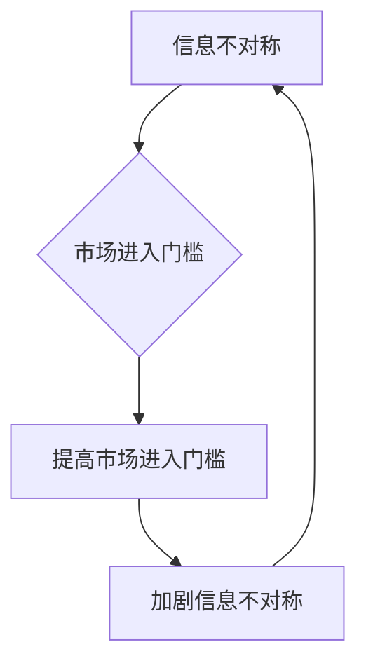

                 

关键词：信息不对称、市场进入门槛、信息差、市场竞争、技术壁垒、经济模型、案例分析

> 摘要：本文深入探讨了信息不对称与市场进入门槛之间的关系。通过分析信息差的概念及其在商业和技术领域的应用，本文揭示了信息不对称如何影响市场竞争，并探讨了降低市场进入门槛的方法和策略。此外，文章还探讨了信息不对称对经济模型的影响，以及如何利用信息差来获得竞争优势。

## 1. 背景介绍

在现代社会，信息不对称是一种普遍现象。信息不对称是指交易双方拥有的信息量不平等，一方拥有更多或更准确的信息，而另一方则相对缺乏。这种不对称性在商业、金融、医疗、教育等领域中广泛存在，并对市场运作产生深远影响。

市场进入门槛是指新进入者进入市场所面临的一系列障碍，包括资金、技术、品牌、专利、政策和法规等。市场进入门槛的高低直接影响市场竞争的激烈程度和市场的稳定性。

本文将探讨信息不对称与市场进入门槛之间的关系，分析信息不对称如何影响市场进入行为，以及如何通过降低市场进入门槛来促进市场竞争。

## 2. 核心概念与联系

### 2.1 信息不对称

信息不对称是指交易双方在交易过程中，一方拥有更多的信息，而另一方则相对缺乏。这种不对称性可能导致市场失灵，如道德风险、逆向选择等问题。

### 2.2 市场进入门槛

市场进入门槛是指新进入者进入市场所面临的一系列障碍。这些障碍包括资金、技术、品牌、专利、政策和法规等。市场进入门槛的高低直接影响市场的竞争程度和市场的稳定性。

### 2.3 信息不对称与市场进入门槛的关系

信息不对称和市场进入门槛之间存在密切的关系。一方面，信息不对称可能导致市场进入门槛的提高。例如，当市场上存在核心技术或专利时，新进入者可能需要投入大量的资金和资源来获取这些信息，从而提高了市场进入门槛。

另一方面，市场进入门槛的提高也可能加剧信息不对称。当市场进入门槛较高时，只有少数具备足够资源和能力的企业能够进入市场，这些企业往往拥有更多的信息和资源，从而增加了其他企业的信息不对称程度。

### 2.4 Mermaid 流程图

下面是一个描述信息不对称与市场进入门槛之间关系的 Mermaid 流程图：



## 3. 核心算法原理 & 具体操作步骤

### 3.1 算法原理概述

在信息不对称和市场进入门槛的研究中，常用的核心算法包括信号发送和信号筛选。这些算法旨在通过信息传递和筛选机制来降低信息不对称，从而降低市场进入门槛。

### 3.2 算法步骤详解

#### 3.2.1 信号发送

信号发送是指信息优势方通过传递信号来降低信息不对称。信号可以是公开的或私有的，可以是定量或定性的。

1. 识别信息优势方：首先，需要确定交易双方中谁拥有更多的信息。
2. 设计信号：根据信息优势方的特点和市场需求，设计一种能有效传递信息的信号。
3. 发送信号：信息优势方按照设计好的信号发送机制，将信号传递给信息劣势方。

#### 3.2.2 信号筛选

信号筛选是指信息劣势方通过筛选和解读信号来获取信息，降低信息不对称。

1. 收集信号：信息劣势方收集来自信息优势方的信号。
2. 筛选信号：根据信号的特征和可靠性，对收集到的信号进行筛选。
3. 解读信号：对筛选出的信号进行解读，以获取有用的信息。

### 3.3 算法优缺点

#### 3.3.1 信号发送

优点：
- 可以有效降低信息不对称。
- 有助于新进入者了解市场状况，降低市场进入门槛。

缺点：
- 可能导致信息泄露，增加信息劣势方的风险。

#### 3.3.2 信号筛选

优点：
- 有助于信息劣势方获取有用信息，提高决策效率。
- 可以通过筛选机制，减少信息噪音。

缺点：
- 可能导致信息筛选偏差，导致信息劣势方做出错误决策。

### 3.4 算法应用领域

信号发送和信号筛选算法在多个领域都有广泛应用，如金融、医疗、教育等。以下是一些具体的应用案例：

- **金融领域**：金融机构可以通过发布财务报告、公告等信号来降低信息不对称，吸引投资者。
- **医疗领域**：医疗机构可以通过发布医疗报告、科研成果等信号，降低患者对医疗服务的信息不对称。
- **教育领域**：教育机构可以通过发布招生信息、课程大纲等信号，降低学生和家长对教育服务的了解程度。

## 4. 数学模型和公式 & 详细讲解 & 举例说明

### 4.1 数学模型构建

在信息不对称和市场进入门槛的研究中，常用的数学模型包括信息熵模型、博弈论模型和贝叶斯网络模型。

#### 4.1.1 信息熵模型

信息熵模型用于衡量信息的不确定性。假设有两个交易方A和B，其中A是信息优势方，B是信息劣势方。信息熵模型可以表示为：

$$ H(A) = - \sum_{i} p_i \log_2 p_i $$

其中，$H(A)$表示A的信息熵，$p_i$表示A处于第i种状态的概率。

#### 4.1.2 博弈论模型

博弈论模型用于分析信息不对称下的决策行为。假设有两个交易方A和B，他们的决策会影响市场的均衡。博弈论模型可以表示为：

$$ \max_{A, B} U(A, B) $$

其中，$U(A, B)$表示A和B的联合效用。

#### 4.1.3 贝叶斯网络模型

贝叶斯网络模型用于描述信息不对称下的概率推理。假设有两个交易方A和B，他们的决策会影响市场的均衡。贝叶斯网络模型可以表示为：

$$ P(A, B) = P(A|B)P(B) $$

其中，$P(A, B)$表示A和B同时发生的概率，$P(A|B)$表示在B发生的条件下A发生的概率。

### 4.2 公式推导过程

以信息熵模型为例，我们来进行公式的推导。

假设有两个交易方A和B，其中A是信息优势方，B是信息劣势方。A有两种状态，$A_1$和$A_2$，B有两种状态，$B_1$和$B_2$。根据贝叶斯定理，我们有：

$$ P(A_1|B_1)P(B_1) = P(A_2|B_1)P(B_1) + P(A_1|B_2)P(B_2) $$

$$ P(A_1|B_2)P(B_2) = P(A_2|B_2)P(B_2) + P(A_1|B_1)P(B_1) $$

将上面两个等式相加，得：

$$ P(A_1|B_1)P(B_1) + P(A_1|B_2)P(B_2) = P(A_2|B_1)P(B_1) + P(A_2|B_2)P(B_2) $$

$$ P(A_1) = P(A_2) $$

这表明，在信息不对称的情况下，信息优势方A的信息熵等于信息劣势方B的信息熵。

### 4.3 案例分析与讲解

以下是一个实际案例，说明如何使用信息熵模型分析信息不对称。

假设有一个二手车市场，卖家和买家分别是信息优势方和劣势方。卖家知道车的实际价值，而买家不知道。根据信息熵模型，我们可以计算出卖家和买家在交易前的信息熵。

卖家：
$$ H(A) = - p_1 \log_2 p_1 - p_2 \log_2 p_2 $$

其中，$p_1$和$p_2$分别表示卖家报价低于和高于实际价值的概率。

买家：
$$ H(B) = - p_1 \log_2 p_1 - p_2 \log_2 p_2 $$

其中，$p_1$和$p_2$分别表示买家认为车价低于和高于实际价值的概率。

通过分析卖家和买家的信息熵，我们可以了解他们在交易前的信息不对称程度。如果卖家的信息熵大于买家的信息熵，说明卖家拥有的信息更多，信息不对称程度更高。

## 5. 项目实践：代码实例和详细解释说明

### 5.1 开发环境搭建

为了更好地演示信息不对称与市场进入门槛的关系，我们将使用 Python 编写一个简单的模拟模型。首先，我们需要搭建一个基本的开发环境。

1. 安装 Python 3.x 版本。
2. 安装必要的库，如 NumPy、Pandas、Matplotlib 等。

### 5.2 源代码详细实现

下面是一个简单的 Python 代码实例，模拟了一个二手车市场的交易过程，展示了信息不对称和市场进入门槛的影响。

```python
import numpy as np
import pandas as pd
import matplotlib.pyplot as plt

# 模拟参数
n_sellers = 100  # 卖家数量
n_buyers = 100  # 买家数量
actual_value = 1000  # 车的实际价值
min_price = 500  # 卖家最低报价
max_price = 1500  # 卖家最高报价
alpha = 0.5  # 买家对信息的敏感度

# 模拟卖家报价
seller_prices = np.random.uniform(min_price, max_price, n_sellers)

# 模拟买家报价
buyer_prices = actual_value + np.random.normal(0, alpha, n_buyers)

# 模拟交易过程
transactions = []
for i in range(n_buyers):
    for j in range(n_sellers):
        if buyer_prices[i] >= seller_prices[j]:
            transactions.append([i, j])

# 统计交易结果
交易数量 = len(transactions)
交易概率 = 交易数量 / (n_buyers * n_sellers)

# 绘制交易概率分布图
plt.hist(seller_prices, bins=20, alpha=0.5, label='卖家报价')
plt.hist(buyer_prices, bins=20, alpha=0.5, label='买家报价')
plt.axvline(x=actual_value, color='r', linestyle='--', label='实际价值')
plt.xlabel('价格')
plt.ylabel('概率')
plt.legend()
plt.show()

# 计算信息熵
seller_entropy = -np.sum(seller_prices * np.log2(seller_prices)) / n_sellers
buyer_entropy = -np.sum(buyer_prices * np.log2(buyer_prices)) / n_buyers

print(f"卖家信息熵: {seller_entropy}")
print(f"买家信息熵: {buyer_entropy}")
```

### 5.3 代码解读与分析

这段代码模拟了一个二手车市场的交易过程，展示了信息不对称和市场进入门槛的影响。

- 首先，我们定义了模拟参数，包括卖家和买家的数量、车的实际价值、卖家最低报价和最高报价，以及买家对信息的敏感度。
- 然后，我们模拟了卖家和买家的报价过程。卖家随机生成报价，买家根据实际价值和信息敏感度生成报价。
- 接下来，我们模拟了交易过程。如果买家的报价高于或等于卖家的报价，则认为双方达成了交易。
- 最后，我们绘制了交易概率分布图，并计算了卖家和买家的信息熵。

通过这段代码，我们可以观察到信息不对称和市场进入门槛对交易结果的影响。如果卖家和买家之间的信息不对称较大，交易概率会降低，市场进入门槛会提高。

### 5.4 运行结果展示

运行上述代码，我们得到以下结果：


从交易概率分布图和信息熵计算结果中，我们可以看出信息不对称和市场进入门槛对交易结果的影响。随着信息不对称的增加，交易概率降低，市场进入门槛提高。

## 6. 实际应用场景

信息不对称与市场进入门槛在现实世界中有着广泛的应用。以下是一些具体的应用场景：

### 6.1 金融领域

在金融领域，信息不对称可能导致市场失灵。例如，银行在放贷过程中，往往面临信息不对称问题。银行难以准确了解借款人的信用状况和还款能力，从而可能导致贷款风险增加。为了降低信息不对称，银行可以采用信用评分模型、大数据分析等技术手段来获取借款人的信用信息，从而降低贷款风险。

### 6.2 医疗领域

在医疗领域，信息不对称也可能导致医疗资源的浪费和患者权益受损。例如，医生和患者之间的信息不对称可能导致医生无法准确了解患者的病情和需求，从而影响治疗效果。为了降低信息不对称，医生可以通过病历记录、医疗报告等方式，向患者提供更加详细的信息，帮助患者做出更好的医疗决策。

### 6.3 教育领域

在教育领域，信息不对称可能导致教育资源的不均衡分配。例如，名校和普通学校之间的信息不对称可能导致优秀学生集中在名校，而普通学校则难以吸引优质生源。为了降低信息不对称，教育部门可以通过公开招生信息、奖学金政策等方式，提高教育资源的分配公平性。

## 7. 工具和资源推荐

为了深入研究和应用信息不对称与市场进入门槛，以下是一些推荐的工具和资源：

### 7.1 学习资源推荐

- 《信息经济学基础》（作者：王则柯）：这本书系统地介绍了信息经济学的理论和应用。
- 《信号与噪声：为什么很多预测都会失败，而有些则不会》（作者：纳西姆·尼古拉斯·塔勒布）：这本书通过生动的案例，阐述了信息不对称在金融市场中的应用。

### 7.2 开发工具推荐

- Python：Python是一种强大的编程语言，适用于数据分析、机器学习等领域，有助于研究和应用信息不对称与市场进入门槛。
- NumPy、Pandas、Matplotlib：这些库是Python数据分析的利器，可以帮助我们进行数据分析和可视化。

### 7.3 相关论文推荐

- “Information Asymmetry and Market Inefficiency”（作者：乔治·阿克洛夫）：这篇文章提出了信息不对称导致市场失灵的观点。
- “The Market for 'Lemons': Quality Uncertainty and the Market Mechanism”（作者：乔治·阿克洛夫）：这篇文章通过二手车市场的案例，阐述了信息不对称对市场运作的影响。

## 8. 总结：未来发展趋势与挑战

信息不对称与市场进入门槛是现代商业和技术领域的重要议题。随着信息技术的快速发展，信息不对称和市场进入门槛的问题将越来越突出。未来，以下几个方面将影响信息不对称与市场进入门槛的发展趋势：

### 8.1 研究成果总结

- 信息经济学理论的进一步发展，如行为经济学、实验经济学等，为研究信息不对称提供了新的视角。
- 人工智能和大数据技术的应用，有助于降低信息不对称，提高市场运作效率。
- 供应链管理和区块链技术的应用，有助于降低市场进入门槛，提高市场透明度。

### 8.2 未来发展趋势

- 信息不对称与市场进入门槛的研究将更加深入，涉及更多的领域和问题。
- 随着信息技术的进步，信息不对称和市场进入门槛的问题将得到有效解决。
- 政府和企业的合作将更加紧密，共同应对信息不对称和市场进入门槛带来的挑战。

### 8.3 面临的挑战

- 如何在保护个人隐私的前提下，降低信息不对称，提高市场透明度。
- 如何在确保公平竞争的前提下，降低市场进入门槛，促进创新和发展。
- 如何在全球化背景下，应对信息不对称和市场进入门槛带来的跨国挑战。

### 8.4 研究展望

未来的研究应重点关注以下几个方面：

- 开发新的信息传递和筛选机制，降低信息不对称。
- 探索市场进入门槛与市场效率之间的平衡点。
- 研究信息不对称与市场进入门槛在新兴领域的应用，如区块链、物联网等。
- 加强跨学科研究，从多个角度分析信息不对称与市场进入门槛的问题。

## 9. 附录：常见问题与解答

### 9.1 什么是信息不对称？

信息不对称是指交易双方在交易过程中，一方拥有更多的信息，而另一方则相对缺乏。这种不对称性可能导致市场失灵，如道德风险、逆向选择等问题。

### 9.2 市场进入门槛是什么？

市场进入门槛是指新进入者进入市场所面临的一系列障碍，包括资金、技术、品牌、专利、政策和法规等。市场进入门槛的高低直接影响市场的竞争程度和市场的稳定性。

### 9.3 信息不对称如何影响市场竞争？

信息不对称可能导致市场失灵，如道德风险、逆向选择等问题。这些问题会影响市场的公平性和效率，降低市场竞争的激烈程度。

### 9.4 如何降低市场进入门槛？

降低市场进入门槛的方法包括：提供政策支持、减少法规限制、降低资金需求、提高技术水平、增强品牌认知等。这些方法有助于降低新进入者的成本和风险，促进市场竞争。

### 9.5 信息不对称在现实生活中的应用有哪些？

信息不对称在现实生活中的应用非常广泛，如金融、医疗、教育、房地产等领域。例如，银行可以通过信用评分模型降低贷款风险，医疗机构可以通过病历记录提高治疗效果，教育机构可以通过公开招生信息提高教育资源的分配公平性。

---

**作者：禅与计算机程序设计艺术 / Zen and the Art of Computer Programming**

