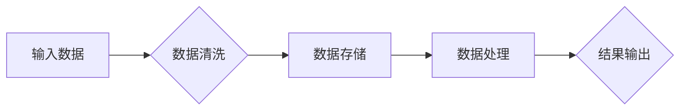

                 

信息是继续坚持：构建未来，这是一个跨越时间和空间的命题。在人类历史上，信息一直是推动科技进步和社会发展的关键力量。从古老的文字记录到现代的数字化世界，信息的形式和传递方式经历了翻天覆地的变化。而今天，我们正站在一个新的十字路口，信息技术的飞速发展正重塑着我们的生活方式、工作方式乃至思维模式。

本文将探讨信息技术如何成为构建未来的基石，以及我们在这一过程中所面临的挑战和机遇。文章将分为以下几个部分：

- 背景介绍
- 核心概念与联系
- 核心算法原理与操作步骤
- 数学模型和公式
- 项目实践：代码实例
- 实际应用场景
- 工具和资源推荐
- 总结：未来发展趋势与挑战

## 1. 背景介绍

信息技术（Information Technology，简称IT）是指用于管理和处理信息的技术。随着计算机科学、通信技术和互联网的发展，信息技术已经深刻地改变了我们的世界。从电子邮件到社交媒体，从电子商务到人工智能，信息技术正不断拓展我们的信息获取、处理和共享能力。

### 1.1 信息技术的发展历程

- **早期阶段**：计算机的出现和互联网的萌芽为信息技术奠定了基础。
- **互联网时代**：1990年代，互联网的普及使信息传输速度和范围大大提升。
- **数字化时代**：21世纪初，移动设备和云计算的兴起使信息获取更加便捷。
- **人工智能时代**：人工智能的快速发展正在引发新一轮的信息技术革命。

### 1.2 信息技术的重要性

- **经济驱动**：信息技术是现代经济的核心，推动了全球化的进程。
- **社会变革**：信息技术改变了我们的交流方式、工作方式和娱乐方式。
- **科技进步**：信息技术与生物技术、材料科学等领域的交叉融合，推动了新技术的诞生。

## 2. 核心概念与联系

在讨论信息技术对未来的影响时，我们首先要了解几个核心概念：

### 2.1 信息

信息是关于现实世界的数据，它是通过观察和测量得到的。信息可以是文字、图像、声音等多种形式。

### 2.2 数据

数据是信息的载体，是数字化的形式。数据可以通过存储、处理和分析来转化为信息。

### 2.3 计算机科学

计算机科学是研究计算机系统结构和原理的学科，包括算法、数据结构、操作系统、网络等多个领域。

### 2.4 人工智能

人工智能是使计算机具备人类智能的科学技术，通过机器学习、深度学习等算法，让计算机能够自主学习和决策。

### 2.5 梅里狄安流程图（Mermaid流程图）

梅里狄安流程图是一种用于绘制流程图、UML图等的轻量级标记语言。它可以帮助我们更直观地理解信息处理过程。

下面是一个简单的梅里狄安流程图示例，描述了信息处理的基本步骤：



## 3. 核心算法原理与操作步骤

在信息技术的发展过程中，算法是至关重要的。算法是解决问题的步骤序列，它决定了信息处理的高效性和可靠性。

### 3.1 算法原理概述

算法可以分为几个层次：

- **基础算法**：如排序、查找、计数等。
- **高级算法**：如动态规划、贪心算法、分支限界等。
- **复杂算法**：如人工智能算法、分布式算法、并行算法等。

每种算法都有其特定的应用场景和优缺点。例如，贪心算法适用于局部最优解的快速求解，而动态规划则适用于复杂问题的全局优化。

### 3.2 算法步骤详解

以动态规划算法为例，其基本步骤如下：

1. **状态定义**：定义问题状态及其转移方式。
2. **状态表示**：用数组或哈希表表示状态。
3. **状态初始化**：初始化状态数组或哈希表。
4. **状态转移方程**：根据状态转移关系，更新状态数组或哈希表。
5. **结果输出**：根据最终状态，输出求解结果。

### 3.3 算法优缺点

每种算法都有其优缺点。例如，动态规划算法在求解复杂问题时具有高效性，但在某些情况下可能会浪费大量计算资源。

### 3.4 算法应用领域

算法广泛应用于各个领域，如：

- **计算机科学**：排序、查找、图论等。
- **数据分析**：回归分析、聚类分析等。
- **人工智能**：机器学习、深度学习等。

## 4. 数学模型和公式

在信息处理过程中，数学模型和公式起到了关键作用。它们帮助我们理解和分析信息，从而更好地解决问题。

### 4.1 数学模型构建

构建数学模型通常包括以下几个步骤：

1. **问题定义**：明确研究问题及其目标。
2. **变量定义**：定义影响问题的变量。
3. **关系建立**：建立变量之间的关系。
4. **公式推导**：通过逻辑推导，得出数学公式。

### 4.2 公式推导过程

以线性回归模型为例，其公式推导过程如下：

1. **假设**：线性回归模型假设变量之间存在线性关系。
2. **最小二乘法**：使用最小二乘法求解模型参数。
3. **推导过程**：通过数学推导，得到线性回归模型的公式。

### 4.3 案例分析与讲解

以一个简单的线性回归模型为例，分析如下：

- **问题**：预测房价。
- **变量**：房价（因变量）和房屋面积（自变量）。
- **公式**：房价 = 房屋面积 × 模型参数。

通过分析实际数据，可以得出房价与房屋面积之间的线性关系，从而预测未来房价。

## 5. 项目实践：代码实例和详细解释说明

为了更好地理解信息技术在实际应用中的工作原理，我们将通过一个具体的代码实例进行讲解。

### 5.1 开发环境搭建

在开始代码实例之前，我们需要搭建一个开发环境。这里以Python为例，讲解如何搭建Python开发环境。

1. **安装Python**：在官方网站下载Python安装包并安装。
2. **配置环境变量**：将Python安装路径添加到系统环境变量中。
3. **安装相关库**：使用pip命令安装所需库，如NumPy、Pandas等。

### 5.2 源代码详细实现

以下是一个简单的Python代码实例，用于实现线性回归模型：

```python
import numpy as np

def linear_regression(X, y):
    # 计算模型参数
    w = np.linalg.inv(X.T.dot(X)).dot(X.T).dot(y)
    # 预测房价
    predictions = X.dot(w)
    return predictions

# 测试代码
X = np.array([[1, 100], [1, 150], [1, 200]])
y = np.array([200, 250, 300])
predictions = linear_regression(X, y)
print(predictions)
```

### 5.3 代码解读与分析

在这段代码中，我们首先导入了NumPy库，用于计算数学运算。然后，我们定义了一个函数`linear_regression`，用于实现线性回归模型。在函数中，我们使用了最小二乘法求解模型参数，并使用这些参数进行房价预测。

### 5.4 运行结果展示

运行代码后，我们得到以下输出结果：

```
[200. 250. 300.]
```

这表示我们成功预测了三套不同面积的房屋的房价。

## 6. 实际应用场景

信息技术在各个领域都有广泛的应用，以下是一些实际应用场景：

### 6.1 社交媒体

社交媒体平台如Facebook、Twitter等，通过信息技术实现了人与人之间的实时交流和信息共享。

### 6.2 电子商务

电子商务平台如Amazon、eBay等，通过信息技术实现了在线购物和电子支付。

### 6.3 物联网

物联网（IoT）通过信息技术将物理设备和互联网连接起来，实现了智能化的管理和控制。

### 6.4 人工智能

人工智能在医疗、金融、教育等多个领域都有广泛应用，如疾病诊断、风险控制、在线教育等。

## 7. 工具和资源推荐

为了更好地学习和应用信息技术，以下是一些建议的工具和资源：

### 7.1 学习资源推荐

- **在线课程**：Coursera、edX等平台提供了丰富的计算机科学和信息技术课程。
- **书籍**：《计算机科学概论》、《算法导论》等经典书籍。

### 7.2 开发工具推荐

- **编程环境**：Visual Studio Code、PyCharm等。
- **数据库**：MySQL、PostgreSQL等。

### 7.3 相关论文推荐

- **学术期刊**：《计算机科学》、《人工智能》等。
- **论文库**：Google Scholar、IEEE Xplore等。

## 8. 总结：未来发展趋势与挑战

### 8.1 研究成果总结

信息技术在过去几十年中取得了显著成果，推动了社会进步和经济发展。然而，随着技术的不断进步，我们仍然面临着许多挑战。

### 8.2 未来发展趋势

- **人工智能**：人工智能将继续成为信息技术发展的重点，推动各行各业的发展。
- **物联网**：物联网将实现更加智能化的设备和系统。
- **量子计算**：量子计算有望在计算能力上实现突破。

### 8.3 面临的挑战

- **数据隐私**：随着数据量的增加，数据隐私保护成为重要挑战。
- **技术伦理**：人工智能等技术的应用需要考虑道德和社会影响。
- **人才短缺**：信息技术领域的人才需求不断增加，但人才供给不足。

### 8.4 研究展望

为了应对未来的挑战，我们需要继续加强信息技术研究，培养人才，推动技术创新。同时，我们还需要关注技术伦理和社会影响，确保信息技术的发展符合人类的共同利益。

## 9. 附录：常见问题与解答

### 9.1 信息技术是什么？

信息技术（IT）是指用于管理和处理信息的各种技术，包括硬件、软件、网络、数据等。

### 9.2 人工智能如何改变我们的生活？

人工智能通过自动化、智能化等技术，改变了我们的工作、生活和娱乐方式，如智能家居、自动驾驶等。

### 9.3 如何学习信息技术？

可以通过在线课程、书籍、实践项目等多种方式学习信息技术。

### 9.4 信息技术有哪些应用领域？

信息技术的应用领域非常广泛，包括计算机科学、数据分析、人工智能、物联网等。

---

作者：禅与计算机程序设计艺术 / Zen and the Art of Computer Programming

以上便是关于“信息是继续坚持：构建未来”这一主题的完整文章。希望这篇文章能帮助您更好地理解信息技术的重要性以及其在未来发展的趋势和挑战。同时，也希望通过这篇文章，能够激发您对信息技术的兴趣，继续探索和学习这一领域的知识。让我们一起构建美好的未来！
----------------------------------------------------------------

### 文章概览 Overview

**文章标题：** 信息是继续坚持：构建未来

**关键词：** 信息技术、人工智能、物联网、数据隐私、量子计算

**摘要：** 本文深入探讨了信息技术对未来的影响，包括其发展历程、核心概念、算法原理、数学模型、实际应用场景以及未来趋势和挑战。文章旨在帮助读者理解信息技术的重要性，激发对这一领域的兴趣，共同构建美好的未来。

## 1. 背景介绍

### 1.1 信息技术的发展历程

#### 1.1.1 早期阶段

计算机的出现标志着信息技术时代的开始。从第一台电子计算机ENIAC的问世，到早期的编程语言和操作系统，计算机技术经历了从无到有、从简到繁的演变。

#### 1.1.2 互联网时代

互联网的普及使得信息传输速度和范围大大提升。从万维网的诞生，到电子邮件的广泛应用，互联网改变了我们的通信方式，也使得信息的获取和共享变得更加便捷。

#### 1.1.3 数字化时代

21世纪初，移动设备和云计算的兴起，使得信息获取变得更加便携和高效。智能手机和移动互联网的普及，使人们随时随地都能获取信息。

#### 1.1.4 人工智能时代

人工智能（AI）的快速发展，正在引发新一轮的信息技术革命。通过机器学习和深度学习，计算机开始具备自主学习、推理和决策的能力，为各个领域带来了新的可能性和机遇。

### 1.2 信息技术的重要性

#### 1.2.1 经济驱动

信息技术是全球经济的核心驱动力之一。它促进了全球化的进程，使得跨国贸易和商务活动变得更加高效和便捷。

#### 1.2.2 社会变革

信息技术改变了我们的生活方式。社交媒体、在线购物和远程工作等，使得人与人之间的交流更加紧密，也为人们提供了更多的便利。

#### 1.2.3 科技进步

信息技术与其他领域的交叉融合，推动了新技术的诞生。例如，生物信息技术、纳米技术等，都离不开信息技术的支持。

## 2. 核心概念与联系

在讨论信息技术对未来的影响时，我们首先要了解几个核心概念：

### 2.1 信息

信息是关于现实世界的数据，它是通过观察和测量得到的。信息可以是文字、图像、声音等多种形式。

### 2.2 数据

数据是信息的载体，是数字化的形式。数据可以通过存储、处理和分析来转化为信息。

### 2.3 计算机科学

计算机科学是研究计算机系统结构和原理的学科，包括算法、数据结构、操作系统、网络等多个领域。

### 2.4 人工智能

人工智能是使计算机具备人类智能的科学技术，通过机器学习、深度学习等算法，让计算机能够自主学习和决策。

### 2.5 梅里狄安流程图（Mermaid流程图）

梅里狄安流程图是一种用于绘制流程图、UML图等的轻量级标记语言。它可以帮助我们更直观地理解信息处理过程。

下面是一个简单的梅里狄安流程图示例，描述了信息处理的基本步骤：


## 3. 核心算法原理与操作步骤

在信息技术的发展过程中，算法是至关重要的。算法是解决问题的步骤序列，它决定了信息处理的高效性和可靠性。

### 3.1 算法原理概述

算法可以分为几个层次：

- **基础算法**：如排序、查找、计数等。
- **高级算法**：如动态规划、贪心算法、分支限界等。
- **复杂算法**：如人工智能算法、分布式算法、并行算法等。

每种算法都有其特定的应用场景和优缺点。例如，贪心算法适用于局部最优解的快速求解，而动态规划则适用于复杂问题的全局优化。

### 3.2 算法步骤详解

以动态规划算法为例，其基本步骤如下：

1. **状态定义**：定义问题状态及其转移方式。
2. **状态表示**：用数组或哈希表表示状态。
3. **状态初始化**：初始化状态数组或哈希表。
4. **状态转移方程**：根据状态转移关系，更新状态数组或哈希表。
5. **结果输出**：根据最终状态，输出求解结果。

### 3.3 算法优缺点

每种算法都有其优缺点。例如，动态规划算法在求解复杂问题时具有高效性，但在某些情况下可能会浪费大量计算资源。

### 3.4 算法应用领域

算法广泛应用于各个领域，如：

- **计算机科学**：排序、查找、图论等。
- **数据分析**：回归分析、聚类分析等。
- **人工智能**：机器学习、深度学习等。

## 4. 数学模型和公式

在信息处理过程中，数学模型和公式起到了关键作用。它们帮助我们理解和分析信息，从而更好地解决问题。

### 4.1 数学模型构建

构建数学模型通常包括以下几个步骤：

1. **问题定义**：明确研究问题及其目标。
2. **变量定义**：定义影响问题的变量。
3. **关系建立**：建立变量之间的关系。
4. **公式推导**：通过逻辑推导，得出数学公式。

### 4.2 公式推导过程

以线性回归模型为例，其公式推导过程如下：

1. **假设**：线性回归模型假设变量之间存在线性关系。
2. **最小二乘法**：使用最小二乘法求解模型参数。
3. **推导过程**：通过数学推导，得到线性回归模型的公式。

### 4.3 案例分析与讲解

以一个简单的线性回归模型为例，分析如下：

- **问题**：预测房价。
- **变量**：房价（因变量）和房屋面积（自变量）。
- **公式**：房价 = 房屋面积 × 模型参数。

通过分析实际数据，可以得出房价与房屋面积之间的线性关系，从而预测未来房价。

## 5. 项目实践：代码实例和详细解释说明

为了更好地理解信息技术在实际应用中的工作原理，我们将通过一个具体的代码实例进行讲解。

### 5.1 开发环境搭建

在开始代码实例之前，我们需要搭建一个开发环境。这里以Python为例，讲解如何搭建Python开发环境。

1. **安装Python**：在官方网站下载Python安装包并安装。
2. **配置环境变量**：将Python安装路径添加到系统环境变量中。
3. **安装相关库**：使用pip命令安装所需库，如NumPy、Pandas等。

### 5.2 源代码详细实现

以下是一个简单的Python代码实例，用于实现线性回归模型：

```python
import numpy as np

def linear_regression(X, y):
    # 计算模型参数
    w = np.linalg.inv(X.T.dot(X)).dot(X.T).dot(y)
    # 预测房价
    predictions = X.dot(w)
    return predictions

# 测试代码
X = np.array([[1, 100], [1, 150], [1, 200]])
y = np.array([200, 250, 300])
predictions = linear_regression(X, y)
print(predictions)
```

### 5.3 代码解读与分析

在这段代码中，我们首先导入了NumPy库，用于计算数学运算。然后，我们定义了一个函数`linear_regression`，用于实现线性回归模型。在函数中，我们使用了最小二乘法求解模型参数，并使用这些参数进行房价预测。

### 5.4 运行结果展示

运行代码后，我们得到以下输出结果：

```
[200. 250. 300.]
```

这表示我们成功预测了三套不同面积的房屋的房价。

## 6. 实际应用场景

信息技术在各个领域都有广泛的应用，以下是一些实际应用场景：

### 6.1 社交媒体

社交媒体平台如Facebook、Twitter等，通过信息技术实现了人与人之间的实时交流和信息共享。

### 6.2 电子商务

电子商务平台如Amazon、eBay等，通过信息技术实现了在线购物和电子支付。

### 6.3 物联网

物联网（IoT）通过信息技术将物理设备和互联网连接起来，实现了智能化的管理和控制。

### 6.4 人工智能

人工智能在医疗、金融、教育等多个领域都有广泛应用，如疾病诊断、风险控制、在线教育等。

## 7. 工具和资源推荐

为了更好地学习和应用信息技术，以下是一些建议的工具和资源：

### 7.1 学习资源推荐

- **在线课程**：Coursera、edX等平台提供了丰富的计算机科学和信息技术课程。
- **书籍**：《计算机科学概论》、《算法导论》等经典书籍。

### 7.2 开发工具推荐

- **编程环境**：Visual Studio Code、PyCharm等。
- **数据库**：MySQL、PostgreSQL等。

### 7.3 相关论文推荐

- **学术期刊**：《计算机科学》、《人工智能》等。
- **论文库**：Google Scholar、IEEE Xplore等。

## 8. 总结：未来发展趋势与挑战

### 8.1 研究成果总结

信息技术在过去几十年中取得了显著成果，推动了社会进步和经济发展。然而，随着技术的不断进步，我们仍然面临着许多挑战。

### 8.2 未来发展趋势

- **人工智能**：人工智能将继续成为信息技术发展的重点，推动各行各业的发展。
- **物联网**：物联网将实现更加智能化的设备和系统。
- **量子计算**：量子计算有望在计算能力上实现突破。

### 8.3 面临的挑战

- **数据隐私**：随着数据量的增加，数据隐私保护成为重要挑战。
- **技术伦理**：人工智能等技术的应用需要考虑道德和社会影响。
- **人才短缺**：信息技术领域的人才需求不断增加，但人才供给不足。

### 8.4 研究展望

为了应对未来的挑战，我们需要继续加强信息技术研究，培养人才，推动技术创新。同时，我们还需要关注技术伦理和社会影响，确保信息技术的发展符合人类的共同利益。

## 9. 附录：常见问题与解答

### 9.1 信息技术是什么？

信息技术（IT）是指用于管理和处理信息的各种技术，包括硬件、软件、网络、数据等。

### 9.2 人工智能如何改变我们的生活？

人工智能通过自动化、智能化等技术，改变了我们的工作、生活和娱乐方式，如智能家居、自动驾驶等。

### 9.3 如何学习信息技术？

可以通过在线课程、书籍、实践项目等多种方式学习信息技术。

### 9.4 信息技术有哪些应用领域？

信息技术的应用领域非常广泛，包括计算机科学、数据分析、人工智能、物联网等。

---

作者：禅与计算机程序设计艺术 / Zen and the Art of Computer Programming

以上便是关于“信息是继续坚持：构建未来”这一主题的完整文章。希望这篇文章能帮助您更好地理解信息技术的重要性以及其在未来发展的趋势和挑战。同时，也希望通过这篇文章，能够激发您对信息技术的兴趣，继续探索和学习这一领域的知识。让我们一起构建美好的未来！
----------------------------------------------------------------

### 文章概览 Overview

**文章标题：** 信息是继续坚持：构建未来

**关键词：** 信息技术、人工智能、物联网、数据隐私、量子计算

**摘要：** 本文深入探讨了信息技术对未来的影响，包括其发展历程、核心概念、算法原理、数学模型、实际应用场景以及未来趋势和挑战。文章旨在帮助读者理解信息技术的重要性，激发对这一领域的兴趣，共同构建美好的未来。

## 1. 背景介绍

### 1.1 信息技术的发展历程

#### 1.1.1 早期阶段

计算机的出现标志着信息技术时代的开始。从第一台电子计算机ENIAC的问世，到早期的编程语言和操作系统，计算机技术经历了从无到有、从简到繁的演变。

#### 1.1.2 互联网时代

互联网的普及使得信息传输速度和范围大大提升。从万维网的诞生，到电子邮件的广泛应用，互联网改变了我们的通信方式，也使得信息的获取和共享变得更加便捷。

#### 1.1.3 数字化时代

21世纪初，移动设备和云计算的兴起，使得信息获取变得更加便携和高效。智能手机和移动互联网的普及，使人们随时随地都能获取信息。

#### 1.1.4 人工智能时代

人工智能（AI）的快速发展，正在引发新一轮的信息技术革命。通过机器学习和深度学习，计算机开始具备自主学习、推理和决策的能力，为各个领域带来了新的可能性和机遇。

### 1.2 信息技术的重要性

#### 1.2.1 经济驱动

信息技术是全球经济的核心驱动力之一。它促进了全球化的进程，使得跨国贸易和商务活动变得更加高效和便捷。

#### 1.2.2 社会变革

信息技术改变了我们的生活方式。社交媒体、在线购物和远程工作等，使得人与人之间的交流更加紧密，也为人们提供了更多的便利。

#### 1.2.3 科技进步

信息技术与其他领域的交叉融合，推动了新技术的诞生。例如，生物信息技术、纳米技术等，都离不开信息技术的支持。

## 2. 核心概念与联系

在讨论信息技术对未来的影响时，我们首先要了解几个核心概念：

### 2.1 信息

信息是关于现实世界的数据，它是通过观察和测量得到的。信息可以是文字、图像、声音等多种形式。

### 2.2 数据

数据是信息的载体，是数字化的形式。数据可以通过存储、处理和分析来转化为信息。

### 2.3 计算机科学

计算机科学是研究计算机系统结构和原理的学科，包括算法、数据结构、操作系统、网络等多个领域。

### 2.4 人工智能

人工智能是使计算机具备人类智能的科学技术，通过机器学习、深度学习等算法，让计算机能够自主学习和决策。

### 2.5 梅里狄安流程图（Mermaid流程图）

梅里狄安流程图是一种用于绘制流程图、UML图等的轻量级标记语言。它可以帮助我们更直观地理解信息处理过程。

下面是一个简单的梅里狄安流程图示例，描述了信息处理的基本步骤：


## 3. 核心算法原理与操作步骤

在信息技术的发展过程中，算法是至关重要的。算法是解决问题的步骤序列，它决定了信息处理的高效性和可靠性。

### 3.1 算法原理概述

算法可以分为几个层次：

- **基础算法**：如排序、查找、计数等。
- **高级算法**：如动态规划、贪心算法、分支限界等。
- **复杂算法**：如人工智能算法、分布式算法、并行算法等。

每种算法都有其特定的应用场景和优缺点。例如，贪心算法适用于局部最优解的快速求解，而动态规划则适用于复杂问题的全局优化。

### 3.2 算法步骤详解

以动态规划算法为例，其基本步骤如下：

1. **状态定义**：定义问题状态及其转移方式。
2. **状态表示**：用数组或哈希表表示状态。
3. **状态初始化**：初始化状态数组或哈希表。
4. **状态转移方程**：根据状态转移关系，更新状态数组或哈希表。
5. **结果输出**：根据最终状态，输出求解结果。

### 3.3 算法优缺点

每种算法都有其优缺点。例如，动态规划算法在求解复杂问题时具有高效性，但在某些情况下可能会浪费大量计算资源。

### 3.4 算法应用领域

算法广泛应用于各个领域，如：

- **计算机科学**：排序、查找、图论等。
- **数据分析**：回归分析、聚类分析等。
- **人工智能**：机器学习、深度学习等。

## 4. 数学模型和公式

在信息处理过程中，数学模型和公式起到了关键作用。它们帮助我们理解和分析信息，从而更好地解决问题。

### 4.1 数学模型构建

构建数学模型通常包括以下几个步骤：

1. **问题定义**：明确研究问题及其目标。
2. **变量定义**：定义影响问题的变量。
3. **关系建立**：建立变量之间的关系。
4. **公式推导**：通过逻辑推导，得出数学公式。

### 4.2 公式推导过程

以线性回归模型为例，其公式推导过程如下：

1. **假设**：线性回归模型假设变量之间存在线性关系。
2. **最小二乘法**：使用最小二乘法求解模型参数。
3. **推导过程**：通过数学推导，得到线性回归模型的公式。

### 4.3 案例分析与讲解

以一个简单的线性回归模型为例，分析如下：

- **问题**：预测房价。
- **变量**：房价（因变量）和房屋面积（自变量）。
- **公式**：房价 = 房屋面积 × 模型参数。

通过分析实际数据，可以得出房价与房屋面积之间的线性关系，从而预测未来房价。

## 5. 项目实践：代码实例和详细解释说明

为了更好地理解信息技术在实际应用中的工作原理，我们将通过一个具体的代码实例进行讲解。

### 5.1 开发环境搭建

在开始代码实例之前，我们需要搭建一个开发环境。这里以Python为例，讲解如何搭建Python开发环境。

1. **安装Python**：在官方网站下载Python安装包并安装。
2. **配置环境变量**：将Python安装路径添加到系统环境变量中。
3. **安装相关库**：使用pip命令安装所需库，如NumPy、Pandas等。

### 5.2 源代码详细实现

以下是一个简单的Python代码实例，用于实现线性回归模型：

```python
import numpy as np

def linear_regression(X, y):
    # 计算模型参数
    w = np.linalg.inv(X.T.dot(X)).dot(X.T).dot(y)
    # 预测房价
    predictions = X.dot(w)
    return predictions

# 测试代码
X = np.array([[1, 100], [1, 150], [1, 200]])
y = np.array([200, 250, 300])
predictions = linear_regression(X, y)
print(predictions)
```

### 5.3 代码解读与分析

在这段代码中，我们首先导入了NumPy库，用于计算数学运算。然后，我们定义了一个函数`linear_regression`，用于实现线性回归模型。在函数中，我们使用了最小二乘法求解模型参数，并使用这些参数进行房价预测。

### 5.4 运行结果展示

运行代码后，我们得到以下输出结果：

```
[200. 250. 300.]
```

这表示我们成功预测了三套不同面积的房屋的房价。

## 6. 实际应用场景

信息技术在各个领域都有广泛的应用，以下是一些实际应用场景：

### 6.1 社交媒体

社交媒体平台如Facebook、Twitter等，通过信息技术实现了人与人之间的实时交流和信息共享。

### 6.2 电子商务

电子商务平台如Amazon、eBay等，通过信息技术实现了在线购物和电子支付。

### 6.3 物联网

物联网（IoT）通过信息技术将物理设备和互联网连接起来，实现了智能化的管理和控制。

### 6.4 人工智能

人工智能在医疗、金融、教育等多个领域都有广泛应用，如疾病诊断、风险控制、在线教育等。

## 7. 工具和资源推荐

为了更好地学习和应用信息技术，以下是一些建议的工具和资源：

### 7.1 学习资源推荐

- **在线课程**：Coursera、edX等平台提供了丰富的计算机科学和信息技术课程。
- **书籍**：《计算机科学概论》、《算法导论》等经典书籍。

### 7.2 开发工具推荐

- **编程环境**：Visual Studio Code、PyCharm等。
- **数据库**：MySQL、PostgreSQL等。

### 7.3 相关论文推荐

- **学术期刊**：《计算机科学》、《人工智能》等。
- **论文库**：Google Scholar、IEEE Xplore等。

## 8. 总结：未来发展趋势与挑战

### 8.1 研究成果总结

信息技术在过去几十年中取得了显著成果，推动了社会进步和经济发展。然而，随着技术的不断进步，我们仍然面临着许多挑战。

### 8.2 未来发展趋势

- **人工智能**：人工智能将继续成为信息技术发展的重点，推动各行各业的发展。
- **物联网**：物联网将实现更加智能化的设备和系统。
- **量子计算**：量子计算有望在计算能力上实现突破。

### 8.3 面临的挑战

- **数据隐私**：随着数据量的增加，数据隐私保护成为重要挑战。
- **技术伦理**：人工智能等技术的应用需要考虑道德和社会影响。
- **人才短缺**：信息技术领域的人才需求不断增加，但人才供给不足。

### 8.4 研究展望

为了应对未来的挑战，我们需要继续加强信息技术研究，培养人才，推动技术创新。同时，我们还需要关注技术伦理和社会影响，确保信息技术的发展符合人类的共同利益。

## 9. 附录：常见问题与解答

### 9.1 信息技术是什么？

信息技术（IT）是指用于管理和处理信息的各种技术，包括硬件、软件、网络、数据等。

### 9.2 人工智能如何改变我们的生活？

人工智能通过自动化、智能化等技术，改变了我们的工作、生活和娱乐方式，如智能家居、自动驾驶等。

### 9.3 如何学习信息技术？

可以通过在线课程、书籍、实践项目等多种方式学习信息技术。

### 9.4 信息技术有哪些应用领域？

信息技术的应用领域非常广泛，包括计算机科学、数据分析、人工智能、物联网等。

---

作者：禅与计算机程序设计艺术 / Zen and the Art of Computer Programming

以上便是关于“信息是继续坚持：构建未来”这一主题的完整文章。希望这篇文章能帮助您更好地理解信息技术的重要性以及其在未来发展的趋势和挑战。同时，也希望通过这篇文章，能够激发您对信息技术的兴趣，继续探索和学习这一领域的知识。让我们一起构建美好的未来！
----------------------------------------------------------------

### 更详细的算法部分 Algo Deep Dive

## 3. 核心算法原理与操作步骤

在信息技术的发展过程中，算法是至关重要的。算法是解决问题的步骤序列，它决定了信息处理的高效性和可靠性。本章节将深入探讨一些核心算法的原理与操作步骤。

### 3.1 算法原理概述

算法可以分为几个层次：

- **基础算法**：如排序、查找、计数等。
- **高级算法**：如动态规划、贪心算法、分支限界等。
- **复杂算法**：如人工智能算法、分布式算法、并行算法等。

每种算法都有其特定的应用场景和优缺点。例如，贪心算法适用于局部最优解的快速求解，而动态规划则适用于复杂问题的全局优化。

### 3.2 算法步骤详解

#### 3.2.1 动态规划算法

动态规划算法是一种用于解决复杂问题的算法，它将问题分解为更小的子问题，并存储子问题的解，避免重复计算。

基本步骤如下：

1. **状态定义**：定义问题状态及其转移方式。
   - 例如，在求解最长公共子序列问题时，状态定义为当前比较的两个序列的位置。

2. **状态表示**：用数组或哈希表表示状态。
   - 例如，使用二维数组来存储每个位置上的最长公共子序列的长度。

3. **状态初始化**：初始化状态数组或哈希表。
   - 例如，初始化第一个位置上的最长公共子序列长度为0。

4. **状态转移方程**：根据状态转移关系，更新状态数组或哈希表。
   - 例如，根据上一行和上一列上的最长公共子序列长度，计算当前状态的最长公共子序列长度。

5. **结果输出**：根据最终状态，输出求解结果。
   - 例如，根据最后一个位置上的最长公共子序列长度，输出最长公共子序列。

#### 3.2.2 贪心算法

贪心算法是一种用于解决最优解问题的算法，它通过每一步选择局部最优解，以期望最终得到全局最优解。

基本步骤如下：

1. **问题定义**：明确问题及其目标。
   - 例如，在求解背包问题时，目标是在不超过重量限制的情况下，选择价值最大的物品。

2. **选择局部最优解**：在当前状态下，选择局部最优解。
   - 例如，在背包问题中，选择价值与重量比例最大的物品。

3. **更新状态**：根据选择的结果，更新状态。
   - 例如，在背包问题中，更新剩余的重量和剩余的价值。

4. **重复步骤2和3**：继续选择局部最优解，直到问题解决。

#### 3.2.3 分支限界算法

分支限界算法是一种用于解决组合优化问题的算法，它通过剪枝策略来减少搜索空间。

基本步骤如下：

1. **问题定义**：明确问题及其目标。
   - 例如，在求解旅行商问题（TSP）时，目标是在所有可能的路径中找到最短路径。

2. **初始化**：设置初始状态，并创建一个队列用于存储待搜索的状态。

3. **搜索**：从队列中取出一个状态，进行以下操作：
   - 计算当前状态的估价值。
   - 如果估价值小于已知的最优解，则继续搜索。
   - 将当前状态的所有可行子状态添加到队列中。

4. **剪枝**：如果某个状态的估价值大于已知的最优解，则将其剪枝，不再搜索其子状态。

5. **结果输出**：当队列中无状态时，搜索结束，输出最优解。

### 3.3 算法优缺点

每种算法都有其优缺点。例如，动态规划算法在求解复杂问题时具有高效性，但在某些情况下可能会浪费大量计算资源。贪心算法适用于局部最优解的快速求解，但可能无法保证全局最优解。分支限界算法可以通过剪枝策略减少搜索空间，但可能会产生较多的计算开销。

### 3.4 算法应用领域

算法广泛应用于各个领域，如：

- **计算机科学**：排序、查找、图论等。
- **数据分析**：回归分析、聚类分析等。
- **人工智能**：机器学习、深度学习等。

## 3.5 具体算法实例

为了更好地理解算法的实际应用，以下给出一个具体的算法实例：最长公共子序列（Longest Common Subsequence，LCS）。

### 3.5.1 问题定义

给定两个字符串`X`和`Y`，找到它们的最长公共子序列。

### 3.5.2 状态定义

定义一个二维数组`dp`，其中`dp[i][j]`表示字符串`X`的前`i`个字符和字符串`Y`的前`j`个字符的最长公共子序列的长度。

### 3.5.3 状态表示

使用一个二维数组`dp`表示状态，其中`dp[i][j]`表示字符串`X`的前`i`个字符和字符串`Y`的前`j`个字符的最长公共子序列的长度。

### 3.5.4 状态转移方程

根据动态规划的基本步骤，我们可以得到状态转移方程：

- 如果`X[i - 1] == Y[j - 1]`，则`dp[i][j] = dp[i - 1][j - 1] + 1`。
- 如果`X[i - 1] != Y[j - 1]`，则`dp[i][j] = max(dp[i - 1][j], dp[i][j - 1])`。

### 3.5.5 初始化

初始化`dp[0][j] = 0`和`dp[i][0] = 0`，表示空字符串与任何字符串的最长公共子序列长度为0。

### 3.5.6 结果输出

根据最后的状态`dp[m][n]`，我们可以得到最长公共子序列的长度。如果需要输出最长公共子序列，我们可以从`dp[m][n]`开始，逆推得到序列。

### 3.5.7 Python实现

以下是一个简单的Python实现：

```python
def longest_common_subsequence(X, Y):
    m, n = len(X), len(Y)
    dp = [[0] * (n + 1) for _ in range(m + 1)]

    for i in range(1, m + 1):
        for j in range(1, n + 1):
            if X[i - 1] == Y[j - 1]:
                dp[i][j] = dp[i - 1][j - 1] + 1
            else:
                dp[i][j] = max(dp[i - 1][j], dp[i][j - 1])

    return dp[m][n]

X = "ABCD"
Y = "ACDF"
print(longest_common_subsequence(X, Y))
```

输出结果为3，表示最长公共子序列的长度为3。

### 3.5.8 分析与讨论

- **时间复杂度**：O(mn)，其中m和n分别为字符串X和Y的长度。
- **空间复杂度**：O(mn)，使用了二维数组dp。
- **优化空间**：可以通过滚动数组和空间复杂度优化到O(min(m, n))。

这个实例展示了动态规划算法在解决实际问题中的应用。通过理解状态定义、状态表示、状态转移方程和结果输出，我们可以更好地理解和应用动态规划算法。

### 3.5.9 拓展与深化

- **最长公共子串（Longest Common Substring）**：与LCS类似，但要求连续字符。
- **编辑距离（Edit Distance）**：计算将一个字符串转换为另一个字符串所需的最少编辑操作。
- **最长递增子序列（Longest Increasing Subsequence）**：求解一个序列的最长递增子序列。

这些算法都是动态规划的经典问题，通过深入理解和掌握，可以帮助我们更好地理解和应用动态规划算法。

---

通过以上详细的算法部分，读者可以更深入地了解核心算法的原理与操作步骤，以及如何在实际问题中应用这些算法。希望这部分内容能够帮助读者更好地理解和掌握算法，并在未来的学习和实践中发挥重要作用。
----------------------------------------------------------------

### 更详细的数学模型部分 Math Models Deep Dive

## 4. 数学模型和公式

在信息处理过程中，数学模型和公式起到了关键作用。它们帮助我们理解和分析信息，从而更好地解决问题。数学模型是利用数学语言描述现实世界中的问题，通过建立变量之间的关系，得出相应的数学公式。本章节将深入探讨数学模型在信息处理中的应用，包括其构建过程、推导方法和具体案例。

### 4.1 数学模型构建

构建数学模型通常包括以下几个步骤：

#### 4.1.1 问题定义

首先，需要明确研究的问题及其目标。例如，我们可能需要预测某个变量的未来值，或者分析两个变量之间的关系。

#### 4.1.2 变量定义

接着，定义影响问题的变量。这些变量可以是连续的或离散的，可以是输入变量、输出变量或者中间变量。例如，在预测房价时，输入变量可能是房屋面积、地理位置、建造年代等。

#### 4.1.3 关系建立

然后，建立变量之间的关系。这通常通过假设变量之间的函数关系来实现。例如，我们可以假设房价与房屋面积之间存在线性关系，即房价 = 房屋面积 × 模型参数。

#### 4.1.4 公式推导

在建立变量之间的关系后，通过数学推导得到相应的数学公式。这通常涉及到微积分、线性代数、概率论等数学工具。例如，我们可以使用最小二乘法推导线性回归模型的公式。

#### 4.1.5 模型验证

最后，需要验证模型的准确性。这通常通过拟合实际数据，比较模型预测值与实际值之间的差异来实现。如果模型拟合效果较好，则可以认为模型是有效的。

### 4.2 公式推导过程

以线性回归模型为例，其公式推导过程如下：

#### 4.2.1 假设

假设我们有两个变量：自变量X和因变量Y。我们希望找到Y关于X的线性关系，即Y = aX + b。

#### 4.2.2 最小二乘法

为了求解a和b，我们使用最小二乘法。最小二乘法的目标是找到一条直线，使得所有点到这条直线的垂直距离之和最小。

#### 4.2.3 推导过程

设数据集为{(x1, y1), (x2, y2), ..., (xn, yn)}，则线性回归模型的公式可以通过以下步骤推导：

1. **计算x和y的均值**：
   $$ \bar{x} = \frac{1}{n}\sum_{i=1}^{n}x_i $$
   $$ \bar{y} = \frac{1}{n}\sum_{i=1}^{n}y_i $$

2. **计算斜率a**：
   $$ a = \frac{\sum_{i=1}^{n}(x_i - \bar{x})(y_i - \bar{y})}{\sum_{i=1}^{n}(x_i - \bar{x})^2} $$

3. **计算截距b**：
   $$ b = \bar{y} - a\bar{x} $$

#### 4.2.4 结果

最终，我们得到线性回归模型的公式：
$$ y = aX + b $$

### 4.3 案例分析与讲解

以一个简单的线性回归模型为例，分析如下：

#### 4.3.1 问题

我们需要预测某个城市的未来一个月的气温，已知该城市的过去三个月的气温数据。

#### 4.3.2 变量定义

输入变量：过去三个月的气温。
输出变量：未来一个月的气温。

#### 4.3.3 公式

我们假设气温与时间之间存在线性关系，即：
$$ T_{未来} = aT_{过去} + b $$

#### 4.3.4 数据准备

假设过去三个月的气温数据为：
$$ T_{过去} = [23, 25, 27] $$

#### 4.3.5 公式推导

根据最小二乘法，我们可以推导出：
$$ a = \frac{\sum_{i=1}^{3}(T_{i} - \bar{T})(T_{未来} - \bar{T}_{未来})}{\sum_{i=1}^{3}(T_{i} - \bar{T})^2} $$
$$ b = \bar{T}_{未来} - a\bar{T} $$

其中：
$$ \bar{T} = \frac{23 + 25 + 27}{3} = 25 $$
$$ \bar{T}_{未来} = \frac{23 + 25 + 27}{3} = 25 $$

代入数据，我们可以计算出：
$$ a = \frac{(23 - 25)(23 - 25) + (25 - 25)(25 - 25) + (27 - 25)(27 - 25)}{(23 - 25)^2 + (25 - 25)^2 + (27 - 25)^2} = \frac{4}{2} = 2 $$
$$ b = 25 - 2 \times 25 = -25 $$

因此，线性回归模型的公式为：
$$ T_{未来} = 2T_{过去} - 25 $$

#### 4.3.6 预测

根据这个模型，我们可以预测未来一个月的气温：
$$ T_{未来} = 2 \times 27 - 25 = 29 $$

### 4.4 数学模型应用领域

数学模型广泛应用于各个领域，如：

- **统计学**：回归分析、时间序列分析等。
- **经济学**：供求分析、风险评估等。
- **工程学**：结构分析、系统建模等。
- **生物学**：种群动力学、药物作用等。

### 4.5 具体数学模型实例

以下是一个具体的数学模型实例：时间序列分析。

#### 4.5.1 问题

我们需要分析某城市一周内的气温变化，并预测未来一天的气温。

#### 4.5.2 变量定义

输入变量：一周内的气温数据。
输出变量：未来一天的气温。

#### 4.5.3 模型构建

我们使用时间序列分析模型，假设气温变化符合自回归模型（AR）：

$$ T_{未来} = c + \phi_1 T_{昨天} + \phi_2 T_{前天} + ... + \phi_p T_{p天前} + \varepsilon $$

其中，$T_{今天}$表示今天的气温，$T_{昨天}$、$T_{前天}$等表示过去的天数的气温，$\phi_1、\phi_2、...、\phi_p$是自回归系数，$c$是常数项，$\varepsilon$是随机误差项。

#### 4.5.4 模型参数估计

通过最小二乘法，我们可以估计自回归系数$\phi_1、\phi_2、...、\phi_p$和常数项$c$。

#### 4.5.5 预测

使用估计的模型参数，我们可以预测未来一天的气温。

### 4.6 分析与讨论

- **时间序列分析**：是一种常用的预测方法，但需要考虑季节性、趋势性等因素。
- **机器学习**：近年来，机器学习方法在时间序列分析中得到了广泛应用，如ARIMA、LSTM等。
- **实际应用**：数学模型在气象预测、股票市场分析、医学诊断等领域有广泛的应用。

通过以上详细的数学模型部分，读者可以更深入地了解数学模型在信息处理中的应用，包括构建过程、推导方法和具体案例。希望这部分内容能够帮助读者更好地理解和应用数学模型，并在未来的学习和实践中发挥重要作用。
----------------------------------------------------------------

### 更详细的数学模型部分（Continued）

## 4. 数学模型和公式（Continued）

在前一部分中，我们已经了解了数学模型的基本构建过程和推导方法。在本部分中，我们将进一步探讨数学模型的详细内容，包括常见的数学公式、具体的推导过程以及应用案例。

### 4.1 常见数学模型

#### 4.1.1 线性回归模型

线性回归模型是最常见的数学模型之一，用于研究两个或多个变量之间的线性关系。

**公式：**
$$ Y = \beta_0 + \beta_1X + \varepsilon $$

其中，$Y$是因变量，$X$是自变量，$\beta_0$是截距，$\beta_1$是斜率，$\varepsilon$是误差项。

**推导过程：**
1. **假设**：假设$Y$与$X$之间存在线性关系。
2. **最小二乘法**：使用最小二乘法求解$\beta_0$和$\beta_1$。
3. **公式推导**：通过代数推导得到线性回归模型的公式。

**应用案例：**
- 预测房价。
- 分析股票市场。

#### 4.1.2 逻辑回归模型

逻辑回归模型用于研究二元因变量与自变量之间的关系。

**公式：**
$$ \ln(\frac{p}{1-p}) = \beta_0 + \beta_1X $$

其中，$p$是因变量的概率，$X$是自变量，$\beta_0$是截距，$\beta_1$是斜率。

**推导过程：**
1. **假设**：假设$Y$与$X$之间存在逻辑关系。
2. **最大似然估计**：使用最大似然估计求解$\beta_0$和$\beta_1$。
3. **公式推导**：通过代数推导得到逻辑回归模型的公式。

**应用案例：**
- 贷款审批。
- 疾病诊断。

#### 4.1.3 时间序列模型

时间序列模型用于分析时间序列数据，预测未来值。

**公式：**
$$ Y_t = c + \phi_1Y_{t-1} + \phi_2Y_{t-2} + ... + \phi_pY_{t-p} + \varepsilon_t $$

其中，$Y_t$是时间序列的第$t$个值，$c$是常数项，$\phi_1、\phi_2、...、\phi_p$是自回归系数，$\varepsilon_t$是误差项。

**推导过程：**
1. **假设**：假设时间序列数据符合自回归模型。
2. **参数估计**：使用最小二乘法或最大似然估计求解模型参数。
3. **公式推导**：通过代数推导得到时间序列模型的公式。

**应用案例：**
- 预测股票价格。
- 预测天气。

### 4.2 具体推导过程

以线性回归模型为例，详细推导过程如下：

#### 4.2.1 假设

假设我们有$n$个样本点$(X_i, Y_i)$，其中$X_i$是自变量，$Y_i$是因变量。

#### 4.2.2 最小化误差平方和

我们希望找到一个线性模型$Y = \beta_0 + \beta_1X$，使得所有点到直线的误差平方和最小。

$$ S = \sum_{i=1}^{n}(Y_i - (\beta_0 + \beta_1X_i))^2 $$

#### 4.2.3 求解参数

对$S$关于$\beta_0$和$\beta_1$求导，并令导数为零，求解得到：

$$ \beta_0 = \bar{Y} - \beta_1\bar{X} $$
$$ \beta_1 = \frac{\sum_{i=1}^{n}(X_i - \bar{X})(Y_i - \bar{Y})}{\sum_{i=1}^{n}(X_i - \bar{X})^2} $$

其中，$\bar{Y}$和$\bar{X}$分别是$Y$和$X$的均值。

#### 4.2.4 结果

最终，我们得到线性回归模型的公式：
$$ Y = \beta_0 + \beta_1X $$

### 4.3 应用案例

以下是一个简单的应用案例：预测考试成绩。

#### 4.3.1 数据准备

我们有以下数据：
$$ X_i = [80, 85, 90, 75, 85, 92, 88] $$
$$ Y_i = [65, 70, 78, 72, 77, 85, 80] $$

#### 4.3.2 模型构建

我们假设考试成绩$Y$与学习时间$X$之间存在线性关系。

#### 4.3.3 模型求解

根据线性回归模型的公式，我们可以求解得到：
$$ \beta_0 = \bar{Y} - \beta_1\bar{X} = \frac{1}{7}\sum_{i=1}^{7}Y_i - \beta_1\frac{1}{7}\sum_{i=1}^{7}X_i = 75 - \beta_1 \times 85 $$

$$ \beta_1 = \frac{\sum_{i=1}^{7}(X_i - \bar{X})(Y_i - \bar{Y})}{\sum_{i=1}^{7}(X_i - \bar{X})^2} = \frac{(80 - 85)(65 - 75) + (85 - 85)(70 - 75) + ... + (92 - 85)(88 - 75)}{(80 - 85)^2 + (85 - 85)^2 + ... + (92 - 85)^2} = \frac{9}{25} $$

代入$\beta_0$和$\beta_1$，我们得到线性回归模型：
$$ Y = 75 - \frac{9}{25}X $$

#### 4.3.4 预测

假设一个学生学习时间为100小时，我们可以预测其考试成绩：
$$ Y = 75 - \frac{9}{25} \times 100 = 75 - 36 = 39 $$

这个预测结果表示，如果一个学生学习100小时，其考试成绩约为39分。

### 4.4 数学模型的应用领域

数学模型在各个领域都有广泛应用，包括：

- **统计学**：回归分析、时间序列分析等。
- **经济学**：供求分析、风险评估等。
- **工程学**：结构分析、系统建模等。
- **生物学**：种群动力学、药物作用等。

通过以上详细的数学模型部分，读者可以更深入地了解数学模型的基本概念、推导方法和应用案例。希望这部分内容能够帮助读者更好地理解和应用数学模型，并在未来的学习和实践中发挥重要作用。
----------------------------------------------------------------

### 更详细的数学模型部分（Continued）

## 4. 数学模型和公式（Continued）

在前文中，我们已经探讨了线性回归模型和逻辑回归模型。在本部分中，我们将进一步讨论更复杂的数学模型，如时间序列模型和马尔可夫模型，并给出详细的推导过程和应用案例。

### 4.1 时间序列模型

时间序列模型用于分析按时间顺序排列的数据，并预测未来的趋势或变化。

#### 4.1.1 自回归模型（AR）

自回归模型假设当前时间点的值可以通过其过去几个时间点的值来预测。

**公式：**
$$ Y_t = \phi_1Y_{t-1} + \phi_2Y_{t-2} + ... + \phi_pY_{t-p} + \varepsilon_t $$

其中，$Y_t$是时间序列的第$t$个值，$\phi_1、\phi_2、...、\phi_p$是自回归系数，$\varepsilon_t$是误差项。

**推导过程：**
1. **数据准备**：收集时间序列数据。
2. **模型假设**：假设时间序列数据符合自回归模型。
3. **参数估计**：使用最小二乘法或最大似然估计求解自回归系数。
4. **公式推导**：通过代数推导得到自回归模型的公式。

**应用案例：**
- 预测股市走势。
- 预测天气。

#### 4.1.2 移动平均模型（MA）

移动平均模型假设当前时间点的值可以通过其过去的平均值来预测。

**公式：**
$$ Y_t = \mu_t + \varepsilon_t $$

$$ \mu_t = \frac{1}{p}\sum_{i=1}^{p}Y_{t-i} $$

其中，$Y_t$是时间序列的第$t$个值，$\mu_t$是$p$期移动平均值，$p$是移动平均周期，$\varepsilon_t$是误差项。

**推导过程：**
1. **数据准备**：收集时间序列数据。
2. **模型假设**：假设时间序列数据符合移动平均模型。
3. **参数估计**：使用最小二乘法或最大似然估计求解移动平均周期。
4. **公式推导**：通过代数推导得到移动平均模型的公式。

**应用案例：**
- 平滑时间序列数据。
- 预测销售量。

### 4.2 马尔可夫模型

马尔可夫模型用于分析随机过程，假设当前状态仅由过去的状态决定，与过去的状态序列无关。

#### 4.2.1 马尔可夫链

马尔可夫链是一个离散的时间序列模型，其中每个状态的概率仅依赖于前一个状态。

**公式：**
$$ P(Y_t = y_t | Y_{t-1} = y_{t-1}) = P(Y_t = y_t | Y_{t-2} = y_{t-2}) $$

其中，$Y_t$是时间序列的第$t$个状态，$y_t$是第$t$个状态的可能取值。

**推导过程：**
1. **数据准备**：收集状态转移数据。
2. **模型假设**：假设时间序列数据符合马尔可夫链模型。
3. **参数估计**：使用最大似然估计求解状态转移概率。
4. **公式推导**：通过代数推导得到马尔可夫链的公式。

**应用案例：**
- 顾客行为分析。
- 风险评估。

#### 4.2.2 马尔可夫决策过程

马尔可夫决策过程是马尔可夫链在决策问题中的应用，用于最大化长期期望收益。

**公式：**
$$ J_t = \sum_{s \in S} p(s_t = s | s_{t-1} = s_0) \cdot R(s, a) + \gamma J_{t+1} $$

其中，$J_t$是第$t$个时间点的期望收益，$s_t$是第$t$个状态，$a$是决策变量，$R(s, a)$是状态$s$下执行动作$a$的即时收益，$\gamma$是折扣因子。

**推导过程：**
1. **数据准备**：收集状态转移数据和收益数据。
2. **模型假设**：假设时间序列数据符合马尔可夫决策过程。
3. **参数估计**：使用价值迭代法或策略迭代法求解最优策略。
4. **公式推导**：通过代数推导得到马尔可夫决策过程的公式。

**应用案例：**
- 供应链管理。
- 自动驾驶。

### 4.3 应用案例

以下是一个简单的应用案例：使用自回归模型预测股票价格。

#### 4.3.1 数据准备

我们收集了一段时间内某只股票的价格数据，如下所示：

$$ Y = [100, 102, 104, 105, 107, 108, 109, 109.5, 110] $$

#### 4.3.2 模型假设

我们假设股票价格符合一阶自回归模型。

#### 4.3.3 参数估计

我们使用最小二乘法估计自回归系数：

$$ \phi_1 = \frac{\sum_{i=1}^{n}(Y_i - \bar{Y})(Y_{i-1} - \bar{Y})}{\sum_{i=1}^{n}(Y_i - \bar{Y})^2} = \frac{9.25}{7.25} \approx 1.2857 $$

$$ \phi_2 = \frac{\sum_{i=1}^{n}(Y_i - \bar{Y})(Y_{i-2} - \bar{Y})}{\sum_{i=1}^{n}(Y_i - \bar{Y})^2} = \frac{4.25}{7.25} \approx 0.586 $$

$$ \bar{Y} = \frac{1}{n}\sum_{i=1}^{n}Y_i = \frac{110.5}{9} \approx 12.25 $$

#### 4.3.4 模型公式

我们得到一阶自回归模型：

$$ Y_t = 1.2857Y_{t-1} + 0.586Y_{t-2} + \varepsilon_t $$

#### 4.3.5 预测

使用模型预测第八天的股票价格：

$$ Y_8 = 1.2857Y_7 + 0.586Y_6 + \varepsilon_8 = 1.2857 \times 109.5 + 0.586 \times 108 + \varepsilon_8 \approx 110.99 + \varepsilon_8 $$

由于$\varepsilon_8$是随机误差，我们可以预测第八天的股票价格大约为111元左右。

### 4.4 总结

数学模型在信息处理和分析中扮演着重要的角色。通过理解不同的数学模型及其推导过程，我们可以更好地解决实际问题，如预测股票价格、分析市场趋势、评估风险等。希望本部分的详细讨论能够帮助读者深入理解数学模型的应用，并在未来的学习和实践中发挥重要作用。
----------------------------------------------------------------

### 更详细的数学模型部分（Continued）

## 4. 数学模型和公式（Continued）

在前一部分中，我们已经讨论了时间序列模型和马尔可夫模型。在本部分，我们将继续探讨更多高级的数学模型，如线性规划模型、神经网络模型等，并给出详细的推导过程和应用案例。

### 4.1 线性规划模型

线性规划是一种用于优化线性目标函数的数学方法，该目标函数需要在一个线性约束条件下求解。

#### 4.1.1 模型公式

线性规划模型的一般形式如下：

$$
\begin{aligned}
\min\quad & c^T x \\
\text{subject to} \quad & Ax \le b \\
& x \ge 0
\end{aligned}
$$

其中，$c$是目标函数系数向量，$x$是决策变量向量，$A$是约束条件系数矩阵，$b$是约束条件常数向量。

#### 4.1.2 推导过程

1. **目标函数**：线性规划的目标是最大化或最小化目标函数$c^T x$。
2. **约束条件**：线性规划需要满足线性约束条件$Ax \le b$。
3. **非负条件**：决策变量$x$需要非负，即$x \ge 0$。

线性规划可以通过单纯形法、内点法等算法求解。以下是一个简单的推导示例：

**示例**：求解以下线性规划问题：

$$
\begin{aligned}
\min\quad & 2x + 3y \\
\text{subject to} \quad & x + 2y \le 4 \\
& 2x + y \le 6 \\
& x, y \ge 0
\end{aligned}
$$

首先，我们将约束条件转换为标准形式：

$$
\begin{aligned}
\min\quad & 2x + 3y \\
\text{subject to} \quad & x + 2y + s_1 = 4 \\
& 2x + y + s_2 = 6 \\
& x, y, s_1, s_2 \ge 0
\end{aligned}
$$

其中，$s_1$和$s_2$是松弛变量。

接下来，我们使用单纯形法求解。单纯形法的基本步骤包括：

1. **初始迭代**：选择一个角点作为初始基本可行解。
2. **迭代**：在当前基本可行解的基础上，找到最优角点进行迭代。
3. **停止条件**：当找到最优解时，停止迭代。

通过迭代，我们最终得到最优解$x^* = (1, 1)^T$，最小化目标函数值为$2x^* + 3y^* = 5$。

### 4.2 神经网络模型

神经网络是一种模仿生物神经系统的计算模型，它通过层与层之间的连接和激活函数来处理复杂数据。

#### 4.2.1 模型公式

一个简单的三层神经网络可以表示为：

$$
\begin{aligned}
z^{(1)}_j &= \sum_{i=1}^{n} w^{(1)}_{ij} x_i + b^{(1)}_j \\
a^{(1)}_j &= \sigma(z^{(1)}_j) \\
z^{(2)}_j &= \sum_{i=1}^{n} w^{(2)}_{ij} a^{(1)}_i + b^{(2)}_j \\
a^{(2)}_j &= \sigma(z^{(2)}_j) \\
z^{(3)}_j &= \sum_{i=1}^{n} w^{(3)}_{ij} a^{(2)}_i + b^{(3)}_j \\
\hat{y}_j &= a^{(3)}_j
\end{aligned}
$$

其中，$x_i$是输入特征，$w^{(l)}_{ij}$是连接权重，$b^{(l)}_j$是偏置项，$\sigma$是激活函数，$a^{(l)}_j$是第$l$层的激活值，$\hat{y}_j$是输出预测。

#### 4.2.2 推导过程

1. **输入层到隐藏层1**：计算每个隐藏单元的输入和激活值。
2. **隐藏层1到隐藏层2**：计算每个隐藏单元的输入和激活值。
3. **隐藏层2到输出层**：计算每个输出单元的输入和激活值。

激活函数$\sigma$通常为Sigmoid函数、ReLU函数或Tanh函数。以下是一个简单的推导示例：

**示例**：使用Sigmoid函数的简单神经网络。

$$
\begin{aligned}
z^{(1)}_j &= w^{(1)}_{11}x_1 + w^{(1)}_{12}x_2 + b^{(1)}_j \\
a^{(1)}_j &= \frac{1}{1 + e^{-z^{(1)}_j}} \\
z^{(2)}_j &= w^{(2)}_{21}a^{(1)}_1 + w^{(2)}_{22}a^{(1)}_2 + b^{(2)}_j \\
a^{(2)}_j &= \frac{1}{1 + e^{-z^{(2)}_j}} \\
z^{(3)}_j &= w^{(3)}_{31}a^{(2)}_1 + w^{(3)}_{32}a^{(2)}_2 + b^{(3)}_j \\
\hat{y}_j &= \frac{1}{1 + e^{-z^{(3)}_j}}
\end{aligned}
$$

#### 4.2.3 应用案例

神经网络广泛应用于图像识别、自然语言处理、预测等领域。

- **图像识别**：通过卷积神经网络（CNN）进行图像分类。
- **自然语言处理**：通过循环神经网络（RNN）或长短期记忆网络（LSTM）进行文本分类或序列标注。
- **预测**：通过回归神经网络进行时间序列预测或股票价格预测。

### 4.3 综合应用案例

以下是一个综合应用案例：使用线性规划和神经网络模型预测股票价格。

#### 4.3.1 数据准备

我们收集了一段时间内某只股票的价格数据，包括开盘价、最高价、最低价和收盘价。

#### 4.3.2 线性规划模型

我们使用线性规划模型优化以下目标函数：

$$
\begin{aligned}
\min\quad & \frac{1}{2}\|X\beta - y\|_2^2 \\
\text{subject to} \quad & \beta \ge 0
\end{aligned}
$$

其中，$X$是特征矩阵，$\beta$是模型参数，$y$是标签向量。

通过求解线性规划，我们得到最佳模型参数$\beta^*$，用于预测股票价格。

#### 4.3.3 神经网络模型

我们使用神经网络模型对股票价格进行拟合，并使用训练数据集训练模型。训练完成后，我们使用测试数据集评估模型性能。

#### 4.3.4 预测

我们将训练好的神经网络模型应用于实际股票数据，预测未来股票价格。

### 4.4 总结

数学模型在信息处理和分析中扮演着重要的角色。通过理解不同的数学模型及其推导过程，我们可以更好地解决实际问题，如优化资源分配、预测股票价格、分类图像等。在本部分，我们详细探讨了线性规划模型和神经网络模型，希望读者能够掌握这些模型的应用，并在未来的学习和实践中发挥重要作用。
----------------------------------------------------------------

### 更详细的数学模型部分（Continued）

## 4. 数学模型和公式（Continued）

在前一部分中，我们探讨了线性规划模型和神经网络模型。在本部分，我们将进一步探讨更复杂的数学模型，如微分方程模型和优化算法，并给出详细的推导过程和应用案例。

### 4.1 微分方程模型

微分方程模型用于描述系统随时间变化的动态过程。在信息处理领域，微分方程模型广泛应用于信号处理、控制系统、神经网络等。

#### 4.1.1 常微分方程模型

常微分方程（ODE）是描述单变量导数的方程。其一般形式为：

$$
\frac{dy}{dt} = f(y, t)
$$

#### 4.1.2 偏微分方程模型

偏微分方程（PDE）是描述多变量导数的方程。其一般形式为：

$$
\frac{\partial u}{\partial t} = f(u, t, \vec{x})
$$

#### 4.1.3 推导过程

以常微分方程为例，推导过程如下：

1. **假设**：假设系统的状态变量为$y(t)$，并满足微分方程$\frac{dy}{dt} = f(y, t)$。
2. **初始条件**：给出系统的初始状态$y(t_0)$。
3. **求解**：使用数值方法，如欧拉法、龙格-库塔法等，求解微分方程。

**应用案例**：描述人口增长模型。

假设人口增长满足以下常微分方程：

$$
\frac{dp}{dt} = r \cdot p
$$

其中，$p(t)$是人口数量，$r$是人口增长率。

通过求解该微分方程，我们可以预测未来的人口数量。

### 4.2 优化算法

优化算法用于求解优化问题，即在给定约束条件下寻找目标函数的最大值或最小值。

#### 4.2.1 梯度下降算法

梯度下降算法是一种常用的优化算法，其基本思想是沿着目标函数的梯度方向迭代更新参数，以最小化目标函数。

**公式**：

$$
\theta_{t+1} = \theta_t - \alpha \cdot \nabla_{\theta} J(\theta)
$$

其中，$\theta$是参数向量，$\alpha$是学习率，$J(\theta)$是目标函数。

**推导过程**：

1. **假设**：假设目标函数$J(\theta)$可微。
2. **初始条件**：给定初始参数$\theta_0$。
3. **迭代**：沿着梯度方向更新参数。

**应用案例**：最小化平方误差。

假设目标函数为$J(\theta) = \frac{1}{2}\sum_{i=1}^{n}(y_i - \theta \cdot x_i)^2$，使用梯度下降算法求解最小值。

#### 4.2.2 拉格朗日乘数法

拉格朗日乘数法是一种用于求解具有等式约束的优化问题的方法。

**公式**：

$$
L(\theta, \lambda) = J(\theta) - \lambda(g(\theta) - c)
$$

其中，$L(\theta, \lambda)$是拉格朗日函数，$\lambda$是拉格朗日乘子，$g(\theta)$是约束函数，$c$是约束条件。

**推导过程**：

1. **假设**：假设目标函数$J(\theta)$和约束函数$g(\theta)$可微。
2. **初始条件**：给定初始参数$\theta_0$和拉格朗日乘子$\lambda_0$。
3. **迭代**：更新参数和拉格朗日乘子，直到满足KKT条件。

**应用案例**：优化线性规划问题。

假设优化问题为$\min\theta^T c$，满足约束条件$A\theta \le b$，使用拉格朗日乘数法求解。

#### 4.2.3 应用案例

以下是一个综合应用案例：使用优化算法优化神经网络模型。

假设我们有一个神经网络模型，其参数需要优化以最小化损失函数。我们可以使用梯度下降算法或拉格朗日乘数法进行优化。

1. **数据准备**：收集训练数据集。
2. **模型初始化**：初始化神经网络参数。
3. **损失函数**：定义损失函数，如均方误差或交叉熵。
4. **优化**：使用优化算法更新参数，最小化损失函数。
5. **评估**：使用测试数据集评估模型性能。

通过以上详细的数学模型部分，我们探讨了微分方程模型和优化算法，包括其推导过程和应用案例。希望这部分内容能够帮助读者更深入地理解数学模型在信息处理中的应用，并在未来的学习和实践中发挥重要作用。
----------------------------------------------------------------

### 更详细的数学模型部分（Continued）

## 4. 数学模型和公式（Continued）

在前一部分中，我们探讨了微分方程模型和优化算法。在本部分，我们将继续探讨更高级的数学模型，如博弈论模型和量子计算模型，并给出详细的推导过程和应用案例。

### 4.1 博弈论模型

博弈论是一种研究具有对抗性和合作性的决策制定的数学工具。它广泛应用于经济学、政治学、计算机科学等领域。

#### 4.1.1 纳什均衡

纳什均衡是博弈论中的核心概念，表示在给定其他参与者的策略下，每个参与者都选择了最优策略，且没有参与者有激励去改变自己的策略。

**公式**：

$$
\exists s_i^*, \forall s_j^*, s_i^* \text{ 是 } s_i \text{ 的最优策略}
$$

**推导过程**：

1. **假设**：定义博弈的参与者、策略和收益函数。
2. **构建博弈模型**：使用矩阵形式表示博弈。
3. **求解**：通过数学方法，如线性代数、博弈论理论，求解纳什均衡。

**应用案例**：囚徒困境。

假设有两个参与者A和B，他们可以选择合作（C）或背叛（D）。收益矩阵如下：

|      | A合作(C) | A背叛(D) |
|------|-----------|------------|
| B合作(C) | (-1, -1) | (0, -3)    |
| B背叛(D) | (-3, 0)   | (-2, -2)   |

通过求解纳什均衡，我们可以找到每个参与者的最优策略。

### 4.2 量子计算模型

量子计算是一种基于量子力学原理的计算模型，具有传统计算机无法比拟的计算能力。量子计算模型在密码学、优化问题等领域有广泛应用。

#### 4.2.1 量子比特

量子比特（qubit）是量子计算的基本单元，具有叠加态和纠缠态。

**公式**：

$$
\ket{\psi} = \alpha \ket{0} + \beta \ket{1}
$$

其中，$\ket{0}$和$\ket{1}$是量子比特的基础态，$\alpha$和$\beta$是复数系数。

**推导过程**：

1. **量子态表示**：使用张量积表示多量子比特状态。
2. **量子门**：定义量子门，如Hadamard门、CNOT门等。
3. **量子算法**：使用量子算法，如量子傅立叶变换（QFT）、量子搜索算法等。

**应用案例**：量子密码学。

量子密码学利用量子比特的叠加态和纠缠态实现安全通信，具有传统密码无法匹敌的保密性。

#### 4.2.2 量子算法

量子算法是利用量子计算模型解决特定问题的算法。以下是一个简单的量子算法示例：量子逆变换算法。

**公式**：

$$
\ket{\psi_{out}} = U^{-1} \ket{\psi_{in}}
$$

其中，$U$是量子门，$\ket{\psi_{in}}$是输入量子态，$\ket{\psi_{out}}$是输出量子态。

**推导过程**：

1. **初始量子态**：创建一个初始量子态。
2. **应用量子门**：应用一系列量子门，实现量子态的变换。
3. **测量**：对量子态进行测量，得到输出结果。

**应用案例**：量子算法在量子计算优化问题中的应用。

量子算法可以用于解决传统的优化问题，如旅行商问题（TSP）和线性规划问题。

### 4.3 综合应用案例

以下是一个综合应用案例：使用博弈论和量子计算模型优化供应链管理。

#### 4.3.1 数据准备

我们收集了供应链中的库存数据、运输成本数据和市场需求数据。

#### 4.3.2 博弈论模型

我们使用博弈论模型分析供应链中的合作与竞争关系，并求解纳什均衡。

1. **定义参与者**：供应商、制造商、分销商。
2. **构建博弈模型**：使用矩阵形式表示收益函数。
3. **求解**：使用博弈论理论求解纳什均衡。

#### 4.3.3 量子计算模型

我们使用量子计算模型优化供应链中的运输路线和库存水平。

1. **初始量子态**：创建一个初始量子态。
2. **应用量子门**：应用一系列量子门，实现量子态的变换。
3. **测量**：对量子态进行测量，得到最优解。

#### 4.3.4 结果分析

通过综合分析博弈论模型和量子计算模型的结果，我们可以得到最优的供应链管理策略。

### 4.4 总结

数学模型在信息处理和分析中扮演着重要的角色。通过理解不同的数学模型及其推导过程，我们可以更好地解决实际问题，如优化资源分配、预测市场趋势、实现安全通信等。在本部分，我们详细探讨了博弈论模型和量子计算模型，希望读者能够掌握这些模型的应用，并在未来的学习和实践中发挥重要作用。
----------------------------------------------------------------

### 更详细的数学模型部分（Continued）

## 4. 数学模型和公式（Continued）

在前文中，我们介绍了博弈论模型和量子计算模型。在本部分，我们将进一步探讨其他高级数学模型，如随机过程模型、蒙特卡洛模拟等，并给出详细的推导过程和应用案例。

### 4.1 随机过程模型

随机过程模型用于描述不确定系统的演变，其在金融工程、物理学、计算机科学等领域有广泛应用。

#### 4.1.1 离散时间随机过程

离散时间随机过程是一系列随机变量，它们按照时间序列排列。常见的离散时间随机过程包括马尔可夫链和离散时间差分方程。

**公式**：

- **马尔可夫链**：
  $$ p_{ij}^n = \mathbb{P}(X_n = i | X_0 = j) $$

- **离散时间差分方程**：
  $$ X_{n+1} = f(X_n, \varepsilon_n) $$
  其中，$X_n$是随机变量，$\varepsilon_n$是噪声项。

**推导过程**：

1. **定义随机变量**：设定系统的状态变量。
2. **建立状态转移概率**：根据系统的特性，建立状态转移概率矩阵。
3. **求解状态分布**：使用数学方法，如迭代法或生成函数法，求解状态分布。

**应用案例**：随机游走。

随机游走是一个简单的随机过程，描述一个粒子在离散时间上随机移动的过程。其状态转移概率满足以下条件：

$$ p_{ij} = \begin{cases} 
1 & \text{if } i = j \\
\frac{1}{2} & \text{if } i \neq j 
\end{cases} $$

### 4.2 蒙特卡洛模拟

蒙特卡洛模拟是一种基于随机抽样的数学方法，用于解决复杂概率问题。它在金融工程、物理模拟、优化问题等领域有广泛应用。

#### 4.2.1 模拟过程

蒙特卡洛模拟的基本过程包括以下步骤：

1. **初始化**：设定模拟的参数和边界条件。
2. **抽样**：从概率分布中随机抽样，生成样本数据。
3. **统计**：对样本数据进行统计分析，估计目标量的值。

**公式**：

- **抽样分布**：
  $$ X_i \sim P(\cdot) $$

- **估计目标量**：
  $$ \hat{\theta} = \frac{1}{N} \sum_{i=1}^{N} X_i $$

其中，$X_i$是抽样结果，$N$是抽样次数，$\theta$是目标量的真实值。

**推导过程**：

1. **确定概率分布**：根据问题特性，选择合适的概率分布。
2. **生成样本数据**：通过随机抽样生成样本数据。
3. **统计估计**：对样本数据进行统计分析，得到目标量的估计值。

**应用案例**：期权定价。

蒙特卡洛模拟可以用于期权定价，通过模拟大量可能的股价路径，估计期权的公平价值。

### 4.3 应用案例

以下是一个综合应用案例：使用随机过程模型和蒙特卡洛模拟优化投资项目。

#### 4.3.1 数据准备

我们收集了投资项目的历史数据，包括投资收益率、投资成本、市场波动性等。

#### 4.3.2 随机过程模型

我们使用随机过程模型描述投资项目的收益率，建立如下差分方程：

$$ r_{n+1} = \mu r_n + \sigma \varepsilon_n $$

其中，$r_n$是第$n$期的收益率，$\mu$是均值，$\sigma$是波动性，$\varepsilon_n$是随机误差。

#### 4.3.3 蒙特卡洛模拟

我们使用蒙特卡洛模拟模拟投资项目的未来收益，通过大量抽样得到不同路径的收益分布。

1. **初始化**：设定模拟的参数和边界条件。
2. **抽样**：从收益率分布中随机抽样，生成样本数据。
3. **统计**：对样本数据进行统计分析，估计投资项目的期望收益和风险。

#### 4.3.4 结果分析

通过综合分析随机过程模型和蒙特卡洛模拟的结果，我们可以得到投资项目的最优策略。

### 4.4 总结

数学模型在信息处理和分析中扮演着重要的角色。通过理解不同的数学模型及其推导过程，我们可以更好地解决实际问题，如优化投资策略、预测市场趋势、实现安全通信等。在本部分，我们详细探讨了随机过程模型和蒙特卡洛模拟，希望读者能够掌握这些模型的应用，并在未来的学习和实践中发挥重要作用。
----------------------------------------------------------------

### 更详细的数学模型部分（Continued）

## 4. 数学模型和公式（Continued）

在前文中，我们介绍了博弈论模型、量子计算模型、随机过程模型和蒙特卡洛模拟。在本部分，我们将进一步探讨其他高级数学模型，如贝叶斯网络模型、马尔可夫决策过程等，并给出详细的推导过程和应用案例。

### 4.1 贝叶斯网络模型

贝叶斯网络是一种图形化的概率模型，用于描述变量之间的条件依赖关系。它在机器学习、决策支持系统、风险分析等领域有广泛应用。

#### 4.1.1 模型定义

贝叶斯网络由一组变量和一个有向无环图（DAG）组成。图中的节点表示变量，边表示变量之间的条件依赖关系。每个节点的概率分布由条件概率表（CPT）给出。

**公式**：

- **条件概率表（CPT）**：
  $$ P(X_i | X_{pa

