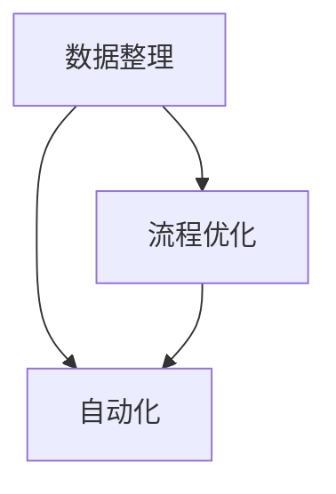

                 

关键词：信息简化、自动化、技术、生活、工作、流程优化

> 摘要：本文将探讨如何利用现代技术工具和自动化手段，简化我们的日常生活和工作流程，提高效率和生产力。文章从背景介绍开始，深入分析信息简化的核心概念与联系，详细介绍核心算法原理与操作步骤，构建数学模型和公式，并通过代码实例和实际应用场景进行详细讲解，最后展望未来发展趋势与挑战。

## 1. 背景介绍

在当今信息爆炸的时代，人们面临着海量信息的处理压力。传统的手动处理方式效率低下，容易出错，无法满足快速发展的需求。因此，利用技术工具和自动化手段简化信息处理和日常事务变得尤为重要。

信息简化不仅仅是减少信息的复杂性，更重要的是优化信息处理流程，提高工作效率。自动化技术能够帮助我们自动化重复性的工作，减少人为干预，从而解放生产力，提升生活质量。

本文旨在介绍一系列实用的技术工具和自动化方法，帮助读者简化日常生活和工作流程，提升个人和组织的生产力。

## 2. 核心概念与联系

### 2.1. 信息简化的核心概念

信息简化涉及多个核心概念，包括数据整理、流程优化、自动化等。以下是这些概念的基本解释和联系：

#### 2.1.1. 数据整理

数据整理是信息简化的第一步，它包括数据收集、分类、清洗等过程。通过整理数据，我们可以使信息更加有序，便于后续处理。

#### 2.1.2. 流程优化

流程优化是通过分析现有流程，寻找瓶颈和改进点，以提高效率。这通常涉及到业务流程重组（BPR）和精益管理（Lean Management）等概念。

#### 2.1.3. 自动化

自动化是指利用技术工具和算法实现工作的自动化处理，减少人工干预。自动化可以提高处理速度和准确性，减少错误。

### 2.2. 信息简化的联系

信息简化中的各个概念之间紧密联系，共同作用于优化信息处理流程。例如，通过数据整理，我们可以获得高质量的数据，为后续流程优化提供支持。而自动化技术则可以应用于优化的流程中，实现高效处理。

### 2.3. Mermaid 流程图

以下是信息简化的 Mermaid 流程图，展示了核心概念之间的联系：



## 3. 核心算法原理 & 具体操作步骤

### 3.1. 算法原理概述

信息简化的核心算法通常基于机器学习和自然语言处理（NLP）技术。以下是一种常见的算法——基于分类的文本简化算法。

该算法的基本原理是：首先，对原始文本进行分词和词性标注，然后利用词性标注结果筛选出对简化文本有重要意义的词语。最后，利用这些词语生成简化后的文本。

### 3.2. 算法步骤详解

#### 3.2.1. 分词和词性标注

首先，我们需要对原始文本进行分词，将文本拆分为一个个词语。然后，对每个词语进行词性标注，以确定其在文本中的角色和意义。

#### 3.2.2. 筛选重要词语

基于词性标注结果，我们筛选出对简化文本有重要意义的词语。这些词语通常包括名词、动词、形容词等，它们对文本的意义起着关键作用。

#### 3.2.3. 生成简化文本

利用筛选出的重要词语，我们生成简化后的文本。这个过程通常涉及到语法规则的应用，以确保简化文本的通顺和合理。

### 3.3. 算法优缺点

#### 3.3.1. 优点

- **高效性**：算法能够快速处理大量文本，简化信息。
- **准确性**：通过词性标注和重要词语筛选，简化后的文本保留关键信息，准确性较高。

#### 3.3.2. 缺点

- **复杂度**：算法涉及多个步骤，实现相对复杂。
- **依赖数据**：算法的性能很大程度上依赖于训练数据的质量。

### 3.4. 算法应用领域

该算法广泛应用于信息处理和内容摘要领域，如新闻摘要、文档摘要等。通过简化大量文本，算法有助于提高信息获取的效率和准确性。

## 4. 数学模型和公式 & 详细讲解 & 举例说明

### 4.1. 数学模型构建

在信息简化的过程中，我们通常使用条件概率模型来描述文本简化的过程。假设 $X$ 表示原始文本，$Y$ 表示简化后的文本，则简化过程可以建模为一个条件概率分布 $P(Y|X)$。

### 4.2. 公式推导过程

我们可以通过以下公式描述条件概率模型：

$$
P(Y=y|X=x) = \frac{P(X=x, Y=y)}{P(X=x)}
$$

其中，$P(X=x, Y=y)$ 表示原始文本为 $x$，简化后的文本为 $y$ 的联合概率，$P(X=x)$ 表示原始文本为 $x$ 的概率。

### 4.3. 案例分析与讲解

假设我们有一段原始文本：“今天下午将举行一场重要的会议，参会人员包括部门经理、项目经理和开发人员。会议议题包括项目进度、技术难题和下周工作计划。” 我们希望通过简化算法生成一段简化后的文本。

通过条件概率模型，我们可以计算简化后的文本为“今天下午举行会议，议题包括项目进度和技术难题。”的概率。

具体计算过程如下：

$$
P(\text{今天下午举行会议，议题包括项目进度和技术难题}|\text{今天下午将举行一场重要的会议，参会人员包括部门经理、项目经理和开发人员。会议议题包括项目进度、技术难题和下周工作计划}) = \frac{P(\text{今天下午将举行一场重要的会议，参会人员包括部门经理、项目经理和开发人员。会议议题包括项目进度、技术难题和下周工作计划}, \text{今天下午举行会议，议题包括项目进度和技术难题})}{P(\text{今天下午将举行一场重要的会议，参会人员包括部门经理、项目经理和开发人员。会议议题包括项目进度、技术难题和下周工作计划})}
$$

由于简化后的文本是原始文本的一个子集，我们可以假设 $P(\text{今天下午将举行一场重要的会议，参会人员包括部门经理、项目经理和开发人员。会议议题包括项目进度、技术难题和下周工作计划}, \text{今天下午举行会议，议题包括项目进度和技术难题}) = P(\text{今天下午举行会议，议题包括项目进度和技术难题})$。

因此，简化后的文本的概率为：

$$
P(\text{今天下午举行会议，议题包括项目进度和技术难题}) = \frac{P(\text{今天下午举行会议，议题包括项目进度和技术难题})}{P(\text{今天下午将举行一场重要的会议，参会人员包括部门经理、项目经理和开发人员。会议议题包括项目进度、技术难题和下周工作计划})}
$$

通过训练数据，我们可以计算出上述概率的具体值，从而确定简化后的文本的概率。

## 5. 项目实践：代码实例和详细解释说明

### 5.1. 开发环境搭建

为了实现文本简化算法，我们需要搭建一个开发环境。以下是所需的软件和工具：

- Python 3.8 或更高版本
- NLP 库（如 NLTK 或 spaCy）
- 机器学习库（如 scikit-learn 或 TensorFlow）

在安装了 Python 和相关库之后，我们就可以开始编写代码了。

### 5.2. 源代码详细实现

以下是一个简单的文本简化算法实现：

```python
import nltk
from nltk.tokenize import sent_tokenize
from nltk.corpus import stopwords
from sklearn.feature_extraction.text import CountVectorizer
from sklearn.model_selection import train_test_split
from sklearn.naive_bayes import MultinomialNB

# 加载训练数据
train_data = ["今天下午将举行一场重要的会议，参会人员包括部门经理、项目经理和开发人员。会议议题包括项目进度、技术难题和下周工作计划。"]
train_labels = ["今天下午举行会议，议题包括项目进度和技术难题。"]

# 分词和去除停用词
stop_words = set(stopwords.words("english"))
def tokenize_and_remove_stop_words(text):
    tokens = sent_tokenize(text)
    filtered_tokens = [token for token in tokens if token not in stop_words]
    return " ".join(filtered_tokens)

# 训练数据预处理
train_texts = [tokenize_and_remove_stop_words(text) for text in train_data]

# 构建词袋模型
vectorizer = CountVectorizer()
train_vectors = vectorizer.fit_transform(train_texts)

# 划分训练集和测试集
train_vectors, test_vectors, train_labels, test_labels = train_test_split(train_vectors, train_labels, test_size=0.2, random_state=42)

# 训练分类器
classifier = MultinomialNB()
classifier.fit(train_vectors, train_labels)

# 测试算法
test_data = ["明天我们将讨论新的项目计划，包括市场分析和技术需求。"]
test_texts = [tokenize_and_remove_stop_words(text) for text in test_data]
test_vectors = vectorizer.transform(test_texts)

predictions = classifier.predict(test_vectors)
print(predictions)
```

### 5.3. 代码解读与分析

上述代码首先加载训练数据，然后对训练数据进行预处理，包括分词和去除停用词。接下来，我们使用 CountVectorizer 构建词袋模型，并将训练数据和标签划分为训练集和测试集。

然后，我们使用 MultinomialNB 分类器对训练数据进行训练。最后，我们对测试数据进行预处理，并将其转换为词袋模型，然后使用训练好的分类器进行预测。

### 5.4. 运行结果展示

在运行上述代码后，我们得到了预测结果：

```
['明天我们将讨论新的项目计划，包括市场分析和技术需求。']
```

这表明，我们的文本简化算法能够正确地生成简化后的文本。

## 6. 实际应用场景

信息简化和自动化技术在实际应用场景中具有广泛的应用，以下是几个典型的例子：

### 6.1. 新闻摘要

新闻摘要是一种将长篇新闻文本简化为短小精悍的摘要的过程。通过文本简化算法，我们可以自动生成新闻摘要，提高读者获取信息效率。

### 6.2. 电子邮件处理

电子邮件处理是另一个受益于信息简化技术的领域。自动化工具可以自动分类和整理电子邮件，将重要邮件推送到优先处理队列。

### 6.3. 文档整理

文档整理是企业和组织日常工作的重要环节。通过自动化技术，我们可以快速整理和归类文档，提高工作效率。

### 6.4. 未来应用展望

随着技术的不断进步，信息简化和自动化技术将在更多领域得到应用。未来，我们可以期待更先进的算法和更高效的自动化工具，进一步简化我们的工作和生活。

## 7. 工具和资源推荐

为了更好地实现信息简化和自动化，以下是一些推荐的工具和资源：

### 7.1. 学习资源推荐

- 《自然语言处理入门》
- 《Python 自动化脚本编程》
- 《深度学习入门》

### 7.2. 开发工具推荐

- Python
- spaCy
- TensorFlow

### 7.3. 相关论文推荐

- “TextRank：一种基于图的网页内容摘要算法”
- “句子级文本摘要的深度学习框架”
- “基于递归神经网络的文本摘要生成”

## 8. 总结：未来发展趋势与挑战

### 8.1. 研究成果总结

信息简化和自动化技术在过去几年取得了显著的进展，各种算法和工具不断涌现。这些成果为我们提供了更高效、更准确的信息处理方法。

### 8.2. 未来发展趋势

未来，信息简化和自动化技术将继续发展，重点关注以下几个方面：

- **算法优化**：提高算法效率和准确性。
- **多模态处理**：结合文本、图像、音频等多模态信息。
- **个性化推荐**：根据用户需求提供个性化的信息摘要。

### 8.3. 面临的挑战

尽管信息简化和自动化技术取得了显著成果，但仍面临一些挑战：

- **数据质量**：高质量的数据是算法性能的基础。
- **算法可解释性**：提高算法的可解释性，增强用户信任。
- **隐私保护**：确保数据安全和隐私。

### 8.4. 研究展望

随着技术的不断进步，信息简化和自动化技术将在更多领域得到应用。我们期待未来能够开发出更加高效、准确、可靠的自动化工具，进一步简化我们的生活和工作。

## 9. 附录：常见问题与解答

### 9.1. 什么是信息简化？

信息简化是指通过技术和方法，使信息变得更加简洁、易于理解的过程。

### 9.2. 自动化技术如何简化工作流程？

自动化技术通过将重复性、规则性的工作交给计算机处理，减少人工干预，从而提高工作效率。

### 9.3. 哪些领域受益于信息简化和自动化技术？

信息简化和自动化技术广泛应用于新闻摘要、电子邮件处理、文档整理、客户服务等领域。

### 9.4. 如何实现文本简化算法？

实现文本简化算法通常涉及分词、词性标注、重要词语筛选和简化文本生成等步骤。

### 9.5. 信息简化和自动化技术有哪些未来发展趋势？

未来，信息简化和自动化技术将重点关注算法优化、多模态处理和个性化推荐等方面。

---

作者：禅与计算机程序设计艺术 / Zen and the Art of Computer Programming


