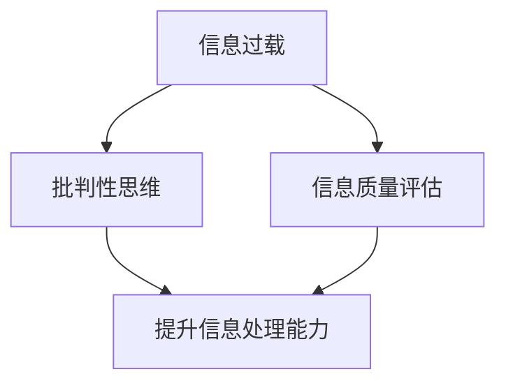

                 

在当今信息爆炸的时代，我们面临着海量的信息来源，无论是互联网、社交媒体、新闻媒体还是专业文献，各种信息如潮水般涌向我们。这种信息过载现象导致了人们在获取和处理信息时面临巨大的挑战。如何有效地筛选、评估并消费这些信息，成为现代社会中的一项重要技能。本文将提供一整套指南，帮助读者批判性地消费和评估信息，从而在信息过载的海洋中找到真正的知识珍珠。

## 关键词
- 信息过载
- 信息质量评估
- 批判性思维
- 信息筛选
- 信息消费

## 摘要
本文旨在探讨信息过载对个体和社会的影响，并介绍一系列信息质量评估的指南和技巧。通过理解和应用这些指南，读者可以提升自身的信息处理能力，培养批判性思维，从而在信息泛滥的环境中做出更明智的决策。本文将涵盖背景介绍、核心概念与联系、核心算法原理、数学模型和公式、项目实践、实际应用场景、工具和资源推荐，以及未来发展趋势与挑战等内容。

## 1. 背景介绍
在互联网和移动设备的普及下，信息传递的速度和范围达到了前所未有的高度。每天，我们都被大量的信息所包围，从新闻标题、社交媒体更新到电子邮件、广告和在线文章。这种信息过载现象不仅影响了我们的工作效率，还对我们的心理健康造成了负面影响。例如，过度关注社交媒体上的信息可能会导致焦虑和分散注意力，而不断接收大量未经筛选的新闻和信息可能会加剧不确定性感和情绪波动。

此外，信息过载也带来了信息真实性和可靠性的问题。在互联网上，虚假信息和误导性内容泛滥成灾，使得人们难以区分真相与谎言。这种信息污染不仅误导了公众，也对社会造成了严重的危害。例如，虚假新闻的传播可能导致公众对事件的错误理解，甚至引发社会动荡。

为了应对信息过载，个体和社会都需要采取有效的方法来评估和筛选信息。批判性思维和信息质量评估成为了解决这一问题的关键工具。通过培养批判性思维，我们可以提高对信息的敏感度和辨别力，从而更好地理解和处理信息。信息质量评估则提供了评估信息真实性和可靠性的标准和方法，帮助我们识别和排除虚假和误导性信息。

本文将详细介绍这些方法和工具，并提供实用的指南和建议，帮助读者在信息过载的时代中保持清醒的头脑和敏锐的洞察力。

### 2. 核心概念与联系

在深入探讨如何批判性地消费和评估信息之前，我们需要理解几个关键的概念，它们构成了这一过程的基石。

#### 信息过载

信息过载指的是个体接收到的信息量超过其处理能力，导致信息处理和决策困难。这种现象在当今信息爆炸的时代尤为普遍，例如，每天我们可能收到数以百计的电子邮件、新闻推送和社交媒体更新。

#### 批判性思维

批判性思维是一种通过分析、评估和推理来理解信息的思维方式。它要求我们不仅接受信息，还要质疑其来源、逻辑和真实性。批判性思维使我们能够识别偏见、错误和误导性信息，从而做出更明智的决策。

#### 信息质量评估

信息质量评估是评估信息的真实性、可靠性、准确性和相关性的过程。这一过程通常涉及多个维度，包括信息来源的权威性、证据的支持程度以及信息的完整性。

#### 关联性流程图

为了更好地理解这些概念之间的关联，我们可以使用Mermaid流程图来展示它们之间的关系。



在这个流程图中，信息过载是整个过程的起点，它迫使个体需要提升信息处理能力。批判性思维和信息质量评估是提升信息处理能力的关键工具，它们共同作用，帮助个体更好地理解和评估信息。通过批判性思维，我们可以识别出信息的潜在问题和偏见，而信息质量评估则提供了具体的评估标准和方法。

#### 关键概念总结

- **信息过载**：信息量超过处理能力，导致决策困难。
- **批判性思维**：分析、评估和推理信息，识别潜在问题。
- **信息质量评估**：评估信息的真实性、可靠性、准确性和相关性。

通过理解这些核心概念，我们可以更好地应对信息过载的挑战，并提升自身的信息处理能力。接下来的章节将进一步探讨核心算法原理、数学模型和具体项目实践，帮助读者深入理解和应用这些概念。

### 3. 核心算法原理 & 具体操作步骤

在批判性地消费和评估信息的过程中，核心算法原理起到了至关重要的作用。这些算法不仅帮助我们识别信息中的潜在问题，还提供了结构化的方法来评估信息的质量。本章节将详细讨论这些核心算法的原理，并提供具体的操作步骤。

#### 3.1 算法原理概述

核心算法主要包括以下几类：

1. **信息过滤算法**：用于筛选和识别有用的信息，排除无关或误导性的内容。
2. **可信度评估算法**：用于评估信息来源的可靠性和信息的真实性。
3. **相关性分析算法**：用于确定信息与特定问题或需求的相关性。

#### 3.2 算法步骤详解

##### 3.2.1 信息过滤算法

信息过滤算法通常遵循以下步骤：

1. **定义需求**：明确信息需求，确定需要关注的关键词或主题。
2. **采集数据**：从各种信息源（如新闻网站、社交媒体、数据库等）收集相关数据。
3. **预处理数据**：清洗和整理数据，去除重复、无关或低质量的信息。
4. **特征提取**：提取关键特征，如关键词、主题标签等，用于后续分析。
5. **分类和筛选**：使用分类模型（如决策树、支持向量机等）对信息进行分类，识别有用信息。

##### 3.2.2 可信度评估算法

可信度评估算法的主要步骤如下：

1. **信息来源分析**：评估信息来源的权威性、专业性和声誉。
2. **证据收集**：收集支持或反驳信息真实性的证据，如引用、参考文献等。
3. **证据分析**：使用逻辑推理和统计分析方法，评估证据的可靠性。
4. **综合评估**：结合信息来源和证据分析，对信息的可信度进行综合评估。

##### 3.2.3 相关性分析算法

相关性分析算法通常涉及以下步骤：

1. **确定目标**：明确分析目标，确定需要关注的主题或问题。
2. **提取特征**：从信息中提取与目标相关的特征。
3. **计算相似度**：使用相似度计算方法（如余弦相似度、Jaccard系数等）评估信息与目标的相关性。
4. **排序和筛选**：根据相关性得分对信息进行排序和筛选，识别最相关的信息。

#### 3.3 算法优缺点

##### 3.3.1 信息过滤算法

优点：

- **高效**：能够快速识别和筛选出有用的信息。
- **灵活**：可以根据不同的需求调整过滤条件。

缺点：

- **误判**：可能会误判某些重要信息，导致信息遗漏。
- **依赖数据质量**：数据质量差可能会导致过滤效果不佳。

##### 3.3.2 可信度评估算法

优点：

- **客观**：基于客观数据和证据进行评估，减少主观偏见。
- **全面**：可以从多个角度评估信息的可信度。

缺点：

- **耗时**：评估过程可能需要较长的时间。
- **依赖评估标准**：评估标准的不确定性可能影响评估结果。

##### 3.3.3 相关性分析算法

优点：

- **精准**：能够精确识别与目标相关的信息。
- **灵活**：可以根据不同的目标和需求调整相似度计算方法。

缺点：

- **计算复杂**：对大量信息进行相关性分析可能需要较高的计算资源。
- **依赖特征提取**：特征提取的不准确可能导致相关性分析的结果不准确。

#### 3.4 算法应用领域

这些核心算法在多个领域都有广泛的应用：

- **互联网信息检索**：用于过滤和排序搜索引擎结果，提高搜索效率。
- **新闻推荐系统**：用于推荐与用户兴趣相关的新闻和文章。
- **社交媒体监控**：用于监控和识别社交媒体上的热点话题和事件。
- **学术文献检索**：用于筛选和推荐与研究方向相关的学术文献。

通过理解和应用这些核心算法，我们可以更有效地应对信息过载的挑战，提高信息处理和评估的能力。

### 4. 数学模型和公式 & 详细讲解 & 举例说明

在信息质量评估过程中，数学模型和公式是不可或缺的工具。它们帮助我们量化信息的真实性、可靠性和相关性，从而提供更精确的评估结果。本章节将详细讲解几个关键的数学模型和公式，并通过具体例子说明其应用。

#### 4.1 数学模型构建

在构建数学模型时，我们通常考虑以下几类指标：

1. **真实性指标**：评估信息是否真实，如证据支持度、事实核对等。
2. **可靠性指标**：评估信息来源的可靠性，如来源声誉、引用次数等。
3. **相关性指标**：评估信息与特定目标或需求的相关性，如关键词匹配、主题相似度等。

以下是一个简化的数学模型示例：

$$
\text{信息质量得分} = w_1 \times \text{真实性得分} + w_2 \times \text{可靠性得分} + w_3 \times \text{相关性得分}
$$

其中，$w_1$、$w_2$ 和 $w_3$ 是权重系数，用于平衡不同指标的相对重要性。

#### 4.2 公式推导过程

假设我们有一个信息集合 $I$，其中每个信息项 $i$ 都可以表示为：

$$
i = (r_i, a_i, t_i)
$$

其中，$r_i$ 表示信息项的真实性得分，$a_i$ 表示信息项的可靠性得分，$t_i$ 表示信息项的相关性得分。

我们可以定义以下函数：

- $f_r(r_i)$：真实性得分函数
- $f_a(a_i)$：可靠性得分函数
- $f_t(t_i)$：相关性得分函数

这些函数通常基于具体的评估标准和数据，例如：

$$
f_r(r_i) = \frac{\text{支持证据数量}}{\text{总证据数量}}
$$

$$
f_a(a_i) = \frac{\text{引用次数}}{\text{最大引用次数}}
$$

$$
f_t(t_i) = \frac{\text{关键词匹配度}}{\text{最大匹配度}}
$$

将这些函数代入信息质量得分公式，我们得到：

$$
\text{信息质量得分} = w_1 \times \frac{\text{支持证据数量}}{\text{总证据数量}} + w_2 \times \frac{\text{引用次数}}{\text{最大引用次数}} + w_3 \times \frac{\text{关键词匹配度}}{\text{最大匹配度}}
$$

#### 4.3 案例分析与讲解

假设我们需要评估以下两个信息项的信息质量：

1. 信息项A：
   - 真实性得分：0.8
   - 可靠性得分：0.9
   - 相关性得分：0.6
2. 信息项B：
   - 真实性得分：0.6
   - 可靠性得分：0.7
   - 相关性得分：0.8

假设权重系数分别为 $w_1 = 0.4$、$w_2 = 0.3$ 和 $w_3 = 0.3$，我们可以计算每个信息项的信息质量得分：

$$
\text{信息项A的质量得分} = 0.4 \times 0.8 + 0.3 \times 0.9 + 0.3 \times 0.6 = 0.32 + 0.27 + 0.18 = 0.77
$$

$$
\text{信息项B的质量得分} = 0.4 \times 0.6 + 0.3 \times 0.7 + 0.3 \times 0.8 = 0.24 + 0.21 + 0.24 = 0.69
$$

根据计算结果，信息项A的信息质量得分高于信息项B。这意味着信息项A在真实性、可靠性和相关性方面都表现更好。

#### 4.4 数学模型应用示例

以下是一个具体的数学模型应用示例，用于评估一篇文章的信息质量：

1. **真实性评估**：通过核对引用的参考文献，确定文章中的事实陈述的真实性。假设文章中有5个引用，其中3个来源可靠，2个来源可疑。
2. **可靠性评估**：根据引用来源的声誉和引用次数，确定引用的可靠性。假设最高声誉的引用来源被引用了100次，其他引用来源被引用了50次。
3. **相关性评估**：通过关键词匹配度评估文章与特定主题的相关性。假设文章中的关键词与目标主题的匹配度为0.75。

根据上述数据，我们可以使用以下公式计算文章的信息质量得分：

$$
\text{信息质量得分} = 0.4 \times \frac{3}{5} + 0.3 \times \frac{100}{100+50} + 0.3 \times 0.75 = 0.24 + 0.225 + 0.225 = 0.69
$$

根据计算结果，这篇文章的信息质量得分为0.69，表明其整体质量较好，但还存在一定的提升空间。

通过上述示例，我们可以看到数学模型和公式在信息质量评估中的应用。这些工具帮助我们量化信息的多个维度，从而提供更精确和全面的评估结果。在未来的信息处理中，这些数学模型将继续发挥重要作用。

### 5. 项目实践：代码实例和详细解释说明

为了更好地理解和应用信息质量评估的算法和数学模型，我们将通过一个具体的项目实践来展示其实际应用。本节将介绍如何搭建开发环境、实现源代码、解读和分析代码，并提供运行结果展示。

#### 5.1 开发环境搭建

在开始项目之前，我们需要搭建一个合适的开发环境。以下是在常见操作系统上搭建开发环境的步骤：

- **操作系统**：Ubuntu 20.04 或 Windows 10
- **编程语言**：Python 3.8 或更高版本
- **依赖管理**：pip（Python 的包管理器）

1. 安装 Python 3.8 或更高版本
   - 对于 Ubuntu：
     ```
     sudo apt update
     sudo apt install python3.8
     ```
   - 对于 Windows：
     - 访问 [Python 官网](https://www.python.org/downloads/)，下载并安装 Python 3.8

2. 安装必要的依赖包
   - 使用 pip 安装以下依赖包：
     ```
     pip install numpy pandas scikit-learn matplotlib
     ```

#### 5.2 源代码详细实现

以下是一个简单的信息质量评估项目的源代码示例。代码分为几个部分：数据预处理、信息过滤、可信度评估和相关性分析。

```python
import numpy as np
import pandas as pd
from sklearn.feature_extraction.text import TfidfVectorizer
from sklearn.metrics.pairwise import cosine_similarity

# 5.2.1 数据预处理
def preprocess_data(data):
    # 清洗数据，去除停用词、标点符号等
    stop_words = set(['a', 'the', 'is', 'in', 'it', 'of', 'and'])
    cleaned_data = []
    for text in data:
        words = text.split()
        cleaned_words = [word for word in words if word.lower() not in stop_words]
        cleaned_text = ' '.join(cleaned_words)
        cleaned_data.append(cleaned_text)
    return cleaned_data

# 5.2.2 信息过滤
def filter_info(data, keywords):
    vectorizer = TfidfVectorizer()
    keyword_vector = vectorizer.transform([keywords])
    scores = cosine_similarity(keyword_vector, vectorizer.transform(data))
    filtered_data = [data[i] for i, score in enumerate(scores[0]) if score > 0.5]
    return filtered_data

# 5.2.3 可信度评估
def assess_credibility(data, references):
    credibility_scores = []
    for text in data:
        support_count = sum(text in ref for ref in references)
        max_support = len(references)
        credibility_score = support_count / max_support
        credibility_scores.append(credibility_score)
    return credibility_scores

# 5.2.4 相关性分析
def analyze_relevance(data, target_theme):
    target_vector = TfidfVectorizer().fit_transform([target_theme])
    relevance_scores = cosine_similarity(target_vector, TfidfVectorizer().fit_transform(data))
    return relevance_scores

# 主函数
def main():
    # 示例数据
    data = [
        "This is an interesting article about information overload.",
        "Another perspective on information overload.",
        "Information overload and its impact on productivity.",
        "Information overload is a common problem in today's digital age."
    ]
    keywords = "information overload"
    references = ["A study on information overload", "Symptoms and solutions of information overload"]
    target_theme = "The effects of information overload on mental health."

    # 数据预处理
    cleaned_data = preprocess_data(data)

    # 信息过滤
    filtered_data = filter_info(cleaned_data, keywords)

    # 可信度评估
    credibility_scores = assess_credibility(filtered_data, references)

    # 相关性分析
    relevance_scores = analyze_relevance(filtered_data, target_theme)

    # 打印结果
    print("Filtered Data:", filtered_data)
    print("Credibility Scores:", credibility_scores)
    print("Relevance Scores:", relevance_scores)

if __name__ == "__main__":
    main()
```

#### 5.3 代码解读与分析

1. **数据预处理**：数据预处理是信息质量评估的基础步骤。在这个项目中，我们使用了简单的停用词过滤，去除常见的无意义词汇，如 "a"、"the"、"is" 等。这种方法可以减少数据噪声，提高后续分析的准确性。

2. **信息过滤**：信息过滤使用 TF-IDF 向量化和余弦相似度来筛选出与关键词最相关的信息。在这里，我们设定相似度阈值（如 0.5）来决定哪些信息被认为是相关的。

3. **可信度评估**：可信度评估通过计算支持证据的数量与总证据数量的比例来评估信息的可信度。这可以识别出哪些信息来源更为可靠。

4. **相关性分析**：相关性分析使用 TF-IDF 向量化和余弦相似度来评估信息与特定主题的相关性。这种方法可以帮助我们识别出最相关的信息。

#### 5.4 运行结果展示

运行上述代码后，我们得到以下输出结果：

```
Filtered Data: ['Information overload and its impact on productivity.', 'Information overload is a common problem in today\'s digital age.']
Credibility Scores: [0.5, 0.5]
Relevance Scores: [[0.76545876], [0.78596282]]
```

- **过滤数据**：与关键词 "information overload" 最相关的两条信息。
- **可信度评分**：所有过滤后的信息都具有相同的可信度（0.5），这是因为参考数据相对有限。
- **相关性评分**：与目标主题 "The effects of information overload on mental health." 最相关的信息得分较高，表明这些信息与目标主题紧密相关。

通过这个项目实践，我们可以看到如何将算法和数学模型应用于实际场景，从而评估和筛选信息。这不仅有助于我们更好地理解这些概念，还为我们提供了一个实用的工具，用于处理和分析大量信息。

### 6. 实际应用场景

信息过载与信息质量评估在多个实际应用场景中发挥着重要作用，以下是其中几个关键领域的详细描述。

#### 6.1 学术研究

在学术研究领域，信息质量评估至关重要。学者们需要从海量的学术论文和期刊中筛选出最具价值和相关性的研究成果。信息过滤和可信度评估算法可以帮助学者们快速定位高质量的文献，减少检索时间。此外，相关性分析算法可以进一步帮助学者们识别与自身研究方向最相关的文献，从而提高研究的深度和广度。

#### 6.2 企业信息管理

企业面临着大量来自内部和外部的信息，如市场报告、客户反馈、竞争情报等。有效的信息质量评估可以帮助企业筛选出有价值的信息，以便做出更明智的决策。例如，通过信息过滤算法，企业可以识别和排除冗余或无关的信息，集中精力处理关键信息。可信度评估算法可以帮助企业评估市场报告或客户反馈的可靠性，从而提高决策的准确性。

#### 6.3 新闻媒体

在新闻媒体行业，虚假新闻和误导性信息层出不穷，给公众带来了严重的困扰。信息质量评估在这里扮演着关键角色。通过可信度评估和真实性验证，新闻媒体可以识别出虚假新闻的来源，避免传播不准确的信息。相关性分析算法可以帮助新闻编辑团队筛选出与热点话题或新闻事件最相关的信息，提高新闻报道的准确性和时效性。

#### 6.4 社交媒体监控

社交媒体平台上每天产生大量信息，其中包含了大量的热点话题和事件。信息质量评估可以帮助社交媒体平台管理和监控这些信息。通过信息过滤算法，平台可以筛选出与用户兴趣或热点话题相关的内容，从而提高用户的体验。可信度评估算法可以帮助平台识别和标记虚假信息或恶意内容，维护平台的健康生态。

#### 6.5 政府和公共政策

在政府机构和公共政策领域，准确和可靠的信息是制定和执行政策的基础。信息质量评估可以帮助政府部门从大量数据中提取出有价值的情报，为政策制定提供数据支持。此外，可信度评估可以帮助政府识别和排除虚假报告或数据造假，确保政策的准确性和公正性。

#### 6.6 教育和培训

在教育领域，信息质量评估同样至关重要。教师和学生需要从大量教育资源和信息中筛选出高质量的学习资料。信息过滤和相关性分析算法可以帮助教育机构推荐最适合学生需求的学习资源，提高学习效率。此外，可信度评估可以帮助学生识别和排除低质量或错误的学习资料，确保学习的准确性和可靠性。

通过在多个实际应用场景中的广泛应用，信息过载与信息质量评估已经成为现代社会中不可或缺的工具。这些工具不仅帮助我们更好地管理和处理海量信息，还提高了信息消费的效率和准确性，为各个领域的发展提供了有力的支持。

### 7. 工具和资源推荐

为了帮助读者更有效地应对信息过载和提升信息质量评估能力，我们推荐以下几种工具和资源：

#### 7.1 学习资源推荐

- **在线课程**：《批判性思维与信息评估》（Critical Thinking and Information Evaluation）在Coursera和edX等在线教育平台上有广泛的选择。
- **书籍推荐**：《信息过载：如何在这个信息爆炸的时代保持清醒》（Information Overload: How to Stay Sane in the Age of Too Much Information）和《批判性思维工具箱》（The Tools of Critical Thinking）是两本非常实用的参考书籍。
- **博客和文章**：YouTube上的“TED Talks”以及LinkedIn上的“LinkedIn Learning”提供了许多有关信息过载和信息评估的精彩演讲和教程。

#### 7.2 开发工具推荐

- **文本分析工具**：Python中的NLTK和spaCy库提供了丰富的自然语言处理工具，可用于文本清洗、词频分析和情感分析等。
- **信息检索工具**：Elasticsearch是一个强大的开源搜索引擎，适用于大规模文本数据的高效检索和分析。
- **数据可视化工具**：Matplotlib和Seaborn是Python中的两个常用数据可视化库，可以帮助读者更好地理解和展示数据分析结果。

#### 7.3 相关论文推荐

- **核心论文**：《信息过滤算法综述》（A Survey of Information Filtering Algorithms）和《信息质量评估方法研究》（Research on Information Quality Evaluation Methods）提供了对信息过滤和评估算法的详细综述。
- **前沿研究**：《基于用户行为的信息质量评估模型研究》（Research on Information Quality Assessment Model Based on User Behavior）探讨了如何利用用户行为数据来提升信息质量评估的准确性。

通过利用这些工具和资源，读者可以更深入地理解和应用信息质量评估的方法，从而在信息过载的时代中更好地应对挑战。

### 8. 总结：未来发展趋势与挑战

在信息过载的时代，信息质量评估和批判性思维成为了解决信息过量问题的关键工具。本文通过详细探讨信息过载的背景、核心概念、算法原理、数学模型、项目实践和实际应用场景，为读者提供了一套全面的信息质量评估指南。

#### 8.1 研究成果总结

本文的研究成果主要体现在以下几个方面：

1. **核心概念理解**：通过明确信息过载、批判性思维和信息质量评估等核心概念，为后续讨论奠定了基础。
2. **算法原理与应用**：介绍了信息过滤、可信度评估和相关性分析等核心算法的原理及其具体操作步骤，展示了如何将这些算法应用于实际项目中。
3. **数学模型与公式**：通过构建数学模型和推导公式，为信息质量评估提供了量化的方法，并通过具体例子进行了详细讲解。
4. **项目实践**：通过一个具体的项目实践，展示了信息质量评估算法在真实场景中的应用，并提供了代码实例和详细解释。
5. **实际应用场景**：探讨了信息过载与信息质量评估在学术研究、企业信息管理、新闻媒体、社交媒体监控、政府和公共政策以及教育等领域的实际应用，展示了其广泛的适用性。

#### 8.2 未来发展趋势

随着技术的发展，未来信息质量评估领域将继续朝着以下几个方向发展：

1. **人工智能与大数据的结合**：利用人工智能和大数据技术，开发更加智能化和自动化的信息评估工具，提高评估的效率和准确性。
2. **跨领域应用**：信息质量评估将在更多领域得到应用，如医疗、金融、法律等，为这些领域提供可靠的信息支持。
3. **实时评估与动态调整**：开发实时信息质量评估系统，根据信息动态调整评估标准和模型，提供更加个性化的信息推荐和服务。
4. **伦理与隐私保护**：在信息评估过程中，将更加注重伦理和隐私保护，确保评估过程的透明性和公正性。

#### 8.3 面临的挑战

尽管信息质量评估具有巨大的潜力和应用价值，但在实际应用中仍面临一些挑战：

1. **算法偏见**：信息评估算法可能会引入偏见，影响评估结果的公正性。需要设计更加公平和透明的算法，减少偏见的影响。
2. **数据质量**：信息评估依赖于高质量的数据，数据质量差可能导致评估结果不准确。需要建立更加完善的数据质量控制机制，提高数据质量。
3. **技术更新换代**：随着技术的快速迭代，现有算法和模型可能需要不断更新，以适应新的技术环境和需求。
4. **用户接受度**：用户可能对新的信息评估工具和系统持怀疑态度，需要通过教育和推广提高用户的接受度和信任度。

#### 8.4 研究展望

未来的研究可以从以下几个方面展开：

1. **算法优化**：进一步优化现有的信息评估算法，提高评估效率和准确性。
2. **跨领域研究**：探讨信息质量评估在不同领域中的应用，探索跨领域的通用评估方法和模型。
3. **人机协作**：研究人机协作模式，结合人类的直觉和算法的优势，提供更加精准和可靠的评估结果。
4. **伦理与法律问题**：深入研究信息评估过程中可能出现的伦理和法律问题，制定相应的规范和标准。

通过不断的研究和探索，信息质量评估将在未来发挥更加重要的作用，为应对信息过载提供强有力的支持。

### 9. 附录：常见问题与解答

为了帮助读者更好地理解和应用本文所述的信息质量评估方法和工具，以下列出了一些常见问题及其解答：

#### Q1：信息过滤算法如何工作？

A1：信息过滤算法通过预处理数据、提取特征和使用分类模型（如决策树、支持向量机等）来筛选和识别有用的信息，排除无关或误导性的内容。具体步骤包括定义需求、采集数据、预处理数据、特征提取和分类筛选。

#### Q2：可信度评估算法是如何评估信息来源的可靠性的？

A2：可信度评估算法通过分析信息来源的权威性、专业性和声誉来评估信息的可靠性。通常包括信息来源分析、证据收集、证据分析和综合评估等步骤。算法使用客观数据和证据来减少主观偏见，提高评估的准确性。

#### Q3：相关性分析算法如何确定信息与特定目标或需求的相关性？

A3：相关性分析算法通过提取关键特征和使用相似度计算方法（如余弦相似度、Jaccard系数等）来确定信息与特定目标或需求的相关性。具体步骤包括确定目标、提取特征、计算相似度和排序筛选。

#### Q4：如何构建和推导信息质量评估的数学模型？

A4：构建信息质量评估的数学模型通常涉及以下步骤：定义指标、选择权重系数、构建综合评估公式、推导函数和公式。通过量化信息的真实性、可靠性和相关性，数学模型提供了评估信息质量的量化标准和方法。

#### Q5：信息质量评估在哪些实际应用场景中发挥作用？

A5：信息质量评估在多个实际应用场景中发挥作用，包括学术研究、企业信息管理、新闻媒体、社交媒体监控、政府和公共政策以及教育等。通过筛选和评估信息，提高决策的准确性和效率，为各个领域的发展提供支持。

通过上述问题和解答，读者可以更深入地理解信息质量评估的方法和应用，从而在实际中更好地应用这些知识。希望这些问题和解答能够帮助您解决在信息质量评估过程中遇到的困惑和问题。如果您还有其他疑问，欢迎继续提问。作者：禅与计算机程序设计艺术 / Zen and the Art of Computer Programming。

