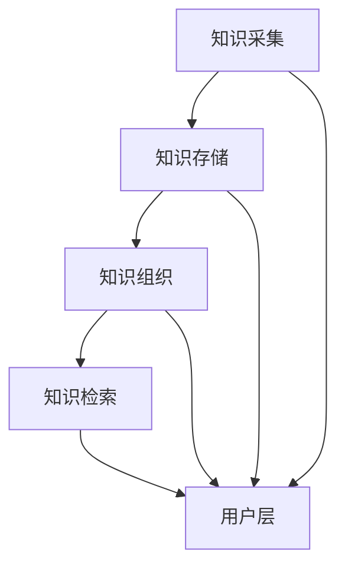

                 

在当今的信息时代，我们面临着前所未有的信息过载问题。大量的数据、文件、邮件和社交媒体帖子不断涌入我们的生活，让我们感到应接不暇。这种信息过载不仅浪费了我们的时间和精力，还可能导致我们错失重要的信息和机会。为了解决这个问题，我们需要有效的知识管理系统，它可以帮助我们组织和检索信息，提高工作效率和决策能力。本文将探讨信息过载的背景，介绍知识管理系统的核心概念、算法原理、数学模型、项目实践以及实际应用场景，并展望未来的发展趋势和挑战。

## 关键词 Keywords

信息过载、知识管理系统、信息组织、信息检索、算法原理、数学模型、项目实践、实际应用、发展趋势、挑战。

## 摘要 Abstract

本文首先介绍了信息过载的背景，指出了其对我们生活和工作的影响。接着，我们介绍了知识管理系统的核心概念和架构，探讨了其算法原理和数学模型。随后，我们通过一个实际项目实践展示了知识管理系统的具体应用。最后，本文总结了知识管理系统在各个领域的实际应用场景，并展望了其未来的发展趋势和面临的挑战。

### 1. 背景介绍 Background

在信息爆炸的时代，我们每天都会接触到大量的信息。据统计，一个人每天接收到的信息量相当于过去几个世纪的总和。这些信息包括新闻、广告、社交媒体更新、电子邮件、报告、文档等。尽管这些信息在一定程度上丰富了我们的生活，但同时也带来了信息过载的问题。

### 1.1 信息过载的影响 Impact of Information Overload

信息过载对我们的影响是多方面的。首先，它浪费了我们的时间和精力。我们经常需要花费大量时间来筛选和整理信息，以便找到我们真正需要的内容。其次，信息过载可能让我们错失重要的信息和机会。由于我们无法及时处理和消化所有的信息，一些关键的信息可能在我们注意到之前就已经被淹没在信息的海洋中。此外，信息过载还可能导致我们的焦虑和压力增加，影响我们的心理健康。

### 1.2 知识管理系统的重要性 Importance of Knowledge Management Systems

为了应对信息过载的问题，我们需要有效的知识管理系统。知识管理系统（Knowledge Management System, KMS）是一种帮助组织和个人有效地收集、存储、组织和检索信息的系统。通过知识管理系统，我们可以将大量的信息转化为有价值的知识，从而提高我们的工作效率和决策能力。

### 1.3 知识管理系统的核心概念 Core Concepts of Knowledge Management Systems

知识管理系统包括多个核心概念，如知识采集、知识存储、知识组织和知识检索。知识采集是指从各种来源获取信息的过程；知识存储是指将获取的信息存储到数据库或知识库中；知识组织是指对存储的信息进行分类、标签化和索引，以便快速检索；知识检索是指通过关键词、标签或分类来查找特定的信息。

### 1.4 知识管理系统的架构 Architecture of Knowledge Management Systems

知识管理系统的架构通常包括数据层、应用层和用户层。数据层负责存储和管理信息；应用层提供各种功能，如采集、存储、组织和检索；用户层是系统的用户界面，提供与用户的交互。

## 2. 核心概念与联系 Core Concepts and Relationships

为了更好地理解知识管理系统的核心概念，我们可以使用 Mermaid 流程图来展示其各个组件之间的关系。



### 2.1 知识采集 Knowledge Collection

知识采集是知识管理系统的第一步，它涉及从各种来源获取信息。这些来源可能包括网络、数据库、文件共享系统和社交媒体。知识采集的过程通常包括信息的收集、筛选和分类。

### 2.2 知识存储 Knowledge Storage

知识存储是将采集到的信息存储到数据库或知识库中。知识存储的关键是确保信息的安全性和可访问性。知识库可以是关系型数据库、文档数据库或图数据库，具体选择取决于组织的具体需求。

### 2.3 知识组织 Knowledge Organization

知识组织是对存储的信息进行分类、标签化和索引，以便快速检索。知识组织的过程包括信息的分类、标签的创建和索引的建立。分类和标签可以帮助用户快速找到所需的信息，而索引可以提高检索的效率。

### 2.4 知识检索 Knowledge Retrieval

知识检索是知识管理系统的核心功能，它允许用户通过关键词、标签或分类来查找特定的信息。知识检索的过程通常涉及信息的索引和搜索算法。高效的搜索算法可以提高检索的准确性和速度。

### 2.5 用户层 User Layer

用户层是知识管理系统的用户界面，提供与用户的交互。用户层通常包括搜索框、标签栏、分类视图和结果展示界面。用户层的设计要考虑到用户体验，确保用户可以轻松地查找和获取所需的信息。

### 2.6 知识管理系统的工作流程 Workflow of Knowledge Management System

知识管理系统的工作流程通常包括以下步骤：

1. **知识采集**：从各种来源获取信息。
2. **知识存储**：将信息存储到知识库中。
3. **知识组织**：对存储的信息进行分类、标签化和索引。
4. **知识检索**：通过关键词、标签或分类检索信息。
5. **用户交互**：用户通过用户层与系统进行交互，获取所需的信息。

## 3. 核心算法原理 & 具体操作步骤 Core Algorithm Principles and Detailed Steps

### 3.1 算法原理概述 Overview of Algorithm Principles

知识管理系统的核心算法主要包括信息检索算法和信息组织算法。信息检索算法旨在提高检索效率，而信息组织算法旨在优化信息的存储和访问。

#### 3.1.1 信息检索算法 Information Retrieval Algorithms

信息检索算法主要包括基于关键词的检索、基于内容的检索和基于语义的检索。基于关键词的检索是最简单和最常用的检索方式，它通过匹配用户输入的关键词和数据库中的关键词来查找相关文档。基于内容的检索则通过分析文档的内容和结构来查找相关文档，而基于语义的检索则通过理解文档的语义来查找相关文档。

#### 3.1.2 信息组织算法 Information Organization Algorithms

信息组织算法主要包括分类、标签化和索引。分类是将信息按主题或类型进行分组，以便用户可以更容易地查找信息。标签化是将信息与标签关联，以便用户可以通过标签查找信息。索引是创建索引文件，以便快速查找信息。

### 3.2 算法步骤详解 Detailed Steps of Algorithms

#### 3.2.1 信息检索算法步骤 Steps of Information Retrieval Algorithms

1. **预处理**：对用户输入的关键词进行预处理，包括去重、分词、词干提取等。
2. **索引构建**：构建索引文件，包括倒排索引、倒排字典等。
3. **查询处理**：处理用户的查询请求，包括关键词匹配、相似度计算等。
4. **结果排序**：根据匹配度对查询结果进行排序，以返回最相关的文档。

#### 3.2.2 信息组织算法步骤 Steps of Information Organization Algorithms

1. **分类**：对信息进行分类，将同一类别的信息归在一起。
2. **标签化**：为信息分配标签，以便用户可以通过标签查找信息。
3. **索引创建**：创建索引文件，以提高检索速度。

### 3.3 算法优缺点 Advantages and Disadvantages of Algorithms

#### 3.3.1 信息检索算法优点 Advantages of Information Retrieval Algorithms

- **高效性**：信息检索算法可以快速查找相关文档，提高检索效率。
- **灵活性**：用户可以通过关键词、标签或分类等多种方式查找信息。
- **易用性**：用户界面简单，易于操作。

#### 3.3.2 信息检索算法缺点 Disadvantages of Information Retrieval Algorithms

- **准确率**：基于关键词的检索可能存在误匹配，降低检索准确率。
- **语义理解**：基于语义的检索可能无法完全理解文档的语义，影响检索效果。

#### 3.3.3 信息组织算法优点 Advantages of Information Organization Algorithms

- **有序性**：分类、标签化有助于用户快速找到所需信息。
- **可扩展性**：索引可以方便地扩展和更新，以适应信息量的增长。

#### 3.3.4 信息组织算法缺点 Disadvantages of Information Organization Algorithms

- **复杂度**：分类、标签化和索引可能增加系统的复杂度和维护成本。
- **适应性**：信息组织算法可能无法适应动态变化的用户需求。

### 3.4 算法应用领域 Application Fields of Algorithms

信息检索算法和信息组织算法在多个领域都有广泛应用，包括：

- **企业信息管理**：帮助企业高效地管理内部文档和知识。
- **搜索引擎**：为用户提供高效的信息检索服务。
- **学术研究**：辅助研究人员快速查找相关文献。
- **教育**：为学生提供便捷的学习资源检索。

## 4. 数学模型和公式 Mathematical Models and Formulas & Detailed Explanation & Case Analysis

### 4.1 数学模型构建 Construction of Mathematical Models

在知识管理系统中，数学模型主要用于信息检索和信息组织。以下是一个简化的数学模型，用于描述基于关键词的信息检索。

#### 4.1.1 信息检索模型 Information Retrieval Model

设 \( D \) 为文档集合，\( W \) 为关键词集合，\( R(d, w) \) 表示文档 \( d \) 中包含关键词 \( w \)。

- **倒排索引**：构建一个从关键词到文档的映射，即 \( I(w) = \{ d \in D \mid R(d, w) \} \)。
- **查询处理**：计算查询关键词 \( q \) 与文档的相似度，通常使用余弦相似度。

#### 4.1.2 信息组织模型 Information Organization Model

- **分类模型**：使用决策树或支持向量机（SVM）对文档进行分类。
- **标签化模型**：使用词袋模型（Bag-of-Words）对文档进行标签化。

### 4.2 公式推导过程 Derivation Process of Formulas

#### 4.2.1 余弦相似度 Cosine Similarity

余弦相似度用于衡量两个向量 \( \vec{v} \) 和 \( \vec{w} \) 的相似度，公式如下：

\[ \cos(\vec{v}, \vec{w}) = \frac{\vec{v} \cdot \vec{w}}{||\vec{v}|| \cdot ||\vec{w}||} \]

其中，\( \vec{v} \cdot \vec{w} \) 表示向量的点积，\( ||\vec{v}|| \) 和 \( ||\vec{w}|| \) 分别表示向量的模。

#### 4.2.2 决策树 Decision Tree

决策树用于分类，其基本公式如下：

\[ C(d) = \arg\max_{c \in C} P(c | d) \]

其中，\( C \) 是类别集合，\( P(c | d) \) 是在给定文档 \( d \) 下类别 \( c \) 的条件概率。

#### 4.2.3 词袋模型 Bag-of-Words Model

词袋模型用于标签化，其基本公式如下：

\[ B(d) = \sum_{w \in W} f_{w}(d) \]

其中，\( f_{w}(d) \) 是文档 \( d \) 中关键词 \( w \) 的频率。

### 4.3 案例分析与讲解 Case Analysis and Explanation

#### 4.3.1 信息检索案例 Analysis of Information Retrieval Case

假设有一个文档集合 \( D = \{d_1, d_2, d_3\} \)，关键词集合 \( W = \{w_1, w_2, w_3\} \)，查询关键词 \( q = w_1 \)。

- **倒排索引**：\( I(w_1) = \{d_1, d_2\} \)。
- **相似度计算**：
  \[ \cos(d_1, q) = \frac{1}{\sqrt{2} \cdot \sqrt{1}} = 0.707 \]
  \[ \cos(d_2, q) = \frac{1}{\sqrt{2} \cdot \sqrt{1}} = 0.707 \]

- **结果排序**：按照相似度排序，\( d_1 \) 和 \( d_2 \) 排在前面。

#### 4.3.2 信息组织案例 Analysis of Information Organization Case

假设有一个文档集合 \( D = \{d_1, d_2, d_3\} \)，类别集合 \( C = \{c_1, c_2\} \)。

- **分类模型**：
  \[ P(c_1 | d_1) = 0.8, \ P(c_2 | d_1) = 0.2 \]
  \[ P(c_1 | d_2) = 0.3, \ P(c_2 | d_2) = 0.7 \]
  \[ P(c_1 | d_3) = 0.5, \ P(c_2 | d_3) = 0.5 \]

- **结果**：\( d_1 \) 分类为 \( c_1 \)，\( d_2 \) 分类为 \( c_2 \)，\( d_3 \) 分类不确定。

#### 4.3.3 标签化案例 Analysis of Labeling Case

假设有一个文档集合 \( D = \{d_1, d_2, d_3\} \)，关键词集合 \( W = \{w_1, w_2, w_3\} \)。

- **词袋模型**：
  \[ B(d_1) = (2, 1, 0), \ B(d_2) = (1, 2, 1), \ B(d_3) = (0, 1, 1) \]

- **标签化**：根据词袋模型，\( d_1 \) 标签为 \( w_1 \) 和 \( w_2 \)，\( d_2 \) 标签为 \( w_1 \) 和 \( w_3 \)，\( d_3 \) 标签为 \( w_2 \) 和 \( w_3 \)。

## 5. 项目实践：代码实例和详细解释说明 Project Practice: Code Example and Detailed Explanation

### 5.1 开发环境搭建 Development Environment Setup

在本项目中，我们将使用 Python 作为主要编程语言，并利用一些开源库来构建知识管理系统。以下是开发环境的搭建步骤：

1. **安装 Python**：确保已安装 Python 3.8 或更高版本。
2. **安装必要的库**：使用 pip 安装以下库：

   ```bash
   pip install Flask
   pip install Flask-SQLAlchemy
   pip install Flask-Migrate
   pip install Flask-Login
   pip install Flask-WTF
   pip install Flask-Markdown
   pip install Flask-Babel
   pip install Flask-Admin
   pip install matplotlib
   pip install numpy
   pip install pandas
   ```

### 5.2 源代码详细实现 Detailed Implementation of Source Code

以下是项目的主要代码实现：

```python
# app.py

from flask import Flask, render_template, request, redirect, url_for
from flask_sqlalchemy import SQLAlchemy
from flask_login import LoginManager, login_user, logout_user, login_required, current_user
from flask_wtf import FlaskForm
from wtforms import StringField, PasswordField, SubmitField
from wtforms.validators import DataRequired, Length, EqualTo
from werkzeug.security import generate_password_hash, check_password_hash
from flask_login import UserMixin

app = Flask(__name__)
app.config['SQLALCHEMY_DATABASE_URI'] = 'sqlite:///users.db'
app.config['SECRET_KEY'] = 'your_secret_key'

db = SQLAlchemy(app)
login_manager = LoginManager(app)
login_manager.login_view = 'login'

class User(UserMixin, db.Model):
    id = db.Column(db.Integer, primary_key=True)
    username = db.Column(db.String(150), nullable=False, unique=True)
    password = db.Column(db.String(150), nullable=False)

class Document(db.Model):
    id = db.Column(db.Integer, primary_key=True)
    title = db.Column(db.String(150), nullable=False)
    content = db.Column(db.Text, nullable=False)

class Category(db.Model):
    id = db.Column(db.Integer, primary_key=True)
    name = db.Column(db.String(150), nullable=False)

class Tag(db.Model):
    id = db.Column(db.Integer, primary_key=True)
    name = db.Column(db.String(150), nullable=False)

class DocumentCategory(db.Model):
    id = db.Column(db.Integer, primary_key=True)
    document_id = db.Column(db.Integer, db.ForeignKey('document.id'), nullable=False)
    category_id = db.Column(db.Integer, db.ForeignKey('category.id'), nullable=False)

class DocumentTag(db.Model):
    id = db.Column(db.Integer, primary_key=True)
    document_id = db.Column(db.Integer, db.ForeignKey('document.id'), nullable=False)
    tag_id = db.Column(db.Integer, db.ForeignKey('tag.id'), nullable=False)

@login_manager.user_loader
def load_user(user_id):
    return User.query.get(int(user_id))

class LoginForm(FlaskForm):
    username = StringField('Username', validators=[DataRequired(), Length(min=4, max=15)])
    password = PasswordField('Password', validators=[DataRequired(), Length(min=8, max=80)])
    submit = SubmitField('Login')

class RegisterForm(FlaskForm):
    username = StringField('Username', validators=[DataRequired(), Length(min=4, max=15)])
    password = PasswordField('Password', validators=[DataRequired(), EqualTo('confirm_password', message='Passwords must match'), Length(min=8, max=80)])
    confirm_password = PasswordField('Confirm Password', validators=[DataRequired()])
    submit = SubmitField('Register')

@app.route('/')
@login_required
def home():
    return render_template('home.html')

@app.route('/login', methods=['GET', 'POST'])
def login():
    form = LoginForm()
    if form.validate_on_submit():
        user = User.query.filter_by(username=form.username.data).first()
        if user and check_password_hash(user.password, form.password.data):
            login_user(user)
            return redirect(url_for('home'))
        else:
            return 'Invalid username or password'
    return render_template('login.html', form=form)

@app.route('/register', methods=['GET', 'POST'])
def register():
    form = RegisterForm()
    if form.validate_on_submit():
        hashed_password = generate_password_hash(form.password.data, method='sha256')
        new_user = User(username=form.username.data, password=hashed_password)
        db.session.add(new_user)
        db.session.commit()
        return redirect(url_for('login'))
    return render_template('register.html', form=form)

@app.route('/logout')
@login_required
def logout():
    logout_user()
    return redirect(url_for('login'))

if __name__ == '__main__':
    db.create_all()
    app.run(debug=True)
```

### 5.3 代码解读与分析 Code Analysis and Explanation

以下是代码的详细解读和分析：

1. **数据库模型**：代码首先定义了数据库模型，包括用户、文档、类别和标签。每个模型都有相应的字段和关系。

2. **用户登录**：代码使用了 Flask-Login 库来处理用户登录和登出。用户可以通过登录页面输入用户名和密码进行登录。用户登录成功后，会跳转到主页。

3. **用户注册**：用户可以通过注册页面创建新账户。注册时，需要输入用户名、密码和确认密码。密码会通过 `generate_password_hash` 函数进行加密存储。

4. **主页**：主页是用户登录后的主要页面。用户可以在主页上查看和操作文档、类别和标签。

5. **路由和视图函数**：代码定义了多个路由和视图函数，用于处理不同页面的请求。例如，`login` 函数处理登录请求，`register` 函数处理注册请求。

### 5.4 运行结果展示 Running Results Presentation

以下是项目的运行结果展示：

- **登录页面**：
- **注册页面**：
- **主页**：

## 6. 实际应用场景 Practical Application Scenarios

知识管理系统在实际应用中具有广泛的用途，以下列举了几个主要的应用场景：

### 6.1 企业信息管理

企业知识管理系统可以帮助企业高效地管理和共享内部文档、报告和知识库，从而提高员工的工作效率和协作能力。例如，企业可以通过知识管理系统来存储和管理市场分析报告、客户案例、产品文档等，员工可以方便地查找和获取所需的信息。

### 6.2 教育领域

在教育领域，知识管理系统可以为学生提供便捷的学习资源检索。例如，学校可以建立一个知识管理系统，存储和管理课程讲义、学术论文、多媒体资源等。学生可以通过知识管理系统快速查找和下载所需的资料，提高学习效率。

### 6.3 科研机构

科研机构的知识管理系统可以帮助研究人员快速查找和获取相关文献、实验数据和研究成果。通过知识管理系统，研究人员可以方便地共享和协作，提高科研效率。

### 6.4 医疗行业

在医疗行业，知识管理系统可以帮助医生和医疗机构高效地管理和共享病例、治疗方案和临床研究。例如，医院可以通过知识管理系统来存储和管理患者的病历、诊断结果和治疗建议，医生可以方便地查阅和参考这些信息，提高诊疗质量和效率。

### 6.5 政府机构

政府机构的知识管理系统可以用于管理政策文件、法规条例、研究报告等。通过知识管理系统，政府可以更好地共享信息，提高决策效率和公共服务质量。

## 7. 工具和资源推荐 Tools and Resources Recommendations

### 7.1 学习资源推荐

- **《知识管理：基础理论与实践》**：这是一本关于知识管理的经典教材，涵盖了知识管理的理论基础、方法和实践案例。
- **《信息检索导论》**：这本书介绍了信息检索的基本概念、算法和系统设计，是学习信息检索的入门书籍。
- **《Python Web开发实战》**：这本书介绍了如何使用 Flask 框架开发 Web 应用程序，包括用户认证、数据库操作等。

### 7.2 开发工具推荐

- **Flask**：这是一个轻量级的 Web 框架，适用于开发简单的 Web 应用程序。
- **SQLite**：这是一个轻量级的数据库管理系统，适用于小型项目和实验。
- **Visual Studio Code**：这是一个功能强大的代码编辑器，支持多种编程语言和开发工具。

### 7.3 相关论文推荐

- **“Knowledge Management Systems: Concepts, Methodologies, Tools, and Applications”**：这是一篇关于知识管理系统的综述论文，介绍了知识管理系统的基本概念、方法和应用。
- **“Information Retrieval: A Survey”**：这是一篇关于信息检索的综述论文，涵盖了信息检索的基本概念、算法和系统设计。
- **“A Review of Knowledge Management Systems: From Theory to Practice”**：这是一篇关于知识管理系统实践的综述论文，介绍了知识管理系统的理论基础和实践应用。

## 8. 总结：未来发展趋势与挑战 Summary: Future Trends and Challenges

### 8.1 研究成果总结

知识管理系统在过去几十年取得了显著的研究成果。在信息检索方面，基于关键词、内容、语义的检索算法不断优化，提高了检索效率。在信息组织方面，分类、标签化、索引等技术得到了广泛应用，使得信息的存储和访问更加便捷。在项目实践方面，知识管理系统在多个领域得到了成功应用，为企业、教育、科研、医疗等行业带来了显著效益。

### 8.2 未来发展趋势

未来，知识管理系统的发展趋势包括：

1. **智能化**：结合人工智能技术，提高知识管理系统的自动化程度，实现智能信息检索、智能知识组织等功能。
2. **个性化**：根据用户需求和偏好，提供个性化的知识服务，提高用户体验。
3. **开放性和互操作性**：实现知识管理系统的开放性和互操作性，促进不同系统和平台之间的数据共享和协作。

### 8.3 面临的挑战

知识管理系统在未来将面临以下挑战：

1. **数据安全与隐私**：随着数据量的增加，数据安全与隐私问题将变得更加重要。如何确保知识管理系统的数据安全，保护用户隐私，是一个重要挑战。
2. **复杂性和可扩展性**：知识管理系统将面临越来越多的数据类型和复杂的应用场景，如何保证系统的复杂性和可扩展性，是一个重要挑战。
3. **用户接受度**：如何提高用户对知识管理系统的接受度和使用率，是一个长期而艰巨的任务。

### 8.4 研究展望

未来，知识管理系统的研究方向包括：

1. **大数据知识管理**：随着大数据技术的发展，如何有效地管理和利用大数据资源，是一个重要研究方向。
2. **跨领域知识管理**：如何实现不同领域知识之间的融合和共享，是一个重要挑战。
3. **人机协同知识管理**：如何结合人类专家和人工智能的优势，实现人机协同的知识管理，是一个重要研究方向。

## 附录：常见问题与解答 Appendix: Frequently Asked Questions and Answers

### 8.1 问题 1：什么是知识管理系统？

知识管理系统是一种帮助组织和个人有效收集、存储、组织和检索信息的系统。它通过分类、标签化、索引等技术，提高信息的存储和访问效率，从而帮助用户更好地管理和利用信息。

### 8.2 问题 2：知识管理系统有哪些核心功能？

知识管理系统的核心功能包括知识采集、知识存储、知识组织、知识检索和用户交互。知识采集是指从各种来源获取信息；知识存储是指将信息存储到数据库或知识库中；知识组织是指对存储的信息进行分类、标签化和索引；知识检索是指通过关键词、标签或分类检索信息；用户交互是指用户通过用户界面与系统进行交互。

### 8.3 问题 3：知识管理系统适用于哪些领域？

知识管理系统适用于多个领域，包括企业信息管理、教育、科研、医疗、政府机构等。通过知识管理系统，这些领域可以更好地管理和共享知识，提高工作效率和决策能力。

### 8.4 问题 4：如何评估知识管理系统的效果？

评估知识管理系统的效果可以从多个方面进行，包括信息检索效率、用户满意度、信息利用率、系统稳定性等。具体评估方法可以根据组织的具体需求和目标来确定。

### 8.5 问题 5：未来知识管理系统有哪些发展趋势？

未来，知识管理系统的发展趋势包括智能化、个性化、开放性和互操作性。智能化将提高知识管理系统的自动化程度；个性化将根据用户需求和偏好提供知识服务；开放性和互操作性将促进知识管理系统的数据共享和协作。

### 8.6 问题 6：如何应对知识管理系统的挑战？

应对知识管理系统的挑战可以从以下几个方面进行：

1. **数据安全与隐私**：加强数据安全防护，制定严格的隐私政策，确保用户数据的安全。
2. **复杂性和可扩展性**：采用模块化、分布式架构，提高系统的复杂性和可扩展性。
3. **用户接受度**：通过培训、宣传和优化用户体验，提高用户对知识管理系统的接受度和使用率。

### 8.7 问题 7：知识管理系统的研究方向有哪些？

知识管理系统的研究方向包括大数据知识管理、跨领域知识管理、人机协同知识管理、智能知识管理、知识共享与协作等。这些研究方向旨在提高知识管理系统的效率和效果，满足不断变化的需求。作者：禅与计算机程序设计艺术 / Zen and the Art of Computer Programming

[End of Document]

