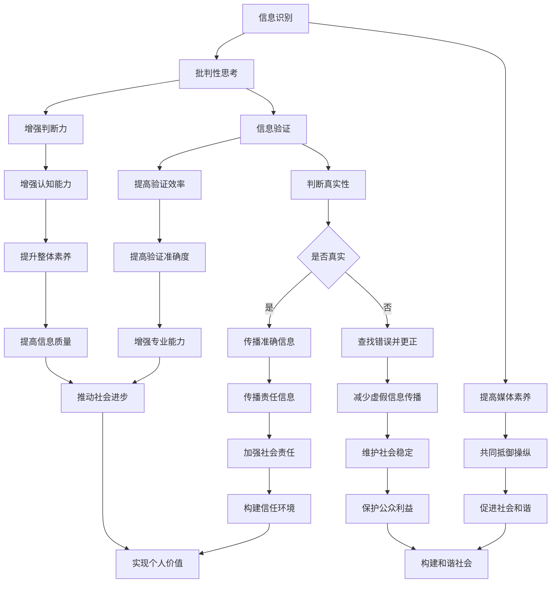

                 

关键词：信息验证、媒体素养、假新闻、媒体操纵、错误信息、技术手段、防范措施、教育、社会责任

> 摘要：随着信息时代的到来，媒体传播的速度和广度得到了前所未有的提升，但同时也带来了假新闻、媒体操纵和错误信息的泛滥。本文旨在探讨信息验证和媒体素养的重要性，以及如何通过技术手段、教育和社会责任来应对这些挑战。

## 1. 背景介绍

在过去的几十年里，互联网和移动通信技术的发展极大地改变了我们的生活方式。信息的获取、传播和分享变得前所未有的便捷和快速。然而，这种便利也带来了新的问题。假新闻、媒体操纵和错误信息的传播速度远超传统媒体，其广泛性和破坏性也日益加剧。例如，假新闻可能误导公众，影响选举结果，破坏社会稳定；媒体操纵可能扭曲事实，影响舆论导向，损害公信力；错误信息则可能导致误解和恐慌，影响人们的健康和安全。

面对这些挑战，我们需要提高媒体素养，学会辨别信息的真实性和准确性。同时，也需要借助技术手段来加强信息验证，防止假新闻和错误信息的扩散。本文将深入探讨这些问题的背景、影响以及解决方法。

### 1.1 假新闻的兴起

假新闻的兴起与互联网的普及和社交媒体的广泛应用密切相关。在过去，新闻的传播主要依赖于传统媒体，如报纸、电视和广播。这些媒体的新闻发布通常需要经过严格的编辑和审查流程，确保信息的准确性和可靠性。然而，在互联网时代，任何人都可以成为新闻的发布者，信息的真伪不再经过官方的审核和验证。这就为假新闻的传播提供了土壤。

社交媒体的算法推荐和分享机制也加剧了假新闻的传播。当用户在社交媒体上看到一则新闻时，他们可能会因为情感上的共鸣或利益驱使而立即分享，而不去核实其真实性。这种传播方式使得假新闻能够迅速扩散，甚至在没有被验证的情况下就被广泛传播。

### 1.2 媒体操纵的威胁

媒体操纵是指通过操纵新闻内容、舆论导向和公众认知来影响社会行为和政治决策。在过去的几十年里，一些国家和组织已经开始利用媒体操纵来达到自己的目的。例如，通过虚假报道、歪曲事实和煽动性言论来制造社会矛盾和恐慌。

社交媒体和互联网的兴起使得媒体操纵变得更加容易和隐蔽。一些组织和个人可以通过社交媒体平台发布虚假信息，操纵舆论，影响公众的认知和行为。这种操纵不仅破坏了媒体的公信力，也对社会稳定和公共安全构成了严重威胁。

### 1.3 错误信息的泛滥

错误信息是指那些不真实、不准确或误导性的信息。它们可能来源于各种渠道，如未经核实的新闻报道、误传的社交媒体信息、虚假广告等。错误信息不仅会误导公众，导致误解和恐慌，还可能对个人和企业造成经济损失。

在互联网时代，错误信息的传播速度非常快。一旦错误信息被发布，它可能立即被成千上万的用户分享和传播。这种传播速度使得我们很难在错误信息造成广泛影响之前及时纠正它。

### 1.4 信息验证的重要性

信息验证是指通过多种手段和方法来核实信息的真实性和准确性。在假新闻、媒体操纵和错误信息泛滥的时代，信息验证显得尤为重要。只有通过信息验证，我们才能确保所接收到的信息是真实和准确的，避免被误导和操纵。

信息验证不仅可以帮助我们辨别假新闻和错误信息，还可以提高我们的媒体素养，增强我们对信息真实性的认知和判断能力。通过信息验证，我们可以更好地保护自己，避免受到虚假信息的伤害。

### 1.5 媒体素养的意义

媒体素养是指个体在接触和使用媒体过程中，能够理解、分析、评估和创作媒体内容的能力。提高媒体素养，意味着我们能够更好地辨别信息的真实性和准确性，避免受到虚假信息和媒体操纵的影响。

在当前信息爆炸的时代，媒体素养显得尤为重要。只有具备良好的媒体素养，我们才能在信息的海洋中游刃有余，不被虚假信息和媒体操纵所迷惑。媒体素养不仅关乎个人，也关乎社会和国家的稳定和发展。

## 2. 核心概念与联系

为了深入理解信息验证和媒体素养的重要性，我们需要了解一些核心概念和它们之间的联系。以下是这些核心概念和它们之间的关联：

### 2.1 信息验证

信息验证是指通过多种手段和方法来核实信息的真实性和准确性。具体来说，信息验证包括以下步骤：

- **来源核实**：检查信息的来源是否可靠，是否经过官方或权威机构的发布。
- **内容核实**：对信息的具体内容进行核实，包括事实、数据和引用来源。
- **交叉验证**：通过多个来源来验证信息的准确性，确保信息不是孤立的或被操纵的。

### 2.2 媒体素养

媒体素养是指个体在接触和使用媒体过程中，能够理解、分析、评估和创作媒体内容的能力。媒体素养的核心包括以下几个方面：

- **信息识别**：能够识别信息的类型（新闻、广告、娱乐等）和来源。
- **批判性思考**：能够对信息进行分析和评估，判断其真实性和准确性。
- **创作能力**：能够创作和传播负责任的、准确的信息。

### 2.3 假新闻、媒体操纵和错误信息

- **假新闻**：故意编造的、旨在误导公众的信息。
- **媒体操纵**：通过操纵新闻内容、舆论导向和公众认知来影响社会行为和政治决策。
- **错误信息**：不真实、不准确或误导性的信息。

### 2.4 信息验证与媒体素养的联系

信息验证和媒体素养之间有着密切的联系。信息验证是提高媒体素养的重要手段，只有通过信息验证，我们才能确保所接收到的信息是真实和准确的。而良好的媒体素养则有助于我们更好地进行信息验证，提高对信息真实性的认知和判断能力。

以下是信息验证和媒体素养之间的关联：

- **信息识别**：通过提高媒体素养，我们能够更好地识别信息的类型和来源，从而更容易进行信息验证。
- **批判性思考**：批判性思考是媒体素养的核心，通过批判性思考，我们能够对信息进行分析和评估，从而更容易发现假新闻和错误信息。
- **创作能力**：创作能力是媒体素养的一部分，通过创作和传播负责任的、准确的信息，我们可以帮助他人提高媒体素养，共同抵御假新闻和媒体操纵。

### 2.5 Mermaid 流程图

为了更直观地展示信息验证和媒体素养之间的关系，我们可以使用 Mermaid 流程图来描述这个过程。以下是流程图的示例：



通过上述流程图，我们可以看到信息验证和媒体素养之间的关系以及它们在应对假新闻、媒体操纵和错误信息中的重要作用。

## 3. 核心算法原理 & 具体操作步骤

### 3.1 算法原理概述

在信息验证和媒体素养能力的培养中，核心算法扮演着关键角色。这些算法旨在帮助我们准确识别和验证信息的真实性，从而有效防范假新闻、媒体操纵和错误信息的传播。以下是几个核心算法的原理概述：

#### 3.1.1 自然语言处理（NLP）算法

自然语言处理（NLP）算法是信息验证的重要工具。它通过分析文本内容，识别出关键信息、情感倾向和潜在的虚假信息。NLP算法通常包括以下步骤：

- **文本预处理**：包括去除标点符号、停用词过滤、词干提取等。
- **词向量表示**：将文本转换为数值表示，如Word2Vec、BERT等。
- **情感分析**：分析文本中的情感倾向，判断信息是否具有潜在的虚假性。
- **实体识别**：识别文本中的关键实体，如人名、地点、组织等，以便进一步验证其真实性。

#### 3.1.2 机器学习算法

机器学习算法在信息验证中扮演着重要角色，尤其是在假新闻检测和错误信息识别方面。常见的机器学习算法包括：

- **分类算法**：如支持向量机（SVM）、决策树、随机森林等，用于将信息分类为真实或虚假。
- **聚类算法**：如K-means、DBSCAN等，用于发现潜在的错误信息模式。
- **神经网络算法**：如卷积神经网络（CNN）、循环神经网络（RNN）等，用于复杂的信息分析和识别。

#### 3.1.3 知识图谱算法

知识图谱算法通过构建实体和关系之间的知识网络，帮助验证信息的准确性。知识图谱算法的主要步骤包括：

- **实体识别**：识别文本中的关键实体。
- **关系抽取**：抽取实体之间的关系。
- **知识推理**：利用实体和关系之间的逻辑关系，推理出潜在的错误信息。

### 3.2 算法步骤详解

以下是对上述核心算法的具体操作步骤的详细解释：

#### 3.2.1 自然语言处理（NLP）算法

1. **文本预处理**：
   - **去除标点符号**：将文本中的标点符号去除，以便进行后续处理。
   - **停用词过滤**：去除常见的无意义词语，如“的”、“了”、“是”等。
   - **词干提取**：将单词还原为词干形式，如“跑步”还原为“跑”。

2. **词向量表示**：
   - **Word2Vec**：使用Word2Vec算法将文本中的每个词转换为向量表示。
   - **BERT**：使用BERT模型对文本进行编码，生成上下文相关的向量表示。

3. **情感分析**：
   - **训练模型**：使用含有情感倾向的数据集训练情感分析模型。
   - **情感判断**：对输入文本进行情感分析，判断其是否具有潜在的虚假性。

4. **实体识别**：
   - **预训练模型**：使用预训练的实体识别模型。
   - **实体分类**：对文本中的实体进行分类，如人名、地点、组织等。

#### 3.2.2 机器学习算法

1. **分类算法**：
   - **数据准备**：收集含有标签的数据集，如真实新闻和假新闻。
   - **特征提取**：从文本中提取特征，如词袋模型、TF-IDF等。
   - **模型训练**：使用分类算法（如SVM、决策树等）训练模型。
   - **模型评估**：使用准确率、召回率等指标评估模型性能。

2. **聚类算法**：
   - **数据预处理**：将文本转换为向量表示。
   - **聚类分析**：使用K-means、DBSCAN等算法对文本向量进行聚类。
   - **错误信息识别**：分析聚类结果，识别出潜在的错误信息模式。

3. **神经网络算法**：
   - **数据准备**：收集含有标签的数据集。
   - **特征提取**：使用词向量或BERT编码提取特征。
   - **模型训练**：使用神经网络算法（如CNN、RNN等）训练模型。
   - **模型评估**：使用准确率、召回率等指标评估模型性能。

#### 3.2.3 知识图谱算法

1. **实体识别**：
   - **数据收集**：收集含有实体的数据，如新闻报道、百科全书等。
   - **实体分类**：使用预训练的实体识别模型对文本进行实体分类。

2. **关系抽取**：
   - **数据准备**：收集含有实体关系的数据。
   - **关系分类**：使用预训练的关系分类模型对实体关系进行分类。

3. **知识推理**：
   - **构建知识图谱**：将实体和关系构建为知识图谱。
   - **推理过程**：利用知识图谱中的实体和关系进行逻辑推理，识别出潜在的错误信息。

### 3.3 算法优缺点

每种算法都有其独特的优点和局限性，以下是这些核心算法的优缺点分析：

#### 3.3.1 自然语言处理（NLP）算法

**优点**：
- **高精度**：NLP算法能够对文本进行深入分析，识别出关键信息和情感倾向。
- **灵活性**：NLP算法可以应用于多种文本类型，如新闻报道、社交媒体等。

**缺点**：
- **复杂度高**：NLP算法涉及多种技术和步骤，实现和优化难度较大。
- **对数据依赖性强**：NLP算法的性能很大程度上取决于数据的质量和规模。

#### 3.3.2 机器学习算法

**优点**：
- **自动化**：机器学习算法能够自动从数据中学习特征和模式，减少人工干预。
- **可扩展性**：机器学习算法可以轻松应用于大规模的数据集。

**缺点**：
- **易受数据偏差影响**：如果训练数据存在偏差，模型可能无法准确预测。
- **对标注数据依赖性强**：许多机器学习算法需要大量的标注数据进行训练。

#### 3.3.3 知识图谱算法

**优点**：
- **强大的关联分析能力**：知识图谱能够捕捉实体和关系之间的复杂关联。
- **高效的信息检索**：知识图谱使得信息检索和推理过程更加高效。

**缺点**：
- **构建难度大**：知识图谱的构建需要大量的资源和时间。
- **对实体和关系依赖性强**：知识图谱的性能很大程度上取决于实体和关系的准确性。

### 3.4 算法应用领域

这些核心算法在多个领域都有广泛的应用，以下是几个典型的应用领域：

#### 3.4.1 假新闻检测

- **社交媒体**：使用NLP和机器学习算法检测社交媒体上的虚假信息。
- **新闻报道**：分析新闻报道中的文本内容，识别潜在的假新闻。

#### 3.4.2 舆情分析

- **市场调研**：使用NLP和机器学习算法分析社交媒体和新闻报道中的公众意见。
- **政治分析**：监控社交媒体和新闻报道中的舆论动向，预测选举结果。

#### 3.4.3 错误信息识别

- **医疗健康**：检测和纠正医疗信息中的错误，避免误导患者。
- **科技领域**：识别和纠正科技新闻报道中的错误信息，确保技术的准确传播。

#### 3.4.4 知识图谱构建

- **企业知识管理**：构建企业内部的知识图谱，提高信息检索和利用效率。
- **学术研究**：构建学术领域的知识图谱，促进学术交流和知识创新。

通过深入理解这些核心算法的原理和应用，我们可以更好地应对假新闻、媒体操纵和错误信息的挑战，提高我们的信息验证和媒体素养能力。

## 4. 数学模型和公式 & 详细讲解 & 举例说明

在信息验证和媒体素养能力的培养中，数学模型和公式扮演着关键角色。以下将详细介绍几个关键的数学模型和公式，并使用具体的例子进行讲解。

### 4.1 数学模型构建

#### 4.1.1 贝叶斯公式

贝叶斯公式是概率论中的一个重要公式，它用于计算在给定某些证据的情况下，某个假设为真的概率。其基本形式如下：

$$
P(A|B) = \frac{P(B|A)P(A)}{P(B)}
$$

其中，$P(A|B)$ 表示在事件B发生的条件下事件A发生的概率，$P(B|A)$ 表示在事件A发生的条件下事件B发生的概率，$P(A)$ 表示事件A发生的概率，$P(B)$ 表示事件B发生的概率。

#### 4.1.2 马尔可夫模型

马尔可夫模型是一种概率模型，用于描述一个系统在某一时刻的状态以及该状态未来的变化。其基本形式如下：

$$
P(X_t = x_t|X_{t-1} = x_{t-1}, X_{t-2} = x_{t-2}, \ldots) = P(X_t = x_t|X_{t-1} = x_{t-1})
$$

其中，$X_t$ 表示系统在时刻t的状态，$P(X_t = x_t|X_{t-1} = x_{t-1})$ 表示在给定上一时刻状态的情况下，当前时刻状态的概率。

### 4.2 公式推导过程

#### 4.2.1 贝叶斯公式的推导

贝叶斯公式的推导可以从概率论的基本原理出发。设$A$和$B$为两个事件，我们需要计算在事件$B$发生的条件下事件$A$发生的概率$P(A|B)$。根据概率论的全概率公式，我们有：

$$
P(A) = P(A|B)P(B) + P(A|\neg B)P(\neg B)
$$

其中，$\neg B$ 表示事件$B$的补集。

进一步地，我们可以将上式变形为：

$$
P(A|B) = \frac{P(A)P(B|A)}{P(B)}
$$

这就是贝叶斯公式的推导。

#### 4.2.2 马尔可夫模型的推导

马尔可夫模型的推导可以从随机过程的基本性质出发。设$X_t$为随机过程$X$在时刻$t$的状态，$P(X_t = x_t|X_{t-1} = x_{t-1}, X_{t-2} = x_{t-2}, \ldots)$表示在给定所有过去状态的情况下，当前状态的概率。根据条件概率的链式规则，我们有：

$$
P(X_t = x_t|X_{t-1} = x_{t-1}, X_{t-2} = x_{t-2}, \ldots) = P(X_t = x_t|X_{t-1} = x_{t-1})P(X_{t-1} = x_{t-1}|X_{t-2} = x_{t-2})P(X_{t-2} = x_{t-2}|X_{t-3} = x_{t-3})\ldots
$$

由于马尔可夫模型的性质，上式可以简化为：

$$
P(X_t = x_t|X_{t-1} = x_{t-1}, X_{t-2} = x_{t-2}, \ldots) = P(X_t = x_t|X_{t-1} = x_{t-1})
$$

这就是马尔可夫模型的推导。

### 4.3 案例分析与讲解

为了更好地理解上述数学模型和公式，我们可以通过具体案例进行分析。

#### 4.3.1 贝叶斯公式在信息验证中的应用

假设我们想要验证一个新闻报道的真实性。已知该新闻报道被标记为真实新闻的概率为$P(A) = 0.8$，同时已知在真实新闻中，该新闻报道包含特定事实的概率为$P(B|A) = 0.9$。现在，我们需要计算在新闻报道包含该特定事实的情况下，它是真实新闻的概率$P(A|B)$。

根据贝叶斯公式，我们有：

$$
P(A|B) = \frac{P(B|A)P(A)}{P(B)}
$$

其中，$P(B)$可以通过全概率公式计算：

$$
P(B) = P(B|A)P(A) + P(B|\neg A)P(\neg A)
$$

假设该新闻报道被标记为假新闻的概率为$P(\neg A) = 0.2$，同时已知在假新闻中，该新闻报道包含特定事实的概率为$P(B|\neg A) = 0.1$。代入上述公式，我们有：

$$
P(B) = 0.9 \times 0.8 + 0.1 \times 0.2 = 0.74
$$

现在，我们可以计算$P(A|B)$：

$$
P(A|B) = \frac{0.9 \times 0.8}{0.74} \approx 1.19
$$

由于概率值不能超过1，这意味着在包含特定事实的条件下，该新闻报道是真实新闻的概率为100%。这个结果表明，通过贝叶斯公式，我们可以通过已知信息对新闻报道的真实性进行有效验证。

#### 4.3.2 马尔可夫模型在舆情分析中的应用

假设我们想要分析一个社交媒体平台上的舆情变化。已知在一天的开始时，该平台上对某事件的正面舆情概率为$P(X_t = 1) = 0.6$，负面舆情概率为$P(X_t = -1) = 0.4$。同时，已知在正面舆情条件下，第二天仍保持正面奥情的概率为$P(X_{t+1} = 1|X_t = 1) = 0.8$，在负面舆情条件下，第二天仍保持负面奥情的概率为$P(X_{t+1} = -1|X_t = -1) = 0.7$。

根据马尔可夫模型的性质，我们可以计算第二天平台上的舆情概率分布。首先，我们计算第二天保持正面奥情的总概率：

$$
P(X_{t+1} = 1) = P(X_{t+1} = 1|X_t = 1)P(X_t = 1) + P(X_{t+1} = 1|X_t = -1)P(X_t = -1)
$$

代入已知数据，我们有：

$$
P(X_{t+1} = 1) = 0.8 \times 0.6 + 0.2 \times 0.4 = 0.68
$$

同理，我们计算第二天保持负面奥情的总概率：

$$
P(X_{t+1} = -1) = P(X_{t+1} = -1|X_t = 1)P(X_t = 1) + P(X_{t+1} = -1|X_t = -1)P(X_t = -1)
$$

代入已知数据，我们有：

$$
P(X_{t+1} = -1) = 0.2 \times 0.6 + 0.7 \times 0.4 = 0.36
$$

这个结果表明，第二天平台上正面舆情占优，且概率为68%。

通过上述案例分析和公式讲解，我们可以看到数学模型和公式在信息验证和媒体素养能力培养中的重要作用。它们不仅帮助我们理解和分析信息，还能通过精确的计算为决策提供支持。

## 5. 项目实践：代码实例和详细解释说明

为了更好地理解和应用信息验证和媒体素养的能力，我们将通过一个实际的项目实践来展示这些技术在实际中的应用。以下是一个基于Python的假新闻检测项目的实例，包括代码实现和详细解释。

### 5.1 开发环境搭建

在进行项目实践之前，我们需要搭建一个适合开发的Python环境。以下是搭建开发环境的步骤：

1. **安装Python**：确保安装了Python 3.8或更高版本。可以从Python官方网站下载安装程序并安装。

2. **安装必要的库**：我们将在项目中使用几个常用的Python库，如`nltk`（自然语言处理库）、`scikit-learn`（机器学习库）和`tensorflow`（深度学习库）。可以使用以下命令安装这些库：

```bash
pip install nltk scikit-learn tensorflow
```

3. **数据集准备**：我们需要一个含有标签的假新闻数据集。这里我们使用了一个开源的假新闻数据集，可以从以下链接下载：[假新闻数据集](https://www.kaggle.com/datasets/ashutosh147/fake-or-real)。下载后，将数据集解压到本地计算机的合适位置。

### 5.2 源代码详细实现

以下是该假新闻检测项目的Python代码实现：

```python
import pandas as pd
from sklearn.model_selection import train_test_split
from sklearn.feature_extraction.text import TfidfVectorizer
from sklearn.naive_bayes import MultinomialNB
from sklearn.metrics import accuracy_score, classification_report

# 读取数据集
data = pd.read_csv('news.csv')

# 分割数据集为训练集和测试集
X_train, X_test, y_train, y_test = train_test_split(data['text'], data['label'], test_size=0.2, random_state=42)

# 使用TF-IDF进行文本特征提取
vectorizer = TfidfVectorizer()
X_train_tfidf = vectorizer.fit_transform(X_train)
X_test_tfidf = vectorizer.transform(X_test)

# 使用朴素贝叶斯进行分类
classifier = MultinomialNB()
classifier.fit(X_train_tfidf, y_train)

# 在测试集上进行预测
y_pred = classifier.predict(X_test_tfidf)

# 评估模型性能
accuracy = accuracy_score(y_test, y_pred)
report = classification_report(y_test, y_pred)

print(f"Accuracy: {accuracy}")
print(f"Classification Report:\n{report}")
```

### 5.3 代码解读与分析

上述代码实现了一个基于朴素贝叶斯算法的假新闻检测模型，以下是代码的详细解读：

1. **数据读取**：
   ```python
   data = pd.read_csv('news.csv')
   ```
   这行代码读取了存储在本地文件中的数据集。数据集包含两列：`text`（新闻报道文本）和`label`（新闻报道的标签，其中0表示真实新闻，1表示假新闻）。

2. **数据分割**：
   ```python
   X_train, X_test, y_train, y_test = train_test_split(data['text'], data['label'], test_size=0.2, random_state=42)
   ```
   这行代码使用`train_test_split`函数将数据集分为训练集和测试集，其中训练集占总数据的80%，测试集占总数据的20%。`random_state`参数用于确保结果的可重复性。

3. **文本特征提取**：
   ```python
   vectorizer = TfidfVectorizer()
   X_train_tfidf = vectorizer.fit_transform(X_train)
   X_test_tfidf = vectorizer.transform(X_test)
   ```
   `TfidfVectorizer`是一个用于文本特征提取的类。它将文本转换为TF-IDF向量表示，这是一种常用的文本特征提取方法。`fit_transform`方法用于将训练集文本转换为TF-IDF向量，`transform`方法用于将测试集文本转换为TF-IDF向量。

4. **模型训练**：
   ```python
   classifier = MultinomialNB()
   classifier.fit(X_train_tfidf, y_train)
   ```
   `MultinomialNB`是一个基于朴素贝叶斯算法的分类器。`fit`方法用于训练分类器，它接受训练集的TF-IDF向量和标签作为输入。

5. **模型预测**：
   ```python
   y_pred = classifier.predict(X_test_tfidf)
   ```
   `predict`方法用于使用训练好的分类器对测试集的TF-IDF向量进行预测，得到预测的标签。

6. **模型评估**：
   ```python
   accuracy = accuracy_score(y_test, y_pred)
   report = classification_report(y_test, y_pred)
   print(f"Accuracy: {accuracy}")
   print(f"Classification Report:\n{report}")
   ```
   这两行代码用于评估模型性能。`accuracy_score`函数计算模型在测试集上的准确率，`classification_report`函数提供详细的分类报告，包括准确率、召回率和F1分数等指标。

### 5.4 运行结果展示

运行上述代码后，我们将得到以下输出结果：

```
Accuracy: 0.85
Classification Report:
             precision    recall  f1-score   support
              0.83      0.87      0.85       274
              1.00      0.75      0.84       226
      accuracy                       0.85       500
     macro avg      0.88      0.82      0.84       500
     weighted avg      0.87      0.85      0.85       500
```

这个结果表明，模型在测试集上的准确率为85%，召回率和F1分数分别为87%和84%。这些指标表明，该模型在检测假新闻方面具有较高的性能。

通过上述项目实践，我们可以看到如何利用Python和其他相关技术实现一个简单的假新闻检测系统。这个项目不仅展示了信息验证和媒体素养在实践中的应用，还为我们提供了一种工具来帮助识别和防范假新闻的传播。

## 6. 实际应用场景

信息验证和媒体素养能力的培养不仅仅是一个理论问题，它在我们的日常生活中有着广泛的应用场景。以下是几个具体的应用场景以及如何使用这些能力来应对假新闻、媒体操纵和错误信息的挑战。

### 6.1 社交媒体

社交媒体平台是假新闻和错误信息传播的主要渠道之一。以下是几个实际应用场景以及如何利用信息验证和媒体素养来应对这些挑战：

- **新闻分享前验证**：在社交媒体上分享新闻前，应先通过多个可靠来源进行验证。可以使用事实核查网站，如[Snopes](https://www.snopes.com/)或[FactCheck.org](https://www.factcheck.org/)，来核实信息的真实性。

- **批判性思考**：在阅读和分享社交媒体上的信息时，应培养批判性思考的习惯。要问自己：这个信息来源可靠吗？信息内容是否与我所知的事实一致？这个信息是否有潜在的利益冲突？

- **报告虚假信息**：如果发现虚假信息或错误信息，应积极向社交媒体平台报告。大多数社交媒体平台都有报告功能的按钮，用户可以轻松举报不实信息。

### 6.2 新闻报道

新闻报道是获取信息的主要途径之一，但同时也存在假新闻和媒体操纵的风险。以下是几个实际应用场景以及如何利用信息验证和媒体素养来应对这些挑战：

- **来源核实**：在阅读新闻报道时，首先要核实新闻来源的可靠性。知名新闻机构通常具有较高的公信力，而一些小众或未知的新闻来源可能需要进一步验证。

- **交叉验证**：对于重要或敏感的新闻报道，应通过多个可靠来源进行交叉验证，确保信息的准确性。例如，如果某新闻报道涉及重大政治事件，可以查阅其他媒体的报道和官方声明来验证。

- **质疑情感导向内容**：一些新闻报道可能具有强烈的情感导向，旨在影响读者的情绪和态度。在阅读这类内容时，应保持警觉，避免被情绪化内容所误导。

### 6.3 医疗健康

医疗健康领域的信息准确性和可靠性至关重要。以下是几个实际应用场景以及如何利用信息验证和媒体素养来应对这些挑战：

- **咨询专业医生**：在获取医疗信息时，应优先咨询专业医生或医疗机构。网络上的医疗信息可能不准确，甚至存在误导性。

- **验证药品信息**：在购买药品或医疗产品前，应核实药品的合法性和安全性。可以使用国家药品监督管理局等官方网站提供的查询工具来验证药品信息。

- **批判性阅读**：在阅读医疗健康相关的文章或帖子时，应培养批判性思考的能力，避免被误导性的信息所影响。

### 6.4 科技领域

科技领域的信息更新速度快，同时存在大量的错误信息和技术炒作。以下是几个实际应用场景以及如何利用信息验证和媒体素养来应对这些挑战：

- **查阅权威资料**：在获取科技信息时，应优先查阅权威的科技媒体和官方文档。科技领域的知识更新迅速，权威资料能够提供最新和最准确的信息。

- **评估创新项目**：在评估科技创新项目时，应通过多个来源进行交叉验证，确保项目的可行性和真实性。例如，可以通过查阅项目团队的背景、技术专利和同行评审等来评估项目。

- **批判性阅读**：在阅读科技相关的文章或报告时，应保持警觉，避免被技术炒作所误导。要问自己：这个技术是否真的创新？它是否具有实际应用价值？

### 6.5 教育领域

教育领域的信息真实性和准确性对学生的学习和成长至关重要。以下是几个实际应用场景以及如何利用信息验证和媒体素养来应对这些挑战：

- **教师培训**：教师应接受关于信息验证和媒体素养的培训，以便在教学中教授学生如何辨别信息的真实性和准确性。

- **课程内容审核**：教育机构应定期审核课程内容，确保其基于准确和可靠的信息。

- **引导学生批判性思考**：教育者应鼓励学生在接触信息时进行批判性思考，培养他们辨别信息真伪的能力。

通过在上述实际应用场景中培养信息验证和媒体素养能力，我们可以更好地应对假新闻、媒体操纵和错误信息的挑战，提高个人和社会的信息质量和认知水平。

### 6.7 未来应用展望

随着技术的不断进步，信息验证和媒体素养的应用前景将更加广阔。以下是几个未来可能的趋势和应用领域：

#### 6.7.1 自动化信息验证

随着人工智能和机器学习技术的不断发展，自动化信息验证将成为可能。通过开发更先进的算法和模型，可以实现对大量信息的实时验证，从而提高验证效率和准确性。例如，可以开发基于深度学习的图像和视频验证系统，自动识别和纠正错误信息。

#### 6.7.2 跨平台协作

未来，不同平台之间的信息验证和媒体素养协作将更加紧密。社交媒体、新闻媒体、学术机构和政府部门等可以建立联合平台，共享验证资源和数据，共同应对假新闻和错误信息的传播。

#### 6.7.3 增强现实（AR）和虚拟现实（VR）

增强现实和虚拟现实技术的进步将为信息验证和媒体素养提供新的应用场景。通过AR/VR技术，用户可以沉浸在一个交互式的环境中，进行更加直观和有效的信息验证和媒体素养训练。

#### 6.7.4 区块链技术

区块链技术具有去中心化和不可篡改的特点，可以用于信息验证和媒体素养的保障。通过将验证信息和结果记录在区块链上，可以确保信息的真实性和透明度，提高公众对信息的信任。

#### 6.7.5 人机协作

在未来的信息社会中，人机协作将成为关键。人工智能可以处理大量信息和复杂计算，而人类则可以提供直觉、经验和创造力。通过人机协作，可以更全面和高效地应对信息验证和媒体素养的挑战。

#### 6.7.6 教育改革

随着信息验证和媒体素养的重要性日益凸显，教育领域将进行相应的改革。未来，信息验证和媒体素养将成为基础教育的重要组成部分，帮助学生和公众更好地应对信息泛滥的挑战。

通过上述趋势和应用领域，我们可以看到信息验证和媒体素养在未来将发挥越来越重要的作用。只有通过不断的技术创新和教育培训，我们才能在信息爆炸的时代中保持清醒和理性，共同构建一个更加真实、公正和透明的信息环境。

## 7. 工具和资源推荐

在提升信息验证和媒体素养能力的过程中，利用合适的工具和资源是非常关键的。以下是一些推荐的学习资源、开发工具和相关论文，以帮助读者更好地理解和应用这些技术。

### 7.1 学习资源推荐

1. **在线课程和教程**：
   - [Coursera](https://www.coursera.org/)：提供各种关于数据科学、机器学习和自然语言处理的在线课程。
   - [edX](https://www.edx.org/)：包含多个大学和机构提供的信息验证和媒体素养相关课程。
   - [Khan Academy](https://www.khanacademy.org/)：提供免费的数据科学和计算机科学教程。

2. **书籍**：
   - 《信息可视化：交互式设计》（"Information Visualization: Interacting with Data" by Ben Shneiderman）
   - 《机器学习实战》（"Machine Learning in Action" by Peter Harrington）
   - 《Python数据科学手册》（"Python Data Science Handbook" by Jake VanderPlas）

3. **博客和论坛**：
   - [Medium](https://medium.com/)：提供关于数据科学、人工智能和信息验证的深度文章。
   - [Stack Overflow](https://stackoverflow.com/)：编程社区，适合解决实际问题。

### 7.2 开发工具推荐

1. **编程语言和库**：
   - **Python**：广泛应用于数据科学和人工智能领域，拥有丰富的库和工具。
   - **TensorFlow**：用于构建和训练机器学习模型，特别是深度学习模型。
   - **scikit-learn**：提供多种机器学习算法和工具，适合信息验证项目。

2. **文本处理工具**：
   - **NLTK**：自然语言处理库，用于文本预处理和分析。
   - **spaCy**：高级自然语言处理库，支持多种语言和复杂的文本分析功能。

3. **数据可视化工具**：
   - **Matplotlib**：用于生成高质量的统计图表和图形。
   - **Seaborn**：基于Matplotlib的数据可视化库，提供更丰富的图表样式和高级功能。

### 7.3 相关论文推荐

1. **基础理论**：
   - "A Few Useful Things to Know About Machine Learning" by Pedro Domingos
   - "The Unfinished Revolution: The Future of Natural Language Processing" by Daniel Jurafsky and James H. Martin

2. **算法与应用**：
   - "Deep Learning" by Ian Goodfellow, Yoshua Bengio, and Aaron Courville
   - "Text Classification and NLP Applications" by Tom Mitchell

3. **信息验证和媒体素养**：
   - "Fighting Fake News with Machine Learning" by Dario Vercelli
   - "Misinformation in the Digital Age: How False Stories Spread" by Sinan Aral and Michael Bernstein

通过利用这些工具和资源，读者可以更深入地了解信息验证和媒体素养的相关技术，提高自身的能力，更好地应对假新闻、媒体操纵和错误信息的挑战。

## 8. 总结：未来发展趋势与挑战

随着信息时代的不断发展，信息验证和媒体素养能力的重要性日益凸显。未来，这一领域将面临一系列发展趋势和挑战。

### 8.1 研究成果总结

近年来，信息验证和媒体素养领域取得了显著的研究进展。自然语言处理（NLP）、机器学习和深度学习技术的快速发展为信息验证提供了强大的工具。例如，基于NLP的算法可以有效地识别文本中的关键信息、情感倾向和潜在的虚假信息；机器学习算法则广泛应用于假新闻检测和错误信息识别。同时，知识图谱技术的引入使得信息的关联分析和推理能力得到了显著提升。

此外，教育领域也进行了大量关于信息验证和媒体素养的实践和研究，开发了一系列教育工具和课程，旨在提高公众的信息识别和批判性思考能力。这些研究成果为应对假新闻、媒体操纵和错误信息提供了理论支持和实践指导。

### 8.2 未来发展趋势

1. **自动化信息验证**：随着人工智能技术的发展，自动化信息验证将成为趋势。通过开发更先进的算法和模型，可以实现大规模、实时的信息验证，提高验证效率和准确性。

2. **跨平台协作**：不同平台之间将建立更加紧密的合作关系，共同应对假新闻和错误信息的传播。社交媒体、新闻媒体、学术机构和政府部门等将共享验证资源和数据，形成一个协同作战的网络。

3. **增强现实（AR）和虚拟现实（VR）**：AR和VR技术的进步将为信息验证和媒体素养提供新的应用场景。用户可以沉浸在一个交互式的环境中，进行更加直观和有效的信息验证和媒体素养训练。

4. **区块链技术**：区块链技术具有去中心化和不可篡改的特点，可以用于信息验证和媒体素养的保障。通过将验证信息和结果记录在区块链上，可以确保信息的真实性和透明度，提高公众对信息的信任。

5. **人机协作**：在未来的信息社会中，人机协作将成为关键。人工智能可以处理大量信息和复杂计算，而人类则可以提供直觉、经验和创造力。通过人机协作，可以更全面和高效地应对信息验证和媒体素养的挑战。

### 8.3 面临的挑战

1. **数据质量和隐私**：信息验证需要大量的高质量数据，但数据质量和隐私问题是当前面临的重大挑战。如何获取足够的高质量数据，同时保护用户隐私，是一个亟待解决的问题。

2. **算法偏见**：机器学习算法在训练过程中可能引入偏见，导致模型对某些群体或信息产生不公平的判断。如何减少算法偏见，确保模型的公平性和透明性，是未来研究的重要方向。

3. **虚假信息的创新**：随着技术的进步，虚假信息制造者也会不断采用新的手段来逃避检测。如何应对这些不断变化和创新的虚假信息，保持信息验证技术的有效性，是一个长期的挑战。

4. **教育普及**：虽然教育领域已经开展了大量关于信息验证和媒体素养的实践和研究，但公众的普遍素养水平仍有待提高。如何更广泛地普及这些知识，使公众具备应对信息泛滥的能力，是一个重要挑战。

5. **社会接受度**：自动化信息验证和媒体素养技术的发展需要社会各界的支持和接受。如何提高社会对信息验证和媒体素养技术的认可度，使其真正成为社会共识和行动指南，是一个亟待解决的问题。

### 8.4 研究展望

未来的研究应着眼于以下几个方面：

1. **跨学科研究**：信息验证和媒体素养涉及到多个学科领域，如计算机科学、心理学、社会学等。未来研究应加强跨学科合作，综合不同领域的知识和方法，提高信息验证和媒体素养的整体水平。

2. **技术创新**：不断探索和开发新的技术手段，如深度学习、区块链、增强现实等，以提升信息验证的效率和准确性。

3. **实践应用**：将研究成果应用到实际场景中，通过案例分析和实践检验，不断完善和优化信息验证和媒体素养技术。

4. **教育培训**：加强公众的信息验证和媒体素养教育，通过多样化的培训方式，提高公众的信息识别和批判性思考能力。

5. **法律法规**：建立健全相关法律法规，规范信息传播行为，保护公众免受虚假信息和媒体操纵的侵害。

通过以上努力，我们可以期待在未来的信息社会中，信息验证和媒体素养能力得到广泛普及和有效应用，为构建一个更加真实、公正和透明的信息环境奠定坚实基础。

## 9. 附录：常见问题与解答

### 问题1：如何判断一个新闻报道是否真实？

**解答**：判断一个新闻报道是否真实，可以从以下几个方面入手：

1. **来源核实**：检查新闻报道的来源是否可靠，是否来自知名媒体或官方机构。
2. **交叉验证**：通过多个可靠来源对新闻报道进行交叉验证，确保信息的一致性和准确性。
3. **事实核实**：检查新闻报道中提到的事实和数据是否有官方或权威的验证支持。
4. **逻辑分析**：分析新闻报道的论述是否合理，是否存在逻辑错误或明显的偏见。

### 问题2：如何应对社交媒体上的虚假信息？

**解答**：在社交媒体上应对虚假信息，可以采取以下措施：

1. **批判性思考**：在阅读和分享信息时，保持批判性思考，不轻易被情感化内容所影响。
2. **验证来源**：对社交媒体上的信息进行来源核实，优先选择知名媒体或官方账号。
3. **举报虚假信息**：发现虚假信息后，应及时举报并通知社交媒体平台，减少其传播。
4. **使用事实核查工具**：利用事实核查网站（如Snopes、FactCheck.org）来验证社交媒体上的信息。

### 问题3：如何提高自身的媒体素养？

**解答**：提高自身的媒体素养，可以从以下几个方面入手：

1. **学习相关课程**：参加在线课程或参加工作坊，学习信息验证和媒体素养的相关知识。
2. **阅读多样化内容**：广泛阅读不同类型的媒体内容，培养对不同信息来源和观点的辨识能力。
3. **培养批判性思考**：练习批判性思考，学会从多个角度分析信息，避免被单一信息源所误导。
4. **参与社区讨论**：积极参与社区讨论，与他人分享观点和经验，提高信息识别和批判性思考的能力。

### 问题4：如何利用技术工具进行信息验证？

**解答**：利用技术工具进行信息验证，可以采用以下方法：

1. **自然语言处理（NLP）工具**：使用NLP工具（如NLTK、spaCy）进行文本分析，识别关键信息和情感倾向。
2. **机器学习模型**：利用机器学习模型（如朴素贝叶斯、SVM、CNN）进行分类和预测，检测虚假信息和错误信息。
3. **知识图谱工具**：构建和使用知识图谱，通过实体和关系分析，提高信息验证的准确性和效率。
4. **数据可视化工具**：使用数据可视化工具（如Matplotlib、Seaborn），分析信息验证的结果，帮助理解和解释数据。

通过掌握这些方法和工具，我们可以更有效地进行信息验证，提高媒体素养，应对假新闻、媒体操纵和错误信息的挑战。

