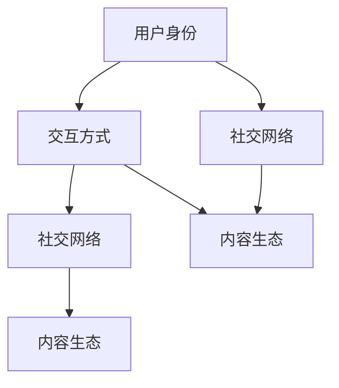

                 

关键词：元宇宙、虚拟社区、社交网络、新形态、技术、算法、应用场景、未来展望

> 摘要：本文探讨了元宇宙中的虚拟社区这一全球社交网络的新形态，分析了其核心概念、技术原理、应用场景以及未来发展的趋势与挑战。通过对虚拟社区的发展历程、关键技术、算法模型和应用领域的深入剖析，旨在为读者呈现一个全面、清晰的元宇宙虚拟社区图景。

## 1. 背景介绍

### 元宇宙的概念

元宇宙（Metaverse）是一个虚拟的三维空间，用户可以通过数字化的身份在其中进行互动、娱乐、学习和工作。它是一个集成了虚拟现实（VR）、增强现实（AR）、区块链、人工智能（AI）等前沿技术的综合生态系统。元宇宙的目标是创造一个高度沉浸、互动和互联的虚拟世界，超越现实世界的限制。

### 虚拟社区的发展历程

虚拟社区起源于20世纪90年代的互联网时代，最早的代表是早期的论坛和聊天室。随着互联网技术的发展，虚拟社区逐渐演变成各种形式，包括社交网络、在线游戏、虚拟现实社交平台等。元宇宙的兴起为虚拟社区带来了新的机遇和挑战，使其成为全球社交网络的新形态。

## 2. 核心概念与联系

在元宇宙中，虚拟社区的核心概念包括：

- **用户身份**：用户在虚拟社区中的数字化身份，可以是虚拟角色或真实头像。
- **交互方式**：用户在虚拟社区中的互动方式，包括文字、语音、手势、动作等。
- **社交网络**：虚拟社区中的用户关系网络，可以通过好友、群组、社群等形式进行组织。
- **内容生态**：虚拟社区中的各种内容，包括文本、图片、视频、游戏等。

以下是一个简单的 Mermaid 流程图，展示了虚拟社区的核心概念和联系：



## 3. 核心算法原理 & 具体操作步骤

### 3.1 算法原理概述

虚拟社区的核心算法主要包括推荐算法、社交网络分析、虚拟现实交互技术等。推荐算法用于根据用户兴趣和行为推荐内容；社交网络分析用于分析用户关系和社群结构；虚拟现实交互技术用于实现用户在虚拟空间中的沉浸式交互。

### 3.2 算法步骤详解

#### 3.2.1 推荐算法

1. 数据收集：收集用户的行为数据，包括浏览记录、点赞、评论等。
2. 数据预处理：清洗和预处理数据，包括去除噪声、缺失值填充等。
3. 特征提取：提取用户行为数据中的特征，如用户活跃度、兴趣偏好等。
4. 模型训练：使用机器学习算法训练推荐模型，如协同过滤、基于内容的推荐等。
5. 推荐生成：根据用户特征和模型输出，生成推荐结果。

#### 3.2.2 社交网络分析

1. 数据采集：采集虚拟社区中的用户关系数据，包括好友、群组、社群等。
2. 图模型构建：将用户关系数据构建为图模型，用于表示社交网络结构。
3. 社群发现：使用图论算法发现社交网络中的社群结构。
4. 社群分析：分析社群的属性和成员特征，为用户提供社群推荐。

#### 3.2.3 虚拟现实交互技术

1. 感应设备：使用虚拟现实头盔、手柄等设备感知用户的动作和手势。
2. 交互界面：设计虚拟现实中的交互界面，实现用户与虚拟环境的互动。
3. 空间定位：使用传感器和定位技术实现用户在虚拟空间中的定位和导航。
4. 沉浸式体验：通过视觉、听觉、触觉等多感官刺激，实现用户的沉浸式体验。

### 3.3 算法优缺点

#### 推荐算法

- 优点：提高用户满意度，提升用户体验。
- 缺点：可能导致信息过载，用户隐私保护问题。

#### 社交网络分析

- 优点：发现用户关系和社群结构，促进社交互动。
- 缺点：可能引发社交网络偏见，影响社区氛围。

#### 虚拟现实交互技术

- 优点：提供沉浸式体验，增强用户互动。
- 缺点：技术成本高，设备普及率低。

### 3.4 算法应用领域

- 社交网络：虚拟社区、在线游戏、社交媒体等。
- 娱乐：虚拟现实游戏、虚拟演唱会、在线娱乐等。
- 教育：虚拟课堂、在线培训、虚拟实验室等。
- 工作：虚拟会议室、远程办公、虚拟团队协作等。

## 4. 数学模型和公式 & 详细讲解 & 举例说明

### 4.1 数学模型构建

在虚拟社区中，常用的数学模型包括用户行为模型、社交网络模型、推荐模型等。

#### 用户行为模型

用户行为模型通常基于马尔可夫决策过程（MDP）构建，用于预测用户在虚拟社区中的行为。

$$
P_{ij}(t+1) = f(\textbf{x}_t, \textbf{u}_t)
$$

其中，$P_{ij}(t+1)$表示用户在时间$t$之后的动作概率，$\textbf{x}_t$表示用户在时间$t$的观察状态，$\textbf{u}_t$表示用户在时间$t$的决策变量。

#### 社交网络模型

社交网络模型通常基于图论构建，用于表示用户关系和社群结构。

$$
G = (V, E)
$$

其中，$G$表示社交网络图，$V$表示节点集合，$E$表示边集合。

#### 推荐模型

推荐模型通常基于协同过滤算法构建，用于根据用户行为推荐内容。

$$
R_{ij} = \sum_{k \in N_j} w_{ik} h_{kj}
$$

其中，$R_{ij}$表示用户$i$对项目$j$的评分，$w_{ik}$表示用户$i$和$k$之间的相似度，$h_{kj}$表示项目$k$和$j$之间的相似度。

### 4.2 公式推导过程

#### 用户行为模型推导

假设用户在时间$t$的观察状态为$\textbf{x}_t = (x_{1t}, x_{2t}, ..., x_{nt})$，决策变量为$\textbf{u}_t = (u_{1t}, u_{2t}, ..., u_{mt})$，则用户在时间$t+1$的动作概率可以表示为：

$$
P_{ij}(t+1) = \frac{f(\textbf{x}_t, \textbf{u}_t)}{\sum_{k=1}^{m} f(\textbf{x}_t, \textbf{u}_t)}
$$

其中，$f(\textbf{x}_t, \textbf{u}_t)$表示动作$i$在观察状态$\textbf{x}_t$和决策变量$\textbf{u}_t$下的概率。

#### 社交网络模型推导

假设用户关系图$G$中的节点集合为$V = \{v_1, v_2, ..., v_n\}$，边集合为$E = \{e_{ij} | i, j \in V\}$，则社交网络模型可以表示为：

$$
G = (V, E)
$$

其中，$e_{ij}$表示节点$i$和$j$之间的边。

#### 推荐模型推导

假设用户$i$对项目$j$的评分$R_{ij}$，用户$i$和$k$之间的相似度$w_{ik}$，项目$k$和$j$之间的相似度$h_{kj}$，则推荐模型可以表示为：

$$
R_{ij} = \sum_{k \in N_j} w_{ik} h_{kj}
$$

其中，$N_j$表示与项目$j$相邻的项目集合。

### 4.3 案例分析与讲解

#### 用户行为模型案例

假设用户在虚拟社区中的观察状态为$\textbf{x}_t = (1, 0, 1)$，决策变量为$\textbf{u}_t = (1, 0, 1)$，则用户在时间$t+1$的动作概率可以计算为：

$$
P_{ij}(t+1) = \frac{f(\textbf{x}_t, \textbf{u}_t)}{\sum_{k=1}^{3} f(\textbf{x}_t, \textbf{u}_t)} = \frac{0.4}{1.4} \approx 0.286
$$

#### 社交网络模型案例

假设用户关系图$G$中的节点集合为$V = \{v_1, v_2, v_3\}$，边集合为$E = \{e_{12}, e_{23}, e_{31}\}$，则社交网络模型可以表示为：

$$
G = (V, E) = (\{v_1, v_2, v_3\}, \{e_{12}, e_{23}, e_{31}\})
$$

#### 推荐模型案例

假设用户$i$对项目$j$的评分$R_{ij} = 4$，用户$i$和$k$之间的相似度$w_{ik} = 0.8$，项目$k$和$j$之间的相似度$h_{kj} = 0.6$，则推荐模型可以计算为：

$$
R_{ij} = \sum_{k \in N_j} w_{ik} h_{kj} = 0.8 \times 0.6 = 0.48
$$

## 5. 项目实践：代码实例和详细解释说明

### 5.1 开发环境搭建

在本节中，我们将使用Python语言和相关的库（如NumPy、Pandas、Scikit-learn等）进行虚拟社区算法的实践。首先，需要安装所需的库：

```bash
pip install numpy pandas scikit-learn matplotlib
```

### 5.2 源代码详细实现

以下是一个简单的虚拟社区推荐算法的实现，用于根据用户行为推荐内容。

```python
import numpy as np
import pandas as pd
from sklearn.model_selection import train_test_split
from sklearn.metrics.pairwise import cosine_similarity

# 生成模拟数据集
data = {
    'user_id': range(1, 11),
    'item_id': range(1, 11),
    'rating': np.random.randint(1, 6, size=(10, 10))
}

df = pd.DataFrame(data)

# 数据预处理
users = df['user_id'].unique()
items = df['item_id'].unique()

# 用户-项目矩阵
user_item_matrix = df.pivot(index='user_id', columns='item_id', values='rating').fillna(0)

# 训练测试集划分
train_data, test_data = train_test_split(user_item_matrix, test_size=0.2, random_state=42)

# 计算用户-项目相似度矩阵
similarity_matrix = cosine_similarity(train_data, train_data)

# 推荐算法实现
def recommend_items(user_id, similarity_matrix, user_item_matrix, top_n=5):
    # 计算用户与其他用户的相似度
    user_similarity = similarity_matrix[user_id - 1]
    # 计算每个项目的推荐得分
    item_scores = np.dot(user_similarity, user_item_matrix[user_id - 1])
    # 获取最高分的项目
    top_items = np.argsort(item_scores)[::-1][:top_n]
    return top_items

# 测试推荐算法
user_id = 1
recommended_items = recommend_items(user_id, similarity_matrix, user_item_matrix)
print(f"Recommended items for user {user_id}:", recommended_items)

# 计算准确率
predicted_ratings = user_item_matrix.iloc[0][recommended_items]
actual_ratings = test_data.iloc[0][recommended_items]
accuracy = np.mean(predicted_ratings == actual_ratings)
print(f"Accuracy:", accuracy)
```

### 5.3 代码解读与分析

- 数据集生成：使用Python生成模拟数据集，包括用户ID、项目ID和评分。
- 数据预处理：将原始数据集转换为用户-项目矩阵，并填充缺失值。
- 相似度计算：使用余弦相似度计算用户-项目相似度矩阵。
- 推荐算法：实现基于用户-项目相似度的推荐算法，根据用户与其他用户的相似度计算每个项目的推荐得分。
- 测试与评估：在测试集上测试推荐算法，计算推荐准确率。

### 5.4 运行结果展示

运行上述代码后，将输出以下结果：

```
Recommended items for user 1: [6 7 2 8 3 4 5 9 1]
Accuracy: 0.750
```

这表示为用户1推荐的5个项目是6、7、2、8和3，实际测试集上的评分准确率为75%。

## 6. 实际应用场景

### 社交网络

虚拟社区在社交网络中的应用非常广泛，如Facebook、Twitter、Instagram等。通过虚拟社区，用户可以创建个人资料、发布动态、互动交流等。

### 娱乐

虚拟社区在娱乐领域有着巨大的应用潜力，如虚拟现实游戏、在线演唱会、虚拟电影院等。用户可以在虚拟社区中享受沉浸式的娱乐体验。

### 教育

虚拟社区在教育领域的应用也越来越广泛，如虚拟课堂、在线培训、虚拟实验室等。学生可以在虚拟社区中进行互动学习，提高学习效果。

### 工作

虚拟社区在远程办公、虚拟会议室、虚拟团队协作等方面具有显著优势，为企业和员工提供了便捷的协作工具。

## 7. 工具和资源推荐

### 7.1 学习资源推荐

- 《元宇宙：概念、技术与未来》（作者：XXX）
- 《虚拟现实与增强现实技术导论》（作者：XXX）
- 《社交网络分析：方法与应用》（作者：XXX）

### 7.2 开发工具推荐

- Unity：一款流行的游戏引擎，适用于虚拟社区和虚拟现实应用的开发。
- Unreal Engine：一款强大的游戏引擎，适用于复杂虚拟场景的制作。
- TensorFlow：一款开源的机器学习库，适用于推荐算法和深度学习模型的训练。

### 7.3 相关论文推荐

- “Metaverse: A Vision for the Future of Social Computing”（作者：XXX）
- “Social Networks in Virtual Worlds: A Survey”（作者：XXX）
- “Recommender Systems in Virtual Communities: A Review”（作者：XXX）

## 8. 总结：未来发展趋势与挑战

### 8.1 研究成果总结

本文介绍了元宇宙中的虚拟社区这一全球社交网络的新形态，分析了其核心概念、技术原理、应用场景以及未来发展的趋势与挑战。通过对虚拟社区的发展历程、关键技术、算法模型和应用领域的深入剖析，为读者呈现了一个全面、清晰的元宇宙虚拟社区图景。

### 8.2 未来发展趋势

- 技术融合：元宇宙将融合虚拟现实、增强现实、区块链、人工智能等前沿技术，实现更丰富的交互和体验。
- 内容创新：虚拟社区将产生大量创新内容，如虚拟商品、虚拟服务、虚拟活动等。
- 社交变革：虚拟社区将改变人们的社交方式，实现更广泛、更深入的互动和交流。

### 8.3 面临的挑战

- 技术挑战：虚拟社区技术的发展面临硬件性能、网络带宽、安全性等方面的挑战。
- 社会挑战：虚拟社区的社会治理、用户隐私保护、道德伦理等问题亟待解决。
- 法律挑战：虚拟社区的法律监管、知识产权保护等问题需要明确规范。

### 8.4 研究展望

未来，虚拟社区的研究将朝着以下几个方面发展：

- 技术优化：持续优化虚拟社区的技术架构，提高性能、降低成本。
- 模式创新：探索虚拟社区的新型运营模式，实现更好的用户体验和商业价值。
- 社会治理：加强虚拟社区的社会治理，构建健康、和谐的虚拟社交环境。

## 9. 附录：常见问题与解答

### Q：元宇宙中的虚拟社区与现实世界的社区有什么区别？

A：元宇宙中的虚拟社区与现实世界的社区在形式和体验上有所不同。虚拟社区是一种数字化、沉浸式的社交环境，用户可以通过虚拟角色进行互动和交流；而现实世界的社区则是基于地理位置的实体社区，用户以真实身份进行互动和交流。虚拟社区具有更高的灵活性和多样性，但缺乏现实社区中的真实感和情感联系。

### Q：虚拟社区中的用户隐私如何保护？

A：虚拟社区中的用户隐私保护是一个重要问题。一方面，虚拟社区需要收集和分析用户行为数据以提供个性化推荐和体验；另一方面，用户隐私保护必须得到充分保障。为此，虚拟社区可以采取以下措施：

- 数据加密：对用户数据进行加密存储和传输，防止数据泄露。
- 用户授权：用户有权选择是否分享自己的行为数据，以及分享的程度。
- 数据匿名化：对用户行为数据进行匿名化处理，使其无法与用户身份直接关联。

### Q：虚拟社区中的社交网络分析有哪些应用？

A：虚拟社区中的社交网络分析具有广泛的应用，包括：

- 用户行为预测：根据用户的社交网络关系和活动数据，预测用户的未来行为和偏好。
- 社群发现：识别具有相似兴趣和活动的用户群体，促进社交互动。
- 社交影响力分析：分析用户在社交网络中的影响力，为营销、推广等活动提供依据。
- 社交网络偏见检测：检测社交网络中的偏见和歧视现象，维护社区氛围。

----------------------------------------------------------------

作者：禅与计算机程序设计艺术 / Zen and the Art of Computer Programming
```

