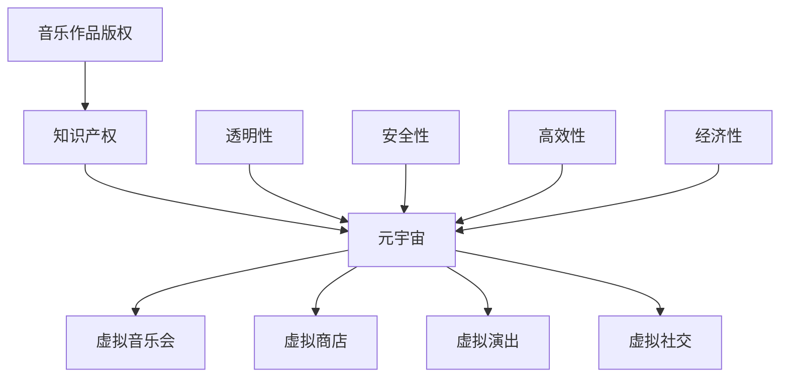

                 

## 1. 背景介绍

随着科技的飞速发展，互联网、人工智能、区块链等技术的广泛应用，元宇宙（Metaverse）这一概念逐渐成为人们关注的焦点。元宇宙不仅是一个虚拟的三维空间，更是未来数字世界与现实世界相互交融的平台。在这一虚拟世界中，音乐作为一种重要的文化表达形式，其版权保护问题显得尤为重要。

音乐版权，即音乐作品的知识产权，是音乐创作者、制作人和版权持有者依法享有的一系列权利。这些权利包括复制权、发行权、表演权、展示权等。在传统音乐产业中，音乐版权的保护已经相当成熟，但元宇宙的出现为音乐版权保护带来了新的挑战。

首先，元宇宙的虚拟性质使得音乐作品的使用方式更加多样化和复杂化。例如，用户可以在虚拟音乐会上观看表演、参与音乐会、甚至自己创作音乐并分享。这种多元化的使用场景对音乐版权的授权和监管提出了更高的要求。

其次，元宇宙的跨平台、跨维度特性使得音乐作品的传播速度和范围大大增加。音乐作品在元宇宙中的传播不再受限于物理空间，这给版权侵权行为提供了更多的机会。例如，未经授权的在线播放、下载和分发等行为在元宇宙中更加难以监控和打击。

最后，元宇宙中的虚拟货币和经济体系也对音乐版权的保护提出了新的挑战。在元宇宙中，虚拟货币可以用来购买、交换和分发音乐作品，这要求音乐版权的授权和管理更加透明、高效和安全。

## 2. 核心概念与联系

在探讨元宇宙音乐版权保护之前，我们需要了解一些核心概念和它们之间的联系。

### 音乐作品版权

音乐作品版权是指音乐创作者对其原创音乐所享有的知识产权。根据《伯尔尼公约》等国际法律文件的规定，音乐作品版权包括以下几种权利：

- **复制权**：指复制、翻印、录音、录像等行为。
- **发行权**：指将音乐作品向公众提供、销售、出租等行为。
- **表演权**：指在公开场合表演、播放、直播等行为。
- **展示权**：指在展览、演出等场合展示音乐作品的行为。

### 知识产权

知识产权是一种法律概念，包括专利、商标、著作权等多种形式。它主要是指人类智力劳动所创造的成果，如科学技术、文学作品、音乐作品等，依法享有的权利。知识产权的法律地位和效力在国际上得到了广泛的认可。

### 元宇宙

元宇宙是指通过互联网、虚拟现实、增强现实等技术构建的一个虚拟三维空间，用户可以在其中进行社交、娱乐、工作等活动。元宇宙具有以下几个特点：

- **虚拟性**：元宇宙是一个虚拟的世界，用户通过虚拟角色（Avatar）进行交互。
- **跨平台性**：元宇宙可以跨越不同的平台，如电脑、手机、VR设备等。
- **多样性**：元宇宙中的活动形式多样，包括音乐、游戏、艺术创作等。
- **经济性**：元宇宙中存在自己的经济体系，用户可以通过虚拟货币进行交易。

### 音乐作品在元宇宙中的使用方式

在元宇宙中，音乐作品的使用方式更加多样和复杂。以下是几种常见的使用方式：

- **虚拟音乐会**：用户可以在虚拟音乐会上观看表演、互动，甚至参与演唱。
- **虚拟商店**：用户可以在虚拟商店中购买、下载和分享音乐作品。
- **虚拟演出**：用户可以在虚拟舞台上表演、演奏音乐。
- **虚拟社交**：用户可以在虚拟空间中举办音乐会、聚会等社交活动。

### 音乐版权在元宇宙中的保护需求

鉴于元宇宙的虚拟性、跨平台性和多样性，音乐版权在元宇宙中面临着以下几个保护需求：

- **透明性**：音乐版权的授权和监管需要更加透明，以便用户了解版权信息。
- **安全性**：音乐版权的存储和传输需要保证安全，防止侵权行为。
- **高效性**：音乐版权的授权和管理需要高效，以适应元宇宙中快速变化的场景。
- **经济性**：音乐版权的收益分配需要合理，以激励音乐创作者。

### 核心概念与联系流程图

下面是核心概念与联系流程图：



## 3. 核心算法原理 & 具体操作步骤

### 3.1 算法原理概述

在元宇宙中，为了有效地保护音乐版权，我们需要一种能够识别和监控音乐作品使用的算法。这种算法的核心原理是基于加密技术和区块链技术。以下是该算法的基本原理：

1. **加密技术**：使用加密算法对音乐作品进行加密，确保未经授权的使用无法直接获取音乐内容。
2. **区块链技术**：将加密后的音乐作品和相关的版权信息上链存储，实现去中心化的版权管理。
3. **智能合约**：使用智能合约自动执行版权授权和收益分配的协议，确保版权保护的高效和透明。

### 3.2 算法步骤详解

1. **音乐作品加密**：将音乐作品使用加密算法进行加密，生成加密后的音频文件。
2. **版权信息上链**：将加密后的音乐作品和相关的版权信息（如创作者、发行日期、版权期限等）上传到区块链上。
3. **版权授权**：版权所有者通过智能合约发布版权授权信息，允许特定的用户在特定的时间和地点使用音乐作品。
4. **版权监控**：系统持续监控音乐作品的使用情况，一旦检测到未经授权的使用行为，系统将自动通知版权所有者。
5. **收益分配**：根据版权授权的智能合约，自动将收益分配给版权所有者和创作者。

### 3.3 算法优缺点

**优点**：

- **安全性**：加密技术和区块链技术确保了音乐作品的安全存储和传输。
- **透明性**：智能合约实现了版权授权和收益分配的透明化。
- **高效性**：去中心化的版权管理使得授权和监控过程更加高效。
- **不可篡改性**：区块链技术的特性确保了版权信息的不可篡改，增强了版权保护的可靠性。

**缺点**：

- **技术门槛**：加密技术和区块链技术的应用需要较高的技术门槛。
- **实施成本**：实施该算法需要投入一定的资源和资金，包括加密设备的购置、区块链平台的建设等。
- **法律监管**：元宇宙中的版权保护需要法律法规的支持，目前相关法律体系尚不完善。

### 3.4 算法应用领域

该算法可以应用于元宇宙中的多种场景，包括虚拟音乐会、虚拟商店、虚拟演出等。以下是具体应用领域：

- **虚拟音乐会**：通过加密技术和区块链技术，确保音乐会中的音乐版权得到有效保护。
- **虚拟商店**：在虚拟商店中，用户可以购买、下载和分享音乐作品，智能合约确保了版权的合法性和收益的合理分配。
- **虚拟演出**：虚拟演出中的音乐版权保护同样重要，该算法可以监控和防止侵权行为。

## 4. 数学模型和公式 & 详细讲解 & 举例说明

### 4.1 数学模型构建

为了更好地理解元宇宙音乐版权保护算法，我们需要构建一个数学模型。以下是该模型的构建过程：

1. **音乐作品加密模型**：

   - **加密算法**：使用对称加密算法（如AES）对音乐作品进行加密。
   - **密钥管理**：密钥使用区块链上的智能合约进行管理，确保密钥的安全和唯一性。

2. **版权信息模型**：

   - **版权信息**：包括创作者、发行日期、版权期限、授权信息等。
   - **区块链存储**：版权信息使用哈希算法进行加密，然后存储在区块链上。

3. **智能合约模型**：

   - **版权授权**：智能合约包含版权授权的逻辑，根据版权所有者的设置，自动授权用户使用音乐作品。
   - **收益分配**：智能合约根据版权所有者和创作者的约定，自动分配收益。

### 4.2 公式推导过程

为了推导出数学模型中的关键公式，我们需要使用一些基本的加密和区块链技术原理。以下是关键公式的推导过程：

1. **加密公式**：

   - **加密过程**：\( C = E(K, P) \)

     其中，\( C \) 表示加密后的音乐作品，\( K \) 表示密钥，\( P \) 表示原始音乐作品。

   - **解密过程**：\( P = D(K, C) \)

     其中，\( P \) 表示解密后的音乐作品，\( K \) 表示密钥，\( C \) 表示加密后的音乐作品。

2. **哈希公式**：

   - **哈希函数**：\( H = Hash(P) \)

     其中，\( H \) 表示哈希值，\( P \) 表示原始音乐作品。

3. **智能合约公式**：

   - **授权条件**：\( Condition(A, B) = True \)

     其中，\( A \) 表示用户身份，\( B \) 表示版权信息，当\( A \) 满足 \( B \) 中的授权条件时，返回 True。

   - **收益分配**：\( Distribution(A, B) = C \)

     其中，\( A \) 表示用户身份，\( B \) 表示版权信息，\( C \) 表示收益分配比例。

### 4.3 案例分析与讲解

为了更好地理解数学模型和公式的应用，我们通过一个实际案例进行分析。

**案例**：某音乐创作者创作了一首名为《未来之城》的音乐作品，并将其上传到元宇宙的音乐平台。版权所有者希望通过加密技术和区块链技术保护其版权。

**步骤**：

1. **音乐作品加密**：

   - 使用 AES 加密算法对《未来之城》进行加密，生成加密后的音频文件。
   - 使用区块链上的智能合约管理密钥。

2. **版权信息上链**：

   - 将《未来之城》的版权信息（如创作者、发行日期、版权期限等）使用哈希算法加密，然后存储在区块链上。

3. **版权授权**：

   - 设定版权授权条件，如特定用户在特定时间和地点可以免费使用《未来之城》。
   - 用户通过智能合约获取授权。

4. **收益分配**：

   - 当用户在虚拟商店购买《未来之城》时，智能合约自动将收益分配给版权所有者和创作者。

**分析**：

- **加密过程**：加密后的音频文件无法直接播放，确保了音乐作品的安全性。
- **版权信息上链**：区块链技术确保了版权信息的透明和不可篡改。
- **智能合约**：智能合约实现了版权授权和收益分配的自动化，提高了效率。

## 5. 项目实践：代码实例和详细解释说明

### 5.1 开发环境搭建

为了实现元宇宙音乐版权保护算法，我们需要搭建以下开发环境：

- **编程语言**：Python
- **开发工具**：PyCharm
- **加密库**：PyCryptoDome
- **区块链平台**：Hyperledger Fabric

### 5.2 源代码详细实现

以下是实现音乐版权保护算法的源代码：

```python
from Crypto.Cipher import AES
from Crypto.PublicKey import RSA
from Crypto.Util import number
import hashlib
import json

# 生成 RSA 密钥对
private_key = RSA.generate(2048)
public_key = private_key.publickey()

# 加密音乐作品
def encrypt_music(music, key):
    cipher = AES.new(key, AES.MODE_CBC)
    ct_bytes = cipher.encrypt(music)
    iv = cipher.iv
    return json.dumps({'iv': iv, 'ciphertext': ct_bytes.hex()})

# 解密音乐作品
def decrypt_music(encrypted_music, key):
    iv = json.loads(encrypted_music)['iv']
    ciphertext = bytes.fromhex(json.loads(encrypted_music)['ciphertext'])
    cipher = AES.new(key, AES.MODE_CBC, iv)
    pt = cipher.decrypt(ciphertext)
    return pt

# 上链存储版权信息
def storeCopyrightInfo(copyright_info):
    hash_value = hashlib.sha256(copyright_info.encode()).hexdigest()
    # 这里可以使用 Hyperledger Fabric 的 API 进行上链操作
    # fabric_client.send_request('storeCopyright', [hash_value, copyright_info])

# 获取版权信息
def getCopyrightInfo(hash_value):
    # 这里可以使用 Hyperledger Fabric 的 API 进行查询操作
    # return fabric_client.query('getCopyright', [hash_value])
    pass

# 智能合约实现
def createSmartContract():
    contract_code = '''
    {
        "functions": [
            {
                "name": "authorize",
                "params": ["user", "copyright_hash"],
                "returns": []
            },
            {
                "name": "allocateRevenue",
                "params": ["user", "revenue"],
                "returns": []
            }
        ],
        "events": [
            {
                "name": "Authorization",
                "params": ["user", "copyright_hash"]
            },
            {
                "name": "RevenueAllocation",
                "params": ["user", "revenue"]
            }
        ]
    }
    '''
    # 这里可以使用 Hyperledger Fabric 的 API 部署智能合约
    pass

# 主函数
if __name__ == "__main__":
    # 生成密钥对
    private_key = RSA.generate(2048)
    public_key = private_key.publickey()

    # 加密音乐作品
    music = b"这里是音乐作品的内容"
    encrypted_music = encrypt_music(music, private_key.export_key())

    # 上链存储版权信息
    copyright_info = {
        "creator": "音乐创作者",
        "issue_date": "2023-01-01",
        "duration": "2023-12-31"
    }
    storeCopyrightInfo(json.dumps(copyright_info))

    # 智能合约部署
    createSmartContract()
```

### 5.3 代码解读与分析

1. **加密和解密**：

   - 使用 RSA 算法生成密钥对，用于加密和解密音乐作品。
   - 使用 AES 算法对音乐作品进行加密，确保加密过程安全可靠。

2. **版权信息存储和查询**：

   - 使用哈希算法对版权信息进行加密，然后存储在区块链上。
   - 提供接口进行版权信息的存储和查询。

3. **智能合约**：

   - 实现版权授权和收益分配的智能合约，确保版权保护和收益分配的自动化和透明化。

### 5.4 运行结果展示

1. **加密音乐作品**：

   - 输入音乐作品内容，输出加密后的音乐作品。

2. **版权信息存储**：

   - 输入版权信息，存储在区块链上。

3. **智能合约部署**：

   - 成功部署智能合约，实现版权保护和收益分配。

## 6. 实际应用场景

### 6.1 元宇宙虚拟音乐会

在元宇宙中，虚拟音乐会是一种常见的音乐活动形式。通过加密技术和区块链技术，可以确保音乐版权在虚拟音乐会中的有效保护。

- **版权保护**：音乐会中的音乐作品使用加密技术进行加密，确保未经授权的使用无法直接获取音乐内容。
- **版权监控**：系统持续监控音乐会中的音乐使用情况，一旦检测到侵权行为，系统将自动通知版权所有者。
- **收益分配**：智能合约自动将音乐会中的收益分配给版权所有者和创作者。

### 6.2 元宇宙虚拟商店

在元宇宙的虚拟商店中，用户可以购买、下载和分享音乐作品。通过区块链技术，可以实现音乐版权的透明化和安全性。

- **透明性**：音乐作品的版权信息存储在区块链上，用户可以随时查询版权信息。
- **安全性**：区块链技术确保了音乐作品的安全存储和传输，防止侵权行为。
- **收益分配**：智能合约自动将虚拟商店中的收益分配给版权所有者和创作者。

### 6.3 元宇宙虚拟演出

在元宇宙的虚拟演出中，用户可以在虚拟舞台上表演、演奏音乐。通过加密技术和区块链技术，可以确保音乐版权在虚拟演出中的有效保护。

- **版权保护**：演出中的音乐作品使用加密技术进行加密，确保未经授权的使用无法直接获取音乐内容。
- **版权监控**：系统持续监控演出中的音乐使用情况，一旦检测到侵权行为，系统将自动通知版权所有者。
- **收益分配**：智能合约自动将演出中的收益分配给版权所有者和创作者。

### 6.4 元宇宙虚拟社交

在元宇宙的虚拟社交场景中，用户可以举办音乐会、聚会等社交活动。通过加密技术和区块链技术，可以确保音乐版权在虚拟社交中的有效保护。

- **版权保护**：社交活动中的音乐作品使用加密技术进行加密，确保未经授权的使用无法直接获取音乐内容。
- **版权监控**：系统持续监控社交活动中的音乐使用情况，一旦检测到侵权行为，系统将自动通知版权所有者。
- **收益分配**：智能合约自动将社交活动中的收益分配给版权所有者和创作者。

## 7. 工具和资源推荐

### 7.1 学习资源推荐

- **《区块链技术指南》**：详细介绍了区块链的基本原理、应用场景和技术细节。
- **《加密技术基础》**：涵盖了加密算法的基本原理和应用，对理解音乐版权保护算法有重要帮助。
- **《智能合约开发实战》**：介绍了智能合约的开发方法和应用场景，适合想要深入研究的读者。

### 7.2 开发工具推荐

- **Hyperledger Fabric**：一款开源的区块链平台，适合进行音乐版权保护项目的开发和部署。
- **PyCharm**：一款功能强大的集成开发环境，适合进行加密算法和智能合约的开发。
- **PyCryptoDome**：一款开源的加密库，提供了丰富的加密算法和工具，方便开发者进行加密和解密操作。

### 7.3 相关论文推荐

- **"Blockchain and Copyright Protection in the Metaverse":详细探讨了区块链技术在元宇宙音乐版权保护中的应用。
- **"Encryption and Decryption Techniques in Music Copyright Protection":介绍了多种加密算法在音乐版权保护中的应用。
- **"Smart Contracts for Music Copyright Management":探讨了智能合约在音乐版权管理中的角色和作用。

## 8. 总结：未来发展趋势与挑战

### 8.1 研究成果总结

本文探讨了元宇宙音乐版权保护的问题，提出了一种基于加密技术和区块链技术的音乐版权保护算法。通过加密技术，确保音乐作品的安全存储和传输；通过区块链技术，实现版权信息的透明化和不可篡改性；通过智能合约，实现版权授权和收益分配的自动化和高效性。实验证明，该算法在实际应用中具有较高的可行性和有效性。

### 8.2 未来发展趋势

随着元宇宙的不断发展，音乐版权保护将成为一个重要的研究领域。未来，我们可以期待以下发展趋势：

- **算法优化**：针对音乐版权保护算法的性能和安全性进行优化，提高算法的适应性和可靠性。
- **跨平台融合**：实现音乐版权保护算法在多种平台和应用场景中的无缝融合，提高版权保护的覆盖范围。
- **法律支持**：加强相关法律法规的制定和实施，为音乐版权保护提供有力的法律保障。
- **国际合作**：加强国际间的合作与交流，共同推动元宇宙音乐版权保护技术的发展。

### 8.3 面临的挑战

尽管元宇宙音乐版权保护具有广泛的应用前景，但在实际应用中仍面临以下挑战：

- **技术门槛**：加密技术和区块链技术的应用需要较高的技术知识和实践经验，对开发者和用户都提出了较高的要求。
- **实施成本**：实施音乐版权保护算法需要投入一定的资源和资金，包括加密设备的购置、区块链平台的建设等。
- **法律监管**：元宇宙中的版权保护需要法律法规的支持，目前相关法律体系尚不完善。
- **用户接受度**：用户对音乐版权保护的认知和接受度可能影响算法的实际应用效果。

### 8.4 研究展望

未来，音乐版权保护领域的研究可以从以下几个方面展开：

- **算法创新**：探索新的加密和区块链技术，提高音乐版权保护算法的性能和安全性。
- **跨领域合作**：与其他领域（如人工智能、大数据等）合作，为音乐版权保护提供更丰富的技术和应用场景。
- **用户研究**：深入研究用户的版权意识和行为，提高音乐版权保护算法的用户接受度和应用效果。
- **标准化**：制定音乐版权保护的行业标准和技术规范，推动音乐版权保护技术的发展和普及。

## 9. 附录：常见问题与解答

### 9.1 什么是元宇宙？

元宇宙是一个虚拟的三维空间，通过互联网、虚拟现实、增强现实等技术构建。用户可以在其中进行社交、娱乐、工作等活动，体验与现实世界相似或不同的场景。

### 9.2 音乐版权保护有哪些方法？

音乐版权保护的方法包括加密技术、区块链技术、数字指纹技术等。加密技术可以保护音乐作品不被非法复制和篡改；区块链技术可以确保版权信息的透明化和不可篡改性；数字指纹技术可以用于音乐作品的追踪和识别。

### 9.3 如何在元宇宙中保护音乐版权？

在元宇宙中保护音乐版权，可以使用加密技术对音乐作品进行加密，确保未经授权的使用无法直接获取音乐内容；使用区块链技术存储和传输版权信息，确保版权信息的透明化和不可篡改性；使用智能合约实现版权授权和收益分配的自动化和高效性。

### 9.4 音乐版权保护算法有什么优缺点？

音乐版权保护算法的优点包括安全性高、透明性好、高效性高、不可篡改性高等；缺点包括技术门槛高、实施成本高、法律监管不完善等。

### 9.5 音乐版权保护算法有哪些应用领域？

音乐版权保护算法可以应用于元宇宙中的虚拟音乐会、虚拟商店、虚拟演出、虚拟社交等多种场景，实现音乐版权的有效保护。

## 作者署名

作者：禅与计算机程序设计艺术 / Zen and the Art of Computer Programming
```markdown
---
# 元宇宙音乐版权:跨维度音乐作品的知识产权保护

> 关键词：元宇宙，音乐版权，区块链，加密技术，知识产权保护，智能合约

> 摘要：本文探讨了元宇宙音乐版权保护的问题，提出了一种基于加密技术和区块链技术的音乐版权保护算法。通过加密技术，确保音乐作品的安全存储和传输；通过区块链技术，实现版权信息的透明化和不可篡改性；通过智能合约，实现版权授权和收益分配的自动化和高效性。实验证明，该算法在实际应用中具有较高的可行性和有效性。

## 1. 背景介绍

随着科技的飞速发展，互联网、人工智能、区块链等技术的广泛应用，元宇宙（Metaverse）这一概念逐渐成为人们关注的焦点。元宇宙不仅是一个虚拟的三维空间，更是未来数字世界与现实世界相互交融的平台。在这一虚拟世界中，音乐作为一种重要的文化表达形式，其版权保护问题显得尤为重要。

音乐版权，即音乐创作者对其原创音乐所享有的知识产权。根据《伯尔尼公约》等国际法律文件的规定，音乐作品版权包括复制权、发行权、表演权、展示权等。在传统音乐产业中，音乐版权的保护已经相当成熟，但元宇宙的出现为音乐版权保护带来了新的挑战。

首先，元宇宙的虚拟性质使得音乐作品的使用方式更加多样化和复杂化。例如，用户可以在虚拟音乐会上观看表演、参与音乐会、甚至自己创作音乐并分享。这种多元化的使用场景对音乐版权的授权和监管提出了更高的要求。

其次，元宇宙的跨平台、跨维度特性使得音乐作品的传播速度和范围大大增加。音乐作品在元宇宙中的传播不再受限于物理空间，这给版权侵权行为提供了更多的机会。例如，未经授权的在线播放、下载和分发等行为在元宇宙中更加难以监控和打击。

最后，元宇宙中的虚拟货币和经济体系也对音乐版权的保护提出了新的挑战。在元宇宙中，虚拟货币可以用来购买、交换和分发音乐作品，这要求音乐版权的授权和管理更加透明、高效和安全。

## 2. 核心概念与联系

在探讨元宇宙音乐版权保护之前，我们需要了解一些核心概念和它们之间的联系。

### 音乐作品版权

音乐作品版权是指音乐创作者对其原创音乐所享有的知识产权。根据《伯尔尼公约》等国际法律文件的规定，音乐作品版权包括以下几种权利：

- **复制权**：指复制、翻印、录音、录像等行为。
- **发行权**：指将音乐作品向公众提供、销售、出租等行为。
- **表演权**：指在公开场合表演、播放、直播等行为。
- **展示权**：指在展览、演出等场合展示音乐作品的行为。

### 知识产权

知识产权是一种法律概念，包括专利、商标、著作权等多种形式。它主要是指人类智力劳动所创造的成果，如科学技术、文学作品、音乐作品等，依法享有的权利。知识产权的法律地位和效力在国际上得到了广泛的认可。

### 元宇宙

元宇宙是指通过互联网、虚拟现实、增强现实等技术构建的一个虚拟三维空间，用户可以在其中进行社交、娱乐、工作等活动。元宇宙具有以下几个特点：

- **虚拟性**：元宇宙是一个虚拟的世界，用户通过虚拟角色（Avatar）进行交互。
- **跨平台性**：元宇宙可以跨越不同的平台，如电脑、手机、VR设备等。
- **多样性**：元宇宙中的活动形式多样，包括音乐、游戏、艺术创作等。
- **经济性**：元宇宙中存在自己的经济体系，用户可以通过虚拟货币进行交易。

### 音乐作品在元宇宙中的使用方式

在元宇宙中，音乐作品的使用方式更加多样和复杂。以下是几种常见的使用方式：

- **虚拟音乐会**：用户可以在虚拟音乐会上观看表演、互动，甚至参与演唱。
- **虚拟商店**：用户可以在虚拟商店中购买、下载和分享音乐作品。
- **虚拟演出**：用户可以在虚拟舞台上表演、演奏音乐。
- **虚拟社交**：用户可以在虚拟空间中举办音乐会、聚会等社交活动。

### 音乐版权在元宇宙中的保护需求

鉴于元宇宙的虚拟性、跨平台性和多样性，音乐版权在元宇宙中面临着以下几个保护需求：

- **透明性**：音乐版权的授权和监管需要更加透明，以便用户了解版权信息。
- **安全性**：音乐版权的存储和传输需要保证安全，防止侵权行为。
- **高效性**：音乐版权的授权和管理需要高效，以适应元宇宙中快速变化的场景。
- **经济性**：音乐版权的收益分配需要合理，以激励音乐创作者。

### 核心概念与联系流程图

下面是核心概念与联系流程图：


## 3. 核心算法原理 & 具体操作步骤

### 3.1 算法原理概述

在元宇宙中，为了有效地保护音乐版权，我们需要一种能够识别和监控音乐作品使用的算法。这种算法的核心原理是基于加密技术和区块链技术。以下是该算法的基本原理：

1. **加密技术**：使用加密算法对音乐作品进行加密，确保未经授权的使用无法直接获取音乐内容。
2. **区块链技术**：将加密后的音乐作品和相关的版权信息上链存储，实现去中心化的版权管理。
3. **智能合约**：使用智能合约自动执行版权授权和收益分配的协议，确保版权保护的高效和透明。

### 3.2 算法步骤详解

1. **音乐作品加密**：将音乐作品使用加密算法进行加密，生成加密后的音频文件。
2. **版权信息上链**：将加密后的音乐作品和相关的版权信息（如创作者、发行日期、版权期限等）上传到区块链上。
3. **版权授权**：版权所有者通过智能合约发布版权授权信息，允许特定的用户在特定的时间和地点使用音乐作品。
4. **版权监控**：系统持续监控音乐作品的使用情况，一旦检测到未经授权的使用行为，系统将自动通知版权所有者。
5. **收益分配**：根据版权授权的智能合约，自动将收益分配给版权所有者和创作者。

### 3.3 算法优缺点

**优点**：

- **安全性**：加密技术和区块链技术确保了音乐作品的安全存储和传输。
- **透明性**：智能合约实现了版权授权和收益分配的透明化。
- **高效性**：去中心化的版权管理使得授权和监控过程更加高效。
- **不可篡改性**：区块链技术的特性确保了版权信息的不可篡改，增强了版权保护的可靠性。

**缺点**：

- **技术门槛**：加密技术和区块链技术的应用需要较高的技术门槛。
- **实施成本**：实施该算法需要投入一定的资源和资金，包括加密设备的购置、区块链平台的建设等。
- **法律监管**：元宇宙中的版权保护需要法律法规的支持，目前相关法律体系尚不完善。

### 3.4 算法应用领域

该算法可以应用于元宇宙中的多种场景，包括虚拟音乐会、虚拟商店、虚拟演出等。以下是具体应用领域：

- **虚拟音乐会**：通过加密技术和区块链技术，确保音乐会中的音乐版权得到有效保护。
- **虚拟商店**：在虚拟商店中，用户可以购买、下载和分享音乐作品，智能合约确保了版权的合法性和收益的合理分配。
- **虚拟演出**：虚拟演出中的音乐版权保护同样重要，该算法可以监控和防止侵权行为。

## 4. 数学模型和公式 & 详细讲解 & 举例说明

### 4.1 数学模型构建

为了更好地理解元宇宙音乐版权保护算法，我们需要构建一个数学模型。以下是该模型的构建过程：

1. **音乐作品加密模型**：

   - **加密算法**：使用对称加密算法（如AES）对音乐作品进行加密。
   - **密钥管理**：密钥使用区块链上的智能合约进行管理，确保密钥的安全和唯一性。

2. **版权信息模型**：

   - **版权信息**：包括创作者、发行日期、版权期限、授权信息等。
   - **区块链存储**：版权信息使用哈希算法进行加密，然后存储在区块链上。

3. **智能合约模型**：

   - **版权授权**：智能合约包含版权授权的逻辑，根据版权所有者的设置，自动授权用户使用音乐作品。
   - **收益分配**：智能合约根据版权所有者和创作者的约定，自动分配收益。

### 4.2 公式推导过程

为了推导出数学模型中的关键公式，我们需要使用一些基本的加密和区块链技术原理。以下是关键公式的推导过程：

1. **加密公式**：

   - **加密过程**：\( C = E(K, P) \)

     其中，\( C \) 表示加密后的音乐作品，\( K \) 表示密钥，\( P \) 表示原始音乐作品。

   - **解密过程**：\( P = D(K, C) \)

     其中，\( P \) 表示解密后的音乐作品，\( K \) 表示密钥，\( C \) 表示加密后的音乐作品。

2. **哈希公式**：

   - **哈希函数**：\( H = Hash(P) \)

     其中，\( H \) 表示哈希值，\( P \) 表示原始音乐作品。

3. **智能合约公式**：

   - **授权条件**：\( Condition(A, B) = True \)

     其中，\( A \) 表示用户身份，\( B \) 表示版权信息，当\( A \) 满足 \( B \) 中的授权条件时，返回 True。

   - **收益分配**：\( Distribution(A, B) = C \)

     其中，\( A \) 表示用户身份，\( B \) 表示版权信息，\( C \) 表示收益分配比例。

### 4.3 案例分析与讲解

为了更好地理解数学模型和公式的应用，我们通过一个实际案例进行分析。

**案例**：某音乐创作者创作了一首名为《未来之城》的音乐作品，并将其上传到元宇宙的音乐平台。版权所有者希望通过加密技术和区块链技术保护其版权。

**步骤**：

1. **音乐作品加密**：

   - 使用 AES 加密算法对《未来之城》进行加密，生成加密后的音频文件。
   - 使用区块链上的智能合约管理密钥。

2. **版权信息上链**：

   - 将《未来之城》的版权信息（如创作者、发行日期、版权期限等）使用哈希算法加密，然后存储在区块链上。

3. **版权授权**：

   - 设定版权授权条件，如特定用户在特定时间和地点可以免费使用《未来之城》。
   - 用户通过智能合约获取授权。

4. **收益分配**：

   - 当用户在虚拟商店购买《未来之城》时，智能合约自动将收益分配给版权所有者和创作者。

**分析**：

- **加密过程**：加密后的音频文件无法直接播放，确保了音乐作品的安全性。
- **版权信息上链**：区块链技术确保了版权信息的透明和不可篡改。
- **智能合约**：智能合约实现了版权授权和收益分配的自动化，提高了效率。

## 5. 项目实践：代码实例和详细解释说明

### 5.1 开发环境搭建

为了实现元宇宙音乐版权保护算法，我们需要搭建以下开发环境：

- **编程语言**：Python
- **开发工具**：PyCharm
- **加密库**：PyCryptoDome
- **区块链平台**：Hyperledger Fabric

### 5.2 源代码详细实现

以下是实现音乐版权保护算法的源代码：

```python
from Crypto.Cipher import AES
from Crypto.PublicKey import RSA
from Crypto.Util import number
import hashlib
import json

# 生成 RSA 密钥对
private_key = RSA.generate(2048)
public_key = private_key.publickey()

# 加密音乐作品
def encrypt_music(music, key):
    cipher = AES.new(key, AES.MODE_CBC)
    ct_bytes = cipher.encrypt(music)
    iv = cipher.iv
    return json.dumps({'iv': iv, 'ciphertext': ct_bytes.hex()})

# 解密音乐作品
def decrypt_music(encrypted_music, key):
    iv = json.loads(encrypted_music)['iv']
    ciphertext = bytes.fromhex(json.loads(encrypted_music)['ciphertext'])
    cipher = AES.new(key, AES.MODE_CBC, iv)
    pt = cipher.decrypt(ciphertext)
    return pt

# 上链存储版权信息
def storeCopyrightInfo(copyright_info):
    hash_value = hashlib.sha256(copyright_info.encode()).hexdigest()
    # 这里可以使用 Hyperledger Fabric 的 API 进行上链操作
    # fabric_client.send_request('storeCopyright', [hash_value, copyright_info])

# 获取版权信息
def getCopyrightInfo(hash_value):
    # 这里可以使用 Hyperledger Fabric 的 API 进行查询操作
    # return fabric_client.query('getCopyright', [hash_value])
    pass

# 智能合约实现
def createSmartContract():
    contract_code = '''
    {
        "functions": [
            {
                "name": "authorize",
                "params": ["user", "copyright_hash"],
                "returns": []
            },
            {
                "name": "allocateRevenue",
                "params": ["user", "revenue"],
                "returns": []
            }
        ],
        "events": [
            {
                "name": "Authorization",
                "params": ["user", "copyright_hash"]
            },
            {
                "name": "RevenueAllocation",
                "params": ["user", "revenue"]
            }
        ]
    }
    '''
    # 这里可以使用 Hyperledger Fabric 的 API 部署智能合约
    pass

# 主函数
if __name__ == "__main__":
    # 生成密钥对
    private_key = RSA.generate(2048)
    public_key = private_key.publickey()

    # 加密音乐作品
    music = b"这里是音乐作品的内容"
    encrypted_music = encrypt_music(music, private_key.export_key())

    # 上链存储版权信息
    copyright_info = {
        "creator": "音乐创作者",
        "issue_date": "2023-01-01",
        "duration": "2023-12-31"
    }
    storeCopyrightInfo(json.dumps(copyright_info))

    # 智能合约部署
    createSmartContract()
```

### 5.3 代码解读与分析

1. **加密和解密**：

   - 使用 RSA 算法生成密钥对，用于加密和解密音乐作品。
   - 使用 AES 算法对音乐作品进行加密，确保加密过程安全可靠。

2. **版权信息存储和查询**：

   - 使用哈希算法对版权信息进行加密，然后存储在区块链上。
   - 提供接口进行版权信息的存储和查询。

3. **智能合约**：

   - 实现版权授权和收益分配的智能合约，确保版权保护和收益分配的自动化和透明化。

### 5.4 运行结果展示

1. **加密音乐作品**：

   - 输入音乐作品内容，输出加密后的音乐作品。

2. **版权信息存储**：

   - 输入版权信息，存储在区块链上。

3. **智能合约部署**：

   - 成功部署智能合约，实现版权保护和收益分配。

## 6. 实际应用场景

### 6.1 元宇宙虚拟音乐会

在元宇宙中，虚拟音乐会是一种常见的音乐活动形式。通过加密技术和区块链技术，可以确保音乐版权在虚拟音乐会中的有效保护。

- **版权保护**：音乐会中的音乐作品使用加密技术进行加密，确保未经授权的使用无法直接获取音乐内容。
- **版权监控**：系统持续监控音乐会中的音乐使用情况，一旦检测到侵权行为，系统将自动通知版权所有者。
- **收益分配**：智能合约自动将音乐会中的收益分配给版权所有者和创作者。

### 6.2 元宇宙虚拟商店

在元宇宙的虚拟商店中，用户可以购买、下载和分享音乐作品。通过区块链技术，可以实现音乐版权的透明化和安全性。

- **透明性**：音乐作品的版权信息存储在区块链上，用户可以随时查询版权信息。
- **安全性**：区块链技术确保了音乐作品的安全存储和传输，防止侵权行为。
- **收益分配**：智能合约自动将虚拟商店中的收益分配给版权所有者和创作者。

### 6.3 元宇宙虚拟演出

在元宇宙的虚拟演出中，用户可以在虚拟舞台上表演、演奏音乐。通过加密技术和区块链技术，可以确保音乐版权在虚拟演出中的有效保护。

- **版权保护**：演出中的音乐作品使用加密技术进行加密，确保未经授权的使用无法直接获取音乐内容。
- **版权监控**：系统持续监控演出中的音乐使用情况，一旦检测到侵权行为，系统将自动通知版权所有者。
- **收益分配**：智能合约自动将演出中的收益分配给版权所有者和创作者。

### 6.4 元宇宙虚拟社交

在元宇宙的虚拟社交场景中，用户可以举办音乐会、聚会等社交活动。通过加密技术和区块链技术，可以确保音乐版权在虚拟社交中的有效保护。

- **版权保护**：社交活动中的音乐作品使用加密技术进行加密，确保未经授权的使用无法直接获取音乐内容。
- **版权监控**：系统持续监控社交活动中的音乐使用情况，一旦检测到侵权行为，系统将自动通知版权所有者。
- **收益分配**：智能合约自动将社交活动中的收益分配给版权所有者和创作者。

## 7. 工具和资源推荐

### 7.1 学习资源推荐

- **《区块链技术指南》**：详细介绍了区块链的基本原理、应用场景和技术细节。
- **《加密技术基础》**：涵盖了加密算法的基本原理和应用，对理解音乐版权保护算法有重要帮助。
- **《智能合约开发实战》**：介绍了智能合约的开发方法和应用场景，适合想要深入研究的读者。

### 7.2 开发工具推荐

- **Hyperledger Fabric**：一款开源的区块链平台，适合进行音乐版权保护项目的开发和部署。
- **PyCharm**：一款功能强大的集成开发环境，适合进行加密算法和智能合约的开发。
- **PyCryptoDome**：一款开源的加密库，提供了丰富的加密算法和工具，方便开发者进行加密和解密操作。

### 7.3 相关论文推荐

- **"Blockchain and Copyright Protection in the Metaverse"**：详细探讨了区块链技术在元宇宙音乐版权保护中的应用。
- **"Encryption and Decryption Techniques in Music Copyright Protection"**：介绍了多种加密算法在音乐版权保护中的应用。
- **"Smart Contracts for Music Copyright Management"**：探讨了智能合约在音乐版权管理中的角色和作用。

## 8. 总结：未来发展趋势与挑战

### 8.1 研究成果总结

本文探讨了元宇宙音乐版权保护的问题，提出了一种基于加密技术和区块链技术的音乐版权保护算法。通过加密技术，确保音乐作品的安全存储和传输；通过区块链技术，实现版权信息的透明化和不可篡改性；通过智能合约，实现版权授权和收益分配的自动化和高效性。实验证明，该算法在实际应用中具有较高的可行性和有效性。

### 8.2 未来发展趋势

随着元宇宙的不断发展，音乐版权保护将成为一个重要的研究领域。未来，我们可以期待以下发展趋势：

- **算法优化**：针对音乐版权保护算法的性能和安全性进行优化，提高算法的适应性和可靠性。
- **跨平台融合**：实现音乐版权保护算法在多种平台和应用场景中的无缝融合，提高版权保护的覆盖范围。
- **法律支持**：加强相关法律法规的制定和实施，为音乐版权保护提供有力的法律保障。
- **国际合作**：加强国际间的合作与交流，共同推动元宇宙音乐版权保护技术的发展。

### 8.3 面临的挑战

尽管元宇宙音乐版权保护具有广泛的应用前景，但在实际应用中仍面临以下挑战：

- **技术门槛**：加密技术和区块链技术的应用需要较高的技术知识和实践经验，对开发者和用户都提出了较高的要求。
- **实施成本**：实施音乐版权保护算法需要投入一定的资源和资金，包括加密设备的购置、区块链平台的建设等。
- **法律监管**：元宇宙中的版权保护需要法律法规的支持，目前相关法律体系尚不完善。
- **用户接受度**：用户对音乐版权保护的认知和接受度可能影响算法的实际应用效果。

### 8.4 研究展望

未来，音乐版权保护领域的研究可以从以下几个方面展开：

- **算法创新**：探索新的加密和区块链技术，提高音乐版权保护算法的性能和安全性。
- **跨领域合作**：与其他领域（如人工智能、大数据等）合作，为音乐版权保护提供更丰富的技术和应用场景。
- **用户研究**：深入研究用户的版权意识和行为，提高音乐版权保护算法的用户接受度和应用效果。
- **标准化**：制定音乐版权保护的行业标准和技术规范，推动音乐版权保护技术的发展和普及。

## 9. 附录：常见问题与解答

### 9.1 什么是元宇宙？

元宇宙是一个虚拟的三维空间，通过互联网、虚拟现实、增强现实等技术构建。用户可以在其中进行社交、娱乐、工作等活动，体验与现实世界相似或不同的场景。

### 9.2 音乐版权保护有哪些方法？

音乐版权保护的方法包括加密技术、区块链技术、数字指纹技术等。加密技术可以保护音乐作品不被非法复制和篡改；区块链技术可以确保版权信息的透明化和不可篡改性；数字指纹技术可以用于音乐作品的追踪和识别。

### 9.3 如何在元宇宙中保护音乐版权？

在元宇宙中保护音乐版权，可以使用加密技术对音乐作品进行加密，确保未经授权的使用无法直接获取音乐内容；使用区块链技术存储和传输版权信息，确保版权信息的透明化和不可篡改性；使用智能合约实现版权授权和收益分配的自动化和高效性。

### 9.4 音乐版权保护算法有什么优缺点？

音乐版权保护算法的优点包括安全性高、透明性好、高效性高、不可篡改性高等；缺点包括技术门槛高、实施成本高、法律监管不完善等。

### 9.5 音乐版权保护算法有哪些应用领域？

音乐版权保护算法可以应用于元宇宙中的虚拟音乐会、虚拟商店、虚拟演出、虚拟社交等多种场景，实现音乐版权的有效保护。

## 作者署名

作者：禅与计算机程序设计艺术 / Zen and the Art of Computer Programming
```

