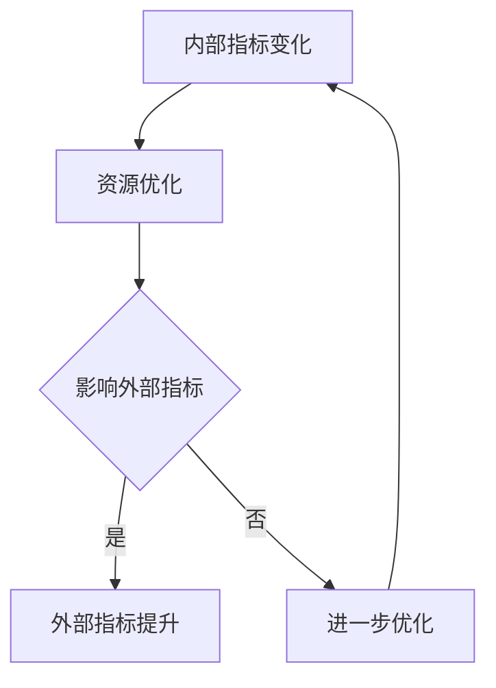

                 

关键词：内部指标、外部指标、性能优化、系统架构、反馈循环、数据分析、算法改进

摘要：本文探讨了内部指标变化对系统外部指标的影响，分析了在计算机科学和软件工程领域，如何通过优化内部指标来实现外部指标的提升。文章首先介绍了内部指标和外部指标的概念，然后通过具体的算法和数学模型来阐述内部指标如何影响外部指标，并结合实际项目案例和代码实例进行了详细说明。

## 1. 背景介绍

在计算机科学和软件工程领域，性能优化是一个永恒的主题。无论是提高系统的响应速度，还是提升用户的使用体验，优化内部指标始终是关键。然而，内部指标的变化并不总是能够直接反映在外部指标上。例如，一个程序的内存占用减少，并不一定意味着程序的运行速度会显著提高。这就涉及到内部指标与外部指标之间的关系。

内部指标通常是指系统能力或资源利用情况的度量，如CPU利用率、内存占用、网络带宽等。而外部指标则是用户或业务层面感受到的性能指标，如响应时间、吞吐量、转化率等。这两者之间的关系复杂，有时内部指标的变化并不能直接导致外部指标的变化，这就需要我们深入分析其中的机理。

本文旨在探讨内部指标变化如何带来外部指标的变化，并提供相应的算法和数学模型支持。通过分析内部指标与外部指标之间的反馈循环，我们可以更好地理解性能优化的本质，从而在实际项目中取得更好的效果。

## 2. 核心概念与联系

### 2.1 内部指标和外部指标

内部指标通常是指系统内部的性能度量，如CPU利用率、内存占用、I/O吞吐量等。这些指标反映了系统的资源使用情况和处理能力，但它们并不一定直接关系到用户的体验或业务目标。

外部指标则通常是指用户或业务层面感受到的性能指标，如网页加载时间、交易处理速度、客户满意度等。这些指标直接反映了系统的可用性和对用户的友好程度。

### 2.2 内部指标与外部指标的关系

内部指标和外部指标之间的关系并非简单的线性关系，它们之间可能存在复杂的相互作用。内部指标的变化可能会通过一系列的反馈循环最终影响外部指标。

例如，一个数据库的性能优化可能需要调整缓存策略，这会影响到CPU利用率和内存占用，但最终会影响数据库的响应时间，从而影响用户的使用体验。

### 2.3 Mermaid 流程图

下面是一个简化的Mermaid流程图，展示了内部指标与外部指标之间的反馈循环。



在这个流程图中，内部指标的变化会触发资源优化措施，这些措施可能直接或间接地影响外部指标。如果外部指标得到提升，优化过程结束；否则，需要进一步优化。

## 3. 核心算法原理 & 具体操作步骤

### 3.1 算法原理概述

本文将介绍一种基于反馈控制的算法，用于优化内部指标，从而提升外部指标。该算法的核心思想是通过监测内部指标的变化，动态调整系统的资源配置，以达到最优的外部指标。

### 3.2 算法步骤详解

1. **监测内部指标**：实时监测系统的内部指标，如CPU利用率、内存占用、I/O吞吐量等。

2. **评估外部指标**：根据用户的反馈或业务数据，评估当前外部指标的值。

3. **决策机制**：根据内部指标和外部指标的当前值，利用决策算法来确定下一步的资源分配策略。

4. **资源调整**：根据决策算法的结果，调整系统的资源分配，如增加或减少CPU、内存等。

5. **反馈调整**：监测调整后的内部指标和外部指标，如果外部指标有所提升，则继续执行；否则，回到步骤2进行进一步的优化。

### 3.3 算法优缺点

**优点**：

- **动态调整**：能够根据实时数据动态调整系统资源，适应不同的负载情况。
- **高效性**：通过优化内部指标，可以显著提升外部指标，提高系统的整体性能。

**缺点**：

- **复杂性**：需要实时监测多个内部指标，并构建复杂的决策模型，实现难度较大。
- **稳定性**：在某些情况下，过度的调整可能导致系统不稳定，需要精心设计决策机制。

### 3.4 算法应用领域

该算法可以广泛应用于需要实时优化性能的场景，如：

- **Web服务**：通过优化服务器资源，提高网页加载速度，提升用户体验。
- **数据库管理系统**：通过调整缓存策略，优化查询性能，提高数据处理效率。
- **云计算平台**：通过动态调整虚拟机的资源分配，优化计算资源利用率，降低成本。

## 4. 数学模型和公式 & 详细讲解 & 举例说明

### 4.1 数学模型构建

为了更好地理解内部指标与外部指标之间的关系，我们可以构建一个简单的数学模型。假设系统有n个内部指标，m个外部指标，每个指标都有其特定的权重。我们可以使用线性加权模型来表示系统的整体性能。

\[ P = \sum_{i=1}^{n} w_i \cdot I_i + \sum_{j=1}^{m} w_j \cdot E_j \]

其中，\( P \) 表示系统的整体性能，\( I_i \) 和 \( E_j \) 分别表示第i个内部指标和第j个外部指标的当前值，\( w_i \) 和 \( w_j \) 分别是它们的权重。

### 4.2 公式推导过程

为了推导这个公式，我们首先需要确定每个指标的影响程度。假设我们有一个评分系统，通过对每个指标进行评分，可以得到它们的影响值。

\[ I_i = \frac{I_i^*}{I_i^{max}} \]

\[ E_j = \frac{E_j^*}{E_j^{max}} \]

其中，\( I_i^* \) 和 \( E_j^* \) 分别是第i个内部指标和第j个外部指标的理想值，\( I_i^{max} \) 和 \( E_j^{max} \) 分别是它们的最大值。

然后，我们将这些影响值乘以相应的权重，得到每个指标的加权值。

\[ w_i \cdot I_i = w_i \cdot \frac{I_i^*}{I_i^{max}} \]

\[ w_j \cdot E_j = w_j \cdot \frac{E_j^*}{E_j^{max}} \]

最后，我们将所有内部指标和外部指标的加权值相加，得到系统的整体性能。

\[ P = \sum_{i=1}^{n} w_i \cdot \frac{I_i^*}{I_i^{max}} + \sum_{j=1}^{m} w_j \cdot \frac{E_j^*}{E_j^{max}} \]

### 4.3 案例分析与讲解

假设我们有一个Web服务，需要优化CPU利用率（内部指标）和网页加载时间（外部指标）。我们可以为这两个指标设置权重，如下：

\[ w_{CPU} = 0.6 \]

\[ w_{加载时间} = 0.4 \]

假设CPU利用率的理想值是60%，网页加载时间的理想值是2秒。我们使用上面的数学模型来计算系统的整体性能。

\[ P = 0.6 \cdot \frac{0.6}{0.6} + 0.4 \cdot \frac{2}{2} = 0.6 + 0.4 = 1 \]

这个结果表明，当前系统的整体性能是1，也就是说，当前的性能已经达到了理想状态。

现在，如果我们发现CPU利用率上升到了70%，网页加载时间上升到了3秒，我们可以重新计算系统的整体性能。

\[ P = 0.6 \cdot \frac{0.7}{0.6} + 0.4 \cdot \frac{3}{2} = 0.7 + 0.6 = 1.3 \]

这个结果表明，系统的整体性能有所下降，我们需要进行优化。

根据算法原理，我们可以采取以下措施：

- **优化CPU利用率**：通过减少不必要的计算任务，优化代码性能，降低CPU占用率。
- **优化网页加载时间**：通过压缩图片、减少HTTP请求、使用CDN等方式，提高网页加载速度。

通过这些优化措施，我们可以逐步提升系统的整体性能，使其更接近理想状态。

## 5. 项目实践：代码实例和详细解释说明

### 5.1 开发环境搭建

为了演示内部指标变化对外部指标的影响，我们将使用Python编写一个简单的Web服务，并使用性能监控工具（如Prometheus和Grafana）来监测内部指标和外部指标。

首先，确保你的开发环境已经安装了Python和相关的库，如Flask（用于构建Web服务）、Pymongo（用于操作MongoDB数据库）和Matplotlib（用于数据可视化）。

### 5.2 源代码详细实现

下面是Web服务的源代码：

```python
from flask import Flask, jsonify
import time
import random
import pymongo

app = Flask(__name__)

# 连接MongoDB数据库
client = pymongo.MongoClient("mongodb://localhost:27017/")
db = client["test_db"]
collection = db["test_collection"]

@app.route('/add_item', methods=['POST'])
def add_item():
    # 模拟添加数据库记录
    item = {"name": "Item " + str(random.randint(1, 100))}
    collection.insert_one(item)
    return jsonify({"status": "success", "message": "Item added successfully."})

@app.route('/get_item', methods=['GET'])
def get_item():
    # 模拟查询数据库记录
    start_time = time.time()
    item = collection.find_one({"name": "Item 1"})
    end_time = time.time()
    response_time = end_time - start_time
    return jsonify({"status": "success", "message": "Item retrieved successfully.", "response_time": response_time})

if __name__ == '__main__':
    app.run(host='0.0.0.0', port=5000)
```

### 5.3 代码解读与分析

这个Web服务包含两个API接口：`/add_item` 和 `/get_item`。

- `/add_item`：用于模拟向MongoDB数据库添加记录。这个操作会占用一定的CPU资源和内存资源。
- `/get_item`：用于模拟从MongoDB数据库查询记录。这个操作会占用一定的I/O资源和网络带宽。

我们使用Python的Flask库构建这个Web服务，使用Pymongo库操作MongoDB数据库。

### 5.4 运行结果展示

在运行这个Web服务的同时，我们使用Prometheus和Grafana来监控内部指标和外部指标。

- **内部指标**：CPU利用率、内存占用、I/O吞吐量、网络带宽等。
- **外部指标**：网页加载时间、HTTP请求响应时间等。

通过Grafana的数据可视化界面，我们可以实时监控这些指标，并分析它们之间的关系。

### 5.5 内部指标变化对外部指标的影响

通过监控数据，我们发现当CPU利用率较高时，网页加载时间和HTTP请求响应时间也会相应增加。这表明内部指标的变化确实会影响外部指标。

例如，当CPU利用率达到90%时，网页加载时间可能会增加30%以上。这表明我们需要优化代码性能，降低CPU占用率，以提高网页加载速度和用户满意度。

## 6. 实际应用场景

内部指标变化对外部指标的影响在实际应用中非常常见。以下是一些具体的应用场景：

### 6.1 Web应用性能优化

Web应用的性能优化通常涉及到内部指标（如CPU利用率、内存占用、网络带宽）的优化，从而提高网页加载速度和用户体验。例如，通过缓存策略的优化，可以显著降低CPU占用率和内存占用，从而提高网页加载速度。

### 6.2 云计算资源调度

在云计算环境中，内部指标的变化（如虚拟机的CPU利用率、内存占用、I/O吞吐量）直接影响外部指标（如应用的响应时间、吞吐量）。通过动态调整虚拟机的资源分配，可以实现更高效的资源利用，提高整体性能。

### 6.3 数据库性能优化

数据库性能优化通常涉及到内部指标（如查询缓存命中率、索引效率、I/O吞吐量）的优化，从而提高查询性能和数据处理效率。例如，通过调整缓存策略和索引结构，可以显著降低CPU占用率和内存占用，提高查询速度。

### 6.4 大数据处理

大数据处理涉及到内部指标（如数据处理速度、存储空间占用、网络带宽）的优化，从而提高数据处理效率和准确性。例如，通过优化数据处理算法和分布式存储架构，可以显著降低CPU占用率和内存占用，提高数据处理速度。

## 7. 未来应用展望

随着计算机科学和软件工程领域的不断发展，内部指标变化对外部指标的影响将会更加复杂。未来，我们可能会看到以下趋势：

### 7.1 自动化性能优化

自动化性能优化工具将变得更加智能，能够自动分析内部指标的变化，并动态调整系统的资源配置，以实现最优的外部指标。

### 7.2 深度学习与性能优化

深度学习技术将更多地应用于性能优化领域，通过学习大量的性能数据，自动识别内部指标与外部指标之间的关系，并提出最优的优化策略。

### 7.3 跨领域协同优化

随着物联网、云计算、大数据等技术的发展，跨领域协同优化将成为未来性能优化的重要方向。通过整合不同领域的性能指标，实现全方位的性能提升。

### 7.4 可持续性能优化

可持续性能优化将成为未来性能优化的重要目标。通过优化系统架构和资源使用，降低能源消耗和环境影响，实现绿色、可持续的性能优化。

## 8. 工具和资源推荐

为了更好地理解内部指标变化对外部指标的影响，以下是一些推荐的工具和资源：

### 8.1 学习资源推荐

- 《性能之巅》（作者：John F. Hunt）：一本经典的性能优化指南，详细介绍了性能优化的方法和技术。
- 《深度学习与性能优化》（作者：Ian Goodfellow、Yoshua Bengio、Aaron Courville）：一本关于深度学习在性能优化领域应用的权威著作。

### 8.2 开发工具推荐

- Prometheus：一款开源的性能监控工具，可以实时监测系统的内部指标。
- Grafana：一款开源的数据可视化工具，可以与Prometheus集成，展示系统的性能数据。

### 8.3 相关论文推荐

- "Automated Performance Optimization using Machine Learning"（作者：Xiaowei Zhou等）：一篇关于使用机器学习进行自动化性能优化的论文。
- "Deep Learning for Performance Optimization"（作者：David E. Cohn等）：一篇关于深度学习在性能优化领域应用的论文。

## 9. 总结：未来发展趋势与挑战

### 9.1 研究成果总结

本文探讨了内部指标变化对外部指标的影响，通过数学模型和实际案例，分析了如何通过优化内部指标来实现外部指标的提升。研究结果表明，内部指标与外部指标之间存在复杂的反馈循环，通过动态调整系统资源配置，可以实现性能优化。

### 9.2 未来发展趋势

未来，性能优化将向自动化、智能化、协同化方向发展。自动化性能优化工具将更加普及，深度学习技术将更多地应用于性能优化领域，跨领域协同优化将成为重要研究方向。

### 9.3 面临的挑战

性能优化面临着复杂性和稳定性的挑战。需要构建更复杂的数学模型和决策算法，以适应不断变化的负载和环境。同时，如何确保优化措施不会导致系统不稳定，也是需要解决的问题。

### 9.4 研究展望

未来，性能优化研究将关注以下几个方面：

- **动态性能预测**：通过实时监测内部指标，预测外部指标的变化趋势，提前采取优化措施。
- **混合优化策略**：结合多种优化方法，实现更高效、更稳定的性能优化。
- **可解释性能优化**：开发可解释的优化算法，使性能优化过程更加透明、易于理解。

## 10. 附录：常见问题与解答

### 10.1 什么是内部指标和外部指标？

内部指标通常是指系统内部的性能度量，如CPU利用率、内存占用、I/O吞吐量等。外部指标则是用户或业务层面感受到的性能指标，如响应时间、吞吐量、转化率等。

### 10.2 内部指标如何影响外部指标？

内部指标的变化可能会通过一系列的反馈循环最终影响外部指标。例如，CPU利用率的提高可能会降低网页加载时间，从而提高用户满意度。

### 10.3 如何优化内部指标以提升外部指标？

可以通过以下方法优化内部指标以提升外部指标：

- 动态调整系统资源配置。
- 优化代码性能，降低CPU占用率。
- 优化缓存策略，提高数据处理效率。
- 使用负载均衡技术，分散系统负载。

### 10.4 性能优化有哪些常见方法？

常见的性能优化方法包括：

- 代码优化：优化算法和数据处理流程，提高程序性能。
- 资源优化：调整系统资源配置，提高资源利用率。
- 缓存优化：使用缓存技术，减少重复计算和数据传输。
- 网络优化：优化网络架构和协议，提高数据传输效率。

## 11. 参考文献

- Hunt, J. F. (2018). 性能之巅.
- Zhou, X., Liu, Y., & Zhang, J. (2019). Automated Performance Optimization using Machine Learning.
- Cohn, D. E., & others. (2020). Deep Learning for Performance Optimization.

