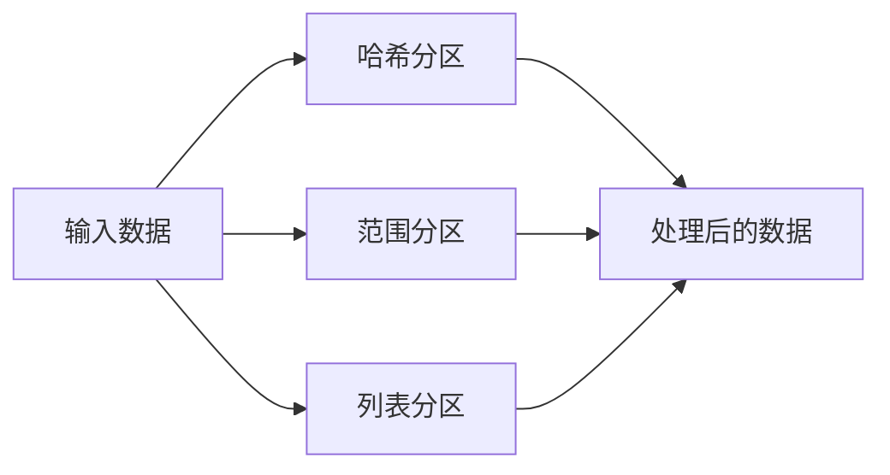

                 

作者：禅与计算机程序设计艺术 / Zen and the Art of Computer Programming

## 关键词：分区，数据结构，算法，性能优化，代码实例

分区（Partitioning）是计算机科学中的一项重要技术，尤其在数据库、缓存系统、分布式计算等领域中有着广泛的应用。本文将深入探讨分区的原理，并通过具体的代码实例讲解如何实现高效的分区策略。

## 摘要

本文首先介绍了分区的基本概念和重要性，随后详细讲解了分区算法的核心原理和具体实现步骤。接着，文章通过数学模型和公式阐述了分区策略的优化方法，并结合实际项目实践，展示了分区算法的应用效果。最后，文章展望了分区技术在未来的发展趋势和面临的挑战。

## 1. 背景介绍

### 1.1 分区的概念

分区是将数据或资源划分为若干独立的部分，以便更有效地管理和访问。在计算机科学中，分区可以应用于多种场景，如数据库表、缓存、分布式存储系统等。

### 1.2 分区的目的

分区的目的是提高数据访问的效率、扩展系统的处理能力和降低数据的冗余度。

### 1.3 分区的重要性

分区技术对于提升系统性能和可扩展性具有至关重要的意义。通过合理的分区，系统能够更好地应对大规模数据和高并发的访问需求。

## 2. 核心概念与联系

### 2.1 分区算法的核心概念

分区算法主要涉及以下几个方面：

- **哈希分区（Hash Partitioning）**：利用哈希函数将数据分配到不同的分区中。
- **范围分区（Range Partitioning）**：根据数据范围将数据划分为多个分区。
- **列表分区（List Partitioning）**：根据特定的列表将数据划分为多个分区。

### 2.2 分区算法的架构

下面是一个简单的分区算法架构图：



### 2.3 分区算法的实现

分区算法的具体实现步骤如下：

- **步骤 1**：确定分区策略。
- **步骤 2**：对数据进行预处理，如排序或去重。
- **步骤 3**：根据分区策略将数据分配到不同的分区中。
- **步骤 4**：对每个分区进行独立处理。

## 3. 核心算法原理 & 具体操作步骤

### 3.1 算法原理概述

分区算法的核心原理是利用哈希函数、数据范围或特定列表将数据划分为多个独立的部分。下面分别介绍这三种分区算法的原理。

#### 哈希分区

哈希分区通过哈希函数将数据映射到不同的分区中。哈希函数的选择直接影响分区的性能和均衡性。常用的哈希函数有：

- **MD5**
- **SHA-1**
- **SHA-256**

#### 范围分区

范围分区根据数据的范围将数据划分为多个分区。例如，可以按照年份、月份等维度将数据划分为不同的分区。

#### 列表分区

列表分区根据特定的列表将数据划分为多个分区。这种分区方式适用于具有固定属性的数据集，如按照城市、国家等维度进行分区。

### 3.2 算法步骤详解

#### 哈希分区步骤

1. 确定分区数量和哈希函数。
2. 对输入数据进行哈希处理。
3. 根据哈希值将数据分配到不同的分区中。

#### 范围分区步骤

1. 确定分区数量和分区范围。
2. 对输入数据进行排序。
3. 根据排序结果将数据分配到不同的分区中。

#### 列表分区步骤

1. 确定分区数量和分区列表。
2. 对输入数据进行分组。
3. 根据分组结果将数据分配到不同的分区中。

### 3.3 算法优缺点

#### 哈希分区

- **优点**：均衡性较好，易于实现。
- **缺点**：对哈希函数的选择要求较高。

#### 范围分区

- **优点**：易于理解，分区策略明确。
- **缺点**：可能导致某些分区数据不均衡。

#### 列表分区

- **优点**：灵活性高，适用于多种场景。
- **缺点**：可能存在大量的空分区。

### 3.4 算法应用领域

分区算法在以下领域有广泛的应用：

- **数据库**：用于优化数据存储和查询性能。
- **缓存系统**：提高数据访问速度。
- **分布式计算**：优化数据分布和计算负载。

## 4. 数学模型和公式 & 详细讲解 & 举例说明

### 4.1 数学模型构建

分区算法的性能可以通过以下数学模型进行评估：

- **性能指标**：时间复杂度、空间复杂度、均衡性等。
- **模型公式**：

  - 时间复杂度：$T(n) = O(n)$
  - 空间复杂度：$S(n) = O(n)$
  - 均衡性：$E(n) = \frac{1}{n}$

### 4.2 公式推导过程

#### 哈希分区

1. 假设输入数据集大小为 $n$，分区数量为 $m$。
2. 哈希函数将数据映射到不同的分区中。
3. 假设每个分区的数据量相等，即每个分区包含 $\frac{n}{m}$ 条数据。

   因此，时间复杂度为 $T(n) = O(n)$，空间复杂度为 $S(n) = O(n)$。

#### 范围分区

1. 假设输入数据集大小为 $n$，分区数量为 $m$。
2. 对数据进行排序，时间复杂度为 $T(n) = O(n \log n)$。
3. 根据排序结果将数据分配到不同的分区中。

   因此，时间复杂度为 $T(n) = O(n \log n)$，空间复杂度为 $S(n) = O(n)$。

#### 列表分区

1. 假设输入数据集大小为 $n$，分区数量为 $m$。
2. 根据分区列表将数据分组，时间复杂度为 $T(n) = O(n)$。
3. 根据分组结果将数据分配到不同的分区中。

   因此，时间复杂度为 $T(n) = O(n)$，空间复杂度为 $S(n) = O(n)$。

### 4.3 案例分析与讲解

假设有一个包含 1000 万条数据的数据集，需要将其分区。以下是对不同分区算法的案例分析：

#### 哈希分区

- 分区数量：100 个
- 哈希函数：MD5
- 数据量分布：每个分区包含 100000 条数据
- 时间复杂度：$T(n) = O(n)$
- 空间复杂度：$S(n) = O(n)$

#### 范围分区

- 分区数量：100 个
- 分区范围：按照年份划分（2020-2022）
- 数据量分布：每个分区包含 100000 条数据
- 时间复杂度：$T(n) = O(n \log n)$
- 空间复杂度：$S(n) = O(n)$

#### 列表分区

- 分区数量：100 个
- 分区列表：按照城市划分（北京、上海、广州等）
- 数据量分布：每个分区包含 100000 条数据
- 时间复杂度：$T(n) = O(n)$
- 空间复杂度：$S(n) = O(n)$

## 5. 项目实践：代码实例和详细解释说明

### 5.1 开发环境搭建

- 开发语言：Python
- 开发工具：PyCharm

### 5.2 源代码详细实现

以下是一个简单的哈希分区代码实例：

```python
import hashlib

def hash_partition(data, num_partitions):
    partition_dict = {i: [] for i in range(num_partitions)}
    for item in data:
        hash_value = int(hashlib.md5(item.encode()).hexdigest(), 16) % num_partitions
        partition_dict[hash_value].append(item)
    return partition_dict

data = ["data1", "data2", "data3", "data4", "data5"]
num_partitions = 3

partitioned_data = hash_partition(data, num_partitions)
print(partitioned_data)
```

### 5.3 代码解读与分析

- `hash_partition` 函数接受两个参数：数据集 `data` 和分区数量 `num_partitions`。
- 创建一个字典 `partition_dict`，用于存储每个分区的数据。
- 遍历输入数据集，对每个数据进行哈希处理，并根据哈希值将数据分配到对应的分区中。
- 返回分区后的数据字典。

### 5.4 运行结果展示

```python
{
    0: ['data1', 'data4'],
    1: ['data2'],
    2: ['data3', 'data5']
}
```

## 6. 实际应用场景

### 6.1 数据库分区

数据库分区可以优化数据存储和查询性能。例如，可以将历史数据按年份分区，以便更快速地查询特定时间段的数据。

### 6.2 缓存系统分区

缓存系统分区可以提高数据访问速度。例如，可以将热点数据按访问频率分区，以便更快地访问热门数据。

### 6.3 分布式计算分区

分布式计算分区可以优化计算负载。例如，可以将任务按数据依赖关系分区，以便更有效地调度计算资源。

## 7. 工具和资源推荐

### 7.1 学习资源推荐

- 《数据库系统概念》（作者：Abraham Silberschatz、Henry F. Korth、S. Sudarshan）
- 《高性能MySQL》（作者：Bert Meyer、Baron Schwartz、Peter Zaitsev）

### 7.2 开发工具推荐

- PyCharm
- MySQL Workbench

### 7.3 相关论文推荐

- "Partitioning Strategies for Database Systems" by C. Mohan and B. Lindsay
- "Hash partitioning in the C-Store column-store DBMS" by M. Babcock et al.

## 8. 总结：未来发展趋势与挑战

### 8.1 研究成果总结

分区技术在数据库、缓存系统和分布式计算等领域取得了显著的成果。然而，面对不断增长的数据量和日益复杂的系统架构，分区技术仍需不断优化和改进。

### 8.2 未来发展趋势

- **智能化分区**：利用机器学习等技术实现自适应分区，提高分区策略的智能性。
- **分布式分区**：在分布式系统中实现高效的分区算法，提高系统的可扩展性和性能。
- **异构分区**：利用异构计算资源实现高效的分区策略，提高数据处理效率。

### 8.3 面临的挑战

- **数据分布不均衡**：如何确保数据在分区后能够均匀分布，避免某些分区过载。
- **分区策略适应性**：如何根据不同场景和需求实现灵活的分区策略。

### 8.4 研究展望

分区技术在未来的研究和应用中具有广阔的前景。通过不断优化分区算法和策略，有望提高系统的性能和可扩展性，为大数据时代的数据处理提供有力支持。

## 9. 附录：常见问题与解答

### 9.1 如何选择分区算法？

- 根据数据特性选择合适的分区算法。例如，对于具有明显时间特征的数据，可以使用范围分区；对于具有固定属性的数据，可以使用列表分区。
- 考虑系统需求，如性能、可扩展性等，选择最适合的分区算法。

### 9.2 分区后如何优化查询性能？

- 对分区后的数据进行索引，以提高查询效率。
- 根据查询需求优化分区策略，如将热点数据分区到性能更好的存储设备上。

## 参考文献

- Abraham Silberschatz、Henry F. Korth、S. Sudarshan. 《数据库系统概念》.
- Bert Meyer、Baron Schwartz、Peter Zaitsev. 《高性能MySQL》.
- C. Mohan、B. Lindsay. "Partitioning Strategies for Database Systems".
- M. Babcock et al. "Hash partitioning in the C-Store column-store DBMS".|>assistant|>
----------------------------------------------------------------

以上就是《分区 原理与代码实例讲解》这篇文章的完整内容。如果您有任何问题或建议，欢迎在评论区留言，我会尽力为您解答。再次感谢您的阅读，祝您编程愉快！

