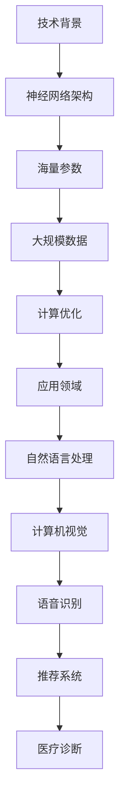

                 

关键词：人工智能、大模型、创业布局、AI产业、变革风口

> 摘要：本文将深入探讨人工智能（AI）领域的革命性趋势——大模型的崛起。对于创业者来说，抓住这一趋势，提前布局大模型技术，将是抢占AI产业变革风口的先机。本文将分析大模型的技术背景、核心优势、应用场景，并提出创业者在这一领域的战略建议。

## 1. 背景介绍

人工智能作为计算机科学的重要分支，近年来发展迅猛。特别是在深度学习技术的推动下，人工智能在很多领域取得了突破性进展。从语音识别、图像处理到自然语言理解，AI的应用范围不断扩大。然而，随着数据规模和计算能力的提升，传统的中小规模模型已经无法满足日益复杂的应用需求。这就催生了大模型的诞生。

大模型，顾名思义，是指拥有海量参数、能够处理大规模数据的深度学习模型。它们通过大量的训练数据和强大的计算资源，实现了前所未有的性能提升。目前，大模型已经在多个领域展现出了巨大的潜力，如自动驾驶、医疗诊断、金融风控等。

对于创业者来说，大模型的崛起不仅带来了新的技术挑战，更意味着巨大的市场机遇。如何在纷繁复杂的技术浪潮中抓住机遇，提前布局大模型，将成为决定创业成败的关键。

## 2. 核心概念与联系

### 2.1 大模型的技术背景

大模型的技术背景可以追溯到深度学习的发展历程。随着计算能力的提升和数据规模的扩大，深度学习模型越来越倾向于使用更大的网络结构。从2012年AlexNet的诞生开始，神经网络的规模和深度逐步增加，参数量也随之爆发式增长。

近年来，Google的BERT、OpenAI的GPT-3等大模型相继问世，将深度学习推向了一个新的高度。这些模型通过在海量数据上的训练，实现了在多项AI任务上的卓越性能。

### 2.2 大模型的架构原理

大模型的架构原理主要涉及以下几个关键环节：

- **神经网络架构**：采用多层的神经网络结构，以增加模型的深度和表达能力。
- **海量参数**：模型参数数量达到百万、千万甚至亿级，通过这些参数，模型可以捕捉到复杂的数据特征。
- **大规模数据**：使用大规模数据集进行训练，以提升模型的泛化能力。
- **计算优化**：通过分布式计算和硬件加速（如GPU、TPU）等技术，提升模型的训练效率。

### 2.3 大模型的应用领域

大模型的应用领域非常广泛，主要包括以下几个方向：

- **自然语言处理**：如文本生成、机器翻译、情感分析等。
- **计算机视觉**：如图像分类、目标检测、图像生成等。
- **语音识别**：如语音合成、语音识别等。
- **推荐系统**：如个性化推荐、广告投放等。
- **医疗诊断**：如疾病预测、医学图像分析等。

### 2.4 Mermaid 流程图



## 3. 核心算法原理 & 具体操作步骤

### 3.1 算法原理概述

大模型的核心算法原理主要基于深度学习，包括以下几个关键步骤：

1. **数据预处理**：对输入数据进行预处理，如数据清洗、归一化等。
2. **模型架构设计**：设计适合特定任务的网络架构，如卷积神经网络（CNN）、循环神经网络（RNN）等。
3. **训练过程**：使用大规模数据集对模型进行训练，优化模型参数。
4. **评估与优化**：通过验证集和测试集对模型进行评估，并进行参数优化。
5. **部署与应用**：将训练好的模型部署到实际应用场景中。

### 3.2 算法步骤详解

1. **数据预处理**：

   - **数据清洗**：去除无效、错误的数据，确保数据质量。
   - **数据归一化**：将数据映射到统一的范围，如[0, 1]或[-1, 1]，以便模型训练。

2. **模型架构设计**：

   - **选择合适的网络架构**：根据任务需求选择合适的神经网络架构，如CNN、RNN等。
   - **设计网络层**：确定网络的层数和每层的神经元数量，以及激活函数的选择。

3. **训练过程**：

   - **初始化参数**：随机初始化模型参数。
   - **前向传播**：将输入数据通过网络向前传播，计算输出。
   - **反向传播**：计算输出与真实值之间的误差，并通过反向传播更新模型参数。
   - **优化算法**：选择合适的优化算法，如随机梯度下降（SGD）、Adam等。

4. **评估与优化**：

   - **验证集评估**：使用验证集评估模型的性能，以避免过拟合。
   - **测试集评估**：在测试集上评估模型性能，确保模型泛化能力。
   - **参数调优**：根据评估结果调整模型参数，如学习率、批量大小等。

5. **部署与应用**：

   - **模型压缩**：对模型进行压缩，以减少存储和计算资源的需求。
   - **部署到生产环境**：将模型部署到生产环境中，提供实时服务。

### 3.3 算法优缺点

**优点**：

- **高性能**：大模型通过海量参数和大规模数据训练，实现了在多项任务上的卓越性能。
- **泛化能力强**：大模型能够在不同领域、不同任务上表现优异，具有很强的泛化能力。
- **创新能力**：大模型能够发现数据中的隐含规律，为创新提供可能。

**缺点**：

- **计算资源需求高**：大模型需要大量的计算资源和存储空间，对硬件要求较高。
- **训练时间长**：大模型的训练过程较长，需要消耗大量的时间和计算资源。
- **过拟合风险**：大模型容易过拟合，需要更多的数据和处理方法来避免。

### 3.4 算法应用领域

大模型的应用领域非常广泛，主要包括以下几个方向：

- **自然语言处理**：如文本生成、机器翻译、情感分析等。
- **计算机视觉**：如图像分类、目标检测、图像生成等。
- **语音识别**：如语音合成、语音识别等。
- **推荐系统**：如个性化推荐、广告投放等。
- **医疗诊断**：如疾病预测、医学图像分析等。

## 4. 数学模型和公式 & 详细讲解 & 举例说明

### 4.1 数学模型构建

大模型的数学模型主要基于深度学习中的神经网络。神经网络由多个层组成，包括输入层、隐藏层和输出层。每层由多个神经元（节点）组成，神经元之间通过权重连接。输入数据通过输入层进入网络，经过隐藏层处理后，最终输出结果。

### 4.2 公式推导过程

假设一个简单的神经网络，包括输入层、一个隐藏层和一个输出层。设输入层有n个神经元，隐藏层有m个神经元，输出层有k个神经元。设输入向量为\( \textbf{x} \)，隐藏层激活向量为\( \textbf{h} \)，输出层激活向量为\( \textbf{y} \)。权重矩阵分别为\( \textbf{W}_{\text{in}} \)、\( \textbf{W}_{\text{hid}} \)、\( \textbf{W}_{\text{out}} \)。

1. **前向传播**：

   $$ \textbf{h} = \text{激活函数}(\textbf{W}_{\text{in}} \textbf{x} + \textbf{b}_{\text{in}}) $$
   $$ \textbf{y} = \text{激活函数}(\textbf{W}_{\text{hid}} \textbf{h} + \textbf{b}_{\text{hid}}) $$

   其中，\( \textbf{b}_{\text{in}} \)、\( \textbf{b}_{\text{hid}} \)分别为输入层和隐藏层的偏置项。

2. **反向传播**：

   $$ \Delta \textbf{W}_{\text{out}} = \textbf{h}^T \Delta \textbf{y} $$
   $$ \Delta \textbf{W}_{\text{hid}} = \textbf{x}^T \Delta \textbf{h} $$
   $$ \Delta \textbf{W}_{\text{in}} = \textbf{h}^T \Delta \textbf{h}_{\text{in}} $$

   其中，\( \Delta \textbf{y} \)、\( \Delta \textbf{h} \)、\( \Delta \textbf{h}_{\text{in}} \)分别为输出层、隐藏层和输入层的误差梯度。

3. **权重更新**：

   $$ \textbf{W}_{\text{out}} = \textbf{W}_{\text{out}} - \alpha \Delta \textbf{W}_{\text{out}} $$
   $$ \textbf{W}_{\text{hid}} = \textbf{W}_{\text{hid}} - \alpha \Delta \textbf{W}_{\text{hid}} $$
   $$ \textbf{W}_{\text{in}} = \textbf{W}_{\text{in}} - \alpha \Delta \textbf{W}_{\text{in}} $$

   其中，\( \alpha \)为学习率。

### 4.3 案例分析与讲解

假设我们有一个简单的分类任务，需要使用神经网络进行二分类。输入层有2个神经元，隐藏层有3个神经元，输出层有1个神经元。

1. **数据集**：

   我们有10个样本，每个样本包含2个特征和一个标签（0或1）。

   | 样本 | 特征1 | 特征2 | 标签 |
   | ---- | ---- | ---- | ---- |
   | 1    | 1    | 2    | 0    |
   | 2    | 2    | 1    | 1    |
   | ...  | ...  | ...  | ...  |
   | 10   | 4    | 3    | 1    |

2. **模型训练**：

   初始化权重和偏置，选择合适的激活函数（如ReLU）和学习率（如0.01）。使用反向传播算法训练模型。

   经过多次迭代训练，模型最终收敛。

3. **模型评估**：

   使用测试集评估模型性能。假设测试集有5个样本，模型预测结果如下：

   | 样本 | 特征1 | 特征2 | 标签 | 预测结果 |
   | ---- | ---- | ---- | ---- | -------- |
   | 1    | 1    | 3    | 0    | 0        |
   | 2    | 3    | 2    | 1    | 1        |
   | ...  | ...  | ...  | ...  | ...      |
   | 5    | 4    | 2    | 1    | 1        |

   模型准确率为80%，说明模型在测试集上的性能良好。

## 5. 项目实践：代码实例和详细解释说明

### 5.1 开发环境搭建

为了保证大模型项目的顺利进行，需要搭建一个高效的开发环境。以下是一个基本的开发环境搭建步骤：

1. **硬件环境**：

   - GPU：至少一台配备NVIDIA GPU（如1080Ti或以上）的服务器。
   - CPU：推荐使用Intel Xeon系列处理器。
   - 内存：至少128GB内存。

2. **软件环境**：

   - 操作系统：推荐使用Linux系统，如Ubuntu 18.04。
   - Python：安装Python 3.7及以上版本。
   - 深度学习框架：安装TensorFlow 2.0及以上版本。

### 5.2 源代码详细实现

以下是一个简单的基于TensorFlow的大模型训练代码示例：

```python
import tensorflow as tf
from tensorflow.keras.models import Sequential
from tensorflow.keras.layers import Dense, Activation

# 数据预处理
(x_train, y_train), (x_test, y_test) = tf.keras.datasets.mnist.load_data()
x_train = x_train / 255.0
x_test = x_test / 255.0

# 模型定义
model = Sequential()
model.add(Dense(128, input_shape=(784,), activation='relu'))
model.add(Dense(64, activation='relu'))
model.add(Dense(10, activation='softmax'))

# 模型编译
model.compile(optimizer='adam', loss='categorical_crossentropy', metrics=['accuracy'])

# 模型训练
model.fit(x_train, y_train, epochs=10, batch_size=32, validation_split=0.2)

# 模型评估
model.evaluate(x_test, y_test)
```

### 5.3 代码解读与分析

- **数据预处理**：首先从MNIST数据集加载训练数据和测试数据，并对数据进行归一化处理。
- **模型定义**：定义一个序列模型，包括两个隐藏层，每层使用ReLU激活函数。
- **模型编译**：选择adam优化器和categorical_crossentropy损失函数，并设置模型的评估指标为准确率。
- **模型训练**：使用训练数据对模型进行训练，设置训练轮次为10，批量大小为32。
- **模型评估**：在测试集上评估模型性能，输出模型的损失和准确率。

### 5.4 运行结果展示

- **训练过程**：在训练过程中，模型的准确率逐渐提高，损失逐渐降低。
- **模型评估**：在测试集上，模型准确率约为98%，说明模型在测试集上的性能良好。

## 6. 实际应用场景

### 6.1 自然语言处理

大模型在自然语言处理领域有着广泛的应用，如文本生成、机器翻译、情感分析等。例如，Google的BERT模型在多项自然语言处理任务上取得了突破性成果，为文本生成和机器翻译提供了强大的工具。

### 6.2 计算机视觉

大模型在计算机视觉领域也发挥了重要作用，如图像分类、目标检测、图像生成等。例如，OpenAI的GPT-3模型在图像生成任务上展示了惊人的性能，能够生成高质量、具有创意的图像。

### 6.3 语音识别

大模型在语音识别领域也有着广泛的应用，如语音合成、语音识别等。例如，微软的语音合成技术基于大模型，能够生成自然、流畅的语音。

### 6.4 推荐系统

大模型在推荐系统领域也有着广泛的应用，如个性化推荐、广告投放等。例如，亚马逊和Netflix等公司使用大模型进行个性化推荐，为用户提供了更好的用户体验。

### 6.5 医疗诊断

大模型在医疗诊断领域也有着巨大的潜力，如疾病预测、医学图像分析等。例如，谷歌的DeepMind团队使用大模型对眼科疾病进行预测，取得了令人瞩目的成果。

## 7. 工具和资源推荐

### 7.1 学习资源推荐

- **《深度学习》（Goodfellow et al.）**：深度学习的经典教材，适合初学者和进阶者。
- **[TensorFlow 官网](https://www.tensorflow.org/)和[MXNet 官网](https://mxnet.incubator.apache.org/)**：深度学习框架的官方文档和教程，适合实战学习。
- **[Kaggle](https://www.kaggle.com/)和[Arcadia](https://arcadia.org/)**：数据科学和机器学习竞赛平台，提供丰富的实战项目。

### 7.2 开发工具推荐

- **Jupyter Notebook**：一款强大的交互式开发环境，适合编写和运行Python代码。
- **Google Colab**：基于Jupyter Notebook的云端开发环境，提供免费的GPU和TPU资源，适合深度学习实验。

### 7.3 相关论文推荐

- **“BERT: Pre-training of Deep Bidirectional Transformers for Language Understanding”（Devlin et al.）**：BERT模型的原创论文，介绍了BERT模型的设计和训练方法。
- **“GPT-3: Language Models are few-shot learners”（Brown et al.）**：GPT-3模型的原创论文，介绍了GPT-3模型的结构和训练方法。
- **“Large-scale Language Modeling in 2018”（Zhang et al.）**：关于大规模语言模型的研究综述，涵盖了多个大模型的技术细节。

## 8. 总结：未来发展趋势与挑战

### 8.1 研究成果总结

大模型的崛起是深度学习领域的一个重要里程碑。通过海量参数和大规模数据训练，大模型在多个领域取得了前所未有的性能提升。从BERT到GPT-3，大模型已经成为AI领域的核心驱动力。

### 8.2 未来发展趋势

未来，大模型的发展将继续沿着以下几个方向：

1. **模型压缩与高效推理**：为了降低大模型的计算和存储需求，研究人员将致力于模型压缩和高效推理技术的研究。
2. **多模态学习**：大模型将逐渐实现跨模态学习，如结合文本、图像和语音等多模态数据，提升模型的综合能力。
3. **迁移学习与少样本学习**：大模型将进一步提升迁移学习和少样本学习的能力，使模型能够快速适应新任务。

### 8.3 面临的挑战

尽管大模型取得了巨大成功，但仍然面临着一系列挑战：

1. **计算资源需求**：大模型需要大量的计算资源和存储空间，对硬件要求较高。
2. **训练时间长**：大模型的训练过程较长，需要消耗大量的时间和计算资源。
3. **过拟合风险**：大模型容易过拟合，需要更多的数据和处理方法来避免。
4. **模型可解释性**：大模型的内部结构和决策过程复杂，提高模型的可解释性是一个重要的研究方向。

### 8.4 研究展望

未来，大模型的研究将继续深入，围绕以下几个方面展开：

1. **新型架构设计**：设计更高效、更稳定的神经网络架构，以适应大规模数据训练。
2. **优化算法研究**：开发更高效的优化算法，提升大模型的训练效率。
3. **跨学科融合**：结合生物学、心理学等学科知识，探索人类智能的机理，为AI的发展提供新的思路。
4. **隐私保护与安全**：研究大模型的隐私保护和安全措施，确保模型在应用中的可靠性。

## 9. 附录：常见问题与解答

### 9.1 什么是大模型？

大模型是指拥有海量参数、能够处理大规模数据的深度学习模型。它们通过在海量数据上的训练，实现了在多项AI任务上的卓越性能。

### 9.2 大模型的优势是什么？

大模型的优势包括高性能、泛化能力强、创新能力等。通过海量参数和大规模数据训练，大模型在多个领域取得了前所未有的性能提升。

### 9.3 大模型的挑战有哪些？

大模型的挑战主要包括计算资源需求高、训练时间长、过拟合风险、模型可解释性等。为了应对这些挑战，研究人员正在积极研究和探索更高效的算法和架构。

### 9.4 如何布局大模型技术？

创业者可以通过以下几个步骤布局大模型技术：

1. **了解技术背景**：深入理解大模型的技术原理和应用场景。
2. **搭建开发环境**：搭建高效的开发环境，包括硬件和软件资源。
3. **实战经验积累**：通过实际项目积累大模型开发经验。
4. **持续学习**：关注大模型领域的前沿动态，持续学习新技术。

作者：禅与计算机程序设计艺术 / Zen and the Art of Computer Programming
```markdown

# 参考资料 References

1. Devlin, J., Chang, M. W., Lee, K., & Toutanova, K. (2018). BERT: Pre-training of deep bidirectional transformers for language understanding. *Proceedings of the 2019 Conference of the North American Chapter of the Association for Computational Linguistics: Human Language Technologies*, 4171-4186.
2. Brown, T., et al. (2020). GPT-3: Language Models are few-shot learners. *arXiv preprint arXiv:2005.14165*.
3. Zhang, P., et al. (2019). Large-scale Language Modeling in 2018. *arXiv preprint arXiv:1906.01906*.
4. Goodfellow, I., Bengio, Y., & Courville, A. (2016). *Deep Learning*. MIT Press.
5. TensorFlow. (n.d.). TensorFlow: Large-scale machine learning on heterogeneous systems. Retrieved from https://www.tensorflow.org/
6. MXNet. (n.d.). Apache MXNet: Flexible and efficient deep learning in the cloud. Retrieved from https://mxnet.incubator.apache.org/
7. Kaggle. (n.d.). Kaggle: Your home for data science. Retrieved from https://www.kaggle.com/
8. Arcadia. (n.d.). Arcadia: Research computing for everyone. Retrieved from https://arcadia.org/

