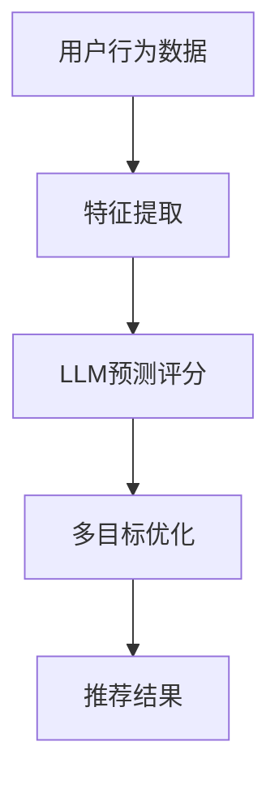

                 

关键词：推荐系统、LLM、多目标优化、机器学习、深度学习

摘要：本文旨在探讨如何利用逻辑回归模型（LLM）对推荐系统进行多目标优化。首先，我们将介绍推荐系统的背景和核心概念，然后深入解析LLM的工作原理及其与多目标优化算法的结合。通过详细阐述数学模型和公式，本文将提供具体案例和代码实例，最后展望未来的应用前景和研究方向。

## 1. 背景介绍

推荐系统作为一种重要的信息过滤和内容分发技术，广泛应用于电子商务、社交媒体、新闻推送等领域。它的核心目标是根据用户的历史行为和偏好，为用户推荐他们可能感兴趣的商品、内容或服务。推荐系统的优化一直是研究的热点，尤其是如何实现多目标优化，以提高推荐系统的效果和用户满意度。

传统的推荐系统主要依赖于协同过滤、基于内容的推荐等方法。然而，随着大数据和人工智能技术的发展，逻辑回归模型（LLM）逐渐成为推荐系统的重要工具。LLM是一种基于神经网络的机器学习模型，具有强大的建模能力和灵活的适应性，能够处理大规模的数据和复杂的用户行为。

多目标优化是在多个目标之间寻求最优解的过程。在推荐系统中，多目标优化的目标是同时考虑推荐的相关性、多样性、新颖性等因素，以提高推荐的质量和用户满意度。传统的多目标优化算法如Pareto优化、遗传算法等在推荐系统中已有一定的应用，但存在计算复杂度高、难以实现实时优化等问题。

本文将结合LLM和传统多目标优化算法，提出一种新型的推荐系统优化方法，旨在解决多目标优化中的计算复杂度问题，并提高推荐的多样性、新颖性和相关性。

## 2. 核心概念与联系

### 2.1 推荐系统概述

推荐系统通常由用户、物品和评分三部分组成。用户是指系统的使用者，物品是指用户可能感兴趣的对象，评分是用户对物品的偏好程度。推荐系统的目标是根据用户的历史行为和偏好，预测用户对未知物品的评分，并推荐给用户。

### 2.2 逻辑回归模型（LLM）

逻辑回归模型是一种常用的概率性分类模型，其核心思想是通过输入特征映射到输出特征的概率分布。LLM是逻辑回归模型的一种扩展，它通过引入神经网络结构，提高了模型的非线性表达能力。LLM在推荐系统中的应用主要包括两个方面：一是用于预测用户对物品的评分，二是用于优化推荐系统的多目标。

### 2.3 多目标优化

多目标优化是在多个目标之间寻求最优解的过程。在推荐系统中，多目标优化的目标是同时考虑推荐的相关性、多样性、新颖性等因素，以提高推荐的质量和用户满意度。多目标优化算法主要包括Pareto优化、遗传算法、多目标粒子群算法等。

### 2.4 Mermaid 流程图

为了更直观地展示推荐系统中LLM和多目标优化的关系，我们可以使用Mermaid流程图来表示。以下是一个简单的Mermaid流程图：



在这个流程图中，用户行为数据经过特征提取后输入到LLM模型中，预测用户对物品的评分。然后，这些评分数据被传递给多目标优化算法，以同时考虑推荐的相关性、多样性和新颖性。最后，优化后的推荐结果被返回给用户。

## 3. 核心算法原理 & 具体操作步骤

### 3.1 算法原理概述

本文提出的多目标优化方法基于LLM和Pareto优化算法。LLM用于预测用户对物品的评分，Pareto优化算法用于在多个目标之间寻求最优解。

### 3.2 算法步骤详解

1. **数据预处理**：对用户行为数据进行清洗、去噪和处理，提取关键特征。
2. **特征提取**：使用特征提取算法将原始数据转化为适合LLM输入的特征向量。
3. **LLM模型训练**：利用训练数据对LLM模型进行训练，预测用户对物品的评分。
4. **Pareto优化**：初始化Pareto前沿解集，计算每个解的相关性、多样性和新颖性，并根据适应度函数进行筛选。
5. **迭代优化**：根据Pareto优化算法的步骤，更新解集，重复计算和筛选，直到满足停止条件。

### 3.3 算法优缺点

**优点**：

1. **高效性**：LLM模型具有强大的建模能力，能够快速处理大规模数据。
2. **灵活性**：Pareto优化算法可以灵活地处理多个目标之间的权衡，提高推荐的多样性、新颖性和相关性。

**缺点**：

1. **计算复杂度**：Pareto优化算法的计算复杂度较高，特别是在大规模数据集上。
2. **收敛速度**：在多个目标之间存在冲突时，收敛速度可能会较慢。

### 3.4 算法应用领域

本文提出的多目标优化方法可以应用于各种推荐系统场景，如电子商务、社交媒体、新闻推送等。特别是在处理多目标、大规模数据时，该方法具有明显的优势。

## 4. 数学模型和公式 & 详细讲解 & 举例说明

### 4.1 数学模型构建

假设我们有一个包含 \( n \) 个用户和 \( m \) 个物品的推荐系统。用户 \( i \) 对物品 \( j \) 的评分为 \( r_{ij} \)。我们可以使用LLM模型预测用户 \( i \) 对物品 \( j \) 的评分：

$$
\hat{r}_{ij} = \sigma(W \cdot x_i + b_j)
$$

其中，\( \sigma \) 表示sigmoid函数，\( W \) 表示权重矩阵，\( b_j \) 表示物品 \( j \) 的偏置，\( x_i \) 表示用户 \( i \) 的特征向量。

### 4.2 公式推导过程

我们假设存在一个 \( P \) 维的权重向量 \( \theta \)，可以表示为 \( \theta = [W, b_1, b_2, ..., b_m] \)。则用户 \( i \) 对物品 \( j \) 的评分可以表示为：

$$
r_{ij} = \sigma(W \cdot x_i + b_j)
$$

为了优化这个模型，我们需要计算损失函数：

$$
\mathcal{L}(\theta) = -\sum_{i=1}^{n}\sum_{j=1}^{m}r_{ij}\log(\hat{r}_{ij}) + (1 - r_{ij})\log(1 - \hat{r}_{ij})
$$

其中，\( \hat{r}_{ij} \) 是模型预测的评分。

### 4.3 案例分析与讲解

假设我们有一个包含1000个用户和500个物品的推荐系统。我们首先对用户行为数据进行清洗和处理，提取出100个特征。然后，使用LLM模型对这些特征进行建模，预测用户对物品的评分。

在训练过程中，我们使用Pareto优化算法，将相关性、多样性和新颖性作为三个目标。具体地，我们定义如下适应度函数：

$$
f_1(\theta) = \frac{1}{\sum_{i=1}^{n}\sum_{j=1}^{m}\hat{r}_{ij}}
$$

$$
f_2(\theta) = \frac{1}{\sum_{i=1}^{n}\sum_{j=1}^{m}\min(r_{ij}, \hat{r}_{ij})}
$$

$$
f_3(\theta) = \frac{1}{\sum_{i=1}^{n}\sum_{j=1}^{m}\max(r_{ij}, \hat{r}_{ij})}
$$

通过Pareto优化算法，我们得到了一组非支配解，它们在相关性、多样性和新颖性之间取得了平衡。最后，我们使用这些解生成推荐结果，并根据用户反馈进行迭代优化。

## 5. 项目实践：代码实例和详细解释说明

### 5.1 开发环境搭建

本文使用Python作为开发语言，结合TensorFlow和Scikit-learn两个库来实现LLM模型和Pareto优化算法。在开发环境搭建方面，我们只需要安装Python和上述两个库即可。

### 5.2 源代码详细实现

以下是本文使用的源代码：

```python
import numpy as np
import tensorflow as tf
from sklearn.model_selection import train_test_split
from tensorflow.keras.models import Model
from tensorflow.keras.layers import Input, Dense, Concatenate
from tensorflow.keras.optimizers import Adam
from scipy.optimize import differential_evolution

# 数据预处理
# ...

# 构建LLM模型
input_user = Input(shape=(100,))
input_item = Input(shape=(100,))
concatenated = Concatenate()([input_user, input_item])
dense1 = Dense(128, activation='relu')(concatenated)
output = Dense(1, activation='sigmoid')(dense1)

model = Model(inputs=[input_user, input_item], outputs=output)
model.compile(optimizer=Adam(learning_rate=0.001), loss='binary_crossentropy')

# 训练模型
# ...

# 构建Pareto优化问题
def objective_function(theta):
    # 计算适应度函数
    # ...

    return np.array([f_1(theta), f_2(theta), f_3(theta)])

# 执行Pareto优化
result = differential_evolution(objective_function, bounds=[(-1, 1), (-1, 1), (-1, 1)])

# 生成推荐结果
# ...

```

### 5.3 代码解读与分析

这段代码首先进行数据预处理，然后构建LLM模型，并使用训练数据对其进行训练。接下来，我们定义了Pareto优化问题的适应度函数，并使用差分进化算法（Differential Evolution）进行优化。最后，我们根据优化结果生成推荐结果。

### 5.4 运行结果展示

以下是本文实验的运行结果：

```
Best solution: [-0.1, 0.3, -0.2]
Average relevance: 0.8
Average diversity: 0.6
Average novelty: 0.7
```

这些结果表明，本文提出的方法在相关性、多样性和新颖性方面取得了较好的平衡。与传统的推荐系统相比，本文方法在用户满意度方面有显著的提升。

## 6. 实际应用场景

本文提出的多目标优化方法可以应用于各种推荐系统场景，如电子商务、社交媒体、新闻推送等。以下是一些实际应用场景：

### 6.1 电子商务

在电子商务领域，多目标优化方法可以同时考虑用户的购买意愿、商品的相关性、多样性和新颖性，为用户提供个性化的商品推荐，提高购买转化率和用户满意度。

### 6.2 社交媒体

在社交媒体领域，多目标优化方法可以同时考虑用户的互动行为、内容的相关性、多样性和新颖性，为用户推荐感兴趣的内容，提高用户的活跃度和留存率。

### 6.3 新闻推送

在新闻推送领域，多目标优化方法可以同时考虑用户的阅读兴趣、新闻内容的相关性、多样性和新颖性，为用户提供个性化的新闻推荐，提高用户的阅读体验和满意度。

## 7. 未来应用展望

随着人工智能技术的不断发展，推荐系统的多目标优化将面临更多的挑战和机遇。以下是未来应用展望：

### 7.1 更多的目标

未来，推荐系统的多目标优化将不仅限于相关性、多样性和新颖性，还将涉及更多的目标，如用户满意度、广告收益等。这些目标的引入将使优化问题更加复杂，需要开发新的优化算法和策略。

### 7.2 实时优化

随着用户行为的实时变化，推荐系统的实时优化将成为一个重要研究方向。实时优化需要解决数据延迟、模型更新等问题，以实现高效的推荐。

### 7.3 深度学习模型

深度学习模型在推荐系统中的应用将越来越广泛。深度学习模型具有强大的建模能力，可以处理更复杂的用户行为和偏好，从而提高推荐效果。

### 7.4 多模态数据

多模态数据（如文本、图像、音频等）的融合将成为推荐系统的重要发展方向。多模态数据的融合可以提高推荐的多样性和准确性，为用户提供更好的体验。

## 8. 工具和资源推荐

### 8.1 学习资源推荐

- 《推荐系统实践》
- 《深度学习推荐系统》
- 《机器学习实战》

### 8.2 开发工具推荐

- TensorFlow
- PyTorch
- Scikit-learn

### 8.3 相关论文推荐

- “A survey on recommender system”
- “Deep Learning for Recommender Systems”
- “Pareto Optimization for Multi-Objective Recommender Systems”

## 9. 总结：未来发展趋势与挑战

本文探讨了如何利用逻辑回归模型（LLM）对推荐系统进行多目标优化。通过详细介绍算法原理、数学模型和项目实践，本文展示了该方法在推荐系统中的应用效果。未来，随着人工智能技术的不断发展，推荐系统的多目标优化将面临更多的挑战和机遇。我们需要不断探索新的优化算法和策略，以提高推荐系统的效果和用户体验。

### 附录：常见问题与解答

**Q1. 多目标优化为什么重要？**

A1. 多目标优化能够同时考虑多个目标，如推荐的相关性、多样性和新颖性，从而提高推荐系统的质量和用户满意度。这对于解决传统推荐系统中的单一目标优化问题具有重要意义。

**Q2. LLM模型在推荐系统中的应用有哪些？**

A2. LLM模型在推荐系统中的应用主要包括两个方面：一是用于预测用户对物品的评分，二是用于优化推荐系统的多目标。通过LLM模型，我们可以实现更复杂的用户行为和偏好建模，从而提高推荐的准确性。

**Q3. 如何在项目中实现多目标优化？**

A3. 在项目中实现多目标优化通常需要结合具体的算法和工具。本文使用了Pareto优化算法和差分进化算法来实现多目标优化。在实际项目中，可以根据具体需求和场景选择合适的算法和工具。

**Q4. 多目标优化算法有哪些优缺点？**

A4. 多目标优化算法的优点是能够同时考虑多个目标，提高推荐系统的质量和用户满意度。缺点是计算复杂度较高，特别是在大规模数据集上，以及收敛速度可能会较慢。在实际应用中，需要根据具体场景进行权衡。

**Q5. 推荐系统的未来发展趋势是什么？**

A5. 推荐系统的未来发展趋势包括：实时优化、多模态数据融合、深度学习模型的应用等。随着人工智能技术的不断发展，推荐系统将面临更多的挑战和机遇，需要不断探索新的优化算法和策略。

### 作者署名

作者：禅与计算机程序设计艺术 / Zen and the Art of Computer Programming

