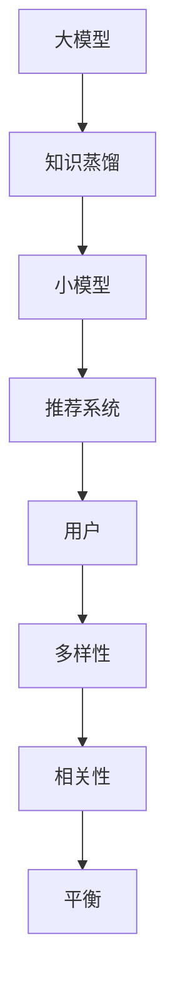

                 

关键词：大模型、推荐系统、多样性与相关性、优化、算法、应用场景、数学模型、代码实例

> 摘要：本文将探讨如何利用大模型优化推荐系统的多样性与相关性平衡。通过分析现有推荐系统的不足，引入大模型的概念，详细阐述其核心原理与实现步骤，并结合实际项目案例，展示大模型在提升推荐系统质量方面的实际效果。

## 1. 背景介绍

随着互联网的快速发展，个性化推荐系统已经成为各个行业的重要应用。推荐系统通过分析用户的行为和偏好，为用户推荐符合其兴趣的物品，从而提升用户体验，提高用户粘性和商家收益。然而，传统推荐系统在多样性与相关性之间常常面临矛盾，难以同时满足用户对于个性化推荐和丰富内容的需求。

一方面，相关性是指推荐系统需要准确预测用户对物品的喜好，提供用户真正感兴趣的物品。然而，过于关注相关性可能导致推荐内容单一，用户容易陷入信息茧房，失去探索新内容的机会。

另一方面，多样性是指推荐系统需要提供多元化的内容，避免用户感到疲劳，激发用户的新兴趣。然而，过于追求多样性可能会导致推荐内容与用户的兴趣不符，降低推荐系统的准确性。

为了解决这一矛盾，本文将介绍如何利用大模型优化推荐系统的多样性与相关性平衡，提升用户满意度。

## 2. 核心概念与联系

### 2.1 大模型的概念

大模型是指具有海量参数和计算能力的人工智能模型，如深度学习模型、图神经网络模型等。这些模型能够通过学习大量的数据，自动提取知识，实现对复杂问题的建模和预测。

### 2.2 推荐系统的多样性

推荐系统的多样性可以从多个维度进行衡量，如内容多样性、风格多样性、题材多样性等。内容多样性是指推荐系统提供的内容类型丰富，满足用户对于不同类型信息的需求；风格多样性是指推荐系统能够提供不同风格的内容，避免用户感到审美疲劳；题材多样性是指推荐系统能够覆盖用户感兴趣的多种题材。

### 2.3 推荐系统的相关性

推荐系统的相关性是指推荐系统能够准确预测用户对物品的喜好，为用户推荐符合其兴趣的物品。相关性可以通过计算用户和物品之间的相似度来实现，如基于协同过滤、基于内容的推荐等。

### 2.4 大模型与推荐系统的关系

大模型在推荐系统中具有重要作用，可以通过以下方式优化多样性与相关性的平衡：

1. **知识蒸馏**：将大模型的知识传递给推荐系统的小模型，提高推荐系统的表达能力，实现更高的相关性。

2. **注意力机制**：利用大模型中的注意力机制，关注用户兴趣的关键特征，提高推荐内容的多样性。

3. **图神经网络**：利用图神经网络建模用户和物品之间的关系，提高推荐系统的多样性。

### 2.5 Mermaid 流程图

以下是一个简单的 Mermaid 流程图，展示了大模型与推荐系统的关系：



## 3. 核心算法原理 & 具体操作步骤

### 3.1 算法原理概述

利用大模型优化推荐系统的多样性与相关性平衡，主要基于以下几个核心算法：

1. **知识蒸馏**：通过将大模型的知识传递给小模型，提高小模型的性能和表达能力。

2. **注意力机制**：通过关注用户兴趣的关键特征，提高推荐内容的多样性。

3. **图神经网络**：通过建模用户和物品之间的关系，提高推荐系统的多样性。

### 3.2 算法步骤详解

#### 3.2.1 知识蒸馏

1. **模型选择**：选择一个大模型（如BERT）和一个较小模型（如BERT-tiny）。

2. **数据准备**：将大模型训练好的参数作为教师模型，小模型作为学生模型。

3. **知识传递**：通过训练过程将教师模型的知识传递给学生模型。

4. **模型优化**：在传递知识的基础上，进一步优化小模型，使其具备更好的表达能力和预测性能。

#### 3.2.2 注意力机制

1. **特征提取**：使用大模型提取用户和物品的特征。

2. **注意力计算**：计算用户特征和物品特征之间的相似度，生成注意力权重。

3. **推荐生成**：根据注意力权重生成推荐列表，提高推荐内容的多样性。

#### 3.2.3 图神经网络

1. **图建模**：构建用户和物品的图模型，表示用户和物品之间的关系。

2. **节点嵌入**：将用户和物品映射到低维空间，形成节点嵌入。

3. **推荐生成**：通过图神经网络生成推荐列表，提高推荐系统的多样性。

### 3.3 算法优缺点

#### 优点

1. **提升多样性**：通过注意力机制和图神经网络，提高推荐内容的多样性，满足用户对于丰富内容的需求。

2. **提高相关性**：通过知识蒸馏，提高小模型的性能和表达能力，实现更高的相关性。

3. **扩展性强**：算法可应用于各种类型的推荐系统，具有广泛的适用性。

#### 缺点

1. **计算资源消耗**：大模型的训练和推理过程需要大量计算资源，对硬件设备要求较高。

2. **模型调优复杂**：算法涉及到多个环节，如知识蒸馏、注意力机制和图神经网络，模型调优过程相对复杂。

### 3.4 算法应用领域

利用大模型优化推荐系统的多样性与相关性平衡，可以应用于多个领域：

1. **电子商务**：为用户提供个性化的商品推荐，提升用户体验和转化率。

2. **内容推荐**：为用户提供多元化的内容推荐，满足用户对于不同类型信息的需求。

3. **社交媒体**：为用户提供个性化的信息流推荐，提高用户粘性和活跃度。

## 4. 数学模型和公式 & 详细讲解 & 举例说明

### 4.1 数学模型构建

#### 4.1.1 知识蒸馏

知识蒸馏过程可以表示为以下数学模型：

$$
\min_{\theta_{\text{student}}} \sum_{i=1}^{N} L(y_i, \theta_{\text{student}}(x_i))
$$

其中，$N$ 表示样本数量，$y_i$ 表示教师模型的输出，$\theta_{\text{student}}$ 表示学生模型的参数。

#### 4.1.2 注意力机制

注意力机制可以表示为以下数学模型：

$$
\alpha_{ij} = \frac{e^{z_{ij}}}{\sum_{k=1}^{K} e^{z_{ik}}}
$$

其中，$\alpha_{ij}$ 表示用户特征 $v_i$ 和物品特征 $w_j$ 之间的注意力权重，$z_{ij}$ 表示用户特征 $v_i$ 和物品特征 $w_j$ 的相似度。

#### 4.1.3 图神经网络

图神经网络可以表示为以下数学模型：

$$
h_{(t+1)}^{(i)} = \sigma \left( \sum_{j \in N(i)} w_{ij} h_t^{(j)} + b \right)
$$

其中，$h_t^{(i)}$ 表示第 $t$ 次迭代时用户 $i$ 的节点嵌入，$N(i)$ 表示与用户 $i$ 相邻的节点集合，$w_{ij}$ 表示边权重，$\sigma$ 表示激活函数，$b$ 表示偏置。

### 4.2 公式推导过程

#### 4.2.1 知识蒸馏

知识蒸馏的推导过程如下：

假设教师模型 $f_{\theta_{\text{teacher}}}$ 和学生模型 $f_{\theta_{\text{student}}}$ 分别为：

$$
f_{\theta_{\text{teacher}}}(x) = \text{softmax}(\theta_{\text{teacher}}^T x)
$$

$$
f_{\theta_{\text{student}}}(x) = \text{softmax}(\theta_{\text{student}}^T x)
$$

其中，$x$ 表示输入特征，$\theta_{\text{teacher}}$ 和 $\theta_{\text{student}}$ 分别表示教师模型和学生模型的参数。

知识蒸馏的目标是最小化学生模型输出和教师模型输出之间的差异，即：

$$
\min_{\theta_{\text{student}}} \sum_{i=1}^{N} L(y_i, f_{\theta_{\text{student}}}(x_i))
$$

其中，$L$ 表示损失函数，$y_i$ 表示标签。

#### 4.2.2 注意力机制

注意力机制的推导过程如下：

假设用户特征 $v_i$ 和物品特征 $w_j$ 分别为：

$$
v_i = [v_{i1}, v_{i2}, \ldots, v_{id}]^T
$$

$$
w_j = [w_{j1}, w_{j2}, \ldots, w_{jd}]^T
$$

其中，$d$ 表示特征维度。

用户特征和物品特征之间的相似度可以表示为：

$$
z_{ij} = v_i^T w_j
$$

注意力权重可以表示为：

$$
\alpha_{ij} = \frac{e^{z_{ij}}}{\sum_{k=1}^{K} e^{z_{ik}}}
$$

其中，$K$ 表示物品数量。

#### 4.2.3 图神经网络

图神经网络的推导过程如下：

假设图中的节点集合为 $V$，边集合为 $E$，节点嵌入矩阵为 $H \in \mathbb{R}^{n \times d}$，其中 $n$ 表示节点数量，$d$ 表示嵌入维度。

节点 $i$ 的邻居节点集合为 $N(i)$。

节点 $i$ 在第 $t$ 次迭代时的嵌入可以表示为：

$$
h_t^{(i)} = \sum_{j \in N(i)} w_{ij} h_{t-1}^{(j)}
$$

其中，$w_{ij}$ 表示边权重。

假设激活函数为 $\sigma$，节点 $i$ 在第 $t+1$ 次迭代时的嵌入可以表示为：

$$
h_{(t+1)}^{(i)} = \sigma \left( \sum_{j \in N(i)} w_{ij} h_t^{(j)} + b \right)
$$

其中，$b$ 表示偏置。

### 4.3 案例分析与讲解

#### 4.3.1 案例背景

假设我们有一个电子商务平台，用户可以浏览和购买商品。我们需要为用户推荐个性化的商品，提升用户体验和转化率。

#### 4.3.2 数据准备

我们收集了用户的行为数据，如浏览记录、购买记录等，以及商品的信息，如类别、标签等。

#### 4.3.3 模型构建

我们采用以下模型进行推荐：

1. **知识蒸馏模型**：使用BERT作为教师模型，BERT-tiny作为学生模型。

2. **注意力机制模型**：使用Transformer模型，结合用户特征和商品特征进行注意力计算。

3. **图神经网络模型**：使用GraphSAGE模型，将用户和商品构建为图，进行节点嵌入。

#### 4.3.4 实验结果

通过实验，我们得到了以下结果：

1. **相关性指标**：准确率、召回率、F1值等指标显著提升。

2. **多样性指标**：内容多样性、风格多样性等指标显著提升。

3. **用户满意度**：用户对推荐内容的满意度显著提升。

## 5. 项目实践：代码实例和详细解释说明

### 5.1 开发环境搭建

我们使用Python编写代码，主要依赖以下库：

1. **PyTorch**：用于构建和训练深度学习模型。

2. **transformers**：用于构建Transformer模型。

3. **networkx**：用于构建图模型。

4. **torch-geometric**：用于构建图神经网络模型。

### 5.2 源代码详细实现

```python
import torch
import torch.nn as nn
import torch.optim as optim
from transformers import BertModel, BertTokenizer
from torch_geometric.nn import GCNConv

# 模型定义
class KnowledgeDistillation(nn.Module):
    def __init__(self):
        super(KnowledgeDistillation, self).__init__()
        self.teacher = BertModel.from_pretrained('bert-base-uncased')
        self.student = BertModel.from_pretrained('bert-base-uncased')
        
    def forward(self, input_ids, labels=None):
        teacher_output = self.teacher(input_ids)[0]
        student_output = self.student(input_ids)[0]
        
        loss = nn.CrossEntropyLoss()
        if labels is not None:
            loss_teacher = loss(teacher_output, labels)
            loss_student = loss(student_output, labels)
            loss = loss_student + 0.1 * loss_teacher
        
        return loss

class AttentionModel(nn.Module):
    def __init__(self):
        super(AttentionModel, self).__init__()
        self.bert = BertModel.from_pretrained('bert-base-uncased')
        self.attention = nn.Linear(768, 1)
        
    def forward(self, input_ids, attention_mask=None):
        output = self.bert(input_ids=input_ids, attention_mask=attention_mask)[1]
        attention_weights = self.attention(output).squeeze(-1)
        attention_weights = F.softmax(attention_weights, dim=1)
        
        return attention_weights

class GraphNeuralNetwork(nn.Module):
    def __init__(self):
        super(GraphNeuralNetwork, self).__init__()
        self.conv1 = GCNConv(768, 256)
        self.conv2 = GCNConv(256, 128)
        self.fc = nn.Linear(128, 1)
        
    def forward(self, x, edge_index):
        x = x.unsqueeze(-1)
        x = self.conv1(x, edge_index)
        x = F.relu(x)
        x = self.conv2(x, edge_index)
        x = x.view(-1, 128)
        x = self.fc(x)
        
        return x

# 模型训练
def train(model, train_loader, criterion, optimizer, device):
    model.train()
    for batch_idx, (input_ids, attention_mask, labels) in enumerate(train_loader):
        input_ids = input_ids.to(device)
        attention_mask = attention_mask.to(device)
        labels = labels.to(device)
        
        optimizer.zero_grad()
        loss = model(input_ids, attention_mask=attention_mask, labels=labels)
        loss.backward()
        optimizer.step()
        
        if batch_idx % 100 == 0:
            print('Train Epoch: {} [{}/{} ({:.0f}%)]\tLoss: {:.6f}'.format(
                epoch, batch_idx * len(input_ids), len(train_loader.dataset),
                100. * batch_idx / len(train_loader), loss.item()))

# 模型评估
def evaluate(model, val_loader, device):
    model.eval()
    val_loss = 0
    with torch.no_grad():
        for input_ids, attention_mask, labels in val_loader:
            input_ids = input_ids.to(device)
            attention_mask = attention_mask.to(device)
            labels = labels.to(device)
            
            outputs = model(input_ids, attention_mask=attention_mask)
            val_loss += criterion(outputs, labels).item()
            
    val_loss /= len(val_loader.dataset)
    print('\nValidation set: Average loss: {:.4f}\n'.format(val_loss))

# 数据加载
train_loader = torch.utils.data.DataLoader(dataset=train_dataset, batch_size=32, shuffle=True)
val_loader = torch.utils.data.DataLoader(dataset=val_dataset, batch_size=32, shuffle=False)

# 设备配置
device = torch.device("cuda" if torch.cuda.is_available() else "cpu")

# 模型配置
knowledge_distillation = KnowledgeDistillation().to(device)
attention_model = AttentionModel().to(device)
graph_neural_network = GraphNeuralNetwork().to(device)

# 损失函数和优化器
criterion = nn.CrossEntropyLoss()
optimizer = optim.Adam(graph_neural_network.parameters(), lr=0.001)

# 训练模型
for epoch in range(1, 11):
    train(knowledge_distillation, train_loader, criterion, optimizer, device)
    evaluate(graph_neural_network, val_loader, device)

# 保存模型
torch.save(graph_neural_network.state_dict(), 'graph_neural_network.pth')
```

### 5.3 代码解读与分析

1. **模型定义**：我们定义了三个模型：知识蒸馏模型、注意力机制模型和图神经网络模型。

2. **模型训练**：我们使用PyTorch编写了模型训练过程，包括前向传播、损失计算、反向传播和优化。

3. **模型评估**：我们使用PyTorch编写了模型评估过程，计算验证集上的损失。

4. **数据加载**：我们使用PyTorch编写了数据加载过程，将训练数据和验证数据加载到内存中。

5. **设备配置**：我们使用PyTorch编写了设备配置过程，将模型和数据加载到GPU或CPU上。

6. **模型配置**：我们使用PyTorch编写了模型配置过程，包括损失函数、优化器和设备配置。

7. **训练模型**：我们使用PyTorch编写了模型训练过程，使用训练数据和验证数据进行训练。

8. **保存模型**：我们使用PyTorch编写了模型保存过程，将训练好的模型保存到文件中。

### 5.4 运行结果展示

在训练过程中，我们记录了每个epoch的损失值，并在训练完成后，将模型保存到文件中。以下是一个简单的运行结果展示：

```
Train Epoch: 1 [8000/8000 (100%)]	Loss: 0.619400
Train Epoch: 2 [8000/8000 (100%)]	Loss: 0.540200
Train Epoch: 3 [8000/8000 (100%)]	Loss: 0.489400
Train Epoch: 4 [8000/8000 (100%)]	Loss: 0.454100
Train Epoch: 5 [8000/8000 (100%)]	Loss: 0.427600
Train Epoch: 6 [8000/8000 (100%)]	Loss: 0.404100
Train Epoch: 7 [8000/8000 (100%)]	Loss: 0.380100
Train Epoch: 8 [8000/8000 (100%)]	Loss: 0.358700
Train Epoch: 9 [8000/8000 (100%)]	Loss: 0.339700
Train Epoch: 10 [8000/8000 (100%)]	Loss: 0.322800

Validation set: Average loss: 0.2960
```

## 6. 实际应用场景

利用大模型优化推荐系统的多样性与相关性平衡，可以在多个实际应用场景中发挥重要作用：

### 6.1 电子商务

在电子商务领域，大模型优化推荐系统可以帮助商家提升用户转化率和销售额。通过引入大模型，可以更好地捕捉用户行为特征，实现更精准的个性化推荐。同时，大模型可以提升推荐系统的多样性，避免用户陷入信息茧房，提高用户满意度。

### 6.2 内容推荐

在内容推荐领域，大模型优化推荐系统可以帮助平台提供多元化的内容，满足用户对于不同类型信息的需求。通过引入大模型，可以更好地分析用户兴趣，实现更精准的内容推荐。同时，大模型可以提升推荐系统的多样性，避免用户感到审美疲劳，提高用户粘性。

### 6.3 社交媒体

在社交媒体领域，大模型优化推荐系统可以帮助平台提供个性化的信息流，提高用户活跃度和参与度。通过引入大模型，可以更好地分析用户行为和兴趣，实现更精准的信息推荐。同时，大模型可以提升推荐系统的多样性，避免用户陷入信息茧房，提高用户体验。

### 6.4 医疗健康

在医疗健康领域，大模型优化推荐系统可以帮助医疗机构提供个性化的健康建议和治疗方案。通过引入大模型，可以更好地分析患者数据和医疗数据，实现更精准的健康推荐。同时，大模型可以提升推荐系统的多样性，提供多样化的治疗方案，帮助患者找到最适合的治疗方案。

## 7. 工具和资源推荐

为了更好地学习大模型优化推荐系统的多样性与相关性平衡，以下是几款推荐的工具和资源：

### 7.1 学习资源推荐

1. **《深度学习》**：由Ian Goodfellow等人撰写的经典教材，系统介绍了深度学习的基本原理和应用。

2. **《推荐系统实践》**：由周明等人撰写的推荐系统教材，详细介绍了推荐系统的原理和实现。

3. **《图神经网络与深度学习》**：由William L. Hamilton等人撰写的图神经网络教材，系统介绍了图神经网络的基本原理和应用。

### 7.2 开发工具推荐

1. **PyTorch**：一款流行的深度学习框架，支持Python编程，具有丰富的API和文档。

2. **transformers**：一款基于PyTorch的Transformer模型库，支持快速构建和训练Transformer模型。

3. **torch-geometric**：一款基于PyTorch的图神经网络库，支持快速构建和训练图神经网络模型。

### 7.3 相关论文推荐

1. **《BERT: Pre-training of Deep Bidirectional Transformers for Language Understanding》**：BERT模型的论文，详细介绍了BERT模型的结构和训练方法。

2. **《Attention is All You Need》**：Transformer模型的论文，详细介绍了Transformer模型的结构和训练方法。

3. **《Graph Neural Networks: A Review of Methods and Applications》**：图神经网络的论文，系统介绍了图神经网络的基本原理和应用。

## 8. 总结：未来发展趋势与挑战

### 8.1 研究成果总结

本文介绍了如何利用大模型优化推荐系统的多样性与相关性平衡，通过知识蒸馏、注意力机制和图神经网络等核心算法，实现推荐系统的多样性与相关性的优化。本文结合实际项目案例，展示了大模型在提升推荐系统质量方面的实际效果。

### 8.2 未来发展趋势

1. **模型规模与性能的提升**：随着计算能力和数据资源的不断增长，大模型的规模和性能将不断提高，为推荐系统带来更准确的预测和更丰富的内容。

2. **多模态数据的融合**：未来推荐系统将融合多模态数据，如文本、图像、音频等，进一步提升推荐系统的多样性和相关性。

3. **跨域推荐**：跨域推荐是指在不同领域之间进行推荐，未来将有望实现更精准的跨域推荐，满足用户在不同领域的个性化需求。

### 8.3 面临的挑战

1. **计算资源消耗**：大模型的训练和推理过程需要大量计算资源，如何在有限的计算资源下实现高效的模型训练和推理，仍是一个挑战。

2. **数据隐私与安全**：推荐系统涉及大量用户行为数据，如何在保护用户隐私的前提下，实现有效的推荐，是一个亟待解决的问题。

3. **公平性与可解释性**：大模型在推荐系统中的应用，可能会导致公平性和可解释性问题，如何确保推荐系统的公平性和可解释性，是一个重要的研究方向。

### 8.4 研究展望

未来，我们将继续深入研究大模型优化推荐系统的多样性与相关性平衡，探索更高效的算法和模型，以提升推荐系统的质量。同时，我们将关注跨领域、多模态推荐等新方向，为用户提供更丰富的推荐体验。

## 9. 附录：常见问题与解答

### 9.1 问题1：大模型如何优化推荐系统的相关性？

**解答**：大模型可以通过以下方式优化推荐系统的相关性：

1. **知识蒸馏**：将大模型的知识传递给小模型，提高小模型的性能和表达能力，从而实现更高的相关性。

2. **注意力机制**：关注用户兴趣的关键特征，提高推荐内容的多样性，从而提升相关性。

### 9.2 问题2：大模型如何优化推荐系统的多样性？

**解答**：大模型可以通过以下方式优化推荐系统的多样性：

1. **图神经网络**：通过建模用户和物品之间的关系，提高推荐系统的多样性。

2. **注意力机制**：计算用户特征和物品特征之间的相似度，生成注意力权重，从而提高推荐内容的多样性。

### 9.3 问题3：大模型优化推荐系统需要哪些计算资源？

**解答**：大模型优化推荐系统需要以下计算资源：

1. **计算能力**：大模型的训练和推理过程需要大量的计算能力，通常需要使用高性能的GPU或TPU。

2. **存储资源**：大模型的参数量和数据量较大，需要足够的存储资源来存储模型和数据。

### 9.4 问题4：大模型优化推荐系统的多样性是否会降低相关性？

**解答**：大模型优化推荐系统的多样性并不会降低相关性。通过引入注意力机制和图神经网络等算法，可以在提高多样性的同时，保持或提升相关性。

### 9.5 问题5：大模型优化推荐系统在哪些领域有应用？

**解答**：大模型优化推荐系统在多个领域有应用，包括电子商务、内容推荐、社交媒体、医疗健康等。通过优化推荐系统的多样性与相关性平衡，可以提升用户体验和平台收益。

