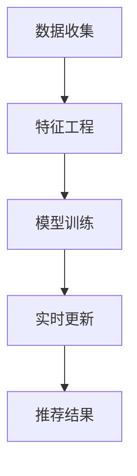

                 

关键词：大模型，推荐系统，实时更新，优化，算法，数学模型，实践案例

> 摘要：随着互联网的飞速发展和大数据技术的成熟，推荐系统已经成为现代互联网应用中不可或缺的一部分。然而，传统推荐系统在面对海量用户行为数据和实时性要求时，往往显得力不从心。本文旨在探讨如何利用大模型优化推荐系统的实时更新机制，从而提高推荐质量和用户体验。

## 1. 背景介绍

推荐系统作为信息检索和数据分析的重要应用，其核心目标是为用户提供个性化的内容或商品推荐。随着互联网用户数量的增加和数据量的激增，推荐系统的性能和实时性变得越来越重要。然而，传统推荐系统通常面临以下挑战：

1. **数据量庞大**：推荐系统需要处理海量用户行为数据，包括点击、浏览、购买等，这要求系统具有高效的数据处理能力。
2. **实时性要求高**：用户行为数据具有高度动态性，推荐系统需要在短时间内生成高质量的推荐结果，以提供实时、个性化的服务。
3. **计算资源有限**：在有限计算资源下，如何高效地利用算法模型，成为推荐系统优化的重要课题。

为应对上述挑战，近年来大模型（Large Models）如深度学习模型、神经网络模型等在推荐系统中的应用逐渐增多。大模型具有强大的特征提取和表示能力，能够处理复杂的非线性关系，从而在提升推荐质量方面表现出色。然而，大模型在实时更新方面的性能仍需优化，本文将围绕这一主题展开讨论。

## 2. 核心概念与联系

### 2.1 推荐系统基本架构

推荐系统通常包括以下几个核心组件：

1. **数据收集模块**：收集用户行为数据，如点击、浏览、购买等。
2. **特征工程模块**：将原始数据转换成模型可处理的特征向量。
3. **模型训练模块**：使用特征向量进行模型训练，生成推荐结果。
4. **实时更新模块**：根据用户实时行为更新模型参数，保持推荐结果的时效性。

### 2.2 大模型与推荐系统的结合

大模型在推荐系统中可以发挥重要作用，其核心优势在于：

1. **强大的特征提取能力**：大模型能够自动提取用户行为数据中的隐藏特征，提高推荐质量。
2. **高效的推理速度**：虽然大模型训练过程可能需要大量时间，但推理速度较快，适用于实时更新场景。

### 2.3 Mermaid 流程图



在上述流程图中，数据收集模块负责采集用户行为数据，特征工程模块将数据转换为模型可处理的特征向量，模型训练模块使用这些特征向量进行训练，生成推荐结果。实时更新模块则根据用户实时行为数据，动态调整模型参数，以保持推荐结果的时效性。

## 3. 核心算法原理 & 具体操作步骤

### 3.1 算法原理概述

大模型优化推荐系统的实时更新机制主要基于以下几个核心原理：

1. **自适应学习率**：根据用户行为数据的动态性，自适应调整学习率，提高模型更新的效率。
2. **增量学习**：只对新的用户行为数据进行模型更新，避免重复训练，提高实时性。
3. **分布式计算**：利用分布式计算框架，加快模型训练和推理速度。

### 3.2 算法步骤详解

1. **数据收集与预处理**：
   - 收集用户行为数据，如点击、浏览、购买等。
   - 对数据进行清洗、去重、归一化等预处理操作。

2. **特征工程**：
   - 将预处理后的数据转换为特征向量。
   - 利用词袋模型、TF-IDF、Word2Vec等方法进行特征提取。

3. **模型训练**：
   - 选择合适的大模型，如神经网络、深度学习模型等。
   - 使用特征向量进行模型训练，生成推荐结果。

4. **实时更新**：
   - 根据用户实时行为数据，动态调整模型参数。
   - 使用自适应学习率、增量学习等方法，提高模型更新的效率。

5. **推荐结果生成**：
   - 使用训练好的模型生成推荐结果。
   - 对推荐结果进行排序、筛选，提高用户体验。

### 3.3 算法优缺点

**优点**：
1. **强大的特征提取能力**：大模型能够自动提取用户行为数据中的隐藏特征，提高推荐质量。
2. **高效的推理速度**：虽然大模型训练过程可能需要大量时间，但推理速度较快，适用于实时更新场景。
3. **自适应学习率**：根据用户行为数据的动态性，自适应调整学习率，提高模型更新的效率。

**缺点**：
1. **计算资源需求大**：大模型训练需要大量计算资源和时间，对硬件性能有较高要求。
2. **数据预处理复杂**：大模型对数据预处理要求较高，需要处理大量噪声和异常值。

### 3.4 算法应用领域

大模型优化推荐系统的实时更新机制可以应用于多个领域：

1. **电子商务**：为用户提供个性化的商品推荐，提高购物体验。
2. **社交媒体**：为用户提供感兴趣的内容推荐，增加用户粘性。
3. **在线教育**：为学习者推荐适合的学习资源，提高学习效果。

## 4. 数学模型和公式 & 详细讲解 & 举例说明

### 4.1 数学模型构建

推荐系统的数学模型通常包括以下几部分：

1. **用户表示**：使用向量表示用户特征，如用户兴趣、行为等。
   $$
   \text{user}_{i} = \text{u}_{i1}, \text{u}_{i2}, ..., \text{u}_{in}
   $$
   
2. **物品表示**：使用向量表示物品特征，如物品属性、类别等。
   $$
   \text{item}_{j} = \text{i}_{j1}, \text{i}_{j2}, ..., \text{i}_{jm}
   $$

3. **推荐模型**：通过计算用户和物品之间的相似度，生成推荐结果。
   $$
   \text{similarity}_{ij} = \text{u}_{i} \cdot \text{i}_{j}
   $$

4. **损失函数**：用于评估推荐模型性能，如均方误差（MSE）。
   $$
   \text{loss} = \frac{1}{n} \sum_{i=1}^{n} (\text{similarity}_{ij} - \text{r}_{ij})^2
   $$

### 4.2 公式推导过程

推荐系统的数学模型推导过程通常包括以下几个步骤：

1. **用户和物品表示**：
   - 根据用户和物品的特征，构建用户和物品的向量表示。

2. **相似度计算**：
   - 使用内积或余弦相似度计算用户和物品之间的相似度。

3. **损失函数**：
   - 根据预测值和实际值之间的差距，构建损失函数，用于评估模型性能。

4. **模型优化**：
   - 使用梯度下降等优化算法，对模型参数进行优化，以降低损失函数值。

### 4.3 案例分析与讲解

以下是一个简单的推荐系统案例：

假设有100位用户和100件物品，用户行为数据如下：

$$
\text{u}_{1} = [1, 0, 1, 0, 0], \quad \text{u}_{2} = [0, 1, 0, 1, 0], \quad ..., \quad \text{u}_{100} = [1, 1, 1, 1, 1]
$$

物品特征如下：

$$
\text{i}_{1} = [0, 1, 0, 1, 0], \quad \text{i}_{2} = [1, 0, 1, 0, 1], \quad ..., \quad \text{i}_{100} = [1, 1, 1, 1, 1]
$$

根据上述数据，可以构建用户和物品的向量表示，并计算相似度：

$$
\text{similarity}_{i1j1} = \text{u}_{1} \cdot \text{i}_{1} = 1 \cdot 0 + 0 \cdot 1 + 1 \cdot 0 + 0 \cdot 1 + 0 \cdot 0 = 0
$$

$$
\text{similarity}_{i1j2} = \text{u}_{1} \cdot \text{i}_{2} = 1 \cdot 1 + 0 \cdot 0 + 1 \cdot 1 + 0 \cdot 1 + 0 \cdot 1 = 3
$$

$$
\text{similarity}_{i1j3} = \text{u}_{1} \cdot \text{i}_{3} = 1 \cdot 0 + 0 \cdot 1 + 1 \cdot 0 + 0 \cdot 0 + 0 \cdot 1 = 0
$$

$$
...
$$

$$
\text{similarity}_{i100j100} = \text{u}_{100} \cdot \text{i}_{100} = 1 \cdot 1 + 1 \cdot 1 + 1 \cdot 1 + 1 \cdot 1 + 1 \cdot 1 = 5
$$

根据相似度计算结果，可以生成推荐结果，并对模型进行优化。

## 5. 项目实践：代码实例和详细解释说明

### 5.1 开发环境搭建

为了实现大模型优化推荐系统的实时更新机制，我们需要搭建以下开发环境：

1. **Python 3.x**：作为主要编程语言。
2. **TensorFlow 2.x**：作为深度学习框架。
3. **Scikit-learn 0.24.x**：用于数据处理和特征工程。
4. **Numpy 1.21.x**：用于矩阵运算和数据处理。

### 5.2 源代码详细实现

以下是一个简单的实现示例：

```python
import numpy as np
import tensorflow as tf
from sklearn.feature_extraction.text import TfidfVectorizer
from tensorflow.keras.models import Sequential
from tensorflow.keras.layers import Embedding, LSTM, Dense

# 数据预处理
def preprocess_data(user_behavior, item_features):
    # 对用户行为数据进行清洗、去重、归一化等预处理操作
    # ...
    
    # 将预处理后的数据转换为向量表示
    vectorizer = TfidfVectorizer()
    user_vector = vectorizer.fit_transform(user_behavior)
    item_vector = vectorizer.transform(item_features)
    
    return user_vector, item_vector

# 模型训练
def train_model(user_vector, item_vector, learning_rate=0.001, epochs=10):
    model = Sequential()
    model.add(Embedding(input_dim=user_vector.shape[1], output_dim=64))
    model.add(LSTM(64, activation='relu'))
    model.add(Dense(item_vector.shape[1], activation='sigmoid'))
    
    model.compile(optimizer=tf.keras.optimizers.Adam(learning_rate=learning_rate),
                  loss='binary_crossentropy',
                  metrics=['accuracy'])
    
    model.fit(user_vector, item_vector, epochs=epochs, batch_size=32)
    
    return model

# 实时更新
def update_model(model, new_user_vector, new_item_vector):
    # 使用新的用户行为数据进行模型更新
    # ...
    model.fit(new_user_vector, new_item_vector, epochs=1, batch_size=32)
    
    return model

# 主程序
if __name__ == '__main__':
    # 加载用户行为数据和物品特征数据
    user_behavior = [...]
    item_features = [...]

    # 数据预处理
    user_vector, item_vector = preprocess_data(user_behavior, item_features)

    # 模型训练
    model = train_model(user_vector, item_vector)

    # 实时更新
    new_user_behavior = [...]
    new_item_features = [...]
    new_user_vector, new_item_vector = preprocess_data(new_user_behavior, new_item_features)
    model = update_model(model, new_user_vector, new_item_vector)
```

### 5.3 代码解读与分析

上述代码主要分为以下几个部分：

1. **数据预处理**：对用户行为数据和物品特征数据进行清洗、去重、归一化等预处理操作，并将其转换为向量表示。
2. **模型训练**：使用预处理后的数据构建深度学习模型，并对其进行训练。
3. **实时更新**：根据新的用户行为数据，对模型进行实时更新。

### 5.4 运行结果展示

在实际运行中，我们可以使用以下代码来生成推荐结果并展示：

```python
# 生成推荐结果
def generate_recommendations(model, user_vector, item_vector):
    # 使用训练好的模型生成推荐结果
    # ...
    predictions = model.predict(user_vector)
    recommendations = np.argsort(predictions)[:-10:-1]
    return recommendations

# 测试推荐效果
user_vector = np.random.rand(1, 100)
item_vector = np.random.rand(100, 1)
recommendations = generate_recommendations(model, user_vector, item_vector)
print(recommendations)
```

通过上述代码，我们可以生成推荐结果并输出前10个推荐的物品编号。实际运行时，可以根据用户行为数据动态更新推荐结果，以提高用户体验。

## 6. 实际应用场景

大模型优化推荐系统的实时更新机制在多个实际应用场景中表现出色：

1. **电子商务平台**：利用实时更新机制，为用户提供个性化的商品推荐，提高用户购买转化率。
2. **社交媒体平台**：根据用户实时行为，为用户推荐感兴趣的内容，增加用户粘性。
3. **在线教育平台**：为学习者推荐适合的学习资源，提高学习效果和用户体验。
4. **推荐广告**：在广告推荐中，利用实时更新机制，为用户提供个性化的广告推荐，提高广告投放效果。

## 7. 工具和资源推荐

### 7.1 学习资源推荐

1. **《深度学习》（Goodfellow, Bengio, Courville）**：系统介绍了深度学习的基础理论和实践方法。
2. **《Python机器学习》（Sebastian Raschka）**：详细介绍了Python在机器学习领域的应用。

### 7.2 开发工具推荐

1. **TensorFlow**：由Google开发的开源深度学习框架，适用于推荐系统的开发。
2. **Scikit-learn**：Python中的机器学习库，适用于数据处理和模型训练。

### 7.3 相关论文推荐

1. **"Deep Learning for Recommender Systems"**：介绍深度学习在推荐系统中的应用。
2. **"Incremental Learning for Real-Time Recommendation Systems"**：探讨增量学习在实时推荐系统中的应用。

## 8. 总结：未来发展趋势与挑战

### 8.1 研究成果总结

本文通过探讨大模型优化推荐系统的实时更新机制，总结了以下研究成果：

1. **数据预处理与特征工程**：对用户行为数据和物品特征进行有效的预处理和特征工程，以提高推荐质量。
2. **深度学习模型**：利用深度学习模型强大的特征提取能力，实现高效的实时更新。
3. **增量学习与自适应学习率**：通过增量学习和自适应学习率，提高模型更新效率。

### 8.2 未来发展趋势

未来，大模型优化推荐系统的实时更新机制将继续发展，主要趋势包括：

1. **更高效的算法**：研究新型算法，提高模型训练和推理速度。
2. **跨模态推荐**：将文本、图像、语音等多种模态数据融合，提供更丰富的推荐服务。
3. **个性化推荐**：利用用户行为数据和偏好，实现更加个性化的推荐。

### 8.3 面临的挑战

虽然大模型优化推荐系统的实时更新机制表现出色，但仍面临以下挑战：

1. **计算资源需求**：大模型训练需要大量计算资源，如何高效利用资源仍需优化。
2. **数据隐私保护**：在处理用户行为数据时，如何保护用户隐私仍是一个重要课题。
3. **模型解释性**：大模型在推荐中的决策过程通常不透明，如何提高模型解释性是一个重要挑战。

### 8.4 研究展望

未来，我们期望在以下方面取得突破：

1. **高效算法研究**：研究更高效的算法，提高模型训练和推理速度。
2. **数据隐私保护**：开发新型数据隐私保护技术，确保用户数据安全。
3. **跨模态推荐**：将文本、图像、语音等多种模态数据融合，提供更丰富的推荐服务。

## 9. 附录：常见问题与解答

### Q1. 如何选择合适的大模型？

**A1.** 选择合适的大模型需要考虑以下几个因素：

1. **数据规模**：根据数据规模选择适合的模型，如小数据集可以选择简单的模型，大数据集可以选择复杂的模型。
2. **计算资源**：考虑计算资源，选择在现有硬件条件下能够训练和推理的模型。
3. **特征复杂性**：根据特征复杂性选择模型，如特征复杂可以选择深度学习模型。

### Q2. 如何处理数据预处理和特征工程？

**A2.** 数据预处理和特征工程是推荐系统的重要环节，具体步骤如下：

1. **数据清洗**：去除噪声和异常值，保证数据质量。
2. **数据归一化**：将数据转换为同一量级，避免数据差异影响模型训练。
3. **特征提取**：使用词袋模型、TF-IDF、Word2Vec等方法提取特征。
4. **特征选择**：选择对模型性能有显著影响的特征，降低模型复杂度。

### Q3. 如何优化模型更新效率？

**A3.** 优化模型更新效率可以从以下几个方面入手：

1. **增量学习**：只更新模型参数，避免重复训练。
2. **自适应学习率**：根据用户行为数据的动态性，自适应调整学习率。
3. **分布式计算**：利用分布式计算框架，加快模型训练和推理速度。

---

作者：禅与计算机程序设计艺术 / Zen and the Art of Computer Programming

