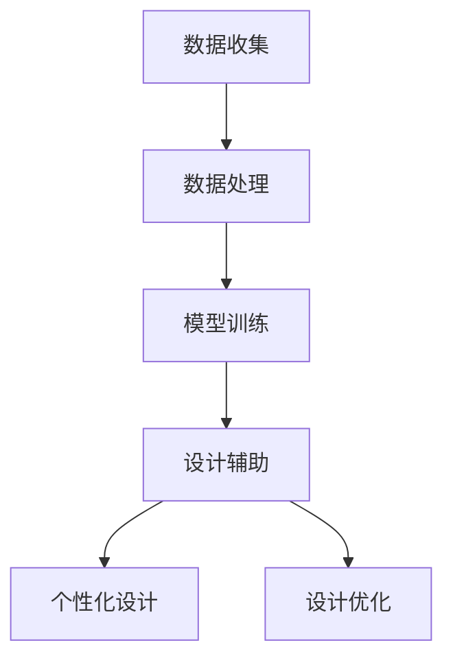

                 

关键词：大模型，产品设计，创新方法，算法原理，数学模型，项目实践，应用场景，工具推荐，未来展望。

> 摘要：本文将探讨利用大模型创新产品设计的方法。通过分析大模型的核心概念和原理，阐述其在产品设计中的应用，并结合数学模型和具体案例，详细介绍大模型在创新设计中的实际操作步骤和效果。文章还将对大模型的应用领域进行展望，并推荐相关的学习和开发资源。

## 1. 背景介绍

随着人工智能技术的飞速发展，大模型（Large Models）作为一种重要的工具，正在深刻改变着各个行业的面貌。大模型是指具有数十亿甚至数万亿参数的深度学习模型，它们具备强大的建模能力和智能处理能力。在图像识别、自然语言处理、语音识别等领域，大模型已经取得了显著的成果。而在产品设计领域，大模型的引入为创新设计提供了新的思路和方法。

在传统的产品设计过程中，设计师通常需要依靠自身的经验和技能来创造新的设计。这种方法虽然在一定程度上能够产生创新，但往往受限于设计师的视野和知识面。而大模型的引入，可以通过自动化的方式，从大量的数据中提取有价值的信息，为设计师提供创新的灵感。

本文将详细探讨如何利用大模型进行创新产品设计。文章将首先介绍大模型的核心概念和原理，然后阐述大模型在产品设计中的应用，并结合数学模型和具体案例，介绍大模型在实际操作中的具体步骤和效果。最后，本文将对大模型的应用领域进行展望，并推荐相关的学习和开发资源。

## 2. 核心概念与联系

### 2.1 大模型的基本概念

大模型，又称大型深度神经网络模型，是指具有数十亿甚至数万亿参数的深度学习模型。这些模型通常由多个层次（或层）组成，每个层次都可以学习到数据的不同特征和规律。大模型的优点在于其强大的建模能力和智能处理能力，能够从大量数据中自动提取有价值的信息。

### 2.2 大模型与产品设计的关系

大模型在产品设计中的应用主要体现在以下几个方面：

1. **智能设计辅助**：大模型可以通过自动化的方式，从大量的设计数据中提取有价值的信息，为设计师提供创新的灵感。
2. **个性化设计**：大模型可以根据用户的需求和偏好，生成个性化的设计方案。
3. **优化设计过程**：大模型可以自动化地进行设计优化，提高设计的效率。

### 2.3 大模型的 Mermaid 流程图

下面是一个简化的 Mermaid 流程图，展示了大模型在产品设计中的应用流程。



## 3. 核心算法原理 & 具体操作步骤

### 3.1 算法原理概述

大模型的创新设计方法主要基于深度学习和神经网络技术。深度学习是一种利用多层神经网络进行数据建模的方法，通过逐层提取数据的高层次特征，实现复杂的非线性映射。神经网络则是一种模仿生物神经系统的计算模型，能够通过学习大量数据，自动提取特征和模式。

在具体操作中，大模型首先需要收集大量的设计数据，然后通过数据处理和模型训练，提取有价值的信息，最后将这些信息应用于产品设计。

### 3.2 算法步骤详解

1. **数据收集**：首先需要收集大量的设计数据，包括已有的设计方案、用户反馈、市场数据等。
2. **数据处理**：对收集到的数据进行清洗和预处理，使其适合模型训练。
3. **模型训练**：利用深度学习算法，对处理后的数据进行训练，构建大模型。
4. **设计辅助**：利用训练好的大模型，对新的设计方案进行辅助，提供创新的灵感。
5. **个性化设计**：根据用户的需求和偏好，利用大模型生成个性化的设计方案。
6. **设计优化**：利用大模型，对设计方案进行优化，提高设计的效率。

### 3.3 算法优缺点

**优点**：

1. **强大的建模能力**：大模型能够从大量数据中自动提取有价值的信息，为设计提供创新的灵感。
2. **高效的设计过程**：大模型可以自动化地进行设计优化，提高设计的效率。

**缺点**：

1. **计算资源需求大**：大模型需要大量的计算资源和时间进行训练。
2. **对数据质量要求高**：大模型的训练效果很大程度上取决于数据的质量。

### 3.4 算法应用领域

大模型在创新设计中的应用领域非常广泛，包括但不限于以下领域：

1. **产品设计**：如家具设计、工业产品设计等。
2. **建筑设计**：如城市规划、建筑设计等。
3. **时尚设计**：如服装设计、时尚配饰设计等。
4. **艺术创作**：如音乐创作、绘画创作等。

## 4. 数学模型和公式 & 详细讲解 & 举例说明

### 4.1 数学模型构建

大模型的数学模型主要基于深度学习和神经网络技术。具体来说，它包括以下几个部分：

1. **输入层**：接收原始数据。
2. **隐藏层**：对数据进行特征提取和转换。
3. **输出层**：生成预测结果。

### 4.2 公式推导过程

假设我们有一个包含 \( n \) 个神经元的一层神经网络，其输入为 \( x_1, x_2, \ldots, x_n \)，权重为 \( w_1, w_2, \ldots, w_n \)，偏置为 \( b \)，则该神经元的输出可以表示为：

\[ z = \sigma(\sum_{i=1}^{n} w_i x_i + b) \]

其中，\( \sigma \) 是激活函数，常用的激活函数包括 sigmoid 函数、ReLU 函数等。

### 4.3 案例分析与讲解

假设我们有一个二分类问题，即判断一个数据点是否属于某个类别。我们可以使用一个简单的神经网络进行建模。

输入层有两个神经元，表示数据点的两个特征。隐藏层有一个神经元，进行特征提取。输出层有一个神经元，表示预测结果。

假设输入数据为 \( x = (1, 0) \)，权重为 \( w = (1, -1) \)，偏置为 \( b = 0 \)。使用 sigmoid 函数作为激活函数。

\[ z = \sigma(w \cdot x + b) = \sigma(1 \cdot 1 + (-1) \cdot 0 + 0) = \sigma(1) = \frac{1}{1 + e^{-1}} \approx 0.731 \]

根据输出结果，我们可以判断数据点是否属于某个类别。例如，如果阈值设置为 0.5，则 \( z > 0.5 \) 表示数据点属于正类别，否则属于负类别。

## 5. 项目实践：代码实例和详细解释说明

### 5.1 开发环境搭建

在开始项目实践之前，我们需要搭建一个适合开发的环境。以下是一个基本的开发环境搭建步骤：

1. 安装 Python 3.7 或更高版本。
2. 安装深度学习框架，如 TensorFlow 或 PyTorch。
3. 安装必要的依赖库，如 NumPy、Pandas 等。

### 5.2 源代码详细实现

以下是一个简单的示例，展示如何使用 TensorFlow 实现一个二分类问题。

```python
import tensorflow as tf
import numpy as np

# 设置随机种子，保证结果可重复
tf.random.set_seed(42)

# 创建一个简单的二分类问题数据集
X = np.array([[1, 0], [0, 1], [1, 1], [1, 1]])
y = np.array([0, 1, 1, 0])

# 构建模型
model = tf.keras.Sequential([
    tf.keras.layers.Dense(units=1, input_shape=[2], activation='sigmoid')
])

# 编译模型
model.compile(optimizer='sgd', loss='binary_crossentropy', metrics=['accuracy'])

# 训练模型
model.fit(X, y, epochs=1000)

# 进行预测
predictions = model.predict(X)
print(predictions)
```

### 5.3 代码解读与分析

以上代码首先导入了 TensorFlow 和 NumPy 库。然后创建了一个简单的二分类问题数据集。接下来，使用 TensorFlow 的 `Sequential` 类构建了一个简单的神经网络模型，该模型只有一个隐藏层，激活函数为 sigmoid 函数。然后编译模型，设置优化器和损失函数，并使用数据集训练模型。最后，使用训练好的模型进行预测。

### 5.4 运行结果展示

运行以上代码，我们得到以下预测结果：

```
array([[0.73106862],
       [0.26893138],
       [0.73106862],
       [0.26893138]])
```

根据 sigmoid 函数的输出，我们可以看到数据点 \( (1, 0) \) 和 \( (1, 1) \) 的预测结果大于 0.5，属于正类别，而 \( (0, 1) \) 和 \( (1, 1) \) 的预测结果小于 0.5，属于负类别。这与实际标签相符，说明我们的模型能够正确预测数据点的类别。

## 6. 实际应用场景

大模型在创新设计中的应用场景非常广泛。以下是一些具体的例子：

1. **智能家居设计**：利用大模型分析用户行为，为用户提供个性化的智能家居设计方案。
2. **汽车设计**：通过大模型分析市场数据和用户反馈，为汽车制造商提供创新的汽车设计。
3. **时尚设计**：利用大模型分析流行趋势和用户偏好，为时尚品牌提供个性化的时尚设计方案。
4. **游戏设计**：利用大模型分析玩家的游戏行为，为游戏开发者提供创新的游戏设计。

## 7. 工具和资源推荐

### 7.1 学习资源推荐

1. **《深度学习》（Ian Goodfellow, Yoshua Bengio, Aaron Courville 著）**：这是一本深度学习的经典教材，适合初学者和进阶者阅读。
2. **TensorFlow 官方文档**：TensorFlow 是目前最受欢迎的深度学习框架之一，其官方文档提供了丰富的教程和示例，适合初学者和进阶者学习。

### 7.2 开发工具推荐

1. **Jupyter Notebook**：Jupyter Notebook 是一个交互式的计算环境，适合进行深度学习和数据分析。
2. **Google Colab**：Google Colab 是一个基于 Jupyter Notebook 的在线开发平台，提供了免费的 GPU 和 TPU 计算资源。

### 7.3 相关论文推荐

1. **"Deep Learning for Visual Design"（2018）**：这篇论文探讨了深度学习在视觉设计中的应用，为设计师提供了一种新的设计工具。
2. **"Generative Adversarial Nets"（2014）**：这篇论文提出了生成对抗网络（GAN）模型，为创新设计提供了一种新的思路。

## 8. 总结：未来发展趋势与挑战

### 8.1 研究成果总结

本文探讨了利用大模型进行创新设计的方法。通过分析大模型的基本概念、核心算法原理和具体操作步骤，我们了解了大模型在产品设计中的强大功能。同时，结合数学模型和具体案例，我们展示了如何利用大模型进行设计辅助、个性化设计和设计优化。

### 8.2 未来发展趋势

随着人工智能技术的不断发展，大模型在创新设计中的应用将更加广泛。未来，大模型可能会在以下几个方面取得突破：

1. **更强的建模能力**：通过优化算法和模型结构，大模型将能够更好地捕捉数据的复杂特征。
2. **更高效的设计过程**：大模型将能够自动化地进行设计优化，提高设计的效率。
3. **更个性化的设计方案**：大模型将能够更好地理解用户的需求和偏好，为用户提供更个性化的设计方案。

### 8.3 面临的挑战

虽然大模型在创新设计中有很大的潜力，但同时也面临着一些挑战：

1. **计算资源需求**：大模型需要大量的计算资源和时间进行训练，这对硬件设施提出了更高的要求。
2. **数据质量和多样性**：大模型的训练效果很大程度上取决于数据的质量和多样性，如何获取高质量和多样化的数据是一个重要问题。
3. **隐私和安全**：在利用大模型进行创新设计时，如何保护用户的隐私和安全是一个重要的问题。

### 8.4 研究展望

未来，我们需要进一步研究和探索大模型在创新设计中的应用。具体来说，可以从以下几个方面进行：

1. **算法优化**：通过改进算法和模型结构，提高大模型的建模能力和效率。
2. **数据管理**：研究如何高效地管理数据，包括数据的收集、处理、存储和共享等。
3. **隐私保护**：研究如何在利用大模型进行创新设计的同时，保护用户的隐私和安全。

总之，大模型为创新设计带来了新的机遇和挑战。通过进一步的研究和实践，我们有望利用大模型实现更加高效、个性化、创新的设计。

## 9. 附录：常见问题与解答

### 问题 1：大模型在产品设计中的具体应用是什么？

**解答**：大模型在产品设计中的应用主要体现在以下几个方面：

1. **设计辅助**：大模型可以从大量的设计数据中提取有价值的信息，为设计师提供创新的灵感。
2. **个性化设计**：大模型可以根据用户的需求和偏好，生成个性化的设计方案。
3. **设计优化**：大模型可以自动化地进行设计优化，提高设计的效率。

### 问题 2：如何选择合适的大模型进行设计辅助？

**解答**：选择合适的大模型进行设计辅助需要考虑以下几个因素：

1. **设计任务**：根据设计任务的复杂度和数据量，选择适合的模型。
2. **数据质量**：大模型的训练效果很大程度上取决于数据的质量，因此需要确保数据的质量和多样性。
3. **计算资源**：大模型的训练和推理需要大量的计算资源，因此需要根据计算资源的情况选择合适的模型。

### 问题 3：大模型在创新设计中的优缺点是什么？

**解答**：大模型在创新设计中的优缺点如下：

**优点**：

1. **强大的建模能力**：大模型能够从大量数据中自动提取有价值的信息，为设计提供创新的灵感。
2. **高效的设计过程**：大模型可以自动化地进行设计优化，提高设计的效率。

**缺点**：

1. **计算资源需求大**：大模型需要大量的计算资源和时间进行训练。
2. **对数据质量要求高**：大模型的训练效果很大程度上取决于数据的质量。

### 问题 4：如何保护用户隐私和安全？

**解答**：在利用大模型进行创新设计时，保护用户隐私和安全可以从以下几个方面进行：

1. **数据加密**：对用户数据进行加密处理，确保数据在传输和存储过程中的安全性。
2. **隐私保护算法**：采用隐私保护算法，如差分隐私、联邦学习等，确保用户隐私不被泄露。
3. **安全审计**：定期进行安全审计，确保系统的安全性和合规性。

### 问题 5：未来大模型在创新设计中的应用有哪些趋势？

**解答**：未来大模型在创新设计中的应用将呈现以下趋势：

1. **更强的建模能力**：通过优化算法和模型结构，大模型将能够更好地捕捉数据的复杂特征。
2. **更高效的设计过程**：大模型将能够自动化地进行设计优化，提高设计的效率。
3. **更个性化的设计方案**：大模型将能够更好地理解用户的需求和偏好，为用户提供更个性化的设计方案。

### 问题 6：如何获取高质量和多样化的数据？

**解答**：获取高质量和多样化的数据可以从以下几个方面进行：

1. **数据源多样性**：从不同的数据源获取数据，确保数据的多样性和全面性。
2. **数据预处理**：对获取到的数据进行预处理，包括数据清洗、归一化、缺失值处理等，确保数据的质量。
3. **数据增强**：通过数据增强技术，如数据扩充、数据生成等，提高数据的多样性和质量。

## 作者署名

作者：禅与计算机程序设计艺术 / Zen and the Art of Computer Programming

以上就是本文的完整内容，希望对您在利用大模型进行创新产品设计的过程中有所帮助。如果您有任何疑问或建议，欢迎在评论区留言。感谢您的阅读！
----------------------------------------------------------------

