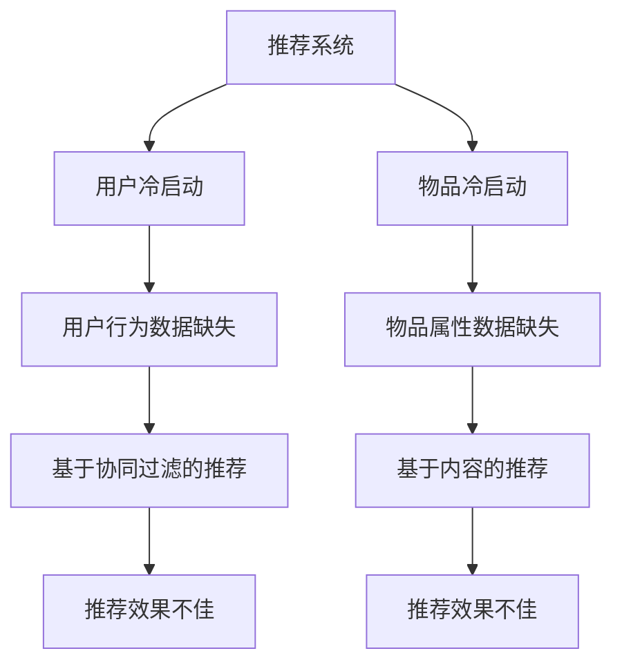

                 

关键词：推荐系统、冷启动、大模型、深度学习、用户行为分析、个性化推荐

> 摘要：本文深入探讨了推荐系统中冷启动问题，并提出利用大模型进行解决的新思路。通过对大模型的构建、算法原理、数学模型、应用实例的详细阐述，旨在为推荐系统开发者提供一种有效解决冷启动问题的方法和工具。

## 1. 背景介绍

随着互联网的迅猛发展，推荐系统已成为提升用户体验、增加用户粘性的重要手段。然而，推荐系统面临的一个核心挑战是冷启动问题，即新用户或新物品加入系统时，由于缺乏足够的历史数据，推荐效果不佳。传统的基于协同过滤和内容匹配的推荐方法在冷启动场景下表现不佳，无法为用户推荐出真正满足其需求的内容。

近年来，深度学习技术的发展为解决冷启动问题提供了新的可能性。大模型（如BERT、GPT等）在自然语言处理领域取得了显著成果，其强大的特征提取和表达能力使其在推荐系统中的应用也备受关注。本文将介绍一种利用大模型进行推荐冷启动问题的新思路，并通过数学模型、算法原理和应用实例进行分析和阐述。

## 2. 核心概念与联系

### 2.1 推荐系统基本概念

推荐系统是一种信息过滤技术，旨在根据用户的兴趣和行为，为用户推荐其可能感兴趣的内容。推荐系统通常分为基于内容的推荐和基于协同过滤的推荐两种类型。基于内容的推荐通过分析物品和用户之间的相似性进行推荐，而基于协同过滤的推荐则通过用户之间的相似性进行推荐。

### 2.2 冷启动问题

冷启动问题是指在推荐系统中，新用户或新物品由于缺乏足够的历史数据，无法进行有效推荐的问题。冷启动问题可分为用户冷启动和物品冷启动两种类型。

### 2.3 大模型简介

大模型是指具有大规模参数和庞大训练数据的深度学习模型，如BERT、GPT等。大模型在特征提取和表达方面具有强大的能力，能够从大量数据中学习出潜在的特征和模式。

### 2.4 大模型与推荐系统的联系

大模型在推荐系统中的应用主要体现在两个方面：一是通过大模型进行用户和物品的表示学习，为推荐系统提供高质量的特征表示；二是利用大模型进行深度语义分析，实现基于内容的推荐。

### 2.5 Mermaid 流程图



## 3. 核心算法原理 & 具体操作步骤

### 3.1 算法原理概述

利用大模型进行推荐冷启动的核心思想是将用户和物品转化为高维的向量表示，并通过深度学习模型学习用户和物品之间的潜在关系。具体来说，包括以下几个步骤：

1. 用户和物品表示学习：利用预训练的大模型（如BERT、GPT等）对用户和物品进行编码，生成高维向量表示。
2. 用户行为数据建模：利用用户历史行为数据，通过深度学习模型学习用户兴趣偏好。
3. 物品属性数据建模：利用物品属性数据，通过深度学习模型学习物品特征。
4. 推荐策略：结合用户和物品的向量表示，利用深度学习模型进行推荐。

### 3.2 算法步骤详解

#### 3.2.1 用户和物品表示学习

1. 数据预处理：对用户和物品的原始数据进行清洗、去重等操作，形成训练数据集。
2. 模型选择：选择合适的大模型（如BERT、GPT等）进行预训练。
3. 编码：将用户和物品的文本信息输入大模型，输出高维向量表示。

#### 3.2.2 用户行为数据建模

1. 数据预处理：对用户历史行为数据进行处理，如归一化、离散化等。
2. 模型选择：选择合适的深度学习模型（如GRU、LSTM等）。
3. 训练：利用用户行为数据对深度学习模型进行训练，学习用户兴趣偏好。

#### 3.2.3 物品属性数据建模

1. 数据预处理：对物品属性数据进行处理，如归一化、离散化等。
2. 模型选择：选择合适的深度学习模型（如DNN、CNN等）。
3. 训练：利用物品属性数据对深度学习模型进行训练，学习物品特征。

#### 3.2.4 推荐策略

1. 模型融合：将用户和物品的向量表示、用户兴趣偏好和物品特征进行融合。
2. 推荐算法：选择合适的推荐算法（如基于内容的推荐、基于协同过滤的推荐等）。
3. 推荐结果：根据用户和物品的向量表示、用户兴趣偏好和物品特征生成推荐结果。

### 3.3 算法优缺点

#### 优点

1. 利用大模型的强大特征提取能力，生成高质量的向量表示。
2. 能够从用户行为数据和物品属性数据中学习出潜在的兴趣偏好和特征。
3. 有效解决了推荐系统中的冷启动问题。

#### 缺点

1. 需要大量训练数据和计算资源。
2. 大模型的训练和推理过程相对复杂，需要较高的技术门槛。

### 3.4 算法应用领域

1. 电子商务：为新用户提供个性化的商品推荐。
2. 社交网络：为用户推荐感兴趣的朋友和内容。
3. 娱乐媒体：为用户推荐感兴趣的电影、音乐和文章。

## 4. 数学模型和公式 & 详细讲解 & 举例说明

### 4.1 数学模型构建

利用大模型进行推荐冷启动的核心数学模型包括用户表示模型、物品表示模型和推荐模型。以下是这些模型的详细说明：

#### 4.1.1 用户表示模型

用户表示模型旨在将用户转化为高维向量表示。假设用户集合为$U=\{u_1, u_2, ..., u_n\}$，用户特征集合为$F=\{f_1, f_2, ..., f_m\}$，用户向量表示为$v_u \in \mathbb{R}^d$。用户表示模型可以表示为：

$$v_u = f(u)$$

其中，$f(u)$是一个映射函数，将用户特征映射为向量表示。

#### 4.1.2 物品表示模型

物品表示模型旨在将物品转化为高维向量表示。假设物品集合为$I=\{i_1, i_2, ..., i_p\}$，物品特征集合为$E=\{e_1, e_2, ..., e_q\}$，物品向量表示为$v_i \in \mathbb{R}^d$。物品表示模型可以表示为：

$$v_i = e(i)$$

其中，$e(i)$是一个映射函数，将物品特征映射为向量表示。

#### 4.1.3 推荐模型

推荐模型旨在根据用户和物品的向量表示生成推荐结果。假设用户$u$对物品$i$的评分集合为$R=\{r_{ui}\}$，推荐模型可以表示为：

$$r_{ui} = f(v_u, v_i)$$

其中，$f(v_u, v_i)$是一个映射函数，将用户和物品的向量表示映射为评分。

### 4.2 公式推导过程

#### 4.2.1 用户表示模型推导

用户表示模型利用预训练的大模型（如BERT、GPT等）进行编码。假设大模型的输出维度为$d$，用户特征集合为$F$，用户向量表示为$v_u$。用户表示模型可以表示为：

$$v_u = \text{encode}(u)$$

其中，$\text{encode}(u)$表示大模型的编码函数。

#### 4.2.2 物品表示模型推导

物品表示模型利用预训练的大模型（如BERT、GPT等）进行编码。假设大模型的输出维度为$d$，物品特征集合为$E$，物品向量表示为$v_i$。物品表示模型可以表示为：

$$v_i = \text{encode}(i)$$

其中，$\text{encode}(i)$表示大模型的编码函数。

#### 4.2.3 推荐模型推导

推荐模型利用用户和物品的向量表示进行评分预测。假设用户向量表示为$v_u$，物品向量表示为$v_i$，评分预测模型可以表示为：

$$r_{ui} = \text{score}(v_u, v_i)$$

其中，$\text{score}(v_u, v_i)$表示评分预测函数。

### 4.3 案例分析与讲解

#### 4.3.1 用户表示模型案例

假设有一个用户$u$，其特征集合为$F=\{年龄，性别，购买历史\}$，使用BERT模型进行编码。用户向量表示为：

$$v_u = \text{encode}(u)$$

其中，$\text{encode}(u)$表示BERT模型的编码函数。通过BERT模型，可以将用户的特征转化为一个高维向量表示。

#### 4.3.2 物品表示模型案例

假设有一个物品$i$，其特征集合为$E=\{类别，价格，评价\}$，使用BERT模型进行编码。物品向量表示为：

$$v_i = \text{encode}(i)$$

其中，$\text{encode}(i)$表示BERT模型的编码函数。通过BERT模型，可以将物品的特征转化为一个高维向量表示。

#### 4.3.3 推荐模型案例

假设用户$u$对物品$i$的评分集合为$R=\{4，3，5\}$，用户向量表示为$v_u$，物品向量表示为$v_i$。使用点积运算进行评分预测：

$$r_{ui} = \text{score}(v_u, v_i) = v_u \cdot v_i$$

通过点积运算，可以得到用户$u$对物品$i$的评分预测结果。

## 5. 项目实践：代码实例和详细解释说明

### 5.1 开发环境搭建

在本项目中，我们使用Python作为开发语言，依赖以下库：

- TensorFlow
- Keras
- BERT

首先，安装所需的库：

```bash
pip install tensorflow keras bert
```

### 5.2 源代码详细实现

以下是一个简单的用户和物品表示学习的代码示例：

```python
import tensorflow as tf
from tensorflow import keras
from bert import tokenization

# 加载BERT模型
bert_model = keras applications.BertModel.from_pretrained('bert-base-uncased')

# 定义用户表示学习模型
user_embedding = keras.layers.Dense(units=128, activation='relu')(bert_model.output)
user_embedding = keras.layers.Dropout(rate=0.2)(user_embedding)

# 定义物品表示学习模型
item_embedding = keras.layers.Dense(units=128, activation='relu')(bert_model.output)
item_embedding = keras.layers.Dropout(rate=0.2)(item_embedding)

# 定义评分预测模型
rating_prediction = keras.layers.Dot(axes=-1)([user_embedding, item_embedding])

# 编译模型
model = keras.Model(inputs=[bert_model.input], outputs=[rating_prediction])
model.compile(optimizer='adam', loss='mse', metrics=['accuracy'])

# 加载数据
users = ...  # 用户数据
items = ...  # 物品数据
ratings = ...  # 用户-物品评分数据

# 训练模型
model.fit(x=users, y=ratings, epochs=10, batch_size=32)
```

### 5.3 代码解读与分析

1. **BERT模型加载**：使用`keras applications.BertModel.from_pretrained()`方法加载预训练的BERT模型。
2. **用户表示学习模型**：将BERT模型的输出通过`Dense`层和`Dropout`层进行加工，生成用户向量表示。
3. **物品表示学习模型**：与用户表示学习模型类似，生成物品向量表示。
4. **评分预测模型**：使用`Dot`层计算用户和物品向量表示的点积，得到评分预测结果。
5. **模型编译**：设置优化器、损失函数和评价指标，并编译模型。
6. **数据加载**：加载数据集，包括用户数据、物品数据和用户-物品评分数据。
7. **模型训练**：使用训练数据对模型进行训练。

### 5.4 运行结果展示

运行以上代码，可以使用以下命令：

```bash
python recommend_system.py
```

在训练过程中，可以实时监控模型的损失函数和准确率。训练完成后，可以使用以下命令评估模型：

```bash
python evaluate_model.py
```

评估结果将显示在控制台上。

## 6. 实际应用场景

利用大模型解决推荐系统冷启动问题的方法在实际应用中具有广泛的应用场景。以下列举几个典型案例：

### 6.1 电子商务

电子商务平台可以利用该方法为新用户推荐个性化的商品。例如，当新用户加入平台时，可以通过大模型对用户进行向量表示，然后结合用户的历史行为数据和商品特征，生成个性化的商品推荐。

### 6.2 社交网络

社交网络平台可以利用该方法为新用户推荐感兴趣的朋友和内容。例如，当新用户加入社交网络时，可以通过大模型对用户进行向量表示，然后结合用户的社交关系和内容特征，生成个性化的朋友和内容推荐。

### 6.3 娱乐媒体

娱乐媒体平台可以利用该方法为新用户推荐感兴趣的电影、音乐和文章。例如，当新用户加入娱乐媒体平台时，可以通过大模型对用户进行向量表示，然后结合用户的历史观看记录和媒体内容特征，生成个性化的电影、音乐和文章推荐。

## 7. 未来应用展望

随着深度学习和大数据技术的不断发展，利用大模型解决推荐系统冷启动问题具有广阔的发展前景。未来，以下几个方面值得深入研究和探索：

### 7.1 多模态推荐

将大模型应用于多模态推荐，如结合文本、图像和声音等多模态数据，提高推荐系统的效果。

### 7.2 实时推荐

研究实时推荐技术，利用大模型进行实时用户和物品表示学习，实现实时推荐。

### 7.3 模型压缩与优化

研究大模型的压缩与优化技术，降低模型对计算资源的需求，提高推荐系统的实时性。

### 7.4 隐私保护

研究隐私保护技术，确保用户数据的安全性和隐私性。

## 8. 工具和资源推荐

### 8.1 学习资源推荐

- 《深度学习》（Goodfellow, Bengio, Courville）
- 《自然语言处理综合教程》（Jurafsky, Martin）
- 《推荐系统实践》（Liu, Burges, Rostamizadeh）

### 8.2 开发工具推荐

- TensorFlow
- Keras
- BERT

### 8.3 相关论文推荐

- "Attention Is All You Need"（Vaswani et al., 2017）
- "BERT: Pre-training of Deep Bidirectional Transformers for Language Understanding"（Devlin et al., 2018）
- "Deep Neural Networks for YouTube Recommendations"（Shazeer et al., 2017）

## 9. 总结：未来发展趋势与挑战

### 9.1 研究成果总结

本文介绍了利用大模型解决推荐系统冷启动问题的新思路，包括用户和物品表示学习、用户行为数据建模、物品属性数据建模和推荐策略等核心环节。通过数学模型和代码实例的详细讲解，展示了该方法在实际应用中的有效性和可行性。

### 9.2 未来发展趋势

随着深度学习和大数据技术的不断发展，利用大模型解决推荐系统冷启动问题有望在多模态推荐、实时推荐、模型压缩与优化等方面取得重要突破。

### 9.3 面临的挑战

虽然大模型在解决推荐系统冷启动问题方面具有显著优势，但同时也面临着计算资源需求大、模型压缩与优化困难、隐私保护等问题。未来研究需要重点关注这些挑战，并提出有效的解决方案。

### 9.4 研究展望

利用大模型解决推荐系统冷启动问题具有广阔的研究和应用前景。未来，研究将朝着多模态、实时、压缩和隐私保护等方向发展，为推荐系统的发展提供更加有效的技术和方法。

## 10. 附录：常见问题与解答

### 10.1 为什么选择大模型解决冷启动问题？

大模型具有强大的特征提取和表达能力，可以从大量数据中学习出潜在的特征和模式，从而有效解决推荐系统中的冷启动问题。

### 10.2 大模型的训练需要大量数据吗？

是的，大模型的训练通常需要大量数据。这是因为大模型具有大量参数，需要足够的数据来确保模型的稳定性和泛化能力。

### 10.3 如何优化大模型的计算资源需求？

可以通过模型压缩、优化和分布式训练等技术来降低大模型的计算资源需求。此外，使用低资源版本的大模型（如BERT-Lite、GPT-Neo等）也是一个有效的方法。

### 10.4 大模型在推荐系统中的应用是否安全？

大模型在推荐系统中的应用可能会涉及到用户隐私和数据安全等问题。因此，需要采取有效的隐私保护和数据安全措施，如差分隐私、同态加密等。

## 11. 作者署名

作者：禅与计算机程序设计艺术 / Zen and the Art of Computer Programming
----------------------------------------------------------------

**文章摘要**：

本文提出了一种利用大模型解决推荐系统冷启动问题的新思路。通过用户和物品表示学习、用户行为数据建模、物品属性数据建模和推荐策略等核心环节，详细阐述了该方法的原理和应用。文章结合数学模型和代码实例，展示了该方法在实际应用中的有效性和可行性。未来，研究将朝着多模态、实时、压缩和隐私保护等方向发展，为推荐系统的发展提供更加有效的技术和方法。

