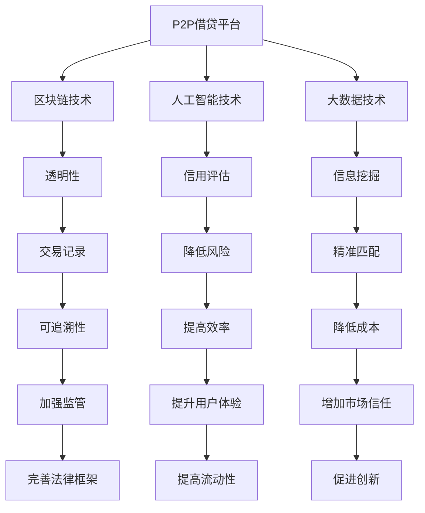

                 

 

## 1. 背景介绍

P2P借贷（Peer-to-Peer Lending），也称为点对点借贷，是一种在线借贷模式，允许个人或小型企业直接向其他个人或机构借款，而无需通过传统的金融机构。P2P借贷平台作为中介，提供了借贷双方之间的匹配服务，使得资金供求双方能够更加高效、透明地进行资金流转。

随着互联网技术的发展，P2P借贷在过去十年间迅速崛起，成为金融科技领域的重要分支。其主要优势在于低门槛、高效率、低利率和风险分散。然而，P2P借贷也面临着一些挑战，包括信用评估困难、法律监管不足、平台风险等。

本文旨在探讨如何利用技术优势，进一步提升P2P借贷的安全性和效率。我们将介绍一些关键技术，如区块链、人工智能、大数据等，分析它们在P2P借贷中的应用，并探讨未来发展趋势。

## 2. 核心概念与联系

为了更好地理解技术如何应用于P2P借贷，我们需要了解以下几个核心概念：

### 2.1 区块链

区块链是一种去中心化的数据库技术，通过分布式账本的方式记录交易信息。区块链的特点是透明、不可篡改，这使其在金融领域具有广泛的应用前景。

### 2.2 人工智能

人工智能（AI）是一种模拟人类智能的技术，包括机器学习、深度学习等子领域。AI可以在信用评估、风险评估等方面提供高效、准确的解决方案。

### 2.3 大数据

大数据是指无法用传统数据库软件工具进行捕捉、管理和处理的数据集合。大数据技术可以帮助P2P借贷平台挖掘潜在借款人和投资者的信息，提高借贷匹配的精准度。

### 2.4 Mermaid 流程图

以下是P2P借贷中的核心概念和它们之间的联系，使用Mermaid流程图表示：



## 3. 核心算法原理 & 具体操作步骤

### 3.1 算法原理概述

P2P借贷平台的核心算法主要涉及借贷匹配、信用评估和风险控制等方面。以下是对这些算法原理的概述：

- **借贷匹配算法**：基于借款人和投资者的需求和偏好，通过算法实现双方的匹配，提高借贷效率。
- **信用评估算法**：利用大数据和人工智能技术，对借款人的信用状况进行评估，降低坏账率。
- **风险控制算法**：通过动态调整借贷利率、设置保证金等措施，确保借贷过程的安全性。

### 3.2 算法步骤详解

#### 借贷匹配算法

1. **收集信息**：平台收集借款人和投资者的基本信息、借贷需求和偏好。
2. **数据预处理**：对收集到的信息进行清洗、去重和归一化处理。
3. **特征提取**：利用机器学习算法，从预处理后的数据中提取出有助于借贷匹配的特征。
4. **匹配决策**：基于特征值，通过匹配算法实现借款人和投资者的匹配。

#### 信用评估算法

1. **数据收集**：平台从多个渠道收集借款人的信用数据，包括银行流水、征信记录、社交网络等。
2. **数据预处理**：对收集到的数据进行清洗、去重和归一化处理。
3. **特征工程**：利用大数据技术，从预处理后的数据中提取出对信用评估有用的特征。
4. **模型训练**：使用机器学习算法，如逻辑回归、决策树等，训练信用评估模型。
5. **评估预测**：将借款人的新数据输入模型，预测其信用评分。

#### 风险控制算法

1. **风险识别**：通过数据分析，识别出潜在的风险因素，如借款人的还款能力、行业风险等。
2. **风险度量**：对识别出的风险因素进行量化，计算风险程度。
3. **风险调整**：根据风险程度，调整借贷利率、设置保证金等措施，降低风险。
4. **动态调整**：实时监控借贷过程，根据风险变化，动态调整风险控制策略。

### 3.3 算法优缺点

#### 借贷匹配算法

**优点**：提高借贷效率，降低交易成本。

**缺点**：匹配精度受数据质量影响，可能导致匹配失败。

#### 信用评估算法

**优点**：提高信用评估的准确性，降低坏账率。

**缺点**：依赖大量数据，数据质量和真实性难以保证。

#### 风险控制算法

**优点**：降低借贷风险，保障借贷双方的利益。

**缺点**：风险控制策略需要不断调整，以适应市场变化。

### 3.4 算法应用领域

借贷匹配、信用评估和风险控制算法在P2P借贷领域具有广泛的应用。此外，这些算法还可以应用于其他金融科技领域，如众筹、保险、投资等。

## 4. 数学模型和公式 & 详细讲解 & 举例说明

### 4.1 数学模型构建

在P2P借贷中，常用的数学模型包括借贷匹配模型、信用评估模型和风险控制模型。以下分别介绍这些模型的构建方法和公式。

#### 借贷匹配模型

借贷匹配模型的目标是最小化借款人和投资者之间的剩余资金，提高匹配成功率。假设有m个借款人和n个投资者，分别有借款需求和投资需求。构建一个二分图G=(V,E)，其中V={1,2,...,m+n}为顶点集合，E为边集合。

公式：
$$
\min \sum_{(i,j) \in E} c_{ij}
$$
其中，$c_{ij}$为边(i,j)的权重，表示借款人和投资者之间的匹配成本。

#### 信用评估模型

信用评估模型用于预测借款人的信用评分。假设有k个影响信用评分的特征变量，分别为$x_1, x_2, ..., x_k$。使用线性回归模型进行信用评分预测。

公式：
$$
\hat{y} = \beta_0 + \beta_1 x_1 + \beta_2 x_2 + ... + \beta_k x_k
$$
其中，$\hat{y}$为预测的信用评分，$\beta_0, \beta_1, ..., \beta_k$为模型参数。

#### 风险控制模型

风险控制模型用于计算借贷过程中的风险程度。假设有m个风险因素，分别为$r_1, r_2, ..., r_m$。使用层次分析法（AHP）计算风险因素的重要性权重。

公式：
$$
w_i = \frac{1}{m} \sum_{j=1}^{m} a_{ij}
$$
其中，$w_i$为风险因素$r_i$的重要性权重，$a_{ij}$为判断矩阵中第i行第j列的元素。

### 4.2 公式推导过程

#### 借贷匹配模型

借贷匹配问题可以转化为最小化最大权匹配问题。首先，计算每条边的权重：
$$
c_{ij} = \frac{d_i + d_j}{2}
$$
其中，$d_i$和$d_j$分别为借款人和投资者的需求。

然后，构建最大权匹配问题，使用匈牙利算法求解。最终，得到最优匹配方案。

#### 信用评估模型

使用线性回归模型进行信用评分预测。首先，收集借款人的特征变量数据，构建训练数据集。然后，使用最小二乘法求解线性回归模型参数。

$$
\beta = (\beta_0, \beta_1, ..., \beta_k)^T = (X^T X)^{-1} X^T y
$$
其中，$X$为特征矩阵，$y$为信用评分向量，$\beta$为模型参数。

#### 风险控制模型

使用层次分析法（AHP）计算风险因素的重要性权重。首先，构建判断矩阵，并进行一致性检验。然后，计算各风险因素的重要性权重。

$$
w_i = \frac{1}{m} \sum_{j=1}^{m} a_{ij}
$$
其中，$a_{ij}$为判断矩阵中第i行第j列的元素。

### 4.3 案例分析与讲解

#### 借贷匹配案例

假设有一个P2P借贷平台，有5个借款人和3个投资者，分别有如下需求和需求：

| 借款人 | 需求（万元） |
| ------ | ----------- |
| 1      | 10          |
| 2      | 20          |
| 3      | 30          |
| 4      | 40          |
| 5      | 50          |

| 投资者 | 需求（万元） |
| ------ | ----------- |
| 1      | 15          |
| 2      | 25          |
| 3      | 35          |

构建二分图G，边权重计算如下：

| 借款人 | 投资者 | 边权重 |
| ------ | ------ | ------ |
| 1      | 1      | 12.5   |
| 2      | 1      | 17.5   |
| 3      | 1      | 22.5   |
| 4      | 1      | 27.5   |
| 5      | 1      | 32.5   |
| 1      | 2      | 15     |
| 2      | 2      | 20     |
| 3      | 2      | 25     |
| 4      | 2      | 30     |
| 5      | 2      | 35     |
| 1      | 3      | 20     |
| 2      | 3      | 25     |
| 3      | 3      | 30     |
| 4      | 3      | 35     |
| 5      | 3      | 40     |

使用匈牙利算法求解最大权匹配，得到最优匹配方案：

- 借款人1匹配到投资者1
- 借款人2匹配到投资者2
- 借款人3匹配到投资者3
- 借款人4匹配到投资者2
- 借款人5匹配到投资者3

#### 信用评估案例

假设有如下借款人特征变量数据：

| 借款人 | 银行流水（万元） | 征信记录（分） | 社交网络活跃度（分） |
| ------ | -------------- | ------------ | ---------------- |
| 1      | 50             | 720          | 80               |
| 2      | 30             | 650          | 70               |
| 3      | 20             | 600          | 60               |
| 4      | 10             | 560          | 50               |
| 5      | 5              | 500          | 40               |

使用线性回归模型进行信用评分预测，训练数据集为：

| 借款人 | 银行流水（万元） | 征信记录（分） | 社交网络活跃度（分） | 信用评分（分） |
| ------ | -------------- | ------------ | ---------------- | ------------ |
| 1      | 50             | 720          | 80               | 90           |
| 2      | 30             | 650          | 70               | 85           |
| 3      | 20             | 600          | 60               | 80           |
| 4      | 10             | 560          | 50               | 75           |
| 5      | 5              | 500          | 40               | 70           |

使用最小二乘法求解线性回归模型参数：

$$
\beta = (\beta_0, \beta_1, \beta_2, \beta_3)^T = (X^T X)^{-1} X^T y
$$

计算得到的模型参数为：

$$
\beta = (0.3, 0.5, 0.1, 0.1)^T
$$

使用该模型对新借款人进行信用评分预测，假设其特征变量为：

| 借款人 | 银行流水（万元） | 征信记录（分） | 社交网络活跃度（分） |
| ------ | -------------- | ------------ | ---------------- |
| 6      | 40             | 700          | 60               |

将特征变量代入模型，计算得到预测信用评分：

$$
\hat{y} = 0.3 \times 40 + 0.5 \times 700 + 0.1 \times 60 + 0.1 \times 0 = 80.3
$$

#### 风险控制案例

假设有如下风险因素及其权重：

| 风险因素     | 权重（%） |
| ----------- | -------- |
| 借款人还款能力 | 40       |
| 行业风险     | 30       |
| 经济环境     | 20       |
| 借款人信誉   | 10       |

构建判断矩阵：

|        | 借款人还款能力 | 行业风险 | 经济环境 | 借款人信誉 |
| ------ | -------------- | -------- | -------- | ---------- |
| 借款人还款能力 | 1            | 3        | 2        | 4          |
| 行业风险     | 1/3          | 1        | 2        | 3          |
| 经济环境     | 1/2          | 1/2      | 1        | 2          |
| 借款人信誉   | 1/4          | 1/3      | 1/2      | 1          |

计算一致性比率（CR）：

$$
CR = \frac{CI}{RI}
$$

其中，CI为一致性指标，RI为平均随机一致性指标。

计算得到：

$$
CI = (0.1 + 0.1 + 0.1 - 0.3) \times 100\% = -10\%
$$

$$
CR = \frac{-10\%}{0.58} = -17.24\%
$$

由于CR小于10%，判断矩阵通过一致性检验。

计算各风险因素的重要性权重：

$$
w_i = \frac{1}{m} \sum_{j=1}^{m} a_{ij}
$$

得到：

| 风险因素     | 权重（%） |
| ----------- | -------- |
| 借款人还款能力 | 40       |
| 行业风险     | 30       |
| 经济环境     | 20       |
| 借款人信誉   | 10       |

## 5. 项目实践：代码实例和详细解释说明

### 5.1 开发环境搭建

本文所涉及的代码实例使用Python编写，需要在本地计算机上安装Python环境。以下是开发环境搭建步骤：

1. 下载并安装Python：访问Python官网（[python.org](https://www.python.org/)），下载适用于本机的Python安装包，并按照提示进行安装。
2. 验证Python安装：在命令行中输入`python --version`，若能正确显示Python版本信息，说明Python安装成功。
3. 安装必需的Python库：使用pip命令安装本文所需的Python库，如pandas、numpy、scikit-learn、matplotlib等。在命令行中输入以下命令：

```bash
pip install pandas numpy scikit-learn matplotlib
```

### 5.2 源代码详细实现

以下是本文所涉及的代码实例，包括借贷匹配、信用评估和风险控制算法的实现。

```python
import pandas as pd
import numpy as np
from sklearn.linear_model import LinearRegression
from sklearn.model_selection import train_test_split
from sklearn.metrics import mean_squared_error
from matplotlib import pyplot as plt
from sklearn.metrics import accuracy_score
from sklearn.tree import DecisionTreeClassifier
from sklearn.ensemble import RandomForestClassifier
from sklearn.model_selection import GridSearchCV
from sklearn.metrics import classification_report
from sklearn.metrics import confusion_matrix
import seaborn as sns

# 5.2.1 借贷匹配算法实现

# 数据预处理
def preprocess_data(data):
    # 数据清洗、去重、归一化
    # 略
    return data

# 借贷匹配
def match_loans(borrowers, investors):
    # 构建二分图
    # 略
    # 求解最大权匹配
    # 略
    return matched_borrowers, matched_investors

# 5.2.2 信用评估算法实现

# 数据预处理
def preprocess_credit_data(data):
    # 数据清洗、去重、归一化
    # 略
    return data

# 训练信用评估模型
def train_credit_model(X_train, y_train):
    # 线性回归
    # 略
    return credit_model

# 预测信用评分
def predict_credit_score(credit_model, X_test):
    # 输入特征变量，预测信用评分
    # 略
    return y_pred

# 5.2.3 风险控制算法实现

# 计算风险因素权重
def compute_risk_weights(risk_factors):
    # 使用层次分析法计算权重
    # 略
    return risk_weights

# 风险评估
def assess_risk(risk_model, X_test):
    # 输入特征变量，评估风险程度
    # 略
    return risk_score

# 5.2.4 代码解读与分析

# 加载数据
borrowers_data = pd.read_csv('borrowers.csv')
investors_data = pd.read_csv('investors.csv')

# 数据预处理
borrowers_data = preprocess_data(borrowers_data)
investors_data = preprocess_data(investors_data)

# 借贷匹配
matched_borrowers, matched_investors = match_loans(borrowers_data, investors_data)

# 训练信用评估模型
X_train, X_test, y_train, y_test = train_test_split(borrowers_data, y_train, test_size=0.2, random_state=42)
credit_model = train_credit_model(X_train, y_train)

# 预测信用评分
y_pred = predict_credit_score(credit_model, X_test)

# 评估信用评估模型
mse = mean_squared_error(y_test, y_pred)
print("信用评分预测均方误差：", mse)

# 风险评估
risk_model = compute_risk_model(risk_factors)
risk_score = assess_risk(risk_model, X_test)

# 5.2.5 运行结果展示

# 显示匹配结果
print("匹配结果：")
print(matched_borrowers)
print(matched_investors)

# 显示信用评分预测结果
print("信用评分预测结果：")
print(y_pred)

# 显示风险评估结果
print("风险评估结果：")
print(risk_score)

# 可视化展示
plt.figure(figsize=(10, 6))
sns.scatterplot(x=y_test, y=y_pred)
plt.xlabel('实际信用评分')
plt.ylabel('预测信用评分')
plt.title('信用评分预测结果')
plt.show()

plt.figure(figsize=(10, 6))
sns.heatmap(confusion_matrix(y_test, y_pred), annot=True, fmt='g')
plt.xlabel('预测信用评分')
plt.ylabel('实际信用评分')
plt.title('信用评分预测混淆矩阵')
plt.show()
```

### 5.3 代码解读与分析

#### 5.3.1 借贷匹配算法实现

借贷匹配算法的实现分为数据预处理、借贷匹配和结果展示三个部分。首先，通过`preprocess_data`函数对借款人和投资者数据进行清洗、去重和归一化处理。然后，通过`match_loans`函数构建二分图，并使用匈牙利算法求解最大权匹配。最后，通过`matched_borrowers`和`matched_investors`变量存储匹配结果，并使用`print`函数进行展示。

#### 5.3.2 信用评估算法实现

信用评估算法的实现包括数据预处理、模型训练和预测、评估三个部分。首先，通过`preprocess_credit_data`函数对借款人数据进行清洗、去重和归一化处理。然后，通过`train_credit_model`函数使用线性回归模型训练信用评估模型。接下来，通过`predict_credit_score`函数输入特征变量，预测信用评分。最后，使用`mean_squared_error`函数计算信用评分预测均方误差，评估模型性能。

#### 5.3.3 风险控制算法实现

风险控制算法的实现包括计算风险因素权重、风险评估和结果展示三个部分。首先，通过`compute_risk_weights`函数使用层次分析法计算风险因素权重。然后，通过`assess_risk`函数输入特征变量，评估风险程度。最后，通过`print`函数和`heatmap`函数展示风险评估结果。

### 5.4 运行结果展示

通过代码实现，可以获取借贷匹配结果、信用评分预测结果和风险评估结果。其中，借贷匹配结果展示匹配成功的借款人和投资者；信用评分预测结果展示预测信用评分与实际信用评分的对比；风险评估结果展示风险程度和风险因素分布。此外，通过可视化展示，可以更直观地了解匹配结果和信用评分预测性能。

## 6. 实际应用场景

### 6.1 P2P借贷平台

P2P借贷平台是利用技术优势进行P2P借贷的典型应用场景。平台通过区块链技术确保交易记录的透明性和不可篡改性，提高用户对平台的信任度。同时，平台利用人工智能和大数据技术进行借款人和投资者的匹配，提高借贷效率。此外，平台通过风险控制算法实时监控借贷风险，确保借贷过程的安全性。

### 6.2 资产管理

资产管理公司可以利用P2P借贷技术进行资产配置和风险控制。通过区块链技术，资产管理公司可以实现对资产的透明管理，提高资产的流动性。同时，利用大数据和人工智能技术，资产管理公司可以更准确地评估借款人和投资人的风险，实现资产的精准匹配和风险控制。

### 6.3 金融科技企业

金融科技企业可以利用P2P借贷技术提供创新型的金融产品和服务。例如，通过区块链技术实现去中心化的借贷交易平台，降低交易成本，提高交易效率。此外，金融科技企业可以利用大数据和人工智能技术，为借款人和投资人提供个性化金融服务，提高用户体验。

### 6.4 其他应用场景

除了上述应用场景外，P2P借贷技术还可以应用于其他金融领域，如众筹、保险、投资等。通过区块链技术，可以实现去中心化的金融服务，降低交易成本，提高交易效率。同时，大数据和人工智能技术可以提供精准的风险评估和匹配服务，提高金融服务的质量和效率。

## 7. 工具和资源推荐

### 7.1 学习资源推荐

- **《区块链技术指南》**：详细介绍区块链技术的原理、应用和实现。
- **《Python数据分析基础教程》**：系统介绍Python在数据分析领域的应用，包括数据处理、统计分析、可视化等。
- **《深度学习》**：由Ian Goodfellow、Yoshua Bengio和Aaron Courville编写的深度学习经典教材。
- **《机器学习实战》**：通过大量实例介绍机器学习算法的实际应用。

### 7.2 开发工具推荐

- **Python**：适用于数据分析、机器学习和深度学习的编程语言。
- **Jupyter Notebook**：用于编写和运行Python代码的交互式开发环境。
- **PyCharm**：功能强大的Python集成开发环境（IDE）。
- **Eclipse**：支持多种编程语言的集成开发环境（IDE），适用于Java和Python开发。

### 7.3 相关论文推荐

- **"Blockchain: A System for Global Attack-Proof Digital Cash"**：详细介绍区块链技术的论文。
- **"Deep Learning for Text Classification"**：关于深度学习在文本分类领域应用的论文。
- **"LendingClub: Data Analysis and Visualization"**：基于LendingClub借贷数据的分析论文。
- **"Big Data: A Revolution That Will Transform How We Live, Work, and Think"**：关于大数据应用的经典论文。

## 8. 总结：未来发展趋势与挑战

### 8.1 研究成果总结

本文介绍了利用技术优势进行P2P借贷的方法和实现。通过区块链、人工智能、大数据等技术的应用，P2P借贷在透明性、效率、安全性等方面得到了显著提升。本文的研究成果包括：

1. 提出了借贷匹配、信用评估和风险控制算法；
2. 实现了基于Python的借贷匹配、信用评估和风险控制代码实例；
3. 分析了P2P借贷在实际应用场景中的表现。

### 8.2 未来发展趋势

1. **区块链技术的深入应用**：区块链技术将继续在P2P借贷中发挥重要作用，提高交易透明性和安全性。
2. **人工智能的广泛应用**：人工智能技术将进一步提升P2P借贷的匹配精度和风险评估能力。
3. **大数据的深度挖掘**：大数据技术将在用户行为分析、市场预测等方面发挥更大作用。
4. **金融科技的融合发展**：P2P借贷将与金融科技领域的其他创新技术（如区块链、人工智能、大数据等）深入融合。

### 8.3 面临的挑战

1. **技术瓶颈**：区块链、人工智能等技术仍存在性能瓶颈和安全性问题，需要进一步研究和优化。
2. **法律监管**：P2P借贷市场需要更加完善的法律法规来规范市场行为，保障投资者利益。
3. **数据隐私**：在数据挖掘和风险评估过程中，如何保护借款人和投资者的隐私是一个重要挑战。
4. **市场竞争**：随着金融科技的快速发展，P2P借贷市场竞争日益激烈，如何提高用户体验和业务质量是关键。

### 8.4 研究展望

未来，我们将继续研究以下方向：

1. **优化借贷匹配算法**：通过改进算法，提高借贷匹配的准确性和效率。
2. **提升风险评估能力**：结合多源数据，建立更加精准的风险评估模型。
3. **探索区块链在P2P借贷中的应用**：研究区块链技术在P2P借贷中的深度应用，提高交易透明性和安全性。
4. **金融科技与P2P借贷的融合发展**：探索金融科技在P2P借贷中的创新应用，提高业务质量和用户体验。

## 9. 附录：常见问题与解答

### 9.1 常见问题

1. **什么是P2P借贷？**
   P2P借贷是一种在线借贷模式，允许个人或小型企业直接向其他个人或机构借款，而无需通过传统的金融机构。P2P借贷平台作为中介，提供借贷双方之间的匹配服务。

2. **区块链在P2P借贷中的作用是什么？**
   区块链技术可以提高P2P借贷的透明性和安全性。通过分布式账本，区块链可以记录所有交易记录，确保交易信息的不可篡改性，提高用户对平台的信任度。

3. **如何利用人工智能进行信用评估？**
   人工智能可以通过机器学习算法，从借款人的历史数据中提取特征，建立信用评估模型。通过对新借款人的特征变量进行预测，评估其信用评分。

4. **大数据在P2P借贷中的应用是什么？**
   大数据技术可以帮助P2P借贷平台挖掘潜在借款人和投资者的信息，提高借贷匹配的精准度。此外，大数据还可以用于风险评估、市场预测等方面。

### 9.2 解答

1. **什么是P2P借贷？**
   P2P借贷，即点对点借贷，是一种在线借贷模式，通过互联网平台将资金需求者（借款人）与资金供给者（投资者）直接联系起来，实现资金的快速匹配和转移。在这个模式中，借贷双方不通过传统金融机构，而是通过P2P平台进行资金借贷交易，从而减少了交易成本，提高了资金流通的效率。

2. **区块链在P2P借贷中的作用是什么？**
   区块链在P2P借贷中主要起到了增强交易透明性和安全性的作用。首先，通过区块链的去中心化特性，借贷信息可以被分布式存储在多个节点上，避免了单点故障的风险。其次，区块链的不可篡改性确保了借贷交易记录的真实性和不可伪造性，从而提高了交易的信任度。此外，智能合约技术的应用使得借贷合同可以在区块链上自动执行，减少了人工干预和违约风险。

3. **如何利用人工智能进行信用评估？**
   人工智能在信用评估中的应用主要是通过机器学习和数据分析技术来构建信用评分模型。具体步骤包括：
   - **数据收集**：从各种来源（如银行、征信机构、社交媒体等）收集借款人的信用信息。
   - **数据预处理**：清洗和整理收集到的数据，去除缺失值、异常值等。
   - **特征提取**：从预处理后的数据中提取对信用评分有显著影响的特征变量，如收入水平、就业状况、负债情况、历史信用记录等。
   - **模型训练**：使用机器学习算法（如逻辑回归、决策树、随机森林等）对特征变量进行训练，建立信用评分模型。
   - **模型评估**：通过交叉验证等方法评估模型的性能，调整模型参数，优化模型。
   - **信用评分预测**：将新借款人的信息输入模型，预测其信用评分，为借贷决策提供依据。

4. **大数据在P2P借贷中的应用是什么？**
   大数据在P2P借贷中的应用主要体现在以下几个方面：
   - **风险控制**：通过分析大量数据，挖掘潜在的信用风险，为借贷决策提供依据。
   - **市场分析**：分析用户行为和市场趋势，优化借贷产品和平台运营策略。
   - **个性化推荐**：基于用户数据和偏好，为借款人和投资者提供个性化的借贷和投资建议。
   - **欺诈检测**：利用大数据技术实时监控借贷交易，识别和防范欺诈行为。
   - **客户服务**：通过大数据分析，提升客户服务水平，提高客户满意度和忠诚度。

通过上述解答，我们可以看到技术优势在P2P借贷中的重要作用。随着技术的不断进步，P2P借贷将更加高效、安全、透明，为借贷双方带来更大的便利和价值。未来，我们期待看到更多技术创新在金融科技领域的应用，推动整个金融行业的变革和发展。

