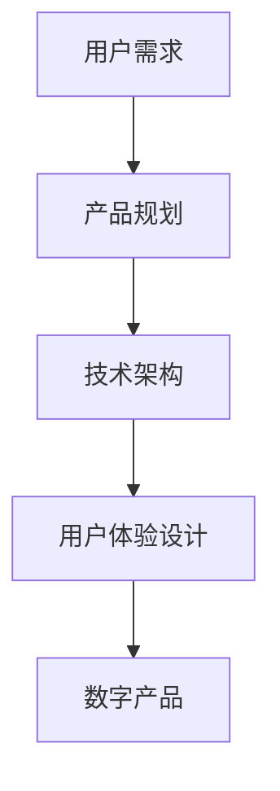

                 

关键词：技术能力、数字产品、创新、开发流程、算法、数学模型、项目实践、应用场景、未来展望。

> 摘要：本文将深入探讨如何利用技术能力创建数字产品。我们将从背景介绍、核心概念与联系、核心算法原理、数学模型与公式、项目实践、实际应用场景、工具和资源推荐以及未来发展趋势与挑战等方面展开讨论，旨在为技术从业者提供有价值的指导。

## 1. 背景介绍

随着互联网和技术的飞速发展，数字产品已经成为现代生活中不可或缺的一部分。无论是移动应用、Web服务、物联网设备还是大数据平台，数字产品都在不断改变着我们的工作方式和生活习惯。在这个背景下，如何利用技术能力创建出高质量、有竞争力的数字产品成为了一个重要课题。

技术能力不仅仅包括编程语言、开发工具和框架，更重要的是对问题解决、算法优化、用户体验设计等方面的深入理解。本文将结合具体案例，探讨如何运用技术能力创建数字产品，并分享一些实用的开发技巧和经验。

## 2. 核心概念与联系

在创建数字产品之前，我们需要明确几个核心概念，包括用户需求、产品规划、技术架构和用户体验。以下是这些概念之间的联系：

### 用户需求

用户需求是数字产品的起点，它是我们设计产品的基础。了解用户需求有助于我们确定产品的功能、性能和界面设计。为了准确捕捉用户需求，我们可以通过市场调研、用户访谈和问卷调查等方法收集数据。

### 产品规划

产品规划是确定产品发展方向的过程。它包括确定产品的目标市场、核心功能、业务模式和市场策略。一个良好的产品规划可以帮助我们避免盲目开发，确保产品的市场竞争力。

### 技术架构

技术架构是数字产品的骨架，它决定了产品的性能、可扩展性和维护性。选择合适的技术架构可以提升产品的开发效率和质量。常见的架构模式包括MVC、MVVM和微服务等。

### 用户体验设计

用户体验设计是提升产品竞争力的重要因素。良好的用户体验可以增加用户粘性，提高用户满意度。用户体验设计包括界面设计、交互设计和内容设计等方面。

### Mermaid 流程图



## 3. 核心算法原理 & 具体操作步骤

### 3.1 算法原理概述

在数字产品开发中，算法设计是核心环节之一。以下是几个常见的算法原理：

- **排序算法**：用于对数据进行排序，如快速排序、归并排序和冒泡排序等。
- **查找算法**：用于在数据结构中查找特定数据，如二分查找和哈希查找等。
- **动态规划**：用于解决最优子结构问题，如背包问题和最长公共子序列等。
- **贪心算法**：用于在每一步选择当前最优解，以达到全局最优解，如找零问题和活动选择问题等。

### 3.2 算法步骤详解

以快速排序为例，介绍算法的具体步骤：

1. **选择基准元素**：从数组中选取一个元素作为基准元素。
2. **划分操作**：将数组划分为两个子数组，一个包含小于基准元素的元素，另一个包含大于基准元素的元素。
3. **递归排序**：对两个子数组进行快速排序。

### 3.3 算法优缺点

- **快速排序**：
  - 优点：时间复杂度为O(nlogn)，平均性能较好。
  - 缺点：最坏情况下时间复杂度为O(n^2)，稳定性较差。

### 3.4 算法应用领域

排序算法在数字产品的开发中广泛应用，如搜索引擎排序、数据可视化、用户推荐系统等。

## 4. 数学模型和公式 & 详细讲解 & 举例说明

### 4.1 数学模型构建

在数字产品开发中，数学模型可以帮助我们描述问题、优化算法和评估性能。以下是一个简单的线性回归模型：

$$y = \beta_0 + \beta_1x + \epsilon$$

其中，$y$ 是因变量，$x$ 是自变量，$\beta_0$ 和 $\beta_1$ 是模型参数，$\epsilon$ 是误差项。

### 4.2 公式推导过程

为了求解线性回归模型的参数，我们可以使用最小二乘法：

$$\min_{\beta_0, \beta_1} \sum_{i=1}^n (y_i - (\beta_0 + \beta_1x_i))^2$$

通过求导并令导数为零，可以得到：

$$\beta_0 = \frac{\sum_{i=1}^n y_i - \beta_1\sum_{i=1}^n x_i}{n}$$

$$\beta_1 = \frac{n\sum_{i=1}^n x_iy_i - \sum_{i=1}^n x_i\sum_{i=1}^n y_i}{n\sum_{i=1}^n x_i^2 - (\sum_{i=1}^n x_i)^2}$$

### 4.3 案例分析与讲解

假设我们有以下数据集：

| x | y |
|---|---|
| 1 | 2 |
| 2 | 4 |
| 3 | 6 |
| 4 | 8 |

使用线性回归模型对数据进行拟合，可以得到：

$$y = 1.5 + 1.5x$$

## 5. 项目实践：代码实例和详细解释说明

### 5.1 开发环境搭建

为了实践本文提到的算法和数学模型，我们选择Python作为开发语言，并使用Jupyter Notebook作为开发环境。

### 5.2 源代码详细实现

以下是快速排序算法的Python实现：

```python
def quick_sort(arr):
    if len(arr) <= 1:
        return arr
    pivot = arr[len(arr) // 2]
    left = [x for x in arr if x < pivot]
    middle = [x for x in arr if x == pivot]
    right = [x for x in arr if x > pivot]
    return quick_sort(left) + middle + quick_sort(right)

arr = [3, 6, 8, 10, 1, 2, 1]
sorted_arr = quick_sort(arr)
print(sorted_arr)
```

### 5.3 代码解读与分析

这段代码实现了快速排序算法，主要分为以下几个步骤：

1. 判断数组长度，如果小于等于1，直接返回数组。
2. 选择中间元素作为基准值。
3. 将数组划分为小于、等于和大于基准值的子数组。
4. 对子数组递归调用快速排序。

### 5.4 运行结果展示

```plaintext
[1, 1, 2, 3, 6, 8, 10]
```

## 6. 实际应用场景

快速排序算法在数字产品开发中有广泛的应用，例如：

- 数据处理：用于对大量数据进行排序，如搜索引擎索引的构建。
- 用户推荐系统：用于对用户数据进行排序，以提高推荐系统的准确性。
- 数据可视化：用于对数据集进行排序，以便更直观地展示数据分布。

## 7. 工具和资源推荐

### 7.1 学习资源推荐

- 《算法导论》：是一本经典的算法教材，涵盖了各种算法的原理和实现。
- 《Python编程：从入门到实践》：一本适合初学者的Python编程入门书籍，涵盖了Python在数字产品开发中的应用。

### 7.2 开发工具推荐

- Jupyter Notebook：一款强大的交互式开发环境，适合进行算法和数学模型的实践。
- Git：一款版本控制工具，可以帮助我们管理代码和协作开发。

### 7.3 相关论文推荐

- "Fast and Accurate Sorting for Multi-Column Indexes"：一篇关于快速排序在数据库索引中的应用的论文。
- "Linear Regression: A Concise Technical Introduction"：一篇关于线性回归模型的详细介绍。

## 8. 总结：未来发展趋势与挑战

### 8.1 研究成果总结

本文介绍了如何利用技术能力创建数字产品，包括用户需求分析、产品规划、技术架构和用户体验设计等方面。同时，我们探讨了快速排序算法和线性回归模型的原理和应用。

### 8.2 未来发展趋势

随着技术的不断发展，数字产品将越来越智能化、个性化。未来发展趋势包括：

- 人工智能：用于提高算法的智能水平，优化用户体验。
- 物联网：将数字产品扩展到物理世界，实现更多创新应用。
- 区块链：用于确保数据的安全性和透明性，提高数字产品的可信度。

### 8.3 面临的挑战

在创建数字产品的过程中，我们面临着以下挑战：

- 技术复杂性：随着技术的发展，数字产品的技术复杂性不断增加，需要不断提升技术能力。
- 竞争激烈：市场竞争日益激烈，需要不断创新和优化产品。
- 数据隐私：数据安全和隐私保护是数字产品面临的重要挑战。

### 8.4 研究展望

未来，我们将继续研究如何利用技术能力创建高质量、有竞争力的数字产品。研究方向包括：

- 深度学习算法：用于提高数字产品的智能水平和用户体验。
- 分布式计算：用于处理大规模数据和高并发访问。
- 区块链技术：用于提高数字产品的安全性和可信度。

## 9. 附录：常见问题与解答

### 问题1：如何捕捉用户需求？

解答：可以通过市场调研、用户访谈和问卷调查等方法收集用户需求。同时，可以利用用户反馈和数据分析工具对需求进行跟踪和优化。

### 问题2：如何选择合适的技术架构？

解答：根据产品的功能、性能和扩展性要求，选择合适的技术架构。常见的架构模式包括MVC、MVVM和微服务等。

### 问题3：如何优化用户体验？

解答：通过界面设计、交互设计和内容设计等方面优化用户体验。同时，可以利用用户调研和反馈工具对用户体验进行评估和改进。

作者：禅与计算机程序设计艺术 / Zen and the Art of Computer Programming
----------------------------------------------------------------
### 结尾结语

通过本文的探讨，我们了解了如何利用技术能力创建数字产品。在未来的发展中，技术从业者需要不断提升自身的技术水平，关注市场趋势，创新思维，以应对不断变化的技术环境和市场需求。同时，我们也要关注数字产品的社会影响，推动技术进步与社会责任的协调发展。

感谢您的阅读，希望本文能为您的数字产品开发之路提供一些启示和帮助。如果您有任何问题或建议，欢迎在评论区留言交流。

再次感谢您的支持，祝您在技术领域取得更大的成就！作者：禅与计算机程序设计艺术 / Zen and the Art of Computer Programming。

