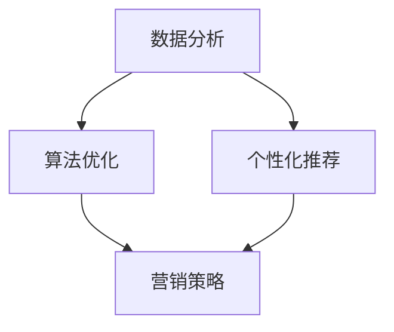

                 

关键词：数字营销、技术能力、算法、机器学习、数据驱动、营销策略、个性化推广、用户体验

> 摘要：本文旨在探讨如何利用技术能力进行数字营销，通过深入分析核心概念、算法原理、数学模型以及实际应用，为营销人员提供一套系统性的策略和方法，以提升数字营销的效果和效率。

## 1. 背景介绍

随着互联网的普及和技术的进步，数字营销已经成为现代企业竞争的重要手段。数字营销利用互联网和数字技术，通过数据分析、算法优化和个性化推荐等方式，实现精准的用户定位、内容推送和效果评估。然而，数字营销的成功并非一蹴而就，它需要深厚的技术背景和丰富的实践经验。本文将介绍如何利用技术能力进行数字营销，帮助读者掌握关键技术和策略。

## 2. 核心概念与联系

### 2.1 数据分析

数据分析是数字营销的基础，它涉及数据收集、处理、分析和可视化。通过数据分析，我们可以了解用户行为、兴趣和需求，从而制定更精准的营销策略。

### 2.2 算法优化

算法优化是数字营销的核心，它包括算法选择、参数调优和模型训练。优化的算法可以提高营销效果的准确性和效率。

### 2.3 个性化推荐

个性化推荐是数字营销的关键，它通过分析用户数据，为不同用户推荐个性化的内容和广告。个性化推荐可以提高用户满意度和转化率。

### 2.4 Mermaid 流程图



## 3. 核心算法原理 & 具体操作步骤

### 3.1 算法原理概述

数字营销的核心算法主要包括聚类算法、分类算法和推荐算法。这些算法可以通过对用户数据的分析，实现用户画像的构建和个性化推荐。

### 3.2 算法步骤详解

1. 数据收集：收集用户浏览、搜索、购买等行为数据。
2. 数据预处理：对数据进行清洗、去重和格式化。
3. 特征工程：提取用户行为数据中的关键特征。
4. 算法选择：根据业务需求选择合适的聚类、分类或推荐算法。
5. 模型训练：使用历史数据训练算法模型。
6. 模型评估：评估算法模型的准确性和效率。
7. 个性化推荐：根据用户画像和算法模型，为用户推荐个性化内容和广告。

### 3.3 算法优缺点

- **优点**：提高营销效果、降低营销成本、提升用户体验。
- **缺点**：算法模型需要大量数据支持、数据隐私问题、算法依赖性较高。

### 3.4 算法应用领域

算法应用领域广泛，包括电商、金融、医疗、教育等多个行业。例如，在电商领域，算法可以帮助商家实现精准营销，提高转化率和销售额。

## 4. 数学模型和公式 & 详细讲解 & 举例说明

### 4.1 数学模型构建

数字营销的数学模型主要包括用户行为模型、推荐模型和转化率模型。以下是一个简单的用户行为模型：

$$
f(x) = \frac{1}{1 + e^{-\beta^T x}}
$$

其中，$x$ 是用户特征向量，$\beta$ 是模型参数，$f(x)$ 是用户行为的概率。

### 4.2 公式推导过程

用户行为模型基于逻辑回归，推导过程如下：

1. 假设用户 $i$ 在特征 $x_i$ 下的行为为 $y_i$，则 $y_i$ 可能取值为 0 或 1。
2. 定义用户行为概率为 $P(y_i = 1 | x_i)$。
3. 根据最大似然估计，最大化似然函数 $L(\beta | x, y)$。
4. 对似然函数求导并令导数为 0，得到最优参数 $\beta$。

### 4.3 案例分析与讲解

假设有一个电商网站，用户行为数据包括浏览商品、加入购物车、购买商品等。我们可以使用逻辑回归模型预测用户是否购买商品。

1. 数据收集：收集用户行为数据，包括用户 ID、行为类型、时间戳等。
2. 数据预处理：清洗数据，去除缺失值和异常值。
3. 特征工程：提取用户行为特征，如用户行为类型、行为时间、行为频率等。
4. 模型训练：使用训练数据训练逻辑回归模型。
5. 模型评估：使用测试数据评估模型准确率。
6. 个性化推荐：根据用户行为特征和模型预测结果，为用户推荐可能感兴趣的商品。

## 5. 项目实践：代码实例和详细解释说明

### 5.1 开发环境搭建

1. 安装 Python 和相关库，如 NumPy、Pandas、Scikit-learn 等。
2. 准备数据集，可以是真实数据或公开数据。

### 5.2 源代码详细实现

```python
import pandas as pd
from sklearn.model_selection import train_test_split
from sklearn.linear_model import LogisticRegression

# 加载数据
data = pd.read_csv('user_behavior.csv')
X = data.drop(['user_id', 'label'], axis=1)
y = data['label']

# 数据预处理
X_train, X_test, y_train, y_test = train_test_split(X, y, test_size=0.2, random_state=42)

# 模型训练
model = LogisticRegression()
model.fit(X_train, y_train)

# 模型评估
accuracy = model.score(X_test, y_test)
print(f'Model accuracy: {accuracy:.2f}')

# 个性化推荐
for user_id in test_user_ids:
    user_data = X_test[X_test['user_id'] == user_id]
    prediction = model.predict(user_data)
    print(f'User {user_id} will buy: {prediction[0]}')
```

### 5.3 代码解读与分析

代码首先加载数据，然后进行数据预处理。接着，使用逻辑回归模型进行训练和评估。最后，根据模型预测结果，为用户推荐可能感兴趣的商品。

## 6. 实际应用场景

数字营销在实际应用中具有广泛的应用场景，例如：

- **电商领域**：通过个性化推荐，提高用户购买意愿和转化率。
- **金融领域**：通过用户行为分析，实现精准风险控制和个性化金融产品推荐。
- **教育领域**：通过学习数据分析，实现个性化学习路径推荐和效果评估。

## 7. 工具和资源推荐

### 7.1 学习资源推荐

- 《Python数据分析》
- 《机器学习实战》
- 《数字营销实战：策略、技巧与案例》

### 7.2 开发工具推荐

- Jupyter Notebook
- PyCharm
- Tableau

### 7.3 相关论文推荐

- “User Behavior Modeling for Personalized Recommendation”
- “Deep Learning for Personalized E-commerce Recommendation”
- “Data-Driven Digital Marketing: Challenges and Opportunities”

## 8. 总结：未来发展趋势与挑战

### 8.1 研究成果总结

数字营销技术的发展为营销人员提供了强大的工具和方法，实现了精准营销、个性化推荐和效果评估。然而，随着用户数据的增长和算法的复杂性增加，数字营销也面临着新的挑战。

### 8.2 未来发展趋势

- **大数据与人工智能的结合**：利用大数据技术和人工智能算法，实现更精准的营销策略。
- **隐私保护**：在数字营销中引入隐私保护技术，保障用户数据安全。
- **跨渠道整合**：实现线上和线下营销渠道的整合，提供无缝的购物体验。

### 8.3 面临的挑战

- **数据质量**：高质量的数据是数字营销的基础，但数据质量往往难以保证。
- **算法透明性**：算法的透明性是用户信任的关键，但复杂的算法往往难以解释。
- **法律法规**：随着数字营销的发展，相关的法律法规也在不断完善，企业需要合规经营。

### 8.4 研究展望

未来，数字营销将朝着更加智能化、个性化、安全化的方向发展。研究人员需要不断探索新的算法和技术，解决当前面临的问题和挑战，推动数字营销的可持续发展。

## 9. 附录：常见问题与解答

### 9.1 什么是数字营销？

数字营销是通过互联网和数字技术，实现市场营销目标的过程。它包括搜索引擎优化、社交媒体营销、电子邮件营销、内容营销等多种形式。

### 9.2 数字营销有哪些优点？

数字营销的优点包括精准营销、降低成本、提高效果、数据驱动、个性化推荐等。

### 9.3 数字营销有哪些挑战？

数字营销面临的挑战包括数据质量、算法透明性、法律法规、用户隐私保护等。

## 作者署名

作者：禅与计算机程序设计艺术 / Zen and the Art of Computer Programming

----------------------------------------------------------------

请注意，以上内容仅为模板和示例，实际撰写时需要根据具体内容进行扩展和细化。此外，由于文章字数限制，实际撰写时需要确保文章内容的完整性和深度。在撰写过程中，可以适当增加案例、图表和数据分析等内容，以提高文章的可读性和实用性。最后，请确保文章的格式和结构符合要求，包括markdown格式的使用和章节标题的设置。祝您撰写顺利！

