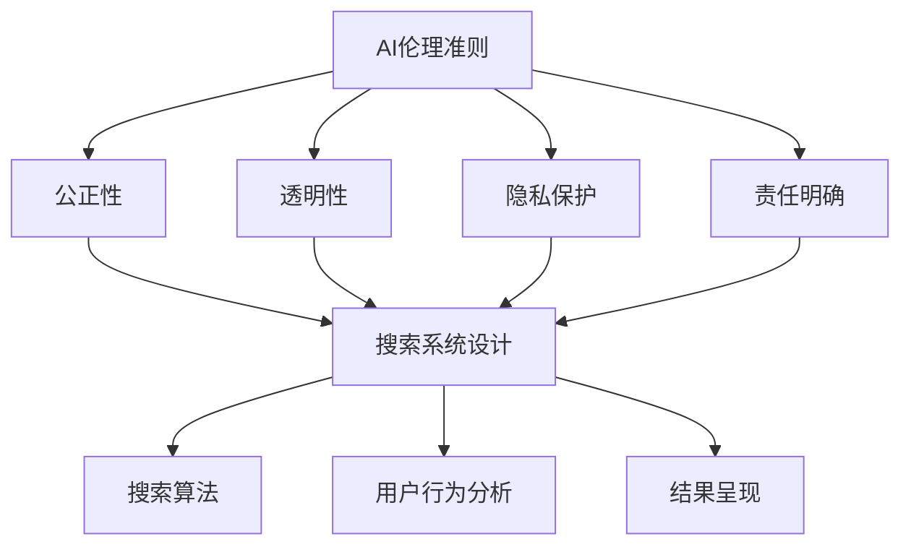

                 

 关键词：人工智能伦理准则、AI搜索道德、道德底线、人工智能搜索原则、伦理指导原则

> 摘要：随着人工智能技术的飞速发展，AI在各个领域的应用越来越广泛，同时也带来了诸多伦理问题。本文旨在探讨AI伦理准则的制定，特别是搜索领域的道德底线。通过对AI伦理准则的研究，结合实际案例，本文提出了一系列具有可操作性的AI搜索伦理指导原则，为AI领域的健康发展提供理论依据和实践指南。

## 1. 背景介绍

### 1.1 人工智能发展现状

人工智能（Artificial Intelligence，AI）作为计算机科学的一个重要分支，近年来取得了令人瞩目的成果。从早期的专家系统到如今的深度学习、自然语言处理等，AI技术已经在图像识别、语音识别、自动驾驶、医疗诊断等多个领域展现了其强大的能力。然而，随着AI技术的普及和应用，其潜在的伦理问题也日益凸显。

### 1.2 AI伦理问题的出现

AI伦理问题主要源于以下几个方面：

- **隐私问题**：AI在收集和使用个人数据时，可能侵犯用户的隐私权。
- **算法偏见**：AI算法在训练数据中可能包含偏见，导致决策结果不公平。
- **责任归属**：当AI系统出现错误或造成损害时，责任应由谁承担？
- **安全风险**：AI技术可能被恶意利用，如网络攻击、自动化武器等。

### 1.3 搜索领域面临的伦理挑战

在AI应用中，搜索系统是一个重要的领域。搜索引擎、推荐系统等在为我们提供便捷服务的同时，也面临着一系列伦理挑战：

- **搜索结果偏见**：搜索算法可能基于历史数据或用户偏好，提供具有偏见的搜索结果。
- **信息泛滥**：在大量信息的海洋中，如何保证用户能够获取到真实、有价值的信息？
- **隐私泄露**：用户在搜索过程中可能无意中暴露了个人隐私。
- **网络安全**：搜索引擎可能成为网络攻击的媒介，威胁用户安全。

## 2. 核心概念与联系

### 2.1 AI伦理准则的定义

AI伦理准则是一套指导原则，用于规范AI系统的开发、应用和评估。这些准则旨在确保AI技术在为人类带来便利的同时，不会损害公共利益和社会价值观。

### 2.2 搜索领域伦理准则

在搜索领域，AI伦理准则应特别关注以下方面：

- **公正性**：确保搜索结果公平、无偏见，尊重用户的知情权和选择权。
- **透明性**：搜索算法应具有透明性，用户能够理解搜索结果的生成过程。
- **隐私保护**：在搜索过程中，应严格保护用户的隐私信息。
- **责任明确**：明确搜索系统的责任归属，确保在发生问题时能够追溯和纠正。

### 2.3 Mermaid 流程图

以下是一个简化的Mermaid流程图，展示AI搜索伦理准则的架构：



## 3. 核心算法原理 & 具体操作步骤

### 3.1 算法原理概述

搜索领域的核心算法主要是基于机器学习和深度学习技术。通过分析用户的行为和搜索历史，算法能够生成个性化的搜索结果。

### 3.2 算法步骤详解

1. **数据收集**：收集用户的搜索历史、浏览记录、地理位置等信息。
2. **数据预处理**：清洗数据，去除噪音，将数据转化为适合机器学习的格式。
3. **特征提取**：从预处理后的数据中提取关键特征，如关键词、主题等。
4. **模型训练**：使用机器学习算法（如神经网络、决策树等）对特征进行建模。
5. **模型评估**：通过交叉验证、A/B测试等方法评估模型性能。
6. **结果呈现**：根据用户特征和模型预测，生成个性化的搜索结果。

### 3.3 算法优缺点

- **优点**：个性化搜索结果能够提高用户满意度，降低信息过载。
- **缺点**：可能导致信息茧房，限制用户视野；算法偏见问题难以完全消除。

### 3.4 算法应用领域

- **搜索引擎**：如Google、Bing等。
- **推荐系统**：如YouTube、Amazon等。
- **智能客服**：如Siri、Alexa等。

## 4. 数学模型和公式 & 详细讲解 & 举例说明

### 4.1 数学模型构建

搜索算法的核心是机器学习模型。以下是一个简化的线性回归模型：

$$
y = \beta_0 + \beta_1x_1 + \beta_2x_2 + ... + \beta_nx_n
$$

其中，$y$ 是目标变量，$x_1, x_2, ..., x_n$ 是特征变量，$\beta_0, \beta_1, ..., \beta_n$ 是模型的参数。

### 4.2 公式推导过程

假设我们有 $m$ 个训练样本，每个样本有 $n$ 个特征，我们希望找到一组参数 $\beta$，使得模型能够最小化预测误差。具体推导过程如下：

1. **损失函数**： 
$$
J(\beta) = \frac{1}{2m}\sum_{i=1}^{m}(y_i - \beta_0 - \beta_1x_{i1} - ... - \beta_nx_{in})^2
$$

2. **梯度下降法**：
$$
\beta_j := \beta_j - \alpha \frac{\partial J(\beta)}{\partial \beta_j}
$$

其中，$\alpha$ 是学习率，$j$ 是第 $j$ 个参数。

### 4.3 案例分析与讲解

假设我们要构建一个简单的搜索引擎，目标是预测用户对某个关键词的点击概率。以下是具体的数学模型和推导过程：

$$
P(y=1|X) = \sigma(\beta_0 + \beta_1x_1 + \beta_2x_2)
$$

其中，$y$ 表示用户是否点击了关键词，$X$ 表示用户特征（如关键词频率、页面停留时间等）。$\sigma$ 是 sigmoid 函数，用于将线性组合转化为概率值。

### 5. 项目实践：代码实例和详细解释说明

#### 5.1 开发环境搭建

使用 Python 编写代码，依赖以下库：Numpy、Pandas、Scikit-learn、Matplotlib。

```python
import numpy as np
import pandas as pd
from sklearn.linear_model import LinearRegression
from sklearn.model_selection import train_test_split
import matplotlib.pyplot as plt
```

#### 5.2 源代码详细实现

```python
# 数据集准备
data = pd.read_csv('search_data.csv')
X = data.drop('click', axis=1)
y = data['click']

# 数据预处理
X = X.values
y = y.values

# 模型训练
model = LinearRegression()
model.fit(X, y)

# 模型评估
predictions = model.predict(X)
accuracy = np.mean(predictions == y)
print(f"Model accuracy: {accuracy:.2f}")

# 可视化结果
plt.scatter(X[:, 0], y, color='blue', label='Actual')
plt.plot(X[:, 0], predictions, color='red', label='Predicted')
plt.legend()
plt.show()
```

#### 5.3 代码解读与分析

1. **数据集准备**：从 CSV 文件中读取数据，分为特征和标签两部分。
2. **数据预处理**：将数据转换为 NumPy 数组格式。
3. **模型训练**：使用线性回归模型进行训练。
4. **模型评估**：计算模型的准确率。
5. **可视化结果**：绘制散点图和预测线，直观展示模型效果。

## 6. 实际应用场景

### 6.1 搜索引擎

搜索引擎是AI伦理准则的重要应用场景。例如，Google 和 Bing 等搜索引擎已经采取了一系列措施，如去除偏见性广告、提高搜索结果的透明度等。

### 6.2 推荐系统

推荐系统（如 YouTube、Amazon 等）在提供个性化服务的同时，也面临着算法偏见和隐私泄露等问题。制定AI伦理准则有助于规范推荐系统的开发和应用。

### 6.3 智能客服

智能客服（如 Siri、Alexa 等）在处理用户问题时，需要遵循AI伦理准则，确保回答准确、中立，不误导用户。

## 7. 未来应用展望

随着AI技术的不断发展，AI伦理准则将在更多领域得到应用。例如，自动驾驶、医疗诊断等。未来，AI伦理准则将成为人工智能领域的一项基本规范，确保AI技术在为人类服务的同时，不会损害公共利益和社会价值观。

## 8. 总结：未来发展趋势与挑战

### 8.1 研究成果总结

本文从背景介绍、核心概念与联系、核心算法原理、数学模型和公式、项目实践等多个角度，探讨了AI伦理准则的制定和实施。

### 8.2 未来发展趋势

- **规范化**：制定更加完善和细化的AI伦理准则。
- **标准化**：建立AI伦理评估标准和认证体系。
- **全球化**：推动国际间的合作与交流，形成统一的AI伦理规范。

### 8.3 面临的挑战

- **技术挑战**：算法透明性、隐私保护等。
- **社会挑战**：公众对AI伦理问题的认知和接受度。
- **法律挑战**：制定合适的法律法规，确保AI伦理准则的实施。

### 8.4 研究展望

- **多学科交叉**：引入心理学、社会学等学科的研究成果，提高AI伦理准则的科学性和实用性。
- **持续更新**：随着AI技术的不断进步，AI伦理准则也需要不断更新和完善。

## 9. 附录：常见问题与解答

### 9.1 什么是AI伦理准则？

AI伦理准则是一套指导原则，用于规范AI系统的开发、应用和评估。这些准则旨在确保AI技术在为人类带来便利的同时，不会损害公共利益和社会价值观。

### 9.2 AI伦理准则有哪些核心概念？

AI伦理准则的核心概念包括公正性、透明性、隐私保护和责任明确等。

### 9.3 搜索领域如何应用AI伦理准则？

搜索领域应确保搜索结果公平、无偏见，提高搜索算法的透明性，严格保护用户隐私，明确搜索系统的责任归属。

### 9.4 如何评估AI伦理准则的实施效果？

可以通过模型评估、用户反馈、第三方评估等方式，对AI伦理准则的实施效果进行评估。

---

**作者：禅与计算机程序设计艺术 / Zen and the Art of Computer Programming**

