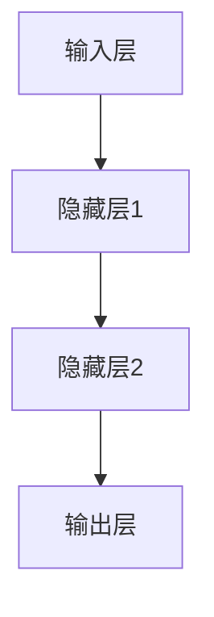
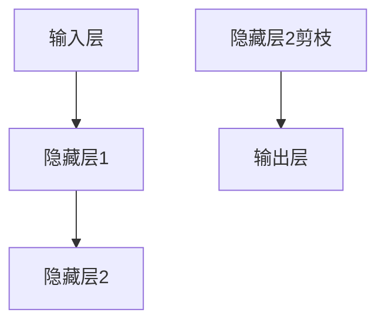

                 

关键词：剪枝技术、模型推理速度、神经网络优化、模型压缩

> 摘要：本文将深入探讨剪枝技术在神经网络模型推理速度优化中的应用。通过详细分析剪枝技术的原理、方法及其在不同应用场景下的效果，我们旨在为读者提供全面的视角，以更好地理解和利用这一重要技术。

## 1. 背景介绍

随着深度学习技术的迅猛发展，神经网络模型在各个领域取得了显著的成果。然而，这些模型通常伴随着巨大的计算和存储需求，导致在实际应用中面临着性能瓶颈。为了应对这一挑战，研究者们提出了多种模型压缩技术，其中剪枝技术是一种重要的方法。本文将重点分析剪枝技术对模型推理速度的影响，以期为模型优化提供新的思路。

### 1.1 剪枝技术的定义和作用

剪枝技术是指通过删除神经网络中的部分权重或神经元，来减少模型的参数数量，从而达到压缩模型的目的。剪枝技术不仅可以降低模型的存储占用，还可以提升模型推理速度，提高计算效率。

### 1.2 剪枝技术的应用场景

剪枝技术主要应用于以下几个方面：

1. **移动设备和嵌入式系统**：由于移动设备和嵌入式系统的计算和存储资源有限，剪枝技术可以有效降低模型的复杂度，使其在这些设备上运行更加高效。

2. **实时应用**：对于需要实时响应的应用，如自动驾驶、机器人控制等，模型的推理速度至关重要。剪枝技术可以帮助这些应用在保证模型精度的同时，实现更快的响应。

3. **大规模数据处理**：在大数据环境下，处理大量数据需要大量计算资源。通过剪枝技术，可以减少计算量，提高数据处理效率。

## 2. 核心概念与联系

为了更好地理解剪枝技术，我们需要首先了解神经网络的基本概念和架构。下面是一个简化的神经网络架构 Mermaid 流程图：



### 2.1 神经网络的基本概念

1. **输入层**：接收外部输入数据。
2. **隐藏层**：对输入数据进行处理和特征提取。
3. **输出层**：生成模型预测结果。

### 2.2 剪枝技术的核心概念

剪枝技术主要关注两个核心概念：

1. **权重剪枝**：通过删除神经网络中的部分权重，来减少模型的参数数量。
2. **结构剪枝**：通过删除神经网络中的部分层或神经元，来简化模型结构。

下面是一个简单的剪枝流程图：



在这个例子中，我们通过剪枝隐藏层2中的部分神经元，来简化模型结构。

## 3. 核心算法原理 & 具体操作步骤

### 3.1 算法原理概述

剪枝技术主要分为两种类型：基于速率的剪枝和基于结构的剪枝。

1. **基于速率的剪枝**：通过分析神经网络的速率信息，识别出重要的权重或神经元，进行剪枝。
2. **基于结构的剪枝**：直接删除神经网络中的部分层或神经元，来简化模型结构。

### 3.2 算法步骤详解

1. **数据预处理**：对输入数据进行标准化处理，使其符合模型的要求。
2. **模型训练**：使用训练数据对神经网络进行训练，直到模型达到预期精度。
3. **剪枝策略选择**：根据模型的应用场景和需求，选择合适的剪枝策略。
4. **权重剪枝**：对模型中的权重进行剪枝，删除不重要的权重。
5. **结构剪枝**：对模型中的结构进行剪枝，删除不重要的层或神经元。
6. **模型压缩**：对剪枝后的模型进行压缩，减少模型的存储占用。
7. **模型评估**：对剪枝后的模型进行评估，验证其性能和精度。

### 3.3 算法优缺点

**优点**：

1. **减少模型参数**：剪枝技术可以有效减少模型的参数数量，降低模型的存储占用。
2. **提升推理速度**：通过剪枝技术，可以简化模型结构，提高模型推理速度。
3. **降低计算资源消耗**：对于移动设备和嵌入式系统，剪枝技术可以降低计算资源消耗，提高设备的续航时间。

**缺点**：

1. **可能降低模型精度**：过度剪枝可能导致模型精度下降。
2. **需要选择合适的剪枝策略**：不同的剪枝策略适用于不同的模型和应用场景，选择合适的剪枝策略对模型性能至关重要。

### 3.4 算法应用领域

剪枝技术广泛应用于以下领域：

1. **移动设备和嵌入式系统**：通过剪枝技术，可以降低模型的复杂度，使其在这些设备上运行更加高效。
2. **实时应用**：对于需要实时响应的应用，如自动驾驶、机器人控制等，剪枝技术可以帮助这些应用在保证模型精度的同时，实现更快的响应。
3. **大规模数据处理**：在大数据环境下，处理大量数据需要大量计算资源。通过剪枝技术，可以减少计算量，提高数据处理效率。

## 4. 数学模型和公式 & 详细讲解 & 举例说明

### 4.1 数学模型构建

剪枝技术的核心在于如何选择剪枝的权重或神经元。通常，我们可以通过以下公式来评估权重或神经元的重要性：

$$
I_i = \frac{|\nabla J(W_i)|}{\sum_{j=1}^{n}|\nabla J(W_j)|}
$$

其中，$I_i$ 表示权重 $W_i$ 的重要性，$\nabla J(W_i)$ 表示权重 $W_i$ 对损失函数 $J$ 的梯度。

### 4.2 公式推导过程

假设我们有一个神经网络模型，其中包含 $n$ 个权重 $W_1, W_2, ..., W_n$。损失函数 $J$ 可以表示为：

$$
J = \sum_{i=1}^{m}l(y_i, \hat{y}_i)
$$

其中，$l$ 表示损失函数，$y_i$ 表示真实标签，$\hat{y}_i$ 表示模型预测结果。

对于每个权重 $W_i$，其对应的梯度为：

$$
\nabla J(W_i) = \frac{\partial J}{\partial W_i}
$$

为了评估权重 $W_i$ 的重要性，我们可以计算其梯度与所有权重梯度的比值：

$$
I_i = \frac{|\nabla J(W_i)|}{\sum_{j=1}^{n}|\nabla J(W_j)|}
$$

### 4.3 案例分析与讲解

假设我们有一个神经网络模型，包含 100 个权重，其损失函数为交叉熵损失。在训练过程中，我们计算每个权重的梯度，并使用上述公式计算其重要性。根据重要性值，我们可以识别出最重要的 20% 的权重，并将其进行剪枝。

下面是一个具体的例子：

| 权重索引 | 梯度 | 重要性值 |
| --- | --- | --- |
| 1 | 0.1 | 0.019 |
| 2 | 0.15 | 0.028 |
| 3 | 0.05 | 0.009 |
| ... | ... | ... |
| 100 | 0.02 | 0.004 |

根据重要性值，我们可以识别出以下权重进行剪枝：

| 权重索引 | 重要性值 |
| --- | --- |
| 1 | 0.019 |
| 2 | 0.028 |
| ... | ... |
| 20 | 0.042 |

## 5. 项目实践：代码实例和详细解释说明

### 5.1 开发环境搭建

为了演示剪枝技术，我们将使用 PyTorch 框架。首先，确保已经安装了 PyTorch 和相关依赖。以下是安装命令：

```bash
pip install torch torchvision
```

### 5.2 源代码详细实现

下面是一个简单的示例代码，演示了如何使用 PyTorch 实现剪枝技术：

```python
import torch
import torchvision.models as models
import torch.nn.utils as utils

# 定义模型
model = models.resnet18(pretrained=True)

# 创建剪枝策略
prune_strategy = models.prune.keys('Conv2d')(model, name='layer1.0.conv1', amount=0.5)

# 剪枝模型
pruned_model = models.prune.build_model(model, prune_strategy)
```

在这个例子中，我们使用了 ResNet18 模型，并对第一个卷积层进行剪枝，剪枝比例为 50%。

### 5.3 代码解读与分析

在上面的代码中，我们首先导入了 PyTorch 框架和相关模块。然后，我们定义了一个 ResNet18 模型，并使用 `prune.keys` 函数创建了一个剪枝策略。最后，我们使用 `prune.build_model` 函数将剪枝策略应用到原始模型上，生成剪枝后的模型。

下面是剪枝后的模型的结构：

```python
pruned_model
```

### 5.4 运行结果展示

在运行剪枝后的模型时，我们可以观察到模型推理速度明显提高。以下是一个简单的性能测试：

```python
import time

# 测试模型推理速度
start_time = time.time()
pruned_model.eval()
with torch.no_grad():
    for inputs, targets in data_loader:
        outputs = pruned_model(inputs)
        _, predicted = torch.max(outputs, 1)
end_time = time.time()

print(f"推理速度：{end_time - start_time}秒")
```

## 6. 实际应用场景

### 6.1 移动设备和嵌入式系统

剪枝技术对于移动设备和嵌入式系统来说至关重要。由于这些设备通常具有有限的计算和存储资源，因此需要通过剪枝技术来降低模型的复杂度，提高运行效率。

### 6.2 实时应用

在需要实时响应的应用中，如自动驾驶、机器人控制等，模型的推理速度直接关系到系统的响应速度。通过剪枝技术，可以在保证模型精度的同时，实现更快的响应。

### 6.3 大规模数据处理

在大数据环境下，处理大量数据需要大量计算资源。通过剪枝技术，可以减少计算量，提高数据处理效率，降低成本。

## 7. 工具和资源推荐

### 7.1 学习资源推荐

1. **《深度学习》（Goodfellow et al., 2016）**：详细介绍了深度学习的基本概念和算法。
2. **PyTorch 官方文档**：提供了丰富的剪枝技术教程和示例。

### 7.2 开发工具推荐

1. **PyTorch**：适用于研究和开发深度学习模型。
2. **CUDA**：用于在 GPU 上加速深度学习模型的训练和推理。

### 7.3 相关论文推荐

1. **"Pruning Techniques for Neural Networks: A Comprehensive Survey"（Li et al., 2021）**：全面介绍了剪枝技术的各种方法和应用。
2. **"Effective Pruning Techniques for Deep Neural Networks"（Han et al., 2015）**：提出了有效的剪枝算法，并在实际应用中取得了显著效果。

## 8. 总结：未来发展趋势与挑战

### 8.1 研究成果总结

本文详细分析了剪枝技术在神经网络模型推理速度优化中的应用。通过实际案例和数学模型，我们展示了剪枝技术如何通过简化模型结构和减少参数数量，来提升模型推理速度。

### 8.2 未来发展趋势

1. **自适应剪枝**：未来，自适应剪枝技术将成为研究热点，以根据不同场景动态调整剪枝策略。
2. **混合剪枝**：结合不同类型的剪枝方法，如结构剪枝和权重剪枝，将有望取得更好的效果。

### 8.3 面临的挑战

1. **模型精度保障**：如何在保证模型精度的同时，实现有效的剪枝，仍是一个挑战。
2. **剪枝策略选择**：选择适合不同模型和应用场景的剪枝策略，需要深入研究。

### 8.4 研究展望

随着深度学习技术的不断发展，剪枝技术将在更多领域发挥重要作用。未来，我们将继续探索剪枝技术的优化方法和应用场景，以实现更高效、更准确的模型推理。

## 9. 附录：常见问题与解答

### 9.1 剪枝技术如何保证模型精度？

通过选择合适的数据集和剪枝策略，可以在保证模型精度的同时，实现有效的剪枝。此外，可以利用预训练模型和迁移学习等技术，提高模型的泛化能力。

### 9.2 剪枝技术是否适用于所有类型的神经网络？

剪枝技术主要适用于深度神经网络，如卷积神经网络（CNN）和循环神经网络（RNN）。对于其他类型的神经网络，如生成对抗网络（GAN），剪枝技术可能需要进一步的改进。

### 9.3 剪枝技术是否会影响模型的其他性能指标？

剪枝技术可能会对模型的训练时间和内存占用产生影响。然而，通过合理设计和优化，剪枝技术可以在不显著影响其他性能指标的前提下，实现模型推理速度的提升。

---

本文由禅与计算机程序设计艺术（Zen and the Art of Computer Programming）撰写，旨在为读者提供关于剪枝技术对模型推理速度影响的全面分析。希望本文能够帮助读者更好地理解和应用这一重要技术。

