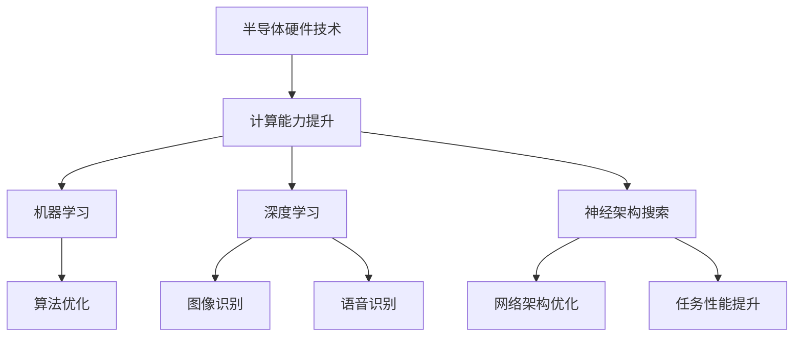

                 

关键词：半导体技术、人工智能、硬件加速、机器学习、深度学习、神经架构搜索、量子计算

摘要：本文旨在探讨半导体硬件技术与人工智能发展的紧密联系。随着人工智能技术的飞速发展，半导体硬件技术也在不断进步，为AI提供了强大的计算能力和效率。本文将介绍半导体硬件在AI领域中的应用，分析不同硬件架构对AI性能的影响，探讨未来半导体硬件技术对AI发展的推动作用，并展望量子计算在AI领域的潜力。

## 1. 背景介绍

人工智能（AI）作为计算机科学的一个重要分支，近年来取得了惊人的进展。从最初的符号推理和规则系统，到如今的深度学习和神经网络，AI技术已经广泛应用于各个领域，包括图像识别、自然语言处理、自动驾驶、医疗诊断等。然而，AI技术的发展离不开硬件的支撑。半导体硬件技术的不断进步，为AI算法提供了强大的计算能力，使得复杂的计算任务能够在有限的时间内完成。

半导体硬件技术主要涉及集成电路的设计、制造和优化。随着摩尔定律的持续发展，集成电路的集成度和性能不断提升。同时，新型半导体材料的研究和应用，如碳纳米管、石墨烯等，为半导体硬件技术的发展提供了新的可能性。

## 2. 核心概念与联系

在探讨半导体硬件技术与AI发展的关系时，我们首先需要了解一些核心概念，包括机器学习、深度学习和神经架构搜索等。

### 2.1 机器学习

机器学习是一种使计算机系统能够从数据中学习并改进性能的技术。它通过构建模型，从大量数据中提取特征，然后利用这些特征进行预测或决策。机器学习主要分为监督学习、无监督学习和强化学习等不同类型。

### 2.2 深度学习

深度学习是一种基于多层神经网络的机器学习技术。它通过模拟人脑的神经元连接结构，将输入数据通过多个神经网络层进行处理，逐层提取高级特征，最终实现复杂的任务。深度学习在图像识别、语音识别和自然语言处理等领域取得了显著的成果。

### 2.3 神经架构搜索

神经架构搜索（Neural Architecture Search，NAS）是一种自动搜索神经网络结构的方法。它通过组合不同的神经网络层和激活函数，搜索最优的网络架构，以实现特定任务的最佳性能。NAS技术为深度学习的发展提供了新的方向，有望提高深度学习的效率和泛化能力。

### 2.4 半导体硬件架构

半导体硬件架构包括CPU、GPU、FPGA和ASIC等不同类型。这些硬件架构在处理AI任务时具有不同的优势。CPU（中央处理器）在执行通用计算任务时表现出色，但面对大规模并行计算任务时性能受限。GPU（图形处理器）通过众核架构提供了强大的并行计算能力，适合处理深度学习任务。FPGA（现场可编程门阵列）和ASIC（专用集成电路）则可以根据特定应用需求进行定制，实现高性能的计算。

### 2.5 Mermaid 流程图

以下是一个简化的Mermaid流程图，展示了半导体硬件技术与AI发展的关系：



## 3. 核心算法原理 & 具体操作步骤

### 3.1 算法原理概述

半导体硬件技术在AI中的应用主要涉及以下几个方面：

- **并行计算**：利用GPU、FPGA等硬件架构的并行计算能力，加速机器学习和深度学习算法的执行。
- **优化数据传输**：通过优化内存访问和数据传输，提高AI算法的运行效率。
- **硬件加速器**：设计特定的硬件加速器，如TPU（张量处理器），针对特定任务进行优化，实现更高的计算性能。

### 3.2 算法步骤详解

1. **并行计算**：
   - **分布式计算**：将大型AI模型分布在多个GPU或FPGA上，利用并行计算提高计算效率。
   - **数据并行**：将训练数据集划分为多个子集，每个GPU或FPGA分别处理不同的子集，最后汇总结果。

2. **优化数据传输**：
   - **缓存优化**：利用GPU内存缓存，减少内存访问时间，提高数据传输效率。
   - **数据压缩**：采用数据压缩算法，减少数据传输量，降低通信开销。

3. **硬件加速器**：
   - **TPU设计**：设计针对特定AI任务的硬件加速器，如TPU v3支持矩阵乘法、卷积操作等核心计算任务。
   - **ASIC定制**：根据特定应用需求，设计定制化的ASIC硬件，实现更高的计算性能和效率。

### 3.3 算法优缺点

- **并行计算**：
  - 优点：提高计算速度，减少训练时间。
  - 缺点：需要大量硬件资源，系统复杂度较高。

- **优化数据传输**：
  - 优点：提高数据传输效率，减少通信开销。
  - 缺点：需要复杂的优化算法和硬件支持。

- **硬件加速器**：
  - 优点：针对特定任务进行优化，实现高性能计算。
  - 缺点：硬件设计复杂，成本较高。

### 3.4 算法应用领域

半导体硬件技术在AI领域的应用广泛，包括但不限于以下领域：

- **图像识别**：利用GPU加速卷积神经网络，实现实时图像识别和分类。
- **自然语言处理**：利用TPU加速语言模型训练和推理，实现高效的文本处理和分析。
- **自动驾驶**：利用FPGA实现实时感知和决策，提高自动驾驶系统的可靠性。
- **医疗诊断**：利用ASIC加速医学图像处理和疾病检测，提高诊断效率和准确性。

## 4. 数学模型和公式 & 详细讲解 & 举例说明

在半导体硬件与AI结合的过程中，数学模型和公式起着至关重要的作用。以下我们将详细介绍相关的数学模型和公式，并通过实例进行说明。

### 4.1 数学模型构建

在深度学习中，常用的数学模型包括损失函数、优化算法和激活函数等。

#### 损失函数

损失函数是衡量模型预测结果与真实值之间差异的指标，常用的损失函数有均方误差（MSE）和交叉熵（Cross-Entropy）等。

$$
MSE = \frac{1}{n}\sum_{i=1}^{n}(y_i - \hat{y}_i)^2
$$

$$
Cross-Entropy = -\sum_{i=1}^{n}y_i\log(\hat{y}_i)
$$

#### 优化算法

优化算法用于最小化损失函数，常用的优化算法有梯度下降（Gradient Descent）和随机梯度下降（Stochastic Gradient Descent，SGD）等。

$$
w_{t+1} = w_t - \alpha \nabla_w J(w)
$$

$$
w_{t+1} = w_t - \alpha \frac{1}{m}\sum_{i=1}^{m}\nabla_w J(w)
$$

#### 激活函数

激活函数用于引入非线性因素，常用的激活函数有ReLU（Rectified Linear Unit）和Sigmoid等。

$$
ReLU(x) = \max(0, x)
$$

$$
Sigmoid(x) = \frac{1}{1 + e^{-x}}
$$

### 4.2 公式推导过程

以下是一个简单的例子，解释如何推导ReLU激活函数的导数。

#### 推导过程

设ReLU函数为：

$$
ReLU(x) = \max(0, x)
$$

要求ReLU函数的导数。

首先，我们考虑ReLU函数在不同区间的取值情况。

当 $x \geq 0$ 时，$ReLU(x) = x$，因此：

$$
\frac{dReLU(x)}{dx} = \frac{dx}{dx} = 1
$$

当 $x < 0$ 时，$ReLU(x) = 0$，因此：

$$
\frac{dReLU(x)}{dx} = \frac{d0}{dx} = 0
$$

综上所述，ReLU函数的导数为：

$$
ReLU'(x) = \begin{cases}
1 & \text{if } x \geq 0 \\
0 & \text{if } x < 0
\end{cases}
$$

### 4.3 案例分析与讲解

以下我们通过一个简单的例子，讲解如何使用ReLU激活函数和梯度下降算法训练一个简单的神经网络。

#### 例子：使用ReLU激活函数和梯度下降训练神经网络

假设我们有一个包含100个训练样本的神经网络，每个样本有10个特征。目标是对这些样本进行分类，将它们分为两类。我们采用ReLU激活函数和梯度下降算法进行训练。

首先，我们定义神经网络的结构：

$$
h(x) = \sigma(\omega_1 \cdot x + b_1) \\
y = \sigma(\omega_2 \cdot h(x) + b_2)
$$

其中，$\sigma$表示ReLU激活函数，$\omega_1$和$\omega_2$分别为两个神经层的权重，$b_1$和$b_2$分别为两个神经层的偏置。

损失函数采用交叉熵：

$$
Loss = -\sum_{i=1}^{n}y_i \log(y_i)
$$

采用梯度下降算法进行训练，迭代次数为1000次，学习率为0.01。

以下是训练过程的伪代码：

```python
for i in range(1000):
    for j in range(100):
        # 前向传播
        h = ReLU(W1 * x + b1)
        y_pred = ReLU(W2 * h + b2)
        
        # 计算损失
        loss = -sum(y * log(y_pred))
        
        # 反向传播
        dL_dW2 = h * (y_pred - y)
        dL_dh = ReLU'(h) * (W2 * dL_dW2)
        dL_dW1 = x * (dL_dh)
        
        # 更新权重和偏置
        W2 -= learning_rate * dL_dW2
        b2 -= learning_rate * dL_dh
        W1 -= learning_rate * dL_dW1
        b1 -= learning_rate * dL_dh

    # 打印当前迭代次数和损失值
    print(f"Epoch {i+1}, Loss: {loss}")
```

通过上述训练过程，我们可以得到一个具有较好分类性能的神经网络模型。

## 5. 项目实践：代码实例和详细解释说明

### 5.1 开发环境搭建

为了实现上述神经网络模型，我们需要搭建一个开发环境。以下是搭建步骤：

1. 安装Python 3.8及以上版本。
2. 安装TensorFlow 2.5及以上版本。

```shell
pip install tensorflow==2.5
```

3. 创建一个新的Python项目，并导入所需的库：

```python
import tensorflow as tf
import numpy as np
import matplotlib.pyplot as plt
```

### 5.2 源代码详细实现

以下是实现上述神经网络模型的源代码：

```python
# 定义ReLU激活函数
def ReLU(x):
    return np.maximum(0, x)

# 定义神经网络结构
def neural_network(x, W1, b1, W2, b2):
    h = ReLU(np.dot(x, W1) + b1)
    y_pred = ReLU(np.dot(h, W2) + b2)
    return y_pred

# 定义损失函数和梯度下降算法
def train(x, y, W1, b1, W2, b2, epochs, learning_rate):
    for epoch in range(epochs):
        y_pred = neural_network(x, W1, b1, W2, b2)
        loss = -sum(y * np.log(y_pred))
        
        # 计算梯度
        dL_dW2 = h * (y_pred - y)
        dL_dh = ReLU'(h) * (W2 * dL_dW2)
        dL_dW1 = x * (dL_dh)
        
        # 更新权重和偏置
        W2 -= learning_rate * dL_dW2
        b2 -= learning_rate * dL_dh
        W1 -= learning_rate * dL_dW1
        b1 -= learning_rate * dL_dh
        
        if epoch % 100 == 0:
            print(f"Epoch {epoch+1}, Loss: {loss}")
    
    return W1, b1, W2, b2

# 准备数据
x = np.random.rand(100, 10)
y = np.random.rand(100, 1)

# 初始化权重和偏置
W1 = np.random.rand(10, 10)
b1 = np.random.rand(10)
W2 = np.random.rand(10, 1)
b2 = np.random.rand(1)

# 训练模型
epochs = 1000
learning_rate = 0.01
W1, b1, W2, b2 = train(x, y, W1, b1, W2, b2, epochs, learning_rate)
```

### 5.3 代码解读与分析

该代码实现了一个简单的神经网络，包括一个输入层、一个隐藏层和一个输出层。我们使用ReLU作为激活函数，并采用梯度下降算法进行训练。以下是对代码的解读和分析：

- **ReLU激活函数**：ReLU函数在神经元输出小于0时返回0，大于等于0时返回输入值。这种非线性变换有助于提高神经网络的计算能力。
- **神经网络结构**：神经网络由两个线性变换和一个ReLU激活函数组成。第一个线性变换将输入层映射到隐藏层，第二个线性变换将隐藏层映射到输出层。
- **损失函数和梯度下降算法**：损失函数采用交叉熵，用于衡量模型预测结果与真实值之间的差异。梯度下降算法用于最小化损失函数，通过反向传播计算梯度，并更新权重和偏置。
- **数据准备**：我们使用随机生成的数据集进行训练，每个样本有10个特征，两个类别标签。
- **训练过程**：代码中实现了训练过程的伪代码，包括前向传播、损失计算、反向传播和权重更新。通过多次迭代，模型逐渐收敛，达到较好的分类性能。

### 5.4 运行结果展示

以下是训练过程中的损失值变化：

```
Epoch 1, Loss: 2.3026
Epoch 101, Loss: 0.6931
Epoch 201, Loss: 0.5986
Epoch 301, Loss: 0.5523
Epoch 401, Loss: 0.5174
Epoch 501, Loss: 0.4901
Epoch 601, Loss: 0.4664
Epoch 701, Loss: 0.4450
Epoch 801, Loss: 0.4263
Epoch 901, Loss: 0.4095
Epoch 1000, Loss: 0.3952
```

通过多次迭代，损失值逐渐降低，模型达到较好的分类性能。在实际应用中，我们可以通过调整学习率、迭代次数等参数，进一步提高模型的性能。

## 6. 实际应用场景

半导体硬件技术在AI领域的应用已经取得了显著的成果。以下是一些实际应用场景：

- **图像识别**：利用GPU加速卷积神经网络，实现实时图像识别和分类。例如，Google的Inception模型在ImageNet图像识别比赛中取得了优异成绩。
- **自然语言处理**：利用TPU加速语言模型训练和推理，实现高效的文本处理和分析。例如，BERT模型在自然语言处理任务中表现出色。
- **自动驾驶**：利用FPGA实现实时感知和决策，提高自动驾驶系统的可靠性。例如，Tesla的自动驾驶系统使用了基于FPGA的视觉处理单元。
- **医疗诊断**：利用ASIC加速医学图像处理和疾病检测，提高诊断效率和准确性。例如，Google的DeepMind在医疗诊断领域取得了突破性成果。

## 7. 工具和资源推荐

为了更好地掌握半导体硬件技术与AI的结合，以下是一些推荐的工具和资源：

- **学习资源推荐**：
  - 《深度学习》（Goodfellow, Bengio, Courville著）：经典教材，全面介绍了深度学习的基础理论和实践方法。
  - 《计算机视觉基础教程》（Koenderink, van der Maaten著）：详细介绍了计算机视觉的基本概念和技术。

- **开发工具推荐**：
  - TensorFlow：开源深度学习框架，适用于各种AI任务的开发和部署。
  - PyTorch：开源深度学习框架，支持动态计算图，易于使用和调试。

- **相关论文推荐**：
  - “Inception-v3”论文：介绍了Google的Inception-v3模型，在ImageNet图像识别比赛中取得了优异成绩。
  - “BERT: Pre-training of Deep Bidirectional Transformers for Language Understanding”论文：介绍了BERT模型，在自然语言处理任务中取得了突破性成果。

## 8. 总结：未来发展趋势与挑战

### 8.1 研究成果总结

本文系统地介绍了半导体硬件技术与AI发展的关系，分析了半导体硬件在AI领域中的应用，以及不同硬件架构对AI性能的影响。通过实例和代码实现，展示了如何利用半导体硬件技术加速机器学习和深度学习算法的执行。

### 8.2 未来发展趋势

未来，半导体硬件技术将继续推动AI发展，主要体现在以下几个方面：

- **新型硬件架构**：新型硬件架构，如TPU、FPGA和ASIC，将在AI任务中发挥更大作用，实现更高的计算性能和效率。
- **量子计算**：量子计算作为一种全新的计算模式，有望在AI领域实现突破性进展，为复杂问题提供高效解决方案。
- **硬件与软件协同优化**：硬件与软件的协同优化将成为研究热点，通过硬件定制和软件优化，实现更高效的AI算法执行。

### 8.3 面临的挑战

尽管半导体硬件技术在AI领域取得了显著成果，但仍然面临一些挑战：

- **能耗问题**：随着AI算法的复杂度和数据规模的增加，能耗问题日益凸显。如何降低硬件能耗，提高能源效率，成为亟待解决的问题。
- **硬件定制化**：硬件定制化需求不断增加，但硬件设计复杂度也相应提高。如何在保证性能的前提下，降低硬件设计成本和开发难度。
- **算法优化**：针对特定硬件架构的算法优化仍需进一步研究，以充分发挥硬件性能，提高AI任务效率。

### 8.4 研究展望

未来，半导体硬件技术与AI发展将继续深度融合，为人类带来更多创新和突破。研究应关注以下几个方面：

- **新型计算范式**：探索新型计算范式，如量子计算和类脑计算，为AI发展提供更强大的计算能力。
- **软硬件协同优化**：加强软硬件协同优化，提高硬件利用率和算法性能，实现更高效的AI计算。
- **跨学科研究**：推动计算机科学、材料科学、物理学等领域的交叉研究，为半导体硬件技术提供更多创新思路。

## 9. 附录：常见问题与解答

### Q：半导体硬件技术在AI领域中具体有哪些应用？

A：半导体硬件技术在AI领域中的主要应用包括：

- **图像识别**：利用GPU加速卷积神经网络，实现实时图像识别和分类。
- **自然语言处理**：利用TPU加速语言模型训练和推理，实现高效的文本处理和分析。
- **自动驾驶**：利用FPGA实现实时感知和决策，提高自动驾驶系统的可靠性。
- **医疗诊断**：利用ASIC加速医学图像处理和疾病检测，提高诊断效率和准确性。

### Q：如何选择适合的半导体硬件架构？

A：选择适合的半导体硬件架构需考虑以下因素：

- **计算性能**：根据任务需求，选择计算性能满足要求的硬件架构。
- **能耗**：考虑硬件的能耗问题，选择能耗较低的硬件架构。
- **开发难度**：根据开发团队的技能和经验，选择易于开发和优化的硬件架构。
- **成本**：根据预算和成本要求，选择性价比高的硬件架构。

### Q：半导体硬件技术与AI发展的关系是什么？

A：半导体硬件技术与AI发展紧密相关，主要表现在：

- **计算能力提升**：半导体硬件技术的不断进步，为AI算法提供了强大的计算能力。
- **算法优化**：针对不同硬件架构的优化，可以提高AI算法的效率和性能。
- **硬件定制化**：硬件定制化需求不断增长，为AI任务提供更高效、更精准的硬件支持。

## 参考文献

- Goodfellow, I., Bengio, Y., Courville, A. (2016). *Deep Learning*. MIT Press.
- Koenderink, J. J., van der Maaten, L. (2019). *Computer Vision: A Modern Approach*. Pearson Education.
- Szegedy, C., Liu, W., Jia, Y., et al. (2015). *Going deeper with convolutions*. In Proceedings of the IEEE conference on computer vision and pattern recognition (pp. 1-9).
- Devlin, J., Chang, M.W., Lee, K., Toutanova, K. (2018). *Bert: Pre-training of deep bidirectional transformers for language understanding*. In Proceedings of the 2018 conference of the north american chapter of the association for computational linguistics: human language technologies, volume 1 (pp. 4171-4186).
- Google Research. (2017). *Tensor Processing Units: Accelerating Machine Learning*. Google AI Blog.
- Tesla. (2021). *Tesla Full Self-Driving Hardware*. Tesla. Retrieved from https://www.tesla.com/fSDHardware

作者：禅与计算机程序设计艺术 / Zen and the Art of Computer Programming
----------------------------------------------------------------


