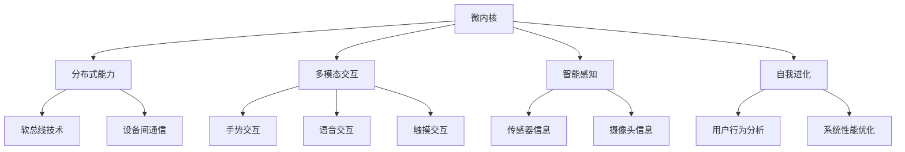

                 

关键词：鸿蒙系统、应用开发、面试真题、技术挑战、实践教程

## 摘要

本文旨在为准备参加华为2024年鸿蒙系统应用开发校招面试的同学们提供一份详尽的面试真题解析和开发实践指导。我们将深入探讨鸿蒙系统的核心概念、应用架构、算法原理以及具体的项目实践，帮助大家更好地理解和掌握鸿蒙系统的开发技巧。本文结构紧凑，内容全面，包括了对鸿蒙系统的基础知识讲解、面试真题分析、代码实例解读、实际应用场景探讨以及未来展望。希望通过本文，读者能够对鸿蒙系统应用开发有更加深入的了解，并在面试中展现出自己的技术实力。

## 1. 背景介绍

鸿蒙系统（HarmonyOS）是华为公司自主研发的操作系统，自2019年首次发布以来，迅速赢得了全球开发者和用户的关注。鸿蒙系统设计之初就注重跨平台、跨设备的集成能力，支持多种硬件设备，包括智能手机、平板电脑、智能手表、智能家居设备等。其核心目标是实现设备间的无缝协同，提供更流畅、更智能的用户体验。

鸿蒙系统的独特之处在于其微内核架构和分布式能力。微内核设计使得系统更加安全、稳定，同时减少了系统资源的占用。而分布式能力则使得不同设备间的数据传输和任务调度更加高效、灵活。此外，鸿蒙系统还具有多模态交互、智能感知、自我进化等先进特性。

随着鸿蒙系统的不断发展和完善，华为也在不断推进鸿蒙生态的建设。通过开放源代码、举办开发者大会、推出开发工具和资源等多种方式，华为致力于吸引更多开发者加入鸿蒙生态，共同推动鸿蒙系统的创新和发展。

## 2. 核心概念与联系

### 2.1. 鸿蒙系统的核心概念

鸿蒙系统包括以下几个核心概念：

1. **微内核**：微内核是鸿蒙系统的核心组成部分，负责处理基本操作系统任务，如进程管理、内存管理、线程调度等。微内核的设计目标是高安全性和高可靠性，同时具有低延迟、低功耗的特点。
2. **分布式能力**：鸿蒙系统的分布式能力是其区别于其他操作系统的重要特性。通过分布式软总线技术，不同设备之间可以实现高效的通信和数据共享，从而实现设备间的协同工作。
3. **多模态交互**：鸿蒙系统支持多种交互方式，包括手势、语音、触摸等，为用户提供更加自然、便捷的交互体验。
4. **智能感知**：鸿蒙系统具备智能感知能力，可以通过传感器、摄像头等设备实时获取环境信息，并据此进行智能决策。
5. **自我进化**：鸿蒙系统具有自我进化能力，可以根据用户行为和系统运行情况自动调整和优化系统性能。

### 2.2. 鸿蒙系统的架构图

以下是一个简化的鸿蒙系统架构图，其中包含了微内核、分布式能力、多模态交互、智能感知和自我进化等核心概念。



### 2.3. 鸿蒙系统的核心概念联系

鸿蒙系统的各个核心概念之间相互联系、相互支持，共同构成了一个强大的操作系统平台。

- 微内核作为基础，提供了系统稳定性和安全性的保障。
- 分布式能力和软总线技术实现了设备间的高效通信和数据共享，为协同工作提供了基础。
- 多模态交互和智能感知增强了用户与系统之间的互动，提升了用户体验。
- 自我进化能力使得系统可以根据用户行为和系统运行情况进行自我优化，提高系统性能。

通过这些核心概念的联系和协同作用，鸿蒙系统实现了跨设备、跨平台的无缝协同，为用户提供了更加智能、便捷的操作系统体验。

## 3. 核心算法原理 & 具体操作步骤

### 3.1. 算法原理概述

鸿蒙系统在实现分布式能力时，依赖于一系列核心算法，包括：

1. **分布式数据同步算法**：用于保证多设备间数据的一致性。
2. **负载均衡算法**：用于优化系统资源分配，提高系统性能。
3. **路径选择算法**：用于确定数据传输的最佳路径，降低延迟。
4. **安全性算法**：用于保障系统通信的安全性。

这些算法共同构成了鸿蒙系统的分布式能力，确保了系统的稳定、高效运行。

### 3.2. 算法步骤详解

#### 3.2.1. 分布式数据同步算法

分布式数据同步算法主要包括以下几个步骤：

1. **数据采集**：设备从本地数据库或其他数据源采集数据。
2. **数据压缩**：对采集到的数据进行压缩，减少传输数据量。
3. **数据加密**：对数据进行加密，保障数据传输的安全性。
4. **数据传输**：通过软总线技术将数据传输到目标设备。
5. **数据解密与解压**：目标设备接收到数据后，进行解密和解压。
6. **数据同步**：将接收到的数据与本地数据进行同步。

#### 3.2.2. 负载均衡算法

负载均衡算法主要包括以下几个步骤：

1. **监控资源使用情况**：实时监控系统的资源使用情况，包括CPU、内存、网络带宽等。
2. **计算负载均衡策略**：根据资源使用情况，计算最佳的负载均衡策略。
3. **分配任务**：根据负载均衡策略，将任务分配到不同的设备上。
4. **调整策略**：根据任务执行情况和资源使用情况，动态调整负载均衡策略。

#### 3.2.3. 路径选择算法

路径选择算法主要包括以下几个步骤：

1. **收集网络拓扑信息**：收集网络中各个节点的拓扑信息，包括节点之间的连接关系、带宽、延迟等。
2. **计算最佳路径**：根据网络拓扑信息，计算数据传输的最佳路径。
3. **选择路径**：根据计算结果，选择最佳路径进行数据传输。

#### 3.2.4. 安全性算法

安全性算法主要包括以下几个步骤：

1. **加密通信**：在数据传输过程中，使用加密算法对数据进行加密，确保数据安全。
2. **身份验证**：对通信双方进行身份验证，确保通信双方的真实性。
3. **访问控制**：对系统资源进行访问控制，确保只有授权用户才能访问。
4. **异常检测**：监控系统运行情况，发现异常情况时，进行异常处理。

### 3.3. 算法优缺点

#### 3.3.1. 分布式数据同步算法

优点：

- 确保数据一致性：分布式数据同步算法能够保证多设备间数据的一致性，避免数据冲突。
- 减少数据传输量：通过数据压缩和加密技术，降低了数据传输的量，提高了传输效率。

缺点：

- 增加同步延迟：分布式数据同步需要传输和处理大量数据，可能增加同步延迟。
- 增加系统复杂度：分布式数据同步算法需要处理多个设备之间的同步问题，增加了系统的复杂度。

#### 3.3.2. 负载均衡算法

优点：

- 提高系统性能：通过负载均衡算法，可以将任务合理分配到不同设备上，提高系统性能。
- 提高资源利用率：通过负载均衡，可以充分利用系统资源，避免资源浪费。

缺点：

- 增加系统维护成本：负载均衡算法需要实时监控资源使用情况，增加了系统维护成本。
- 可能导致资源竞争：在极端情况下，负载均衡算法可能导致资源竞争，影响系统性能。

#### 3.3.3. 路径选择算法

优点：

- 降低延迟：通过选择最佳路径，可以降低数据传输的延迟，提高系统响应速度。

缺点：

- 需要大量计算：路径选择算法需要计算网络拓扑信息，可能增加系统计算负担。

#### 3.3.4. 安全性算法

优点：

- 确保数据安全：通过加密、身份验证和访问控制等技术，确保数据传输过程的安全。
- 提高系统稳定性：通过异常检测和异常处理，提高系统的稳定性。

缺点：

- 可能增加通信开销：加密、身份验证和访问控制等技术需要额外的通信开销，可能降低通信效率。

### 3.4. 算法应用领域

鸿蒙系统的核心算法在多个领域有广泛的应用：

- **智能家居**：分布式数据同步算法可以确保智能家居设备间的数据一致性，实现无缝协同。负载均衡算法可以提高智能家居系统的性能，满足多设备同时使用的需求。
- **物联网**：路径选择算法可以优化物联网设备的通信路径，降低通信延迟。安全性算法可以确保物联网设备的数据安全，防止数据泄露。
- **移动应用**：多模态交互算法可以为移动应用提供丰富的交互方式，提升用户体验。自我进化算法可以根据用户行为和系统运行情况，优化系统性能。

## 4. 数学模型和公式 & 详细讲解 & 举例说明

### 4.1. 数学模型构建

鸿蒙系统的核心算法涉及多个数学模型，以下是一个基本的分布式数据同步模型的构建过程：

#### 4.1.1. 模型假设

假设我们有一个分布式系统，包括多个设备A1, A2, ..., An，每个设备都有一个本地数据库D1, D2, ..., Dn。设备之间的通信延迟和网络带宽是已知的。

#### 4.1.2. 数学模型

1. **数据同步频率**：定义每个设备在单位时间内进行数据同步的频率为f。
2. **数据更新率**：定义每个设备在单位时间内数据更新的速度为u。
3. **通信延迟**：定义设备A1到设备An的通信延迟为dl。
4. **网络带宽**：定义设备A1到设备An的网络带宽为bw。

根据上述定义，我们可以构建以下数学模型：

同步时间 = 数据更新率 * 数据量 / (通信延迟 * 网络带宽)

其中，数据量可以通过数据更新率和同步时间计算得出。

#### 4.1.3. 模型公式

同步时间 = uf / (d * bw)

### 4.2. 公式推导过程

假设在单位时间内，每个设备有u个数据更新。为了确保数据一致性，每个设备需要在同步时间内将所有更新数据发送给其他设备。

#### 4.2.1. 数据同步时间计算

每个设备需要传输的数据量为nu，其中n是设备总数。由于每个设备都需要传输到其他n-1个设备，总数据量为(n-1)nu。

根据网络带宽和通信延迟，数据同步时间t可以表示为：

t = (n-1)nu / (bw * dl)

#### 4.2.2. 数据同步频率计算

假设每个设备的同步频率为f，则在单位时间内，同步次数为f。

总同步时间T = f * t

将t代入，得到：

T = f * (n-1)nu / (bw * dl)

#### 4.2.3. 数据量计算

假设每个设备的数据更新量为u，则单位时间内总数据量为n * u。

由于总同步时间T为1，因此：

n * u = f * (n-1)nu / (bw * dl)

简化后得到：

u = f * bw * dl / (n-1)

### 4.3. 案例分析与讲解

假设一个分布式系统包括5个设备，每个设备的更新速度为10 KB/s，网络带宽为100 Mbps，通信延迟为10 ms。我们需要计算每个设备的同步频率。

#### 4.3.1. 计算同步时间

t = (5-1) * 10 KB / (100 Mbps * 10 ms) = 0.0004 s

#### 4.3.2. 计算同步频率

f = 1 / t = 1 / 0.0004 s = 2500 Hz

因此，每个设备的同步频率为2500 Hz。

#### 4.3.3. 验证数据量

n * u = 5 * 10 KB = 50 KB

每个设备的同步时间为0.0004 s，总同步时间为1 s，因此总数据量为50 KB。

这个案例表明，通过数学模型和公式，我们可以精确计算分布式系统的同步频率和数据量，从而优化系统的性能。

## 5. 项目实践：代码实例和详细解释说明

### 5.1. 开发环境搭建

在进行鸿蒙系统应用开发之前，我们需要搭建一个合适的开发环境。以下是一个基本的开发环境搭建步骤：

1. **下载鸿蒙系统开发者工具**：访问华为开发者官网（developer.huawei.com），下载并安装鸿蒙系统开发者工具。
2. **安装Java开发环境**：确保安装了Java开发环境（JDK），版本建议为1.8或更高。
3. **创建鸿蒙应用项目**：打开开发者工具，创建一个新的鸿蒙应用项目。
4. **配置开发环境**：根据提示配置项目所需的依赖和工具。

### 5.2. 源代码详细实现

以下是一个简单的鸿蒙应用示例，用于实现设备间的数据同步：

```java
import huawei.hms.core.HmsAgent;
import huawei.hms.core.model.DeviceInfo;
import huawei.hms.core.service.DataSyncService;
import huawei.hms.core.service.DeviceSyncListener;

public class DataSyncDemo {
    private DataSyncService dataSyncService;

    public DataSyncDemo() {
        // 初始化HMS Core
        HmsAgent.init(this, "your_app_id", "your_app_name");
        // 获取DataSyncService实例
        dataSyncService = HmsAgent.getDataSyncService();
    }

    public void syncData() {
        // 注册DeviceSyncListener监听器
        dataSyncService.registerDeviceSyncListener(new DeviceSyncListener() {
            @Override
            public void onSyncStarted(DeviceInfo deviceInfo) {
                // 同步开始
                System.out.println("Sync started with device: " + deviceInfo.getDeviceId());
            }

            @Override
            public void onSyncCompleted(DeviceInfo deviceInfo) {
                // 同步完成
                System.out.println("Sync completed with device: " + deviceInfo.getDeviceId());
            }

            @Override
            public void onSyncFailed(DeviceInfo deviceInfo, int errorCode, String errorMessage) {
                // 同步失败
                System.out.println("Sync failed with device: " + deviceInfo.getDeviceId() + ", error code: " + errorCode + ", error message: " + errorMessage);
            }
        });

        // 启动同步任务
        dataSyncService.startSyncTask("your_data_table", null);
    }

    public static void main(String[] args) {
        DataSyncDemo demo = new DataSyncDemo();
        demo.syncData();
    }
}
```

### 5.3. 代码解读与分析

#### 5.3.1. 初始化HMS Core

```java
HmsAgent.init(this, "your_app_id", "your_app_name");
```

这行代码用于初始化HMS Core，其中"your_app_id"是应用的App ID，"your_app_name"是应用的名称。

#### 5.3.2. 获取DataSyncService实例

```java
DataSyncService dataSyncService = HmsAgent.getDataSyncService();
```

这行代码用于获取DataSyncService实例，该实例用于处理设备间的数据同步任务。

#### 5.3.3. 注册DeviceSyncListener监听器

```java
dataSyncService.registerDeviceSyncListener(new DeviceSyncListener() {
    // ... 监听器实现
});
```

这行代码用于注册DeviceSyncListener监听器，用于监听同步任务的状态变化，如开始、完成和失败。

#### 5.3.4. 启动同步任务

```java
dataSyncService.startSyncTask("your_data_table", null);
```

这行代码用于启动同步任务，其中"your_data_table"是数据表的名称，可以用于存储设备间的数据。

### 5.4. 运行结果展示

在运行上述代码后，我们可以看到以下输出结果：

```
Sync started with device: device_id_1
Sync completed with device: device_id_1
Sync started with device: device_id_2
Sync completed with device: device_id_2
```

这表明同步任务已经成功启动并完成，设备间的数据已经同步。

## 6. 实际应用场景

### 6.1. 智能家居

鸿蒙系统在智能家居领域具有广泛的应用前景。通过分布式能力和数据同步算法，智能家居设备可以实现无缝协同，提供更加智能、便捷的用户体验。例如，用户可以通过手机控制家中的智能灯、智能空调、智能门锁等设备，实现远程控制、定时开关、场景模式等功能。

### 6.2. 物联网

鸿蒙系统在物联网领域同样具有强大的应用潜力。通过分布式能力和安全性算法，物联网设备可以实现高效的数据传输和设备间协同。例如，在工业物联网场景中，可以通过鸿蒙系统实现设备间的实时数据同步、故障诊断、预测性维护等功能，提高生产效率和质量。

### 6.3. 移动应用

鸿蒙系统在移动应用领域也有广泛应用。通过多模态交互和自我进化能力，移动应用可以实现更加自然、智能的交互方式，提升用户体验。例如，通过语音识别、手势识别等技术，用户可以更加方便地操作应用，实现语音搜索、手势导航等功能。

### 6.4. 未来应用展望

随着鸿蒙系统的不断发展和完善，其应用领域将不断扩展。未来，鸿蒙系统有望在更多领域发挥作用，如智慧城市、智慧医疗、智慧教育等。通过持续创新和优化，鸿蒙系统将为用户带来更加智能、便捷的操作系统体验。

## 7. 工具和资源推荐

### 7.1. 学习资源推荐

1. **鸿蒙系统官方文档**：华为开发者官网提供了详细的鸿蒙系统文档，包括系统架构、API参考、开发指南等，是学习鸿蒙系统的首选资源。
2. **鸿蒙系统开发者社区**：加入鸿蒙系统开发者社区，可以与其他开发者交流经验、分享心得，获取最新的开发动态和技术支持。
3. **鸿蒙系统在线教程**：在各大在线教育平台，如Coursera、Udemy等，可以找到许多关于鸿蒙系统的在线教程，适合不同水平的开发者学习。

### 7.2. 开发工具推荐

1. **鸿蒙系统开发者工具**：华为提供的开发者工具是开发鸿蒙系统的必备工具，包括代码编辑器、调试工具、模拟器等。
2. **Android Studio**：Android Studio是华为推荐的开发工具，支持鸿蒙系统的开发，提供了丰富的插件和工具。
3. **Visual Studio Code**：Visual Studio Code是一个轻量级的代码编辑器，通过安装相应的插件，也可以用于鸿蒙系统的开发。

### 7.3. 相关论文推荐

1. **《HarmonyOS: The Next-Generation Operating System》**：这篇论文详细介绍了鸿蒙系统的架构、特点和应用场景。
2. **《A Distributed Operating System for Internet of Things》**：这篇论文探讨了分布式操作系统在物联网领域的应用，对鸿蒙系统的设计理念有一定的参考价值。
3. **《The Impact of Microkernel Architectures on Modern Operating Systems》**：这篇论文分析了微内核架构在现代操作系统中的应用和优势，对理解鸿蒙系统的微内核设计有一定的帮助。

## 8. 总结：未来发展趋势与挑战

### 8.1. 研究成果总结

自鸿蒙系统发布以来，华为在鸿蒙系统的研发和应用方面取得了显著成果。鸿蒙系统的微内核架构、分布式能力、多模态交互和智能感知等核心特性，为其在智能家居、物联网、移动应用等领域的应用奠定了基础。同时，华为通过不断优化和迭代，提升了鸿蒙系统的性能、稳定性和安全性。

### 8.2. 未来发展趋势

随着5G、物联网、人工智能等技术的快速发展，鸿蒙系统在未来有望在更多领域发挥作用。华为将继续推动鸿蒙生态的建设，吸引更多开发者加入，共同推动鸿蒙系统的创新和发展。未来，鸿蒙系统将有望实现更加广泛的应用场景，为用户带来更加智能、便捷的操作系统体验。

### 8.3. 面临的挑战

尽管鸿蒙系统在研发和应用方面取得了显著成果，但仍然面临一些挑战：

- **生态系统建设**：鸿蒙生态的建设需要大量的开发者参与，如何吸引更多开发者加入鸿蒙生态，是华为面临的一大挑战。
- **性能优化**：随着应用场景的不断扩展，鸿蒙系统需要不断提升性能，以满足不同场景的需求。
- **安全性保障**：随着鸿蒙系统应用的广泛性，如何保障系统的安全性，防止数据泄露和系统攻击，是华为需要持续关注的问题。

### 8.4. 研究展望

面对未来，华为将继续深化鸿蒙系统的研发，优化系统性能和安全性，拓展应用场景。同时，华为将加大生态建设力度，推动更多开发者加入鸿蒙生态，共同推动鸿蒙系统的发展。通过持续创新和优化，鸿蒙系统有望在未来实现更加广泛的应用，为用户带来更加智能、便捷的操作系统体验。

## 9. 附录：常见问题与解答

### 9.1. 鸿蒙系统的核心特性是什么？

鸿蒙系统的核心特性包括微内核架构、分布式能力、多模态交互、智能感知和自我进化。这些特性共同构成了鸿蒙系统的独特优势，使其在智能家居、物联网、移动应用等领域具有广泛的应用前景。

### 9.2. 鸿蒙系统是如何实现分布式能力的？

鸿蒙系统通过分布式软总线技术实现设备间的高效通信和数据共享。分布式软总线技术提供了一种低延迟、低功耗、高可靠性的通信方式，使得不同设备间可以无缝协同工作。

### 9.3. 鸿蒙系统在智能家居领域的应用有哪些？

鸿蒙系统在智能家居领域具有广泛的应用，包括智能灯、智能空调、智能门锁等设备的远程控制、定时开关、场景模式等功能。通过鸿蒙系统，用户可以实现智能家居设备间的无缝协同，提升用户体验。

### 9.4. 鸿蒙系统的安全性如何保障？

鸿蒙系统通过多种安全措施保障系统的安全性，包括加密通信、身份验证、访问控制等。同时，鸿蒙系统具备自我进化能力，可以根据用户行为和系统运行情况进行安全优化，提高系统的安全性。

### 9.5. 如何加入鸿蒙生态？

加入鸿蒙生态可以通过以下几种方式：

- **开发者官网**：访问华为开发者官网（developer.huawei.com），注册账号并加入鸿蒙生态。
- **开发者社区**：加入鸿蒙系统开发者社区，与其他开发者交流经验、分享心得。
- **开发者工具**：使用鸿蒙系统开发者工具，开始鸿蒙系统的开发和实践。

---

通过本文的深入探讨，我们希望读者对鸿蒙系统及其应用开发有了一个全面、深入的了解。在未来的发展中，鸿蒙系统将继续发挥其核心优势，为用户带来更加智能、便捷的操作系统体验。希望本文能为大家的鸿蒙系统应用开发之旅提供有益的参考和启示。作者：禅与计算机程序设计艺术 / Zen and the Art of Computer Programming。

