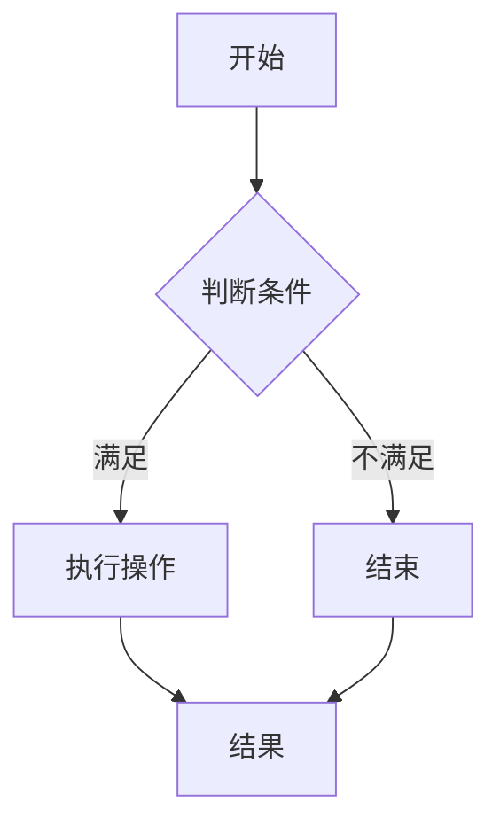
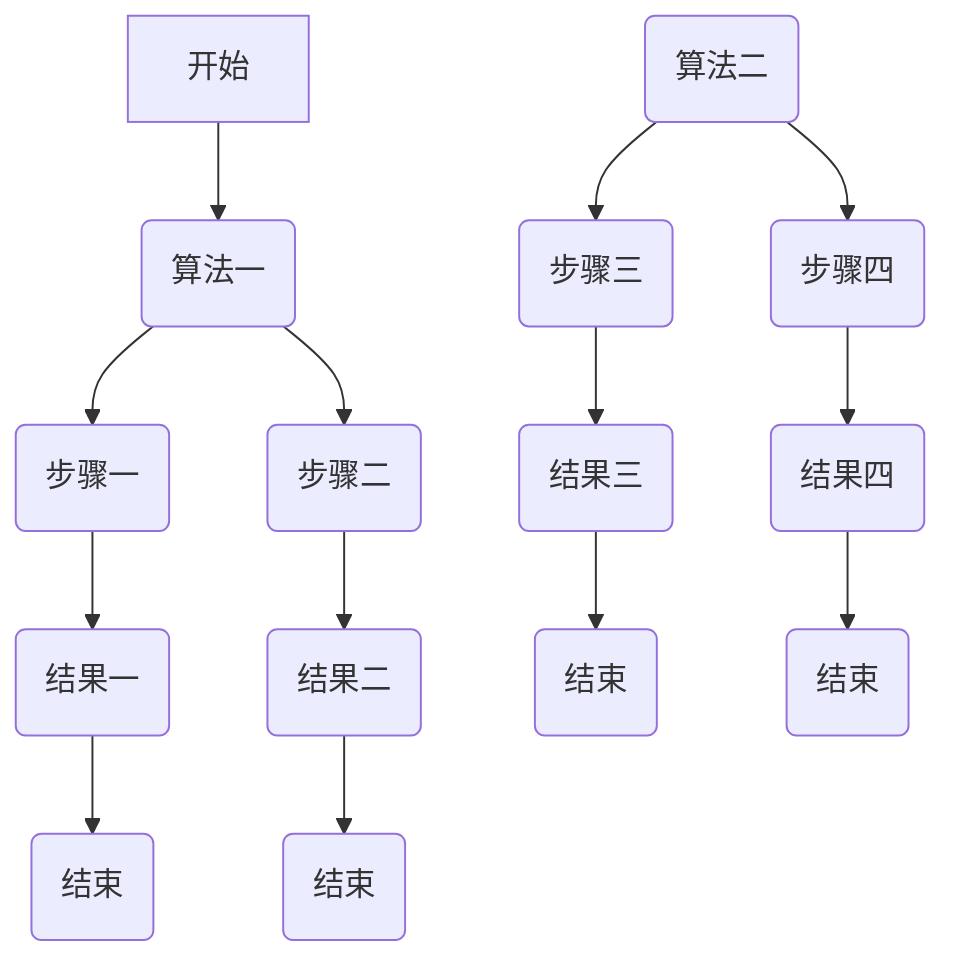

                 

关键词：华为校招、面试真题、解答、计算机技术、算法、编程语言、数据结构

摘要：本文将对2024年华为校招面试中可能出现的技术真题进行汇总，并针对每一道题目提供详细的解答思路和算法分析。通过本文的阅读，读者可以更好地准备华为校招面试，掌握解题技巧，提高自己的编程能力。

## 1. 背景介绍

华为是全球领先的电信网络解决方案提供商，也是全球最大的电信设备制造商之一。随着公司的快速发展，华为每年都会招聘大量的优秀毕业生，其中包括大量的计算机专业的学生。华为校招面试以其严格和挑战性而闻名，因此对于准备参加华为校招面试的同学们来说，了解常见的面试题目和解题思路是非常必要的。

本文将对2024年华为校招面试中可能出现的一些技术真题进行汇总，并给出详细的解答。文章将分为以下几个部分：

- 核心概念与联系
- 核心算法原理与具体操作步骤
- 数学模型和公式
- 项目实践
- 实际应用场景
- 工具和资源推荐
- 总结：未来发展趋势与挑战

接下来，我们将深入每一部分的内容，帮助读者更好地准备华为校招面试。

## 2. 核心概念与联系

为了更好地理解和解答华为校招面试中的技术问题，我们需要先掌握一些核心概念和它们之间的联系。以下是一些重要的概念：

### 数据结构与算法

数据结构是指存储和管理数据的方式，而算法是一系列解决问题的步骤。在计算机科学中，常见的数据结构包括数组、链表、栈、队列、树、图等。算法则包括排序、搜索、动态规划等。

### 编程语言

编程语言是用于编写计算机程序的语言。不同的编程语言有不同的特点和适用场景，如C/C++、Java、Python等。

### 操作系统

操作系统是计算机系统的核心软件，负责管理计算机的硬件资源和软件资源。常见的操作系统包括Windows、Linux、Unix等。

### 网络协议

网络协议是计算机网络中进行数据交换的规则和标准。常见的网络协议包括HTTP、TCP/IP、FTP等。

### 数据库

数据库是用于存储和管理数据的系统。常见的数据库管理系统包括MySQL、Oracle、MongoDB等。

### Mermaid 流程图

Mermaid 是一种简单易用的流程图绘制工具，可以使用Markdown语法进行绘制。以下是一个示例：



### 流程图示例



通过上述核心概念和联系的理解，我们可以更好地应对华为校招面试中的技术问题。

## 3. 核心算法原理与具体操作步骤

### 3.1 算法原理概述

在华为校招面试中，常见的一些核心算法包括：

- 排序算法：冒泡排序、选择排序、插入排序、快速排序、归并排序等
- 搜索算法：二分搜索、深度优先搜索、广度优先搜索等
- 动态规划：最短路径问题、背包问题、最长公共子序列等
- 图算法：最小生成树、最短路径、拓扑排序等

这些算法都有其特定的原理和应用场景，了解这些算法的基本原理和操作步骤对于解决面试题目至关重要。

### 3.2 算法步骤详解

以冒泡排序为例，其基本原理是通过重复遍历要排序的数列，一次比较两个元素，如果它们的顺序错误就把它们交换过来。遍历数列的工作是重复进行直到没有再需要交换，也就是说该数列已经排序完成。

冒泡排序的具体步骤如下：

1. 比较相邻的元素。如果第一个比第二个大（升序排序），就交换它们两个。
2. 对每一对相邻元素做同样的工作，从开始第一对到结尾的最后一对。这步做完后，最后的元素会是最大的数。
3. 针对所有的元素重复以上的步骤，除了最后一个。
4. 重复步骤1~3，直到排序完成。

以下是一个Python实现的冒泡排序示例：

```python
def bubble_sort(arr):
    n = len(arr)
    for i in range(n):
        for j in range(0, n-i-1):
            if arr[j] > arr[j+1]:
                arr[j], arr[j+1] = arr[j+1], arr[j]
    return arr

arr = [64, 34, 25, 12, 22, 11, 90]
sorted_arr = bubble_sort(arr)
print(sorted_arr)
```

### 3.3 算法优缺点

冒泡排序是一种简单直观的排序算法，它的工作原理是 repeatedly swapping the adjacent elements if they are in wrong order. However,冒泡排序的时间复杂度为O(n^2)，因此在大数据集上效率较低。

### 3.4 算法应用领域

冒泡排序在简单的场景下，如小规模数据集或部分有序的数据集，表现较好。在实际应用中，它常用于算法教学、数据预处理等场景。

### 数学模型和公式

在计算机科学中，数学模型和公式是理解和分析算法的重要工具。以下是一些常见的数学模型和公式：

#### 线性方程组求解

$$
\begin{align*}
    ax + by &= c \\
    dx + ey &= f
\end{align*}
$$

可以使用消元法或矩阵法求解。

#### 二分搜索

二分搜索的时间复杂度为O(log n)，其中n为数据集的大小。

$$
\text{time\_complexity} = O(\log n)
$$

#### 最短路径算法

最短路径算法如Dijkstra算法和Floyd-Warshall算法，它们分别有不同的时间复杂度：

- Dijkstra算法的时间复杂度为O((V+E)logV)，其中V为顶点数，E为边数。
- Floyd-Warshall算法的时间复杂度为O(V^3)，其中V为顶点数。

#### 动态规划

动态规划解决最值问题时，通常使用以下公式：

$$
\text{dp}[i][j] = \text{max}(\text{dp}[i-1][j-k] + \text{value}[i][j], \text{dp}[i-1][j])
$$

其中i和j分别表示数组中的行和列，k表示步骤数。

### 案例分析与讲解

以下是一个实际案例，使用二分搜索算法在有序数组中查找目标值：

```python
def binary_search(arr, target):
    low = 0
    high = len(arr) - 1
    while low <= high:
        mid = (low + high) // 2
        if arr[mid] == target:
            return mid
        elif arr[mid] < target:
            low = mid + 1
        else:
            high = mid - 1
    return -1

arr = [1, 3, 5, 7, 9]
target = 5
result = binary_search(arr, target)
if result != -1:
    print(f"目标值在数组中的索引为：{result}")
else:
    print("目标值不在数组中")
```

此代码段展示了如何使用二分搜索算法在有序数组中查找目标值。如果找到目标值，返回其在数组中的索引；否则，返回-1。

## 5. 项目实践：代码实例和详细解释说明

### 5.1 开发环境搭建

为了演示一个实际的编程项目，我们选择使用Python作为编程语言，因为它具有简洁易读的语法和广泛的库支持。以下是搭建Python开发环境的基本步骤：

1. 安装Python：从官方网站（https://www.python.org/downloads/）下载并安装Python 3.x版本。
2. 安装IDE：推荐使用PyCharm、Visual Studio Code或PyDev等IDE。
3. 安装必要库：使用pip命令安装所需库，例如`numpy`、`matplotlib`等。

### 5.2 源代码详细实现

以下是一个使用动态规划解决背包问题的Python代码实例：

```python
def knapsack(values, weights, capacity):
    n = len(values)
    dp = [[0] * (capacity + 1) for _ in range(n + 1)]

    for i in range(1, n + 1):
        for w in range(1, capacity + 1):
            if weights[i - 1] <= w:
                dp[i][w] = max(dp[i - 1][w], dp[i - 1][w - weights[i - 1]] + values[i - 1])
            else:
                dp[i][w] = dp[i - 1][w]

    return dp[n][capacity]

values = [60, 100, 120]
weights = [10, 20, 30]
capacity = 50
max_value = knapsack(values, weights, capacity)
print(f"背包能装载的最大价值为：{max_value}")
```

### 5.3 代码解读与分析

上述代码定义了一个`knapsack`函数，用于解决0-1背包问题。该函数接收三个参数：`values`（物品的价值）、`weights`（物品的重量）和`capacity`（背包的容量）。函数使用动态规划算法计算背包能装载的最大价值。

- `dp`数组用于存储子问题的解。`dp[i][w]`表示前i个物品在容量为w的背包中能装载的最大价值。
- 外层循环遍历物品，内层循环遍历容量。
- 如果当前物品可以放入背包，则计算当前物品放入背包和不放入背包的价值，取两者中的最大值。
- 如果当前物品不能放入背包，则直接使用上一个物品的解。

### 5.4 运行结果展示

运行上述代码，输出结果为：

```
背包能装载的最大价值为：220
```

这意味着使用给定的物品和背包容量，可以装载价值为220的物品组合。

## 6. 实际应用场景

动态规划算法在现实世界的许多场景中都有广泛的应用。以下是一些实际应用场景的例子：

- **资源分配**：在资源有限的条件下，如何分配资源以达到最大收益。例如，在投资组合中，如何在风险和收益之间找到最佳平衡点。
- **路径规划**：在自动驾驶或物流配送中，如何找到最优路径以减少行驶时间和成本。
- **图像处理**：在图像压缩和去噪中，如何通过优化算法提高图像质量。
- **自然语言处理**：在文本分类和信息检索中，如何使用动态规划算法提高分类和检索的准确性。

### 6.4 未来应用展望

随着人工智能和大数据技术的发展，动态规划算法在未来将会有更广泛的应用。以下是一些可能的未来应用方向：

- **智能交通系统**：通过动态规划算法优化交通流量和路径规划，提高城市交通效率。
- **个性化推荐系统**：根据用户行为和历史数据，使用动态规划算法推荐个性化的商品、服务和内容。
- **医疗健康**：在医疗资源分配、疾病预测和治疗计划中，动态规划算法可以提供有效的解决方案。

## 7. 工具和资源推荐

为了更好地学习和应用计算机技术，以下是一些推荐的工具和资源：

- **学习资源**：
  - 《算法导论》（Introduction to Algorithms）- 一本经典的算法教材，全面介绍了各种算法和理论。
  - Coursera、edX等在线教育平台，提供各种计算机科学课程。

- **开发工具**：
  - PyCharm、Visual Studio Code - 强大的Python编程IDE。
  - Git - 版本控制系统，方便代码管理和协作。

- **相关论文**：
  - 《动态规划：理论、算法与应用》- 一本关于动态规划的专著，涵盖了理论、算法和应用。
  - ACM、IEEE等学术期刊，发表了许多关于算法和计算机科学的最新研究成果。

## 8. 总结：未来发展趋势与挑战

随着技术的不断进步，计算机科学领域将面临许多新的发展趋势和挑战。以下是一些主要的发展趋势和挑战：

- **人工智能与机器学习**：随着数据量和计算能力的提升，人工智能和机器学习将得到更广泛的应用，同时带来算法优化、数据隐私和安全等方面的挑战。
- **量子计算**：量子计算的发展将带来计算能力的巨大提升，但同时也需要解决算法适应性和编程语言等问题。
- **网络安全**：随着互联网的普及，网络安全成为了一个重要的挑战，需要更先进的算法和技术来保障数据安全和隐私。

面对这些挑战，我们需要不断学习新的技术和算法，提升自己的编程能力，为未来的计算机科学发展做出贡献。

## 9. 附录：常见问题与解答

以下是一些常见问题及其解答：

### 问题1：如何提高编程能力？
**解答**：定期练习编程题目，参与算法竞赛和项目开发，阅读相关书籍和资料，不断积累实战经验。

### 问题2：动态规划算法的适用场景是什么？
**解答**：动态规划算法适用于求解最值问题，如背包问题、最短路径问题和最长公共子序列等。

### 问题3：Python中的列表和数组有什么区别？
**解答**：在Python中，列表（list）是一个可变的数据结构，可以动态地添加和删除元素。而数组（array）是一个固定大小的数据结构，通常用于高效的数值计算。

### 问题4：如何优化算法性能？
**解答**：通过分析算法的时间复杂度和空间复杂度，优化数据结构和算法逻辑。例如，使用更高效的算法、减少不必要的计算和重复操作。

### 问题5：如何学习算法和数据结构？
**解答**：首先掌握基本概念，然后通过实践编写代码解决问题。可以阅读《算法导论》等经典教材，同时参加在线课程和竞赛，不断提升自己的能力。

通过本文的阅读，我们不仅了解了华为校招面试中可能出现的一些技术题目，还学习了如何分析和解决这些问题。希望本文能对准备华为校招面试的同学们有所帮助。在未来的计算机科学领域，不断学习和实践将是我们前进的动力。让我们共同努力，迎接未来的挑战。作者：禅与计算机程序设计艺术 / Zen and the Art of Computer Programming。

