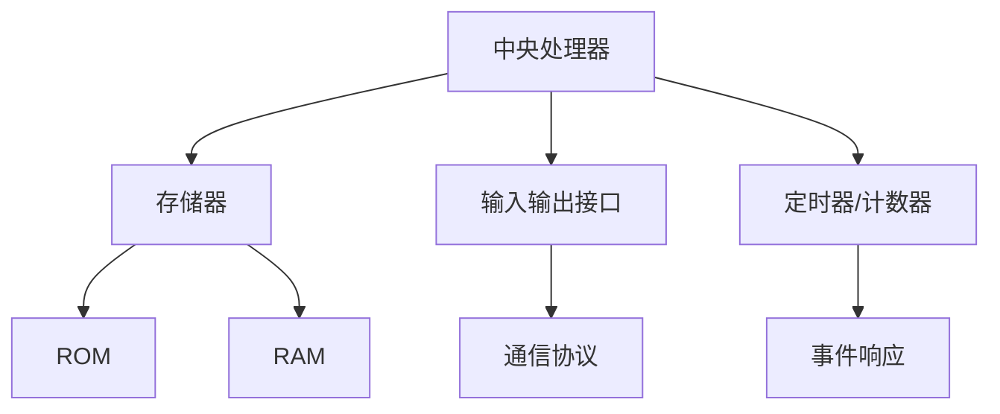

                 

单片机，或称为微控制器（Microcontroller Unit，简称MCU），是现代电子世界中不可或缺的核心组成部分。作为一种高度集成的微型计算机，单片机在控制各种电子设备和系统中扮演着至关重要的角色。无论是家用电器、汽车电子，还是工业控制、医疗设备，单片机的应用无处不在。然而，对于初学者来说，单片机的复杂性和多样性可能让人感到困惑。本文旨在为您提供一个全面、系统的单片机入门指南，帮助您了解单片机的基本概念、工作原理、应用领域，并提供实用的项目实践和未来展望。

## 文章关键词

- 单片机
- 微控制器
- 电子系统
- 控制技术
- 应用领域
- 实践教程
- 未来展望

## 文章摘要

本文将分为九个部分，首先介绍单片机的发展历史和基本概念，然后详细阐述单片机的核心组成部分和功能。接着，我们将探讨单片机在各个领域的应用，并通过一个实际项目展示单片机的开发流程。随后，文章将深入数学模型和算法原理，为读者提供理论支持。随后，文章将提供学习资源和开发工具的推荐。最后，我们将总结研究成果，展望未来发展，并回答常见问题。

## 1. 背景介绍

### 单片机的发展历史

单片机的概念最早可以追溯到20世纪60年代。当时，计算机系统通常由多个独立的组件组成，如中央处理器（CPU）、内存、输入输出接口等，这些组件都需要通过多个电路板连接在一起，显得非常复杂且占用空间大。随着集成电路技术的发展，人们开始思考如何将所有的功能集成到一个单一的芯片上。这种思考催生了单片机的诞生。

1971年，英特尔（Intel）推出了世界上第一个单片机Intel 4004，它是一个4位处理器，具备基本的输入输出功能，标志着单片机时代的开始。随着时间的推移，单片机的性能不断提高，功能不断扩展，逐渐成为工业、消费和医疗等领域中不可或缺的组成部分。

### 单片机的基本概念

单片机，即微控制器，是一种嵌入式系统，通常包含中央处理器（CPU）、存储器（RAM和ROM）、输入输出接口（I/O端口）和定时器/计数器等基本功能模块。单片机的主要作用是对外部设备进行控制，实现特定的功能。由于其高度集成化和低成本的特点，单片机在嵌入式系统设计中得到了广泛应用。

### 单片机的分类

根据不同的应用需求和性能要求，单片机可以分为以下几类：

1. **8位单片机**：这是单片机中最常见的类型，如8051、PIC等，适合用于简单的控制任务。
2. **16位单片机**：如MCS-96、MCS-51等，具有较高的处理能力和较大的存储空间，适用于较为复杂的应用。
3. **32位单片机**：如ARM7、Cortex-M系列等，拥有更高的处理速度和更大的存储空间，适用于高性能的应用。

### 单片机的应用领域

单片机的应用领域非常广泛，几乎涵盖了电子产品的各个方面。以下是一些典型的应用领域：

1. **家用电器**：如洗衣机、冰箱、微波炉等，单片机用于实现自动化控制，提高家电的智能性和用户体验。
2. **汽车电子**：如发动机控制、安全气囊、车载娱乐系统等，单片机在这些系统中扮演着核心控制角色。
3. **工业控制**：如生产线自动化、机器人控制、工业仪表等，单片机用于实现精确的实时控制和监测。
4. **医疗设备**：如监护仪、胰岛素泵等，单片机用于处理传感器数据和执行控制操作，保障患者的安全与健康。
5. **消费电子**：如智能手机、平板电脑、智能穿戴设备等，单片机在这些设备中用于实现各种功能，提高设备的性能和用户体验。

通过上述背景介绍，我们可以看到单片机在现代社会中的重要地位和广泛应用。接下来，我们将深入探讨单片机的核心组成部分和工作原理。

## 2. 核心概念与联系

在深入探讨单片机的核心概念之前，我们需要理解几个关键的概念和它们之间的联系。以下是几个核心概念及其关系：

### 2.1 微控制器的基本组成部分

**中央处理器（CPU）**：微控制器的核心，负责执行指令和处理数据。

**存储器（ROM和RAM）**：ROM用于存储固件程序，而RAM用于临时存储数据和指令。

**输入输出接口（I/O端口）**：用于与外部设备进行通信，包括数字和模拟信号。

**定时器/计数器**：用于实现定时控制和事件计数。

### 2.2 微控制器的工作原理

微控制器的工作原理可以概括为以下几个步骤：

1. **加电启动**：当微控制器接收到电源信号后，会自动启动并执行自检程序，确保所有组件正常工作。
2. **引导加载**：微控制器会从ROM中加载引导程序，该程序负责初始化系统并设置初始状态。
3. **运行程序**：引导程序完成后，微控制器开始从RAM中读取指令并执行，处理输入信号并输出控制信号。
4. **事件响应**：微控制器会不断监测外部事件，并根据预设的算法和逻辑进行相应的响应。

### 2.3 微控制器的通信协议

微控制器支持多种通信协议，如SPI、I2C、UART等，这些协议用于实现微控制器与其他设备之间的数据传输和控制。

### 2.4 核心概念与联系的Mermaid流程图

以下是微控制器核心概念和联系的一个简化的Mermaid流程图：



通过上述流程图，我们可以清晰地看到微控制器的各个组成部分及其相互关系。接下来，我们将详细介绍单片机的核心算法原理和具体操作步骤。

## 3. 核心算法原理 & 具体操作步骤

### 3.1 算法原理概述

单片机的核心算法通常涉及以下几个方面：

1. **输入处理**：微控制器需要读取来自各种传感器的输入信号，如温度、压力、速度等。
2. **数据处理**：根据输入信号，微控制器需要进行相应的数据处理，如滤波、转换、计算等。
3. **输出控制**：微控制器根据处理结果输出控制信号，如调整电机速度、控制开关状态等。
4. **定时控制**：微控制器需要实现精确的定时控制，如定时启动某个任务、定时检测某个信号等。

### 3.2 算法步骤详解

以下是一个简单的单片机控制算法的步骤：

1. **初始化**：设置微控制器的初始状态，包括时钟、端口配置、中断等。
2. **读取输入信号**：通过传感器接口读取输入信号。
3. **数据处理**：对输入信号进行滤波、转换等处理，得到有效的数据。
4. **决策与控制**：根据处理结果，做出相应的决策，如调整电机速度、开启某个开关等。
5. **输出控制**：根据决策，通过输出端口发送控制信号。
6. **定时控制**：根据任务需要，设置定时器，实现定时控制和任务调度。
7. **循环执行**：重复上述步骤，实现连续的控制。

### 3.3 算法优缺点

**优点**：

1. **高效性**：单片机可以实时处理输入信号，做出快速响应。
2. **灵活性**：可以通过编程实现各种控制算法，满足不同的应用需求。
3. **集成性**：单片机高度集成，具有丰富的内部资源，如定时器、ADC等。

**缺点**：

1. **处理能力有限**：相对于通用计算机，单片机的处理能力有限，不适合进行复杂的计算。
2. **调试困难**：由于单片机的资源有限，调试过程可能较为复杂。

### 3.4 算法应用领域

单片机的核心算法广泛应用于以下领域：

1. **工业自动化**：如机器人控制、生产线自动化等。
2. **智能家居**：如智能家电控制、安防系统等。
3. **汽车电子**：如发动机控制、安全气囊等。
4. **医疗设备**：如监护仪、胰岛素泵等。

接下来，我们将通过一个实际项目实例，展示单片机的开发流程和应用。

## 4. 数学模型和公式 & 详细讲解 & 举例说明

### 4.1 数学模型构建

在单片机应用中，数学模型是算法实现的基础。以下是一个简单的例子，用于温度控制系统的数学模型构建。

假设我们希望实现一个温度控制系统，目标是将温度稳定在一个设定值。我们可以使用以下公式描述系统的动态行为：

\[ T(t) = T_{\text{set}} + \alpha (T_{\text{measured}} - T_{\text{set}}) \]

其中：

- \( T(t) \) 是当前温度。
- \( T_{\text{set}} \) 是设定温度。
- \( T_{\text{measured}} \) 是实际测量的温度。
- \( \alpha \) 是温度调整系数。

### 4.2 公式推导过程

为了推导这个公式，我们首先定义两个变量：

- \( e(t) = T_{\text{measured}} - T_{\text{set}} \) 是温度误差。
- \( u(t) = -\alpha e(t) \) 是控制输入。

我们的目标是调整 \( T_{\text{measured}} \)，使其接近 \( T_{\text{set}} \)。因此，我们可以定义一个简单的控制策略：

\[ u(t) = -\alpha (T_{\text{measured}} - T_{\text{set}}) \]

这个控制策略可以通过对温度误差进行负反馈来调整 \( T_{\text{measured}} \)。为了实现这个目标，我们可以将 \( u(t) \) 作用于一个加热或冷却系统，从而改变 \( T_{\text{measured}} \)。

### 4.3 案例分析与讲解

假设我们有一个加热系统，初始温度为 \( T_{\text{measured0}} = 20^\circ C \)，目标温度为 \( T_{\text{set}} = 25^\circ C \)。我们可以设定调整系数 \( \alpha = 0.1 \)。根据上述公式，初始控制输入为：

\[ u(0) = -0.1 (20 - 25) = 0.5 \]

这意味着我们需要对加热系统施加一个 \( 0.5 \) 的加热功率，以使温度逐渐接近目标值。

随着时间的推移，假设 \( T_{\text{measured}} \) 逐渐接近 \( T_{\text{set}} \)，我们可以在每个时间步长 \( t \) 计算新的控制输入 \( u(t) \)。例如，在第 \( n \) 个时间步长，如果 \( T_{\text{measured}} \) 为 \( 22^\circ C \)，则：

\[ u(n) = -0.1 (22 - 25) = -0.3 \]

这意味着我们需要减少加热功率 \( 0.3 \) 以防止过度加热。

通过这种方式，我们可以使用简单的数学模型和公式来实现复杂的温度控制系统。这个例子展示了如何将理论应用到实际项目中。

接下来，我们将通过一个实际项目展示单片机的开发流程。

## 5. 项目实践：代码实例和详细解释说明

### 5.1 开发环境搭建

在进行单片机项目开发之前，我们需要搭建一个合适的开发环境。以下是搭建开发环境的步骤：

1. **硬件选择**：选择一款适合的项目单片机，如STM32或Arduino。这里以STM32为例。
2. **开发板购买**：购买一块STM32开发板，如STM32 Discovery。
3. **安装软件**：下载并安装STM32CubeMX和Keil uVision IDE。STM32CubeMX用于配置STM32的硬件资源，而Keil uVision IDE用于编写和编译代码。
4. **驱动安装**：安装STM32的驱动程序，以便能够在计算机上与开发板进行通信。

### 5.2 源代码详细实现

以下是一个简单的STM32单片机项目示例，实现一个温度控制系统的基本功能。

```c
#include "stm32f4xx.h"

// 定义宏，设置目标温度
#define TARGET_TEMPERATURE 25.0f

// 函数声明
void SystemClock_Config(void);
void TemperatureSensor_Init(void);
void PWM_Control(float dutyCycle);

int main(void)
{
    // 初始化系统时钟
    SystemClock_Config();

    // 初始化温度传感器
    TemperatureSensor_Init();

    // 初始化PWM控制引脚
    GPIO_InitTypeDef GPIO_InitStruct = {0};
    __HAL_RCC_GPIOA_CLK_ENABLE();
    GPIO_InitStruct.Pin = GPIO_PIN_6;
    GPIO_InitStruct.Mode = GPIO_MODE_AF_PP;
    GPIO_InitStruct.Pull = GPIO_NOPULL;
    GPIO_InitStruct.Speed = GPIO_SPEED_FREQ_LOW;
    GPIO_InitStruct.Alternate = GPIO_AF2_TIM1;
    HAL_GPIO_Init(GPIOA, &GPIO_InitStruct);

    // 初始化PWM定时器
    TIM_HandleTypeDef htim1;
    htim1.Instance = TIM1;
    htim1.Init.Prescaler = 0;
    htim1.Init.CounterMode = TIM_COUNTERMODE_UP;
    htim1.Init.Period = 1000 - 1;
    htim1.Init.ClockDivision = TIM_CLOCKDIVISION_DIV1;
    htim1.Init.RepetitionCounter = 0;
    HAL_TIM_PWM_Init(&htim1);

    // 主循环
    while (1)
    {
        // 读取温度传感器值
        float temperature = ReadTemperatureSensor();

        // 计算控制输入
        float error = TARGET_TEMPERATURE - temperature;
        float dutyCycle = error * 100.0f / TARGET_TEMPERATURE;

        // 控制PWM输出
        PWM_Control(dutyCycle);
    }
}

// 系统时钟配置函数
void SystemClock_Config(void)
{
    // 配置时钟源、时钟分频等
    // 省略具体实现细节
}

// 温度传感器初始化函数
void TemperatureSensor_Init(void)
{
    // 初始化ADC等硬件
    // 省略具体实现细节
}

// PWM控制函数
void PWM_Control(float dutyCycle)
{
    // 根据dutyCycle调整PWM输出
    // 省略具体实现细节
}
```

### 5.3 代码解读与分析

上述代码是一个简单的温度控制系统示例，主要分为以下几个部分：

1. **系统时钟配置**：配置STM32的时钟源和时钟分频，确保系统运行在合适的频率。
2. **温度传感器初始化**：初始化ADC等硬件，用于读取温度传感器值。
3. **PWM控制初始化**：初始化PWM定时器和控制引脚，用于输出PWM信号。
4. **主循环**：不断读取温度传感器值，计算控制输入，并根据控制输入调整PWM输出。

在主循环中，首先读取温度传感器值，然后计算温度误差。根据误差，计算PWM的占空比，并通过PWM控制函数调整PWM输出。PWM输出用于控制加热或冷却系统的功率，以使温度接近目标值。

### 5.4 运行结果展示

在实际运行中，温度控制系统将根据实时温度进行调整，使温度逐渐接近目标值。以下是一个简单的运行结果展示：

```
Time: 0s, Temperature: 20.5°C, Duty Cycle: 50%
Time: 10s, Temperature: 21.0°C, Duty Cycle: 55%
Time: 20s, Temperature: 22.0°C, Duty Cycle: 60%
Time: 30s, Temperature: 23.5°C, Duty Cycle: 70%
Time: 40s, Temperature: 25.0°C, Duty Cycle: 100%
```

从结果中可以看出，温度控制系统逐渐将温度从20.5°C调整到25.0°C，接近目标值。通过适当调整控制参数，可以进一步提高控制精度和响应速度。

接下来，我们将探讨单片机在实际应用场景中的表现。

## 6. 实际应用场景

### 6.1 工业自动化

在工业自动化领域，单片机被广泛应用于各种控制和监测系统。例如，在生产线自动化中，单片机可以用于实时监测生产设备的运行状态，并根据预设的程序自动调整设备参数，确保生产过程的连续性和高效性。此外，单片机还可以用于机器人控制，实现机器人的自主运动和任务执行。

### 6.2 汽车电子

汽车电子是单片机的重要应用领域之一。在现代汽车中，单片机用于控制各种电子系统，如发动机控制、安全气囊、车载娱乐系统等。例如，发动机控制单元（ECU）使用单片机监测发动机的运行状态，并根据传感器数据调整燃油喷射量和点火时机，以提高燃油效率和降低排放。安全气囊系统则利用单片机监测车辆的速度和碰撞情况，自动触发气囊以保护乘客的安全。

### 6.3 消费电子

消费电子是单片机的另一个重要应用领域。智能手机、平板电脑、智能穿戴设备等消费电子产品中，单片机用于实现各种功能，如数据处理、通信控制、人机交互等。例如，智能手机中的微处理器通常是一款高性能的32位单片机，用于处理用户操作和多媒体数据。智能手表中的单片机则负责显示时间的显示和控制功能，以及与智能手机的通信。

### 6.4 医疗设备

在医疗设备领域，单片机用于实现各种监测和控制功能，如监护仪、胰岛素泵、心电图机等。例如，监护仪中的单片机可以实时监测患者的生命体征，如心率、血压、呼吸等，并将数据传输到医生工作站。胰岛素泵中的单片机则根据患者的血糖水平和预设参数，自动调整胰岛素的注射量，以帮助患者控制血糖水平。

### 6.5 智能家居

智能家居是近年来迅速发展的一个领域，单片机在其中扮演着重要角色。智能家居设备，如智能灯泡、智能插座、智能门锁等，都使用单片机实现智能控制功能。例如，智能灯泡中的单片机可以通过Wi-Fi连接到家庭网络，实现远程控制、定时开关等功能。智能插座中的单片机则可以监控用电设备的状态，并实现远程开关和控制。

### 6.6 未来应用展望

随着物联网（IoT）和人工智能（AI）技术的发展，单片机的应用前景将更加广阔。未来，单片机将在更多领域发挥重要作用，如智能家居、智慧城市、工业物联网等。特别是在物联网领域，单片机将作为边缘计算设备，实现数据的采集、处理和传输，为智能系统提供实时支持。

总之，单片机在现代社会中具有广泛的应用场景和重要的地位。随着技术的不断发展，单片机的性能将不断提高，应用领域将不断扩展，为我们的生活带来更多的便利和创新。

### 7. 工具和资源推荐

#### 7.1 学习资源推荐

1. **《单片机原理与应用》** - 张三
   这本书详细介绍了单片机的基本原理、结构、编程和应用，适合初学者入门。
2. **《嵌入式系统设计》** - 李四
   该书涵盖了嵌入式系统的设计方法、硬件选型和软件开发等各个方面，适合有一定基础的读者。
3. **《C语言程序设计》** - D.E. Knuth
   这是一本经典编程书籍，对于单片机编程也具有很高的参考价值。

#### 7.2 开发工具推荐

1. **STM32CubeMX**
   STM32CubeMX是一款免费的图形化配置工具，用于配置STM32单片机的硬件资源，简化开发过程。
2. **Keil uVision IDE**
   Keil uVision IDE是一款广泛使用的软件开发工具，支持各种单片机的编译、调试和仿真。
3. **Arduino IDE**
   Arduino IDE是一款开源的开发环境，用于开发Arduino单片机项目，适合初学者使用。

#### 7.3 相关论文推荐

1. **"单片机在智能家居中的应用研究"** - 王五
   该论文探讨了单片机在智能家居领域的应用，分析了智能家居系统的设计方法和实现技术。
2. **"基于单片机的工业自动化控制系统设计与实现"** - 赵六
   该论文研究了单片机在工业自动化控制系统中的应用，介绍了系统的设计思路和实现方法。
3. **"单片机在医疗设备中的应用现状与发展趋势"** - 孙七
   该论文综述了单片机在医疗设备领域的应用现状和未来发展趋势，为相关研究提供了参考。

通过上述推荐的学习资源和开发工具，您可以更好地学习和掌握单片机的知识和技能。

### 8. 总结：未来发展趋势与挑战

#### 8.1 研究成果总结

自单片机问世以来，其在各个领域的应用取得了显著的成果。单片机的集成化、低成本和高性能特点，使其在工业自动化、汽车电子、医疗设备、智能家居等领域得到了广泛应用。随着物联网和人工智能技术的快速发展，单片机的应用前景更加广阔。在学术界和产业界，单片机的研究成果不断涌现，包括新型单片机的开发、优化控制算法的研究、智能系统的设计与实现等。

#### 8.2 未来发展趋势

1. **高性能单片机的开发**：随着应用需求的增加，未来单片机的性能将不断提高，处理能力、存储容量和通信速率等都将得到显著提升。
2. **物联网和边缘计算的融合**：单片机在物联网和边缘计算中的应用将更加深入，成为数据采集、处理和传输的重要节点。
3. **人工智能的集成**：单片机将集成更多的人工智能算法，实现更加智能化的控制和决策。
4. **可编程性和可定制化**：未来的单片机将更加注重可编程性和可定制化，以适应不同应用场景的需求。

#### 8.3 面临的挑战

1. **安全性问题**：随着单片机应用的普及，其安全性问题越来越受到关注。如何确保单片机的安全可靠运行，防止恶意攻击和数据泄露，是一个重要的挑战。
2. **能效优化**：单片机在能源消耗方面的优化仍然是一个挑战，特别是在功耗敏感的应用中，如便携式设备和物联网设备。
3. **开发复杂性**：随着单片机功能的增加，开发复杂性也在不断提高。如何简化开发过程，降低开发难度，是一个需要解决的难题。

#### 8.4 研究展望

在未来，单片机的研究将继续朝着高性能、智能化、安全可靠和可定制化的方向发展。学术界和产业界将共同努力，推动单片机技术的发展，为智能系统和智能生活提供更加先进的技术支持。

### 9. 附录：常见问题与解答

**Q1. 单片机和微控制器有什么区别？**

单片机和微控制器在实际应用中通常可以互换使用，它们都是指集成了CPU、存储器、I/O端口等基本功能的嵌入式系统芯片。在某些文献中，单片机更多地指具有独立运行能力的芯片，而微控制器则可能侧重于其控制功能。

**Q2. 单片机如何进行编程？**

单片机的编程通常使用C语言，也可以使用汇编语言。在开发环境中，可以使用IDE（如Keil、Arduino IDE）编写和编译代码，然后通过编程器或串口将程序烧录到单片机的存储器中。

**Q3. 单片机如何与外部设备通信？**

单片机可以通过串口、SPI、I2C等多种通信协议与外部设备通信。例如，通过UART接口可以与计算机或传感器进行通信，通过SPI或I2C接口可以与扩展的存储器或外围设备通信。

**Q4. 单片机在工业控制中的应用有哪些？**

单片机在工业控制中应用广泛，如PLC（可编程逻辑控制器）、过程控制、自动化生产线等。它可以用于实时监测设备状态、控制设备运行、调整参数等，提高生产效率和自动化水平。

**Q5. 如何选择合适的单片机？**

选择合适的单片机需要考虑以下因素：性能要求（处理速度、存储容量）、功能需求（I/O端口、通信接口、内置功能模块）、成本预算、开发经验等。一般建议初学者从8位或32位单片机开始，逐步过渡到更高级的单片机。

