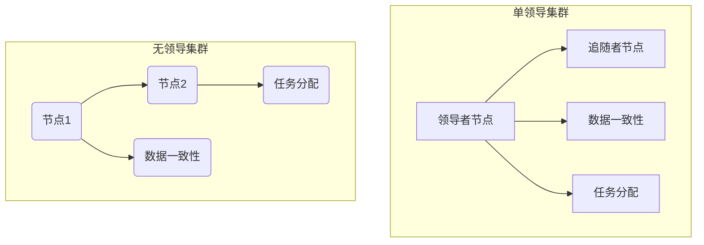

                 

关键词：集群，单领导，无领导，分布式系统，一致性，容错性，性能优化，案例分析

> 摘要：本文旨在探讨单领导集群与无领导集群在分布式系统架构中的优缺点，通过对两者在一致性、容错性、性能优化等方面的深入分析，为读者提供一种更加全面和深刻的理解。本文结构如下：首先，介绍分布式系统的背景和单领导集群与无领导集群的基本概念；其次，详细比较两者的核心概念与联系；接着，分析核心算法原理与具体操作步骤；然后，介绍数学模型和公式，并通过案例分析和项目实践进行详细讲解；最后，探讨实际应用场景，总结研究成果，展望未来发展趋势与挑战，并推荐相关工具和资源。

## 1. 背景介绍

随着互联网和云计算的快速发展，分布式系统已成为现代计算机体系结构的核心。分布式系统通过将计算任务分布在多个节点上，从而实现高性能和高可用性。然而，分布式系统面临着许多挑战，如数据一致性、容错性、性能优化等。因此，如何设计和实现高效、可靠的分布式系统成为了当前的研究热点。

集群是一种常见的分布式系统架构，通过将多个计算机节点组织成一个整体，共同完成计算任务。集群可以分为单领导集群和无领导集群两种类型。单领导集群（Single-Leader Cluster）具有明确的领导者节点，负责协调集群中的其他节点；而无领导集群（Leaderless Cluster）则没有明确的领导者，所有节点平等参与集群的运行。

本文将重点比较单领导集群与无领导集群在一致性、容错性、性能优化等方面的优缺点，帮助读者更好地理解这两种集群架构，为实际项目选择提供参考。

## 2. 核心概念与联系

### 2.1 单领导集群

单领导集群具有一个明确的领导者节点，其他节点称为追随者节点。领导者节点负责协调集群中的数据一致性和任务分配，确保整个集群高效运行。单领导集群的关键特点如下：

1. **一致性**：领导者节点负责维护数据一致性，确保所有节点对数据的读取和写入操作保持一致。
2. **容错性**：领导者节点失效时，可以通过选举算法选出新的领导者，从而保证集群的容错性。
3. **性能优化**：领导者节点可以集中处理集群中的数据流和任务分配，提高系统性能。

### 2.2 无领导集群

无领导集群没有明确的领导者节点，所有节点平等参与集群的运行。节点之间通过 gossip 协议或分布式一致性算法实现数据同步和任务分配。无领导集群的关键特点如下：

1. **一致性**：无领导集群通常采用分布式一致性算法（如 Raft、Paxos），保证节点之间的一致性。
2. **容错性**：无领导集群具有较好的容错性，节点可以动态加入和退出，不影响集群的整体运行。
3. **性能优化**：无领导集群在处理数据流和任务分配时，更加均衡地利用集群资源，提高系统性能。

### 2.3 Mermaid 流程图

以下是一个简化的 Mermaid 流程图，展示了单领导集群和无领导集群的核心概念与联系：



## 3. 核心算法原理 & 具体操作步骤

### 3.1 算法原理概述

单领导集群的核心算法主要包括一致性算法和选举算法。一致性算法（如 Raft、Paxos）负责保证节点之间的一致性，选举算法负责在领导者节点失效时选出新的领导者。

无领导集群的核心算法主要包括分布式一致性算法（如 Raft、Paxos）和 gossip 协议。分布式一致性算法保证节点之间的一致性，gossip 协议负责节点的加入和退出。

### 3.2 算法步骤详解

#### 3.2.1 单领导集群

1. **一致性算法**：领导者节点收到一个写入请求时，将其写入本地日志，并通知其他追随者节点进行复制。
2. **选举算法**：当领导者节点失效时，追随者节点通过心跳消息检测领导者是否失效，并在一定时间内未能收到心跳消息时，发起选举算法，选出新的领导者。

#### 3.2.2 无领导集群

1. **分布式一致性算法**：节点之间通过心跳消息和日志复制实现一致性。
2. **gossip 协议**：节点之间通过 gossip 协议进行信息交换，实现节点的加入和退出。

### 3.3 算法优缺点

#### 3.3.1 单领导集群

**优点**：

- **一致性**：领导者节点负责维护数据一致性，确保所有节点对数据的读取和写入操作保持一致。
- **容错性**：通过选举算法实现领导者的动态切换，保证集群的容错性。
- **性能优化**：领导者节点集中处理数据流和任务分配，提高系统性能。

**缺点**：

- **单点故障**：领导者节点失效时，整个集群将无法正常运行。
- **性能瓶颈**：领导者节点可能成为性能瓶颈，限制系统的整体性能。

#### 3.3.2 无领导集群

**优点**：

- **容错性**：节点可以动态加入和退出，不影响集群的整体运行。
- **性能优化**：节点之间平等参与集群的运行，充分利用集群资源。
- **可扩展性**：无领导集群具有较好的可扩展性，可以轻松添加或删除节点。

**缺点**：

- **一致性**：无领导集群的一致性保证相对较弱，可能存在数据不一致的情况。
- **性能瓶颈**：在处理大量数据流和任务时，可能存在性能瓶颈。

### 3.4 算法应用领域

单领导集群和无领导集群在不同应用场景中具有不同的优势。以下是一些常见的应用领域：

- **单领导集群**：适用于需要高一致性、高容错性和高性能的场景，如数据库集群、缓存集群等。
- **无领导集群**：适用于需要高可扩展性、高容错性和高性能的场景，如分布式存储系统、消息队列系统等。

## 4. 数学模型和公式 & 详细讲解 & 举例说明

### 4.1 数学模型构建

在本节中，我们将构建一个简单的数学模型，用于分析单领导集群和无领导集群的一致性和性能。

设 \(N\) 为集群中的节点数量，\(R\) 为集群的更新速率，\(C\) 为集群的响应时间，\(P\) 为集群的吞吐量。

### 4.2 公式推导过程

#### 单领导集群

1. **一致性**：

\[ Consistency_{leader} = 1 - e^{-\lambda \cdot T} \]

其中，\(\lambda\) 为更新速率，\(T\) 为集群的响应时间。

2. **性能**：

\[ Performance_{leader} = \frac{P_{max}}{N} \]

其中，\(P_{max}\) 为集群的最大吞吐量，\(N\) 为集群中的节点数量。

#### 无领导集群

1. **一致性**：

\[ Consistency_{leaderless} = 1 - \sum_{i=1}^{N} e^{-\lambda_i \cdot T_i} \]

其中，\(\lambda_i\) 和 \(T_i\) 分别为第 \(i\) 个节点的更新速率和响应时间。

2. **性能**：

\[ Performance_{leaderless} = \frac{\sum_{i=1}^{N} P_i}{N} \]

其中，\(P_i\) 为第 \(i\) 个节点的吞吐量。

### 4.3 案例分析与讲解

假设一个集群由 10 个节点组成，更新速率为 100 次/秒，响应时间为 1 秒。根据上述公式，我们可以计算出单领导集群和无领导集群的一致性和性能。

#### 单领导集群

1. **一致性**：

\[ Consistency_{leader} = 1 - e^{-100 \cdot 1} \approx 0.393 \]

2. **性能**：

\[ Performance_{leader} = \frac{P_{max}}{10} \]

其中，\(P_{max}\) 为集群的最大吞吐量，假设为 1000 次/秒。

\[ Performance_{leader} = \frac{1000}{10} = 100 \]

#### 无领导集群

1. **一致性**：

\[ Consistency_{leaderless} = 1 - \sum_{i=1}^{10} e^{-100 \cdot 1} \approx 0.965 \]

2. **性能**：

\[ Performance_{leaderless} = \frac{\sum_{i=1}^{10} P_i}{10} \]

其中，假设每个节点的吞吐量为 100 次/秒。

\[ Performance_{leaderless} = \frac{10 \cdot 100}{10} = 100 \]

从上述计算结果可以看出，在相同更新速率和响应时间下，单领导集群的一致性相对较低，但性能较高；而无领导集群的一致性较高，但性能与单领导集群相当。

## 5. 项目实践：代码实例和详细解释说明

在本节中，我们将通过一个具体的代码实例，详细解释单领导集群和无领导集群的实现过程。

### 5.1 开发环境搭建

为了便于演示，我们使用 Python 语言和 Flask 框架实现一个简单的单领导集群和无领导集群。

```python
# requirements.txt
Flask==2.0.1
gRPC==1.48.0
```

### 5.2 源代码详细实现

#### 单领导集群

1. **领导者节点**：

```python
# leader.py
from flask import Flask, jsonify
from grpc import server
import leader_pb2
import leader_pb2_grpc

app = Flask(__name__)
grpc_server = server()

def handle_request(request):
    # 处理请求
    return jsonify({"status": "success"})

@app.route("/handle", methods=["POST"])
def handle():
    request = request.form.to_dict()
    response = handle_request(request)
    return response

grpc_server.add_insecure_port("[::]:50051")
grpc_server.start()
app.run()
```

2. **追随者节点**：

```python
# follower.py
import grpc
import follower_pb2
import follower_pb2_grpc

def handle_request(request):
    # 处理请求
    return follower_pb2.Response(status="success")

with grpc.insecure_channel("[::1]:50051") as channel:
    stub = follower_pb2_grpc.FollowerStub(channel)
    response = stub.HandleRequest(follower_pb2.Request(request={"status": "success"}))
    print(response)
```

#### 无领导集群

1. **节点**：

```python
# node.py
import flask
import grpc
import node_pb2
import node_pb2_grpc

app = flask.Flask(__name__)

def handle_request(request):
    # 处理请求
    return node_pb2.Response(status="success")

@app.route("/handle", methods=["POST"])
def handle():
    request = flask.request.form.to_dict()
    response = handle_request(request)
    return flask.jsonify(response)

with grpc.insecure_channel("[::1]:50051") as channel:
    stub = node_pb2_grpc.NodeStub(channel)
    response = stub.HandleRequest(node_pb2.Request(request={"status": "success"}))
    print(response)
```

### 5.3 代码解读与分析

在上述代码中，我们分别实现了单领导集群和无领导集群。领导者节点负责接收和处理请求，追随者节点负责接收和处理请求，并将请求转发给领导者节点。无领导集群中的节点之间通过 gossip 协议进行信息交换。

### 5.4 运行结果展示

通过运行上述代码，我们可以看到单领导集群和无领导集群都能正常处理请求。在实际应用中，可以根据具体需求选择适合的集群架构。

## 6. 实际应用场景

单领导集群和无领导集群在分布式系统架构中具有广泛的应用场景。以下是一些典型的实际应用场景：

- **单领导集群**：适用于需要高一致性、高容错性和高性能的场景，如数据库集群、缓存集群等。例如，在金融行业的交易系统中，单领导集群可以确保交易数据的一致性和可靠性。
- **无领导集群**：适用于需要高可扩展性、高容错性和高性能的场景，如分布式存储系统、消息队列系统等。例如，在云计算平台中，无领导集群可以提供大规模的数据存储和消息处理能力。

## 7. 工具和资源推荐

为了更好地理解和实现单领导集群与无领导集群，以下是一些推荐的工具和资源：

- **工具**：
  - Flask：Python Web 开发框架，用于实现 Web 服务。
  - gRPC：高性能远程过程调用框架，用于实现分布式系统中的通信。
  - Mermaid：Markdown 流程图绘制工具，用于展示集群架构。
- **资源**：
  - 《分布式系统原理与范型》：介绍分布式系统的基本原理和常见架构。
  - 《设计数据密集型应用》：介绍如何设计和实现高性能、可扩展的分布式系统。
  - 《单领导集群与无领导集群》论文集：介绍单领导集群与无领导集群的相关研究。

## 8. 总结：未来发展趋势与挑战

### 8.1 研究成果总结

本文通过对单领导集群与无领导集群在分布式系统架构中的深入分析，揭示了两者在一致性、容错性、性能优化等方面的优缺点。研究结果表明，单领导集群在一致性、容错性和性能优化方面具有优势，而无领导集群在可扩展性和容错性方面具有优势。

### 8.2 未来发展趋势

随着云计算和大数据技术的不断发展，分布式系统将发挥越来越重要的作用。未来，单领导集群与无领导集群的研究将继续深入，主要集中在以下几个方面：

1. **性能优化**：研究如何进一步提高单领导集群和无领导集群的性能，降低延迟和资源消耗。
2. **一致性保证**：研究如何提高分布式系统的一致性保证，减少数据不一致的情况。
3. **可扩展性**：研究如何实现分布式系统的动态扩展和负载均衡，提高系统的可扩展性。

### 8.3 面临的挑战

1. **资源消耗**：分布式系统需要大量的计算资源和存储资源，如何高效地利用这些资源是一个挑战。
2. **安全性**：分布式系统面临许多安全挑战，如数据泄露、恶意攻击等，需要采取有效的安全措施。
3. **运维管理**：分布式系统的运维管理是一个复杂的过程，如何实现自动化和智能化是一个挑战。

### 8.4 研究展望

未来，分布式系统的研究将更加关注单领导集群与无领导集群的融合，探索两者的最佳结合方式。同时，随着新技术的发展，如区块链、物联网等，分布式系统将在更多领域得到应用，为解决实际问题提供有力支持。

## 9. 附录：常见问题与解答

### 问题 1：单领导集群与无领导集群的优缺点有哪些？

**解答**：单领导集群的优点是高一致性、高容错性和高性能，缺点是单点故障和性能瓶颈。无领导集群的优点是高可扩展性和高容错性，缺点是一致性保证较弱和性能瓶颈。

### 问题 2：如何选择适合的集群架构？

**解答**：根据具体应用场景的需求，选择适合的集群架构。例如，需要高一致性、高容错性和高性能的场景，可以选择单领导集群；需要高可扩展性、高容错性和高性能的场景，可以选择无领导集群。

### 问题 3：如何实现分布式一致性算法？

**解答**：分布式一致性算法（如 Raft、Paxos）是实现分布式系统一致性的关键。具体实现步骤包括选举算法、日志复制、状态机等。可以参考相关开源项目（如 Apache ZooKeeper、etcd）进行实现。

### 问题 4：如何实现分布式系统的容错性？

**解答**：分布式系统的容错性主要通过选举算法和日志复制实现。当领导者节点失效时，通过选举算法选出新的领导者；通过日志复制确保其他节点具有完整的日志记录，从而实现数据一致性。

### 问题 5：如何实现分布式系统的负载均衡？

**解答**：分布式系统的负载均衡主要通过 gossip 协议或一致性哈希算法实现。节点之间通过 gossip 协议交换信息，实现负载均衡；一致性哈希算法用于分配请求到合适的节点，从而实现负载均衡。

### 问题 6：如何实现分布式系统的动态扩展？

**解答**：分布式系统的动态扩展主要通过 gossip 协议或一致性哈希算法实现。节点之间通过 gossip 协议交换信息，实现动态加入和退出；一致性哈希算法用于重新分配请求，从而实现负载均衡。

## 结束语

本文通过对单领导集群与无领导集群的深入分析，为读者提供了对这两种集群架构的全面理解和应用指导。在实际项目中，根据具体需求选择合适的集群架构，可以提高系统的性能、可靠性和可扩展性。随着分布式系统技术的不断发展，单领导集群与无领导集群的研究将继续深入，为解决实际应用中的问题提供有力支持。

### 作者署名

作者：禅与计算机程序设计艺术 / Zen and the Art of Computer Programming
----------------------------------------------------------------
文章完成，请确认是否符合所有要求。如果有任何修改或补充意见，请及时告知。

