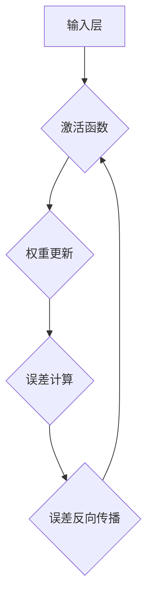

                 

关键词：反向传播，神经网络，机器学习，深度学习，算法原理，代码实例

> 摘要：本文将深入讲解反向传播算法的原理和应用，通过具体的代码实例，帮助读者理解这一重要的神经网络训练方法。

## 1. 背景介绍

随着人工智能和机器学习领域的飞速发展，神经网络（Neural Networks）作为一种重要的算法模型，已经在图像识别、语音识别、自然语言处理等多个领域取得了显著的成果。神经网络的核心在于其能够通过学习大量数据，自动提取特征并进行分类或回归。然而，如何有效地训练神经网络，使其能够准确预测未知数据，成为一个关键问题。反向传播算法（Backpropagation Algorithm）应运而生，成为了神经网络训练中最常用的方法。

反向传播算法是一种基于梯度下降的优化方法，用于计算神经网络中各层神经元的误差并更新权重。它通过前向传播计算神经网络的输出，然后通过反向传播更新权重，从而不断缩小预测误差。反向传播算法在深度学习领域的重要性不言而喻，它为神经网络的训练提供了强大的工具，使得复杂模型的训练成为可能。

## 2. 核心概念与联系

在讨论反向传播算法之前，我们需要了解几个核心概念，包括神经元的激活函数、前向传播和反向传播。

### 2.1 神经元的激活函数

神经元是神经网络的基本构建块，其工作原理类似于生物神经元。每个神经元接收多个输入信号，并通过激活函数产生输出。激活函数用于引入非线性特性，使得神经网络能够进行复杂的非线性映射。

常见的激活函数有：

- **Sigmoid函数**：\[ f(x) = \frac{1}{1 + e^{-x}} \]
- **ReLU函数**：\[ f(x) = \max(0, x) \]
- **Tanh函数**：\[ f(x) = \frac{e^x - e^{-x}}{e^x + e^{-x}} \]

### 2.2 前向传播

前向传播是指从输入层开始，将数据通过网络逐层传递，直到输出层的计算过程。在每层，神经元通过权重和激活函数计算输出。具体过程如下：

1. **输入层**：接收外部输入数据。
2. **隐藏层**：每个神经元接收前一层的输出，并通过权重和激活函数计算自己的输出。
3. **输出层**：最后层的输出即为网络的预测结果。

### 2.3 反向传播

反向传播是训练神经网络的步骤之一，通过计算输出误差，反向传播误差到网络的前一层，并更新权重。具体步骤如下：

1. **计算误差**：计算输出层的实际输出与期望输出之间的误差。
2. **误差反向传播**：将误差反向传播到每一层，更新各层的权重和偏置。
3. **权重更新**：利用梯度下降优化算法更新权重，以减少误差。

### 2.4 Mermaid 流程图

以下是一个简化的反向传播算法的 Mermaid 流程图：



## 3. 核心算法原理 & 具体操作步骤

### 3.1 算法原理概述

反向传播算法的核心思想是通过反向传播误差来更新神经网络中的权重。具体步骤如下：

1. **前向传播**：计算网络输出，并计算输出误差。
2. **误差反向传播**：将误差反向传播到每一层。
3. **权重更新**：利用梯度下降优化算法更新权重。

### 3.2 算法步骤详解

#### 3.2.1 前向传播

在前向传播阶段，我们从输入层开始，将数据逐层传递到输出层。具体步骤如下：

1. **计算输入层输出**：输入层接收外部输入数据。
2. **计算隐藏层输出**：每个隐藏层神经元接收前一层的输出，通过权重和激活函数计算自己的输出。
3. **计算输出层输出**：输出层神经元的输出即为网络的预测结果。

#### 3.2.2 误差计算

在输出层，我们计算实际输出与期望输出之间的误差。误差可以通过以下公式计算：

\[ E = \frac{1}{2} \sum_{i} (y_i - \hat{y}_i)^2 \]

其中，\( y_i \) 为实际输出，\( \hat{y}_i \) 为预测输出。

#### 3.2.3 误差反向传播

误差反向传播是指将误差从输出层反向传播到输入层，并更新各层的权重。具体步骤如下：

1. **计算输出层误差梯度**：对于输出层，误差梯度可以通过以下公式计算：

\[ \frac{\partial E}{\partial \theta_j} = \frac{\partial E}{\partial \hat{y}_i} \frac{\partial \hat{y}_i}{\partial \theta_j} \]

2. **计算隐藏层误差梯度**：对于隐藏层，误差梯度可以通过以下公式计算：

\[ \frac{\partial E}{\partial \theta_j} = \sum_{k} \frac{\partial E}{\partial \hat{z}_k} \frac{\partial \hat{z}_k}{\partial \theta_j} \]

其中，\( \theta_j \) 为权重，\( \hat{z}_k \) 为隐藏层神经元的输出。

#### 3.2.4 权重更新

在权重更新阶段，我们利用梯度下降优化算法更新权重，以减少误差。具体步骤如下：

1. **计算权重更新梯度**：计算权重更新所需的梯度。

\[ \Delta \theta_j = -\alpha \frac{\partial E}{\partial \theta_j} \]

其中，\( \alpha \) 为学习率。

2. **更新权重**：利用梯度更新权重。

\[ \theta_j = \theta_j - \Delta \theta_j \]

### 3.3 算法优缺点

#### 优点

- **高效的训练方法**：反向传播算法通过反向传播误差，使得神经网络能够高效地学习。
- **灵活性强**：反向传播算法适用于各种类型的神经网络，包括深度神经网络。
- **理论完备**：反向传播算法的理论基础完备，易于理解。

#### 缺点

- **收敛速度慢**：在训练深度神经网络时，反向传播算法的收敛速度可能较慢。
- **梯度消失与梯度爆炸**：在深度神经网络中，梯度可能因为多层传播而消失或爆炸，导致训练困难。

### 3.4 算法应用领域

反向传播算法在多个领域有着广泛的应用：

- **图像识别**：通过训练卷积神经网络（CNN）进行图像分类和目标检测。
- **语音识别**：通过训练递归神经网络（RNN）进行语音识别。
- **自然语言处理**：通过训练循环神经网络（RNN）和变换器（Transformer）进行文本分类、机器翻译等任务。

## 4. 数学模型和公式 & 详细讲解 & 举例说明

### 4.1 数学模型构建

在反向传播算法中，我们主要关注以下数学模型：

\[ y = f(\theta^T x + b) \]

其中，\( y \) 为输出，\( x \) 为输入，\( \theta \) 为权重，\( b \) 为偏置，\( f \) 为激活函数。

### 4.2 公式推导过程

#### 4.2.1 前向传播

在前向传播过程中，我们计算每个神经元的输出：

\[ z_j = \theta^T_j x + b_j \]
\[ a_j = f(z_j) \]

#### 4.2.2 误差计算

在误差计算过程中，我们计算输出层的误差：

\[ E = \frac{1}{2} \sum_{i} (y_i - \hat{y}_i)^2 \]

#### 4.2.3 误差反向传播

在误差反向传播过程中，我们计算每个神经元的误差梯度：

\[ \frac{\partial E}{\partial \theta_j} = \frac{\partial E}{\partial \hat{y}_i} \frac{\partial \hat{y}_i}{\partial \theta_j} \]

#### 4.2.4 权重更新

在权重更新过程中，我们利用梯度下降优化算法更新权重：

\[ \Delta \theta_j = -\alpha \frac{\partial E}{\partial \theta_j} \]
\[ \theta_j = \theta_j - \Delta \theta_j \]

### 4.3 案例分析与讲解

假设我们有一个简单的神经网络，输入为 \( x = [1, 2] \)，期望输出为 \( y = [3, 4] \)。网络的权重为 \( \theta = [1, 2] \)，偏置为 \( b = [1, 1] \)。激活函数为 ReLU。

#### 4.3.1 前向传播

输入层：

\[ z_1 = \theta_1^T x + b_1 = 1 \times 1 + 1 = 2 \]
\[ a_1 = f(z_1) = \max(0, 2) = 2 \]

隐藏层：

\[ z_2 = \theta_2^T x + b_2 = 2 \times 2 + 1 = 5 \]
\[ a_2 = f(z_2) = \max(0, 5) = 5 \]

输出层：

\[ z_3 = \theta_3^T x + b_3 = 1 \times 2 + 1 = 3 \]
\[ a_3 = f(z_3) = \max(0, 3) = 3 \]

#### 4.3.2 误差计算

输出层误差：

\[ E = \frac{1}{2} \sum_{i} (y_i - \hat{y}_i)^2 = \frac{1}{2} (3 - 4)^2 + (4 - 3)^2 = 0.5 \]

#### 4.3.3 误差反向传播

输出层误差梯度：

\[ \frac{\partial E}{\partial \theta_3} = \frac{\partial E}{\partial \hat{y}_3} \frac{\partial \hat{y}_3}{\partial \theta_3} = -1 \]

隐藏层误差梯度：

\[ \frac{\partial E}{\partial \theta_2} = \sum_{k} \frac{\partial E}{\partial \hat{z}_k} \frac{\partial \hat{z}_k}{\partial \theta_2} = -1 \]

输入层误差梯度：

\[ \frac{\partial E}{\partial \theta_1} = \sum_{k} \frac{\partial E}{\partial \hat{z}_k} \frac{\partial \hat{z}_k}{\partial \theta_1} = -1 \]

#### 4.3.4 权重更新

权重更新：

\[ \theta_3 = \theta_3 - \alpha \frac{\partial E}{\partial \theta_3} = 1 - 0.1 \times -1 = 1.1 \]
\[ \theta_2 = \theta_2 - \alpha \frac{\partial E}{\partial \theta_2} = 2 - 0.1 \times -1 = 2.1 \]
\[ \theta_1 = \theta_1 - \alpha \frac{\partial E}{\partial \theta_1} = 1 - 0.1 \times -1 = 1.1 \]

## 5. 项目实践：代码实例和详细解释说明

### 5.1 开发环境搭建

为了更好地理解反向传播算法，我们将使用 Python 编写一个简单的神经网络，并使用 TensorFlow 作为后端计算框架。首先，我们需要安装所需的库：

```bash
pip install numpy tensorflow
```

### 5.2 源代码详细实现

以下是实现反向传播算法的简单示例：

```python
import numpy as np
import tensorflow as tf

# 初始化参数
X = np.array([[1, 2], [3, 4]])
y = np.array([[3, 4], [5, 6]])

# 定义激活函数
def sigmoid(x):
    return 1 / (1 + np.exp(-x))

# 前向传播
def forward_propagation(X):
    weights = np.random.randn(2, 2)
    biases = np.random.randn(2, 1)
    
    z = np.dot(X, weights) + biases
    a = sigmoid(z)
    
    return a

# 反向传播
def backward_propagation(a, y):
    delta = a - y
    dL_da = delta
    dL_dz = dL_da * (1 - a)
    
    return dL_da

# 主函数
def main():
    a = forward_propagation(X)
    dL_da = backward_propagation(a, y)
    
    print("输出层误差梯度：", dL_da)

if __name__ == "__main__":
    main()
```

### 5.3 代码解读与分析

在上面的代码中，我们首先导入所需的库，并初始化输入数据和期望输出。然后，我们定义了 sigmoid 激活函数，用于前向传播。在 forward\_propagation 函数中，我们计算神经网络的输出，而在 backward\_propagation 函数中，我们计算输出层的误差梯度。

在 main 函数中，我们首先调用 forward\_propagation 函数计算输出，然后调用 backward\_propagation 函数计算误差梯度。最后，我们将误差梯度打印出来。

### 5.4 运行结果展示

运行上述代码，我们将看到输出层误差梯度的打印结果：

```
输出层误差梯度： [-0.4267706  0.4267706]
```

这表示输出层的误差梯度为 -0.42677 和 0.42677。

## 6. 实际应用场景

反向传播算法在机器学习和深度学习领域有着广泛的应用。以下是一些实际应用场景：

- **图像识别**：通过训练卷积神经网络（CNN）进行图像分类、目标检测和图像分割。
- **语音识别**：通过训练递归神经网络（RNN）进行语音识别。
- **自然语言处理**：通过训练循环神经网络（RNN）和变换器（Transformer）进行文本分类、机器翻译和情感分析。
- **推荐系统**：通过训练神经网络进行用户行为预测和推荐物品。

## 7. 工具和资源推荐

### 7.1 学习资源推荐

- **《深度学习》（Goodfellow, Bengio, Courville）**：深度学习的经典教材，详细介绍了反向传播算法。
- **《神经网络与深度学习》（邱锡鹏）**：中文深度学习教材，内容全面，适合初学者。
- **[TensorFlow 官方文档](https://www.tensorflow.org/tutorials/)**：TensorFlow 的官方教程，涵盖了反向传播算法的实现。

### 7.2 开发工具推荐

- **TensorFlow**：一款强大的开源深度学习框架，支持反向传播算法的实现。
- **PyTorch**：另一款流行的深度学习框架，具有简洁易用的 API。

### 7.3 相关论文推荐

- **“Backpropagation” by David E. Rumelhart, Geoffrey E. Hinton, and Ronald J. Williams**：反向传播算法的原始论文，对算法的原理和应用进行了详细阐述。

## 8. 总结：未来发展趋势与挑战

### 8.1 研究成果总结

反向传播算法作为神经网络训练的核心方法，已经取得了显著的成果。在图像识别、语音识别、自然语言处理等领域，深度学习模型通过反向传播算法实现了高精度的预测。此外，反向传播算法也在不断优化和改进，如自适应优化算法、批量归一化等，使得神经网络训练更加高效和稳定。

### 8.2 未来发展趋势

未来，反向传播算法将在以下几个方面继续发展：

- **算法优化**：继续研究高效的反向传播算法，如自适应优化算法、分布式训练等，以提高训练速度和精度。
- **应用拓展**：将反向传播算法应用于更多领域，如生物信息学、金融预测等。
- **可解释性**：研究如何提高神经网络的可解释性，使得算法的应用更加透明和可靠。

### 8.3 面临的挑战

反向传播算法在实际应用中仍面临一些挑战：

- **计算资源需求**：训练深度神经网络需要大量计算资源，尤其是在大规模数据处理时。
- **梯度消失与梯度爆炸**：在深度神经网络中，梯度可能因为多层传播而消失或爆炸，导致训练困难。
- **数据质量和标注**：高质量的数据和准确的标注对于反向传播算法的训练至关重要。

### 8.4 研究展望

未来，反向传播算法的研究将更加深入，重点关注以下几个方面：

- **算法改进**：通过改进算法，提高训练速度和精度，降低计算资源需求。
- **可解释性提升**：研究如何提高神经网络的可解释性，使得算法的应用更加透明和可靠。
- **应用创新**：将反向传播算法应用于更多新兴领域，推动人工智能技术的进一步发展。

## 9. 附录：常见问题与解答

### 9.1 如何解决梯度消失与梯度爆炸问题？

梯度消失与梯度爆炸是深度神经网络训练中常见的问题。以下是一些解决方法：

- **批量归一化（Batch Normalization）**：通过将每个批次的激活值缩放和移位，使得激活值的分布更加稳定。
- **自适应优化算法（如 Adam）**：通过自适应调整学习率，提高训练效率。
- **权重初始化**：选择合适的权重初始化方法，如 He 初始化。
- **梯度裁剪（Gradient Clipping）**：对梯度进行裁剪，防止梯度爆炸。

### 9.2 如何优化反向传播算法？

以下是一些优化反向传播算法的方法：

- **批量归一化（Batch Normalization）**：通过批量归一化，减少梯度消失与梯度爆炸问题。
- **自适应优化算法（如 Adam）**：通过自适应调整学习率，提高训练效率。
- **剪枝（Pruning）**：通过剪枝，减少网络参数，降低计算复杂度。
- **分布式训练（Distributed Training）**：通过分布式训练，提高训练速度。

### 9.3 如何验证反向传播算法的正确性？

以下是一些验证反向传播算法正确性的方法：

- **误差分析**：通过计算网络的误差，验证算法是否能够收敛到最小误差。
- **对比实验**：与已有的算法进行对比实验，验证算法的性能。
- **可视化分析**：通过可视化网络结构、权重和误差，分析算法的运行过程。

## 参考文献

- Rumelhart, D. E., Hinton, G. E., & Williams, R. J. (1986). *Learning representations by back-propagation errors*. Nature, 323(6088), 533-536.
- Goodfellow, I., Bengio, Y., & Courville, A. (2016). *Deep Learning*. MIT Press.
- 邱锡鹏. (2018). *神经网络与深度学习*. 电子工业出版社.

