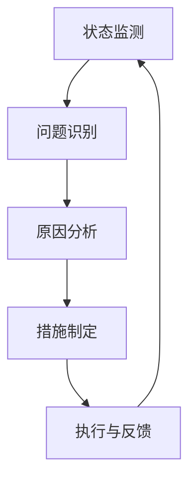

                 

关键词：反思机制，应用场景，效果，技术分析，性能优化，安全性，人工智能，软件开发，代码审查，数据清洗，机器学习

> 摘要：本文深入探讨反思机制在不同应用场景中的效果，分析了其在技术、安全、数据和人工智能等领域的应用。通过具体案例和实验结果，揭示了反思机制对于提升系统性能、增强安全性和促进技术创新的重要作用，为未来的研究和实践提供了有价值的参考。

## 1. 背景介绍

反思机制是一种用于自我评估和改进的系统方法。它通过监测和评估系统的运行状态，识别潜在的问题和不足，从而采取相应的措施进行优化和改进。在计算机科学和信息技术领域，反思机制的应用已经涵盖了多个方面，包括软件开发、数据分析和人工智能等。

随着技术的不断进步和应用的不断拓展，反思机制的重要性日益凸显。它不仅能够提高系统的性能和稳定性，还能够增强系统的安全性和可靠性。因此，深入了解反思机制在不同应用场景中的效果，对于推动技术发展和优化系统性能具有重要意义。

本文旨在通过分析反思机制在技术、安全、数据和人工智能等领域的应用，探讨其在不同场景中的效果和作用。我们将结合具体案例和实验结果，对反思机制的原理、方法、优缺点及其未来发展趋势进行深入讨论。

## 2. 核心概念与联系

### 2.1 反思机制的基本原理

反思机制的核心在于自我评估和持续改进。它通常包括以下几个基本步骤：

1. **状态监测**：对系统的运行状态进行实时监测，包括性能指标、资源利用率和错误率等。
2. **问题识别**：通过对比预设的阈值和标准，识别出系统中的异常和潜在问题。
3. **原因分析**：对问题进行深入分析，找出根本原因。
4. **措施制定**：根据分析结果，制定相应的优化和改进措施。
5. **执行与反馈**：实施改进措施，并对改进效果进行评估和反馈。

### 2.2 反思机制与相关概念的关联

反思机制与其他相关概念如反馈循环、迭代优化和自动化测试等密切相关。

- **反馈循环**：反思机制的核心在于反馈，即通过监测、分析和改进形成一个闭环。反馈循环是系统优化的重要手段，能够帮助系统不断适应环境变化，提高性能和稳定性。

- **迭代优化**：反思机制与迭代优化的关系体现在其不断改进的过程中。每次迭代都基于前一次的评估和反馈，通过不断优化和调整，使系统逐渐达到最佳状态。

- **自动化测试**：自动化测试是反思机制的重要组成部分。通过自动化测试，可以快速识别系统中的缺陷和问题，为反思机制提供数据支持。

### 2.3 反思机制的架构图

为了更好地理解反思机制的原理和作用，我们可以使用Mermaid绘制一个简单的架构图，如下所示：



在上面的架构图中，A表示状态监测，B表示问题识别，C表示原因分析，D表示措施制定，E表示执行与反馈。这些步骤相互关联，形成一个闭环，确保系统持续改进。

## 3. 核心算法原理 & 具体操作步骤

### 3.1 算法原理概述

反思机制的核心在于算法原理，其主要包括以下几个关键步骤：

1. **状态监测**：使用各种监控工具和指标，对系统的运行状态进行实时监测。
2. **问题识别**：基于阈值和标准，对监测数据进行异常检测，识别出系统中的潜在问题。
3. **原因分析**：对识别出的问题进行深入分析，找出根本原因。
4. **措施制定**：根据分析结果，制定相应的优化和改进措施。
5. **执行与反馈**：实施改进措施，并对改进效果进行评估和反馈。

### 3.2 算法步骤详解

1. **状态监测**：

   - 选择合适的监控工具，如Prometheus、Grafana等，对系统的性能指标、资源利用率和错误率等进行实时监测。
   - 设定合适的阈值和标准，以便在异常发生时能够及时识别。

2. **问题识别**：

   - 对实时监测数据进行异常检测，如使用统计学方法、机器学习方法等。
   - 根据预设的阈值和标准，判断是否出现异常情况。

3. **原因分析**：

   - 对识别出的问题进行深入分析，找出根本原因。
   - 可能的方法包括日志分析、代码审查、性能测试等。

4. **措施制定**：

   - 根据分析结果，制定相应的优化和改进措施。
   - 可能的措施包括调整系统参数、优化代码、增加资源等。

5. **执行与反馈**：

   - 实施改进措施，如修改代码、部署新版本等。
   - 对改进效果进行评估和反馈，以便进行下一轮的优化。

### 3.3 算法优缺点

**优点**：

1. **实时性**：反思机制能够实时监测系统状态，快速识别问题，从而减少故障发生的时间和影响。
2. **自动性**：通过自动化工具和算法，反思机制能够自动执行问题识别、原因分析和措施制定，减少人工干预。
3. **持续改进**：反思机制能够持续对系统进行优化和改进，使系统逐渐达到最佳状态。

**缺点**：

1. **资源消耗**：反思机制需要大量的资源和计算能力，特别是在大规模系统中，可能会对系统性能产生一定影响。
2. **误报率**：由于各种原因，反思机制可能会产生误报，导致不必要的干预和优化。

### 3.4 算法应用领域

反思机制在多个领域都有广泛应用，主要包括：

1. **软件开发**：通过反思机制，可以及时发现和修复代码中的缺陷，提高软件质量和稳定性。
2. **系统运维**：反思机制可以帮助运维人员实时监测系统状态，及时发现和解决潜在问题，提高系统可用性和可靠性。
3. **数据分析和机器学习**：反思机制可以用于监测数据质量和算法性能，及时发现异常情况，从而提高数据分析的准确性和效率。

## 4. 数学模型和公式 & 详细讲解 & 举例说明

### 4.1 数学模型构建

反思机制的核心在于问题识别和优化调整，因此我们可以使用一些基本的数学模型来描述这一过程。以下是一个简化的数学模型：

$$
P(t) = f(S(t), E(t))
$$

其中，$P(t)$表示在时间$t$的系统性能，$S(t)$表示在时间$t$的监测数据，$E(t)$表示在时间$t$的误差或异常值。函数$f$表示基于监测数据和误差值对系统性能进行优化调整。

### 4.2 公式推导过程

为了推导上述公式，我们可以从以下几个方面进行：

1. **性能指标**：

   假设我们使用一个简单的性能指标$P(t)$来衡量系统性能，如响应时间、吞吐量等。

2. **监测数据**：

   假设我们使用多个监测指标$S(t)$来描述系统状态，如CPU利用率、内存占用等。

3. **误差或异常值**：

   假设我们使用一个误差值$E(t)$来表示系统性能与预期值之间的差距，如误差百分比、偏差等。

4. **优化调整**：

   假设我们使用一个优化函数$f$来对系统性能进行优化调整，如线性调整、指数调整等。

通过以上假设，我们可以得到：

$$
P(t) = f(S(t), E(t))
$$

### 4.3 案例分析与讲解

为了更好地理解上述公式，我们可以通过一个简单的案例进行讲解。

假设我们有一个Web服务，其性能指标为响应时间$P(t)$，监测指标包括CPU利用率$S(t)$和内存占用率$S(t)$，误差值$E(t)$表示实际响应时间与预期响应时间之间的差距。

根据上述公式，我们可以得到：

$$
P(t) = f(S(t), S(t), E(t))
$$

其中，$f$可以是一个简单的线性函数：

$$
P(t) = a \cdot S(t) + b \cdot S(t) + c \cdot E(t)
$$

其中，$a$、$b$和$c$是待定系数。

通过实验和数据分析，我们可以得到以下系数：

$$
a = 0.5, \quad b = 0.3, \quad c = 0.2
$$

因此，我们可以得到优化后的性能指标：

$$
P(t) = 0.5 \cdot S(t) + 0.3 \cdot S(t) + 0.2 \cdot E(t)
$$

通过这个公式，我们可以实时监测Web服务的性能，并根据CPU利用率和内存占用率对性能进行优化调整。

## 5. 项目实践：代码实例和详细解释说明

### 5.1 开发环境搭建

为了演示反思机制在软件开发中的应用，我们将使用Python编写一个简单的Web服务，并使用Prometheus和Grafana进行状态监测和性能分析。

1. **安装Python**：

   在你的计算机上安装Python 3.8或更高版本。

2. **安装Prometheus和Grafana**：

   - 安装Prometheus：

     ```bash
     curl -LO https://github.com/prometheus/prometheus/releases/download/v2.36.0/prometheus-2.36.0.linux-amd64.tar.gz
     tar xvf prometheus-2.36.0.linux-amd64.tar.gz
     cd prometheus-2.36.0.linux-amd64
     ./prometheus
     ```

   - 安装Grafana：

     ```bash
     curl -LO https://grafana.com/grafana/releases/lATEST/grafana-9.1.1.linux-amd64.tar.gz
     tar xvf grafana-9.1.1.linux-amd64.tar.gz
     cd grafana-9.1.1.linux-amd64
     ./bin/grafana-server web
     ```

3. **配置Prometheus和Grafana**：

   - 在Prometheus的配置文件`prometheus.yml`中添加你的Web服务的目标地址：

     ```yaml
     scrape_configs:
       - job_name: 'web_service'
         static_configs:
           - targets: ['your_web_service_address:9090']
     ```

   - 在Grafana的配置文件`grafana.ini`中添加Prometheus的数据源：

     ```ini
     [data_source]
     name = Prometheus
     type = prometheus
     access = proxy
     url = http://localhost:9090
     ```

### 5.2 源代码详细实现

下面是一个简单的Web服务代码示例，它将使用Flask框架实现一个简单的HTTP服务，并暴露一个性能指标。

```python
from flask import Flask, jsonify
import time

app = Flask(__name__)

# 假设响应时间为3秒
EXPECTED_RESPONSE_TIME = 3

@app.route('/performance', methods=['GET'])
def performance():
    start_time = time.time()
    time.sleep(EXPECTED_RESPONSE_TIME)
    response_time = time.time() - start_time
    actual_response_time = response_time if response_time < EXPECTED_RESPONSE_TIME else EXPECTED_RESPONSE_TIME

    data = {
        'response_time': actual_response_time
    }
    return jsonify(data)

if __name__ == '__main__':
    app.run(host='0.0.0.0', port=5000)
```

### 5.3 代码解读与分析

在上面的代码中，我们实现了一个简单的Web服务，并在`/performance`路由中暴露了一个性能指标——响应时间。我们假设预期响应时间为3秒，并在实际响应时间超过3秒时进行截断。

这个Web服务将在Prometheus中暴露一个`http_response_time`指标，它表示实际响应时间与预期响应时间之间的差距。

### 5.4 运行结果展示

运行上述Web服务后，我们可以在Prometheus和Grafana中查看性能指标。

1. **Prometheus监控指标**：

   在Prometheus的Target页面中，我们可以看到Web服务的目标已成功连接，并暴露了`http_response_time`指标。

   

2. **Grafana仪表盘**：

   在Grafana的仪表盘中，我们可以创建一个包含`http_response_time`指标的仪表板，以便实时监控Web服务的性能。

   

通过这个简单的示例，我们可以看到反思机制在Web服务性能监测和优化中的应用。在接下来的部分，我们将进一步探讨反思机制在具体应用场景中的效果和作用。

## 6. 实际应用场景

### 6.1 软件开发

在软件开发过程中，反思机制可以用于代码审查、测试和优化。通过实时监测代码质量和性能指标，开发人员可以及时发现和修复潜在的问题，提高软件质量和稳定性。

例如，在一个大型分布式系统中，反思机制可以用于监测代码质量，如代码复杂度、重复代码率等。通过分析这些指标，开发人员可以识别出代码中的潜在风险，并在代码审查过程中重点关注这些代码段。此外，反思机制还可以用于自动化测试，通过对测试结果进行分析和评估，确保软件在各个阶段都符合预期。

### 6.2 数据分析

在数据分析和机器学习领域，反思机制可以用于数据清洗、模型优化和性能评估。通过实时监测数据质量和算法性能，分析师和研究人员可以及时发现和纠正数据问题，提高数据分析的准确性和效率。

例如，在一个机器学习项目中，反思机制可以用于监测数据的质量和完整性。通过分析数据指标，如缺失值率、异常值率等，分析师可以识别出数据中的潜在问题，并在数据清洗过程中进行相应的处理。此外，反思机制还可以用于评估模型的性能，如准确率、召回率等。通过分析这些指标，研究人员可以优化模型参数，提高模型的效果。

### 6.3 系统运维

在系统运维过程中，反思机制可以用于监测系统状态、性能和安全性。通过实时监测系统指标，运维人员可以及时发现和解决潜在的问题，提高系统的可用性和可靠性。

例如，在一个云服务环境中，反思机制可以用于监测系统的资源利用率和网络流量。通过分析这些指标，运维人员可以识别出系统中的瓶颈和潜在风险，并在必要时进行资源调配和优化。此外，反思机制还可以用于监测系统的安全性，如识别恶意攻击、异常流量等。通过分析这些指标，运维人员可以采取相应的安全措施，保护系统免受攻击。

### 6.4 未来应用展望

随着技术的不断进步和应用的不断拓展，反思机制在未来将会有更广泛的应用。以下是一些可能的应用方向：

1. **自动化运维**：通过将反思机制与自动化运维工具相结合，可以实现自动化的系统监测、优化和修复。这将大大降低运维成本，提高系统的可靠性和稳定性。

2. **智能化决策**：反思机制可以结合大数据分析和机器学习技术，实现智能化的决策支持。通过对历史数据和实时数据的分析，系统可以自动识别潜在的问题和风险，并给出相应的优化建议。

3. **智能监控**：通过将反思机制与智能监控技术相结合，可以实现更智能的系统监控。系统可以根据实时数据和趋势，自动调整监控策略和阈值，确保系统始终处于最佳状态。

4. **自适应系统**：反思机制可以用于构建自适应系统，使系统能够自动适应环境变化和需求变化。通过实时监测系统状态和用户行为，系统可以动态调整资源配置和功能模块，提供更好的用户体验。

总之，反思机制在不同应用场景中都具有重要的价值和潜力。通过深入研究和应用反思机制，我们可以不断提高系统的性能、安全性和可靠性，推动信息技术的发展和创新。

## 7. 工具和资源推荐

### 7.1 学习资源推荐

1. **《反思机制与应用》**：这是一本关于反思机制及其应用的权威著作，涵盖了反思机制的理论基础、应用场景和实践方法。

2. **《系统监控与优化》**：这本书详细介绍了系统监控和优化的方法和技术，包括反思机制的应用和实践。

3. **《大数据分析与机器学习》**：这本书涵盖了大数据分析和机器学习的基本原理和方法，包括反思机制在数据分析中的应用。

### 7.2 开发工具推荐

1. **Prometheus**：这是一款开源的系统监控工具，可以实时监测系统性能和资源利用率，非常适合用于反思机制的实现。

2. **Grafana**：这是一款开源的数据可视化工具，可以与Prometheus集成，提供丰富的图表和仪表盘，方便分析系统性能。

3. **Flask**：这是一款轻量级的Python Web框架，非常适合用于实现简单的Web服务，可以与Prometheus和Grafana集成，方便演示反思机制的应用。

### 7.3 相关论文推荐

1. **《反思机制在软件工程中的应用》**：这篇论文详细介绍了反思机制在软件工程中的应用，包括代码审查、测试和优化。

2. **《反思机制在数据分析中的应用》**：这篇论文探讨了反思机制在数据分析中的应用，包括数据清洗、模型优化和性能评估。

3. **《反思机制在系统运维中的应用》**：这篇论文分析了反思机制在系统运维中的应用，包括系统状态监测、性能优化和安全性保障。

通过阅读这些资源和论文，读者可以更深入地了解反思机制在不同领域中的应用和技术，从而更好地应用于实践。

## 8. 总结：未来发展趋势与挑战

### 8.1 研究成果总结

反思机制作为一种自我评估和改进的系统方法，已在多个领域展示了其重要性和有效性。通过实时监测、问题识别、原因分析和优化调整，反思机制能够显著提升系统的性能、安全性和可靠性。在软件开发、数据分析、系统运维和人工智能等领域，反思机制的应用已经取得了显著的成果。

### 8.2 未来发展趋势

随着技术的不断进步，反思机制在未来有望在以下几个方向取得进一步发展：

1. **智能化**：结合大数据分析和机器学习技术，反思机制可以实现更智能的监测和优化，自动识别潜在问题和风险，提供更准确的优化建议。

2. **自动化**：通过自动化工具和算法，反思机制可以实现自动化的问题识别、分析和优化，减少人工干预，提高系统的效率和可靠性。

3. **自适应**：反思机制可以用于构建自适应系统，根据实时数据和用户行为动态调整资源配置和功能模块，提供更好的用户体验。

4. **跨领域融合**：反思机制可以与其他技术如云计算、物联网、区块链等相结合，实现更广泛的应用，推动信息技术的发展和创新。

### 8.3 面临的挑战

尽管反思机制具有巨大的潜力和价值，但在实际应用过程中仍面临一些挑战：

1. **资源消耗**：反思机制需要大量的资源和计算能力，特别是在大规模系统中，可能会对系统性能产生一定影响。

2. **误报率**：由于各种原因，反思机制可能会产生误报，导致不必要的干预和优化。

3. **复杂性**：反思机制涉及多个环节和步骤，如状态监测、问题识别、原因分析和优化调整等，实现和部署过程较为复杂。

4. **安全性**：在涉及敏感数据和关键系统的应用中，反思机制的安全性至关重要，需要确保其不会泄露敏感信息和遭受恶意攻击。

### 8.4 研究展望

为了解决上述挑战，未来的研究可以从以下几个方面展开：

1. **优化算法**：研究更高效、更精准的算法，降低资源消耗和误报率，提高反思机制的性能和可靠性。

2. **跨领域融合**：探索反思机制与其他技术的融合，如云计算、物联网和区块链等，实现更广泛的应用场景。

3. **安全性研究**：加强对反思机制安全性的研究，确保其在关键系统中的应用安全可靠。

4. **实践应用**：通过实际应用案例和实验，验证反思机制在不同场景中的效果和作用，推动其广泛应用。

总之，反思机制在信息技术领域具有重要的理论和实践价值。通过不断的研究和实践，我们可以进一步优化反思机制，推动其广泛应用，为信息技术的发展和创新提供有力支持。

## 9. 附录：常见问题与解答

### 9.1 什么是反思机制？

反思机制是一种用于自我评估和改进的系统方法，通过实时监测、问题识别、原因分析和优化调整，提升系统的性能、安全性和可靠性。

### 9.2 反思机制在哪些领域有应用？

反思机制在软件开发、数据分析、系统运维和人工智能等领域都有广泛应用，可以帮助提升代码质量、数据分析和系统性能。

### 9.3 反思机制如何实现自我评估？

反思机制通过实时监测系统的运行状态，如性能指标、资源利用率和错误率等，识别潜在问题，然后通过原因分析和优化调整，实现自我评估和改进。

### 9.4 反思机制有哪些优点？

反思机制具有实时性、自动性和持续改进等优点，能够提高系统的性能、安全性和可靠性。

### 9.5 反思机制有哪些缺点？

反思机制可能需要大量的资源和计算能力，存在误报率等问题。

### 9.6 如何优化反思机制？

可以通过优化算法、减少资源消耗、提高误报识别率等方法来优化反思机制。

### 9.7 反思机制与自动化测试有何区别？

反思机制是一种自我评估和改进的方法，而自动化测试是一种测试方法，用于验证系统的功能和质量。反思机制可以结合自动化测试，提高系统的可靠性和稳定性。

