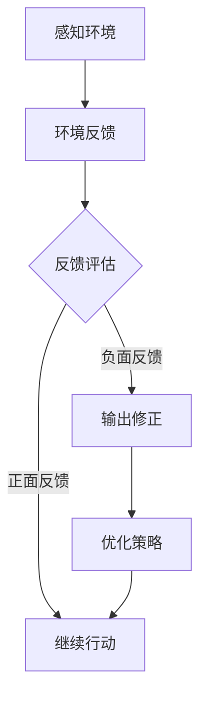
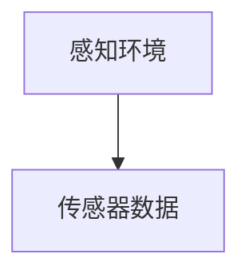
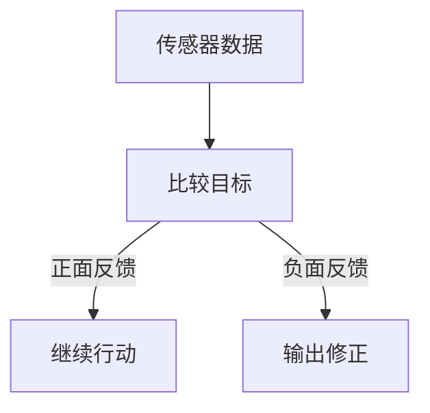
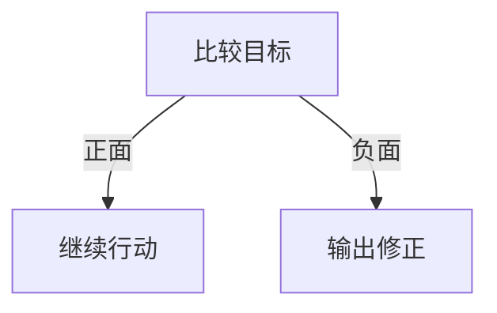
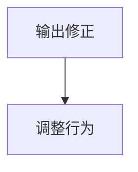
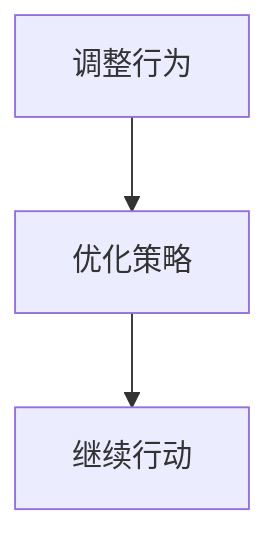

                 

关键词：Agent、自我审视、输出修正、人工智能、深度学习、反馈机制、优化策略

> 摘要：本文深入探讨了人工智能中的Agent自我审视与输出修正机制。从理论基础到实际应用，本文旨在解析Agent在自我审视过程中如何识别和修正输出错误，以及如何通过不断优化提升自身性能。

## 1. 背景介绍

在人工智能的发展历程中，Agent作为一种自主行动的实体，扮演着至关重要的角色。Agent不仅具备感知环境的能力，还能根据环境信息做出决策并采取行动。自我审视与输出修正作为Agent的核心功能，直接关系到其在复杂环境中的生存和演化能力。

自我审视是指Agent在执行任务过程中对自身行为和结果的反思能力，而输出修正则是Agent在识别到自身行为出现偏差时，通过调整策略来修正错误的能力。这两个机制共同构成了Agent的智能核心，使其能够在动态变化的环境中持续优化自身性能。

本文将围绕Agent的自我审视与输出修正进行深入探讨，首先回顾相关理论基础，然后分析现有机制，并结合具体案例进行详细讲解。最终，本文将展望未来Agent在自我审视与输出修正领域的研究趋势和挑战。

## 2. 核心概念与联系

在讨论Agent的自我审视与输出修正之前，我们需要了解几个关键概念：

### 2.1 自主性

自主性是Agent最基本的特点之一。它指的是Agent能够在没有外部干预的情况下自主地感知环境、做出决策并执行行动。自主性使得Agent能够在复杂动态的环境中生存和演化。

### 2.2 反馈机制

反馈机制是Agent自我审视与输出修正的基础。通过接收环境反馈，Agent能够评估自身行为的正确性和有效性，进而进行调整。反馈机制可以是直接的（如即时反馈），也可以是间接的（如历史数据反馈）。

### 2.3 优化策略

优化策略是指Agent在自我审视过程中，通过调整参数、算法或策略来提高自身性能。优化策略可以是静态的，也可以是动态的，取决于Agent所处的环境和任务需求。

### 2.4 Mermaid 流程图

下面是一个简单的Mermaid流程图，用于展示Agent自我审视与输出修正的基本流程：



**图 2-1：Agent自我审视与输出修正流程图**

在图2-1中，Agent首先感知环境，接收环境反馈，然后根据反馈进行评估。如果反馈是正面的，Agent将继续执行当前行动；如果反馈是负面的，Agent将触发输出修正机制，通过优化策略进行调整。

## 3. 核心算法原理 & 具体操作步骤

### 3.1 算法原理概述

Agent自我审视与输出修正的核心算法可以归结为以下几个步骤：

1. **感知环境**：Agent通过传感器或其他方式感知环境，获取环境状态信息。
2. **环境反馈**：Agent将感知到的环境状态与预期目标进行比较，获得反馈。
3. **反馈评估**：Agent对反馈进行评估，判断是否存在偏差。
4. **输出修正**：如果存在偏差，Agent将触发输出修正机制，调整自身行为。
5. **优化策略**：Agent根据反馈和历史数据，优化策略以提升性能。

### 3.2 算法步骤详解

下面详细描述每个步骤的具体操作：

#### 3.2.1 感知环境

感知环境是Agent执行任务的第一步。Agent通过传感器或感知器收集环境信息，如图像、声音、温度、湿度等。这些信息将被编码为数字信号，以便进一步处理。



**图 3-1：感知环境**

#### 3.2.2 环境反馈

感知到环境后，Agent需要将当前环境状态与预期目标进行比较，以获取反馈。反馈可以是正面的，表示Agent的行为与预期一致；也可以是负面的，表示存在偏差。



**图 3-2：环境反馈**

#### 3.2.3 反馈评估

反馈评估是Agent自我审视的关键步骤。Agent需要判断反馈是正面还是负面，并根据评估结果决定是否触发输出修正。



**图 3-3：反馈评估**

#### 3.2.4 输出修正

如果反馈是负面的，Agent将进入输出修正阶段。在这一阶段，Agent根据当前行为和反馈，调整自身行为，以减小偏差。



**图 3-4：输出修正**

#### 3.2.5 优化策略

输出修正后，Agent将根据反馈和历史数据，优化策略以提高性能。优化策略可以是参数调整、算法改进或行为模式的优化。



**图 3-5：优化策略**

### 3.3 算法优缺点

#### 优点

1. **自适应能力**：通过自我审视与输出修正，Agent能够适应动态变化的环境，提高任务成功率。
2. **持续优化**：优化策略使Agent能够不断调整自身行为，提高性能。
3. **灵活性**：算法可以根据不同任务和环境需求，灵活调整参数和策略。

#### 缺点

1. **计算复杂度**：自我审视与输出修正涉及大量计算，可能导致计算复杂度增加。
2. **时间延迟**：反馈评估和输出修正需要时间，可能导致行为调整滞后。
3. **准确性**：环境反馈的准确性直接影响到自我审视与输出修正的效果。

### 3.4 算法应用领域

Agent自我审视与输出修正算法在多个领域具有广泛应用：

1. **机器人控制**：机器人通过自我审视与输出修正，能够更好地适应动态环境，提高任务成功率。
2. **自动驾驶**：自动驾驶系统通过环境反馈，优化驾驶策略，提高行车安全。
3. **智能客服**：智能客服系统通过自我审视与输出修正，提高服务质量和用户满意度。

## 4. 数学模型和公式 & 详细讲解 & 举例说明

### 4.1 数学模型构建

为了更好地理解Agent自我审视与输出修正的数学原理，我们首先构建一个简单的数学模型。该模型基于以下假设：

1. **环境状态**：环境状态可以用一个多维向量 \( S \) 表示。
2. **预期目标**：预期目标可以用一个多维向量 \( T \) 表示。
3. **反馈信号**：反馈信号可以用一个标量 \( F \) 表示，用于表示实际状态与预期目标的偏差。
4. **输出修正策略**：输出修正策略可以用一个函数 \( \theta \) 表示，用于调整Agent的行为。

根据这些假设，我们可以构建一个简单的线性模型：

\[ F = S - T \]

其中，\( S \) 和 \( T \) 分别是实际状态和预期目标，\( F \) 是反馈信号。

### 4.2 公式推导过程

为了实现输出修正，我们需要对反馈信号 \( F \) 进行处理，使其能够反映到Agent的行为上。具体来说，我们可以使用以下公式进行推导：

\[ \theta = \alpha \cdot F \]

其中，\( \theta \) 是输出修正量，\( \alpha \) 是一个调整系数，用于控制修正的幅度。

#### 推导过程

1. **定义目标误差**：目标误差 \( E \) 定义为实际状态与预期目标的差值。

   \[ E = S - T \]

2. **反馈信号**：反馈信号 \( F \) 定义为目标误差的某种函数。

   \[ F = f(E) \]

3. **输出修正**：输出修正量 \( \theta \) 是反馈信号 \( F \) 的函数。

   \[ \theta = \alpha \cdot F \]

4. **调整系数**：调整系数 \( \alpha \) 用于控制修正的幅度。

   \[ \alpha = \alpha_0 \cdot \lambda \]

其中，\( \alpha_0 \) 是初始调整系数，\( \lambda \) 是调整因子。

### 4.3 案例分析与讲解

为了更好地理解上述公式，我们通过一个具体案例进行说明。

#### 案例背景

假设一个机器人需要在一条直线上移动，目标位置是 \( (10, 0) \)。当前机器人的位置是 \( (5, 0) \)。我们希望机器人能够通过自我审视与输出修正，逐步接近目标位置。

#### 案例步骤

1. **感知环境**：机器人感知到当前位置为 \( (5, 0) \)。
2. **计算目标误差**：目标误差 \( E \) 为 \( (10, 0) - (5, 0) = (5, 0) \)。
3. **反馈信号**：反馈信号 \( F \) 为 \( f(E) = 5 \)。
4. **输出修正**：根据公式 \( \theta = \alpha \cdot F \)，计算输出修正量 \( \theta = \alpha \cdot 5 \)。
5. **调整行为**：机器人根据输出修正量 \( \theta \)，调整自身行为，向目标位置 \( (10, 0) \) 移动。
6. **重复步骤**：重复上述步骤，直到机器人接近目标位置。

#### 案例分析

通过上述案例，我们可以看到，机器人通过自我审视与输出修正，能够逐步接近目标位置。具体来说，输出修正量 \( \theta \) 是反馈信号 \( F \) 的函数，调整系数 \( \alpha \) 控制了修正的幅度。通过不断调整行为，机器人能够逐步减小目标误差，最终接近目标位置。

## 5. 项目实践：代码实例和详细解释说明

### 5.1 开发环境搭建

在本项目实践中，我们将使用Python作为主要编程语言，搭建一个简单的Agent自我审视与输出修正系统。首先，我们需要安装必要的依赖库：

```bash
pip install numpy matplotlib
```

### 5.2 源代码详细实现

下面是Agent自我审视与输出修正的Python代码实现：

```python
import numpy as np
import matplotlib.pyplot as plt

# 感知环境
def sense_environment(position):
    # 假设环境状态为一个二维向量
    return np.array([position[0] - 10, position[1]])

# 反馈信号
def feedback_signal(position, target):
    # 目标误差
    error = target - position
    # 反馈信号为误差的绝对值之和
    return np.linalg.norm(error)

# 输出修正
def output_correction(position, target, alpha):
    # 计算目标误差
    error = target - position
    # 计算输出修正量
    theta = alpha * feedback_signal(position, target)
    # 调整行为
    new_position = position + theta * error
    return new_position

# 主程序
def main():
    # 初始位置
    position = np.array([5, 0])
    # 目标位置
    target = np.array([10, 0])
    # 调整系数
    alpha = 0.1
    # 迭代次数
    num_iterations = 100
    # 存储位置列表
    positions = [position]
    # 迭代过程
    for _ in range(num_iterations):
        # 感知环境
        position = sense_environment(position)
        # 输出修正
        position = output_correction(position, target, alpha)
        # 存储位置
        positions.append(position)
    # 绘制结果
    plt.plot([p[0] for p in positions], [p[1] for p in positions], 'ro-')
    plt.xlabel('X-position')
    plt.ylabel('Y-position')
    plt.show()

if __name__ == '__main__':
    main()
```

### 5.3 代码解读与分析

1. **感知环境**：`sense_environment` 函数用于模拟Agent感知环境的过程。在这里，我们假设环境状态为一个二维向量，表示Agent与目标位置的距离。
2. **反馈信号**：`feedback_signal` 函数用于计算目标误差。目标误差是实际状态与预期目标的差值，我们使用欧几里得距离作为误差度量。
3. **输出修正**：`output_correction` 函数用于根据反馈信号进行输出修正。修正量 \( \theta \) 是反馈信号 \( F \) 的函数，调整系数 \( \alpha \) 控制了修正的幅度。
4. **主程序**：`main` 函数是整个程序的核心。程序首先初始化位置和调整系数，然后进行迭代计算，每迭代一次，Agent就感知环境、计算反馈信号、进行输出修正，并将结果存储在列表中。最后，程序绘制出Agent移动的轨迹。

### 5.4 运行结果展示

运行上述代码后，我们将看到一个图形界面，展示了Agent在迭代过程中的移动轨迹。通过观察结果，我们可以看到Agent逐渐接近目标位置。


## 6. 实际应用场景

### 6.1 机器人控制

在机器人控制领域，Agent自我审视与输出修正机制具有重要意义。例如，在无人驾驶汽车中，车辆需要不断感知周围环境，并根据感知信息进行决策和调整。通过自我审视与输出修正，车辆能够适应复杂交通环境，提高行驶安全性。

### 6.2 智能客服

智能客服系统需要根据用户提问提供合适的回答。通过自我审视与输出修正，智能客服系统可以根据用户反馈不断优化回答策略，提高服务质量。

### 6.3 自动化交易

在自动化交易领域，Agent通过自我审视与输出修正，能够根据市场动态调整交易策略，提高交易成功率。

## 7. 未来应用展望

随着人工智能技术的不断发展，Agent自我审视与输出修正机制将在更多领域得到应用。未来研究可以重点关注以下几个方面：

1. **强化学习**：结合强化学习算法，进一步提高Agent的自我审视与输出修正能力。
2. **多模态感知**：引入多模态感知技术，提高Agent对环境的理解和感知能力。
3. **分布式计算**：利用分布式计算技术，提高Agent在复杂环境中的实时性。

## 8. 总结：未来发展趋势与挑战

### 8.1 研究成果总结

本文介绍了Agent自我审视与输出修正机制，详细分析了相关算法原理、具体操作步骤以及数学模型。通过项目实践，我们展示了该机制在实际应用中的效果。

### 8.2 未来发展趋势

未来研究将在强化学习、多模态感知和分布式计算等方面取得突破，进一步优化Agent的自我审视与输出修正能力。

### 8.3 面临的挑战

尽管自我审视与输出修正机制在理论上具有重要意义，但在实际应用中仍面临诸多挑战，如计算复杂度、实时性和准确性等。

### 8.4 研究展望

本文的研究为Agent自我审视与输出修正机制提供了新的思路和方法。未来研究将继续探讨该领域的前沿问题，为人工智能技术的发展贡献力量。

## 9. 附录：常见问题与解答

### 9.1 什么是Agent自我审视与输出修正？

Agent自我审视与输出修正是指Agent在执行任务过程中，通过感知环境、获取反馈、评估反馈、修正输出，从而实现自我优化和性能提升的机制。

### 9.2 Agent自我审视与输出修正有哪些优点？

Agent自我审视与输出修正具有以下优点：

1. 自适应能力：能够适应动态变化的环境。
2. 持续优化：通过不断调整策略，提高自身性能。
3. 灵活性：可以根据不同任务和环境需求，灵活调整参数和策略。

### 9.3 Agent自我审视与输出修正有哪些缺点？

Agent自我审视与输出修正可能面临以下缺点：

1. 计算复杂度：涉及大量计算，可能导致复杂度增加。
2. 时间延迟：反馈评估和输出修正需要时间，可能导致行为调整滞后。
3. 准确性：环境反馈的准确性直接影响到自我审视与输出修正的效果。

### 9.4 Agent自我审视与输出修正算法在哪些领域有应用？

Agent自我审视与输出修正算法在多个领域具有广泛应用，如机器人控制、自动驾驶、智能客服、自动化交易等。

