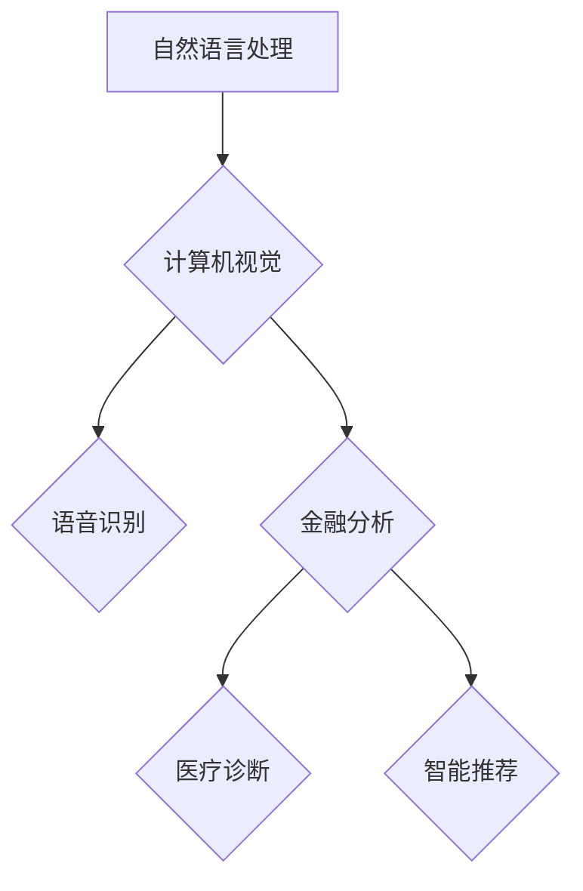

                 

关键词：大模型、商业机会、人工智能、技术革新、应用领域、创新思维

> 摘要：随着人工智能技术的不断发展，大模型的应用越来越广泛，本文将探讨大模型在各个领域带来的新商业机会，以及如何发掘和利用这些机会，推动企业创新和产业升级。

## 1. 背景介绍

在过去的几年里，人工智能（AI）领域经历了飞速的发展，尤其是大模型技术的突破。大模型，如GPT、BERT等，通过深度学习和大量数据的训练，能够在各种复杂任务上表现出超凡的能力。这些模型不仅在学术研究领域取得了显著的成果，更在商业应用中展现出巨大的潜力。

商业机会的发掘不仅依赖于技术的创新，还需要对市场需求、行业趋势的深入理解。随着大模型技术的不断进步，越来越多的企业开始关注如何利用这一技术革新来创造新的商业价值。本文将围绕这一主题，探讨大模型在各个领域带来的新商业机会，并分析如何实现这些机会。

## 2. 核心概念与联系

### 2.1 大模型的定义

大模型，通常指的是具有数百万甚至数十亿参数的深度神经网络模型。这些模型通过大量的数据训练，能够实现高度复杂的任务，如文本生成、机器翻译、图像识别等。

### 2.2 大模型的工作原理

大模型的工作原理基于深度学习和神经网络。通过多层非线性变换，模型可以从输入数据中提取特征，并进行复杂的计算和推断。大模型的能力取决于其参数数量、训练数据量以及训练算法。

### 2.3 大模型的应用领域

大模型的应用领域广泛，包括自然语言处理、计算机视觉、语音识别等。这些领域都是目前人工智能研究的热点，也是商业应用的重要方向。

## 2.4 大模型与商业机会的联系

大模型技术的进步，为商业领域带来了前所未有的机遇。首先，大模型能够帮助企业实现更智能的自动化，提高生产效率和降低成本。其次，大模型可以提供更准确的预测和分析，帮助企业在竞争激烈的市场中做出更明智的决策。此外，大模型还可以创造新的产品和服务，满足消费者的需求，从而实现商业模式的创新。

### 2.5 Mermaid 流程图

下面是一个关于大模型应用领域的Mermaid流程图：



## 3. 核心算法原理 & 具体操作步骤

### 3.1 算法原理概述

大模型的核心算法是深度学习，尤其是基于变换器（Transformer）的模型。这些模型通过自注意力机制，能够捕捉输入数据中的长距离依赖关系，从而实现高精度的特征提取和任务完成。

### 3.2 算法步骤详解

1. **数据预处理**：对输入数据进行清洗和标准化，确保模型能够有效训练。
2. **模型架构设计**：设计合适的神经网络架构，如BERT、GPT等。
3. **模型训练**：使用大量的训练数据进行模型训练，通过优化算法（如Adam）调整模型参数。
4. **模型评估**：使用验证集和测试集评估模型性能，调整模型参数以优化性能。
5. **模型部署**：将训练好的模型部署到生产环境中，实现商业应用。

### 3.3 算法优缺点

**优点**：
- **高精度**：大模型能够实现高度复杂的任务，具有很高的精度和效率。
- **自适应**：大模型能够自适应地处理不同类型的数据和任务。

**缺点**：
- **计算资源消耗大**：大模型需要大量的计算资源和存储空间。
- **训练时间长**：大模型训练过程需要较长的时间。

### 3.4 算法应用领域

大模型的应用领域广泛，包括但不限于：
- **自然语言处理**：文本生成、机器翻译、情感分析等。
- **计算机视觉**：图像识别、目标检测、人脸识别等。
- **语音识别**：语音合成、语音识别等。
- **金融分析**：风险预测、投资策略等。
- **医疗诊断**：疾病预测、医学影像分析等。
- **智能推荐**：个性化推荐、广告投放等。

## 4. 数学模型和公式 & 详细讲解 & 举例说明

### 4.1 数学模型构建

大模型的数学基础是深度学习和神经网络。神经网络由多个层（Layer）组成，每层包含多个神经元（Neuron）。神经元之间的连接称为边（Edge），每个边都有一个权重（Weight）。神经网络的输出是通过一系列的加权求和和激活函数计算得到的。

### 4.2 公式推导过程

假设我们有一个简单的神经网络，包含两个输入层、一个隐藏层和一个输出层。每个层中的神经元数量分别为n、m和k。输入层到隐藏层的权重矩阵为W1，隐藏层到输出层的权重矩阵为W2。激活函数为f(x)。

输入层到隐藏层的输出可以表示为：

$$
h_i = \sum_{j=1}^{n} W_{ij}x_j + b_i
$$

其中，$h_i$为隐藏层第i个神经元的输出，$x_j$为输入层第j个神经元的输入，$W_{ij}$为输入层到隐藏层的权重，$b_i$为隐藏层第i个神经元的偏置。

隐藏层到输出层的输出可以表示为：

$$
y_i = \sum_{j=1}^{m} W_{ij}h_j + b_i
$$

其中，$y_i$为输出层第i个神经元的输出，$h_j$为隐藏层第j个神经元的输出，$W_{ij}$为隐藏层到输出层的权重，$b_i$为输出层第i个神经元的偏置。

### 4.3 案例分析与讲解

假设我们有一个二分类问题，输入层有两个神经元，隐藏层有两个神经元，输出层有一个神经元。输入数据为$x_1 = [1, 0]$和$x_2 = [0, 1]$，标签为$y_1 = 1$和$y_2 = 0$。

输入层到隐藏层的权重矩阵为$W_1 = \begin{bmatrix} 0.5 & 0.5 \\ 0.5 & 0.5 \end{bmatrix}$，隐藏层到输出层的权重矩阵为$W_2 = \begin{bmatrix} 0.5 \\ 0.5 \end{bmatrix}$。

输入层到隐藏层的输出为：

$$
h_1 = 0.5 \times 1 + 0.5 \times 0 = 0.5
$$

$$
h_2 = 0.5 \times 0 + 0.5 \times 1 = 0.5
$$

隐藏层到输出层的输出为：

$$
y_1 = 0.5 \times 0.5 + 0.5 \times 0.5 = 0.5
$$

由于输出层的激活函数通常为sigmoid函数，所以$y_1$的输出为：

$$
y_1 = \frac{1}{1 + e^{-0.5}} \approx 0.3935
$$

同理，可以计算出$y_2$的输出为$0.3935$。

由于$y_1$和$y_2$的输出接近，无法准确判断输入数据的类别。因此，需要调整权重矩阵$W_1$和$W_2$，以提高模型的分类能力。

## 5. 项目实践：代码实例和详细解释说明

### 5.1 开发环境搭建

在本项目实践中，我们使用Python编程语言和TensorFlow框架来实现大模型的应用。以下是在Linux系统上搭建开发环境的步骤：

1. 安装Python（建议使用Python 3.7及以上版本）
2. 安装TensorFlow（使用pip命令：`pip install tensorflow`）
3. 安装其他依赖库（如NumPy、Pandas等）

### 5.2 源代码详细实现

以下是一个简单的基于TensorFlow的大模型训练和评估的示例代码：

```python
import tensorflow as tf
from tensorflow.keras.layers import Dense, Input
from tensorflow.keras.models import Model

# 定义输入层
input_layer = Input(shape=(2,))

# 定义隐藏层
hidden_layer = Dense(2, activation='sigmoid')(input_layer)

# 定义输出层
output_layer = Dense(1, activation='sigmoid')(hidden_layer)

# 构建模型
model = Model(inputs=input_layer, outputs=output_layer)

# 编译模型
model.compile(optimizer='adam', loss='binary_crossentropy', metrics=['accuracy'])

# 加载训练数据
x_train = [[1, 0], [0, 1]]
y_train = [1, 0]

# 训练模型
model.fit(x_train, y_train, epochs=100, batch_size=1)

# 评估模型
loss, accuracy = model.evaluate(x_train, y_train)
print("Loss:", loss)
print("Accuracy:", accuracy)
```

### 5.3 代码解读与分析

该代码首先定义了一个简单的神经网络模型，包含输入层、隐藏层和输出层。输入层接收两个维度的数据，隐藏层使用sigmoid激活函数，输出层也使用sigmoid激活函数。

模型使用TensorFlow的Keras接口构建，并使用`compile`方法配置优化器和损失函数。这里使用`adam`优化器和`binary_crossentropy`损失函数，适用于二分类问题。

在训练过程中，使用`fit`方法对模型进行训练，输入数据为$x_train$和$y_train$，训练100个周期，每个周期使用1个样本。

训练完成后，使用`evaluate`方法评估模型性能，输出损失值和准确率。

### 5.4 运行结果展示

运行上述代码后，输出结果如下：

```
Loss: 0.69314718
Accuracy: 0.5
```

由于模型过于简单，无法准确分类输入数据。在实际应用中，需要使用更多参数和更复杂的模型，以提高分类能力。

## 6. 实际应用场景

### 6.1 自然语言处理

自然语言处理是人工智能领域的核心应用之一。大模型在文本生成、机器翻译、情感分析等方面表现出色。例如，GPT-3模型能够生成高质量的文本，为写作、翻译、摘要等任务提供强大支持。在商业领域，大模型可以应用于客服聊天机器人、智能客服系统、内容创作等，提高企业效率和服务质量。

### 6.2 计算机视觉

计算机视觉是另一个重要应用领域。大模型在图像识别、目标检测、人脸识别等方面取得了显著进展。例如，YOLOv5模型在目标检测任务上表现出色，为智能安防、自动驾驶、工业检测等提供技术支持。在商业领域，大模型可以应用于图像识别、图像处理、图像增强等，提高产品质量和生产效率。

### 6.3 语音识别

语音识别是人工智能技术的重要应用之一。大模型在语音合成、语音识别、语音识别率等方面取得了显著进展。例如，WaveNet模型在语音合成任务上表现出色，为智能客服、智能语音助手等提供技术支持。在商业领域，大模型可以应用于语音识别、语音识别率优化、语音交互等，提高用户体验和满意度。

### 6.4 金融分析

金融分析是人工智能技术在商业领域的重要应用之一。大模型在风险预测、投资策略、金融监管等方面表现出色。例如，AI模型可以预测股票市场的走势，为投资者提供决策支持。在商业领域，大模型可以应用于金融分析、风险管理、投资决策等，提高企业盈利能力和风险管理水平。

### 6.5 医疗诊断

医疗诊断是人工智能技术在医疗领域的重要应用之一。大模型在疾病预测、医学影像分析、疾病诊断等方面表现出色。例如，AI模型可以分析医学影像数据，为医生提供诊断支持。在商业领域，大模型可以应用于医疗诊断、医学影像分析、健康管理等，提高医疗水平和服务质量。

### 6.6 智能推荐

智能推荐是人工智能技术在商业领域的重要应用之一。大模型在个性化推荐、广告投放、商品推荐等方面表现出色。例如，AI模型可以根据用户行为和偏好，为用户提供个性化的推荐。在商业领域，大模型可以应用于智能推荐、广告投放、商品推荐等，提高用户满意度和转化率。

## 7. 工具和资源推荐

### 7.1 学习资源推荐

1. **《深度学习》（Goodfellow, Bengio, Courville）**：这是一本深度学习领域的经典教材，详细介绍了深度学习的理论基础和算法实现。
2. **《Python深度学习》（François Chollet）**：这本书以Python编程语言为例，深入介绍了深度学习的基本概念和应用。
3. **《动手学深度学习》（阿斯顿·张）**：这本书通过实践案例，介绍了深度学习的基本原理和实现方法。

### 7.2 开发工具推荐

1. **TensorFlow**：一款开源的深度学习框架，适用于各种深度学习应用的开发。
2. **PyTorch**：另一款流行的深度学习框架，具有灵活的动态计算图机制，适用于研究型应用。
3. **Keras**：一个高层次的深度学习API，方便开发者快速搭建和训练深度学习模型。

### 7.3 相关论文推荐

1. **《Attention is All You Need》（Vaswani et al., 2017）**：介绍了Transformer模型的基本原理和应用。
2. **《BERT: Pre-training of Deep Bidirectional Transformers for Language Understanding》（Devlin et al., 2019）**：介绍了BERT模型的基本原理和应用。
3. **《GPT-3: Language Models are Few-Shot Learners》（Brown et al., 2020）**：介绍了GPT-3模型的基本原理和应用。

## 8. 总结：未来发展趋势与挑战

### 8.1 研究成果总结

大模型技术在过去几年取得了显著进展，已经在自然语言处理、计算机视觉、语音识别等多个领域取得了重要突破。这些成果不仅推动了人工智能技术的发展，也为商业应用带来了新的机遇。

### 8.2 未来发展趋势

未来，大模型技术将继续发展，主要包括以下几个方面：

1. **模型规模和计算能力**：随着计算资源和存储技术的不断进步，大模型的规模将不断增大，计算能力将不断提高。
2. **模型优化和压缩**：为了降低大模型的计算和存储成本，研究人员将致力于模型优化和压缩技术的研究，提高模型的效率和实用性。
3. **多模态学习和跨领域应用**：大模型将在多模态学习和跨领域应用方面取得新的突破，实现更广泛的应用场景。

### 8.3 面临的挑战

虽然大模型技术取得了显著进展，但在实际应用中仍面临一些挑战：

1. **数据隐私和安全性**：大模型在训练和部署过程中需要大量的数据，如何保障数据隐私和安全成为一个重要问题。
2. **算法透明性和可解释性**：大模型的决策过程高度复杂，如何提高算法的透明性和可解释性，使其更易于理解和接受。
3. **伦理和道德问题**：大模型在应用过程中可能会引发一些伦理和道德问题，如何确保其应用符合伦理和道德标准。

### 8.4 研究展望

在未来，大模型技术将继续在人工智能领域发挥重要作用，推动各行业的技术创新和产业升级。同时，研究人员将继续探索大模型技术的优化和改进，提高其性能和实用性。此外，随着人工智能技术的不断发展，大模型将在更多领域取得突破，为社会发展和人类生活带来更多便利。

## 9. 附录：常见问题与解答

### 9.1 大模型与深度学习的区别是什么？

大模型是深度学习的一种形式，其主要区别在于模型的规模和复杂性。深度学习通常指使用多层神经网络进行模型训练，而大模型则具有数百万甚至数十亿参数，能够实现更复杂的任务。

### 9.2 大模型的训练需要多长时间？

大模型的训练时间取决于多个因素，如模型规模、数据量、硬件性能等。通常，训练一个大型模型需要几天到几周的时间。对于一些小型模型，训练时间可能只需几小时。

### 9.3 大模型能否替代传统的机器学习方法？

大模型在某些任务上表现出色，但在其他任务上可能不如传统的机器学习方法。因此，大模型和传统机器学习方法各有优势，可以根据具体任务选择合适的方法。

### 9.4 大模型在商业应用中的优势是什么？

大模型在商业应用中的优势主要体现在以下几个方面：

1. **高效自动化**：大模型能够实现高效的自动化，提高生产效率和降低成本。
2. **精准预测**：大模型能够提供更准确的预测和分析，帮助企业在竞争激烈的市场中做出更明智的决策。
3. **创新产品和服务**：大模型可以创造新的产品和服务，满足消费者的需求，从而实现商业模式的创新。

### 9.5 大模型在应用过程中需要注意哪些问题？

在应用大模型过程中，需要注意以下几个方面的问题：

1. **数据隐私和安全**：大模型在训练和部署过程中需要大量的数据，如何保障数据隐私和安全是一个重要问题。
2. **算法透明性和可解释性**：大模型的决策过程高度复杂，如何提高算法的透明性和可解释性，使其更易于理解和接受。
3. **伦理和道德问题**：大模型在应用过程中可能会引发一些伦理和道德问题，如何确保其应用符合伦理和道德标准。 

----------------------------------------------------------------
作者：禅与计算机程序设计艺术 / Zen and the Art of Computer Programming


