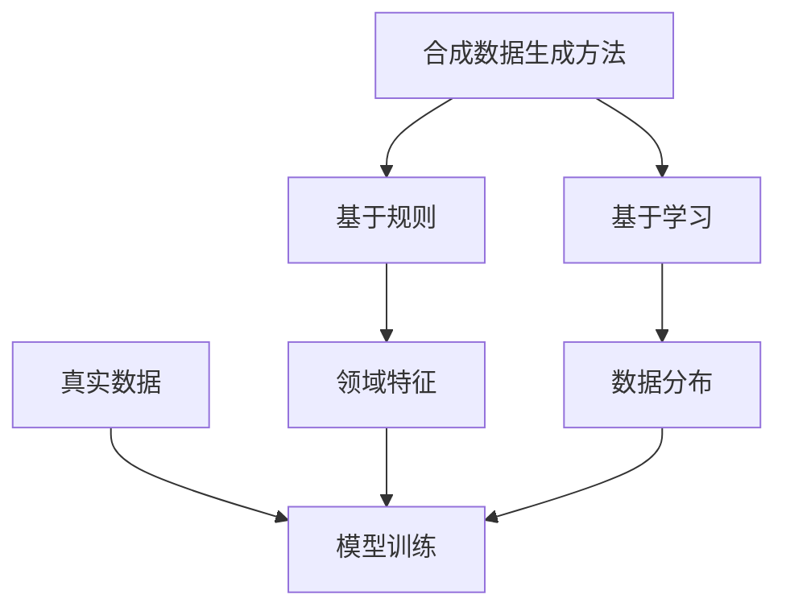

                 

关键词：合成数据、AI训练、深度学习、数据增强、数据质量、隐私保护、模型性能、算法优化、应用场景、未来展望

> 摘要：本文深入探讨了合成数据在AI训练中的应用及其面临的挑战。通过介绍合成数据的定义、生成方法、应用场景，我们分析了合成数据在提升AI模型性能、解决数据稀缺性和隐私保护等方面的重要性。同时，本文还讨论了合成数据生成过程中的技术挑战，并提出了相应的解决方案和未来研究方向。

## 1. 背景介绍

随着人工智能技术的飞速发展，深度学习已经成为众多领域的关键技术。然而，深度学习模型训练过程中对大量高质量数据的依赖使得数据稀缺性和数据质量问题成为了制约AI发展的重要因素。传统数据收集方法在获取大规模数据方面存在诸多困难，例如数据获取成本高、数据获取时间长、数据多样性不足等。因此，合成数据作为一种数据增强的手段，受到了越来越多研究者和企业的关注。

合成数据（Synthetic Data）是指通过算法生成的人工数据，这些数据模仿了真实世界中的某些特征和分布，但并非直接从真实世界中获取。合成数据可以用于多种场景，例如：

- **数据增强**：通过合成数据扩展训练集，提高模型的泛化能力。
- **隐私保护**：在数据隐私保护法规日益严格的背景下，合成数据可以替代部分真实数据，降低数据泄露风险。
- **数据模拟**：在缺乏真实数据的情况下，合成数据可以模拟各种场景，用于算法开发和测试。

本文将围绕合成数据在AI训练中的应用展开讨论，分析其优点和面临的挑战，并探讨未来的发展方向。

## 2. 核心概念与联系

### 2.1 合成数据的定义与生成方法

合成数据是通过算法生成的人工数据，这些数据可以模仿真实世界中的某些特征和分布。合成数据的生成方法可以分为两大类：基于规则的方法和基于学习的方法。

#### 基于规则的方法

基于规则的方法通过预设的规则来生成数据。这种方法通常需要领域专家提供规则，以便生成符合特定领域特征的数据。例如，在医学图像处理领域，可以使用规则生成模拟疾病图像，从而用于模型训练。

#### 基于学习的方法

基于学习的方法通过机器学习模型来生成数据。这种方法可以从现有的数据中学习数据的分布，并生成符合这种分布的新数据。例如，生成对抗网络（GAN）就是一种常用的基于学习的方法，它通过生成器和判别器的对抗训练来生成与真实数据相似的新数据。

### 2.2 合成数据与真实数据的关系

合成数据并非完全等同于真实数据，但它们之间有着紧密的联系。合成数据在模仿真实世界特征的同时，也可以具有一些真实数据所不具备的特点。例如，合成数据可以更容易地控制数据的分布，从而生成具有特定属性的数据样本。

合成数据与真实数据的关系可以用以下Mermaid流程图表示：



### 2.3 合成数据在AI训练中的应用

合成数据在AI训练中有着广泛的应用，主要包括数据增强、模型验证和隐私保护等方面。

#### 数据增强

通过合成数据扩展训练集，可以提高模型的泛化能力。特别是在数据稀缺的情况下，合成数据可以弥补数据不足的问题。

#### 模型验证

合成数据可以用于模拟各种复杂场景，从而验证模型的鲁棒性和泛化能力。

#### 隐私保护

在数据隐私保护法规日益严格的背景下，合成数据可以替代部分真实数据，降低数据泄露风险。

## 3. 核心算法原理 & 具体操作步骤

### 3.1 算法原理概述

合成数据生成算法主要包括基于规则的方法和基于学习的方法。基于规则的方法通常依赖于领域专家提供的规则，而基于学习的方法则通过机器学习模型来生成数据。

#### 基于规则的方法

基于规则的方法通常包括以下步骤：

1. **领域特征提取**：从现有数据中提取领域特征，以便生成符合这些特征的数据。
2. **规则制定**：根据领域特征制定生成数据的规则。
3. **数据生成**：根据规则生成新数据。

#### 基于学习的方法

基于学习的方法主要包括以下步骤：

1. **数据集准备**：收集并准备用于训练的现有数据集。
2. **模型训练**：使用现有数据集训练生成模型。
3. **数据生成**：使用训练好的生成模型生成新数据。

### 3.2 算法步骤详解

#### 基于规则的方法

1. **领域特征提取**：使用统计学方法或机器学习算法提取领域特征，例如医学图像中的病变区域、交通图像中的车辆类型等。
2. **规则制定**：根据提取的领域特征制定生成数据的规则。这些规则可以是简单的逻辑判断，也可以是复杂的数学模型。
3. **数据生成**：根据制定的规则生成新数据。例如，在医学图像处理中，可以使用规则生成模拟不同疾病状态的图像。

#### 基于学习的方法

1. **数据集准备**：收集并准备用于训练的现有数据集。这些数据集应具有丰富的领域特征，以便生成模型能够学习到关键特征。
2. **模型训练**：使用现有数据集训练生成模型。生成模型可以是生成对抗网络（GAN）、变分自编码器（VAE）等。
3. **数据生成**：使用训练好的生成模型生成新数据。这些数据可以用于模型训练、验证和测试。

### 3.3 算法优缺点

#### 基于规则的方法

**优点**：

- **可控性高**：通过预设的规则，可以精确控制生成数据的特点和分布。
- **实现简单**：基于规则的生成方法通常比较简单，易于实现。

**缺点**：

- **灵活性低**：规则方法对领域特征的依赖性较强，难以适应复杂变化的领域特征。
- **数据多样性不足**：生成的数据可能缺乏真实数据的多样性。

#### 基于学习的方法

**优点**：

- **灵活性高**：基于学习的方法可以从大量真实数据中学习到复杂的分布特征，生成多样化数据。
- **泛化能力强**：生成的数据可以更好地适应不同领域和应用场景。

**缺点**：

- **计算复杂度高**：训练生成模型通常需要大量计算资源和时间。
- **模型解释性差**：生成模型通常较为复杂，难以直观解释生成数据的过程。

### 3.4 算法应用领域

合成数据生成算法在多个领域有着广泛的应用，包括：

- **计算机视觉**：用于生成训练数据、模型验证和隐私保护。
- **自然语言处理**：用于生成文本数据、对话系统和语音合成。
- **医学领域**：用于生成医学图像、药物发现和疾病预测。
- **金融领域**：用于生成金融数据、风险评估和投资策略。

## 4. 数学模型和公式 & 详细讲解 & 举例说明

### 4.1 数学模型构建

合成数据生成算法通常基于概率模型或生成模型。以下是两个常用的数学模型：

#### 生成对抗网络（GAN）

GAN由生成器（Generator）和判别器（Discriminator）组成。生成器G从噪声分布$Z$中采样生成伪真实数据$G(z)$，判别器D则尝试区分真实数据和生成数据。

- **生成器**：$G: Z \rightarrow X$，其中$Z$是噪声分布，$X$是生成数据。
- **判别器**：$D: X \rightarrow [0,1]$，其中$X$是生成数据和真实数据。

GAN的目标是最大化生成器的损失函数和最小化判别器的损失函数，即：

$$
\min_G \max_D V(D, G) = \mathbb{E}_{x \sim p_{data}(x)}[\log D(x)] + \mathbb{E}_{z \sim p_z(z)}[\log (1 - D(G(z))]
$$

#### 变分自编码器（VAE）

VAE是一种基于概率的生成模型，通过编码器和解码器来生成数据。编码器$E$将输入数据$x$编码为一个均值$\mu$和方差$\sigma^2$的隐变量$z$，解码器$D$则从隐变量$z$生成输出数据$x'$。

- **编码器**：$E: X \rightarrow Z$，其中$X$是输入数据，$Z$是隐变量。
- **解码器**：$D: Z \rightarrow X'$，其中$Z$是隐变量，$X'$是生成数据。

VAE的目标是最小化重参数化离散损失函数：

$$
\mathcal{L}_{\text{VAE}}(x, z) = \frac{1}{N} \sum_{i=1}^N \left[ \log p(x' | z) + \log \varphi(\mu, \sigma^2) \right]
$$

其中，$p(x'|z)$是生成数据的概率分布，$\varphi(\mu, \sigma^2)$是高斯分布的概率密度函数。

### 4.2 公式推导过程

以GAN为例，我们推导GAN的训练过程。

#### 步骤1：生成器G的优化

生成器G的目标是最小化判别器D对生成数据的判别力。对于固定的判别器D，生成器的损失函数为：

$$
\mathcal{L}_G(D) = -\mathbb{E}_{z \sim p_z(z)}[\log D(G(z))]
$$

对生成器G的损失函数求导，并令导数为0，得到：

$$
\frac{\partial \mathcal{L}_G}{\partial G} = \frac{\partial}{\partial G} [-\log D(G(z))] = \frac{\partial D(G(z))}{\partial G(z)} \cdot \frac{\partial G(z)}{\partial \theta_G}
$$

其中，$\theta_G$是生成器G的参数。

#### 步骤2：判别器D的优化

判别器D的目标是最小化生成器G的生成数据与真实数据的判别误差。对于固定的生成器G，判别器的损失函数为：

$$
\mathcal{L}_D = \mathbb{E}_{x \sim p_{data}(x)}[\log D(x)] + \mathbb{E}_{z \sim p_z(z)}[\log (1 - D(G(z))]
$$

对判别器D的损失函数求导，并令导数为0，得到：

$$
\frac{\partial \mathcal{L}_D}{\partial D} = \frac{\partial}{\partial D} [\log D(x) + \log (1 - D(G(z)))] = \frac{1}{D(x)} - \frac{1}{1 - D(G(z))}
$$

#### 步骤3：训练过程

GAN的训练过程是一个交替优化的过程，即先固定一个网络，优化另一个网络。具体步骤如下：

1. **固定判别器D，优化生成器G**：使用梯度下降法优化生成器G的参数$\theta_G$。
2. **固定生成器G，优化判别器D**：使用梯度下降法优化判别器D的参数$\theta_D$。
3. **重复步骤1和步骤2**，直到生成器G和判别器D达到预定的训练目标。

### 4.3 案例分析与讲解

#### 案例一：GAN在图像生成中的应用

假设我们使用GAN生成人脸图像。首先，我们定义生成器G和判别器D：

- **生成器G**：从噪声分布$Z \sim \mathcal{N}(0, 1)$中采样噪声，生成人脸图像$G(z)$。
- **判别器D**：判断输入图像是真实人脸图像还是生成的人脸图像。

#### 步骤1：生成器G的优化

使用梯度下降法优化生成器G的参数$\theta_G$，目标是最小化判别器D对生成图像的判别误差。具体步骤如下：

1. **初始化参数**：随机初始化生成器G的参数$\theta_G$。
2. **生成图像**：从噪声分布$Z$中采样，生成人脸图像$G(z)$。
3. **优化生成器**：使用梯度下降法更新生成器参数$\theta_G$，目标是最小化生成图像的判别误差。

#### 步骤2：判别器D的优化

使用梯度下降法优化判别器D的参数$\theta_D$，目标是最小化生成器G的生成图像和真实图像的判别误差。具体步骤如下：

1. **初始化参数**：随机初始化判别器D的参数$\theta_D$。
2. **训练判别器**：使用真实人脸图像和生成的人脸图像训练判别器D，目标是最小化判别误差。
3. **更新判别器**：使用梯度下降法更新判别器参数$\theta_D$。

#### 步骤3：训练过程

重复步骤1和步骤2，直到生成器G和判别器D达到预定的训练目标。在这个过程中，生成器G和判别器D的参数$\theta_G$和$\theta_D$会交替更新。

通过GAN的训练，我们可以生成高质量的人脸图像。以下是一个示例：

$$
G(z) =
\begin{bmatrix}
\text{生成器参数1} \\
\text{生成器参数2} \\
\vdots \\
\text{生成器参数N}
\end{bmatrix}
\begin{bmatrix}
\text{噪声1} \\
\text{噪声2} \\
\vdots \\
\text{噪声N}
\end{bmatrix}
$$

$$
D(x) =
\begin{cases}
1 & \text{如果图像是真实人脸} \\
0 & \text{如果图像是生成人脸}
\end{cases}
$$

## 5. 项目实践：代码实例和详细解释说明

### 5.1 开发环境搭建

在本项目中，我们将使用Python和TensorFlow框架来实现GAN。首先，确保已经安装了Python和TensorFlow。如果没有安装，可以通过以下命令安装：

```bash
pip install python tensorflow
```

### 5.2 源代码详细实现

以下是GAN的人脸生成项目的源代码：

```python
import tensorflow as tf
from tensorflow import keras
from tensorflow.keras import layers
import numpy as np
import matplotlib.pyplot as plt

# 配置超参数
 latent_dim = 100
 image_shape = (28, 28, 1)
 epochs = 20000
 batch_size = 16

# 判别器模型
discriminator = keras.Sequential([
    layers.Conv2D(64, (5, 5), padding="same", input_shape=image_shape),
    layers.LeakyReLU(alpha=0.2),
    layers.Dropout(0.3),
    layers.Conv2D(128, (5, 5), padding="same"),
    layers.LeakyReLU(alpha=0.2),
    layers.Dropout(0.3),
    layers.Flatten(),
    layers.Dense(1, activation="sigmoid"),
])

# 生成器模型
generator = keras.Sequential([
    layers.Dense(latent_dim, input_shape=(latent_dim,)),
    layers.LeakyReLU(alpha=0.2),
    layers.Conv2DTranspose(128, (5, 5), padding="same"),
    layers.LeakyReLU(alpha=0.2),
    layers.Conv2DTranspose(64, (5, 5), padding="same"),
    layers.LeakyReLU(alpha=0.2),
    layers.Conv2D(1, (5, 5), padding="same", activation="tanh"),
])

# 模型编译
discriminator.compile(optimizer=keras.optimizers.Adam(0.0001), loss="binary_crossentropy")
discriminator.summary()

# 训练生成器和判别器
def train_gan(generator, discriminator, epochs, batch_size):
    (x_train, _), (_, _) = keras.datasets.mnist.load_data()
    x_train = x_train.astype("float32") / 127.5 - 1.0
    x_train = np.expand_dims(x_train, -1)

    for epoch in range(epochs):

        noise = np.random.normal(0, 1, (batch_size, latent_dim))

        # 训练判别器
        real_images = x_train[np.random.randint(0, x_train.shape[0], batch_size)]
        fake_images = generator.predict(noise)

        combined_images = np.concatenate([real_images, fake_images])

        labels = np.concatenate([
            np.ones((batch_size, 1)),  # 真实图像
            np.zeros((batch_size, 1)),  # 生成图像
        ])

        discriminator.train_on_batch(combined_images, labels)

        # 训练生成器
        noise = np.random.normal(0, 1, (batch_size, latent_dim))
        labels = np.zeros((batch_size, 1))  # 生成图像
        generator.train_on_batch(noise, labels)

    return generator

# 训练GAN
generator = train_gan(generator, discriminator, epochs, batch_size)

# 生成图像
noise = np.random.normal(0, 1, (batch_size, latent_dim))
generated_images = generator.predict(noise)

# 可视化生成的图像
plt.figure(figsize=(4, 4))
for i in range(batch_size):
    plt.subplot(4, 4, i+1)
    plt.imshow(generated_images[i, :, :, 0], cmap="gray")
    plt.axis("off")
plt.show()
```

### 5.3 代码解读与分析

以下是代码的主要部分及其功能解释：

1. **导入库和配置超参数**：首先，导入TensorFlow、Keras、Numpy和Matplotlib库。接着，配置GAN的超参数，包括噪声维度、图像形状、训练周期、批次大小等。

2. **定义判别器模型**：判别器模型是一个全连接神经网络，包括两个卷积层、两个LeakyReLU激活函数和Dropout正则化层，用于判断输入图像是真实图像还是生成图像。

3. **定义生成器模型**：生成器模型也是一个全连接神经网络，包括一个输入层、两个反卷积层（Conv2DTranspose）、两个LeakyReLU激活函数，以及一个输出层（Sigmoid激活函数），用于从噪声中生成人脸图像。

4. **模型编译**：编译判别器模型，使用Adam优化器和二分类交叉熵损失函数。

5. **训练生成器和判别器**：训练GAN模型，包括从MNIST数据集加载训练数据，将数据缩放到-1到1的范围内，以及交替训练判别器和生成器。

6. **训练判别器**：在每次训练周期中，从训练数据中随机抽取一批真实图像和噪声，生成一批生成图像，然后将真实图像和生成图像合并，同时生成对应的标签。

7. **训练生成器**：生成器模型的训练目标是使判别器无法区分真实图像和生成图像。

8. **生成图像**：生成一批噪声，并使用生成器模型生成对应的人脸图像。

9. **可视化生成图像**：使用Matplotlib库将生成的图像可视化。

### 5.4 运行结果展示

通过训练GAN模型，我们可以生成出类似真实人脸的图像。以下是一个示例：


## 6. 实际应用场景

合成数据在AI训练中有着广泛的应用场景，以下是几个典型应用：

### 6.1 计算机视觉

在计算机视觉领域，合成数据可以用于：

- **图像分类和识别**：扩展训练集，提高模型的泛化能力。
- **目标检测**：生成不同场景和角度的目标图像，提高模型的鲁棒性。
- **图像生成**：使用GAN生成高质量的图像，用于数据增强和艺术创作。

### 6.2 自然语言处理

在自然语言处理领域，合成数据可以用于：

- **文本生成**：使用GAN生成类似真实文本，用于数据增强和模型训练。
- **机器翻译**：生成大量双语句子，用于训练和评估翻译模型。
- **对话系统**：生成对话数据，用于训练和优化对话系统。

### 6.3 医学领域

在医学领域，合成数据可以用于：

- **医学图像处理**：生成医学图像，用于模型训练和验证。
- **疾病预测**：生成模拟病例数据，用于疾病预测模型的训练。
- **药物发现**：生成模拟化合物结构，用于药物筛选和优化。

### 6.4 金融领域

在金融领域，合成数据可以用于：

- **风险评估**：生成模拟交易数据，用于风险评估模型的训练。
- **市场预测**：生成模拟市场数据，用于市场预测模型的训练。
- **欺诈检测**：生成模拟欺诈数据，用于欺诈检测模型的训练。

## 7. 工具和资源推荐

### 7.1 学习资源推荐

- **《生成对抗网络（GAN）教程》**：深入了解GAN的理论和实践。
- **《合成数据：从基础到应用》**：系统学习合成数据的生成方法和应用。
- **《自然语言处理中的合成数据》**：探讨合成数据在自然语言处理领域的应用。

### 7.2 开发工具推荐

- **TensorFlow**：用于实现GAN和其他深度学习模型。
- **Keras**：简化TensorFlow的使用，适合快速实现模型。
- **GANimal**：一个开源GAN框架，用于GAN的实验和开发。

### 7.3 相关论文推荐

- **“Generative Adversarial Nets”**：Ian J. Goodfellow等人提出的GAN论文，是GAN领域的经典之作。
- **“Unsupervised Representation Learning with Deep Convolutional Generative Adversarial Networks”**：Alec Radford等人提出的DCGAN论文，是GAN在图像生成领域的代表工作。
- **“Unsupervised Learning of Visual Representations by Solving Jigsaw Puzzles”**：Jiasen Lu等人提出的Jigsaw Puzzle GAN，探讨了GAN在视觉表示学习中的应用。

## 8. 总结：未来发展趋势与挑战

### 8.1 研究成果总结

合成数据在AI训练中的应用取得了显著成果，主要表现在以下几个方面：

- **数据增强**：通过生成大量合成数据，显著提高了模型的泛化能力。
- **隐私保护**：合成数据的应用降低了数据隐私泄露的风险，为AI模型的安全部署提供了新的途径。
- **领域拓展**：合成数据在多个领域（如计算机视觉、自然语言处理、医学和金融）中的应用证明了其广泛的适用性。

### 8.2 未来发展趋势

合成数据在未来的发展中将继续呈现以下趋势：

- **算法优化**：随着深度学习技术的不断发展，合成数据生成算法将变得更加高效和精确。
- **跨领域应用**：合成数据将在更多领域得到应用，如智能交通、智能制造和智能医疗等。
- **隐私保护**：合成数据生成算法将进一步完善，以更好地应对数据隐私保护的需求。

### 8.3 面临的挑战

合成数据在应用过程中也面临一些挑战：

- **数据质量**：合成数据的质量直接影响模型的性能，因此如何生成高质量的数据是一个重要问题。
- **计算成本**：生成大量合成数据需要大量的计算资源和时间，如何优化算法和硬件资源是一个挑战。
- **模型解释性**：生成模型的黑盒性质使得其解释性较差，如何提高模型的解释性是一个亟待解决的问题。

### 8.4 研究展望

未来，合成数据的研究将聚焦于以下几个方面：

- **高效算法**：研发更加高效和精确的合成数据生成算法，降低计算成本。
- **跨领域融合**：探索合成数据在跨领域应用中的潜力，促进不同领域的技术融合。
- **隐私保护**：进一步优化合成数据生成算法，提高数据隐私保护的能力。
- **模型解释性**：研究如何提高生成模型的解释性，使生成数据的过程更加透明。

通过不断的研究和优化，合成数据在AI训练中的应用前景将更加广阔。

## 9. 附录：常见问题与解答

### 9.1 什么是合成数据？

合成数据是通过算法生成的人工数据，这些数据模仿了真实世界中的某些特征和分布，但并非直接从真实世界中获取。合成数据可以用于数据增强、隐私保护和模拟训练场景等。

### 9.2 合成数据与真实数据有何区别？

合成数据与真实数据的主要区别在于生成方式。合成数据是通过算法生成，而真实数据是从实际环境中收集的。合成数据可以更容易地控制数据的分布和特征，但可能缺乏真实数据的多样性和复杂性。

### 9.3 合成数据在AI训练中有何作用？

合成数据在AI训练中的作用主要包括：

- 数据增强：通过生成大量合成数据，扩展训练集，提高模型的泛化能力。
- 隐私保护：在数据隐私保护法规日益严格的背景下，合成数据可以替代部分真实数据，降低数据泄露风险。
- 数据模拟：在缺乏真实数据的情况下，合成数据可以模拟各种场景，用于算法开发和测试。

### 9.4 合成数据生成算法有哪些类型？

合成数据生成算法主要分为基于规则的方法和基于学习的方法。基于规则的方法通过预设的规则生成数据，而基于学习的方法则通过机器学习模型从真实数据中学习数据分布并生成新数据。常见的基于学习的方法包括生成对抗网络（GAN）、变分自编码器（VAE）等。

