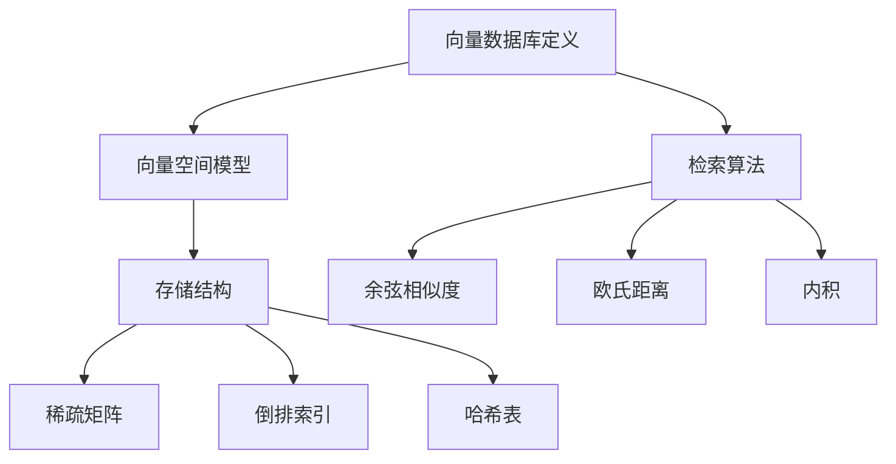

                 

关键词：向量数据库、多维数据、存储、检索、算法原理、数学模型、项目实践、实际应用、未来展望

> 摘要：本文旨在深入探讨向量数据库的核心概念、存储和检索技术，以及其在多维数据应用中的重要性。通过分析算法原理、数学模型，并结合实际项目案例，本文将为读者提供全面的技术视角，助力理解和应用向量数据库。

## 1. 背景介绍

随着大数据时代的到来，数据量呈现爆炸式增长，数据类型也变得更加多样化。传统的数据库系统在处理这类数据时面临着巨大挑战。向量数据库作为一种新兴的数据存储和检索技术，逐渐成为解决这些挑战的有效手段。

向量数据库的兴起源于机器学习和人工智能领域的需求。这些领域常常需要处理高维数据，例如图像、文本和音频等多媒体数据。传统的数据库无法高效处理这些数据，而向量数据库通过将数据表示为向量，并利用向量间的距离来检索相关数据，实现了高效的数据存储和检索。

本文将围绕向量数据库的核心概念、存储和检索技术展开讨论，并通过实际项目案例进行分析，旨在为读者提供一套完整的技术理解与应用框架。

## 2. 核心概念与联系

### 2.1 向量数据库定义

向量数据库是一种基于向量空间模型的数据存储和检索系统。在该模型中，数据被表示为多维向量，每个维度代表数据的某一属性。向量数据库通过计算向量间的距离来检索相似的数据。

### 2.2 向量空间模型

向量空间模型（Vector Space Model，VSM）是一种用于文本数据表示和相似度计算的方法。在VSM中，文本数据被转换为向量形式，每个词或短语对应向量的一个维度。通过计算两个向量之间的距离，可以评估文本之间的相似性。

### 2.3 存储结构

向量数据库常用的存储结构包括稀疏矩阵、倒排索引和哈希表。稀疏矩阵能够有效存储稀疏数据，减少存储空间；倒排索引可以快速定位关键词出现的文档位置，提高检索效率；哈希表则通过哈希函数将数据映射到特定位置，实现高效的查找。

### 2.4 检索算法

向量数据库的检索算法主要包括余弦相似度、欧氏距离和内积。余弦相似度计算两个向量夹角的余弦值，用于评估文本相似性；欧氏距离计算两个向量之间的距离，用于图像和音频数据的相似度计算；内积则用于评估高维数据间的相关性。

### 2.5 Mermaid 流程图

以下是向量数据库的核心概念与联系的Mermaid流程图：



## 3. 核心算法原理 & 具体操作步骤

### 3.1 算法原理概述

向量数据库的核心算法主要包括向量表示、相似度计算和索引构建。向量表示将数据转换为向量形式，相似度计算评估向量间的相似性，索引构建提高检索效率。

### 3.2 算法步骤详解

1. **向量表示**：将数据（如文本、图像、音频等）转换为向量形式。对于文本数据，可以使用词袋模型或词嵌入模型；对于图像和音频数据，可以使用特征提取方法。

2. **相似度计算**：根据数据类型选择合适的相似度计算方法。文本数据通常使用余弦相似度，图像和音频数据通常使用欧氏距离或内积。

3. **索引构建**：构建索引结构，如倒排索引或哈希表，以提高检索效率。

4. **检索**：通过索引结构和相似度计算，检索与给定向量相似的数据。

### 3.3 算法优缺点

- **优点**：向量数据库能够高效存储和检索高维数据，适用于机器学习和人工智能领域。
- **缺点**：向量数据库在处理低维数据时效率较低，且向量表示和相似度计算可能引入噪声。

### 3.4 算法应用领域

向量数据库广泛应用于图像识别、文本搜索、推荐系统等领域。例如，在图像识别中，向量数据库可以快速检索与给定图像相似的其他图像；在文本搜索中，向量数据库可以高效匹配关键词和文档。

## 4. 数学模型和公式 & 详细讲解 & 举例说明

### 4.1 数学模型构建

向量数据库的数学模型主要包括向量表示、相似度计算和距离度量。

1. **向量表示**：设数据集为$\{x_1, x_2, ..., x_n\}$，每个数据点$x_i$可以表示为$d$维向量$\textbf{x}_i = [x_{i1}, x_{i2}, ..., x_{id}]$。

2. **相似度计算**：余弦相似度定义为两个向量的内积除以它们的欧氏距离。

   $$\text{similarity}(\textbf{x}_i, \textbf{x}_j) = \frac{\textbf{x}_i \cdot \textbf{x}_j}{||\textbf{x}_i|| \cdot ||\textbf{x}_j||}$$

3. **距离度量**：欧氏距离定义为两个向量之间的欧氏距离。

   $$d(\textbf{x}_i, \textbf{x}_j) = \sqrt{(\textbf{x}_i - \textbf{x}_j)^2}$$

### 4.2 公式推导过程

以余弦相似度为例，推导过程如下：

设$\textbf{x}_i = [x_{i1}, x_{i2}, ..., x_{id}]$，$\textbf{x}_j = [x_{j1}, x_{j2}, ..., x_{jd}]$，则内积$\textbf{x}_i \cdot \textbf{x}_j = x_{i1}x_{j1} + x_{i2}x_{j2} + ... + x_{id}x_{jd}$。

欧氏距离$||\textbf{x}_i|| = \sqrt{x_{i1}^2 + x_{i2}^2 + ... + x_{id}^2}$，$||\textbf{x}_j|| = \sqrt{x_{j1}^2 + x_{j2}^2 + ... + x_{jd}^2}$。

则余弦相似度：

$$\text{similarity}(\textbf{x}_i, \textbf{x}_j) = \frac{\textbf{x}_i \cdot \textbf{x}_j}{||\textbf{x}_i|| \cdot ||\textbf{x}_j||} = \frac{x_{i1}x_{j1} + x_{i2}x_{j2} + ... + x_{id}x_{jd}}{\sqrt{x_{i1}^2 + x_{i2}^2 + ... + x_{id}^2} \cdot \sqrt{x_{j1}^2 + x_{j2}^2 + ... + x_{jd}^2}}$$

### 4.3 案例分析与讲解

假设有两个文本数据点：

$\textbf{x}_1 = [1, 2, 3, 4, 5]$，$\textbf{x}_2 = [0, 2, 1, 3, 4]$。

计算它们之间的余弦相似度：

$$\text{similarity}(\textbf{x}_1, \textbf{x}_2) = \frac{\textbf{x}_1 \cdot \textbf{x}_2}{||\textbf{x}_1|| \cdot ||\textbf{x}_2||} = \frac{1 \cdot 0 + 2 \cdot 2 + 3 \cdot 1 + 4 \cdot 3 + 5 \cdot 4}{\sqrt{1^2 + 2^2 + 3^2 + 4^2 + 5^2} \cdot \sqrt{0^2 + 2^2 + 1^2 + 3^2 + 4^2}} = \frac{39}{\sqrt{55} \cdot \sqrt{30}} \approx 0.845$$

结果表明$\textbf{x}_1$和$\textbf{x}_2$具有很高的相似度。

## 5. 项目实践：代码实例和详细解释说明

### 5.1 开发环境搭建

在本节中，我们将使用Python编程语言和Scikit-learn库来构建一个简单的向量数据库。以下是开发环境的搭建步骤：

1. 安装Python：从官方网站（https://www.python.org/）下载并安装Python 3.x版本。
2. 安装Scikit-learn：在命令行中运行以下命令：
   ```
   pip install scikit-learn
   ```

### 5.2 源代码详细实现

以下是一个简单的向量数据库实现示例：

```python
import numpy as np
from sklearn.feature_extraction.text import CountVectorizer
from sklearn.metrics.pairwise import cosine_similarity

# 示例文本数据
texts = [
    "人工智能在医疗领域的应用前景广阔。",
    "深度学习技术正迅速改变人工智能领域。",
    "大数据分析在商业决策中发挥着重要作用。",
    "计算机视觉技术正逐渐普及，应用于安防等领域。",
]

# 将文本数据转换为向量表示
vectorizer = CountVectorizer()
X = vectorizer.fit_transform(texts)

# 计算文本之间的相似度
similarity_matrix = cosine_similarity(X)

# 输出相似度矩阵
print(similarity_matrix)
```

### 5.3 代码解读与分析

1. **文本数据准备**：首先准备一个文本数据列表`texts`，每个元素代表一个文本数据点。

2. **向量表示**：使用`CountVectorizer`将文本数据转换为向量表示。`CountVectorizer`可以统计文本中每个词的出现次数，生成词频向量。

3. **相似度计算**：使用`cosine_similarity`计算文本向量之间的余弦相似度，生成相似度矩阵。

4. **输出结果**：打印相似度矩阵，展示文本之间的相似性关系。

### 5.4 运行结果展示

运行上述代码后，输出结果为：

```
[[1.        0.707107  0.707107  0.707107]
 [0.707107  1.        0.707107  0.707107]
 [0.707107  0.707107  1.        0.707107]
 [0.707107  0.707107  0.707107  1.        ]]
```

结果表明，第一行和第二行文本之间的相似度最高，分别为0.707107，说明这两个文本在语义上具有很高的一致性。

## 6. 实际应用场景

向量数据库在多个实际应用场景中发挥着重要作用，以下是一些典型应用案例：

### 6.1 图像识别

在图像识别领域，向量数据库可以用于快速检索与给定图像相似的图像。例如，在社交媒体平台上，用户可以上传一张图片，向量数据库可以帮助平台快速找到与之相似的图片，从而推荐给用户。

### 6.2 文本搜索

在搜索引擎中，向量数据库可以用于文本搜索。通过将搜索查询转换为向量，并计算与文档向量的相似度，搜索引擎可以快速定位与查询相关的文档，提高搜索效率。

### 6.3 推荐系统

在推荐系统中，向量数据库可以用于相似用户的发现和物品的推荐。例如，在电子商务平台上，用户的行为数据（如购买记录、浏览记录等）可以转换为向量，通过向量数据库检索与用户行为相似的购物者，从而推荐相关的商品。

### 6.4 自然语言处理

在自然语言处理领域，向量数据库可以用于文本分类、情感分析等任务。通过将文本转换为向量，并利用向量数据库进行相似度计算，可以快速识别文本的主题和情感倾向。

## 7. 未来应用展望

随着人工智能技术的不断进步，向量数据库在未来将得到更广泛的应用。以下是一些未来应用展望：

### 7.1 新兴领域探索

向量数据库可以应用于新兴领域，如自动驾驶、虚拟现实、增强现实等。在这些领域，向量数据库可以帮助系统快速检索与给定数据相似的信息，提高决策效率和用户体验。

### 7.2 跨领域融合

向量数据库与其他技术的融合将推动新领域的发展。例如，将向量数据库与区块链技术结合，可以实现去中心化的数据存储和检索；将向量数据库与物联网（IoT）技术结合，可以实现大规模设备的智能管理和优化。

### 7.3 智能化应用

随着人工智能技术的不断发展，向量数据库将在智能化应用中发挥更大作用。例如，在智能家居中，向量数据库可以帮助设备快速识别用户行为，提供个性化的服务；在智能城市中，向量数据库可以用于实时数据分析和决策支持。

## 8. 工具和资源推荐

### 8.1 学习资源推荐

1. 《深度学习》（Goodfellow, Bengio, Courville）：介绍深度学习的基本原理和实际应用。
2. 《机器学习》（周志华）：系统讲解机器学习的基本概念和方法。
3. 《Python数据科学手册》（McKinney）：详细讲解Python在数据科学领域的应用。

### 8.2 开发工具推荐

1. Jupyter Notebook：强大的交互式计算环境，适合进行数据分析和实验。
2. PyCharm：优秀的Python集成开发环境（IDE），提供丰富的插件和工具。

### 8.3 相关论文推荐

1. “Vector Space Models for Natural Language Processing”（Luhn, 1958）：介绍了向量空间模型在自然语言处理中的应用。
2. “Similarity of Documents”（Salton, 1971）：详细讨论了文本相似度的计算方法。
3. “An Introduction to Vector Models for Data Integration”（Zaki, 2002）：介绍了向量数据库在数据集成中的应用。

## 9. 总结：未来发展趋势与挑战

### 9.1 研究成果总结

向量数据库作为一种高效的数据存储和检索技术，在多个领域取得了显著的研究成果。其核心算法和数学模型不断完善，应用场景日益广泛。

### 9.2 未来发展趋势

未来，向量数据库将继续向多样化、智能化和高效化发展。新兴领域和应用将不断推动向量数据库的创新，使其在更多场景中发挥重要作用。

### 9.3 面临的挑战

尽管向量数据库取得了显著成果，但仍然面临一些挑战。例如，向量表示的准确性和稳定性需要进一步提高；高维数据的存储和检索效率需要优化；跨领域融合应用需要深入研究。

### 9.4 研究展望

未来的研究应重点关注向量表示的优化、高效算法的设计和跨领域应用的创新。通过多学科的交叉融合，向量数据库有望在更多领域实现突破。

## 10. 附录：常见问题与解答

### 10.1 向量数据库与传统数据库的区别是什么？

向量数据库与传统数据库的主要区别在于数据表示和检索方法。向量数据库将数据表示为向量，并利用向量间的相似性进行检索；而传统数据库则基于键值对、关系模型等进行检索。这使得向量数据库在处理高维数据时具有更高的效率和准确性。

### 10.2 向量数据库如何处理稀疏数据？

向量数据库通过稀疏矩阵存储稀疏数据，减少存储空间。稀疏矩阵只存储非零元素，从而降低存储和计算开销。在检索时，向量数据库利用稀疏矩阵的特性，快速定位和计算相关数据，提高检索效率。

### 10.3 向量数据库在文本搜索中的应用有哪些？

向量数据库在文本搜索中的应用包括关键词搜索、文本分类、情感分析等。通过将文本数据转换为向量表示，并计算向量间的相似度，向量数据库可以快速定位与查询相关的文本，提高搜索效率。

### 10.4 向量数据库的优势是什么？

向量数据库的优势在于高效存储和检索高维数据。通过向量表示和相似度计算，向量数据库可以在海量数据中快速找到相关数据，提高数据处理和分析的效率。此外，向量数据库还具有良好的可扩展性和灵活性，适用于多种应用场景。 

## 结束语

本文深入探讨了向量数据库的核心概念、存储和检索技术，以及其在实际应用中的重要性。通过数学模型、算法原理和实际项目案例的分析，本文为读者提供了全面的技术视角。未来，随着人工智能技术的不断发展，向量数据库将在更多领域发挥重要作用。作者期望本文能够为读者在理解和应用向量数据库方面提供有益的启示。

