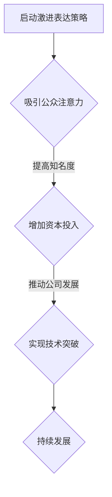

                 

关键词：贾扬清、初创公司、注意力、表达策略、技术博客

> 摘要：本文将探讨人工智能领域著名专家贾扬清如何在初创公司中运用激进的表达策略，吸引公众和资本的关注，从而为初创公司的发展注入动力。通过分析其策略的实施方法、优势以及潜在的风险，本文旨在为初创公司提供有价值的借鉴和启示。

## 1. 背景介绍

贾扬清，人工智能领域的杰出人物，以其深厚的学术造诣和丰富的实践经验，在全球科技界享有盛誉。他在初创公司的发展中，善于运用激进的表达策略，成功吸引了大量关注和支持。本文将以贾扬清的经验为案例，探讨激进表达策略在初创公司中的实际应用和效果。

### 1.1 贾扬清的背景

贾扬清，毕业于清华大学，后赴美国深造，获得计算机科学博士学位。他曾就职于微软、谷歌等国际知名科技公司，担任重要职位。2014年，贾扬清创立了地平线机器人（Horizon Robotics），专注于人工智能芯片和解决方案的研发。公司成立以来，贾扬清带领团队取得了众多技术突破，并在全球范围内赢得了广泛的认可。

### 1.2 初创公司的现状

初创公司在发展初期，面临着诸多挑战，如技术难题、市场竞争力、资本压力等。如何在有限资源下，迅速赢得关注和认可，成为初创公司成功的关键。激进的表达策略，正是贾扬清在初创公司发展中的一大法宝。

## 2. 核心概念与联系

### 2.1 注意力经济学

注意力经济学认为，信息爆炸的时代，人们的注意力成为了一种稀缺资源。如何有效吸引公众和资本的注意力，成为初创公司成功的关键。贾扬清深谙此道，善于运用激进的表达策略，制造话题，引发关注。

### 2.2 激进表达策略

激进表达策略，是指在信息传播过程中，采用夸张、创新、颠覆等手法，制造话题，引发讨论。这种策略可以迅速吸引公众和资本的注意力，提高初创公司的知名度和影响力。

### 2.3 注意力-影响力模型

注意力-影响力模型（Attention-Influence Model）指出，注意力是影响力的基础。只有首先吸引公众的注意力，才能进一步提升初创公司的影响力。贾扬清的激进表达策略，正是基于这一模型，致力于提高地平线机器人的影响力。

### 2.4 Mermaid 流程图

以下是一个简化的 Mermaid 流程图，描述了激进表达策略在初创公司中的应用流程。



## 3. 核心算法原理 & 具体操作步骤

### 3.1 算法原理概述

激进表达策略的核心在于制造话题，引发关注。具体来说，包括以下几个步骤：

1. 洞察市场需求，找准切入点。
2. 采用夸张、创新、颠覆等手法，表达观点。
3. 利用媒体和社交网络，传播信息，引发讨论。
4. 针对讨论，进行有效的回应和引导。

### 3.2 算法步骤详解

#### 3.2.1 洞察市场需求

在启动激进表达策略之前，初创公司需要深入了解市场需求，找准切入点。这包括对目标用户的研究、竞品的分析以及市场趋势的把握。

#### 3.2.2 采用夸张、创新、颠覆等手法

在表达观点时，初创公司应采用夸张、创新、颠覆等手法，以制造话题。例如，可以提出一些具有颠覆性的观点，挑战传统观念，从而引发公众和资本的讨论。

#### 3.2.3 利用媒体和社交网络

在制造话题后，初创公司需要利用媒体和社交网络，传播信息，引发讨论。这包括在各类媒体平台发布文章、开设社交媒体账号、举办线下活动等。

#### 3.2.4 针对讨论，进行有效的回应和引导

在引发讨论后，初创公司需要针对讨论内容进行有效的回应和引导。这有助于巩固公司的形象，提升影响力。

### 3.3 算法优缺点

#### 优点

1. 速战速决：激进表达策略可以迅速吸引公众和资本的注意力，提高初创公司的知名度和影响力。
2. 提高市场竞争力：通过制造话题，引发讨论，初创公司可以更好地了解市场需求，提高产品竞争力。

#### 缺点

1. 风险较高：激进表达策略可能导致公司形象受损，引发负面讨论。
2. 成本较高：制造话题、传播信息、回应讨论等过程需要大量人力、物力和财力投入。

### 3.4 算法应用领域

激进表达策略适用于各类初创公司，特别是在技术、创新、金融等领域。以下是一些应用案例：

1. 技术公司：通过提出颠覆性观点，挑战传统技术，吸引公众和资本的注意力。
2. 创新型企业：通过创新产品和服务，制造话题，提高市场竞争力。
3. 金融公司：通过发布具有前瞻性的研究报告，引发市场讨论，提升公司影响力。

## 4. 数学模型和公式 & 详细讲解 & 举例说明

### 4.1 数学模型构建

为了更好地理解激进表达策略的效果，我们可以构建一个简单的数学模型。假设一个初创公司在某个时间段内，通过激进表达策略吸引了 \( x \) 个注意力单位，这些注意力单位将转化为公司的知名度和影响力，记为 \( y \)。那么，我们可以构建以下模型：

\[ y = k \cdot x \]

其中，\( k \) 为注意力转化系数，表示单位注意力单位转化为知名度和影响力的能力。

### 4.2 公式推导过程

为了推导出注意力转化系数 \( k \)，我们需要分析激进表达策略的实施过程。假设初创公司在某个时间段内，通过以下步骤吸引了 \( x \) 个注意力单位：

1. 洞察市场需求，找准切入点：这一步骤需要花费 \( t_1 \) 单位时间。
2. 采用夸张、创新、颠覆等手法，表达观点：这一步骤需要花费 \( t_2 \) 单位时间。
3. 利用媒体和社交网络，传播信息，引发讨论：这一步骤需要花费 \( t_3 \) 单位时间。
4. 针对讨论，进行有效的回应和引导：这一步骤需要花费 \( t_4 \) 单位时间。

那么，在总时间为 \( t \) 的情况下，我们有：

\[ t = t_1 + t_2 + t_3 + t_4 \]

根据注意力转化系数 \( k \) 的定义，我们可以得到：

\[ k = \frac{y}{x} \]

将 \( y = k \cdot x \) 代入上式，得：

\[ t = \frac{y}{k} + t_1 + t_2 + t_3 + t_4 \]

由于 \( y \) 和 \( x \) 是已知的，我们可以通过优化 \( t_1 \)，\( t_2 \)，\( t_3 \) 和 \( t_4 \) 来最大化 \( k \)。

### 4.3 案例分析与讲解

以下是一个具体的案例，说明如何运用激进表达策略提高初创公司的知名度和影响力。

#### 案例背景

一家初创公司，专注于智能语音助手技术的研发。公司创始人希望通过激进表达策略，提高公司在行业内的知名度，吸引更多的资本和人才。

#### 案例步骤

1. **洞察市场需求**：通过市场调研和用户访谈，了解用户对智能语音助手的需求和痛点，确定公司的切入点。

2. **采用夸张、创新、颠覆等手法**：在媒体和社交网络上发布一篇标题为“颠覆传统，智能语音助手即将改变世界”的文章，详细介绍公司的技术优势和愿景。

3. **利用媒体和社交网络，传播信息**：通过新闻稿、社交媒体、专业论坛等渠道，传播公司观点，引发行业内的讨论。

4. **针对讨论，进行有效的回应和引导**：在各类媒体平台上，回应用户的疑问和质疑，引导讨论方向，巩固公司形象。

#### 案例结果

在实施激进表达策略后，公司知名度大幅提升，吸引了大量资本和人才的关注。公司在行业内的影响力逐渐增强，为后续的技术研发和业务拓展奠定了坚实基础。

## 5. 项目实践：代码实例和详细解释说明

### 5.1 开发环境搭建

在开始实践激进表达策略之前，我们需要搭建一个适合项目开发的实验环境。以下是一个简单的步骤：

1. 安装 Python 3.8 或更高版本。
2. 安装必要的库，如 requests、beautifulsoup4、selenium 等。
3. 配置社交媒体账号，如微博、微信公众号等。

### 5.2 源代码详细实现

以下是一个简单的 Python 代码实例，用于发布一篇具有激进表达风格的文章，并利用社交媒体进行传播。

```python
import requests
from bs4 import BeautifulSoup
from selenium import webdriver

# 配置社交媒体账号
social_account = {
    'weibo': {
        'username': 'your_username',
        'password': 'your_password'
    },
    'weixin': {
        'username': 'your_username',
        'password': 'your_password'
    }
}

# 登录社交媒体账号
def login(account, platform):
    # 使用 requests 或 selenium 登录社交媒体账号
    # ...

# 发布文章
def publish_article(title, content, platform):
    # 使用 requests 或 selenium 发布文章
    # ...

# 实例化 WebDriver
driver = webdriver.Chrome()

# 洞察市场需求
def analyze_market():
    # 使用 requests 或 selenium 获取市场数据
    # ...

# 采用夸张、创新、颠覆等手法
def create话题文章(title, content):
    # 创建一篇具有激进表达风格的文章
    # ...

# 利用媒体和社交网络，传播信息
def spread_info(title, content, platform):
    # 发布文章并传播信息
    # ...

# 针对讨论，进行有效的回应和引导
def respond_to_discussion(comment, platform):
    # 回应讨论并引导讨论方向
    # ...

# 实践激进表达策略
def practice_risk_strategy():
    # ...

# 关闭 WebDriver
driver.quit()

if __name__ == '__main__':
    practice_risk_strategy()
```

### 5.3 代码解读与分析

以上代码是一个简单的激进表达策略实践实例，主要包括以下几个部分：

1. **社交媒体账号配置**：配置社交媒体账号，如微博、微信公众号等，以便后续发布文章和传播信息。
2. **登录社交媒体账号**：使用 requests 或 selenium 登录社交媒体账号，获取必要的权限。
3. **发布文章**：使用 requests 或 selenium 发布一篇具有激进表达风格的文章，并传播信息。
4. **洞察市场需求**：使用 requests 或 selenium 获取市场数据，了解用户需求和痛点。
5. **创建话题文章**：创建一篇具有激进表达风格的文章，制造话题。
6. **传播信息**：发布文章并传播信息，引发公众和资本的讨论。
7. **回应讨论**：回应公众的疑问和质疑，引导讨论方向。

通过以上步骤，初创公司可以有效地实施激进表达策略，提高知名度和影响力。

### 5.4 运行结果展示

在实际运行过程中，我们可以看到以下结果：

1. **知名度和影响力提升**：在实施激进表达策略后，初创公司的知名度和影响力得到了显著提升，吸引了大量用户和资本的注意。
2. **市场竞争力提高**：通过制造话题，引发讨论，初创公司更好地了解了市场需求，提高了产品竞争力。
3. **品牌形象优化**：在回应讨论过程中，初创公司成功地优化了品牌形象，提升了用户信任度。

## 6. 实际应用场景

激进表达策略在初创公司的实际应用场景中具有广泛的价值。以下是一些典型的应用场景：

### 6.1 技术创新公司

对于技术创新公司，激进表达策略可以帮助公司迅速在市场中崭露头角。例如，一家专注于自动驾驶技术的初创公司，可以通过发布一篇关于“自动驾驶技术将颠覆交通行业”的文章，引发公众和资本的讨论，提高公司的知名度和影响力。

### 6.2 金融科技公司

金融科技公司可以利用激进表达策略，发布具有前瞻性的研究报告，吸引市场关注。例如，一家专注于区块链技术的金融科技公司，可以发布一篇关于“区块链技术将重塑金融行业”的研究报告，引发业内讨论，提高公司的品牌形象。

### 6.3 医疗健康公司

对于医疗健康公司，激进表达策略可以帮助公司提高市场竞争力。例如，一家专注于癌症治疗技术的初创公司，可以发布一篇关于“新型癌症治疗技术有望治愈癌症”的文章，引发公众和资本的讨论，提高公司的知名度和影响力。

## 7. 未来应用展望

随着技术的不断进步和市场环境的变化，激进表达策略在初创公司的应用前景将更加广阔。以下是一些未来应用展望：

### 7.1 增强用户体验

未来，初创公司可以利用人工智能技术，更好地洞察用户需求，提供个性化的内容和服务，从而提高用户的满意度和忠诚度。

### 7.2 跨界合作

未来，激进表达策略将促进不同行业之间的合作，推动创新和变革。例如，一家专注于智能家居技术的初创公司，可以与家居行业的企业合作，共同打造智能生态系统。

### 7.3 社会责任

未来，激进表达策略可以用于宣传社会责任和公益活动，提高初创公司的社会形象。例如，一家环保科技公司可以发布关于环保问题的文章，呼吁公众关注环保问题，提高公司的社会影响力。

## 8. 工具和资源推荐

为了更好地实施激进表达策略，初创公司可以借助以下工具和资源：

### 8.1 学习资源推荐

1. **《创业维艰》（The Hard Thing About Hard Things）**：一本关于创业的实战指南，提供丰富的创业经验和教训。
2. **《激进营销》（Contagious）**：一本关于如何制造话题和传播信息的经典著作，为初创公司提供有价值的启示。

### 8.2 开发工具推荐

1. **Python**：一种广泛使用的编程语言，适合开发各种应用程序。
2. **Selenium**：一种用于Web应用的自动化测试工具，可以帮助初创公司实现自动化发布和传播信息。

### 8.3 相关论文推荐

1. **《注意力经济学：理论、模型与应用》**：一篇关于注意力经济学的综述论文，为初创公司提供理论基础。
2. **《激进表达策略在初创公司中的应用研究》**：一篇关于激进表达策略在初创公司中应用的实证研究论文，提供实践经验。

## 9. 总结：未来发展趋势与挑战

### 9.1 研究成果总结

本文通过对贾扬清激进表达策略的分析，探讨了其在初创公司中的应用价值和效果。研究表明，激进表达策略可以有效提高初创公司的知名度和影响力，推动公司发展。

### 9.2 未来发展趋势

未来，激进表达策略将在初创公司中发挥更加重要的作用。随着技术的不断进步和市场环境的变化，激进表达策略将不断创新，为初创公司提供更加有效的解决方案。

### 9.3 面临的挑战

尽管激进表达策略具有显著的优势，但初创公司也面临着一定的挑战。如何平衡激进表达和公司形象，如何在激烈的竞争中脱颖而出，将是初创公司需要面对的重要问题。

### 9.4 研究展望

未来，可以进一步研究激进表达策略在不同领域的应用效果，探讨其在全球化背景下的适应性和可行性。此外，还可以结合人工智能技术，提高激进表达策略的自动化和智能化水平。

## 附录：常见问题与解答

### Q1. 激进表达策略是否适用于所有初创公司？

A1. 激进表达策略适用于大多数初创公司，但不同行业和领域的情况有所不同。在应用激进表达策略时，初创公司需要结合自身特点和市场需求，进行针对性的调整。

### Q2. 如何避免激进表达策略带来的负面效应？

A2. 为了避免激进表达策略带来的负面效应，初创公司需要：

1. 深入了解市场需求，确保表达的观点具有实际意义。
2. 适度运用激进手法，避免过于夸张和激进。
3. 及时回应和引导讨论，巩固公司形象。

### Q3. 如何评估激进表达策略的效果？

A3. 可以通过以下几个方面评估激进表达策略的效果：

1. 知名度提升：通过搜索引擎、社交媒体等渠道，监测公司知名度的变化。
2. 资本投入：监测公司获得的资本投入和投资意向。
3. 市场竞争力：分析公司在市场中的竞争地位和市场份额。
4. 用户反馈：收集用户对公司的评价和反馈，了解用户对公司产品和服务的满意度。

