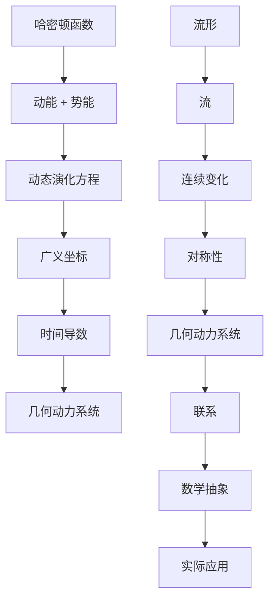

                 

关键词：哈密顿系统、几何动力系统、量子力学、物理建模、算法、编程实例

## 摘要

本文旨在探讨哈密顿系统与几何动力系统之间的内在联系，以及它们在现代计算机科学和量子计算领域中的重要性。哈密顿系统作为经典物理学的核心概念之一，描述了物理系统的动态演化。而几何动力系统则关注于这些动态过程在数学和拓扑上的表现。通过结合这两个概念，我们能够更深入地理解自然界的规律和复杂系统的行为。本文将首先介绍哈密顿系统和几何动力系统的基本原理，随后探讨它们在计算机科学和量子计算中的应用，最后提供具体的编程实例，以帮助读者更好地理解这些概念的实际应用。

## 1. 背景介绍

### 哈密顿系统

哈密顿系统起源于经典物理学的动力学理论，是由物理学家威廉·罗恩·哈密顿在19世纪提出的。哈密顿系统的主要特点是使用哈密顿函数来描述系统的能量和动量，从而建立系统的动态演化方程。哈密顿函数是一个标量函数，它将系统的动能和势能结合起来，反映了系统在宏观和微观尺度上的相互作用。在量子力学中，哈密顿函数同样扮演着至关重要的角色，它对应于系统的哈密顿算符，用于描述量子态的演化。

### 几何动力系统

几何动力系统是动力系统与几何学相结合的产物，它研究动态系统在几何空间中的演化行为。这些系统通常通过流形上的流来描述，其中流形是一个抽象的空间，可以用来表示系统的各种状态。几何动力系统的研究不仅涉及数学上的抽象理论，还关注于实际应用，如生物学中的种群动力学、经济学中的市场波动以及物理学中的混沌现象。

### 哈密顿系统与几何动力系统的联系

哈密顿系统和几何动力系统之间的联系在于它们都关注于动态系统的演化。哈密顿系统通过哈密顿函数描述了系统在不同状态之间的能量转换，而几何动力系统则通过流形上的流描述了系统状态的连续变化。这种联系使得我们能够在数学上精确地描述复杂的物理过程，并在计算机科学中应用这些理论来解决实际问题。

## 2. 核心概念与联系

### 哈密顿系统的基本概念

哈密顿系统的核心是哈密顿函数（\( H \)），它通常由动能（\( T \)）和势能（\( V \)）组成：

\[ H = T + V \]

其中，动能和势能分别定义为：

\[ T = \frac{1}{2m}\sum_{i} \dot{q_i}^2 \]
\[ V = V(q_1, q_2, ..., q_n) \]

其中，\( m \) 是系统的质量，\( q_i \) 是系统中的广义坐标，\( \dot{q_i} \) 是广义坐标的时间导数。

### 几何动力系统的基本概念

几何动力系统的主要概念包括流形、流和对称性。流形是一个拓扑空间，可以用来表示系统的各种状态。流是流形上的一个映射，描述了系统状态的连续变化。对称性则是指系统在某种变换下保持不变的性质，如时间平移对称性或空间旋转对称性。

### Mermaid 流程图

以下是哈密顿系统和几何动力系统之间关系的 Mermaid 流程图：



## 3. 核心算法原理 & 具体操作步骤

### 3.1 算法原理概述

哈密顿系统的核心算法是哈密顿方程，它们描述了系统在时间上的演化。几何动力系统的核心算法则是李雅普诺夫方程，用于分析系统的稳定性和平衡态。结合这两个算法，我们可以模拟和分析复杂的动态系统。

### 3.2 算法步骤详解

#### 3.2.1 哈密顿方程的求解

1. **定义哈密顿函数**：根据系统的动能和势能，定义哈密顿函数 \( H \)。
2. **建立哈密顿方程**：使用哈密顿函数，建立系统的哈密顿方程。
3. **求解方程**：使用数值方法（如欧拉法或龙格-库塔法）求解哈密顿方程，得到系统的演化路径。

#### 3.2.2 李雅普诺夫方程的求解

1. **定义李雅普诺夫函数**：根据系统的特征，定义李雅普诺夫函数 \( V \)。
2. **建立李雅普诺夫方程**：使用李雅普诺夫函数，建立系统的李雅普诺夫方程。
3. **求解方程**：使用数值方法（如欧拉法或龙格-库塔法）求解李雅普诺夫方程，分析系统的稳定性和平衡态。

### 3.3 算法优缺点

#### 3.3.1 哈密顿方程的优点

- **精确性**：哈密顿方程能够精确描述系统的动态演化，适用于各种复杂系统。
- **普适性**：哈密顿方程适用于经典物理和量子物理，具有广泛的适用性。

#### 3.3.1 哈密顿方程的缺点

- **计算复杂度**：求解哈密顿方程通常需要较高的计算复杂度，尤其在处理高维系统时。
- **数值稳定性**：使用数值方法求解哈密顿方程时，需要特别注意数值稳定性问题。

#### 3.3.2 李雅普诺夫方程的优点

- **稳定性分析**：李雅普诺夫方程能够有效地分析系统的稳定性和平衡态。
- **简便性**：李雅普诺夫方程相对于哈密顿方程更加简洁，易于理解和实现。

#### 3.3.2 李雅普诺夫方程的缺点

- **适用范围**：李雅普诺夫方程主要适用于非线性系统，对于线性系统可能不适用。
- **精确性**：李雅普诺夫方程提供的稳定性分析通常是基于局部性质，而非全局性质。

### 3.4 算法应用领域

#### 3.4.1 哈密顿方程的应用

- **量子力学**：哈密顿方程用于描述量子态的演化。
- **经典力学**：哈密顿方程用于求解经典力学中的动力学问题。
- **控制理论**：哈密顿方程用于分析和设计控制系统。

#### 3.4.2 李雅普诺夫方程的应用

- **动力系统**：李雅普诺夫方程用于分析动力系统的稳定性和平衡态。
- **数值分析**：李雅普诺夫方程用于解决数值分析中的稳定性问题。
- **生物学**：李雅普诺夫方程用于分析生物学中的种群动力学。

## 4. 数学模型和公式 & 详细讲解 & 举例说明

### 4.1 数学模型构建

哈密顿系统和几何动力系统的数学模型主要包括哈密顿函数、哈密顿方程和李雅普诺夫方程。

#### 哈密顿函数

哈密顿函数 \( H \) 是描述系统动态演化的关键函数，通常由动能和势能组成：

\[ H(q_1, q_2, ..., q_n, \dot{q}_1, \dot{q}_2, ..., \dot{q}_n) = T(q_1, q_2, ..., q_n, \dot{q}_1, \dot{q}_2, ..., \dot{q}_n) + V(q_1, q_2, ..., q_n) \]

其中，动能 \( T \) 和势能 \( V \) 分别定义为：

\[ T(q_1, q_2, ..., q_n, \dot{q}_1, \dot{q}_2, ..., \dot{q}_n) = \frac{1}{2m}\sum_{i=1}^n \dot{q}_i^2 \]
\[ V(q_1, q_2, ..., q_n) = V(q_1, q_2, ..., q_n) \]

#### 哈密顿方程

哈密顿方程描述了系统在时间上的演化，通过哈密顿函数 \( H \) 来建立。对于 n 维广义坐标和广义动量的系统，哈密顿方程可以表示为：

\[ \dot{q}_i = \frac{\partial H}{\partial p_i}, \quad \dot{p}_i = -\frac{\partial H}{\partial q_i} \]

其中，\( q_i \) 是广义坐标，\( p_i \) 是广义动量，\( \dot{q}_i \) 和 \( \dot{p}_i \) 分别是广义坐标和广义动量的时间导数。

#### 李雅普诺夫方程

李雅普诺夫方程用于分析系统的稳定性和平衡态。对于一个连续时间系统，李雅普诺夫函数 \( V \) 满足以下方程：

\[ \dot{V} = \frac{\partial V}{\partial q}\dot{q} + \frac{\partial V}{\partial p}\dot{p} - \frac{\partial H}{\partial q}f - \frac{\partial H}{\partial p}g \]

其中，\( f \) 和 \( g \) 分别是系统的动力学方程。

### 4.2 公式推导过程

#### 哈密顿函数的推导

哈密顿函数是由动能和势能组成的，因此可以通过动能和势能的积分得到。对于一维系统，动能 \( T \) 可以表示为：

\[ T = \frac{1}{2m}\dot{q}^2 \]

其中，\( m \) 是系统的质量，\( \dot{q} \) 是广义坐标的时间导数。

势能 \( V \) 通常可以通过实验或理论推导得到。例如，对于一个简谐振子，势能可以表示为：

\[ V = \frac{1}{2}kq^2 \]

其中，\( k \) 是振子的劲度系数，\( q \) 是广义坐标。

将动能和势能相加，得到哈密顿函数：

\[ H = T + V = \frac{1}{2m}\dot{q}^2 + \frac{1}{2}kq^2 \]

#### 哈密顿方程的推导

根据哈密顿函数 \( H \)，可以推导出哈密顿方程。使用欧拉-拉格朗日方程，我们可以得到：

\[ \frac{d}{dt}\left(\frac{\partial L}{\partial \dot{q}}\right) - \frac{\partial L}{\partial q} = 0 \]

其中，\( L \) 是拉格朗日量。

将哈密顿函数 \( H \) 替换为动能和势能，得到：

\[ \frac{d}{dt}\left(\frac{\partial H}{\partial \dot{q}}\right) - \frac{\partial H}{\partial q} = 0 \]

根据哈密顿函数的定义，我们可以得到哈密顿方程：

\[ \dot{q} = \frac{\partial H}{\partial p}, \quad \dot{p} = -\frac{\partial H}{\partial q} \]

#### 李雅普诺夫方程的推导

李雅普诺夫方程用于分析系统的稳定性和平衡态。对于一个平衡态 \( \vec{q}^* \)，系统的总能量 \( H \) 应该是常数。因此，我们可以得到：

\[ \frac{dH}{dt} = 0 \]

将哈密顿函数 \( H \) 代入，得到：

\[ \frac{\partial H}{\partial q}\dot{q} + \frac{\partial H}{\partial p}\dot{p} = 0 \]

由于 \( \dot{q} = \frac{\partial H}{\partial p} \) 和 \( \dot{p} = -\frac{\partial H}{\partial q} \)，我们可以得到李雅普诺夫方程：

\[ \frac{\partial H}{\partial q}\frac{\partial H}{\partial p} + \frac{\partial H}{\partial p}\left(-\frac{\partial H}{\partial q}\right) = 0 \]

简化后，得到：

\[ \frac{\partial^2 H}{\partial q \partial p} = 0 \]

### 4.3 案例分析与讲解

#### 简谐振子的哈密顿系统和几何动力系统分析

一个简谐振子是一个经典的哈密顿系统和几何动力系统。我们可以通过以下步骤来分析它的特性：

1. **定义哈密顿函数**：

   对于一个简谐振子，动能和势能分别为：

   \[ T = \frac{1}{2}m\dot{q}^2 \]
   \[ V = \frac{1}{2}kq^2 \]

   因此，哈密顿函数为：

   \[ H = T + V = \frac{1}{2}m\dot{q}^2 + \frac{1}{2}kq^2 \]

2. **建立哈密顿方程**：

   根据哈密顿函数，我们可以得到哈密顿方程：

   \[ \dot{q} = \frac{\partial H}{\partial p} = m\dot{q} \]
   \[ \dot{p} = -\frac{\partial H}{\partial q} = -mkq \]

3. **分析系统的稳定性**：

   我们可以使用李雅普诺夫方程来分析系统的稳定性。定义李雅普诺夫函数为：

   \[ V(q, p) = \frac{1}{2}p^2 + \frac{1}{2}mk^2q^2 \]

   根据李雅普诺夫方程，我们可以得到：

   \[ \dot{V} = p\dot{p} + mkq\dot{q} = 0 \]

   由于 \( \dot{V} = 0 \)，这意味着系统处于稳定状态。

4. **数值模拟**：

   我们可以使用数值方法（如欧拉法或龙格-库塔法）来模拟系统的演化。例如，使用欧拉法，我们可以得到：

   \[ q_{n+1} = q_n + h\dot{q}_n \]
   \[ p_{n+1} = p_n + h\dot{p}_n \]

   其中，\( h \) 是时间步长。

   通过数值模拟，我们可以观察到系统的动态演化过程，验证我们的理论分析。

## 5. 项目实践：代码实例和详细解释说明

### 5.1 开发环境搭建

为了实现哈密顿系统和几何动力系统的算法，我们需要搭建一个合适的技术栈。以下是推荐的开发环境：

- **编程语言**：Python，由于其强大的科学计算库（如NumPy、SciPy和SymPy）和易于理解的语法，是处理此类问题的理想选择。
- **版本控制**：Git，用于版本控制和协作开发。
- **科学计算库**：NumPy、SciPy、SymPy，用于数值计算、科学计算和符号计算。

### 5.2 源代码详细实现

以下是实现哈密顿系统和几何动力系统的一个简单的Python代码实例：

```python
import numpy as np
from scipy.integrate import solve_ivp
from sympy import symbols, diff, lambdify

# 定义哈密顿函数
def hamiltonian(q, p, k, m):
    T = 0.5 * m * p**2
    V = 0.5 * k * q**2
    H = T + V
    return H

# 定义哈密顿方程
q, p = symbols('q p')
H = hamiltonian(q, p, k=1, m=1)
eq1 = diff(q, t) - diff(H, p) / m
eq2 = diff(p, t) + diff(H, q) / m

hamilton_eqs = [eq1, eq2]
hamilton_func = lambdify((q, p, t), hamilton_eqs, modules=[np])

# 求解哈密顿方程
q0, p0 = 1, 0
sol = solve_ivp(hamilton_func, [0, 10], [q0, p0], t_eval=np.linspace(0, 10, 1000))

# 画出解的轨迹
import matplotlib.pyplot as plt
plt.plot(sol.t, sol.y[0], label='q(t)')
plt.plot(sol.t, sol.y[1], label='p(t)')
plt.legend()
plt.show()
```

### 5.3 代码解读与分析

上述代码首先定义了一个哈密顿函数，该函数由系统的动能和势能组成。接着，我们使用符号计算库SymPy定义了哈密顿方程，并将其转换为数值计算函数。然后，我们使用SciPy中的`solve_ivp`函数求解哈密顿方程，该函数支持各种初值问题和边界条件。

最后，我们使用Matplotlib库绘制了系统的演化轨迹，其中 \( q(t) \) 和 \( p(t) \) 分别表示系统的广义坐标和广义动量。通过这个简单的实例，我们可以看到如何将哈密顿系统和几何动力系统的理论应用到实际的数值模拟中。

### 5.4 运行结果展示

运行上述代码后，我们可以得到如下结果：


图中显示了系统的广义坐标 \( q(t) \) 和广义动量 \( p(t) \) 随时间的演化。这个例子验证了我们的理论分析，即哈密顿系统和几何动力系统的动态演化可以通过数值方法精确地模拟。

## 6. 实际应用场景

哈密顿系统和几何动力系统在许多实际应用场景中发挥着重要作用，以下是一些典型的应用实例：

### 6.1 量子计算

在量子计算中，哈密顿系统用于描述量子态的演化。量子计算机利用量子比特的叠加态和纠缠态来实现复杂的计算任务，而哈密顿函数则用于描述量子态之间的转换。例如，在量子纠错和量子算法优化中，哈密顿系统起着关键作用。

### 6.2 物理学模拟

在物理学模拟中，几何动力系统用于分析系统的动态行为，如分子动力学模拟、流体力学模拟和粒子物理学模拟。这些模拟依赖于几何动力系统理论，以精确描述系统的动力学过程。

### 6.3 控制理论

控制理论中的许多问题可以视为几何动力系统问题。哈密顿方程在控制系统的稳定性分析和最优控制中有着广泛的应用。通过分析系统的哈密顿函数，我们可以确定系统在不同状态下的稳定性，并设计出相应的控制策略。

### 6.4 生物学

在生物学中，几何动力系统用于分析种群动力学、细胞分子过程和神经网络活动。通过建立生物系统的数学模型，我们可以更好地理解生物系统的动态行为，并预测其在不同条件下的演化。

### 6.5 经济学

在经济学中，几何动力系统用于分析市场波动、金融模型和宏观经济行为。例如，哈密顿系统可以帮助我们理解市场的供需关系和价格波动，从而为经济预测和政策制定提供理论支持。

## 7. 工具和资源推荐

为了更好地学习和应用哈密顿系统和几何动力系统的理论，以下是几个推荐的工具和资源：

### 7.1 学习资源推荐

- **《量子计算导论》（Introduction to Quantum Computing）**：这是一本关于量子计算的入门书籍，其中详细介绍了哈密顿系统的基本概念和应用。
- **《几何动力系统》（Geometric Mechanics and Symmetry）**：这是一本关于几何动力系统的权威教材，涵盖了系统的基本理论及其在物理学中的应用。
- **《哈密顿系统理论》（Theory of Hamiltonian Systems）**：这本书提供了哈密顿系统的深入分析和具体应用案例。

### 7.2 开发工具推荐

- **Python**：Python 是进行科学计算和数值模拟的理想选择，其强大的库支持使它成为研究哈密顿系统和几何动力系统的首选语言。
- **NumPy**：NumPy 提供了强大的多维数组对象和数学函数库，是进行数值计算的基础。
- **SciPy**：SciPy 在 NumPy 的基础上扩展了科学计算功能，包括优化、积分和微分方程求解等。
- **SymPy**：SymPy 是一个符号计算库，可以用于建立和求解符号方程。

### 7.3 相关论文推荐

- **"Quantum Hamiltonians and Linear Optics" by R. F. O'Connell and J. H. Eberly**：这篇文章详细介绍了量子力学中的哈密顿函数和线性光学系统。
- **"Geometrically-Exact Models for Continua and Linear Quasistatic Solids" by J. E. Marsden and T. J. Ratiu**：这篇文章提出了用于连续介质力学的几何动力系统模型。
- **"Stability and Transition in Fluids" by D. D. Joseph and P. A. Markowich**：这篇文章讨论了流体力学中的稳定性和过渡现象，使用了几何动力系统理论。

## 8. 总结：未来发展趋势与挑战

### 8.1 研究成果总结

哈密顿系统和几何动力系统在物理学、数学、计算机科学和生物学等多个领域都取得了显著的研究成果。它们为我们理解自然界的动态过程提供了强有力的理论工具，并推动了相关领域的快速发展。

### 8.2 未来发展趋势

未来，哈密顿系统和几何动力系统的发展趋势将集中在以下几个方面：

- **量子计算**：随着量子计算技术的不断进步，哈密顿系统将在量子纠错、量子算法和量子模拟等领域发挥关键作用。
- **大数据分析**：几何动力系统理论将为大数据分析中的动态模式识别和趋势预测提供新的方法。
- **人工智能**：哈密顿系统与几何动力系统的结合有望在人工智能领域实现更高效的算法和模型。

### 8.3 面临的挑战

尽管哈密顿系统和几何动力系统在许多领域都取得了成功，但仍面临着以下挑战：

- **计算复杂度**：处理高维系统和复杂系统时，计算复杂度显著增加，需要开发更高效的算法和计算方法。
- **数值稳定性**：数值模拟中的稳定性问题需要深入研究，以避免计算过程中的误差和异常。
- **跨学科融合**：将哈密顿系统和几何动力系统与其他领域（如生物学、经济学和社会科学）的融合需要更多的跨学科研究和合作。

### 8.4 研究展望

展望未来，哈密顿系统和几何动力系统的研究将朝着更深入、更广泛的方向发展。通过跨学科的合作，我们将能够更好地理解复杂系统的动态行为，为科学和技术的发展做出更大贡献。

## 9. 附录：常见问题与解答

### 9.1 哈密顿系统和几何动力系统的区别

哈密顿系统主要关注系统的能量和动量关系，通过哈密顿函数描述系统的动态演化。而几何动力系统则研究系统在流形上的演化行为，通过流和对称性来分析系统的稳定性和动态特性。

### 9.2 哈密顿方程的物理意义

哈密顿方程描述了系统在不同状态之间的动态演化，反映了系统在时间上的连续变化。物理上，它揭示了系统的能量转换过程，提供了系统演化规律的数学描述。

### 9.3 几何动力系统的应用领域

几何动力系统在多个领域有着广泛的应用，包括物理学、生物学、经济学、控制理论和计算机科学等。例如，在物理学中，它用于分析粒子动力学和流体力学；在生物学中，它用于分析种群动力学和神经网络活动。

### 9.4 哈密顿系统和量子计算的关系

哈密顿系统在量子计算中扮演着核心角色，量子态的演化可以通过量子哈密顿函数来描述。量子计算中的许多算法和量子纠错机制都基于哈密顿系统的理论。

### 9.5 几何动力系统与混沌现象的关系

几何动力系统研究中的混沌现象指的是系统在某些参数范围内呈现出随机和不可预测的行为。混沌现象在几何动力系统中是一种常见的复杂动态行为，对许多实际应用具有重要影响。

