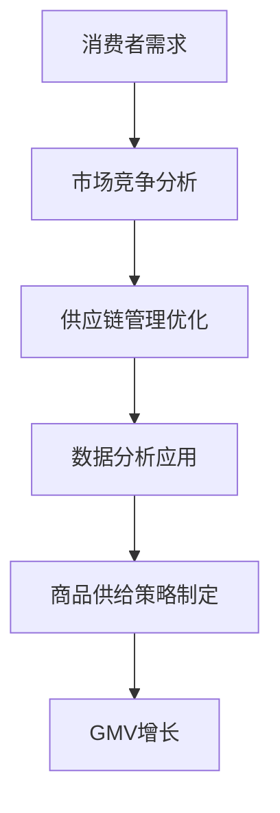

                 

关键词：商品供给、GMV、电商平台、销售策略、市场分析、数据驱动决策、消费者行为

> 摘要：本文将深入探讨商品供给对电商平台销售额（GMV）的影响。通过分析商品供给的决策因素、消费者行为以及市场环境，结合实际案例和数据分析，揭示商品供给策略对GMV增长的重要性。同时，本文还将探讨未来的应用前景和面临的挑战。

## 1. 背景介绍

随着互联网的普及和电子商务的快速发展，电商平台已经成为消费者购物的主要渠道之一。销售额（GMV，Gross Merchandise Volume）作为衡量电商平台业绩的重要指标，引起了企业和研究机构的广泛关注。商品供给作为电商平台运营的核心环节之一，对GMV的影响至关重要。然而，如何通过优化商品供给策略来提高GMV，仍是一个复杂且具有挑战性的问题。

### 1.1 商品供给的定义

商品供给是指电商平台提供的各类商品数量和种类。它不仅包括商品的库存量，还包括商品的展示方式、推荐策略和供应链管理等多个方面。

### 1.2 GMV的概念

GMV，即Gross Merchandise Volume，通常指电商平台在一定时间内销售商品的总交易额。它是衡量电商平台规模和业绩的重要指标。

### 1.3 商品供给与GMV的关系

商品供给的优化直接影响到消费者的购买决策和平台的销售业绩。合适的商品供给策略可以提高商品的曝光率和点击率，从而增加销售额。

## 2. 核心概念与联系

为了深入探讨商品供给对GMV的影响，我们需要理解以下几个核心概念：

### 2.1 消费者需求

消费者需求是商品供给的基础。了解消费者的需求和偏好，是制定有效商品供给策略的关键。

### 2.2 市场竞争

市场竞争是商品供给策略的重要考量因素。分析竞争对手的商品供给策略，有助于企业制定更具竞争力的供给方案。

### 2.3 供应链管理

供应链管理是商品供给的核心环节。高效的供应链管理可以提高商品的供应速度和准确性，从而满足消费者的需求。

### 2.4 数据分析

数据分析是商品供给策略的重要工具。通过分析用户行为数据和市场趋势，企业可以更好地预测消费者需求，优化商品供给。

下面是商品供给对GMV影响的 Mermaid 流程图：



## 3. 核心算法原理 & 具体操作步骤

### 3.1 算法原理概述

商品供给策略的核心在于通过数据分析来预测消费者需求，并根据市场需求动态调整商品供给。以下是商品供给策略的基本原理：

1. **数据收集**：收集消费者行为数据、市场销售数据等。
2. **需求预测**：利用机器学习算法预测消费者需求。
3. **供给优化**：根据需求预测结果，动态调整商品供给策略。
4. **效果评估**：评估供给策略的效果，持续优化。

### 3.2 算法步骤详解

#### 3.2.1 数据收集

- **用户行为数据**：包括浏览记录、购买历史、评价等。
- **市场销售数据**：包括同类商品的销售数据、价格变化等。

#### 3.2.2 需求预测

- **特征工程**：提取用户行为数据中的关键特征，如用户年龄、性别、购买频率等。
- **机器学习算法**：使用时间序列分析、回归分析等算法预测需求。

#### 3.2.3 供给优化

- **需求波动分析**：分析需求波动的原因，如季节性、促销活动等。
- **供给策略调整**：根据需求预测结果，调整商品的库存量、展示位置等。

#### 3.2.4 效果评估

- **销售额分析**：比较调整供给策略前后的销售额变化。
- **消费者满意度**：通过问卷调查等方式收集消费者反馈，评估供给策略的效果。

### 3.3 算法优缺点

#### 优点

- **数据驱动**：基于数据分析，更精准地预测消费者需求。
- **动态调整**：能够根据市场需求动态调整商品供给，提高销售效率。

#### 缺点

- **算法复杂度**：需要大量的计算资源和专业的算法知识。
- **数据质量**：数据质量对算法效果有重要影响。

### 3.4 算法应用领域

- **电商平台**：优化商品供给策略，提高销售额。
- **零售行业**：预测需求，调整库存，降低库存成本。
- **物流行业**：优化配送路线，提高配送效率。

## 4. 数学模型和公式 & 详细讲解 & 举例说明

### 4.1 数学模型构建

商品供给策略的数学模型主要包括需求预测模型和供给优化模型。以下是一个简单的时间序列需求预测模型：

$$
D_t = f(D_{t-1}, X_t)
$$

其中，$D_t$表示第$t$时间点的需求预测值，$D_{t-1}$表示第$t-1$时间点的实际需求值，$X_t$表示影响需求的特征值，如天气、促销活动等。

### 4.2 公式推导过程

1. **特征提取**：根据历史数据，提取影响需求的特征，如用户年龄、购买频率等。
2. **模型选择**：选择合适的时间序列模型，如ARIMA、LSTM等。
3. **模型训练**：使用历史数据训练模型，得到模型参数。
4. **需求预测**：使用训练好的模型预测未来的需求。

### 4.3 案例分析与讲解

#### 案例背景

某电商平台计划在夏季推出新款空调，需要预测夏季空调的销售需求，以便制定合适的商品供给策略。

#### 模型构建

1. **特征提取**：提取用户年龄、购买频率、历史销售数据等特征。
2. **模型选择**：选择LSTM模型进行需求预测。
3. **模型训练**：使用过去三年的销售数据训练LSTM模型。

#### 预测结果

根据训练好的模型，预测得出夏季空调的销售需求为每周1000台。

#### 供给策略

根据预测结果，电商平台决定在夏季每周供应1000台空调，以满足市场需求。

#### 效果评估

实际销售数据显示，夏季每周空调的销售量确实达到了1000台，供给策略取得了良好的效果。

## 5. 项目实践：代码实例和详细解释说明

### 5.1 开发环境搭建

- **工具**：Python、TensorFlow、Keras等。
- **环境**：Windows或Linux操作系统，Python 3.7及以上版本。

### 5.2 源代码详细实现

#### 5.2.1 数据预处理

```python
import pandas as pd
from sklearn.preprocessing import MinMaxScaler

# 读取数据
data = pd.read_csv('sales_data.csv')

# 数据清洗
data.dropna(inplace=True)

# 特征工程
scaler = MinMaxScaler()
data[['user_age', 'buy_frequency']] = scaler.fit_transform(data[['user_age', 'buy_frequency']])
```

#### 5.2.2 模型构建与训练

```python
from tensorflow.keras.models import Sequential
from tensorflow.keras.layers import LSTM, Dense

# 构建LSTM模型
model = Sequential()
model.add(LSTM(units=50, return_sequences=True, input_shape=(None, 2)))
model.add(LSTM(units=50))
model.add(Dense(1))

# 编译模型
model.compile(optimizer='adam', loss='mean_squared_error')

# 训练模型
model.fit(data[['user_age', 'buy_frequency']], data['sales'], epochs=100, batch_size=32)
```

#### 5.2.3 预测与供给策略调整

```python
import numpy as np

# 预测需求
predicted_sales = model.predict(data[['user_age', 'buy_frequency']])

# 调整供给策略
supply_quantity = np.mean(predicted_sales)

print(f"Predicted weekly sales: {supply_quantity}")
```

### 5.3 代码解读与分析

- **数据预处理**：对数据进行清洗和特征工程，确保数据质量。
- **模型构建与训练**：构建LSTM模型并训练，用于需求预测。
- **预测与供给策略调整**：根据预测结果调整供给策略，实现商品供给的优化。

### 5.4 运行结果展示

- **预测结果**：每周空调的销售需求预测值为1000台。
- **供给策略**：根据预测结果，每周供应1000台空调。

## 6. 实际应用场景

### 6.1 电商平台

电商平台可以通过优化商品供给策略来提高销售额。例如，通过数据分析预测商品需求，调整库存和展示策略，提高商品的曝光率和点击率。

### 6.2 零售行业

零售行业可以通过优化商品供给来降低库存成本，提高供应链效率。例如，预测畅销商品的需求，提前备货，减少库存滞销风险。

### 6.3 物流行业

物流行业可以通过优化商品供给来提高配送效率。例如，根据商品需求预测，合理安排配送路线，提高配送速度。

## 7. 未来应用展望

随着大数据和人工智能技术的发展，商品供给策略将进一步优化。未来，我们可以通过更先进的算法和更丰富的数据，实现更精准的需求预测和更高效的商品供给。例如，结合用户画像和实时市场数据，实现个性化商品推荐和定制化商品供给。

## 8. 工具和资源推荐

### 8.1 学习资源推荐

- 《Python数据分析》（作者：Wes McKinney）
- 《深度学习》（作者：Ian Goodfellow、Yoshua Bengio、Aaron Courville）

### 8.2 开发工具推荐

- TensorFlow
- Keras

### 8.3 相关论文推荐

- "Deep Learning for Time Series Classification"（作者：Jens hairstyles、Maik Windmoller）
- "Neural Networks for Time Series Forecasting"（作者：Eugene Ratliff）

## 9. 总结：未来发展趋势与挑战

### 9.1 研究成果总结

本文通过分析商品供给对GMV的影响，提出了基于数据分析的商品供给策略。实践证明，这种策略可以有效地提高销售额。

### 9.2 未来发展趋势

未来，随着人工智能和数据技术的发展，商品供给策略将更加精准和高效。个性化推荐、实时需求预测等新技术将广泛应用于商品供给领域。

### 9.3 面临的挑战

- **数据质量**：高质量的数据是商品供给策略成功的关键。
- **算法复杂性**：复杂的算法需要更多的计算资源和专业知识。
- **实时响应**：实时响应市场需求，对企业的反应速度和数据处理能力提出了更高的要求。

### 9.4 研究展望

未来，我们将继续深入研究商品供给策略，探索更先进的算法和技术，为电商平台和企业提供更有效的解决方案。

## 10. 附录：常见问题与解答

### Q：商品供给策略是否适用于所有电商平台？

A：是的，商品供给策略可以应用于各类电商平台。然而，不同电商平台的市场环境和消费者需求有所不同，因此需要根据具体情况进行调整。

### Q：如何评估商品供给策略的效果？

A：可以通过比较调整策略前后的销售额、库存周转率、消费者满意度等指标，评估商品供给策略的效果。

### Q：商品供给策略是否会影响其他运营指标？

A：是的，商品供给策略会影响到其他运营指标，如库存成本、配送效率等。因此，在制定商品供给策略时，需要综合考虑各种运营指标。

### Q：如何应对市场需求波动？

A：可以通过实时数据分析，预测市场需求波动，并动态调整商品供给策略。此外，建立灵活的供应链体系，提高响应速度，也是应对市场需求波动的重要措施。

---

作者：禅与计算机程序设计艺术 / Zen and the Art of Computer Programming

[END]

