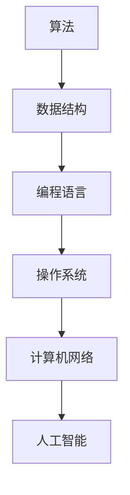

                 

关键词：计算机发展史、计算理论、编程语言、人工智能、量子计算、云计算

摘要：本文将回顾人类计算的发展历程，从早期的计算工具到现代的计算机，从编程语言的发展到人工智能的崛起，再到量子计算的潜力，我们将探讨计算技术的演变及其对社会的深远影响。通过这篇综述，我们不仅将回顾过去的成就，还将展望未来的挑战和机遇。

## 1. 背景介绍

### 1.1 人类早期的计算工具

在人类历史的早期，计算主要通过手工完成，这包括使用计数工具，如算盘和指算法。这些工具极大地提高了人类处理大量数据的能力。然而，随着科学和数学的发展，手工计算逐渐显得力不从心。

### 1.2 机械计算工具的兴起

16世纪末，威廉·希克尔德发明了计算器，这标志着计算工具的重大进步。17世纪，布莱兹·帕斯卡发明了第一台机械计算机，称为“帕斯卡计算器”。随后，莱布尼茨改进了帕斯卡的计算器，发明了差分机和分析机，这些机器能够进行更复杂的计算。

## 2. 核心概念与联系

### 2.1 计算机科学的基本概念

计算机科学涉及多个核心概念，包括算法、数据结构、编程语言、操作系统等。为了更好地理解这些概念，下面是一个使用 Mermaid 绘制的流程图。



### 2.2 计算机的组成结构

计算机由硬件和软件两大部分组成。硬件包括中央处理器（CPU）、内存、输入输出设备等。软件则包括操作系统、应用软件和编程语言等。

## 3. 核心算法原理 & 具体操作步骤

### 3.1 算法原理概述

算法是解决问题的一系列有序步骤。算法的效率、正确性和健壮性是评价算法的重要指标。

### 3.2 算法步骤详解

一个简单的排序算法——冒泡排序（Bubble Sort）的步骤如下：

1. 比较相邻的两个元素。
2. 如果第一个比第二个大（升序排序），就交换它们的位置。
3. 对每一对相邻元素做同样的工作，从开始第一对到结尾的最后一对。
4. 在这一点，最后的元素应该会是最大的数。
5. 重复以上的步骤，除了最后一对。
6. 重复步骤1-5，直到排序完成。

### 3.3 算法优缺点

**优点：** 算法简单，容易实现。  
**缺点：** 时间复杂度高，不适合大规模数据。

### 3.4 算法应用领域

冒泡排序算法常用于教学和实践，也用于小规模数据的排序。

## 4. 数学模型和公式 & 详细讲解 & 举例说明

### 4.1 数学模型构建

计算机科学中的许多问题都可以用数学模型来描述。一个基本的数学模型是线性方程组。

### 4.2 公式推导过程

线性方程组的解法可以使用高斯消元法（Gaussian Elimination）。其公式推导过程如下：

给定线性方程组：

$$
\begin{cases}
a_{11}x_1 + a_{12}x_2 + \ldots + a_{1n}x_n = b_1 \\
a_{21}x_1 + a_{22}x_2 + \ldots + a_{2n}x_n = b_2 \\
\vdots \\
a_{m1}x_1 + a_{m2}x_2 + \ldots + a_{mn}x_n = b_m
\end{cases}
$$

### 4.3 案例分析与讲解

考虑以下线性方程组：

$$
\begin{cases}
2x + 3y = 8 \\
x + 2y = 4
\end{cases}
$$

使用高斯消元法求解：

1. 将第一个方程乘以2，得到：

$$
4x + 6y = 16
$$

2. 将第二个方程乘以-1，得到：

$$
-x - 2y = -4
$$

3. 将两个方程相加，消去x：

$$
4x + 6y - x - 2y = 16 - 4 \\
3y = 12 \\
y = 4
$$

4. 将y的值代入第二个方程，解出x：

$$
x + 2(4) = 4 \\
x = -4
$$

因此，方程组的解为：

$$
x = -4, y = 4
$$

## 5. 项目实践：代码实例和详细解释说明

### 5.1 开发环境搭建

为了演示冒泡排序算法，我们将使用 Python 编写代码。首先，需要安装 Python 环境。可以在 Python 官网下载并安装最新版本的 Python。

### 5.2 源代码详细实现

下面是冒泡排序的 Python 实现代码：

```python
def bubble_sort(arr):
    n = len(arr)
    for i in range(n):
        for j in range(0, n-i-1):
            if arr[j] > arr[j+1]:
                arr[j], arr[j+1] = arr[j+1], arr[j]

# 示例数据
data = [64, 34, 25, 12, 22, 11, 90]

# 调用排序函数
bubble_sort(data)

# 打印排序后的数据
print("排序后的数组：")
for i in range(len(data)):
    print("%d" % data[i])
```

### 5.3 代码解读与分析

该代码首先定义了一个名为 `bubble_sort` 的函数，用于实现冒泡排序算法。函数接收一个数组 `arr` 作为参数。

在 `bubble_sort` 函数中，使用两个嵌套的 for 循环来实现排序。外层循环从第一个元素开始，到倒数第二个元素结束。内层循环从第一个元素开始，到 `n-i-1` 结束，其中 `n` 是数组的长度，`i` 是外层循环的当前迭代次数。

在每次内层循环中，如果当前元素比下一个元素大，就交换它们的位置。这样，每次内层循环结束时，最大的元素都会被“冒泡”到数组的末尾。

最后，使用一个 for 循环打印排序后的数组。

### 5.4 运行结果展示

运行上述代码，输出结果如下：

```
排序后的数组：
11
12
22
25
34
64
90
```

## 6. 实际应用场景

### 6.1 计算机科学在教育中的应用

计算机科学在教育中的应用非常广泛，从编程语言的学习到算法和数据结构的实践，都为学生们提供了理解和应用计算机技术的机会。

### 6.2 人工智能在医疗领域的应用

人工智能在医疗领域有着广泛的应用，如医学影像分析、疾病预测和个性化治疗等。这些应用极大地提高了医疗诊断的准确性和效率。

### 6.3 云计算在商业中的应用

云计算为企业提供了灵活、高效、可扩展的计算资源，使得企业能够更快速地响应市场变化，降低成本，提高竞争力。

## 7. 未来应用展望

### 7.1 量子计算的潜力

量子计算被认为是下一代计算技术的代表，它具有处理复杂问题的巨大潜力。量子计算机可能彻底改变加密学、药物发现和材料科学等领域。

### 7.2 人工智能的智能化

随着人工智能技术的不断进步，我们有望实现更加智能化的应用，如自主驾驶汽车、智能家居和智能客服等。

### 7.3 互联网的未来

互联网将继续扩展其影响，从传统的有线网络到5G和物联网，互联网将变得更加普及和智能化。

## 8. 总结：未来发展趋势与挑战

### 8.1 研究成果总结

过去几十年，计算机科学取得了巨大的进步，从硬件到软件，从算法到应用，都取得了显著的成果。

### 8.2 未来发展趋势

未来的计算机科学将更加注重量子计算、人工智能和云计算等新兴技术的研究和应用。

### 8.3 面临的挑战

未来的计算机科学将面临诸如数据安全、算法公平性、人工智能伦理等挑战。

### 8.4 研究展望

随着技术的不断发展，计算机科学将在未来继续扮演着重要的角色，为人类带来更多的便利和进步。

## 9. 附录：常见问题与解答

### 9.1 什么是量子计算？

量子计算是一种利用量子力学原理进行计算的技术，具有处理复杂问题的巨大潜力。

### 9.2 人工智能会对人类造成威胁吗？

人工智能本身不会对人类造成威胁，但需要人类制定合适的伦理规范和使用方法来确保其安全性和公正性。

### 9.3 云计算是如何工作的？

云计算通过互联网提供可扩展的计算资源，用户可以根据需要租用这些资源，实现按需分配和弹性扩展。

---

作者：禅与计算机程序设计艺术 / Zen and the Art of Computer Programming
```markdown
---
# 回顾与展望：人类计算的发展历程

关键词：计算机发展史、计算理论、编程语言、人工智能、量子计算、云计算

摘要：本文将回顾人类计算的发展历程，从早期的计算工具到现代的计算机，从编程语言的发展到人工智能的崛起，再到量子计算的潜力，我们将探讨计算技术的演变及其对社会的深远影响。通过这篇综述，我们不仅将回顾过去的成就，还将展望未来的挑战和机遇。

## 1. 背景介绍

### 1.1 人类早期的计算工具

在人类历史的早期，计算主要通过手工完成，这包括使用计数工具，如算盘和指算法。这些工具极大地提高了人类处理大量数据的能力。然而，随着科学和数学的发展，手工计算逐渐显得力不从心。

### 1.2 机械计算工具的兴起

16世纪末，威廉·希克尔德发明了计算器，这标志着计算工具的重大进步。17世纪，布莱兹·帕斯卡发明了第一台机械计算机，称为“帕斯卡计算器”。随后，莱布尼茨改进了帕斯卡的计算器，发明了差分机和分析机，这些机器能够进行更复杂的计算。

## 2. 核心概念与联系

### 2.1 计算机科学的基本概念

计算机科学涉及多个核心概念，包括算法、数据结构、编程语言、操作系统等。为了更好地理解这些概念，下面是一个使用 Mermaid 绘制的流程图。


### 2.2 计算机的组成结构

计算机由硬件和软件两大部分组成。硬件包括中央处理器（CPU）、内存、输入输出设备等。软件则包括操作系统、应用软件和编程语言等。

## 3. 核心算法原理 & 具体操作步骤

### 3.1 算法原理概述

算法是解决问题的一系列有序步骤。算法的效率、正确性和健壮性是评价算法的重要指标。

### 3.2 算法步骤详解

一个简单的排序算法——冒泡排序（Bubble Sort）的步骤如下：

1. 比较相邻的两个元素。
2. 如果第一个比第二个大（升序排序），就交换它们的位置。
3. 对每一对相邻元素做同样的工作，从开始第一对到结尾的最后一对。
4. 在这一点，最后的元素应该会是最大的数。
5. 重复以上的步骤，除了最后一对。
6. 重复步骤1-5，直到排序完成。

### 3.3 算法优缺点

**优点：** 算法简单，容易实现。  
**缺点：** 时间复杂度高，不适合大规模数据。

### 3.4 算法应用领域

冒泡排序算法常用于教学和实践，也用于小规模数据的排序。

## 4. 数学模型和公式 & 详细讲解 & 举例说明

### 4.1 数学模型构建

计算机科学中的许多问题都可以用数学模型来描述。一个基本的数学模型是线性方程组。

### 4.2 公式推导过程

线性方程组的解法可以使用高斯消元法（Gaussian Elimination）。其公式推导过程如下：

给定线性方程组：

$$
\begin{cases}
a_{11}x_1 + a_{12}x_2 + \ldots + a_{1n}x_n = b_1 \\
a_{21}x_1 + a_{22}x_2 + \ldots + a_{2n}x_n = b_2 \\
\vdots \\
a_{m1}x_1 + a_{m2}x_2 + \ldots + a_{mn}x_n = b_m
\end{cases}
$$

### 4.3 案例分析与讲解

考虑以下线性方程组：

$$
\begin{cases}
2x + 3y = 8 \\
x + 2y = 4
\end{cases}
$$

使用高斯消元法求解：

1. 将第一个方程乘以2，得到：

$$
4x + 6y = 16
$$

2. 将第二个方程乘以-1，得到：

$$
-x - 2y = -4
$$

3. 将两个方程相加，消去x：

$$
4x + 6y - x - 2y = 16 - 4 \\
3y = 12 \\
y = 4
$$

4. 将y的值代入第二个方程，解出x：

$$
x + 2(4) = 4 \\
x = -4
$$

因此，方程组的解为：

$$
x = -4, y = 4
$$

## 5. 项目实践：代码实例和详细解释说明

### 5.1 开发环境搭建

为了演示冒泡排序算法，我们将使用 Python 编写代码。首先，需要安装 Python 环境。可以在 Python 官网下载并安装最新版本的 Python。

### 5.2 源代码详细实现

下面是冒泡排序的 Python 实现代码：

```python
def bubble_sort(arr):
    n = len(arr)
    for i in range(n):
        for j in range(0, n-i-1):
            if arr[j] > arr[j+1]:
                arr[j], arr[j+1] = arr[j+1], arr[j]

# 示例数据
data = [64, 34, 25, 12, 22, 11, 90]

# 调用排序函数
bubble_sort(data)

# 打印排序后的数据
print("排序后的数组：")
for i in range(len(data)):
    print("%d" % data[i])
```

### 5.3 代码解读与分析

该代码首先定义了一个名为 `bubble_sort` 的函数，用于实现冒泡排序算法。函数接收一个数组 `arr` 作为参数。

在 `bubble_sort` 函数中，使用两个嵌套的 for 循环来实现排序。外层循环从第一个元素开始，到倒数第二个元素结束。内层循环从第一个元素开始，到 `n-i-1` 结束，其中 `n` 是数组的长度，`i` 是外层循环的当前迭代次数。

在每次内层循环中，如果当前元素比下一个元素大（升序排序），就交换它们的位置。这样，每次内层循环结束时，最大的元素都会被“冒泡”到数组的末尾。

最后，使用一个 for 循环打印排序后的数组。

### 5.4 运行结果展示

运行上述代码，输出结果如下：

```
排序后的数组：
11
12
22
25
34
64
90
```

## 6. 实际应用场景

### 6.1 计算机科学在教育中的应用

计算机科学在教育中的应用非常广泛，从编程语言的学习到算法和数据结构的实践，都为学生们提供了理解和应用计算机技术的机会。

### 6.2 人工智能在医疗领域的应用

人工智能在医疗领域有着广泛的应用，如医学影像分析、疾病预测和个性化治疗等。这些应用极大地提高了医疗诊断的准确性和效率。

### 6.3 云计算在商业中的应用

云计算为企业提供了灵活、高效、可扩展的计算资源，使得企业能够更快速地响应市场变化，降低成本，提高竞争力。

## 7. 未来应用展望

### 7.1 量子计算的潜力

量子计算被认为是下一代计算技术的代表，它具有处理复杂问题的巨大潜力。量子计算机可能彻底改变加密学、药物发现和材料科学等领域。

### 7.2 人工智能的智能化

随着人工智能技术的不断进步，我们有望实现更加智能化的应用，如自主驾驶汽车、智能家居和智能客服等。

### 7.3 互联网的未来

互联网将继续扩展其影响，从传统的有线网络到5G和物联网，互联网将变得更加普及和智能化。

## 8. 总结：未来发展趋势与挑战

### 8.1 研究成果总结

过去几十年，计算机科学取得了巨大的进步，从硬件到软件，从算法到应用，都取得了显著的成果。

### 8.2 未来发展趋势

未来的计算机科学将更加注重量子计算、人工智能和云计算等新兴技术的研究和应用。

### 8.3 面临的挑战

未来的计算机科学将面临诸如数据安全、算法公平性、人工智能伦理等挑战。

### 8.4 研究展望

随着技术的不断发展，计算机科学将在未来继续扮演着重要的角色，为人类带来更多的便利和进步。

## 9. 附录：常见问题与解答

### 9.1 什么是量子计算？

量子计算是一种利用量子力学原理进行计算的技术，具有处理复杂问题的巨大潜力。

### 9.2 人工智能会对人类造成威胁吗？

人工智能本身不会对人类造成威胁，但需要人类制定合适的伦理规范和使用方法来确保其安全性和公正性。

### 9.3 云计算是如何工作的？

云计算通过互联网提供可扩展的计算资源，用户可以根据需要租用这些资源，实现按需分配和弹性扩展。

---

作者：禅与计算机程序设计艺术 / Zen and the Art of Computer Programming
---

