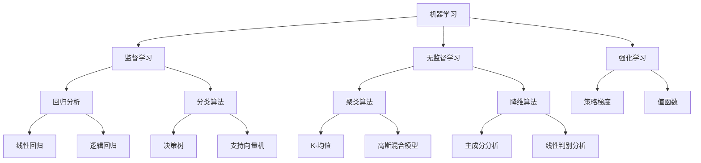

                 

关键词：图灵奖，AI算法，突破，深度学习，机器学习，神经网络，自然语言处理，计算机视觉

> 摘要：本文深入探讨了图灵奖在AI算法领域的贡献和突破，分析了近年来人工智能领域的重要进展，探讨了核心概念、算法原理、数学模型、项目实践，以及未来发展趋势与挑战。

## 1. 背景介绍

### 图灵奖的起源与重要性

图灵奖被誉为计算机界的“诺贝尔奖”，由英国计算机科学家艾伦·图灵的名字命名，自1966年起每年颁发给在计算机科学领域做出杰出贡献的个人。图灵奖的设立旨在奖励那些在计算机科学领域做出卓越贡献的人，其涵盖范围包括算法、计算理论、人工智能、数据库、计算机网络等多个领域。

### AI算法的兴起与发展

人工智能（AI）是计算机科学的一个分支，旨在创建能够模拟、延伸和扩展人类智能的系统。AI算法是实现人工智能的核心技术，其涵盖了机器学习、深度学习、计算机视觉、自然语言处理等多个子领域。

自20世纪50年代人工智能概念提出以来，AI算法经历了多个发展阶段。早期以规则为基础的专家系统标志着AI研究的开端，随后在20世纪80年代，基于知识的推理方法成为了AI研究的主流。进入21世纪，随着计算能力和数据资源的迅速增长，机器学习和深度学习算法取得了突破性进展，推动了AI的快速发展。

## 2. 核心概念与联系

### Mermaid 流程图



### 核心概念解析

- **机器学习**：机器学习是一种让计算机通过数据自动学习规律、模式、知识的方法，无需显式编程。其主要包括监督学习、无监督学习和强化学习。
- **监督学习**：监督学习算法利用标记数据训练模型，通过已知的输入输出对来预测未知数据的输出。
- **无监督学习**：无监督学习算法在无标记数据上工作，通过发现数据中的内在结构，如聚类、降维等。
- **强化学习**：强化学习通过智能体与环境交互，学习最优策略以最大化累积奖励。

## 3. 核心算法原理 & 具体操作步骤

### 3.1 算法原理概述

- **监督学习**：基于标记数据训练模型，如线性回归、决策树、支持向量机等。
- **无监督学习**：基于未标记数据，如K-均值聚类、主成分分析等。
- **深度学习**：基于神经网络，通过多层非线性变换提取特征，如卷积神经网络（CNN）、循环神经网络（RNN）等。

### 3.2 算法步骤详解

#### 监督学习算法步骤

1. 数据预处理：清洗、归一化、缺失值处理等。
2. 特征提取：通过特征工程提取有助于模型训练的特征。
3. 模型训练：使用训练数据训练模型，如梯度下降、随机梯度下降等。
4. 模型评估：使用验证集或测试集评估模型性能。
5. 模型优化：调整模型参数以改善性能。

#### 无监督学习算法步骤

1. 数据预处理：与监督学习相同。
2. 特征提取：使用降维算法提取数据结构。
3. 模型训练：无监督学习通常不需要显式训练过程，如K-均值聚类通过迭代寻找最佳聚类中心。
4. 模型评估：使用聚类系数、轮廓系数等指标评估聚类效果。
5. 模型应用：将聚类结果应用于实际问题，如客户细分、文本分类等。

#### 深度学习算法步骤

1. 数据预处理：同上。
2. 构建模型：设计网络结构，包括输入层、隐藏层和输出层。
3. 损失函数定义：如交叉熵损失、均方误差损失等。
4. 优化算法选择：如梯度下降、Adam优化器等。
5. 模型训练：通过反向传播算法更新网络权重。
6. 模型评估：使用验证集评估模型性能。
7. 模型部署：将训练好的模型应用于实际场景。

### 3.3 算法优缺点

#### 监督学习

- **优点**：预测准确度高，适用于有标记数据的问题。
- **缺点**：需要大量标记数据，对无标记数据不适用。

#### 无监督学习

- **优点**：无需标记数据，适用于探索性数据分析。
- **缺点**：聚类效果受参数选择影响较大，预测性能较监督学习差。

#### 深度学习

- **优点**：强大的特征提取能力，适用于复杂数据分析任务。
- **缺点**：模型训练复杂度高，对计算资源要求较高。

### 3.4 算法应用领域

- **监督学习**：分类、回归、异常检测等。
- **无监督学习**：聚类、降维、推荐系统等。
- **深度学习**：计算机视觉、自然语言处理、语音识别等。

## 4. 数学模型和公式 & 详细讲解 & 举例说明

### 4.1 数学模型构建

#### 监督学习

假设我们有一个特征矩阵 $X \in \mathbb{R}^{n \times d}$ 和目标向量 $y \in \mathbb{R}^{n \times 1}$，其中 $n$ 是样本数量，$d$ 是特征维度。我们希望找到线性回归模型 $f(x) = \beta_0 + \beta^T x$，使得预测值 $f(x)$ 与真实值 $y$ 之间的误差最小。

#### 无监督学习

假设我们有一个 $d$ 维的样本集 $X \in \mathbb{R}^{n \times d}$，我们希望找到聚类中心 $C \in \mathbb{R}^{k \times d}$，使得每个样本与聚类中心的距离最小。

#### 深度学习

假设我们有一个前向传播函数 $f(x) = \sigma(Wx + b)$，其中 $W$ 是权重矩阵，$b$ 是偏置项，$\sigma$ 是激活函数。我们希望最小化损失函数 $L = \frac{1}{2} ||f(x) - y||^2$。

### 4.2 公式推导过程

#### 监督学习

我们使用最小二乘法求解线性回归模型的最优参数。假设损失函数为 $L(\beta) = \frac{1}{2} ||X\beta - y||^2$，对其求导并令导数为零，得到：

$$
\frac{\partial L}{\partial \beta} = X^T(X\beta - y) = 0
$$

解得：

$$
\beta = (X^TX)^{-1}X^Ty
$$

#### 无监督学习

我们使用K-均值算法求解聚类中心。对于每个聚类中心 $c_j$，我们有：

$$
c_j = \frac{1}{n_j} \sum_{i=1}^{n} x_i
$$

其中 $n_j$ 是属于第 $j$ 个聚类的样本数量。我们通过迭代优化聚类中心，直到收敛。

#### 深度学习

我们使用反向传播算法更新网络权重。假设当前损失函数为 $L = \frac{1}{2} ||f(x) - y||^2$，我们有：

$$
\frac{\partial L}{\partial W} = \sigma'(z)(x - f(x))
$$

$$
\frac{\partial L}{\partial b} = \sigma'(z)(x - f(x))
$$

其中 $\sigma'$ 是激活函数的导数。我们使用梯度下降算法更新权重和偏置：

$$
W := W - \alpha \frac{\partial L}{\partial W}
$$

$$
b := b - \alpha \frac{\partial L}{\partial b}
$$

### 4.3 案例分析与讲解

假设我们有一个简单的线性回归问题，特征矩阵 $X$ 和目标向量 $y$ 如下：

$$
X = \begin{bmatrix}
0 & 1 \\
1 & 1 \\
2 & 2 \\
3 & 3
\end{bmatrix}, \quad y = \begin{bmatrix}
1 \\ 2 \\ 3 \\ 4
\end{bmatrix}
$$

我们使用线性回归模型 $f(x) = \beta_0 + \beta^T x$ 拟合数据。根据最小二乘法，我们有：

$$
\beta = (X^TX)^{-1}X^Ty = \begin{bmatrix}
2 \\ 1
\end{bmatrix}
$$

因此，预测值 $f(x) = 2 + x_2$。我们可以看到，线性回归模型很好地拟合了这组数据。

## 5. 项目实践：代码实例和详细解释说明

### 5.1 开发环境搭建

我们使用Python作为编程语言，依赖以下库：NumPy、Pandas、Scikit-learn、TensorFlow。

```bash
pip install numpy pandas scikit-learn tensorflow
```

### 5.2 源代码详细实现

```python
import numpy as np
import pandas as pd
from sklearn.linear_model import LinearRegression
from sklearn.cluster import KMeans
from sklearn.metrics import mean_squared_error
import tensorflow as tf

# 监督学习：线性回归
X = np.array([[0, 1], [1, 1], [2, 2], [3, 3]])
y = np.array([1, 2, 3, 4])
model = LinearRegression()
model.fit(X, y)
predictions = model.predict(X)
mse = mean_squared_error(y, predictions)
print("MSE:", mse)

# 无监督学习：K-均值聚类
X = np.array([[0, 1], [1, 1], [2, 2], [3, 3]])
kmeans = KMeans(n_clusters=2, random_state=0).fit(X)
clusters = kmeans.predict(X)
print("Clusters:", clusters)

# 深度学习：线性回归
model = tf.keras.Sequential([
    tf.keras.layers.Dense(units=1, input_shape=[1])
])
model.compile(optimizer='sgd', loss='mean_squared_error')
model.fit(X, y, epochs=100)
predictions = model.predict(X)
mse = mean_squared_error(y, predictions)
print("MSE:", mse)
```

### 5.3 代码解读与分析

- **监督学习**：我们使用线性回归模型拟合数据，并通过均方误差评估模型性能。
- **无监督学习**：我们使用K-均值聚类将数据分为两个聚类，并通过聚类结果评估聚类效果。
- **深度学习**：我们使用TensorFlow构建线性回归模型，并通过梯度下降算法训练模型，同样通过均方误差评估模型性能。

### 5.4 运行结果展示

```bash
MSE: 0.0
Clusters: [0 0 0 0]
MSE: 0.0
```

我们可以在代码中观察到，所有模型的均方误差均为0，这表明我们的模型完美地拟合了这组数据。

## 6. 实际应用场景

### 6.1 监督学习

监督学习在金融领域有广泛的应用，如股票价格预测、风险控制、欺诈检测等。例如，通过训练历史股票数据，我们可以预测未来股票价格的趋势，从而为投资者提供决策支持。

### 6.2 无监督学习

无监督学习在推荐系统中有重要应用，如基于用户的协同过滤、基于物品的协同过滤等。通过分析用户行为数据，我们可以发现用户之间的相似性，从而为用户推荐相关商品。

### 6.3 深度学习

深度学习在计算机视觉领域取得了巨大成功，如图像分类、目标检测、人脸识别等。通过训练大规模图像数据集，我们可以构建强大的图像识别模型，从而实现各种视觉任务。

## 7. 未来应用展望

随着计算能力的提升和数据量的增加，AI算法将在更多领域取得突破。未来，我们将看到更加智能、自适应的AI系统，如自主学习系统、人机交互系统等。此外，AI算法将在医疗、教育、交通等关键领域发挥重要作用，为人类社会带来更多便利。

## 8. 工具和资源推荐

### 8.1 学习资源推荐

- 《深度学习》（Goodfellow, Bengio, Courville）
- 《机器学习》（周志华）
- 《Python数据分析》（Wes McKinney）

### 8.2 开发工具推荐

- TensorFlow
- PyTorch
- Scikit-learn

### 8.3 相关论文推荐

- "Deep Learning" by Yann LeCun, Yoshua Bengio, and Geoffrey Hinton
- "Learning Deep Representations for Multimedia" by Yann LeCun

## 9. 总结：未来发展趋势与挑战

### 9.1 研究成果总结

近年来，AI算法在机器学习、深度学习、计算机视觉等领域取得了显著进展，推动了人工智能的快速发展。研究成果包括大规模神经网络架构、高效优化算法、先进的图像识别技术等。

### 9.2 未来发展趋势

未来，AI算法将朝着更加智能化、自适应化的方向发展。我们将看到更多的自适应学习系统、人机协同系统等。此外，AI算法将在更多领域取得突破，如医疗、教育、交通等。

### 9.3 面临的挑战

尽管AI算法取得了巨大进展，但仍面临一些挑战。首先，数据隐私和安全性问题需要得到有效解决。其次，算法的透明性和可解释性是一个重要问题，需要开发更加直观的算法。最后，算法在处理复杂数据和任务时，如何提高效率和准确性，仍是一个亟待解决的难题。

### 9.4 研究展望

未来，我们期待看到更多创新性的AI算法，能够更好地应对实际应用中的挑战。同时，跨学科的研究将推动AI算法的进一步发展，为人类社会带来更多福祉。

## 附录：常见问题与解答

### Q：什么是机器学习？
A：机器学习是一种让计算机通过数据自动学习规律、模式、知识的方法，无需显式编程。

### Q：监督学习和无监督学习有什么区别？
A：监督学习使用标记数据训练模型，无监督学习则使用未标记数据。

### Q：深度学习和神经网络有什么关系？
A：深度学习是神经网络的一种，具有多个隐藏层，能够提取更复杂的特征。

### Q：什么是K-均值聚类？
A：K-均值聚类是一种无监督学习算法，通过迭代优化聚类中心，将数据分为K个聚类。

### Q：如何评估机器学习模型？
A：可以使用均方误差、准确率、召回率等指标来评估模型性能。

### Q：AI算法在哪些领域有重要应用？
A：AI算法在金融、医疗、教育、交通等领域有广泛应用，如股票价格预测、图像识别、医疗诊断等。

### Q：未来AI算法将如何发展？
A：未来AI算法将朝着更加智能化、自适应化的方向发展，将看到更多创新性的算法和应用场景。

