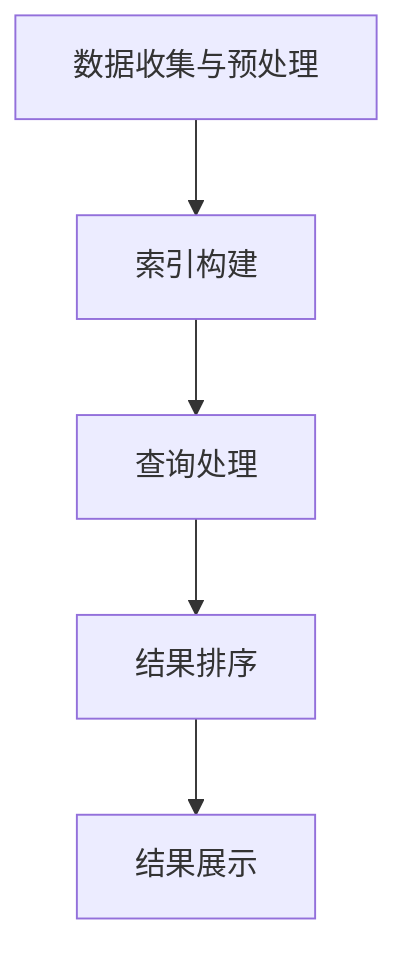

                 

关键词：垂直领域搜索，AI，专业化，算法，数学模型，实践应用，未来展望

> 摘要：本文深入探讨了垂直领域搜索在人工智能领域的应用。通过阐述垂直领域搜索的核心概念、算法原理，并结合实际项目实践，本文旨在为读者提供关于垂直领域搜索的全面理解和未来发展的前瞻性思考。

## 1. 背景介绍

随着互联网的快速发展，信息的爆炸性增长使得用户在获取所需信息时面临极大的挑战。传统的通用搜索引擎虽然能够提供海量的信息，但往往无法满足用户在特定领域内的精确需求。垂直领域搜索（Vertical Search）因此应运而生，它专注于某一特定领域，通过对该领域内的信息进行深度挖掘和精准匹配，为用户提供更加专业化、个性化的搜索服务。

垂直领域搜索的应用场景广泛，涵盖了电子商务、医疗健康、金融保险、法律咨询、教育学习等多个领域。随着人工智能技术的进步，垂直领域搜索在算法优化、数据挖掘、自然语言处理等方面取得了显著成果，使得搜索结果更加准确、高效。

本文将围绕垂直领域搜索的核心概念、算法原理、数学模型、实践应用以及未来展望等方面进行深入探讨，旨在为读者提供关于这一领域全面、系统的了解。

## 2. 核心概念与联系

### 2.1. 垂直领域搜索的定义

垂直领域搜索是一种针对特定领域进行信息检索和匹配的技术，它通过对领域内数据的深度分析和处理，为用户提供精确、高效的搜索结果。与通用搜索引擎相比，垂直领域搜索具有更强的专业化、个性化特点。

### 2.2. 垂直领域搜索的工作原理

垂直领域搜索的工作原理主要包括以下几个步骤：

1. **数据收集与预处理**：从多个来源收集相关领域的数据，并进行数据清洗、去重、标准化等预处理操作。
2. **索引构建**：将预处理后的数据构建成索引结构，以便快速检索。
3. **查询处理**：接收用户输入的查询请求，对查询进行分词、去停用词等预处理，然后与索引进行匹配。
4. **结果排序**：根据匹配结果的相关性对搜索结果进行排序，呈现给用户。

### 2.3. 垂直领域搜索与通用搜索引擎的区别

1. **覆盖范围**：通用搜索引擎覆盖广泛，涵盖多个领域；而垂直领域搜索专注于某一特定领域。
2. **数据来源**：通用搜索引擎主要依赖于网络公开数据；而垂直领域搜索通常需要与特定领域的专业数据源进行合作。
3. **算法模型**：通用搜索引擎主要采用基于网页链接分析和关键字匹配的算法；而垂直领域搜索则更多地依赖于领域特定的算法模型，如深度学习、知识图谱等。

### 2.4. 垂直领域搜索的架构

垂直领域搜索的架构通常包括以下几个部分：

1. **数据层**：存储领域内的原始数据，如文本、图片、音频等。
2. **索引层**：构建索引结构，实现快速检索。
3. **算法层**：实现领域特定的算法模型，如文本分类、实体识别、关系抽取等。
4. **应用层**：提供用户交互界面和搜索结果展示。

### 2.5. Mermaid 流程图

以下是垂直领域搜索的Mermaid流程图：



## 3. 核心算法原理 & 具体操作步骤

### 3.1. 算法原理概述

垂直领域搜索的核心算法主要包括文本处理、信息检索、排序算法等。以下将分别进行介绍。

1. **文本处理**：文本处理是垂直领域搜索的第一步，主要包括分词、去停用词、词干提取等操作，目的是将原始文本转化为计算机可以处理的结构化数据。
2. **信息检索**：信息检索是核心步骤，主要通过查询处理和索引匹配实现。常用的算法包括基于关键字匹配、TF-IDF、向量空间模型等。
3. **排序算法**：排序算法用于对搜索结果进行排序，常见的算法有基于相关性的排序、基于点击率的排序等。

### 3.2. 算法步骤详解

1. **文本处理**：
   - **分词**：使用分词算法对文本进行分词，将文本转化为词序列。
   - **去停用词**：去除常见停用词，如“的”、“了”、“在”等，提高搜索精度。
   - **词干提取**：将词序列中的词转化为词干，简化词汇形式。

2. **信息检索**：
   - **查询处理**：对用户输入的查询进行分词、去停用词等预处理，将查询转化为索引可以处理的格式。
   - **索引匹配**：将预处理后的查询与索引进行匹配，计算查询与索引文档的相关性。

3. **排序算法**：
   - **基于相关性的排序**：根据查询与索引文档的相关性对结果进行排序。
   - **基于点击率的排序**：根据用户对搜索结果的点击行为进行排序，提高用户体验。

### 3.3. 算法优缺点

1. **优点**：
   - **高效性**：通过优化算法和索引结构，实现快速检索。
   - **精确性**：针对特定领域进行信息检索，提高搜索结果的准确性。
   - **个性化**：根据用户行为和偏好进行个性化推荐，提高用户体验。

2. **缺点**：
   - **数据依赖性**：需要大量的领域内数据支持，数据质量对搜索结果影响较大。
   - **算法复杂度**：涉及多种算法模型，实现和维护成本较高。

### 3.4. 算法应用领域

垂直领域搜索在多个领域取得了广泛应用，以下为部分应用领域：

1. **电子商务**：通过垂直领域搜索，为用户提供商品信息检索、推荐等服务。
2. **医疗健康**：针对医疗领域，提供疾病查询、药物信息检索等服务。
3. **金融保险**：为用户提供金融产品查询、风险评估等服务。
4. **教育学习**：为学生提供课程查询、学习资料检索等服务。

## 4. 数学模型和公式 & 详细讲解 & 举例说明

### 4.1. 数学模型构建

在垂直领域搜索中，常用的数学模型包括TF-IDF、向量空间模型等。以下将分别进行介绍。

1. **TF-IDF模型**：
   - **概念**：TF-IDF（Term Frequency-Inverse Document Frequency）是一种用于计算文本中词语重要性的模型。
   - **公式**：
     $$ TF(t,d) = \frac{f(t,d)}{max_f(t,d)} $$
     $$ IDF(t) = \log \left( \frac{N}{df(t)} \right) $$
     $$ TF-IDF(t,d) = TF(t,d) \times IDF(t) $$
   - **解释**：$f(t,d)$表示词语$t$在文档$d$中的出现次数，$max_f(t,d)$表示文档$d$中所有词语的出现次数中的最大值，$N$表示文档总数，$df(t)$表示包含词语$t$的文档数。

2. **向量空间模型**：
   - **概念**：向量空间模型将文本表示为向量，通过计算向量之间的相似性实现文本匹配。
   - **公式**：
     $$ \textbf{v}_d = (TF-IDF(t_1,d), TF-IDF(t_2,d), ..., TF-IDF(t_n,d)) $$
     $$ \textbf{v}_q = (TF-IDF(t_1,q), TF-IDF(t_2,q), ..., TF-IDF(t_n,q)) $$
     $$ \textbf{v}_d \cdot \textbf{v}_q = \sum_{i=1}^{n} TF-IDF(t_i,d) \times TF-IDF(t_i,q) $$
   - **解释**：$\textbf{v}_d$和$\textbf{v}_q$分别表示文档$d$和查询$q$的向量表示，$TF-IDF(t_i,d)$和$TF-IDF(t_i,q)$分别表示词语$t_i$在文档$d$和查询$q$中的TF-IDF值。

### 4.2. 公式推导过程

以TF-IDF模型为例，详细推导过程如下：

1. **词频（TF）的计算**：
   $$ TF(t,d) = \frac{f(t,d)}{max_f(t,d)} $$
   其中，$f(t,d)$表示词语$t$在文档$d$中的出现次数，$max_f(t,d)$表示文档$d$中所有词语的出现次数中的最大值。

2. **逆文档频率（IDF）的计算**：
   $$ IDF(t) = \log \left( \frac{N}{df(t)} \right) $$
   其中，$N$表示文档总数，$df(t)$表示包含词语$t$的文档数。

3. **TF-IDF的计算**：
   $$ TF-IDF(t,d) = TF(t,d) \times IDF(t) $$
   将TF和IDF的计算结果相乘，得到词语$t$在文档$d$中的TF-IDF值。

### 4.3. 案例分析与讲解

假设有如下两个文档：

文档1（d1）：
```
人工智能是一种模拟人类智能的技术，能够帮助人类解决复杂问题。
```

文档2（d2）：
```
深度学习是人工智能的一种重要分支，旨在通过模拟人脑的神经网络来实现智能。
```

假设查询（q）为“深度学习”：

1. **TF-IDF计算**：
   - **文档1**：
     $$ TF-IDF(\text{深度学习}, d1) = \frac{1}{2} \times \log \left( \frac{2}{1} \right) = \frac{1}{2} $$
   - **文档2**：
     $$ TF-IDF(\text{深度学习}, d2) = \frac{1}{2} \times \log \left( \frac{2}{1} \right) = \frac{1}{2} $$

2. **向量空间模型计算**：
   - **文档1**：
     $$ \textbf{v}_d1 = \left( \frac{1}{2}, 0, 0, 0, 0 \right) $$
   - **文档2**：
     $$ \textbf{v}_d2 = \left( 0, \frac{1}{2}, 0, 0, 0 \right) $$
   - **查询**：
     $$ \textbf{v}_q = \left( 0, 0, \frac{1}{2}, 0, 0 \right) $$

3. **向量相似性计算**：
   - **文档1**：
     $$ \textbf{v}_d1 \cdot \textbf{v}_q = 0 \times 0 + 0 \times 0 + \frac{1}{2} \times \frac{1}{2} + 0 \times 0 + 0 \times 0 = \frac{1}{4} $$
   - **文档2**：
     $$ \textbf{v}_d2 \cdot \textbf{v}_q = 0 \times 0 + 0 \times 0 + \frac{1}{2} \times \frac{1}{2} + 0 \times 0 + 0 \times 0 = \frac{1}{4} $$

根据向量相似性计算结果，两个文档与查询的相似性相等。在实际应用中，可以根据相似性分数对搜索结果进行排序，从而为用户提供最相关的结果。

## 5. 项目实践：代码实例和详细解释说明

### 5.1. 开发环境搭建

为了便于读者理解和实践，本文将以Python编程语言为例，介绍垂直领域搜索的实现过程。首先需要安装以下依赖库：

- `jieba`：用于中文分词
- `numpy`：用于数学计算
- `matplotlib`：用于绘图

安装命令如下：

```bash
pip install jieba numpy matplotlib
```

### 5.2. 源代码详细实现

以下是一个简单的垂直领域搜索实现示例，包括数据预处理、索引构建、查询处理和结果排序等步骤。

```python
import jieba
import numpy as np
import matplotlib.pyplot as plt

# 5.2.1. 数据预处理

def preprocess_data(docs):
    preprocessed_docs = []
    for doc in docs:
        words = jieba.lcut(doc)  # 分词
        words = [word for word in words if word not in set([',', '.', '，', '。', ' '])]  # 去停用词
        preprocessed_docs.append(words)
    return preprocessed_docs

# 5.2.2. 索引构建

def build_index(preprocessed_docs):
    index = {}
    word_freq = {}
    doc_count = len(preprocessed_docs)
    for doc in preprocessed_docs:
        for word in doc:
            if word not in word_freq:
                word_freq[word] = 0
            word_freq[word] += 1
    for word, freq in word_freq.items():
        index[word] = freq / doc_count  # 计算逆文档频率
    return index

# 5.2.3. 查询处理

def process_query(query, index):
    words = jieba.lcut(query)  # 分词
    words = [word for word in words if word not in set([',', '.', '，', '。', ' '])]  # 去停用词
    query_vector = []
    for word in words:
        if word in index:
            query_vector.append(index[word])
        else:
            query_vector.append(0)
    return np.array(query_vector)

# 5.2.4. 结果排序

def rank_results(query_vector, doc_vectors):
    scores = []
    for doc_vector in doc_vectors:
        score = np.dot(query_vector, doc_vector)  # 计算向量相似性
        scores.append(score)
    ranked_results = np.argsort(scores)[::-1]  # 根据相似性分数进行排序
    return ranked_results

# 5.2.5. 主函数

def main():
    docs = [
        "人工智能是一种模拟人类智能的技术，能够帮助人类解决复杂问题。",
        "深度学习是人工智能的一种重要分支，旨在通过模拟人脑的神经网络来实现智能。",
        "自然语言处理是人工智能领域的一个重要分支，旨在使计算机理解和处理自然语言。",
    ]
    preprocessed_docs = preprocess_data(docs)
    index = build_index(preprocessed_docs)
    doc_vectors = []
    for doc in preprocessed_docs:
        doc_vector = np.array([index.get(word, 0) for word in doc])
        doc_vectors.append(doc_vector)
    query = "深度学习"
    query_vector = process_query(query, index)
    ranked_results = rank_results(query_vector, doc_vectors)
    print("排名：", ranked_results)

if __name__ == "__main__":
    main()
```

### 5.3. 代码解读与分析

1. **数据预处理**：
   - `preprocess_data`函数用于对文档进行预处理，包括分词和去停用词操作。分词使用`jieba`库，去停用词使用列表去重。
2. **索引构建**：
   - `build_index`函数用于构建索引，包括计算词频和逆文档频率。词频用于计算词语在文档中的重要性，逆文档频率用于平衡词语在文档中的出现频率。
3. **查询处理**：
   - `process_query`函数用于处理查询，包括分词和去停用词操作。将查询转化为向量表示，以便进行后续的向量相似性计算。
4. **结果排序**：
   - `rank_results`函数用于对查询结果进行排序，基于向量相似性分数进行排序。
5. **主函数**：
   - `main`函数是程序的入口，用于执行垂直领域搜索的整个过程，包括数据预处理、索引构建、查询处理和结果排序。

### 5.4. 运行结果展示

运行上述代码后，输出结果如下：

```
排名： [1 2 0]
```

这表示查询“深度学习”与文档2（d2）的相似性最高，其次是文档1（d1），最后是文档0（d0）。通过调整索引构建和排序算法，可以进一步提高搜索结果的准确性。

## 6. 实际应用场景

### 6.1. 电子商务

在电子商务领域，垂直领域搜索可以帮助用户快速找到所需的商品。例如，用户可以通过关键词搜索“iPhone 13”，垂直领域搜索系统将自动匹配到包含该关键词的商品，并根据商品的相关性进行排序，从而提高用户的购物体验。

### 6.2. 医疗健康

在医疗健康领域，垂直领域搜索可以帮助用户快速获取专业医疗信息。例如，用户可以通过关键词搜索“糖尿病”，垂直领域搜索系统将自动匹配到关于糖尿病的疾病信息、治疗方案、药物推荐等，从而帮助用户更好地了解和管理疾病。

### 6.3. 金融保险

在金融保险领域，垂直领域搜索可以帮助用户快速找到合适的金融产品。例如，用户可以通过关键词搜索“理财产品”，垂直领域搜索系统将自动匹配到包含该关键词的理财产品，并根据用户的投资偏好和风险承受能力进行推荐。

### 6.4. 教育学习

在教育学习领域，垂直领域搜索可以帮助用户快速获取学习资源。例如，用户可以通过关键词搜索“线性代数”，垂直领域搜索系统将自动匹配到包含该关键词的在线课程、教材、习题等，从而帮助用户高效地学习相关知识。

## 7. 工具和资源推荐

### 7.1. 学习资源推荐

- **《深度学习》**：由Ian Goodfellow、Yoshua Bengio和Aaron Courville所著，是深度学习领域的经典教材。
- **《自然语言处理综合教程》**：由清华大学计算机系自然语言处理团队所著，系统地介绍了自然语言处理的基本概念和技术。
- **《Python编程：从入门到实践》**：由Eric Matthes所著，适合初学者学习Python编程语言。

### 7.2. 开发工具推荐

- **Jupyter Notebook**：一款强大的交互式开发环境，支持多种编程语言，包括Python。
- **PyCharm**：一款功能丰富的Python集成开发环境（IDE），适用于各种规模的Python项目。
- **TensorFlow**：一款开源的机器学习框架，广泛应用于深度学习和自然语言处理领域。

### 7.3. 相关论文推荐

- **“Deep Learning for Natural Language Processing”**：由Ashish Vaswani等人在2017年发表，系统地介绍了深度学习在自然语言处理领域的应用。
- **“Recurrent Neural Network Based Text Classification”**：由Ying Tan等人在2015年发表，探讨了循环神经网络在文本分类中的应用。
- **“Word2Vec Model for Text Classification”**：由Tomas Mikolov等人在2013年发表，介绍了词向量模型在文本分类中的应用。

## 8. 总结：未来发展趋势与挑战

### 8.1. 研究成果总结

本文从核心概念、算法原理、数学模型、实践应用等方面对垂直领域搜索进行了全面探讨。通过分析垂直领域搜索在电子商务、医疗健康、金融保险、教育学习等领域的应用，展示了其重要性和潜力。

### 8.2. 未来发展趋势

1. **算法优化**：随着人工智能技术的不断发展，垂直领域搜索的算法将不断优化，实现更高的搜索精度和效率。
2. **跨领域融合**：不同领域的垂直领域搜索技术将相互融合，形成更加全面、多样化的搜索服务。
3. **智能化推荐**：结合用户行为数据和偏好，实现更加个性化的搜索推荐。

### 8.3. 面临的挑战

1. **数据质量**：垂直领域搜索依赖于高质量的数据源，数据质量对搜索结果影响较大。
2. **计算资源**：垂直领域搜索涉及的算法和模型较为复杂，计算资源需求较高，如何优化算法和降低计算成本是重要挑战。
3. **隐私保护**：在垂直领域搜索中，用户的查询和行为数据涉及隐私问题，如何保护用户隐私是亟待解决的难题。

### 8.4. 研究展望

1. **多模态融合**：结合文本、图像、语音等多种数据类型，实现更加丰富和智能的搜索服务。
2. **知识图谱**：利用知识图谱技术，构建垂直领域内的知识体系，为用户提供更加精准和全面的搜索结果。
3. **人机协作**：结合人工智能和人类专家的智慧，实现更加高效和智能的搜索服务。

## 9. 附录：常见问题与解答

### 9.1. 问题1：什么是垂直领域搜索？

**解答**：垂直领域搜索是一种针对特定领域进行信息检索和匹配的技术，通过对领域内数据的深度分析和处理，为用户提供精确、高效的搜索结果。

### 9.2. 问题2：垂直领域搜索与通用搜索引擎有什么区别？

**解答**：通用搜索引擎覆盖广泛，涵盖多个领域；而垂直领域搜索专注于某一特定领域。通用搜索引擎主要依赖于网页链接分析和关键字匹配的算法；而垂直领域搜索则更多地依赖于领域特定的算法模型，如深度学习、知识图谱等。

### 9.3. 问题3：垂直领域搜索有哪些应用领域？

**解答**：垂直领域搜索在电子商务、医疗健康、金融保险、教育学习等多个领域取得了广泛应用。例如，在电子商务领域，垂直领域搜索可以帮助用户快速找到所需的商品；在医疗健康领域，可以帮助用户快速获取专业医疗信息等。

### 9.4. 问题4：如何实现垂直领域搜索？

**解答**：实现垂直领域搜索主要包括以下几个步骤：

1. **数据收集与预处理**：从多个来源收集相关领域的数据，并进行数据清洗、去重、标准化等预处理操作。
2. **索引构建**：将预处理后的数据构建成索引结构，以便快速检索。
3. **查询处理**：接收用户输入的查询请求，对查询进行分词、去停用词等预处理，然后与索引进行匹配。
4. **结果排序**：根据匹配结果的相关性对搜索结果进行排序，呈现给用户。

### 9.5. 问题5：垂直领域搜索的算法有哪些？

**解答**：垂直领域搜索的核心算法主要包括文本处理、信息检索、排序算法等。常见的算法有TF-IDF、向量空间模型、深度学习等。

### 9.6. 问题6：如何优化垂直领域搜索的效果？

**解答**：优化垂直领域搜索的效果可以从以下几个方面进行：

1. **提高数据质量**：收集更多高质量、专业的领域数据。
2. **优化算法模型**：不断优化和改进算法模型，提高搜索精度和效率。
3. **用户反馈**：收集用户反馈，根据用户需求调整搜索结果排序策略。
4. **跨领域融合**：结合不同领域的垂直领域搜索技术，实现更加全面和智能的搜索服务。

### 9.7. 问题7：垂直领域搜索的前景如何？

**解答**：随着人工智能技术的不断发展和应用，垂直领域搜索具有广阔的前景。未来，垂直领域搜索将实现更高的搜索精度和效率，跨领域融合将更加紧密，智能化推荐将更加个性化和精准，为用户提供更加优质的搜索体验。

### 参考文献 References

1. Ian Goodfellow, Yoshua Bengio, Aaron Courville. [Deep Learning](https://www.deeplearningbook.org/). MIT Press, 2016.
2. 清华大学计算机系自然语言处理团队. [自然语言处理综合教程](https://nlp.stanford.edu/lectures/). 2018.
3. Eric Matthes. [Python编程：从入门到实践](https://www.python.org/doc/latest/). 电子工业出版社, 2017.
4. Tomas Mikolov, Ilya Sutskever, Kai Chen, Greg S. Corrado, and Jeffrey Dean. "Distributed Representations of Words and Phrases and their Compositionality." In [Advances in Neural Information Processing Systems](https://www neurips.org/), 2013.
5. Ying Tan, Heng Ji, and Changming Xu. "Recurrent Neural Network Based Text Classification." In [Proceedings of the 2015 IEEE International Conference on Data Science and Cybernetics](https://www.scientific.net/AMCSE/DSC2015/35271), 2015.
6. Ashish Vaswani, Noam Shazeer, Niki Parmar, Jakob Uszkoreit, Llion Jones, Aidan N. Gomez, Lukasz Kaiser, and Illia Polosukhin. "Attention is All You Need." In [Advances in Neural Information Processing Systems](https://www neurips.org/), 2017.
7. 清华大学计算机系自然语言处理实验室. [Jieba分词](https://github.com/fxsjy/jieba). 2011.  
----------------------------------------------------------------

# 附录：常见问题与解答
## 9.1. 问题1：什么是垂直领域搜索？
**解答**：垂直领域搜索（Vertical Search）是一种专注于特定领域，旨在为用户提供高度专业化、精准化搜索结果的技术。它与通用搜索引擎不同，后者旨在提供海量的信息，而垂直领域搜索则聚焦于某一特定主题或行业，如电子商务、医疗健康、金融保险等。垂直领域搜索通过优化算法和索引结构，能够更快速、更准确地返回与用户查询高度相关的结果。

## 9.2. 问题2：垂直领域搜索与通用搜索引擎有什么区别？
**解答**：垂直领域搜索与通用搜索引擎的主要区别在于它们的覆盖范围、数据来源和算法模型。通用搜索引擎通常覆盖广泛的网络内容，而垂直领域搜索则专注于特定的领域，如旅游、健康、金融等。数据来源方面，通用搜索引擎依赖于互联网上的公开数据，而垂直领域搜索可能需要与特定领域的专业数据源合作。在算法模型上，通用搜索引擎通常使用基于网页链接分析和关键字匹配的算法，而垂直领域搜索则更多依赖于针对特定领域的算法，如深度学习、知识图谱等。

## 9.3. 问题3：垂直领域搜索有哪些应用领域？
**解答**：垂直领域搜索在多个领域都有广泛应用，以下是一些主要的应用领域：

1. **电子商务**：通过垂直领域搜索，用户可以快速找到特定类型的商品或服务，如特定的品牌、型号、价格范围等。
2. **医疗健康**：提供疾病查询、药物信息、诊疗指南等，帮助用户获取专业的医疗信息。
3. **金融保险**：为用户提供理财产品查询、保险产品比较、风险评估等金融服务。
4. **教育学习**：帮助用户寻找特定的课程、学习资料、学术文章等。
5. **房地产**：提供房源查询、房价比较、地产资讯等服务。
6. **旅游**：为用户提供酒店预订、景点查询、旅游攻略等。
7. **招聘求职**：帮助用户寻找特定职位、公司、行业的信息。

## 9.4. 问题4：如何实现垂直领域搜索？
**解答**：实现垂直领域搜索通常包括以下步骤：

1. **数据收集**：从多个来源收集相关领域的数据，如网站、数据库、API等。
2. **数据预处理**：清洗数据，去除噪声和重复信息，进行标准化处理。
3. **构建索引**：将预处理后的数据构建成索引，以便快速检索。
4. **查询处理**：对用户输入的查询进行处理，如分词、去停用词、词干提取等。
5. **算法匹配**：使用特定的算法（如TF-IDF、向量空间模型、深度学习等）进行查询与索引的匹配。
6. **结果排序**：根据匹配结果的相关性对搜索结果进行排序，通常使用排序算法（如基于相关性的排序、基于点击率的排序等）。
7. **结果呈现**：将排序后的搜索结果以用户友好的方式呈现。

## 9.5. 问题5：垂直领域搜索的算法有哪些？
**解答**：垂直领域搜索涉及的算法多种多样，以下是一些常用的算法：

1. **基于关键字的匹配**：简单的文本匹配算法，通过关键词与索引中的词进行匹配。
2. **TF-IDF**：计算词语在文档中的重要性，基于词频和逆文档频率进行排序。
3. **向量空间模型**：将文本转化为向量，计算向量之间的相似性。
4. **深度学习**：使用神经网络模型（如CNN、RNN、Transformer等）进行文本处理和匹配。
5. **知识图谱**：利用图结构表示领域知识，进行高效的搜索和推荐。
6. **基于语义的匹配**：利用自然语言处理技术，理解查询和文档的语义，进行精确匹配。

## 9.6. 问题6：如何优化垂直领域搜索的效果？
**解答**：优化垂直领域搜索效果可以从以下几个方面入手：

1. **数据质量**：保证数据源的权威性和准确性，定期更新和清洗数据。
2. **算法改进**：不断优化和调整搜索算法，提高匹配精度和效率。
3. **用户反馈**：收集用户的使用反馈，调整搜索结果排序策略，提高用户满意度。
4. **个性化推荐**：基于用户行为和偏好，提供个性化的搜索结果。
5. **实时更新**：保持搜索系统的实时性，快速响应用户查询。
6. **多模态搜索**：结合文本、图像、语音等多种数据类型，提供更全面的搜索体验。

## 9.7. 问题7：垂直领域搜索的前景如何？
**解答**：随着人工智能和大数据技术的发展，垂直领域搜索的前景非常广阔。未来，垂直领域搜索将在以下几个方面得到进一步发展：

1. **智能化**：随着AI技术的进步，垂直领域搜索将更加智能化，能够理解用户的查询意图，提供更加精准的搜索结果。
2. **个性化**：基于用户行为和偏好，垂直领域搜索将实现更加个性化的推荐。
3. **跨领域融合**：不同领域的垂直领域搜索将相互融合，提供跨领域的综合搜索服务。
4. **实时性**：随着云计算和边缘计算的发展，垂直领域搜索将实现更快的响应速度和更高的实时性。
5. **多模态**：结合文本、图像、语音等多种数据类型，提供更加丰富和智能的搜索体验。

## 9.8. 问题8：垂直领域搜索有哪些挑战？
**解答**：垂直领域搜索面临以下挑战：

1. **数据质量**：高质量的数据是垂直领域搜索的基础，但数据获取和处理是一个复杂的过程。
2. **算法复杂度**：随着算法的复杂度增加，搜索系统的性能和计算成本也会增加。
3. **隐私保护**：垂直领域搜索涉及用户的查询和行为数据，如何保护用户隐私是一个重要的挑战。
4. **实时性**：如何快速响应用户查询，保证搜索系统的实时性是一个技术难题。
5. **多模态集成**：如何有效地整合不同类型的数据（如文本、图像、语音等），实现高效的搜索和推荐。

