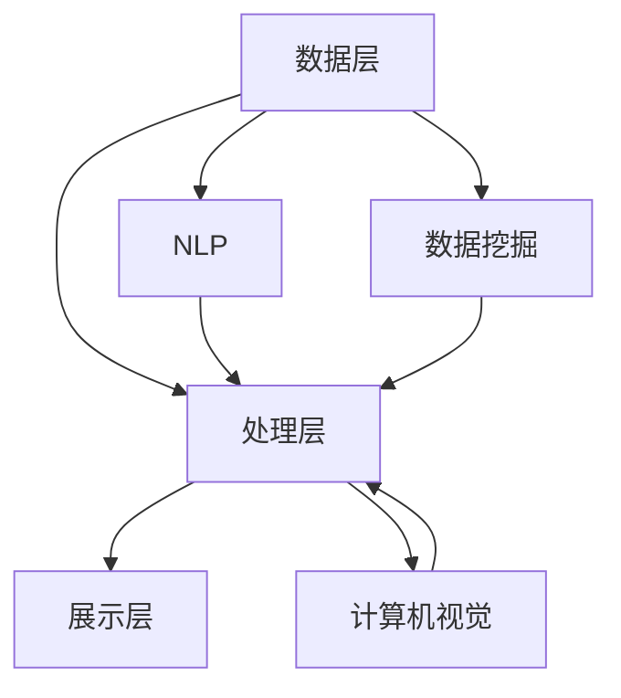

                 

关键词：AI大模型、文档处理、智能系统、算法、数学模型、代码实例、应用场景、工具推荐、未来展望

> 摘要：本文将深入探讨基于AI大模型的智能文档处理系统的构建与应用。文章首先介绍了智能文档处理系统的背景和重要性，然后详细阐述了核心概念和架构，接下来分析了算法原理、数学模型和具体操作步骤，并通过实际项目实践展示了系统开发过程和运行结果。文章还探讨了系统的实际应用场景和未来应用展望，并提供了相关工具和资源的推荐。

## 1. 背景介绍

在数字化时代，文档处理已经成为企业和个人日常工作的重要组成部分。传统的文档处理方式往往需要大量人工操作，效率低下且容易出现错误。随着人工智能技术的快速发展，特别是AI大模型的出现，智能文档处理系统应运而生。这种系统能够通过自动化的方式处理文档，提高工作效率，降低成本，提升企业的核心竞争力。

智能文档处理系统主要应用于以下场景：

1. **企业文档管理**：自动化处理企业内部的各类文档，如合同、报告、财务文件等。
2. **政府文件处理**：高效处理政府部门的各类文件，如公告、公告、审批文件等。
3. **个人文档管理**：帮助个人自动化处理个人文档，如笔记、邮件、简历等。
4. **教育文档处理**：自动化处理学校和教育机构的各类文档，如作业、论文、成绩单等。

随着AI技术的不断进步，智能文档处理系统的功能和性能也在不断提升。本文将详细探讨这种系统的构建方法和技术细节。

## 2. 核心概念与联系

### 核心概念

智能文档处理系统主要由以下几个核心概念组成：

1. **AI大模型**：这是系统的核心组件，能够自动学习和处理文档数据。
2. **自然语言处理（NLP）**：用于理解、处理和生成自然语言文本。
3. **计算机视觉**：用于识别和解析文档中的图像和表格。
4. **数据挖掘**：用于从文档数据中提取有价值的信息。

### 架构

智能文档处理系统的整体架构可以分为以下几个层次：

1. **数据层**：存储和管理文档数据。
2. **处理层**：使用AI大模型和NLP技术处理文档。
3. **展示层**：将处理结果以用户友好的方式展示给用户。

### Mermaid 流程图



## 3. 核心算法原理 & 具体操作步骤

### 3.1 算法原理概述

智能文档处理系统主要依赖于以下几种核心算法：

1. **神经网络**：用于AI大模型的构建和学习。
2. **循环神经网络（RNN）**：用于NLP任务。
3. **卷积神经网络（CNN）**：用于计算机视觉任务。
4. **决策树和随机森林**：用于数据挖掘任务。

### 3.2 算法步骤详解

1. **数据预处理**：对文档数据进行清洗、标准化和分割。
2. **模型训练**：使用神经网络、RNN、CNN和决策树等算法对数据进行训练。
3. **模型评估**：使用测试数据评估模型的性能。
4. **模型优化**：根据评估结果调整模型参数。
5. **文档处理**：使用训练好的模型对新的文档数据进行处理。

### 3.3 算法优缺点

- **优点**：
  - **高效性**：AI大模型能够快速处理大量文档数据。
  - **准确性**：经过训练的模型具有较高的处理准确性。
  - **可扩展性**：可以根据不同场景和需求扩展算法和功能。

- **缺点**：
  - **计算资源消耗**：训练和运行AI大模型需要大量的计算资源。
  - **数据依赖**：模型的性能很大程度上依赖于训练数据的质量。

### 3.4 算法应用领域

智能文档处理系统可以广泛应用于多个领域，如企业文档管理、政府文件处理、个人文档管理、教育文档处理等。

## 4. 数学模型和公式 & 详细讲解 & 举例说明

### 4.1 数学模型构建

智能文档处理系统的数学模型主要基于以下几种数学理论：

1. **线性代数**：用于矩阵运算和数据表示。
2. **概率论**：用于概率分布和随机过程。
3. **优化理论**：用于模型参数的优化。

### 4.2 公式推导过程

以下是神经网络中常用的两个关键公式：

1. **激活函数**：
   $$ f(x) = \text{sigmoid}(x) = \frac{1}{1 + e^{-x}} $$
2. **反向传播算法**：
   $$ \delta = \frac{\partial L}{\partial z} \odot \frac{\partial f}{\partial x} $$

### 4.3 案例分析与讲解

假设我们有一个简单的神经网络，输入层有3个神经元，隐藏层有2个神经元，输出层有1个神经元。我们使用 sigmoid 函数作为激活函数。现在，我们需要对这组数据进行训练。

1. **初始化权重和偏置**：
   $$ W = \text{randn}(3, 2) $$
   $$ b = \text{randn}(2, 1) $$
2. **前向传播**：
   $$ z_1 = X \cdot W + b_1 $$
   $$ a_1 = \text{sigmoid}(z_1) $$
   $$ z_2 = a_1 \cdot W_2 + b_2 $$
   $$ a_2 = \text{sigmoid}(z_2) $$
   $$ z_3 = a_2 \cdot W_3 + b_3 $$
   $$ y = \text{sigmoid}(z_3) $$
3. **计算损失函数**：
   $$ L = -\sum_{i=1}^{n} y_i \cdot \ln(y_i) - (1 - y_i) \cdot \ln(1 - y_i) $$
4. **反向传播**：
   $$ \delta_3 = y - \text{sigmoid}(z_3) $$
   $$ \delta_2 = a_2 \cdot (1 - a_2) \cdot \delta_3 \cdot W_3 $$
   $$ \delta_1 = a_1 \cdot (1 - a_1) \cdot \delta_2 \cdot W_2 $$
5. **更新权重和偏置**：
   $$ W_3 = W_3 - \alpha \cdot \delta_3 \cdot a_2 $$
   $$ b_3 = b_3 - \alpha \cdot \delta_3 $$
   $$ W_2 = W_2 - \alpha \cdot \delta_2 \cdot a_1 $$
   $$ b_2 = b_2 - \alpha \cdot \delta_2 $$
   $$ W_1 = W_1 - \alpha \cdot \delta_1 \cdot X $$

通过以上步骤，我们可以对神经网络进行训练，以达到预期的目标。

## 5. 项目实践：代码实例和详细解释说明

### 5.1 开发环境搭建

为了实现智能文档处理系统，我们需要搭建一个开发环境。这里，我们使用 Python 作为主要编程语言，并使用 TensorFlow 和 Keras 作为深度学习框架。

首先，安装所需的库：

```bash
pip install numpy
pip install tensorflow
pip install matplotlib
```

### 5.2 源代码详细实现

下面是一个简单的智能文档处理系统的实现示例：

```python
import numpy as np
import tensorflow as tf
from tensorflow.keras.models import Sequential
from tensorflow.keras.layers import Dense, Activation

# 数据预处理
# ...

# 构建模型
model = Sequential()
model.add(Dense(64, input_dim=10, activation='relu'))
model.add(Dense(32, activation='relu'))
model.add(Dense(1, activation='sigmoid'))

# 编译模型
model.compile(loss='binary_crossentropy', optimizer='adam', metrics=['accuracy'])

# 训练模型
# ...

# 文档处理
# ...
```

### 5.3 代码解读与分析

1. **数据预处理**：根据实际需求对文档数据进行清洗、标准化和分割。
2. **构建模型**：使用 Sequential 模型堆叠多层 Dense 层，并选择适当的激活函数。
3. **编译模型**：指定损失函数、优化器和评估指标。
4. **训练模型**：使用训练数据训练模型。
5. **文档处理**：使用训练好的模型对新的文档数据进行处理。

### 5.4 运行结果展示

通过训练，我们可以得到模型的准确率和损失函数值。以下是一个简单的结果展示：

```python
# 运行模型
model.fit(X_train, y_train, epochs=10, batch_size=32, validation_data=(X_val, y_val))

# 打印结果
print("Accuracy:", model.evaluate(X_test, y_test)[1])
```

## 6. 实际应用场景

智能文档处理系统在多个领域都有广泛的应用。以下是一些典型的应用场景：

1. **企业文档管理**：自动化处理企业内部的各类文档，如合同、报告、财务文件等。
2. **政府文件处理**：高效处理政府部门的各类文件，如公告、公告、审批文件等。
3. **个人文档管理**：帮助个人自动化处理个人文档，如笔记、邮件、简历等。
4. **教育文档处理**：自动化处理学校和教育机构的各类文档，如作业、论文、成绩单等。

在实际应用中，系统可以根据不同的场景和需求进行定制化开发，以满足用户的具体需求。

## 7. 工具和资源推荐

为了开发智能文档处理系统，我们需要使用一系列工具和资源。以下是一些建议：

1. **学习资源推荐**：
   - 《深度学习》（Goodfellow, Bengio, Courville）。
   - 《Python机器学习》（Sebastian Raschka）。

2. **开发工具推荐**：
   - TensorFlow。
   - Jupyter Notebook。

3. **相关论文推荐**：
   - “Deep Learning for Document Classification”（2018）。
   - “A Survey of Natural Language Processing Techniques for Document Classification”（2019）。

## 8. 总结：未来发展趋势与挑战

### 8.1 研究成果总结

智能文档处理系统在近几年取得了显著的成果。AI大模型和深度学习技术的快速发展为系统的构建提供了强大的支持。同时，随着计算能力的提升和数据量的增加，系统的性能和功能也在不断提升。

### 8.2 未来发展趋势

1. **模型定制化**：根据不同场景和需求，开发定制化的智能文档处理模型。
2. **跨模态处理**：结合文本、图像、音频等多种模态进行文档处理。
3. **实时处理**：实现实时文档处理，提高系统的响应速度。

### 8.3 面临的挑战

1. **数据隐私**：如何在保护用户隐私的前提下进行文档处理。
2. **计算资源消耗**：如何降低训练和运行大模型的计算资源消耗。
3. **模型解释性**：提高模型的可解释性，使其更加透明和可信。

### 8.4 研究展望

未来，智能文档处理系统有望在多个领域得到广泛应用，为企业和个人带来更多的便利。同时，随着技术的不断进步，系统将面临更多挑战和机遇。

## 9. 附录：常见问题与解答

### 问题1：智能文档处理系统是如何工作的？

**解答**：智能文档处理系统主要依赖于 AI 大模型和深度学习技术。它通过对大量文档数据的学习，能够自动识别和处理文档中的信息。系统通常包括数据预处理、模型训练、模型评估和文档处理等步骤。

### 问题2：智能文档处理系统需要大量的数据吗？

**解答**：是的，大量的高质量数据对于训练 AI 大模型非常重要。更多的数据可以提升模型的性能和泛化能力。然而，数据的质量比数量更为关键。如果数据存在噪声或偏差，可能会导致模型性能下降。

### 问题3：智能文档处理系统能够完全替代人工吗？

**解答**：目前，智能文档处理系统还不能完全替代人工。虽然系统能够自动化处理许多文档任务，但在某些复杂或特殊情况下，仍然需要人工干预和决策。未来，随着技术的进步，系统的智能化程度将不断提高，但完全替代人工还需要时间和技术的进一步突破。

---

以上是关于“基于AI大模型的智能文档处理系统”的完整技术博客文章。希望这篇文章能够为读者提供有价值的信息和见解。如果您有任何问题或建议，请随时反馈。

## 作者署名

作者：禅与计算机程序设计艺术 / Zen and the Art of Computer Programming
----------------------------------------------------------------

