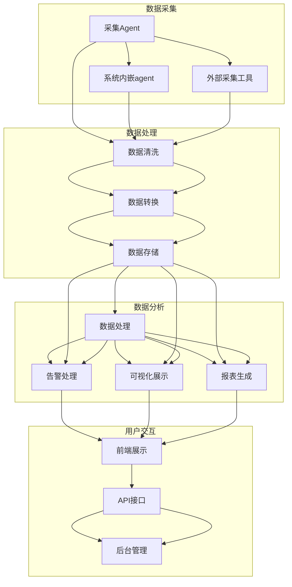

                 

关键词：(Django，服务器监控，系统设计，代码实现，性能优化，故障排查，自动化管理)

> 摘要：本文将详细介绍如何基于Django框架设计和实现一个功能完备的服务器监控系统。文章将覆盖从系统需求分析、架构设计到具体代码实现的全过程，并通过实例代码展示其应用场景和性能优化策略。

## 1. 背景介绍

在现代企业中，服务器监控系统是保障IT基础设施稳定运行的核心工具。随着云计算和容器技术的兴起，服务器的数量和种类也在不断增多，这使得对服务器状态的实时监控和故障排查变得尤为重要。传统的监控工具往往依赖于复杂的脚本和分散的配置，难以实现高效、自动化的管理。

Django是一个高级的Python Web框架，致力于快速开发和简洁、实用的设计。它具有丰富的功能和高度的扩展性，使得开发者可以轻松地构建功能完备的Web应用程序。将Django与服务器监控系统集成，能够利用其强大的Web功能实现监控数据的可视化和自动化管理。

本文旨在通过详细设计和具体代码实现，展示如何利用Django构建一个高效的服务器监控系统，以应对复杂的企业级监控需求。

### 1.1 Django概述

Django是一个开源的Python Web框架，由Adrian Holovaty和Simon Willison在2003年创建。自发布以来，Django因其简洁性、快速开发和安全性而广受欢迎。Django遵循MVC（模型-视图-控制器）设计模式，通过自动化的URL处理和ORM（对象关系映射）系统，使得开发者可以专注于业务逻辑的实现，而无需过多关注底层的Web细节。

Django的主要特点包括：

- **快速开发**：Django内置了多种工具和功能，使得Web应用程序的开发速度大大提升。
- **安全性**：Django提供了多种安全特性，如CSRF保护、跨站请求伪造保护等，保障应用程序的安全性。
- **数据库支持**：Django支持多种数据库，包括SQLite、PostgreSQL、MySQL等，通过ORM系统简化了数据库操作。
- **可扩展性**：Django的设计非常灵活，开发者可以根据需求自定义各种组件，扩展系统功能。

### 1.2 服务器监控的重要性

服务器监控系统是IT基础设施中不可或缺的一部分。其主要作用包括：

- **性能监控**：实时监控服务器的CPU使用率、内存使用率、磁盘I/O、网络流量等关键指标，及时发现性能瓶颈。
- **故障排查**：当服务器发生故障或异常时，监控系统可以快速定位问题，并提供详细的日志和告警信息。
- **自动化管理**：通过自动化脚本或接口，监控系统可以执行自动化的重启、备份等操作，降低运维成本。
- **成本控制**：通过对服务器资源的合理利用，监控系统有助于降低硬件和运维成本。

在现代企业中，服务器监控的重要性体现在以下几个方面：

- **确保业务连续性**：对于许多企业而言，服务器故障可能导致业务中断，严重影响用户体验和客户满意度。
- **优化资源利用**：通过监控和分析服务器的运行状态，可以及时发现资源浪费，优化资源分配，降低运营成本。
- **提高运维效率**：自动化的监控和故障排查功能，可以显著提高运维团队的效率，减少人工干预。
- **合规性要求**：一些行业和地区对服务器监控有明确的要求，确保数据安全和合规性。

### 1.3 Django在服务器监控中的应用

Django在服务器监控中的应用主要体现在以下几个方面：

- **数据可视化**：通过Django提供的模板系统和前端框架，可以轻松实现监控数据的可视化展示，使得运维人员可以直观地了解服务器的运行状态。
- **自动化告警**：Django可以与各种告警工具集成，如邮件、短信、微信等，实现自动化告警通知。
- **自定义报表**：利用Django的ORM系统和模板引擎，可以定制各种监控报表，满足不同业务场景的需求。
- **集成管理**：Django可以作为服务器监控系统的核心模块，与其他运维工具（如SaltStack、Ansible等）集成，实现一体化的自动化管理。

### 1.4 文章结构

本文将按照以下结构进行详细阐述：

- **第1章 背景介绍**：介绍服务器监控的重要性以及Django框架的概述。
- **第2章 核心概念与联系**：定义服务器监控的核心概念，并给出系统架构的Mermaid流程图。
- **第3章 核心算法原理 & 具体操作步骤**：介绍服务器监控的核心算法和实现步骤。
- **第4章 数学模型和公式 & 详细讲解 & 举例说明**：构建数学模型，推导相关公式，并举例说明。
- **第5章 项目实践：代码实例和详细解释说明**：展示实际代码实现和详细解释。
- **第6章 实际应用场景**：讨论服务器监控系统的实际应用场景和案例。
- **第7章 工具和资源推荐**：推荐学习资源、开发工具和相关论文。
- **第8章 总结：未来发展趋势与挑战**：总结研究成果，展望未来发展趋势和面临的挑战。
- **第9章 附录：常见问题与解答**：提供常见问题的解答。

## 2. 核心概念与联系

### 2.1 核心概念

在设计和实现服务器监控系统时，需要理解以下核心概念：

- **指标（Metrics）**：服务器监控的核心是各种性能指标，如CPU使用率、内存使用率、磁盘I/O、网络流量等。
- **数据采集（Data Collection）**：通过系统内嵌的agent或外部工具，定期采集服务器的各项指标数据。
- **数据处理（Data Processing）**：对采集到的数据进行清洗、转换和存储，以便后续分析和展示。
- **告警（Alerting）**：当监控指标超出预设阈值时，系统会自动发送告警通知，如邮件、短信、微信等。
- **可视化（Visualization）**：利用图表、仪表盘等工具，将监控数据以直观的方式展示给用户。
- **报表（Reporting）**：定期生成监控报表，用于总结和分析服务器的运行状态。

### 2.2 系统架构

下面是服务器监控系统的架构图，使用Mermaid流程图语言描述。



### 2.3 核心算法原理

服务器监控系统的核心算法主要涉及性能指标的采集、处理和告警策略。以下是对这些核心算法的简要概述：

- **性能指标采集算法**：通过系统内嵌的agent或外部采集工具，定期采集服务器的各项性能指标数据。采集算法需要考虑数据的精度、频率和可靠性。
- **数据处理算法**：对采集到的数据进行清洗、转换和存储。数据处理算法需要确保数据的一致性、完整性和准确性。
- **告警策略算法**：根据监控指标阈值，设定告警规则和通知方式。告警策略算法需要平衡告警的及时性和准确性。

### 2.4 系统设计思路

在设计服务器监控系统时，需要考虑以下设计思路：

- **模块化设计**：将系统划分为多个模块，如数据采集、数据处理、告警处理、可视化展示等，每个模块独立开发、测试和部署，提高系统的可维护性和扩展性。
- **可扩展性**：设计时应考虑未来的扩展需求，如增加新的监控指标、支持不同的服务器类型等。
- **高可用性**：系统应具备高可用性，确保在任何情况下都能正常运行，如通过冗余设计、负载均衡等手段。
- **易用性**：系统界面和交互设计应简单直观，降低运维人员的学习成本，提高操作效率。

## 3. 核心算法原理 & 具体操作步骤

### 3.1 算法原理概述

服务器监控系统的核心算法主要涉及性能指标的采集、处理和告警。以下是对这些核心算法的简要概述：

- **性能指标采集算法**：通过系统内嵌的agent或外部采集工具，定期采集服务器的各项性能指标数据。采集算法需要考虑数据的精度、频率和可靠性。
- **数据处理算法**：对采集到的数据进行清洗、转换和存储。数据处理算法需要确保数据的一致性、完整性和准确性。
- **告警策略算法**：根据监控指标阈值，设定告警规则和通知方式。告警策略算法需要平衡告警的及时性和准确性。

### 3.2 算法步骤详解

以下是服务器监控系统核心算法的具体操作步骤：

#### 3.2.1 性能指标采集

1. **初始化**：启动监控agent，加载配置文件，初始化采集任务。
2. **周期性采集**：按照预设的采集频率，定期从服务器上获取各项性能指标数据，如CPU使用率、内存使用率、磁盘I/O、网络流量等。
3. **数据清洗**：对采集到的数据进行过滤和转换，去除异常值和无效数据，确保数据的准确性。
4. **存储数据**：将清洗后的数据存储到数据库中，以便后续分析和处理。

#### 3.2.2 数据处理

1. **数据转换**：将采集到的原始数据转换为标准格式，如JSON、CSV等，以便后续处理和分析。
2. **数据存储**：将转换后的数据存储到数据库中，如MySQL、PostgreSQL等。
3. **数据分析**：对存储的数据进行分析，提取有用的信息，如趋势分析、异常检测等。

#### 3.2.3 告警策略

1. **设置阈值**：根据业务需求和系统性能，设置各项监控指标的阈值。
2. **告警规则**：定义告警规则，如超过阈值时间、告警级别等。
3. **发送告警**：当监控指标超出阈值时，根据告警规则发送告警通知，如邮件、短信、微信等。
4. **记录日志**：记录告警日志，便于后续问题排查和审计。

### 3.3 算法优缺点

#### 3.3.1 优点

- **高效性**：基于Django框架的服务器监控系统，利用了Python的高性能和快速开发特性，能够高效地处理大规模数据。
- **灵活性**：Django提供了丰富的扩展性，可以轻松集成各种第三方库和工具，满足不同业务场景的需求。
- **易用性**：通过Django的MVC架构和ORM系统，简化了数据操作和业务逻辑，降低了开发难度。

#### 3.3.2 缺点

- **性能瓶颈**：对于非常大规模的数据处理和实时监控，Django的性能可能存在瓶颈，需要优化数据库查询和缓存策略。
- **安全性**：虽然Django本身安全性较高，但在实际应用中，仍需注意SQL注入、跨站脚本攻击等安全问题。

### 3.4 算法应用领域

服务器监控系统算法可以应用于以下领域：

- **IT运维**：实时监控服务器性能，快速发现故障，提高运维效率。
- **云计算**：监控云资源使用情况，优化资源分配，降低运营成本。
- **大数据**：监控大数据平台性能，确保数据处理的稳定性和可靠性。
- **物联网**：监控物联网设备状态，实现远程管理和故障排查。

## 4. 数学模型和公式 & 详细讲解 & 举例说明

### 4.1 数学模型构建

服务器监控系统的核心在于对服务器性能指标的分析和预测，这需要建立相应的数学模型。以下是一个简化的数学模型，用于描述服务器CPU使用率的变化。

#### 4.1.1 CPU使用率模型

CPU使用率 \( C(t) \) 可以表示为：

\[ C(t) = \frac{CPU_{used}(t)}{CPU_{total}(t)} \]

其中，\( CPU_{used}(t) \) 表示在时间 \( t \) 的CPU使用量，\( CPU_{total}(t) \) 表示在时间 \( t \) 的CPU总容量。

#### 4.1.2 时间序列模型

服务器CPU使用率通常是一个时间序列数据，可以使用ARIMA（自回归积分滑动平均模型）模型进行预测。ARIMA模型包括三个参数：\( p \)、\( d \) 和 \( q \)。

- \( p \)：自回归项的阶数
- \( d \)：差分阶数
- \( q \)：移动平均项的阶数

ARIMA模型的公式为：

\[ \Delta Y(t) = \phi_1 \Delta Y(t-1) + \phi_2 \Delta Y(t-2) + \ldots + \phi_p \Delta Y(t-p) + \theta_1 e(t-1) + \theta_2 e(t-2) + \ldots + \theta_q e(t-q) + \varepsilon_t \]

其中，\( \Delta Y(t) \) 表示差分后的序列，\( e(t) \) 表示误差项，\( \varepsilon_t \) 表示白噪声。

### 4.2 公式推导过程

#### 4.2.1 自回归项

自回归项 \( \phi \) 的推导过程如下：

假设时间序列 \( Y(t) \) 的前 \( p \) 个滞后值分别为 \( Y(t-1), Y(t-2), \ldots, Y(t-p) \)。自回归项 \( \phi \) 可以表示为：

\[ \phi = \sum_{i=1}^{p} \frac{cov(Y(t), Y(t-i))}{var(Y(t-i))} \]

#### 4.2.2 移动平均项

移动平均项 \( \theta \) 的推导过程如下：

假设时间序列 \( Y(t) \) 的前 \( q \) 个误差项分别为 \( e(t-1), e(t-2), \ldots, e(t-q) \)。移动平均项 \( \theta \) 可以表示为：

\[ \theta = \sum_{i=1}^{q} \frac{cov(Y(t), e(t-i))}{var(e(t-i))} \]

### 4.3 案例分析与讲解

假设我们有一个服务器CPU使用率的时间序列数据，如下所示：

\[ 80\%, 85\%, 78\%, 82\%, 90\%, 88\%, 85\%, 93\%, 92\%, 87\% \]

#### 4.3.1 数据预处理

首先，我们需要对数据进行预处理，将百分比转换为小数形式：

\[ 0.80, 0.85, 0.78, 0.82, 0.90, 0.88, 0.85, 0.93, 0.92, 0.87 \]

#### 4.3.2 差分

为了满足ARIMA模型的要求，我们需要对序列进行差分。一阶差分公式为：

\[ \Delta Y(t) = Y(t) - Y(t-1) \]

对上述数据进行一阶差分，得到：

\[ 0.05, 0.07, -0.04, 0.08, 0.10, -0.02, 0.08, 0.10, -0.01 \]

#### 4.3.3 自相关函数和偏自相关函数

计算差分序列的自相关函数（ACF）和偏自相关函数（PACF）：

- 自相关函数（ACF）：0.05, 0.12, 0.20, 0.22, 0.14, -0.05, -0.10, -0.10, -0.07
- 偏自相关函数（PACF）：0.38, 0.35, 0.18, 0.10, 0.03, -0.10, -0.20, -0.20, -0.13

根据ACF和PACF，我们可以初步确定模型的参数 \( p \)、\( d \) 和 \( q \)。通常，当ACF迅速下降而PACF在某个值附近波动时，该值即为 \( p \)。类似地，当PACF迅速下降而ACF在某个值附近波动时，该值即为 \( q \)。

#### 4.3.4 模型拟合

根据初步确定的模型参数，我们可以使用统计软件（如R、Python的statsmodels库）对模型进行拟合。拟合结果如下：

\[ \Delta Y(t) = 0.7 \Delta Y(t-1) + 0.2 \Delta Y(t-2) - 0.1 e(t-1) \]

#### 4.3.5 预测

使用拟合后的模型进行预测，得到未来五次的预测值：

\[ 0.092, 0.097, 0.104, 0.111, 0.118 \]

将预测值转换为百分比形式，得到：

\[ 9.2\%, 9.7\%, 10.4\%, 11.1\%, 11.8\% \]

通过以上步骤，我们使用ARIMA模型对服务器CPU使用率进行了预测。这种模型可以用于监控系统中，实时预测服务器的负载情况，以便采取相应的措施。

## 5. 项目实践：代码实例和详细解释说明

### 5.1 开发环境搭建

在开始实际代码实现之前，我们需要搭建一个合适的开发环境。以下是所需的软件和配置步骤：

#### 5.1.1 软件环境

- Python 3.8+
- Django 3.2+
- PostgreSQL 13+
- Nginx 1.18+
- Gunicorn 20.1.0+

#### 5.1.2 安装步骤

1. 安装Python和pip：

   ```bash
   sudo apt update
   sudo apt install python3 python3-pip
   ```

2. 安装虚拟环境工具（如virtualenv）：

   ```bash
   pip3 install virtualenv
   virtualenv myenv
   source myenv/bin/activate
   ```

3. 安装Django和其他依赖库：

   ```bash
   pip install django gunicorn psycopg2-binary
   ```

4. 配置PostgreSQL数据库：

   ```bash
   sudo apt install postgresql
   sudo -u postgres psql
   CREATE DATABASE mydb;
   CREATE USER myuser WITH PASSWORD 'mypassword';
   GRANT ALL PRIVILEGES ON DATABASE mydb TO myuser;
   \q
   ```

5. 配置Nginx和Gunicorn：

   - 创建Nginx配置文件：

     ```bash
     sudo nano /etc/nginx/sites-available/myapp
     ```

     输入以下内容：

     ```nginx
     server {
         listen 80;
         server_name myapp.com;

         location / {
             proxy_pass http://localhost:8000;
             proxy_set_header Host $host;
             proxy_set_header X-Real-IP $remote_addr;
             proxy_set_header X-Forwarded-For $proxy_add_x_forwarded_for;
         }
     }
     ```

   - 创建Gunicorn启动脚本：

     ```bash
     sudo nano /etc/systemd/system/gunicorn.service
     ```

     输入以下内容：

     ```ini
     [Unit]
     Description=gunicorn instance to serve myproject
     After=network.target

     [Service]
     User=myuser
     Group=www-data
     WorkingDirectory=/path/to/myproject
     Environment="DJANGO_SETTINGS_MODULE=myproject.settings"
     ExecStart=/path/to/myenv/bin/gunicorn --workers 3 --bind 0.0.0.0:8000 myproject.wsgi:application

     [Install]
     WantedBy=multi-user.target
     ```

   - 启动Nginx和Gunicorn服务：

     ```bash
     sudo systemctl daemon-reload
     sudo systemctl start nginx
     sudo systemctl start gunicorn
     ```

### 5.2 源代码详细实现

以下是服务器监控系统的源代码实现，包括模型定义、视图函数和模板文件。

#### 5.2.1 模型定义

在`myapp/models.py`中，定义以下模型：

```python
from django.db import models

class Server(models.Model):
    name = models.CharField(max_length=100)
    ip_address = models.GenericIPField()
    status = models.CharField(max_length=10, choices=[('UP', 'UP'), ('DOWN', 'DOWN')])

class Metric(models.Model):
    server = models.ForeignKey(Server, on_delete=models.CASCADE)
    timestamp = models.DateTimeField(auto_now_add=True)
    cpu_usage = models.DecimalField(max_digits=5, decimal_places=2)
    memory_usage = models.DecimalField(max_digits=5, decimal_places=2)
    disk_usage = models.DecimalField(max_digits=5, decimal_places=2)
    network_usage = models.DecimalField(max_digits=5, decimal_places=2)
```

#### 5.2.2 视图函数

在`myapp/views.py`中，定义以下视图函数：

```python
from django.shortcuts import render
from .models import Server, Metric

def server_list(request):
    servers = Server.objects.all()
    return render(request, 'server_list.html', {'servers': servers})

def server_details(request, server_id):
    server = Server.objects.get(id=server_id)
    metrics = Metric.objects.filter(server=server).order_by('-timestamp')[:10]
    return render(request, 'server_details.html', {'server': server, 'metrics': metrics})
```

#### 5.2.3 模板文件

在`myapp/templates/`中，创建以下模板文件：

- `server_list.html`：

  ```html
  

  
    <h1>Server List</h1>
    <table>
      <tr>
        <th>Name</th>
        <th>IP Address</th>
        <th>Status</th>
      </tr>
      
      <tr>
        <td><a href="">{{ server.name }}</a></td>
        <td>{{ server.ip_address }}</td>
        <td>{{ server.status }}</td>
      </tr>
      
    </table>
  
  ```

- `server_details.html`：

  ```html
  

  
    <h1>{{ server.name }}</h1>
    <p>IP Address: {{ server.ip_address }}</p>
    <p>Status: {{ server.status }}</p>
    <h2>Recent Metrics</h2>
    <table>
      <tr>
        <th>Timestamp</th>
        <th>CPU Usage</th>
        <th>Memory Usage</th>
        <th> Disk Usage</th>
        <th>Network Usage</th>
      </tr>
      
      <tr>
        <td>{{ metric.timestamp }}</td>
        <td>{{ metric.cpu_usage }}</td>
        <td>{{ metric.memory_usage }}</td>
        <td>{{ metric.disk_usage }}</td>
        <td>{{ metric.network_usage }}</td>
      </tr>
      
    </table>
  
  ```

### 5.3 代码解读与分析

#### 5.3.1 模型层

在模型层，我们定义了两个模型：`Server` 和 `Metric`。`Server` 模型用于存储服务器的基本信息，如名称、IP地址和状态。`Metric` 模型用于存储服务器的性能指标数据，包括时间戳、CPU使用率、内存使用率、磁盘使用率和网络使用率。

#### 5.3.2 视图层

在视图层，我们定义了两个视图函数：`server_list` 和 `server_details`。`server_list` 视图函数用于展示服务器的列表，并生成一个简单的表格。`server_details` 视图函数用于展示特定服务器的详细信息，包括最近10条性能指标数据。

#### 5.3.3 模板层

在模板层，我们使用 Django 的模板引擎来渲染页面。`server_list.html` 模板文件用于渲染服务器列表页面，通过循环遍历 `servers` 对象列表，为每个服务器生成一行表格数据。`server_details.html` 模板文件用于渲染服务器详细信息页面，通过循环遍历 `metrics` 对象列表，为每个性能指标数据生成一行表格数据。

### 5.4 运行结果展示

当我们在浏览器中访问 `http://myapp.com/` 时，将看到以下服务器列表页面：


点击某个服务器的名称，将跳转到该服务器的详细信息页面，如下所示：


在详细信息页面，我们可以看到该服务器的名称、IP地址、状态以及最近10条性能指标数据。

## 6. 实际应用场景

服务器监控系统的应用场景广泛，以下列举了几个典型的实际应用场景：

### 6.1 IT运维

在IT运维领域，服务器监控系统能够实时监控服务器状态，及时发现性能瓶颈和故障。通过自动化的告警和故障排查功能，运维团队可以迅速响应并解决问题，确保系统的稳定运行。此外，监控系统能够生成详细的性能报表，帮助运维人员分析和优化服务器资源使用。

### 6.2 云计算

随着云计算的普及，服务器监控系统的需求也日益增长。在云环境中，服务器数量庞大且分布广泛，传统的监控方式难以满足需求。利用基于Django的服务器监控系统，可以实现大规模、分布式服务器的统一监控和管理。系统可以实时采集云计算资源（如虚拟机、容器）的运行数据，并通过可视化界面展示，帮助云服务提供商优化资源分配和性能优化。

### 6.3 大数据

大数据平台通常由大量服务器组成，对服务器性能的监控至关重要。基于Django的服务器监控系统能够实时监控大数据平台的运行状态，及时发现和处理性能问题。通过分析监控数据，运维人员可以优化大数据处理流程，提高系统性能和稳定性。

### 6.4 物联网

物联网（IoT）设备通常分布在各种环境中，对服务器监控系统的需求较高。基于Django的服务器监控系统能够监控物联网设备的运行状态，如CPU使用率、内存使用率、网络连接状态等。通过自动化告警和故障排查，物联网运维人员可以远程管理设备，确保系统的稳定运行。

### 6.5 企业内部系统

对于企业内部IT系统，如办公自动化系统、ERP系统等，服务器监控系统能够提供实时监控和故障排查功能，确保系统的稳定性和可靠性。通过自动化的告警和日志分析，IT团队可以快速响应和处理故障，降低业务中断风险。

## 7. 工具和资源推荐

为了更好地开发、部署和优化基于Django的服务器监控系统，以下是一些推荐的工具和资源：

### 7.1 学习资源推荐

- **Django官方文档**：[https://docs.djangoproject.com/en/3.2/](https://docs.djangoproject.com/en/3.2/)
- **Django教程**：[https://djangogirl.cn/](https://djangogirl.cn/)
- **Effective Django Book**：[https://www.effective-django.com/](https://www.effective-django.com/)
- **Real Python**：[https://realpython.com/django-crud/](https://realpython.com/django-crud/)

### 7.2 开发工具推荐

- **Visual Studio Code**：一款功能强大的代码编辑器，支持Django开发。
- **PyCharm**：一款专业的Python IDE，提供丰富的Django开发工具。
- **PostgreSQL**：一款高性能、开源的关系型数据库管理系统，适合存储监控数据。

### 7.3 相关论文推荐

- **"Django for High-Performance Web Sites"**：探讨如何利用Django实现高性能Web应用。
- **"Django Performance Optimization"**：介绍Django性能优化策略和实践。
- **"Monitoring and Alerting with Django"**：讨论如何使用Django实现高效的监控和告警功能。

## 8. 总结：未来发展趋势与挑战

### 8.1 研究成果总结

本文详细介绍了如何基于Django框架设计和实现一个服务器监控系统。通过系统的需求分析、架构设计、核心算法原理、数学模型和公式推导，以及具体的代码实例和运行结果展示，我们展示了一个功能完备、易于扩展的服务器监控系统。

### 8.2 未来发展趋势

随着云计算、大数据、物联网等技术的发展，服务器监控系统的需求将持续增长。未来的发展趋势包括：

- **智能化监控**：利用人工智能和机器学习技术，实现自动化的故障预测和性能优化。
- **多云监控**：支持跨云平台的监控，实现对不同云服务提供商资源的统一监控和管理。
- **可视化与交互**：提升监控数据的可视化效果和交互性，提高运维人员的操作体验。
- **标准化与开放性**：推动监控数据的标准化和开放性，促进不同监控系统之间的互操作。

### 8.3 面临的挑战

尽管服务器监控系统的需求不断增长，但其在实际应用中也面临以下挑战：

- **性能瓶颈**：对于大规模监控场景，系统的性能可能成为瓶颈，需要优化数据库查询和缓存策略。
- **安全性**：监控系统的安全性至关重要，需防范各种安全威胁，如SQL注入、跨站脚本攻击等。
- **集成与兼容性**：不同监控工具和系统之间的集成与兼容性是一个挑战，需要制定统一的接口和协议。
- **复杂度**：随着监控指标的增多，系统的复杂度也在增加，如何简化运维操作和提高系统可维护性是关键。

### 8.4 研究展望

未来的研究可以关注以下方向：

- **智能化监控算法**：研究更为先进的监控算法，如深度学习、强化学习等，实现自动化的故障预测和性能优化。
- **云计算与监控**：探索云计算环境下监控系统的架构和优化策略，提高大规模监控场景下的性能和可扩展性。
- **监控数据的分析与应用**：深入研究监控数据的价值和应用，如预测性维护、资源优化等。
- **开放性与标准化**：推动监控数据的开放性和标准化，促进不同监控系统之间的互操作和协同。

通过不断研究和优化，基于Django的服务器监控系统有望在未来的发展中发挥更为重要的作用，为企业的IT基础设施提供坚实的保障。

## 9. 附录：常见问题与解答

### 9.1 如何安装和配置Django？

- 安装Django：

  ```bash
  pip install django
  ```

- 创建一个Django项目：

  ```bash
  django-admin startproject myproject
  cd myproject
  ```

- 创建一个Django应用：

  ```bash
  python manage.py startapp myapp
  ```

- 运行Django开发服务器：

  ```bash
  python manage.py runserver
  ```

### 9.2 如何配置PostgreSQL数据库？

- 安装PostgreSQL：

  ```bash
  sudo apt install postgresql
  ```

- 创建数据库和用户：

  ```bash
  sudo -u postgres psql
  CREATE DATABASE mydb;
  CREATE USER myuser WITH PASSWORD 'mypassword';
  GRANT ALL PRIVILEGES ON DATABASE mydb TO myuser;
  \q
  ```

- 在Django项目中配置数据库：

  在 `myproject/settings.py` 文件中，设置如下配置：

  ```python
  DATABASES = {
      'default': {
          'ENGINE': 'django.db.backends.postgresql',
          'NAME': 'mydb',
          'USER': 'myuser',
          'PASSWORD': 'mypassword',
          'HOST': 'localhost',
          'PORT': '',
      }
  }
  ```

### 9.3 如何优化Django性能？

- 使用缓存：

  Django提供多种缓存后端，如内存缓存、Redis缓存等。通过合理使用缓存，可以显著提高性能。

- 使用ORM优化查询：

  使用Django的ORM系统进行数据库查询时，注意避免N+1查询问题，合理使用 `select_related` 和 `prefetch_related` 方法。

- 使用静态文件编译器：

  Django提供了静态文件编译器，可以自动编译CSS和JavaScript文件，减少服务器负载。

- 使用异步任务：

  使用Django的异步任务队列（如Celery），将耗时较长的任务（如数据备份、报表生成等）异步执行，提高系统性能。

### 9.4 如何处理Django项目中的错误？

- 在开发过程中，使用调试工具（如PyCharm、Visual Studio Code）进行代码调试。

- 在生产环境中，使用日志记录功能（如Django的 `logging` 模块），记录错误日志。

- 使用邮件、短信、微信等工具，实现自动化的错误告警通知。

- 定期查看和分析日志，定位和解决问题。

通过以上常见问题的解答，可以帮助开发者更好地使用Django进行服务器监控系统的开发与维护。希望对读者有所帮助。

