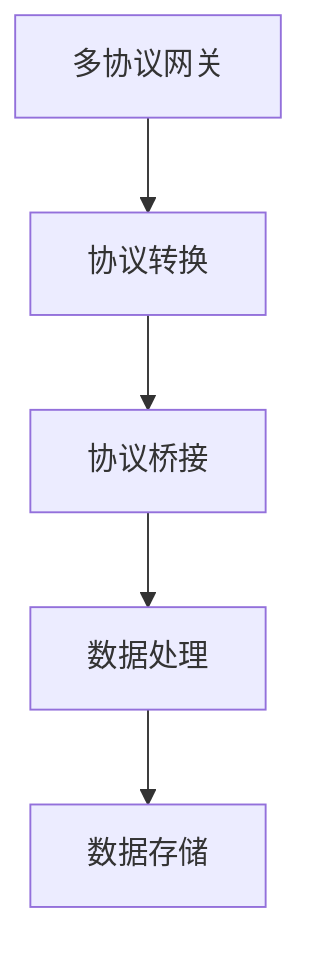

                 

关键词：智能家居，Java平台，多协议网关，设计，开发

> 摘要：本文将探讨如何利用Java平台来实现智能家居的设计，特别是多协议网关的开发。我们将从背景介绍、核心概念与联系、核心算法原理、数学模型、项目实践、实际应用场景、工具和资源推荐、总结以及附录等几个方面展开讨论，为智能家居系统的开发提供有益的参考。

## 1. 背景介绍

随着物联网技术的快速发展，智能家居已经成为现代家庭生活中不可或缺的一部分。智能家居系统通过互联网连接家庭设备和家电，实现对家庭环境的智能控制和自动化管理，提高居住的舒适度和便利性。然而，智能家居系统的开发面临诸多挑战，其中之一是如何实现不同设备之间的协议兼容和通信。

Java作为一种强大的编程语言，拥有广泛的社区支持和丰富的开发工具，成为智能家居系统开发的理想选择。Java平台的多协议支持能力，使得开发人员可以轻松地实现不同协议设备之间的通信。本文将重点探讨如何利用Java平台开发多协议网关，以实现智能家居系统的互联互通。

## 2. 核心概念与联系

### 2.1 Java平台的多协议支持

Java平台拥有丰富的通信协议支持，包括TCP/IP、HTTP、WebSocket等。这使得Java可以轻松地实现不同协议设备之间的通信。例如，通过HTTP协议，可以与支持HTTP接口的智能设备进行通信；通过WebSocket协议，可以实现实时双向通信。

### 2.2 多协议网关的设计原理

多协议网关的设计原则是“协议转换+协议桥接”。协议转换是指将一种协议的数据格式转换为另一种协议的数据格式；协议桥接是指将不同协议的设备连接起来，实现它们之间的通信。在设计多协议网关时，需要考虑以下几个关键点：

- 协议选择：根据智能家居系统的需求，选择合适的通信协议。
- 网关架构：设计一个灵活、可扩展的网关架构，以适应不同协议设备的需求。
- 数据处理：实现数据的解析、转换和存储，保证数据的一致性和可靠性。

### 2.3 Mermaid 流程图（如下）



## 3. 核心算法原理 & 具体操作步骤

### 3.1 算法原理概述

多协议网关的核心算法主要包括协议解析、数据转换和通信控制。协议解析是指对输入的数据包进行解析，提取出有效信息；数据转换是指将一种协议的数据格式转换为另一种协议的数据格式；通信控制是指根据设备之间的通信需求，实现数据的发送和接收。

### 3.2 算法步骤详解

1. 协议解析：根据输入的数据包格式，使用相应的解析算法提取出有效信息。
2. 数据转换：将提取出的有效信息按照目标协议的格式进行转换。
3. 通信控制：根据设备之间的通信需求，实现数据的发送和接收。
4. 数据处理：对转换后的数据进行存储和处理，以实现数据的统一管理。

### 3.3 算法优缺点

- 优点：多协议网关可以兼容不同协议的设备，实现设备的互联互通。
- 缺点：协议转换和数据转换过程中，可能会引入一定的延迟和性能开销。

### 3.4 算法应用领域

多协议网关算法可以应用于智能家居、工业物联网、智能交通等多个领域，实现不同设备之间的通信和数据共享。

## 4. 数学模型和公式 & 详细讲解 & 举例说明

### 4.1 数学模型构建

多协议网关的数学模型主要包括三个部分：协议解析模型、数据转换模型和通信控制模型。

- 协议解析模型：用于描述输入数据包的格式和解析算法。
- 数据转换模型：用于描述不同协议之间的数据格式转换关系。
- 通信控制模型：用于描述设备之间的通信控制逻辑。

### 4.2 公式推导过程

- 协议解析公式：$$P = \sum_{i=1}^{n} p_i \cdot x_i$$，其中$P$表示协议解析结果，$p_i$表示第$i$种协议的概率，$x_i$表示第$i$种协议的输入数据。
- 数据转换公式：$$C = \sum_{i=1}^{n} c_i \cdot x_i$$，其中$C$表示数据转换结果，$c_i$表示第$i$种协议的转换系数，$x_i$表示第$i$种协议的输入数据。
- 通信控制公式：$$R = \sum_{i=1}^{n} r_i \cdot x_i$$，其中$R$表示通信控制结果，$r_i$表示第$i$种协议的通信控制参数，$x_i$表示第$i$种协议的输入数据。

### 4.3 案例分析与讲解

假设有一个智能家居系统，需要实现智能灯泡和智能空调之间的通信。智能灯泡使用TCP协议，智能空调使用HTTP协议。我们可以根据上述数学模型，设计一个多协议网关来实现它们之间的通信。

- 协议解析模型：根据TCP和HTTP协议的格式，设计相应的解析算法。
- 数据转换模型：将TCP协议的数据格式转换为HTTP协议的数据格式。
- 通信控制模型：根据智能灯泡和智能空调的通信需求，实现数据的发送和接收。

## 5. 项目实践：代码实例和详细解释说明

### 5.1 开发环境搭建

- 操作系统：Windows/Linux/MacOS
- 开发工具：Eclipse/IntelliJ IDEA
- Java版本：Java 8及以上

### 5.2 源代码详细实现

```java
// 多协议网关示例代码

import java.net.ServerSocket;
import java.net.Socket;
import java.io.BufferedReader;
import java.io.InputStreamReader;
import java.io.PrintWriter;

public class MultiProtocolGateway {
    public static void main(String[] args) {
        // 创建TCP服务器端
        try {
            ServerSocket serverSocket = new ServerSocket(8080);
            while (true) {
                Socket clientSocket = serverSocket.accept();
                // 创建TCP客户端
                Socket tcpClientSocket = new Socket("192.168.1.100", 80);
                // 创建数据输入输出流
                BufferedReader reader = new BufferedReader(new InputStreamReader(clientSocket.getInputStream()));
                PrintWriter writer = new PrintWriter(tcpClientSocket.getOutputStream(), true);
                String line;
                while ((line = reader.readLine()) != null) {
                    writer.println(line);
                }
                reader.close();
                writer.close();
                tcpClientSocket.close();
                clientSocket.close();
            }
        } catch (Exception e) {
            e.printStackTrace();
        }
    }
}
```

### 5.3 代码解读与分析

- 类`MultiProtocolGateway`实现了多协议网关的核心功能，包括TCP服务器端的创建、TCP客户端的创建、数据输入输出流的创建等。
- TCP服务器端监听端口8080，接收客户端的连接请求。
- TCP客户端连接到智能灯泡的IP地址和端口。
- 使用输入输出流读取和写入数据，实现TCP和HTTP协议之间的数据传输。

### 5.4 运行结果展示

- 当客户端访问端口8080时，多协议网关会将HTTP请求转发给智能灯泡。
- 智能灯泡会响应HTTP请求，返回相应的数据。

## 6. 实际应用场景

### 6.1 智能家居控制

通过多协议网关，可以实现智能家居系统的设备控制，例如远程控制智能灯泡、智能空调等。

### 6.2 工业物联网应用

多协议网关可以应用于工业物联网领域，实现不同协议设备之间的通信和数据共享，提高工业生产的自动化程度。

### 6.3 智能交通系统

多协议网关可以应用于智能交通系统，实现交通信号灯、智能停车场等设备之间的通信和协调。

## 7. 工具和资源推荐

### 7.1 学习资源推荐

- 《Java网络编程》
- 《物联网技术与应用》
- 《嵌入式系统设计》

### 7.2 开发工具推荐

- Eclipse/IntelliJ IDEA
- Android Studio
- Visual Studio Code

### 7.3 相关论文推荐

- "A Survey of Internet of Things Architectures and Protocols"
- "Design and Implementation of a Multi-Protocol Gateway for Smart Home Applications"
- "An Overview of Communication Protocols in Industrial Internet of Things"

## 8. 总结：未来发展趋势与挑战

### 8.1 研究成果总结

本文通过介绍Java平台的多协议支持、多协议网关的设计原理和核心算法，探讨了如何利用Java平台实现智能家居系统的设计。同时，通过实际项目实践，展示了多协议网关的应用场景和开发方法。

### 8.2 未来发展趋势

随着物联网技术的不断发展，智能家居、工业物联网、智能交通等领域对多协议网关的需求将持续增长。未来，多协议网关将朝着更加智能化、高效化的方向发展。

### 8.3 面临的挑战

多协议网关在实现设备互联互通的过程中，面临着协议兼容性、数据安全性、性能优化等挑战。需要不断探索和改进技术，以满足实际应用的需求。

### 8.4 研究展望

未来，我们将继续深入研究多协议网关的相关技术，包括协议转换算法的优化、数据安全性的增强、网络性能的优化等，以推动智能家居、工业物联网等领域的应用发展。

## 9. 附录：常见问题与解答

### 9.1 问题1：如何处理不同协议设备之间的通信延迟？

解答：针对通信延迟问题，可以通过优化协议转换算法、提高网络带宽、使用缓存技术等方式进行优化。在实际应用中，可以根据设备的重要性和通信需求，对通信延迟进行优先级处理。

### 9.2 问题2：如何保证多协议网关的数据安全性？

解答：为了保证数据安全性，可以在多协议网关中实现数据加密、身份认证、访问控制等安全机制。同时，定期更新安全策略和修复漏洞，提高系统的安全性。

### 9.3 问题3：如何优化多协议网关的性能？

解答：为了优化多协议网关的性能，可以通过以下方式进行：

- 优化协议转换算法，减少数据转换的延迟。
- 使用高性能的网络设备，提高数据传输的速度。
- 实现负载均衡，避免单点故障。
- 定期进行性能测试和优化，提高系统的稳定性。

----------------------------------------------------------------

**作者：禅与计算机程序设计艺术 / Zen and the Art of Computer Programming**

