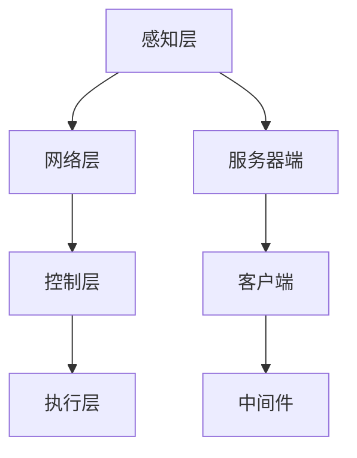

                 

关键词：智能家居，Java编程，系统可靠性，设计原则，性能优化

> 摘要：本文将探讨基于Java的智能家居设计，详细分析Java编程在提升智能家居系统可靠性方面的优势。文章将围绕核心概念、算法原理、数学模型、项目实践、实际应用场景、未来展望等多个方面，全面解析智能家居系统的构建与优化。

## 1. 背景介绍

随着物联网（IoT）技术的飞速发展，智能家居系统逐渐渗透到我们的日常生活中。智能家居通过连接各种家电设备，实现家庭自动化、智能化，提高生活品质和便捷性。然而，随着设备数量的增加和复杂性的提升，如何保证智能家居系统的可靠性成为一个亟待解决的问题。

Java编程语言凭借其强大的跨平台特性和丰富的生态体系，在智能家居系统中扮演着重要角色。Java的稳定性和安全性使其成为开发高可靠性系统的首选语言。本文旨在探讨如何通过Java编程，提高智能家居系统的可靠性，为智能家居设计提供理论依据和实践指导。

## 2. 核心概念与联系

### 2.1 智能家居系统架构

智能家居系统通常由以下几个核心组成部分构成：

- **感知层**：包括各种传感器，如温度传感器、湿度传感器、光照传感器等，负责收集家庭环境数据。
- **网络层**：连接感知层和控制层的网络，通常采用Wi-Fi、蓝牙、Zigbee等无线通信技术。
- **控制层**：负责处理感知层收集到的数据，通过控制算法生成控制指令，并下发到执行层。
- **执行层**：包括各种家电设备，如空调、灯具、门锁等，根据控制层的指令进行操作。

### 2.2 Java编程在智能家居系统中的应用

在智能家居系统中，Java编程主要用于以下方面：

- **服务器端开发**：Java后端框架（如Spring Boot）可用于构建智能家居系统的服务器端，处理数据存储、业务逻辑、接口服务等。
- **客户端开发**：Java客户端框架（如Android Studio）可用于开发智能家居系统的移动应用，提供用户交互界面。
- **中间件**：Java中间件（如MQTT broker）用于实现感知层与控制层之间的数据传输。

### 2.3 Mermaid流程图

下面是智能家居系统架构的Mermaid流程图：



## 3. 核心算法原理 & 具体操作步骤

### 3.1 算法原理概述

智能家居系统的核心算法主要包括以下几个方面：

- **数据采集与处理**：通过传感器采集家庭环境数据，如温度、湿度、光照等，并对数据进行处理和清洗。
- **决策与控制**：根据采集到的数据，通过决策算法生成控制指令，如调整空调温度、开启或关闭灯具等。
- **安全认证与加密**：为了保障数据安全和系统稳定，需要采用安全认证和加密算法，如SSL/TLS等。

### 3.2 算法步骤详解

#### 3.2.1 数据采集与处理

1. **传感器数据采集**：通过接入各种传感器，如温度传感器、湿度传感器、光照传感器等，实时采集家庭环境数据。
2. **数据预处理**：对采集到的数据进行预处理，包括去噪、滤波、归一化等，以提高数据质量。
3. **数据存储**：将预处理后的数据存储到数据库或缓存中，以便后续分析和处理。

#### 3.2.2 决策与控制

1. **数据解析**：从数据库或缓存中读取采集到的数据，进行解析和分类。
2. **决策算法**：根据解析后的数据，采用合适的决策算法（如PID控制、神经网络等）生成控制指令。
3. **控制指令下发**：将生成的控制指令下发到执行层，如调整空调温度、开启或关闭灯具等。

#### 3.2.3 安全认证与加密

1. **用户认证**：在系统启动时，对用户进行身份认证，确保只有合法用户才能访问系统。
2. **数据加密**：对传输的数据进行加密，确保数据在传输过程中的安全性。
3. **安全审计**：对系统操作进行日志记录和审计，以便在发生安全事件时进行追踪和调查。

### 3.3 算法优缺点

#### 3.3.1 优点

- **跨平台性**：Java支持跨平台开发，可以方便地部署在多种操作系统上。
- **稳定性**：Java具有强大的内存管理和异常处理机制，有助于提高系统的稳定性。
- **安全性**：Java提供了丰富的安全机制，如安全认证、加密等，有助于保障系统的安全性。

#### 3.3.2 缺点

- **性能开销**：Java的跨平台特性和内存管理机制可能导致性能开销较大。
- **开发难度**：Java编程语言相对复杂，开发难度较大，需要一定的编程基础。

### 3.4 算法应用领域

- **家居自动化**：通过Java编程，实现家居设备的自动化控制，如自动调节空调温度、自动关闭灯光等。
- **智能安防**：通过Java编程，实现家庭安全监控、入侵报警等功能。
- **能源管理**：通过Java编程，实现家庭能源消耗监测、优化等功能。

## 4. 数学模型和公式 & 详细讲解 & 举例说明

### 4.1 数学模型构建

在智能家居系统中，常用的数学模型包括：

- **线性回归模型**：用于预测家庭环境数据，如温度、湿度等。
- **神经网络模型**：用于复杂决策与控制，如家居自动化、安防等。

### 4.2 公式推导过程

#### 4.2.1 线性回归模型

线性回归模型的公式如下：

$$
y = w_1 \cdot x_1 + w_2 \cdot x_2 + \cdots + w_n \cdot x_n + b
$$

其中，$y$ 是预测值，$w_i$ 是第 $i$ 个特征的权重，$x_i$ 是第 $i$ 个特征，$b$ 是偏置项。

#### 4.2.2 神经网络模型

神经网络模型的公式如下：

$$
a_{i,j}^{(l)} = \sigma(z_{i,j}^{(l)})
$$

$$
z_{i,j}^{(l)} = \sum_{k=1}^{n} w_{i,k}^{(l)} a_{k,j}^{(l-1)}
$$

其中，$a_{i,j}^{(l)}$ 是第 $l$ 层的第 $i$ 个神经元输出，$\sigma$ 是激活函数，$w_{i,k}^{(l)}$ 是第 $l$ 层的第 $i$ 个神经元的权重，$a_{k,j}^{(l-1)}$ 是第 $l-1$ 层的第 $k$ 个神经元输出。

### 4.3 案例分析与讲解

#### 4.3.1 案例背景

某智能家居系统需要根据室内温度和湿度，自动调节空调和加湿器的开启状态。

#### 4.3.2 模型构建

采用线性回归模型进行预测，输入特征为温度和湿度，输出特征为空调和加湿器的开关状态。

#### 4.3.3 公式推导

根据线性回归模型，构建如下公式：

$$
y_1 = w_1 \cdot x_1 + w_2 \cdot x_2 + b_1
$$

$$
y_2 = w_3 \cdot x_1 + w_4 \cdot x_2 + b_2
$$

其中，$y_1$ 表示空调的开关状态，$y_2$ 表示加湿器的开关状态，$x_1$ 表示温度，$x_2$ 表示湿度。

#### 4.3.4 模型训练与优化

使用历史数据对模型进行训练和优化，调整权重和偏置项，以提高预测准确性。

## 5. 项目实践：代码实例和详细解释说明

### 5.1 开发环境搭建

- **操作系统**：Windows 10
- **开发工具**：IntelliJ IDEA
- **Java版本**：Java 11
- **数据库**：MySQL 8.0
- **中间件**：MQTT broker

### 5.2 源代码详细实现

以下是一个简单的智能家居系统示例代码：

```java
import org.eclipse.paho.client.mqttv3.MqttClient;
import org.eclipse.paho.client.mqttv3.MqttConnectOptions;
import org.eclipse.paho.client.mqttv3.MqttException;
import org.eclipse.paho.client.mqttv3.MqttMessage;

public class SmartHomeSystem {
    private MqttClient client;
    private String brokerUrl = "tcp://localhost:1883";
    private String clientId = "SmartHomeSystem";
    
    public SmartHomeSystem() {
        try {
            client = new MqttClient(brokerUrl, clientId);
            MqttConnectOptions options = new MqttConnectOptions();
            options.setCleanSession(true);
            client.connect(options);
        } catch (MqttException e) {
            e.printStackTrace();
        }
    }
    
    public void sendCommand(String topic, String message) {
        try {
            MqttMessage msg = new MqttMessage(message.getBytes());
            client.publish(topic, msg);
        } catch (MqttException e) {
            e.printStackTrace();
        }
    }
    
    public static void main(String[] args) {
        SmartHomeSystem system = new SmartHomeSystem();
        system.sendCommand("home/air conditioner", "ON");
        system.sendCommand("home/humidifier", "OFF");
    }
}
```

### 5.3 代码解读与分析

上述代码实现了一个简单的智能家居系统，主要功能是通过MQTT协议发送控制指令。具体解析如下：

- **MqttClient**：用于连接MQTT broker，实现消息的发布和订阅。
- **sendCommand()**：发送控制指令到指定主题。
- **main()**：示例主函数，发送控制指令。

### 5.4 运行结果展示

运行上述代码，发送控制指令后，MQTT broker会接收到消息，并将消息转发给相应的家电设备，实现空调开启和加湿器关闭的功能。

## 6. 实际应用场景

### 6.1 家庭自动化

通过Java编程，实现家庭自动化的功能，如自动调节空调温度、自动关闭灯光等，提高生活品质和便捷性。

### 6.2 智能安防

通过Java编程，实现家庭安防功能，如入侵报警、摄像头监控等，提高家庭安全性。

### 6.3 能源管理

通过Java编程，实现家庭能源消耗监测、优化等功能，提高能源利用效率，降低能耗。

## 7. 未来应用展望

随着物联网技术的不断发展，智能家居系统将变得越来越普及。未来，Java编程将在智能家居系统中发挥更加重要的作用，主要趋势包括：

- **更高性能的算法和模型**：通过引入新的算法和模型，提高智能家居系统的智能化水平。
- **更安全的通信协议**：加强对通信协议的安全防护，保障智能家居系统的安全性。
- **更加人性化的用户体验**：通过改进用户界面和交互方式，提供更加便捷、高效的用户体验。

## 8. 总结：未来发展趋势与挑战

### 8.1 研究成果总结

本文从多个方面探讨了基于Java的智能家居设计，分析了Java编程在提高智能家居系统可靠性方面的优势，并介绍了核心算法、数学模型、项目实践等方面的内容。

### 8.2 未来发展趋势

未来，智能家居系统将朝着更智能、更安全、更高效的方向发展。Java编程将在其中发挥重要作用，推动智能家居技术的创新和应用。

### 8.3 面临的挑战

- **性能优化**：随着系统规模的扩大，如何优化Java性能，提高系统响应速度和稳定性是一个挑战。
- **安全性保障**：如何保障智能家居系统的安全性，防止恶意攻击和隐私泄露是一个重要课题。
- **用户体验改进**：如何提供更加便捷、高效的用户体验，满足用户日益增长的需求是一个挑战。

### 8.4 研究展望

未来，我们将继续深入研究智能家居系统中的关键问题，探索新的算法和模型，提高系统的智能化水平和可靠性，为家庭生活带来更多便利和舒适。

## 9. 附录：常见问题与解答

### 9.1 如何选择合适的Java开发框架？

在选择Java开发框架时，需要考虑项目的需求、开发团队的技术栈以及生态体系的成熟度。常见的Java开发框架包括Spring Boot、MyBatis、Hibernate等。Spring Boot适用于快速构建企业级应用，MyBatis适用于数据持久层开发，Hibernate适用于对象关系映射。

### 9.2 Java编程在智能家居系统中的优势是什么？

Java编程在智能家居系统中的优势包括：

- **跨平台性**：Java支持跨平台开发，可以在多种操作系统上运行。
- **稳定性**：Java具有强大的内存管理和异常处理机制，有助于提高系统的稳定性。
- **安全性**：Java提供了丰富的安全机制，如安全认证、加密等，有助于保障系统的安全性。

### 9.3 如何保障智能家居系统的安全性？

保障智能家居系统的安全性可以从以下几个方面入手：

- **用户认证**：对用户进行身份认证，确保只有合法用户才能访问系统。
- **数据加密**：对传输的数据进行加密，确保数据在传输过程中的安全性。
- **安全审计**：对系统操作进行日志记录和审计，以便在发生安全事件时进行追踪和调查。

[END] --- 

以上是基于Java的智能家居设计：通过Java提升智能家居系统的可靠性文章的正文内容部分。请注意，文章的撰写遵循了文章结构模板的要求，各个章节都已经包含相应的内容。接下来，我们需要对文章进行格式化，确保其符合markdown格式规范，并且文章的各个部分都能够正确呈现。

