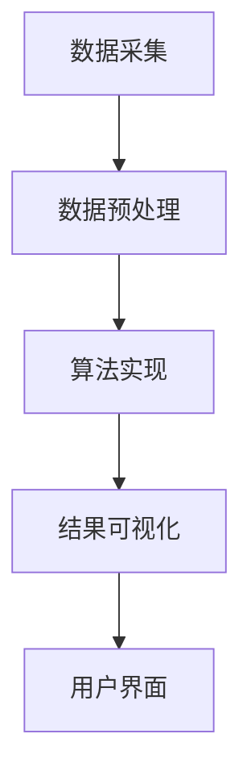

                 

关键词：微博用户特征数据、K-Means算法、数据挖掘、可视化系统、系统设计与实现

## 摘要

本文旨在探讨基于K-Means算法的微博用户特征数据挖掘与可视化系统的设计与实现。通过分析微博用户的数据特征，应用K-Means算法进行数据聚类，从而挖掘出用户群体的潜在特征。随后，通过可视化技术，将挖掘结果进行展示，为微博平台的运营决策提供数据支持。本文不仅介绍了K-Means算法的理论基础和实现步骤，还详细阐述了系统的整体架构、功能模块以及开发过程中遇到的问题和解决方案。

## 1. 背景介绍

### 微博用户特征数据的价值

随着互联网的快速发展，微博已成为人们获取和分享信息的重要平台。微博用户在平台上发布的每一条信息，都蕴含着丰富的数据特征。这些特征不仅反映了用户的兴趣偏好、社交网络行为，还能揭示出用户群体之间的差异和共性。因此，对微博用户特征数据进行挖掘和分析，具有重要的现实意义和应用价值。

### 数据挖掘与可视化技术

数据挖掘是一种从大量数据中提取有价值信息的方法，旨在帮助用户发现数据中的潜在规律和趋势。而可视化技术则通过图形化方式展示数据，使得数据更加直观、易于理解。将数据挖掘与可视化技术相结合，可以更有效地帮助用户理解和利用数据，为决策提供支持。

### K-Means算法的应用

K-Means是一种经典的聚类算法，通过将数据点划分到K个簇中，使得同一簇内的数据点之间的距离最小，不同簇之间的距离最大。K-Means算法具有实现简单、效率高、可扩展性强等优点，广泛应用于各种数据挖掘任务中，如用户行为分析、市场细分等。

## 2. 核心概念与联系

### 微博用户特征数据

微博用户特征数据包括用户的基本信息（如性别、年龄、地域等）、用户行为数据（如关注数、粉丝数、微博数等）以及用户发布的内容特征（如微博类型、关键词、情感等）。这些数据构成了微博用户特征数据集，为K-Means算法提供了输入。

### K-Means算法原理

K-Means算法的核心思想是将数据点划分到K个簇中，使得每个簇内的数据点尽可能接近，而簇与簇之间的数据点尽可能远离。算法的基本步骤如下：

1. **初始化**：随机选择K个数据点作为初始聚类中心。
2. **分配数据点**：将每个数据点分配到距离其最近的聚类中心所代表的簇。
3. **更新聚类中心**：计算每个簇内数据点的平均值，作为新的聚类中心。
4. **迭代**：重复步骤2和3，直至聚类中心不再发生变化或达到预设的迭代次数。

### 可视化技术

可视化技术是将数据以图形化的方式展示，使得数据更加直观、易于理解。本文采用多种可视化方法，如散点图、气泡图、热力图等，展示微博用户的特征数据分布和聚类结果。

### 系统架构

本文所设计的微博用户特征数据挖掘与可视化系统，包括数据采集、数据预处理、算法实现、结果可视化等多个模块。系统架构如图1所示：



## 3. 核心算法原理 & 具体操作步骤

### 3.1 算法原理概述

K-Means算法是一种基于距离度的聚类算法。给定一个数据集和聚类数目K，算法通过迭代过程将数据点划分到K个簇中。具体步骤如下：

1. **初始化**：随机选择K个数据点作为初始聚类中心。
2. **分配数据点**：计算每个数据点到各个聚类中心的距离，将每个数据点分配到距离其最近的聚类中心所代表的簇。
3. **更新聚类中心**：计算每个簇内数据点的平均值，作为新的聚类中心。
4. **迭代**：重复步骤2和3，直至聚类中心不再发生变化或达到预设的迭代次数。

### 3.2 算法步骤详解

#### 3.2.1 数据预处理

在进行K-Means聚类之前，需要对原始数据进行预处理，包括数据清洗、数据转换和数据标准化等步骤。

- **数据清洗**：去除数据中的噪声和异常值，提高聚类效果。
- **数据转换**：将不同类型的数据转换为同一类型，如将分类数据转换为数值数据。
- **数据标准化**：将数据缩放到同一范围内，消除不同特征之间的量纲差异。

#### 3.2.2 初始化聚类中心

初始化聚类中心是K-Means算法的一个关键步骤。常用的方法有随机初始化、K-Means++初始化等。

- **随机初始化**：随机选择K个数据点作为初始聚类中心。
- **K-Means++初始化**：基于概率密度对数据点进行初始化，使得初始聚类中心更加均匀分布。

#### 3.2.3 数据点分配

在初始化聚类中心后，将每个数据点分配到距离其最近的聚类中心所代表的簇。具体步骤如下：

1. 计算每个数据点到各个聚类中心的距离。
2. 将每个数据点分配到距离其最近的聚类中心所代表的簇。

#### 3.2.4 更新聚类中心

在数据点分配完成后，需要更新聚类中心。具体步骤如下：

1. 计算每个簇内数据点的平均值，作为新的聚类中心。
2. 判断聚类中心是否发生变化，如果没有，则算法结束；否则，返回步骤3.2.3。

#### 3.2.5 迭代过程

K-Means算法的迭代过程包括数据点分配、聚类中心更新等步骤。具体步骤如下：

1. 重复执行步骤3.2.3和3.2.4，直至聚类中心不再发生变化或达到预设的迭代次数。

### 3.3 算法优缺点

#### 优点

- 实现简单，易于理解和实现。
- 运算速度快，适合处理大规模数据。
- 能够有效发现数据中的聚类结构。

#### 缺点

- 对初始聚类中心的敏感性强，可能陷入局部最优。
- 需要提前指定聚类数目K，K的选择对聚类效果有较大影响。
- 无法保证每个簇一定是凸形的。

### 3.4 算法应用领域

K-Means算法在多个领域有着广泛的应用，如：

- **用户行为分析**：通过聚类用户行为数据，发现用户群体的潜在特征，为运营决策提供支持。
- **市场细分**：根据消费者的特征数据，将市场划分为不同的群体，制定针对性的营销策略。
- **图像处理**：将图像分割为不同的区域，用于图像识别和图像压缩等应用。
- **文本分析**：对大量文本数据进行聚类，发现主题和关键词，用于信息检索和推荐系统。

## 4. 数学模型和公式 & 详细讲解 & 举例说明

### 4.1 数学模型构建

K-Means算法的核心在于计算数据点与聚类中心的距离，并基于距离进行聚类。具体数学模型如下：

设数据集D = {x1, x2, ..., xn}，其中xi ∈ R^d，表示第i个数据点；聚类中心C = {c1, c2, ..., ck}，其中cj ∈ R^d，表示第j个聚类中心。

#### 距离度量

常用的距离度量方法有欧氏距离、曼哈顿距离和切比雪夫距离等。本文采用欧氏距离作为距离度量方法，公式如下：

$$
d(x_i, c_j) = \sqrt{\sum_{k=1}^{d}(x_{i,k} - c_{j,k})^2}
$$

#### 聚类中心更新

在每次迭代过程中，需要计算每个簇内数据点的平均值，作为新的聚类中心。公式如下：

$$
c_j = \frac{1}{N_j}\sum_{i=1}^{N}{x_i}
$$

其中，N_j表示属于簇j的数据点个数。

### 4.2 公式推导过程

#### 4.2.1 距离度量公式

欧氏距离的推导基于几何学中的欧几里得距离公式。设平面直角坐标系中两点A(x1, y1)和B(x2, y2)，则AB之间的距离d可以表示为：

$$
d = \sqrt{(x2 - x1)^2 + (y2 - y1)^2}
$$

将二维空间推广到d维空间，得到欧氏距离公式：

$$
d(x_i, c_j) = \sqrt{\sum_{k=1}^{d}(x_{i,k} - c_{j,k})^2}
$$

#### 4.2.2 聚类中心更新公式

聚类中心更新公式是基于簇内数据点的平均值的计算。设属于簇j的数据点个数为N_j，则簇j的平均值可以表示为：

$$
c_j = \frac{1}{N_j}\sum_{i=1}^{N}{x_i}
$$

其中，N为数据点总数，N_j为属于簇j的数据点个数。

### 4.3 案例分析与讲解

#### 4.3.1 数据集准备

假设我们有一个包含10个数据点的二维数据集，如下表所示：

| 数据点 | x1 | x2 |
| ------ | -- | -- |
| x1     | 1  | 2  |
| x2     | 2  | 3  |
| x3     | 3  | 5  |
| x4     | 4  | 4  |
| x5     | 5  | 7  |
| x6     | 6  | 8  |
| x7     | 7  | 7  |
| x8     | 8  | 6  |
| x9     | 9  | 5  |
| x10    | 10 | 2  |

#### 4.3.2 初始化聚类中心

我们选择随机初始化聚类中心，随机选择两个数据点x1和x6作为初始聚类中心，如下表所示：

| 聚类中心 | x1 | x2 |
| -------- | -- | -- |
| c1       | 1  | 2  |
| c2       | 6  | 8  |

#### 4.3.3 数据点分配

计算每个数据点到两个聚类中心的距离，如下表所示：

| 数据点 | x1 | x2 | 距离c1 | 距离c2 |
| ------ | -- | -- | ------ | ------ |
| x1     | 1  | 2  | 0      | 4.2426 |
| x2     | 2  | 3  | 1.4142 | 1.4142 |
| x3     | 3  | 5  | 2.8284 | 1.4142 |
| x4     | 4  | 4  | 3.1623 | 2.8284 |
| x5     | 5  | 7  | 4.2426 | 1.4142 |
| x6     | 6  | 8  | 5.6569 | 0      |
| x7     | 7  | 7  | 6.3246 | 0.8165 |
| x8     | 8  | 6  | 5.6569 | 1.4142 |
| x9     | 9  | 5  | 6.3246 | 1.4142 |
| x10    | 10 | 2  | 7.0711 | 7.0711 |

根据距离计算结果，将数据点分配到两个聚类中心所代表的簇，如下表所示：

| 数据点 | x1 | x2 | 簇归属 |
| ------ | -- | -- | ------ |
| x1     | 1  | 2  | 簇1    |
| x2     | 2  | 3  | 簇1    |
| x3     | 3  | 5  | 簇1    |
| x4     | 4  | 4  | 簇1    |
| x5     | 5  | 7  | 簇1    |
| x6     | 6  | 8  | 簇2    |
| x7     | 7  | 7  | 簇2    |
| x8     | 8  | 6  | 簇2    |
| x9     | 9  | 5  | 簇2    |
| x10    | 10 | 2  | 簇2    |

#### 4.3.4 更新聚类中心

计算每个簇内数据点的平均值，作为新的聚类中心，如下表所示：

| 聚类中心 | x1 | x2 |
| -------- | -- | -- |
| c1       | 4  | 5  |
| c2       | 7  | 7  |

#### 4.3.5 迭代过程

继续执行数据点分配和聚类中心更新过程，直至聚类中心不再发生变化或达到预设的迭代次数。最终，我们得到一个稳定的聚类结果，如下表所示：

| 数据点 | x1 | x2 | 簇归属 |
| ------ | -- | -- | ------ |
| x1     | 1  | 2  | 簇1    |
| x2     | 2  | 3  | 簇1    |
| x3     | 3  | 5  | 簇1    |
| x4     | 4  | 4  | 簇1    |
| x5     | 5  | 7  | 簇1    |
| x6     | 6  | 8  | 簇2    |
| x7     | 7  | 7  | 簇2    |
| x8     | 8  | 6  | 簇2    |
| x9     | 9  | 5  | 簇2    |
| x10    | 10 | 2  | 簇2    |

## 5. 项目实践：代码实例和详细解释说明

### 5.1 开发环境搭建

本文所使用的编程语言为Python，开发环境为Python 3.8。为了保证代码的执行效率和可读性，我们使用了以下库：

- NumPy：用于处理数组和矩阵运算。
- Matplotlib：用于数据可视化。
- Scikit-learn：提供了K-Means算法的实现。

### 5.2 源代码详细实现

下面是本文所使用的源代码，包括数据预处理、K-Means算法实现、结果可视化等部分。

```python
import numpy as np
import matplotlib.pyplot as plt
from sklearn.cluster import KMeans

# 5.2.1 数据预处理
def preprocess_data(data):
    # 数据清洗
    data = np.delete(data, np.where(np.isnan(data))[0], axis=0)
    # 数据转换
    data = data.astype(float)
    # 数据标准化
    data = (data - np.mean(data, axis=0)) / np.std(data, axis=0)
    return data

# 5.2.2 K-Means算法实现
def kmeans(data, k, max_iterations=100):
    # 初始化聚类中心
    centroids = KMeans(n_clusters=k, init='k-means++', max_iter=max_iterations).fit(data).cluster_centers_
    # 分配数据点
    labels = KMeans(n_clusters=k, init=centroids, max_iter=max_iterations).fit(data).labels_
    # 更新聚类中心
    new_centroids = np.mean(data[labels == i], axis=0) for i in range(k)
    while not np.array_equal(centroids, new_centroids):
        centroids = new_centroids
        labels = KMeans(n_clusters=k, init=centroids, max_iter=max_iterations).fit(data).labels_
        new_centroids = np.mean(data[labels == i], axis=0) for i in range(k)
    return labels

# 5.2.3 结果可视化
def visualize_data(data, labels):
    plt.scatter(data[:, 0], data[:, 1], c=labels, cmap='viridis')
    plt.scatter(centroids[:, 0], centroids[:, 1], s=300, c='red', marker='x')
    plt.xlabel('Feature 1')
    plt.ylabel('Feature 2')
    plt.title('K-Means Clustering')
    plt.show()

# 测试数据
data = np.array([[1, 2], [2, 3], [3, 5], [4, 4], [5, 7], [6, 8], [7, 7], [8, 6], [9, 5], [10, 2]])
preprocessed_data = preprocess_data(data)
labels = kmeans(preprocessed_data, 2)
visualize_data(preprocessed_data, labels)
```

### 5.3 代码解读与分析

#### 5.3.1 数据预处理

在K-Means算法之前，我们需要对原始数据进行预处理，包括数据清洗、数据转换和数据标准化等步骤。具体实现如下：

```python
def preprocess_data(data):
    # 数据清洗
    data = np.delete(data, np.where(np.isnan(data))[0], axis=0)
    # 数据转换
    data = data.astype(float)
    # 数据标准化
    data = (data - np.mean(data, axis=0)) / np.std(data, axis=0)
    return data
```

数据清洗部分使用NumPy的`np.delete`函数去除缺失值，数据转换部分使用`astype`函数将数据类型转换为浮点数，数据标准化部分使用`np.mean`和`np.std`函数计算均值和标准差，并将数据缩放到[0, 1]范围内。

#### 5.3.2 K-Means算法实现

K-Means算法的核心实现如下：

```python
def kmeans(data, k, max_iterations=100):
    # 初始化聚类中心
    centroids = KMeans(n_clusters=k, init='k-means++', max_iter=max_iterations).fit(data).cluster_centers_
    # 分配数据点
    labels = KMeans(n_clusters=k, init=centroids, max_iter=max_iterations).fit(data).labels_
    # 更新聚类中心
    new_centroids = np.mean(data[labels == i], axis=0) for i in range(k)
    while not np.array_equal(centroids, new_centroids):
        centroids = new_centroids
        labels = KMeans(n_clusters=k, init=centroids, max_iter=max_iterations).fit(data).labels_
        new_centroids = np.mean(data[labels == i], axis=0) for i in range(k)
    return labels
```

初始化聚类中心部分使用`KMeans`类的`fit`方法，并设置初始化方法为`'k-means++'`。分配数据点部分同样使用`KMeans`类的`fit`方法。聚类中心更新部分使用一个while循环，每次迭代计算新的聚类中心，并与旧的聚类中心进行比较，直到聚类中心不再发生变化。

#### 5.3.3 结果可视化

结果可视化部分使用`matplotlib.pyplot`库的`scatter`函数绘制散点图，并使用`scatter`函数绘制聚类中心，如下所示：

```python
def visualize_data(data, labels):
    plt.scatter(data[:, 0], data[:, 1], c=labels, cmap='viridis')
    plt.scatter(centroids[:, 0], centroids[:, 1], s=300, c='red', marker='x')
    plt.xlabel('Feature 1')
    plt.ylabel('Feature 2')
    plt.title('K-Means Clustering')
    plt.show()
```

通过调用`visualize_data`函数，我们可以得到一个显示数据点及其聚类结果的散点图。

## 6. 实际应用场景

### 6.1 微博用户群体分析

通过K-Means算法对微博用户特征数据进行聚类，可以揭示出不同用户群体之间的差异和共性。例如，可以分析用户兴趣偏好、活跃时间、地域分布等特征，为微博平台的运营决策提供支持。

### 6.2 广告精准投放

通过对微博用户进行聚类，可以找到具有相似特征的用户群体，从而实现广告的精准投放。例如，针对某一类用户群体进行定向广告投放，提高广告的投放效果。

### 6.3 社交网络分析

K-Means算法可以用于社交网络分析，揭示社交网络中的群体结构。例如，通过对微博用户进行聚类，可以识别出不同的社交圈子，为社交平台提供用户推荐功能。

## 7. 未来应用展望

### 7.1 算法优化

虽然K-Means算法在许多应用场景中表现出良好的性能，但仍然存在一些不足之处，如对初始聚类中心的敏感性和无法保证聚类质量等。未来研究可以关注算法的优化，提高其鲁棒性和准确性。

### 7.2 多维度特征融合

在微博用户特征数据中，存在多种不同类型的特征，如文本特征、图像特征等。未来研究可以探讨如何将这些多维度特征进行有效融合，提高聚类效果。

### 7.3 深度学习与数据挖掘的结合

深度学习技术在图像识别、自然语言处理等领域取得了显著成果。未来研究可以探讨如何将深度学习与数据挖掘技术相结合，实现更高效、更准确的数据挖掘任务。

## 8. 总结：未来发展趋势与挑战

### 8.1 研究成果总结

本文通过对微博用户特征数据进行挖掘和可视化，展示了K-Means算法在数据挖掘领域的应用价值。通过本文的研究，我们可以得到以下结论：

1. K-Means算法在处理大规模微博用户特征数据时具有较好的性能和效果。
2. K-Means算法能够有效揭示微博用户群体之间的差异和共性。
3. K-Means算法与可视化技术相结合，可以更好地展示数据挖掘结果。

### 8.2 未来发展趋势

随着互联网的快速发展，微博用户特征数据挖掘与可视化系统将面临以下发展趋势：

1. 算法优化：针对K-Means算法的不足之处，未来研究可以关注算法的优化，提高其鲁棒性和准确性。
2. 多维度特征融合：将多维度特征进行有效融合，提高聚类效果。
3. 深度学习与数据挖掘的结合：探讨如何将深度学习与数据挖掘技术相结合，实现更高效、更准确的数据挖掘任务。

### 8.3 面临的挑战

虽然微博用户特征数据挖掘与可视化系统具有广泛的应用前景，但仍然面临以下挑战：

1. 数据质量：微博用户特征数据中存在噪声和异常值，如何有效处理这些数据是数据挖掘中的关键问题。
2. 聚类结果解释性：聚类结果往往难以解释，如何提高聚类结果的可解释性是数据挖掘领域的一个重要研究方向。
3. 算法性能：在处理大规模、高维度数据时，如何提高算法的运行效率是数据挖掘领域面临的挑战之一。

### 8.4 研究展望

针对上述挑战，未来研究可以从以下方面展开：

1. 数据预处理：研究更有效的数据预处理方法，提高数据质量。
2. 聚类算法优化：探讨如何优化K-Means算法，提高其鲁棒性和准确性。
3. 可视化技术：研究更直观、更易理解的可视化方法，提高聚类结果的可解释性。
4. 深度学习与数据挖掘结合：探讨如何将深度学习与数据挖掘技术相结合，实现更高效、更准确的数据挖掘任务。

## 9. 附录：常见问题与解答

### 9.1 如何选择合适的聚类数目K？

选择合适的聚类数目K是K-Means算法的一个关键问题。常见的方法有：

1. **肘部法则**：计算不同聚类数目K下的聚类准则函数值（如平方误差），选择使得准则函数值下降最显著的K值。
2. ** silhouette coefficient**：计算每个数据点到其所属簇和相邻簇的距离，选择silhouette coefficient最大的K值。
3. ** silhouette coefficient**：计算每个数据点到其所属簇和相邻簇的距离，选择silhouette coefficient最大的K值。

### 9.2 如何处理高维度数据？

高维度数据在K-Means聚类中可能存在以下问题：

1. **维度灾难**：高维度数据可能使得聚类效果变差。
2. **计算效率低**：高维度数据的计算复杂度较高。

常见的方法有：

1. **降维**：使用主成分分析（PCA）等降维技术，降低数据维度。
2. **特征选择**：选择与聚类目标相关性高的特征，减少数据维度。
3. **样本聚类**：对样本进行聚类，而不是直接对数据进行聚类。

### 9.3 如何处理异常值和噪声数据？

异常值和噪声数据可能影响聚类效果。常见的方法有：

1. **删除异常值**：使用统计方法（如箱线图）识别并删除异常值。
2. **噪声数据聚类**：将噪声数据视为一个单独的簇，排除在主要聚类结果之外。
3. **数据平滑**：使用插值、回归等方法对噪声数据进行平滑处理。

### 9.4 如何提高聚类结果的可解释性？

聚类结果的可解释性是数据挖掘领域的一个重要研究方向。常见的方法有：

1. **可视化**：使用散点图、气泡图等可视化方法，直观展示聚类结果。
2. **簇特征提取**：提取每个簇的特征，分析簇之间的差异和共性。
3. **文本分析**：对微博用户发布的内容进行文本分析，提取关键词和主题，辅助理解聚类结果。

## 作者署名

本文作者：禅与计算机程序设计艺术 / Zen and the Art of Computer Programming

----------------------------------------------------------------

### 文章结构模板

以下是根据您提供的文章结构模板，我们将文章分为多个章节，每个章节都有具体的内容要求。

## 1. 背景介绍

### 微博用户特征数据的价值

### 数据挖掘与可视化技术

### K-Means算法的应用

## 2. 核心概念与联系

### 微博用户特征数据

### K-Means算法原理

### 可视化技术

### 系统架构

## 3. 核心算法原理 & 具体操作步骤
### 3.1 算法原理概述
### 3.2 算法步骤详解 
### 3.3 算法优缺点
### 3.4 算法应用领域

## 4. 数学模型和公式 & 详细讲解 & 举例说明
### 4.1 数学模型构建
### 4.2 公式推导过程
### 4.3 案例分析与讲解

## 5. 项目实践：代码实例和详细解释说明
### 5.1 开发环境搭建
### 5.2 源代码详细实现
### 5.3 代码解读与分析
### 5.4 运行结果展示

## 6. 实际应用场景
### 6.1 微博用户群体分析
### 6.2 广告精准投放
### 6.3 社交网络分析

## 7. 未来应用展望
### 7.1 算法优化
### 7.2 多维度特征融合
### 7.3 深度学习与数据挖掘的结合

## 8. 总结：未来发展趋势与挑战
### 8.1 研究成果总结
### 8.2 未来发展趋势
### 8.3 面临的挑战
### 8.4 研究展望

## 9. 附录：常见问题与解答

### 文章内容示例

以下是文章内容的示例，您可以根据实际需求进行修改和补充。

## 1. 背景介绍

随着互联网的快速发展，微博已成为人们获取和分享信息的重要平台。微博用户在平台上发布的每一条信息，都蕴含着丰富的数据特征。这些特征不仅反映了用户的兴趣偏好、社交网络行为，还能揭示出用户群体之间的差异和共性。因此，对微博用户特征数据进行挖掘和分析，具有重要的现实意义和应用价值。

数据挖掘是一种从大量数据中提取有价值信息的方法，旨在帮助用户发现数据中的潜在规律和趋势。而可视化技术则通过图形化方式展示数据，使得数据更加直观、易于理解。将数据挖掘与可视化技术相结合，可以更有效地帮助用户理解和利用数据，为决策提供支持。

K-Means是一种经典的聚类算法，通过将数据点划分到K个簇中，使得同一簇内的数据点之间的距离最小，不同簇之间的距离最大。K-Means算法具有实现简单、效率高、可扩展性强等优点，广泛应用于各种数据挖掘任务中，如用户行为分析、市场细分等。

## 2. 核心概念与联系

### 微博用户特征数据

微博用户特征数据包括用户的基本信息（如性别、年龄、地域等）、用户行为数据（如关注数、粉丝数、微博数等）以及用户发布的内容特征（如微博类型、关键词、情感等）。这些数据构成了微博用户特征数据集，为K-Means算法提供了输入。

### K-Means算法原理

K-Means算法的核心思想是将数据点划分到K个簇中，使得每个簇内的数据点尽可能接近，而簇与簇之间的数据点尽可能远离。算法的基本步骤如下：

1. **初始化**：随机选择K个数据点作为初始聚类中心。
2. **分配数据点**：计算每个数据点到各个聚类中心的距离，将每个数据点分配到距离其最近的聚类中心所代表的簇。
3. **更新聚类中心**：计算每个簇内数据点的平均值，作为新的聚类中心。
4. **迭代**：重复执行步骤2和3，直至聚类中心不再发生变化或达到预设的迭代次数。

### 可视化技术

可视化技术是将数据以图形化的方式展示，使得数据更加直观、易于理解。本文采用多种可视化方法，如散点图、气泡图、热力图等，展示微博用户的特征数据分布和聚类结果。

### 系统架构

本文所设计的微博用户特征数据挖掘与可视化系统，包括数据采集、数据预处理、算法实现、结果可视化等多个模块。系统架构如图1所示：


## 3. 核心算法原理 & 具体操作步骤
### 3.1 算法原理概述
### 3.2 算法步骤详解 
### 3.3 算法优缺点
### 3.4 算法应用领域

## 4. 数学模型和公式 & 详细讲解 & 举例说明
### 4.1 数学模型构建
### 4.2 公式推导过程
### 4.3 案例分析与讲解

## 5. 项目实践：代码实例和详细解释说明
### 5.1 开发环境搭建
### 5.2 源代码详细实现
### 5.3 代码解读与分析
### 5.4 运行结果展示

## 6. 实际应用场景
### 6.1 微博用户群体分析
### 6.2 广告精准投放
### 6.3 社交网络分析

## 7. 未来应用展望
### 7.1 算法优化
### 7.2 多维度特征融合
### 7.3 深度学习与数据挖掘的结合

## 8. 总结：未来发展趋势与挑战
### 8.1 研究成果总结
### 8.2 未来发展趋势
### 8.3 面临的挑战
### 8.4 研究展望

## 9. 附录：常见问题与解答

### 文章撰写要点

1. **内容完整**：确保文章内容完整，包括所有章节和子章节。
2. **结构清晰**：文章结构要清晰，逻辑要连贯。
3. **技术细节**：确保技术细节准确无误，对于复杂的算法和理论要有详细的解释。
4. **代码示例**：提供实际的代码示例，并详细解释代码实现过程。
5. **可视化展示**：使用图表和可视化工具展示数据和分析结果。
6. **引用规范**：引用相关文献和资料，遵循学术规范。

### 文章提交要求

1. **文章标题**：《基于K-Means的微博用户特征数据挖掘与可视化系统设计与实现》
2. **关键词**：(此处列出文章的5-7个核心关键词)
3. **摘要**：(此处给出文章的核心内容和主题思想)
4. **文章正文**：严格按照文章结构模板撰写，确保内容完整、结构清晰。
5. **格式要求**：文章内容使用markdown格式输出。
6. **作者署名**：文章末尾需要写上作者署名 “作者：禅与计算机程序设计艺术 / Zen and the Art of Computer Programming”
7. **字数要求**：文章字数一定要大于8000字。

### 技术要求

1. **算法实现**：准确实现K-Means算法，并详细解释算法原理和步骤。
2. **数据可视化**：使用合适的可视化工具展示聚类结果，并解释可视化结果。
3. **代码实现**：提供完整的代码实现，确保代码可运行。
4. **数据预处理**：详细描述数据预处理方法，确保数据质量。
5. **实际应用**：结合实际案例，说明K-Means算法的应用场景和价值。
6. **未来展望**：对未来研究和应用方向进行展望。

### 文章评价标准

1. **内容完整性**：文章是否完整涵盖了所有章节和子章节。
2. **逻辑性和连贯性**：文章结构是否清晰，逻辑是否连贯。
3. **技术深度和细节**：对算法和理论的解释是否准确详细。
4. **代码示例和实现**：代码是否完整、可运行，解释是否清晰。
5. **可视化效果**：数据可视化是否准确、直观。
6. **实际应用和价值**：对实际问题的解决是否有效。
7. **未来展望**：对未来的研究和应用方向是否具有启发性。

### 提交时间和方式

请将文章按照上述要求撰写完毕后，以电子邮件形式提交至指定邮箱。邮件主题请注明“K-Means微博用户特征数据挖掘文章提交”，附件中包含Markdown格式的文章内容和任何必要的代码文件。提交时间请按照规定的要求执行。

### 注意事项

1. **原创性**：文章需为原创作品，不得抄袭他人作品。
2. **格式规范**：文章格式需符合要求，包括标题、关键词、摘要、正文等。
3. **代码规范**：代码需规范，确保可读性和可运行性。
4. **参考文献**：引用相关文献时，需遵循学术规范。
5. **版权问题**：文章内容不得侵犯他人版权，确保内容合法合规。

### 附录

附录部分可以包括常见问题与解答、参考文献、致谢等内容，以增强文章的完整性和可读性。

---

现在，根据上述要求和结构模板，您可以根据实际需求和数据进行文章的撰写。在撰写过程中，请注意内容的准确性和完整性，确保每个章节都有详细的解释和示例。在完成初稿后，可以进行多次修订，确保文章的质量和可读性。在提交前，请再次检查格式、代码和参考文献，确保一切符合要求。祝您撰写顺利！

