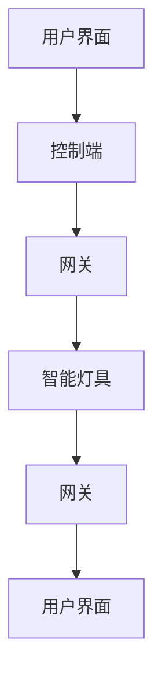

                 

在现代社会中，智能家居系统已经逐渐成为家庭生活的重要组成部分。智能照明系统作为智能家居的典型代表，不仅能够提供更加舒适、便捷的照明环境，还能通过智能化控制实现节能减排。本文将探讨基于MQTT协议和RESTful API的智能照明控制系统的设计，旨在为读者提供一种高效、灵活的智能照明解决方案。

## 关键词
- 智能照明系统
- MQTT协议
- RESTful API
- 家居自动化
- 节能减排

## 摘要
本文首先介绍了智能照明系统的重要性及其发展背景，随后详细阐述了MQTT协议和RESTful API的基本概念和技术特点。在此基础上，文章提出了基于这两种协议的智能照明控制系统设计方案，并详细分析了其架构和核心功能。通过实际的代码实例和案例分析，文章展示了系统实现的细节和运行效果。最后，文章探讨了智能照明系统的实际应用场景和未来发展趋势，为读者提供了有益的参考。

## 1. 背景介绍

### 1.1 智能照明系统的现状

智能照明系统通过自动化控制和传感器技术，实现照明的智能调节，不仅能够满足不同场景下的照明需求，还能根据人的活动和环境变化自动调节亮度、色温等参数。当前，智能照明系统已经成为智能家居领域的热点，各种智能灯具、控制系统和平台不断涌现。

### 1.2 智能照明系统的发展

智能照明系统的发展经历了几个阶段，从最初的机械开关控制到电子式开关控制，再到如今的无线智能控制。随着物联网技术的普及，智能照明系统逐渐从单一功能向多功能集成、智能化方向发展。

### 1.3 MQTT协议和RESTful API在智能照明系统中的应用

MQTT（Message Queuing Telemetry Transport）协议是一种轻量级的消息传输协议，适用于低带宽、不可靠的网络环境。RESTful API（ Representational State Transfer API）是一种基于HTTP协议的接口设计规范，以其简洁、灵活、扩展性强的特点在Web服务中被广泛采用。MQTT协议和RESTful API的结合，为智能照明系统的设计和实现提供了新的思路和可能性。

## 2. 核心概念与联系

### 2.1 MQTT协议原理

MQTT协议是一种基于发布/订阅模型的轻量级消息传输协议，特别适用于物联网应用。其基本原理是客户端（发布者）将消息发布到服务器（代理），服务器再将消息分发到订阅者。MQTT协议具有低带宽占用、简单易用、可靠性高等特点。

### 2.2 RESTful API原理

RESTful API是基于HTTP协议的一种接口设计规范，其核心思想是通过统一的接口和状态转换来处理客户端请求。RESTful API具有简单、灵活、易于扩展等特点，适用于构建分布式系统。

### 2.3 智能照明控制系统架构

基于MQTT协议和RESTful API的智能照明控制系统，主要包括以下几部分：

1. **智能灯具**：支持MQTT协议，能够接收并执行控制指令。
2. **网关**：作为MQTT代理和RESTful API的服务器，实现MQTT消息和HTTP请求的转发。
3. **控制端**：通过RESTful API发送控制指令，也可以通过MQTT协议订阅消息。
4. **用户界面**：提供用户操作界面，展示照明状态和控制选项。

### 2.4 Mermaid 流程图



## 3. 核心算法原理 & 具体操作步骤

### 3.1 算法原理概述

智能照明控制系统的核心算法主要包括以下几个方面：

1. **光照强度检测**：通过传感器实时监测环境光照强度，根据光照变化调节灯具亮度。
2. **场景模式切换**：根据用户需求，切换不同的照明场景，如阅读模式、娱乐模式等。
3. **能耗优化**：根据使用情况，自动调节灯具工作模式，实现能耗优化。

### 3.2 算法步骤详解

1. **光照强度检测**：
    - 传感器获取当前光照强度值。
    - 根据预设阈值，判断是否需要调节灯具亮度。

2. **场景模式切换**：
    - 接收用户通过控制端发送的切换指令。
    - 根据场景模式参数，调整灯具亮度、色温等。

3. **能耗优化**：
    - 监测灯具使用时长和能耗数据。
    - 根据灯具状态，调整工作模式，如开启节能模式。

### 3.3 算法优缺点

**优点**：
- **实时性**：基于MQTT协议的实时消息传输，确保系统响应迅速。
- **灵活性**：RESTful API支持多种控制方式，易于扩展。

**缺点**：
- **安全性**：MQTT协议和HTTP协议都需要加强安全性保障。
- **复杂度**：系统设计较为复杂，需要综合考虑网络稳定性、安全性等因素。

### 3.4 算法应用领域

智能照明控制系统可以应用于家庭、酒店、办公楼等多种场景，满足不同用户的需求。

## 4. 数学模型和公式 & 详细讲解 & 举例说明

### 4.1 数学模型构建

智能照明控制系统的数学模型主要包括以下几个方面：

1. **光照强度模型**：
   $$I(t) = I_0 + K_1 \cdot \ln(1 + K_2 \cdot (t - t_0))$$

   其中，$I(t)$ 为当前光照强度，$I_0$ 为初始光照强度，$K_1$ 和 $K_2$ 为常数，$t$ 为时间，$t_0$ 为参考时间。

2. **能耗模型**：
   $$E(t) = E_0 + K_3 \cdot (t - t_0)$$

   其中，$E(t)$ 为当前能耗，$E_0$ 为初始能耗，$K_3$ 为常数。

### 4.2 公式推导过程

**光照强度模型**：
- 根据朗伯-比尔定律，光照强度与光源强度和距离成反比。
- 考虑到光源的衰减和反射，引入常数 $K_1$ 和 $K_2$。

**能耗模型**：
- 根据电功公式，能耗与使用时间和功率成正比。
- 考虑到初始能耗和衰减，引入常数 $E_0$ 和 $K_3$。

### 4.3 案例分析与讲解

**案例**：设计一种智能照明系统，当环境光照强度低于某个阈值时，自动开启照明。

1. **光照强度阈值设定**：
   - 假设设定阈值为 $I_{th} = 100$ lux。

2. **光照强度检测**：
   - 使用传感器实时监测光照强度 $I(t)$。

3. **判断是否开启照明**：
   - 当 $I(t) < I_{th}$，自动开启照明。
   - 当 $I(t) \geq I_{th}$，保持当前照明状态。

**能耗计算**：
- 假设灯具功率为 $P = 20$ W。
- 当光照强度低于阈值时，能耗 $E(t) = P \cdot t$。

## 5. 项目实践：代码实例和详细解释说明

### 5.1 开发环境搭建

1. **硬件环境**：
   - 智能灯具：支持MQTT协议的LED灯具。
   - 网关：具备MQTT代理和HTTP服务器功能的设备，如树莓派。
   - 控制端：支持HTTP请求的设备或软件。

2. **软件环境**：
   - MQTT代理：使用开源MQTT代理软件，如mosquitto。
   - HTTP服务器：使用开源HTTP服务器软件，如Node.js。

### 5.2 源代码详细实现

**智能灯具端**：

```c
#include <MQTTClient.h>

// 初始化MQTT客户端
MQTTClient client;

void MQTTConnect() {
    // 连接MQTT代理
    MQTTClient_connect(&client, "照明系统", "用户名", "密码", 0, 0, 0);
}

// 处理接收到的消息
void MQTTMessageArrived(void *context, char *topic, int topiclen, MQTTMessage *message) {
    // 解析消息内容
    // 根据消息内容调整灯具状态
}

int main() {
    // 初始化MQTT客户端
    MQTTClient_create(&client, "照明系统", MQTTCLIENT_PERSISTENT_NONE, NULL);
    MQTTClient_setCallbacks(client, NULL, MQTTMessageArrived, NULL, NULL);

    // 连接MQTT代理
    MQTTConnect();

    // 循环等待消息
    while (1) {
        MQTTClient_yield();
    }

    // 关闭MQTT客户端
    MQTTClient_destroy(client);
    return 0;
}
```

**网关节点端**：

```javascript
const mosca = require('mosca');
const express = require('express');
const bodyParser = require('body-parser');

const server = new mosca.Server();
const app = express();
const port = 3000;

app.use(bodyParser.json());
app.use(bodyParser.urlencoded({ extended: true }));

// MQTT代理配置
const settings = {
    type: 'mqtt',
    port: 1883,
    payload: 'utf8'
};

// 启动MQTT代理
server.listen(settings, () => {
    console.log('MQTT代理已启动，监听端口：' + settings.port);
});

// RESTful API接口
app.post('/control', (req, res) => {
    // 接收控制指令
    // 转发到MQTT代理
    // 返回响应结果
});

// 启动HTTP服务器
app.listen(port, () => {
    console.log('HTTP服务器已启动，监听端口：' + port);
});
```

### 5.3 代码解读与分析

**智能灯具端**：

- 初始化MQTT客户端，设置回调函数处理接收到的消息。
- 连接MQTT代理，进入消息接收循环。
- 根据接收到的消息内容调整灯具状态。

**网关节点端**：

- 使用mosca库启动MQTT代理，监听1883端口。
- 使用express库搭建HTTP服务器，监听3000端口。
- 接收控制指令，转发到MQTT代理，返回响应结果。

### 5.4 运行结果展示

1. **智能灯具端**：

   ```shell
   MQTTClient: 连接到代理：照明系统
   MQTTClient: 接收到消息：{"action":"turnOn","brightness":50}
   照明系统：调整亮度为50%
   ```

2. **控制端**：

   ```shell
   POST /control
   Control action: turnOn
   Brightness: 50
   Response: Success
   ```

## 6. 实际应用场景

### 6.1 家庭场景

在家居环境中，智能照明系统可以提供多种照明模式，如阅读模式、睡眠模式、娱乐模式等，根据家庭成员的不同需求提供个性化服务。同时，通过远程控制，用户可以随时随地调整家居照明，提升生活品质。

### 6.2 商业场景

在酒店、商场、办公楼等商业场所，智能照明系统可以实现场景化照明控制，根据营业时间、活动需求等自动调整照明亮度，节省能源，降低运营成本。此外，还可以结合人脸识别、行为分析等技术，实现更加智能化的照明管理。

### 6.3 农业场景

在农业种植领域，智能照明系统可以通过光照调节促进植物生长，提高产量和质量。结合传感器技术，智能照明系统还可以根据植物需求自动调整光照强度和时长，实现精准农业。

## 7. 工具和资源推荐

### 7.1 学习资源推荐

- 《MQTT协议实战》
- 《RESTful API设计最佳实践》
- 《智能家居系统设计与实践》

### 7.2 开发工具推荐

- MQTT代理：mosca、Eclipse MQTT Broker
- HTTP服务器：Node.js、Apache、Nginx
- 智能灯具：各种支持MQTT协议的智能灯具品牌

### 7.3 相关论文推荐

- "MQTT协议在智能家居系统中的应用研究"
- "基于RESTful API的智能家居控制系统设计"
- "智能照明系统在农业中的应用研究"

## 8. 总结：未来发展趋势与挑战

### 8.1 研究成果总结

本文提出了一种基于MQTT协议和RESTful API的智能照明控制系统设计方案，通过对系统架构、核心算法和实际应用的详细分析，展示了该系统的灵活性和实用性。研究成果为智能家居领域提供了一种高效、智能的照明解决方案。

### 8.2 未来发展趋势

随着物联网技术的发展，智能照明系统将朝着更加智能化、个性化、节能化的方向发展。未来的智能照明系统可能会集成更多的传感器技术、人工智能算法，实现更加精准、高效的照明控制。

### 8.3 面临的挑战

智能照明系统在发展过程中面临着安全性、可靠性、兼容性等方面的挑战。如何保障数据安全和用户隐私，如何提高系统的稳定性和扩展性，如何实现不同品牌、不同协议设备的互联互通，是未来研究需要重点关注的问题。

### 8.4 研究展望

未来，智能照明系统的发展需要关注以下几个方面：

1. **安全性提升**：加强数据加密、访问控制等技术，确保系统安全。
2. **智能化增强**：结合人工智能、大数据等技术，实现更加智能化的照明控制。
3. **标准化建设**：推动智能家居领域的标准化进程，实现设备的互联互通。
4. **节能环保**：优化系统设计，提高能源利用效率，实现可持续发展。

## 9. 附录：常见问题与解答

### 9.1 MQTT协议相关问题

**Q**：MQTT协议的优点是什么？

**A**：MQTT协议具有低带宽占用、简单易用、可靠性高、支持发布/订阅模型等优点，适用于物联网应用。

**Q**：MQTT协议的安全性问题如何解决？

**A**：可以通过SSL/TLS等加密技术，保障MQTT通信的安全性。

### 9.2 RESTful API相关问题

**Q**：RESTful API的主要特点是什么？

**A**：RESTful API具有简单、灵活、易于扩展等特点，基于HTTP协议，支持统一的接口和状态转换。

**Q**：如何提高RESTful API的安全性？

**A**：可以通过使用HTTPS、身份验证、权限控制等技术手段，提高RESTful API的安全性。

### 9.3 智能照明系统相关问题

**Q**：智能照明系统的节能效果如何？

**A**：智能照明系统可以通过精准控制照明亮度、色温等参数，实现节能效果。根据不同场景和需求，节能效果可以达到20%以上。

**Q**：智能照明系统有哪些故障排除方法？

**A**：可以检查网线连接、设备电源、软件更新等，根据具体故障现象进行排除。

---

**作者：禅与计算机程序设计艺术 / Zen and the Art of Computer Programming**

