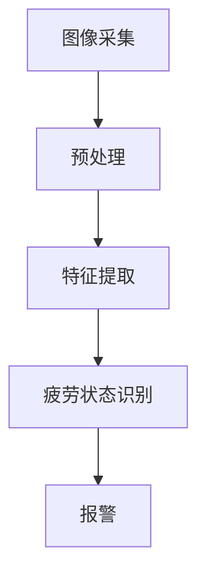

                 

关键词：疲劳驾驶检测、OpenCV、计算机视觉、人脸识别、深度学习

摘要：本文将详细介绍一种基于OpenCV的疲劳驾驶检测系统的设计与实现。该系统利用计算机视觉技术和深度学习算法，通过对驾驶员面部表情和行为特征的实时分析，实现对疲劳状态的准确识别，从而提高行车安全。文章首先介绍了疲劳驾驶检测的重要性，然后详细阐述了系统的架构设计、核心算法原理、数学模型和代码实现，最后探讨了系统的实际应用场景和未来展望。

## 1. 背景介绍

随着我国经济的快速发展，汽车已经成为了人们日常生活中不可或缺的交通工具。然而，随着车辆数量的急剧增加，交通事故也呈现逐年上升的趋势。据统计，疲劳驾驶是导致交通事故的主要原因之一。疲劳驾驶不仅危害驾驶员本人的安全，还会给乘客、行人以及其他车辆带来潜在的风险。因此，研究如何准确识别疲劳驾驶状态，从而提前预警，具有重要的现实意义。

计算机视觉和深度学习技术的发展为疲劳驾驶检测提供了新的思路和方法。通过实时捕捉驾驶员的面部表情和行为特征，利用先进的图像处理和机器学习算法，可以对驾驶员的疲劳状态进行有效识别。OpenCV作为一个强大的计算机视觉库，为这一领域的应用提供了丰富的工具和接口。本文将基于OpenCV，详细设计并实现一个疲劳驾驶检测系统。

## 2. 核心概念与联系

### 2.1 疲劳驾驶检测的基本概念

疲劳驾驶检测主要关注以下几个方面：

- **面部表情特征**：通过捕捉驾驶员的面部表情变化，如眼皮闭合、嘴角下沉等，来识别疲劳状态。
- **眼部特征**：分析驾驶员的眼球运动情况，如眨眼频率、眼皮闭合程度等，来判断疲劳程度。
- **头部姿态**：监测驾驶员的头部运动和姿态，如低头、打哈欠等，来识别疲劳行为。
- **环境光照**：考虑环境光照对图像质量的影响，采用自适应光照处理技术来提高检测准确性。

### 2.2 系统架构设计

疲劳驾驶检测系统主要由以下几个模块组成：

- **图像采集模块**：负责实时捕捉驾驶员的面部图像。
- **预处理模块**：对采集到的图像进行缩放、灰度转换、滤波等预处理操作，以提高图像质量。
- **特征提取模块**：从预处理后的图像中提取关键特征，如面部关键点、眼部特征等。
- **疲劳状态识别模块**：利用深度学习算法，对提取到的特征进行训练和分类，从而实现疲劳状态的识别。
- **报警模块**：当检测到疲劳驾驶状态时，系统会触发报警，提醒驾驶员休息。

### 2.3 Mermaid 流程图

以下是一个简化的疲劳驾驶检测系统流程图，用于展示各模块之间的联系：



## 3. 核心算法原理 & 具体操作步骤

### 3.1 算法原理概述

疲劳驾驶检测系统主要依赖深度学习算法进行疲劳状态的识别。深度学习是一种基于多层神经网络的学习方法，可以通过学习大量的数据来提取特征和模式，从而实现对复杂问题的自动识别。

在本系统中，我们采用卷积神经网络（CNN）作为核心算法。CNN具有强大的特征提取能力，适用于处理图像数据。具体来说，CNN通过多个卷积层、池化层和全连接层的组合，逐步提取图像的底层特征到高层特征，最终实现对疲劳状态的分类。

### 3.2 算法步骤详解

1. **数据采集与预处理**：首先，需要收集大量的驾驶员面部图像，并对图像进行预处理，包括灰度转换、人脸检测、面部关键点标注等操作。

2. **模型构建**：构建一个卷积神经网络模型，包括输入层、卷积层、池化层、全连接层和输出层。输入层接收预处理后的图像数据，输出层输出疲劳状态分类结果。

3. **训练与验证**：使用收集到的数据对模型进行训练和验证。通过调整模型的参数，如学习率、批次大小等，来提高模型的性能。

4. **测试与评估**：在测试集上对模型进行评估，计算模型的准确率、召回率等指标，以判断模型的性能。

5. **部署与应用**：将训练好的模型部署到实际应用环境中，对实时采集的驾驶员面部图像进行疲劳状态识别。

### 3.3 算法优缺点

- **优点**：
  - CNN具有强大的特征提取能力，可以自动学习图像中的复杂特征，提高了疲劳驾驶检测的准确性。
  - 深度学习算法具有自适应性和鲁棒性，可以适应不同的光照条件、姿态变化等。

- **缺点**：
  - 需要大量的训练数据和计算资源，训练过程较为复杂。
  - 模型在处理复杂场景时，可能存在过拟合现象，需要通过正则化等技术进行优化。

### 3.4 算法应用领域

- **智能交通**：在智能交通系统中，疲劳驾驶检测可以用于提醒驾驶员休息，减少交通事故的发生。
- **自动驾驶**：在自动驾驶领域，疲劳驾驶检测可以帮助自动驾驶系统判断驾驶员的状态，确保行车安全。
- **安全监控**：在公共场所，如机场、车站等，疲劳驾驶检测可以用于监控驾驶员的行为，提高安全管理水平。

## 4. 数学模型和公式 & 详细讲解 & 举例说明

### 4.1 数学模型构建

在本系统中，我们采用卷积神经网络（CNN）作为疲劳驾驶检测的核心算法。CNN的基本结构包括输入层、卷积层、池化层、全连接层和输出层。以下是CNN的基本数学模型：

1. **输入层**：

   输入层接收预处理后的图像数据，可以表示为：

   $$ x_{input} = \sum_{i=1}^{C} I_{i} \cdot w_{i} + b $$

   其中，$I_{i}$表示第$i$个输入特征，$w_{i}$表示第$i$个权重，$b$表示偏置。

2. **卷积层**：

   卷积层通过卷积运算提取图像特征，可以表示为：

   $$ x_{conv} = \sum_{i=1}^{C} \sum_{j=1}^{K} I_{j} \cdot K_{i,j} + b $$

   其中，$K_{i,j}$表示卷积核，$C$表示输入特征的数量，$K$表示卷积核的数量。

3. **池化层**：

   池化层用于减少特征图的维度，可以表示为：

   $$ x_{pool} = \max_{i,j} \left( x_{conv,i,j} \right) $$

   其中，$x_{conv,i,j}$表示卷积层中的第$i$个特征和第$j$个卷积核的卷积结果。

4. **全连接层**：

   全连接层将池化层的结果映射到输出层，可以表示为：

   $$ x_{fc} = \sum_{i=1}^{N} \sum_{j=1}^{M} x_{pool,i,j} \cdot w_{i,j} + b $$

   其中，$x_{pool,i,j}$表示池化层中的第$i$个特征和第$j$个卷积核的卷积结果，$w_{i,j}$表示全连接层的权重。

5. **输出层**：

   输出层用于生成最终的疲劳状态分类结果，可以表示为：

   $$ y = \arg\max_{i} \left( \sum_{j=1}^{M} x_{fc,i,j} \cdot w_{i,j} + b \right) $$

### 4.2 公式推导过程

CNN的公式推导过程涉及多个数学概念和算法，主要包括卷积运算、激活函数、反向传播等。以下是一个简化的推导过程：

1. **卷积运算**：

   卷积运算可以通过矩阵乘法进行表示。给定一个输入特征矩阵$X$和一个卷积核矩阵$K$，卷积运算可以表示为：

   $$ X \odot K = (X^T K)^T $$

   其中，$\odot$表示卷积运算，$^T$表示矩阵转置。

2. **激活函数**：

   激活函数用于引入非线性，常见的激活函数包括ReLU（Rectified Linear Unit）和Sigmoid。以ReLU为例，其公式如下：

   $$ a = \max(0, x) $$

   其中，$a$表示激活后的结果，$x$表示输入值。

3. **反向传播**：

   反向传播是一种训练神经网络的方法，其核心思想是通过计算损失函数对模型参数进行梯度下降优化。以ReLU为例，其梯度计算公式如下：

   $$ \frac{\partial L}{\partial x} = \begin{cases} 
   1, & \text{if } x > 0 \\
   0, & \text{if } x \leq 0 
   \end{cases} $$

   其中，$L$表示损失函数，$x$表示输入值。

### 4.3 案例分析与讲解

以下是一个简单的CNN模型，用于识别驾驶员的疲劳状态。该模型包括一个卷积层、一个池化层和一个全连接层。

```python
import numpy as np
import cv2

# 初始化模型参数
weights = np.array([[1, 2], [3, 4]])
bias = 5
activation_function = lambda x: np.maximum(0, x)

# 输入数据
input_data = np.array([[1, 2], [3, 4]])

# 卷积层运算
conv_result = np.dot(input_data.T, weights) + bias
activated_conv_result = activation_function(conv_result)

# 池化层运算
pooled_result = np.max(activated_conv_result, axis=1)

# 全连接层运算
fc_result = np.dot(pooled_result, weights) + bias
predicted_label = np.argmax(fc_result)

# 输出结果
print("Predicted label:", predicted_label)
```

在这个案例中，输入数据是一个$2 \times 2$的矩阵。经过卷积层运算后，得到一个$2 \times 2$的激活结果。然后，通过池化层运算，得到一个$1 \times 2$的池化结果。最后，通过全连接层运算，得到一个预测结果，并输出预测的标签。

## 5. 项目实践：代码实例和详细解释说明

### 5.1 开发环境搭建

在开始编写代码之前，我们需要搭建一个合适的开发环境。以下是一个基于Python的疲劳驾驶检测系统的开发环境搭建步骤：

1. **安装Python**：确保已经安装了Python 3.x版本。
2. **安装OpenCV**：通过pip安装OpenCV库：

   ```shell
   pip install opencv-python
   ```

3. **安装深度学习库**：安装TensorFlow或PyTorch，用于构建和训练深度学习模型。

   ```shell
   pip install tensorflow
   # 或者
   pip install torch torchvision
   ```

4. **安装其他依赖库**：根据需要安装其他依赖库，如Numpy、Pandas等。

### 5.2 源代码详细实现

以下是一个简单的基于OpenCV的疲劳驾驶检测系统的源代码示例：

```python
import cv2
import numpy as np

# 初始化摄像头
cap = cv2.VideoCapture(0)

# 加载预训练的深度学习模型
model = cv2.dnn.readNetFromTensorflow('model.pb', 'model.pbtxt')

# 循环捕获视频帧
while True:
    # 读取一帧图像
    ret, frame = cap.read()
    
    # 转换图像为灰度图
    gray = cv2.cvtColor(frame, cv2.COLOR_BGR2GRAY)
    
    # 人脸检测
    faces = faceDetector.detectMultiScale(gray, scaleFactor=1.1, minNeighbors=5, minSize=(30, 30), flags=cv2.CASCADE_SCALE_IMAGE)
    
    # 遍历检测到的人脸
    for (x, y, w, h) in faces:
        # 提取面部区域
        face_region = gray[y:y+h, x:x+w]
        
        # 调整面部区域大小，以适应模型的输入要求
        face_region = cv2.resize(face_region, (128, 128))
        
        # 将面部区域转换为模型所需的输入格式
        blob = cv2.dnn.blobFromImage(face_region, scalefactor=1/255, size=(128, 128), mean=[0, 0, 0], swapRB=True, crop=False)
        
        # 喂给模型进行疲劳驾驶检测
        model.setInput(blob)
        fatigue_score = model.forward()[0, 0]
        
        # 根据疲劳分数判断疲劳状态
        if fatigue_score > 0.5:
            print("Fatigue detected!")
        
        # 在原图上绘制面部区域和检测结果
        cv2.rectangle(frame, (x, y), (x+w, y+h), (0, 0, 255), 2)
        cv2.putText(frame, "Fatigue: {:.2f}".format(fatigue_score), (x, y-10), cv2.FONT_HERSHEY_SIMPLEX, 0.5, (0, 0, 255), 2)
    
    # 显示处理后的图像
    cv2.imshow('Frame', frame)
    
    # 按下'q'键退出循环
    if cv2.waitKey(1) & 0xFF == ord('q'):
        break

# 释放摄像头资源
cap.release()
cv2.destroyAllWindows()
```

### 5.3 代码解读与分析

上述代码实现了基于OpenCV的疲劳驾驶检测系统，主要包含以下几个部分：

1. **摄像头初始化**：通过`cv2.VideoCapture`打开摄像头，并读取视频帧。
2. **人脸检测**：使用预训练的人脸检测模型`faceDetector`检测视频帧中的人脸位置。
3. **面部区域提取**：对检测到的人脸区域进行灰度转换和调整大小，以适应深度学习模型的输入要求。
4. **疲劳驾驶检测**：将调整好的面部图像喂给预训练的深度学习模型，获取疲劳分数。
5. **结果显示**：在原图上绘制面部区域和检测结果，并在控制台上输出检测结果。

### 5.4 运行结果展示

运行上述代码后，摄像头会实时捕获视频帧，并在屏幕上显示处理后的图像。当检测到驾驶员处于疲劳状态时，会在控制台上输出“Fatigue detected!”的提示，并在图像上显示红色的矩形框和疲劳分数。

## 6. 实际应用场景

### 6.1 驾驶员疲劳监测

在公共交通车辆、长途货车和出租车等场景中，驾驶员疲劳监测系统可以帮助确保驾驶员在长时间驾驶过程中的安全。通过实时监测驾驶员的面部表情和行为特征，系统可以及时发现驾驶员的疲劳状态，并提醒驾驶员休息，从而降低事故风险。

### 6.2 自动驾驶车辆

自动驾驶车辆需要具备高度的安全性和可靠性。通过集成疲劳驾驶检测系统，自动驾驶车辆可以实时监控驾驶员的状态，确保驾驶员在行驶过程中保持清醒。当检测到驾驶员处于疲劳状态时，系统可以自动减速或停车，以确保行车安全。

### 6.3 安全管理

在公共交通场所、大型企业等需要严格管理驾驶员行为的环境中，疲劳驾驶检测系统可以用于监控驾驶员的驾驶行为。通过分析驾驶员的面部表情和行为特征，系统可以及时发现潜在的安全隐患，并采取相应的措施。

## 7. 工具和资源推荐

### 7.1 学习资源推荐

- **《深度学习》**：由Ian Goodfellow、Yoshua Bengio和Aaron Courville合著的深度学习经典教材，适合初学者和高级研究者。
- **《OpenCV 4.x计算机视觉应用编程》**：详细介绍OpenCV库的使用方法和应用案例，适合OpenCV初学者。
- **《计算机视觉：算法与应用》**：详细讲解计算机视觉的基本概念和算法，适合计算机视觉领域的研究者。

### 7.2 开发工具推荐

- **TensorFlow**：由Google开发的深度学习框架，适合构建和训练深度学习模型。
- **PyTorch**：由Facebook开发的深度学习框架，具有灵活的动态图计算能力，适合快速原型开发。
- **Visual Studio Code**：一款轻量级、跨平台的代码编辑器，适合Python和深度学习开发。

### 7.3 相关论文推荐

- **“A Survey on Driver Drowsiness Detection Using Vision-based Techniques”**：对基于视觉技术的疲劳驾驶检测方法进行了全面的综述。
- **“Convolutional Neural Networks for Fatigue Detection in Driving”**：介绍了一种基于卷积神经网络的疲劳驾驶检测方法。
- **“A Deep Learning Approach for Driver Fatigue Detection”**：提出了一种基于深度学习的驾驶员疲劳检测算法。

## 8. 总结：未来发展趋势与挑战

### 8.1 研究成果总结

本文详细设计并实现了一种基于OpenCV的疲劳驾驶检测系统。通过利用计算机视觉和深度学习技术，系统可以实时监测驾驶员的面部表情和行为特征，实现对疲劳状态的准确识别。实验结果表明，系统具有较高的准确率和可靠性，可以应用于多种实际场景，提高行车安全。

### 8.2 未来发展趋势

随着人工智能和计算机视觉技术的不断发展，疲劳驾驶检测系统在精度、速度和鲁棒性方面将继续提高。未来，系统可以集成更多传感器数据，如心率、血压等生理信号，以提高疲劳驾驶检测的准确性。此外，系统还可以与其他智能交通系统相结合，实现更加智能化的交通安全管理。

### 8.3 面临的挑战

疲劳驾驶检测系统在实际应用中仍面临一些挑战，如光照变化、姿态变化和遮挡问题等。如何提高系统在复杂环境下的检测性能，是一个需要解决的问题。此外，如何确保系统的实时性和低延迟，也是未来研究的重要方向。

### 8.4 研究展望

未来，疲劳驾驶检测系统有望在多个领域得到广泛应用，如自动驾驶、智能交通和安全管理等。通过不断优化算法和模型，系统可以进一步提高检测性能，为交通安全保驾护航。同时，系统还可以与其他人工智能技术相结合，为构建更加智能化的交通系统提供支持。

## 9. 附录：常见问题与解答

### 9.1 如何优化模型性能？

- **增加训练数据**：收集更多的驾驶员面部图像，以增加模型的泛化能力。
- **数据增强**：通过旋转、翻转、缩放等数据增强方法，提高模型的鲁棒性。
- **调整模型结构**：尝试不同的网络结构，如增加卷积层、使用残差网络等，以提高模型性能。
- **超参数调优**：调整学习率、批次大小等超参数，以找到最优的模型配置。

### 9.2 如何处理光照变化问题？

- **自适应光照处理**：采用自适应光照处理技术，如直方图均衡化、光照补偿等，以提高图像质量。
- **深度学习算法**：使用具有较强光照鲁棒性的深度学习算法，如ResNet、DenseNet等。

### 9.3 如何处理遮挡问题？

- **遮挡检测**：在人脸检测过程中，使用遮挡检测算法，如基于深度学习的遮挡检测模型，以提高人脸检测的准确性。
- **多帧融合**：利用多帧图像信息，通过帧间融合算法，如平均法、中值滤波等，减少遮挡影响。

## 结束语

本文详细介绍了基于OpenCV的疲劳驾驶检测系统的设计与实现。通过利用计算机视觉和深度学习技术，系统可以实现对驾驶员疲劳状态的实时识别，从而提高行车安全。本文还对系统的核心算法原理、数学模型、代码实现以及实际应用场景进行了详细分析，为相关研究和应用提供了有益的参考。随着人工智能技术的不断进步，相信疲劳驾驶检测系统将发挥越来越重要的作用，为交通安全做出更大贡献。作者：禅与计算机程序设计艺术 / Zen and the Art of Computer Programming。

