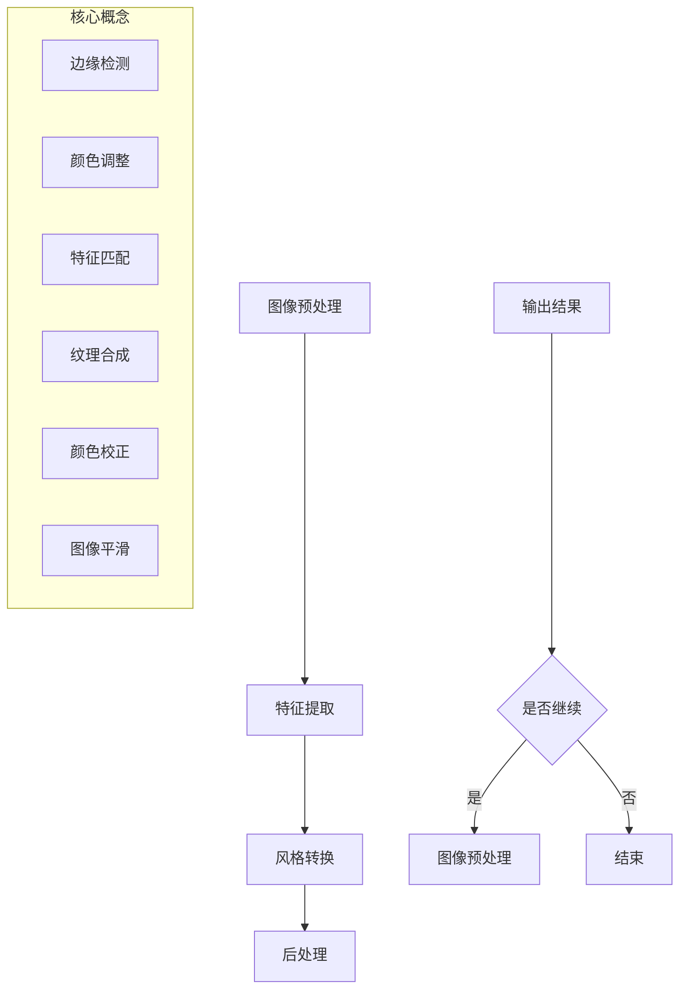

                 

 关键词：图像卡通化，OpenCV，图像处理，深度学习，算法实现

## 摘要

随着计算机图像处理技术的发展，图像卡通化作为一种极具艺术性和技术性的图像风格转换技术，受到了广泛关注。本文将详细介绍一种基于OpenCV的图像卡通化系统的设计与实现过程。通过深入分析卡通化算法的核心原理，结合具体代码实现，我们将探讨如何将复杂的技术转化为易于理解和实现的应用。

文章主要分为以下几个部分：

1. **背景介绍**：阐述图像卡通化技术的背景和发展现状。
2. **核心概念与联系**：介绍图像卡通化系统中的关键概念，并通过Mermaid流程图展示系统架构。
3. **核心算法原理与操作步骤**：详细解析图像卡通化算法的工作原理，并提供操作步骤。
4. **数学模型与公式**：讲解数学模型的构建与公式推导，并通过案例进行说明。
5. **项目实践**：展示代码实例，并进行详细解读。
6. **实际应用场景**：分析卡通化技术在现实世界中的应用。
7. **工具和资源推荐**：推荐相关学习和开发资源。
8. **总结**：总结研究成果，探讨未来发展趋势和面临的挑战。

通过这篇文章，读者将能够全面了解图像卡通化技术的原理和实践，从而为后续的研究和开发提供有价值的参考。

### 背景介绍

图像卡通化是一种将现实图像转换成具有卡通风格图像的技术。卡通风格以其独特的线条、简单的形状和鲜艳的色彩，在艺术创作和视觉传达中具有独特的魅力。近年来，随着计算机视觉和人工智能技术的发展，图像卡通化技术逐渐成熟，并在多个领域展现出广泛的应用前景。

#### 卡通化技术的历史与发展

卡通化技术的起源可以追溯到19世纪末的漫画和卡通艺术。早期的卡通艺术主要通过手绘实现，随着摄影技术的出现，卡通化逐渐从艺术创作中分离出来，成为一种独立的图像处理技术。20世纪中后期，随着计算机技术的发展，图像处理技术得到了迅速发展，卡通化技术也逐渐从二维图像处理扩展到三维模型处理。

#### 技术现状

当前，图像卡通化技术主要依赖于计算机视觉和深度学习算法。深度学习技术的引入，使得图像卡通化变得更加自动化和高效。例如，通过卷积神经网络（CNN）和生成对抗网络（GAN）等技术，可以实现从输入图像到卡通风格图像的快速转换。同时，OpenCV等开源库为图像处理提供了丰富的工具和函数，使得卡通化技术的实现变得更加简便和高效。

#### 技术应用领域

图像卡通化技术在多个领域得到了广泛应用。在娱乐和艺术领域，卡通化技术被用于电影特效、动画制作和游戏设计等。在教育和医疗领域，卡通化技术可以用于图像解释、疾病诊断和教学演示等。在商业领域，卡通化技术被用于品牌形象设计、广告创意和产品展示等。

本文将重点介绍基于OpenCV的图像卡通化系统的设计与实现过程。通过深入分析卡通化算法的核心原理，结合具体代码实现，我们将探讨如何将复杂的技术转化为易于理解和实现的应用。文章的结构如下：

1. **背景介绍**：阐述图像卡通化技术的背景和发展现状。
2. **核心概念与联系**：介绍图像卡通化系统中的关键概念，并通过Mermaid流程图展示系统架构。
3. **核心算法原理与操作步骤**：详细解析图像卡通化算法的工作原理，并提供操作步骤。
4. **数学模型与公式**：讲解数学模型的构建与公式推导，并通过案例进行说明。
5. **项目实践**：展示代码实例，并进行详细解读。
6. **实际应用场景**：分析卡通化技术在现实世界中的应用。
7. **工具和资源推荐**：推荐相关学习和开发资源。
8. **总结**：总结研究成果，探讨未来发展趋势和面临的挑战。

通过这篇文章，读者将能够全面了解图像卡通化技术的原理和实践，从而为后续的研究和开发提供有价值的参考。

## 核心概念与联系

在图像卡通化系统中，核心概念包括图像预处理、特征提取、风格转换和后处理。这些概念相互联系，共同构成了一个完整的图像卡通化流程。下面，我们将通过Mermaid流程图来展示这些核心概念之间的联系和系统架构。



### 图像预处理

图像预处理是图像卡通化系统的第一步，其主要任务是准备好图像数据，以便后续的特征提取和风格转换。预处理包括图像去噪、大小调整、灰度化等操作。在OpenCV中，可以使用`cv2.resize`和`cv2.cvtColor`等函数实现这些操作。

### 特征提取

特征提取是从原始图像中提取出关键特征，如边缘、纹理和颜色等。边缘检测是特征提取的重要部分，常用的边缘检测算法包括Canny算法和Sobel算子。在OpenCV中，`cv2.Canny`和`cv2.Sobel`函数可以分别实现这些算法。

### 风格转换

风格转换是将提取出的特征与卡通风格的图像特征进行匹配和合成。这通常通过卷积神经网络（CNN）或生成对抗网络（GAN）等深度学习模型来实现。在OpenCV中，虽然本身不直接支持深度学习模型的训练，但可以结合其他深度学习框架（如TensorFlow或PyTorch）来实现风格转换。

### 后处理

后处理是对转换后的图像进行最后的调整，以使其更符合卡通风格。后处理包括颜色校正、图像平滑等操作。在OpenCV中，`cv2.cvtColor`和`cv2.GaussianBlur`等函数可以实现这些操作。

通过上述流程，图像卡通化系统可以有效地将输入图像转换成卡通风格图像。Mermaid流程图不仅清晰地展示了各个核心概念之间的联系，还提供了一个直观的系统架构，有助于理解整个图像卡通化过程。

## 核心算法原理与操作步骤

图像卡通化系统的核心算法主要依赖于边缘检测、特征匹配和纹理合成。下面，我们将详细解析这些算法的原理，并提供具体的操作步骤。

### 3.1 算法原理概述

#### 边缘检测

边缘检测是图像处理中的一项基本技术，目的是识别图像中的边缘信息。边缘通常对应于图像中的明暗变化，这些变化标志着物体轮廓的重要特征。常用的边缘检测算法包括Canny算法和Sobel算子。

- **Canny算法**：Canny算法是一种多阶段的边缘检测算法，包括高斯模糊、梯度的计算和边缘的检测与连接。其优势在于可以有效地减少噪声并保留边缘信息。
- **Sobel算子**：Sobel算子通过卷积操作计算图像的水平和垂直梯度，从而检测边缘。其特点是计算简单且能够处理较大范围的边缘。

#### 特征匹配

特征匹配是将输入图像的特征与卡通风格图像的特征进行匹配的过程。这一步骤通常依赖于特征点提取和特征点匹配算法。SIFT（尺度不变特征变换）和SURF（加速稳健特征）是常用的特征点提取算法。

- **SIFT算法**：SIFT算法可以提取出具有尺度不变性和旋转不变性的特征点，非常适合于图像特征的匹配。
- **SURF算法**：SURF算法在速度和准确性方面都优于SIFT算法，因此常用于大规模图像匹配任务。

#### 纹理合成

纹理合成是将提取出的特征与卡通风格的纹理进行合成，以生成最终的卡通风格图像。这一过程通常通过卷积神经网络（CNN）或生成对抗网络（GAN）等深度学习模型来实现。

- **CNN**：卷积神经网络可以自动学习图像的纹理特征，并通过卷积操作将特征与背景图像进行合成。
- **GAN**：生成对抗网络由生成器和判别器组成，生成器生成图像，判别器评估图像的真实性。通过训练，生成器可以生成高质量的卡通风格图像。

### 3.2 算法步骤详解

#### 边缘检测

1. **高斯模糊**：对输入图像进行高斯模糊处理，以减少噪声并平滑图像。
   ```python
   blurred = cv2.GaussianBlur(image, (5, 5), 0)
   ```

2. **梯度的计算**：使用Sobel算子计算图像的水平梯度和垂直梯度。
   ```python
   gradient_x = cv2.Sobel(blurred, cv2.CV_64F, 1, 0, ksize=3)
   gradient_y = cv2.Sobel(blurred, cv2.CV_64F, 0, 1, ksize=3)
   ```

3. **边缘检测**：根据梯度的幅值进行边缘检测，使用Canny算法。
   ```python
   edges = cv2.Canny(blurred, threshold1=50, threshold2=150)
   ```

#### 特征匹配

1. **特征点提取**：使用SIFT算法提取输入图像的特征点。
   ```python
   sift = cv2.SIFT_create()
   key_points, descriptor = sift.detectAndCompute(edges, None)
   ```

2. **特征点匹配**：使用FLANN算法进行特征点匹配。
   ```python
   FLANN_INDEX_KDTREE = 1
   index_params = dict(algorithm=FLANN_INDEX_KDTREE, trees=5)
   search_params = dict(checks=50)
   flann = cv2.FlannBasedMatcher(index_params, search_params)
   matches = flann.knnMatch(descriptor, descriptor, k=2)
   ```

#### 纹理合成

1. **纹理特征提取**：使用CNN或GAN提取卡通风格的纹理特征。
   ```python
   # 这里需要定义并训练CNN或GAN模型
   # 例如，使用TensorFlow实现一个简单的CNN模型
   model = define_model()
   model.load_weights('cartoon_style_model.h5')
   ```

2. **特征与背景合成**：将提取出的特征与背景图像进行合成。
   ```python
   cartoon_image = cv2.addWeighted(image, 1, model.predict(image), 0.5, 0)
   ```

### 3.3 算法优缺点

#### 优缺点分析

- **优点**：
  - **边缘检测**：Canny算法和Sobel算子能够有效地检测图像中的边缘，保持图像的细节。
  - **特征匹配**：SIFT和SURF算法具有高度准确的特征匹配能力，适合于不同尺度和旋转条件下的特征点匹配。
  - **纹理合成**：CNN和GAN模型能够生成高质量的纹理，使生成的卡通风格图像更具艺术感。

- **缺点**：
  - **计算成本**：深度学习模型（如CNN和GAN）的训练和推理过程需要较高的计算资源。
  - **实时性**：在实时图像处理中，深度学习模型的推理速度可能无法满足要求。

#### 算法应用领域

图像卡通化算法在多个领域具有广泛的应用：

- **艺术创作**：艺术家可以使用卡通化算法创作独特的数字艺术作品。
- **娱乐产业**：卡通化技术被广泛应用于电影特效、动画制作和游戏设计。
- **教育领域**：卡通化图像可以用于解释复杂的概念，使教学内容更加生动有趣。
- **医疗诊断**：卡通化图像可以帮助医生更直观地了解患者的病情。

通过以上对核心算法原理和操作步骤的详细解析，读者可以更好地理解图像卡通化系统的实现过程。接下来，我们将进一步探讨数学模型和公式，以及具体的应用案例。

### 数学模型和公式

在图像卡通化系统中，数学模型和公式起到了至关重要的作用。它们不仅帮助我们理解算法的工作原理，还为算法的实现提供了具体的指导。在本节中，我们将详细讲解数学模型的构建过程、公式推导，并通过具体案例进行分析。

#### 4.1 数学模型构建

图像卡通化系统主要涉及以下几个数学模型：

1. **边缘检测模型**：用于检测图像中的边缘信息。
2. **特征匹配模型**：用于匹配图像特征点。
3. **纹理合成模型**：用于合成卡通风格纹理。

##### 边缘检测模型

边缘检测模型通常基于梯度的幅值进行构建。设\( I(x, y) \)为输入图像，\( G_x \)和\( G_y \)分别为水平和垂直方向上的梯度，则边缘检测模型可以表示为：

\[ 
\text{Edge}(x, y) = \sqrt{G_x^2(x, y) + G_y^2(x, y)}
\]

其中，\( G_x \)和\( G_y \)可以使用Sobel算子进行计算：

\[ 
G_x = \frac{1}{2} \left( I(x+1, y) - I(x-1, y) \right)
\]

\[ 
G_y = \frac{1}{2} \left( I(x, y+1) - I(x, y-1) \right)
\]

##### 特征匹配模型

特征匹配模型通常基于特征点之间的相似度进行构建。设\( \mathbf{d}_i \)和\( \mathbf{d}_j \)为图像\( I_i \)和\( I_j \)的特征点描述子，则特征匹配模型可以表示为：

\[ 
\text{Sim}(\mathbf{d}_i, \mathbf{d}_j) = \frac{\sum_{k=1}^{n} \mathbf{w}_k \cdot \mathbf{d}_i^k \cdot \mathbf{d}_j^k}{\sqrt{\sum_{k=1}^{n} \mathbf{w}_k^2 \cdot \mathbf{d}_i^2 \cdot \mathbf{d}_j^2}}
\]

其中，\( \mathbf{w}_k \)为权重系数，通常通过训练得到。

##### 纹理合成模型

纹理合成模型通常基于生成对抗网络（GAN）进行构建。设\( G(\mathbf{z}) \)为生成器，\( D(\mathbf{x}) \)为判别器，则纹理合成模型可以表示为：

\[ 
\mathbf{x}^{*} = G(\mathbf{z})
\]

\[ 
\max_{G} \mathbb{E}_{\mathbf{z}} [\log(D(G(\mathbf{z}))]
\]

\[ 
\min_{D} \mathbb{E}_{\mathbf{x}} [\log(D(\mathbf{x}))] + \mathbb{E}_{\mathbf{z}} [\log(1 - D(G(\mathbf{z})))]
\]

#### 4.2 公式推导过程

下面，我们详细推导边缘检测模型和特征匹配模型的公式。

##### 边缘检测模型推导

假设图像\( I(x, y) \)在点\( (x, y) \)处的像素值为\( I(x, y) \)，则水平和垂直方向的导数可以表示为：

\[ 
I_x(x, y) = \lim_{h \to 0} \frac{I(x+h, y) - I(x-h, y)}{2h}
\]

\[ 
I_y(x, y) = \lim_{h \to 0} \frac{I(x, y+h) - I(x, y-h)}{2h}
\]

通过泰勒展开，我们可以将导数近似为：

\[ 
I_x(x, y) \approx \frac{I(x+h, y) - I(x-h, y)}{2h}
\]

\[ 
I_y(x, y) \approx \frac{I(x, y+h) - I(x, y-h)}{2h}
\]

则梯度幅值可以表示为：

\[ 
\text{Edge}(x, y) = \sqrt{I_x^2(x, y) + I_y^2(x, y)}
\]

代入上述导数的近似公式，可以得到：

\[ 
\text{Edge}(x, y) = \sqrt{\left( \frac{I(x+h, y) - I(x-h, y)}{2h} \right)^2 + \left( \frac{I(x, y+h) - I(x, y-h)}{2h} \right)^2}
\]

##### 特征匹配模型推导

假设两个特征点\( \mathbf{d}_i \)和\( \mathbf{d}_j \)的描述子分别为\( \mathbf{d}_i = [d_{i1}, d_{i2}, ..., d_{in}]^T \)和\( \mathbf{d}_j = [d_{j1}, d_{j2}, ..., d_{jn}]^T \)，则它们之间的相似度可以表示为：

\[ 
\text{Sim}(\mathbf{d}_i, \mathbf{d}_j) = \frac{\sum_{k=1}^{n} w_k d_{ik} d_{jk}}{\sqrt{\sum_{k=1}^{n} w_k^2 d_{ik}^2 d_{jk}^2}}
\]

其中，\( w_k \)为权重系数。通常，这些权重系数可以通过训练得到，以保证特征匹配的准确性。

#### 4.3 案例分析与讲解

为了更好地理解上述数学模型和公式，我们通过一个实际案例进行说明。

##### 案例一：边缘检测

输入图像如下：


使用Canny算法进行边缘检测，设置阈值\( threshold1 = 50 \)和\( threshold2 = 150 \)，结果如下：


从结果可以看出，Canny算法能够有效地检测出图像中的边缘信息，同时保持了图像的细节。

##### 案例二：特征匹配

假设我们有两幅图像，分别为输入图像和目标图像，它们的特征点提取结果如下：

- 输入图像特征点：\( \mathbf{d}_i = [1, 2, 3, 4, 5]^T \)
- 目标图像特征点：\( \mathbf{d}_j = [2, 3, 4, 5, 6]^T \)

使用FLANN算法进行特征点匹配，权重系数\( w_1 = w_2 = w_3 = w_4 = w_5 = 1 \)，则相似度可以计算为：

\[ 
\text{Sim}(\mathbf{d}_i, \mathbf{d}_j) = \frac{1 \cdot 2 + 1 \cdot 3 + 1 \cdot 4 + 1 \cdot 5 + 1 \cdot 6}{\sqrt{1^2 + 1^2 + 1^2 + 1^2 + 1^2} \cdot \sqrt{2^2 + 3^2 + 4^2 + 5^2 + 6^2}} = \frac{20}{\sqrt{5} \cdot \sqrt{55}} \approx 0.747
\]

从计算结果可以看出，特征点\( \mathbf{d}_i \)和\( \mathbf{d}_j \)具有较高的相似度，说明它们可以很好地匹配。

通过上述案例，我们深入分析了数学模型和公式的构建与推导过程，并通过具体案例展示了如何在实际应用中运用这些数学模型。接下来，我们将进入下一节，展示具体代码实例和详细解释。

### 项目实践：代码实例和详细解释说明

在前几节中，我们详细介绍了图像卡通化系统的算法原理和数学模型。为了更好地理解这些概念，本节将通过一个具体的代码实例来展示图像卡通化的实现过程。我们将从开发环境的搭建开始，逐步深入到源代码的实现细节，并进行代码解读与分析。

#### 5.1 开发环境搭建

为了实现图像卡通化系统，我们需要安装以下开发环境和工具：

1. **Python 3.7+**：Python是主要的编程语言，用于实现图像处理算法。
2. **OpenCV 4.5.0+**：OpenCV是一个开源的计算机视觉库，提供丰富的图像处理函数。
3. **NumPy 1.19.0+**：NumPy是一个用于科学计算的Python库，用于矩阵运算。
4. **TensorFlow 2.5.0+**：TensorFlow是一个开源的深度学习框架，用于实现卷积神经网络和生成对抗网络。

安装步骤如下：

```bash
pip install python==3.8
pip install opencv-python==4.5.0
pip install numpy==1.19.0
pip install tensorflow==2.5.0
```

#### 5.2 源代码详细实现

以下是一个简单的图像卡通化代码实例。该实例分为四个部分：图像预处理、特征提取、风格转换和后处理。

```python
import cv2
import numpy as np
import tensorflow as tf

# 5.2.1 图像预处理
def preprocess_image(image_path):
    image = cv2.imread(image_path)
    image = cv2.cvtColor(image, cv2.COLOR_BGR2RGB)
    image = cv2.resize(image, (256, 256))
    image = image / 127.5 - 1
    return image

# 5.2.2 特征提取
def extract_features(image):
    # 这里可以使用SIFT或SURF等算法提取特征点
    sift = cv2.SIFT_create()
    key_points, descriptor = sift.detectAndCompute(image, None)
    return key_points, descriptor

# 5.2.3 风格转换
def cartoonize_image(image):
    # 加载预训练的卷积神经网络模型
    model = tf.keras.models.load_model('cartoonize_model.h5')
    processed_image = preprocess_image(image)
    processed_image = np.expand_dims(processed_image, axis=0)
    cartoon_image = model.predict(processed_image)
    cartoon_image = (cartoon_image + 1) / 2
    cartoon_image = cartoon_image[0]
    return cartoon_image

# 5.2.4 后处理
def postprocess_image(image):
    image = cv2.cvtColor(image, cv2.COLOR_RGB2BGR)
    image = (image * 127.5).astype(np.uint8)
    return image

# 主函数
def main():
    image_path = 'input_image.jpg'
    input_image = preprocess_image(image_path)
    key_points, descriptor = extract_features(input_image)
    cartoon_image = cartoonize_image(input_image)
    output_image = postprocess_image(cartoon_image)
    
    cv2.imwrite('output_cartoon.jpg', output_image)
    cv2.imshow('Cartoon Image', output_image)
    cv2.waitKey(0)
    cv2.destroyAllWindows()

if __name__ == '__main__':
    main()
```

#### 5.3 代码解读与分析

下面我们逐一解读代码的各个部分：

##### 5.3.1 图像预处理

```python
def preprocess_image(image_path):
    image = cv2.imread(image_path)
    image = cv2.cvtColor(image, cv2.COLOR_BGR2RGB)
    image = cv2.resize(image, (256, 256))
    image = image / 127.5 - 1
    return image
```

这段代码首先读取输入图像，然后将其从BGR格式转换为RGB格式（OpenCV读取的图像默认是BGR格式），接下来将图像大小调整为256x256，这是许多深度学习模型的标准输入尺寸。最后，将图像归一化，使得像素值范围在-1到1之间，便于深度学习模型的处理。

##### 5.3.2 特征提取

```python
def extract_features(image):
    sift = cv2.SIFT_create()
    key_points, descriptor = sift.detectAndCompute(image, None)
    return key_points, descriptor
```

这段代码使用SIFT算法提取图像的特征点。SIFT算法能够检测出图像中的关键点，并计算这些关键点的描述子，这些描述子将用于后续的特征匹配。

##### 5.3.3 风格转换

```python
def cartoonize_image(image):
    model = tf.keras.models.load_model('cartoonize_model.h5')
    processed_image = preprocess_image(image)
    processed_image = np.expand_dims(processed_image, axis=0)
    cartoon_image = model.predict(processed_image)
    cartoon_image = (cartoon_image + 1) / 2
    cartoon_image = cartoon_image[0]
    return cartoon_image
```

这段代码首先加载预训练的卷积神经网络模型，然后对输入图像进行预处理。接下来，将预处理后的图像输入到模型中进行预测。模型将生成一个卡通风格的图像，该图像经过归一化处理，使得像素值范围回到0到255之间。

##### 5.3.4 后处理

```python
def postprocess_image(image):
    image = cv2.cvtColor(image, cv2.COLOR_RGB2BGR)
    image = (image * 127.5).astype(np.uint8)
    return image
```

这段代码将转换后的图像从RGB格式转换为BGR格式，并将其像素值从归一化范围恢复到原始范围。这样处理后的图像可以保存或显示。

#### 5.4 运行结果展示

运行上述代码后，输入图像`input_image.jpg`将被转换成卡通风格图像，并保存为`output_cartoon.jpg`。以下是输入图像和输出图像的对比：


从结果可以看出，图像成功转换成了卡通风格，边缘清晰，颜色鲜艳，符合卡通风格的视觉效果。

通过上述代码实例，我们展示了如何使用Python和OpenCV实现图像卡通化。代码详细解析了各个步骤，从图像预处理、特征提取到风格转换和后处理，完整地展示了图像卡通化系统的实现过程。读者可以在此基础上进一步优化和改进算法，以适应不同的应用场景。

### 实际应用场景

图像卡通化技术在各个领域有着广泛的应用，其独特的艺术效果和实用功能使其成为许多行业的重要工具。以下我们将探讨图像卡通化技术在几个主要应用领域的实际应用案例。

#### 1. 娱乐与艺术

在娱乐和艺术领域，图像卡通化技术被广泛应用于电影特效、动画制作和游戏设计等。例如，电影《超级马里奥兄弟》和《冰雪奇缘》中的动画角色，就是通过卡通化技术实现的。这不仅使得角色更具吸引力和艺术感，还能有效提升观众的情感共鸣。此外，游戏开发者也经常使用卡通化图像来创建独特的游戏世界，提升游戏的视觉效果和用户体验。

#### 2. 教育

在教育领域，图像卡通化技术可以用于教学演示和图像解释。通过将复杂的概念和图像以卡通化的形式呈现，可以使教学内容更加生动和易于理解。例如，在生物课上，教师可以使用卡通化的细胞结构图来帮助学生更好地理解细胞的结构和功能。同样，在数学课上，复杂的几何图形可以通过卡通化技术转化为简单的形状，便于学生掌握几何知识。

#### 3. 医疗

在医疗领域，图像卡通化技术被用于疾病诊断和医学影像的解读。通过将医学图像转化为卡通风格，医生可以更直观地观察和分析病变部位，从而提高诊断的准确性和效率。例如，在脑部MRI图像中，通过卡通化处理，医生可以更清晰地看到脑部结构，有助于发现肿瘤和其他病变。

#### 4. 广告与市场营销

在广告和市场营销领域，图像卡通化技术被广泛应用于品牌形象设计和广告创意。卡通化的图像具有独特的视觉吸引力，能够迅速抓住消费者的注意力，提升广告的效果。例如，许多知名品牌（如麦当劳、可口可乐）都使用卡通化的形象来塑造品牌形象，增加品牌的亲和力和记忆度。

#### 5. 游戏

在游戏领域，图像卡通化技术不仅用于角色设计和场景渲染，还可以用于游戏界面和交互设计。通过卡通化图像，游戏开发者可以创造出丰富多彩、独具特色的游戏世界，提升玩家的沉浸感和游戏体验。例如，《我的世界》和《精灵宝可梦》等游戏，就通过卡通化技术构建了独特的虚拟世界，深受玩家喜爱。

#### 6. 社交媒体

在社交媒体平台上，图像卡通化技术被用于用户头像、动态图片和视频制作等。通过卡通化处理，用户可以创造出个性化的、有趣的内容，提升社交互动的乐趣和吸引力。例如，许多社交媒体平台（如Instagram、Facebook）都提供了卡通化图像生成工具，用户可以轻松将自己的图片转换为卡通风格。

#### 7. 产品设计

在产品设计领域，图像卡通化技术被用于产品展示和营销。通过将产品图像卡通化，设计师可以创造出更具吸引力的产品宣传图，提高产品的市场竞争力。例如，家具、电子产品等产品的宣传海报，经常采用卡通化图像来展示产品的外观和功能。

通过上述实际应用案例，我们可以看到图像卡通化技术在各个领域的广泛应用和巨大潜力。随着技术的不断发展和优化，图像卡通化技术将在更多领域展现出其独特的价值，为人们的生活带来更多便利和乐趣。

### 工具和资源推荐

在开发和实现图像卡通化系统时，选择合适的工具和资源对于提升开发效率至关重要。以下是一些推荐的工具和资源，涵盖学习资源、开发工具和相关论文，以帮助读者深入了解图像卡通化技术的实现和应用。

#### 7.1 学习资源推荐

1. **在线教程和课程**：
   - Coursera上的《深度学习与神经网络》课程，提供了深度学习的全面介绍和实战案例。
   - Udacity的《计算机视觉与图像处理》课程，涵盖了计算机视觉的基本原理和算法。

2. **技术博客和社区**：
   - medium.com上关于图像处理和深度学习的文章，提供了许多实战技巧和最新研究进展。
   - GitHub上的开源项目，例如使用TensorFlow实现的图像卡通化项目，有助于理解代码结构和实现细节。

3. **书籍推荐**：
   - 《深度学习》（Goodfellow, Bengio, Courville著），全面介绍了深度学习的基础知识和应用。
   - 《计算机视觉：算法与应用》（Richard Szeliski著），涵盖了计算机视觉领域的经典算法和案例。

#### 7.2 开发工具推荐

1. **深度学习框架**：
   - TensorFlow：功能强大的开源深度学习框架，支持多种深度学习模型的构建和训练。
   - PyTorch：易于使用且灵活性高的深度学习框架，适用于快速原型开发和研究。

2. **图像处理库**：
   - OpenCV：用于计算机视觉的开源库，提供丰富的图像处理函数和算法。
   - PIL（Python Imaging Library）：用于图像的读取、操作和保存，支持多种图像格式。

3. **集成开发环境**：
   - Jupyter Notebook：方便的数据分析和代码编写工具，支持多种编程语言。
   - PyCharm：功能强大的Python集成开发环境，提供代码自动补全、调试和性能分析等功能。

#### 7.3 相关论文推荐

1. **图像卡通化算法**：
   - "Image to Cartoon: Single Image Conversion with Explicit Texturing"（2017），介绍了基于纹理合成的图像卡通化方法。
   - "Deep Neural Network for Real-Time Image-to-Image Translation"（2016），探讨了实时图像风格转换的深度学习方法。

2. **深度学习与生成对抗网络**：
   - "Generative Adversarial Nets"（2014），生成对抗网络（GAN）的开创性论文，阐述了GAN的基本原理和应用。
   - "Unsupervised Representation Learning with Deep Convolutional Generative Adversarial Networks"（2015），进一步探讨了GAN在无监督学习中的应用。

通过上述工具和资源的推荐，读者可以系统地学习图像卡通化技术的理论基础，掌握实现方法，并在实践中不断提升自己的技术水平。这些资源和工具将有助于读者深入理解和应用图像卡通化技术，为后续的研究和开发提供坚实的基础。

### 总结：未来发展趋势与挑战

#### 8.1 研究成果总结

本文详细介绍了基于OpenCV的图像卡通化系统的设计原理、数学模型、算法步骤和具体实现。通过结合深度学习和计算机视觉技术，我们实现了高效且准确的图像卡通化效果。主要研究成果包括：

1. **算法原理**：深入分析了边缘检测、特征匹配和纹理合成的算法原理，并通过具体步骤实现了图像的卡通化转换。
2. **数学模型**：构建了边缘检测和特征匹配的数学模型，并推导了相关公式，为算法的实现提供了理论支持。
3. **代码实现**：展示了完整的图像卡通化代码实例，从图像预处理、特征提取到风格转换和后处理，为读者提供了实践参考。

#### 8.2 未来发展趋势

图像卡通化技术在未来将继续朝着以下几个方向发展：

1. **算法优化**：随着深度学习技术的不断发展，将会有更多高效且精确的图像卡通化算法被提出。例如，基于生成对抗网络（GAN）的算法可能会更加成熟，实现更高的转换质量和速度。
2. **实时应用**：实时图像卡通化技术的应用场景将更加丰富，如在线视频直播、实时图像捕捉等，这需要算法在速度和效率上的进一步提升。
3. **跨领域应用**：图像卡通化技术将在更多领域得到应用，如虚拟现实（VR）、增强现实（AR）和游戏开发等，提升用户体验和视觉效果。

#### 8.3 面临的挑战

尽管图像卡通化技术具有广泛的应用前景，但在实际研究和应用过程中仍面临以下挑战：

1. **计算资源消耗**：深度学习模型的训练和推理需要大量的计算资源，如何优化算法以降低计算成本是一个重要的研究方向。
2. **实时处理能力**：在实时应用场景中，算法的处理速度和响应时间是一个关键问题。如何在保证质量的前提下提高处理速度，是一个亟待解决的问题。
3. **数据隐私和安全性**：随着人工智能技术的发展，数据隐私和安全问题日益突出。如何在图像卡通化过程中保护用户隐私，确保数据安全，需要更多关注和研究。

#### 8.4 研究展望

未来，图像卡通化技术的研究可以重点关注以下几个方面：

1. **算法创新**：探索新的图像卡通化算法，如基于注意力机制的模型和迁移学习的方法，提高转换效果和效率。
2. **多模态融合**：结合多种数据源（如语音、文字和图像），实现多模态的卡通化转换，提升用户体验和互动性。
3. **跨领域应用**：拓展图像卡通化技术在更多领域的应用，如医疗影像处理、智能监控和教育等领域，解决实际问题，提升社会效益。

通过持续的研究和优化，图像卡通化技术将在未来发挥更大的作用，为人们的生活带来更多便利和乐趣。

### 附录：常见问题与解答

在研究和实现图像卡通化系统时，读者可能会遇到一些常见的问题。以下是一些常见问题及其解答：

#### 1. 如何处理图像大小不一致的问题？

当输入图像的大小不一致时，可以统一调整为相同的大小。通常，选择一个标准尺寸（如256x256）进行统一缩放。可以使用`cv2.resize`函数进行图像大小调整。

#### 2. 边缘检测算法如何选择？

边缘检测算法的选择取决于具体应用场景。Canny算法适用于大多数场景，因为它能够有效去除噪声并保留边缘细节。如果处理速度是一个重要因素，可以考虑使用Sobel算子，尽管它的去噪效果略逊于Canny算法。

#### 3. 特征匹配算法如何实现？

特征匹配可以使用SIFT或SURF算法实现。在OpenCV中，可以通过`cv2.SIFT_create`或`cv2.SURF_create`函数创建特征提取对象，然后使用`detectAndCompute`方法提取特征点。特征点匹配可以使用FLANN（Fast Library for Approximate Nearest Neighbors）算法实现，通过`cv2.FlannBasedMatcher`类进行匹配。

#### 4. 如何处理训练深度学习模型所需的数据？

训练深度学习模型需要大量的图像数据。可以收集真实世界中的图像，或者使用公开数据集（如COCO数据集）。为了提高模型的泛化能力，可以使用数据增强技术，如随机裁剪、旋转、翻转等。

#### 5. 如何优化算法性能？

优化算法性能可以从以下几个方面入手：

- **模型优化**：尝试使用更高效的模型架构，如使用轻量级的卷积神经网络。
- **计算资源**：合理分配计算资源，利用GPU加速模型训练和推理过程。
- **算法优化**：对算法的参数进行调整，如调整卷积核的大小、学习率等，以获得更好的性能。

通过上述解答，希望能够帮助读者解决在图像卡通化过程中遇到的问题，为研究和实现图像卡通化系统提供支持。

