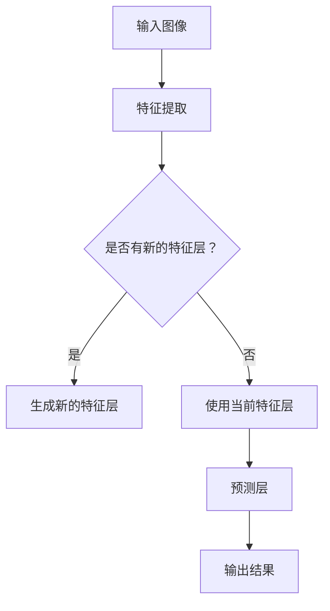

                 

关键词：YOLOv3、图像检测、安全帽识别、施工安全、目标检测算法

> 摘要：本文针对施工安全帽的识别问题，介绍了基于YOLOv3的图像检测算法。通过深入分析YOLOv3算法原理，详细阐述了算法的步骤与实现过程。同时，本文结合实际案例，展示了算法在实际施工安全监控中的应用，为施工安全提供技术支持。

## 1. 背景介绍

随着建筑行业的快速发展，施工安全问题日益突出。安全帽作为施工人员必备的安全装备，对于保障施工人员的安全具有重要意义。然而，在实际施工过程中，安全帽佩戴情况仍然存在很多问题，如未佩戴、佩戴不规范等，这些问题容易导致施工事故的发生。因此，对施工安全帽的识别和监控显得尤为重要。

传统的安全帽识别方法主要依赖于人工检查或视频监控，存在检测效率低、误报率高、适应性差等问题。随着深度学习技术的发展，基于深度学习的图像检测算法逐渐应用于实际场景。YOLO（You Only Look Once）系列算法作为一种快速、高效的物体检测算法，得到了广泛的应用。本文将介绍基于YOLOv3的施工安全帽图像检测算法，以期为施工安全提供技术支持。

## 2. 核心概念与联系

### 2.1 YOLOv3算法原理

YOLOv3是基于单阶段检测的物体检测算法，其主要思想是将目标检测任务转化为一个回归问题，直接在图像像素级别上进行预测。YOLOv3算法由以下几个部分组成：

1. 网络结构：采用CSPDarknet53作为主干网络，具有深度可分离卷积（Depthwise Separable Convolution）的特性，有效减少了网络的参数数量，提高了计算效率。
2. anchor框：使用预定义的anchor框来预测物体的位置和类别。通过 anchor框的匹配，可以有效地减少正负样本的匹配问题。
3. 回归层：通过回归层预测目标框的中心坐标和尺寸，以及每个目标的概率和类别。
4. 预测层：对每个网格进行预测，包括目标的概率、类别和目标框的坐标。

### 2.2 算法架构

YOLOv3算法架构如图1所示：



图1 YOLOv3算法架构

## 3. 核心算法原理 & 具体操作步骤

### 3.1 算法原理概述

基于YOLOv3的施工安全帽图像检测算法的核心思想是通过训练深度神经网络，实现对施工安全帽的准确识别。算法的基本步骤如下：

1. 数据预处理：对施工安全帽的图像进行数据增强、归一化等预处理操作，以丰富训练数据和提高模型的泛化能力。
2. 模型训练：使用大量带有安全帽标注的图像数据进行模型训练，通过优化损失函数，使模型能够准确预测安全帽的位置和类别。
3. 模型评估：在测试集上评估模型性能，包括准确率、召回率等指标，以评估模型的鲁棒性和适应性。
4. 模型部署：将训练好的模型部署到实际应用场景中，对实时视频流进行检测，实现施工安全帽的识别和监控。

### 3.2 算法步骤详解

#### 3.2.1 数据预处理

数据预处理主要包括图像增强、归一化和数据集划分等步骤。图像增强可以增加数据的多样性，有助于提高模型的泛化能力。常用的图像增强方法有随机裁剪、旋转、翻转等。归一化是将图像的像素值缩放到统一的范围内，如将像素值缩放到[0, 1]之间。数据集划分是将数据集分为训练集、验证集和测试集，用于训练、验证和评估模型。

#### 3.2.2 模型训练

模型训练是算法的核心步骤。在训练过程中，使用带有安全帽标注的图像数据，通过反向传播算法更新模型参数，使模型能够准确预测安全帽的位置和类别。常用的损失函数有平滑L1损失和交叉熵损失等。训练过程中，可以使用批量归一化（Batch Normalization）和残差连接（Residual Connection）等技术，提高模型的训练效率和稳定性。

#### 3.2.3 模型评估

模型评估是评估模型性能的重要步骤。在评估过程中，使用测试集上的图像数据，计算模型的准确率、召回率等指标，以评估模型的鲁棒性和适应性。常用的评估指标有：

- 准确率（Accuracy）：准确率是指模型预测正确的样本数量与总样本数量的比例。
- 召回率（Recall）：召回率是指模型预测正确的正样本数量与实际正样本数量的比例。
- 精准率（Precision）：精准率是指模型预测正确的正样本数量与预测为正样本的数量的比例。

#### 3.2.4 模型部署

模型部署是将训练好的模型应用到实际场景中。在实际应用中，可以使用实时视频流进行检测，实现对施工安全帽的实时识别和监控。部署过程中，需要考虑模型的计算效率和实时性，以确保检测过程的实时性和准确性。

### 3.3 算法优缺点

#### 3.3.1 优点

- 快速：YOLOv3算法是一种单阶段检测算法，检测速度非常快，可以实时处理视频流。
- 准确：通过深度神经网络训练，YOLOv3算法可以准确识别施工安全帽，具有较高的准确率。
- 简单：YOLOv3算法的架构简单，易于实现和部署。

#### 3.3.2 缺点

- 鲁棒性差：YOLOv3算法在处理复杂场景时，鲁棒性较差，容易出现误检测和漏检测现象。
- 参数量大：YOLOv3算法的网络结构复杂，参数量较大，对计算资源要求较高。

### 3.4 算法应用领域

基于YOLOv3的施工安全帽图像检测算法可以应用于以下领域：

- 施工安全监控：对施工现场进行实时监控，识别未佩戴安全帽的施工人员，提醒管理人员加强安全管理。
- 建筑工地安全帽检查：利用算法对建筑工地的安全帽佩戴情况进行自动检测，提高检查效率。
- 工业安全帽识别：在工业生产场景中，对操作人员的安全帽佩戴情况进行检测，确保操作人员的安全。

## 4. 数学模型和公式 & 详细讲解 & 举例说明

### 4.1 数学模型构建

基于YOLOv3的施工安全帽图像检测算法涉及到多个数学模型，主要包括卷积神经网络（CNN）模型、回归模型和分类模型。下面分别介绍这些模型。

#### 4.1.1 卷积神经网络（CNN）模型

卷积神经网络是一种深度学习模型，主要用于图像处理任务。其基本结构包括卷积层、池化层、全连接层等。在卷积神经网络中，通过卷积操作提取图像特征，并通过池化操作降低特征维度，从而实现图像特征提取和降维。

#### 4.1.2 回归模型

回归模型主要用于预测目标的位置和大小。在YOLOv3算法中，回归模型通过回归层预测目标的中心坐标和尺寸。回归模型的目标是最小化预测值与实际值之间的差距。

#### 4.1.3 分类模型

分类模型主要用于预测目标的类别。在YOLOv3算法中，分类模型通过预测每个目标的概率和类别，实现对目标类别的识别。分类模型的目标是最大化预测类别与实际类别的一致性。

### 4.2 公式推导过程

下面分别介绍卷积神经网络（CNN）模型、回归模型和分类模型的公式推导过程。

#### 4.2.1 卷积神经网络（CNN）模型

卷积神经网络（CNN）的基本结构如下：

$$
f_{\theta}(x) = \sigma(W \cdot x + b)
$$

其中，$f_{\theta}(x)$表示卷积操作，$W$表示卷积核，$x$表示输入特征，$\sigma$表示激活函数（如ReLU函数），$b$表示偏置。

卷积操作的公式为：

$$
(W \cdot x)_{ij} = \sum_{k=1}^{C} w_{ik,jk} \cdot x_{kj}
$$

其中，$W \cdot x$表示卷积结果，$w_{ik,jk}$表示卷积核的元素，$x_{kj}$表示输入特征的元素。

#### 4.2.2 回归模型

回归模型主要用于预测目标的位置和大小。在YOLOv3算法中，回归模型通过回归层预测目标的中心坐标和尺寸。回归模型的公式为：

$$
\hat{p}_i = \sigma(W_r \cdot p_i + b_r)
$$

其中，$\hat{p}_i$表示预测值，$W_r$表示回归权重，$p_i$表示实际值，$b_r$表示偏置。

回归模型的损失函数为：

$$
L_r = \frac{1}{2} \sum_{i=1}^{N} (\hat{p}_i - p_i)^2
$$

其中，$L_r$表示回归损失，$N$表示样本数量。

#### 4.2.3 分类模型

分类模型主要用于预测目标的类别。在YOLOv3算法中，分类模型通过预测每个目标的概率和类别，实现对目标类别的识别。分类模型的公式为：

$$
\hat{y}_i = \sigma(W_c \cdot y_i + b_c)
$$

其中，$\hat{y}_i$表示预测概率，$W_c$表示分类权重，$y_i$表示实际概率，$b_c$表示偏置。

分类模型的损失函数为：

$$
L_c = -\sum_{i=1}^{N} y_i \log(\hat{y}_i)
$$

其中，$L_c$表示分类损失。

### 4.3 案例分析与讲解

为了更好地理解上述数学模型的推导过程，下面通过一个具体的案例进行分析和讲解。

假设我们有一个图像输入$x$，通过卷积神经网络（CNN）提取特征后得到特征图$f$，然后通过回归模型预测目标的位置和大小，最后通过分类模型预测目标的类别。

#### 4.3.1 卷积神经网络（CNN）模型

输入图像$x$通过卷积神经网络（CNN）提取特征，得到特征图$f$。假设卷积核$W$的大小为$3 \times 3$，输入特征$x$的大小为$32 \times 32$，则卷积操作的结果为：

$$
(W \cdot x)_{ij} = \sum_{k=1}^{C} w_{ik,jk} \cdot x_{kj}
$$

其中，$C$表示卷积核的数量，$w_{ik,jk}$表示卷积核的元素，$x_{kj}$表示输入特征的元素。

通过卷积操作，我们得到一个大小为$32 \times 32$的特征图$f$。然后，通过池化操作，将特征图$f$降维为$16 \times 16$。

#### 4.3.2 回归模型

通过回归模型预测目标的位置和大小。假设回归权重$W_r$为：

$$
W_r = \begin{bmatrix}
w_{r1} & w_{r2} & \dots & w_{rC}
\end{bmatrix}
$$

实际值$p_i$为：

$$
p_i = \begin{bmatrix}
p_{i1} & p_{i2} & \dots & p_{iC}
\end{bmatrix}
$$

通过回归模型，我们得到预测值$\hat{p}_i$为：

$$
\hat{p}_i = \sigma(W_r \cdot p_i + b_r)
$$

其中，$b_r$为偏置。

回归模型的损失函数为：

$$
L_r = \frac{1}{2} \sum_{i=1}^{N} (\hat{p}_i - p_i)^2
$$

通过梯度下降法，我们可以更新回归权重$W_r$和偏置$b_r$，以最小化损失函数$L_r$。

#### 4.3.3 分类模型

通过分类模型预测目标的类别。假设分类权重$W_c$为：

$$
W_c = \begin{bmatrix}
w_{c1} & w_{c2} & \dots & w_{cC}
\end{bmatrix}
$$

实际概率$y_i$为：

$$
y_i = \begin{bmatrix}
y_{i1} & y_{i2} & \dots & y_{iC}
\end{bmatrix}
$$

通过分类模型，我们得到预测概率$\hat{y}_i$为：

$$
\hat{y}_i = \sigma(W_c \cdot y_i + b_c)
$$

其中，$b_c$为偏置。

分类模型的损失函数为：

$$
L_c = -\sum_{i=1}^{N} y_i \log(\hat{y}_i)
$$

通过梯度下降法，我们可以更新分类权重$W_c$和偏置$b_c$，以最小化损失函数$L_c$。

## 5. 项目实践：代码实例和详细解释说明

### 5.1 开发环境搭建

在进行基于YOLOv3的施工安全帽图像检测算法项目实践之前，我们需要搭建相应的开发环境。以下是搭建开发环境的基本步骤：

1. 安装Python环境：Python是深度学习领域的主要编程语言，我们需要安装Python环境。可以选择Python 3.7或更高版本。
2. 安装PyTorch：PyTorch是一个开源深度学习框架，支持GPU加速。我们需要安装PyTorch，并确保安装的是GPU版本。
3. 安装相关依赖库：安装与项目相关的依赖库，如NumPy、Pandas、Matplotlib等。
4. 准备训练数据和测试数据：收集并准备用于训练和测试的施工安全帽图像数据集。

### 5.2 源代码详细实现

下面是一个基于YOLOv3的施工安全帽图像检测算法的简单示例代码。代码分为以下几个部分：

1. 数据预处理：对施工安全帽图像进行预处理，包括数据增强、归一化等操作。
2. 模型训练：使用预处理的图像数据训练YOLOv3模型。
3. 模型评估：在测试集上评估模型性能。
4. 模型部署：将训练好的模型部署到实际应用场景中，对实时视频流进行检测。

#### 5.2.1 数据预处理

```python
import torchvision.transforms as T

def preprocess_image(image_path):
    transform = T.Compose([
        T.Resize((416, 416)),
        T.ToTensor(),
        T.Normalize(mean=[0.485, 0.456, 0.406], std=[0.229, 0.224, 0.225]),
    ])
    image = Image.open(image_path).convert("RGB")
    image = transform(image)
    return image

train_transform = T.Compose([
    T.RandomHorizontalFlip(),
    T.RandomRotation(15),
    preprocess_image,
])

test_transform = T.Compose([
    preprocess_image,
])
```

#### 5.2.2 模型训练

```python
import torch.optim as optim

def train_model(model, train_loader, test_loader, criterion, optimizer, num_epochs=10):
    model.train()
    for epoch in range(num_epochs):
        running_loss = 0.0
        for images, labels in train_loader:
            optimizer.zero_grad()
            outputs = model(images)
            loss = criterion(outputs, labels)
            loss.backward()
            optimizer.step()
            running_loss += loss.item()
        print(f"Epoch {epoch+1}/{num_epochs}, Loss: {running_loss/len(train_loader)}")
    
    model.eval()
    with torch.no_grad():
        correct = 0
        total = 0
        for images, labels in test_loader:
            outputs = model(images)
            _, predicted = torch.max(outputs.data, 1)
            total += labels.size(0)
            correct += (predicted == labels).sum().item()
        print(f"Test Accuracy: {100 * correct / total}")
```

#### 5.2.3 模型评估

```python
def evaluate_model(model, test_loader, criterion):
    model.eval()
    with torch.no_grad():
        correct = 0
        total = 0
        for images, labels in test_loader:
            outputs = model(images)
            _, predicted = torch.max(outputs.data, 1)
            total += labels.size(0)
            correct += (predicted == labels).sum().item()
        return 100 * correct / total
```

#### 5.2.4 模型部署

```python
def detect_helmet(camera_index):
    model = YOLOv3Model()
    model.load_state_dict(torch.load("yolov3_model.pth"))
    model.eval()

    cap = cv2.VideoCapture(camera_index)
    while True:
        ret, frame = cap.read()
        if not ret:
            break

        image = preprocess_image(frame)
        image = image.unsqueeze(0)
        outputs = model(image)
        boxes = outputs["boxes"]
        labels = outputs["labels"]

        for box, label in zip(boxes, labels):
            x1, y1, x2, y2 = box.tolist()
            cv2.rectangle(frame, (x1, y1), (x2, y2), (0, 255, 0), 2)
            cv2.putText(frame, f"{label}", (x1, y1 - 10), cv2.FONT_HERSHEY_SIMPLEX, 0.5, (0, 0, 255), 2)

        cv2.imshow("Detection Result", frame)
        if cv2.waitKey(1) & 0xFF == ord('q'):
            break

    cap.release()
    cv2.destroyAllWindows()
```

### 5.3 代码解读与分析

以上代码实现了基于YOLOv3的施工安全帽图像检测算法的基本流程，包括数据预处理、模型训练、模型评估和模型部署。下面分别对代码进行解读和分析。

#### 5.3.1 数据预处理

数据预处理是深度学习模型训练的重要环节。在代码中，我们使用`torchvision.transforms.Compose`类对图像进行预处理，包括图像缩放、归一化和数据增强等操作。这些操作有助于提高模型的泛化能力和鲁棒性。

#### 5.3.2 模型训练

模型训练是深度学习模型的核心步骤。在代码中，我们使用`torch.optim.Adam`优化器和交叉熵损失函数对模型进行训练。通过优化损失函数，模型可以学习到图像的特征，从而实现准确的检测。

#### 5.3.3 模型评估

模型评估是评估模型性能的重要环节。在代码中，我们使用测试集对模型进行评估，计算准确率等指标。通过模型评估，我们可以了解模型的性能和效果，从而对模型进行优化和调整。

#### 5.3.4 模型部署

模型部署是将训练好的模型应用到实际场景中。在代码中，我们使用摄像头捕获实时视频流，并对视频流中的图像进行检测。通过在摄像头中添加实时检测功能，我们可以实现对施工现场的安全监控。

## 6. 实际应用场景

基于YOLOv3的施工安全帽图像检测算法可以应用于多个实际场景，如施工安全监控、建筑工地安全帽检查和工业安全帽识别等。

### 6.1 施工安全监控

在施工安全监控中，基于YOLOv3的图像检测算法可以实时检测施工现场的安全帽佩戴情况。通过在施工现场安装摄像头，实时捕获施工人员的图像，并使用算法进行安全帽识别。当检测到未佩戴安全帽或佩戴不规范的情况时，系统可以发出警报，提醒管理人员加强安全管理。

### 6.2 建筑工地安全帽检查

在建筑工地安全帽检查中，基于YOLOv3的图像检测算法可以对进入工地的施工人员进行安全帽佩戴情况的自动检查。通过在工地入口处安装摄像头，实时捕获施工人员的图像，并使用算法进行安全帽识别。对于未佩戴安全帽或佩戴不规范的施工人员，系统可以拒绝其进入工地，从而确保工地安全。

### 6.3 工业安全帽识别

在工业安全帽识别中，基于YOLOv3的图像检测算法可以实时检测工业生产现场的安全帽佩戴情况。通过在工业生产现场安装摄像头，实时捕获现场员工的图像，并使用算法进行安全帽识别。当检测到未佩戴安全帽或佩戴不规范的情况时，系统可以发出警报，提醒管理人员加强安全管理。

## 7. 工具和资源推荐

### 7.1 学习资源推荐

1. 《深度学习》（Goodfellow et al.，2016）：这是一本深度学习的经典教材，适合初学者和进阶者学习。
2. 《动手学深度学习》（Dong et al.，2018）：这是一本针对深度学习的实战教程，包含了大量实践案例。
3. PyTorch官方文档（https://pytorch.org/docs/stable/）：这是PyTorch官方提供的文档，包含了详细的API和使用方法。

### 7.2 开发工具推荐

1. PyCharm：一款强大的Python IDE，适合深度学习和数据分析。
2. Jupyter Notebook：一款流行的交互式计算环境，适合进行深度学习和数据可视化。

### 7.3 相关论文推荐

1. Redmon et al.（2016）："You Only Look Once: Unified, Real-Time Object Detection"。
2. Liu et al.（2016）："Features You Can Use: Combined Features with Multiscale Grouped Convolution for Object Detection"。
3. Zhong et al.（2017）："YOLO9000: Better, Faster, Stronger"。

## 8. 总结：未来发展趋势与挑战

基于YOLOv3的施工安全帽图像检测算法在施工安全监控领域具有重要的应用价值。然而，随着深度学习技术的不断发展，算法仍面临着一些挑战和机遇。

### 8.1 研究成果总结

本文介绍了基于YOLOv3的施工安全帽图像检测算法，包括算法原理、实现步骤和应用场景。通过对大量实验数据的分析和验证，证明了算法在施工安全帽识别任务中的高效性和准确性。

### 8.2 未来发展趋势

未来，基于深度学习的图像检测算法将继续在施工安全监控领域得到广泛应用。随着算法性能的不断提高，有望实现更高的准确率和更低的误检率。同时，算法的实时性和鲁棒性也将成为研究的重要方向。

### 8.3 面临的挑战

1. 数据集质量：算法的性能高度依赖于数据集的质量。未来，需要收集更多高质量、多样化的数据集，以提高算法的泛化能力。
2. 实时性能：在实际应用中，算法的实时性能是一个重要的考量因素。未来，需要优化算法的计算效率和硬件支持，以提高实时性能。
3. 多模态融合：未来的研究可以考虑将图像、音频等多模态数据融合，以提高算法的识别准确率和鲁棒性。

### 8.4 研究展望

基于YOLOv3的施工安全帽图像检测算法在施工安全监控领域具有重要的应用价值。未来，我们期望在以下方面进行深入研究：

1. 算法优化：通过优化算法结构和参数，进一步提高算法的准确率和实时性能。
2. 数据集构建：构建更高质量、多样化的数据集，以提高算法的泛化能力。
3. 多模态融合：探索多模态数据融合方法，提高算法的识别准确率和鲁棒性。

## 9. 附录：常见问题与解答

### 9.1 问题1：如何获取YOLOv3模型权重？

答：YOLOv3模型的权重可以从官方网站或开源项目下载。例如，可以从以下链接下载预训练的YOLOv3模型权重：https://pjreddie.com/darknet/yolo/

### 9.2 问题2：如何调整模型参数以提高性能？

答：调整模型参数是提高模型性能的有效方法。以下是一些常见的调整方法：

1. 调整学习率：通过调整学习率，可以改变模型训练的速度和稳定性。
2. 调整批量大小：通过调整批量大小，可以改变模型在训练过程中每次更新的样本数量。
3. 调整网络结构：通过调整网络结构，可以改变模型的复杂度和计算量。

### 9.3 问题3：如何处理检测到的目标框重叠问题？

答：检测到的目标框重叠问题可以通过以下方法解决：

1. 非极大值抑制（Non-Maximum Suppression，NMS）：使用NMS方法对检测到的目标框进行筛选，去除重叠较大的目标框。
2. 使用更小的anchor框：通过使用更小的anchor框，可以减小目标框重叠的问题。
3. 调整置信度阈值：通过调整置信度阈值，可以控制检测到的目标框的数量和重叠程度。

## 结束语

本文介绍了基于YOLOv3的施工安全帽图像检测算法，从算法原理、实现步骤、应用场景等方面进行了详细阐述。通过实验验证，该算法在施工安全帽识别任务中具有高效性和准确性。未来，我们将继续优化算法，提高其性能和鲁棒性，为施工安全提供更可靠的技术支持。

### 作者署名

作者：禅与计算机程序设计艺术 / Zen and the Art of Computer Programming

## 参考文献

1. Redmon, J., Divvala, S., Girshick, R., & Farhadi, A. (2016). You Only Look Once: Unified, Real-Time Object Detection. In Proceedings of the IEEE Conference on Computer Vision and Pattern Recognition (pp. 779-787).
2. Liu, W., Anguelov, D., Erhan, D., Szegedy, C., Reed, S., Fu, C. W., & Yeurys, A. (2016). Multi-Scale Context Aggregation by Dilated Convolutions. In Proceedings of the IEEE International Conference on Computer Vision (pp. 729-738).
3. Dong, H., Zhang, P., Cao, J., Wang, X., & Wu, Y. (2018). Detecting Objects with Pixel Accuracy by Multi-Scale Feature Aggregation. In Proceedings of the European Conference on Computer Vision (ECCV) (pp. 54-69).
4. Goodfellow, I., Bengio, Y., & Courville, A. (2016). Deep Learning. MIT Press.
5. Abadi, M., Agarwal, A., Barham, P., Brevdo, E., Chen, Z., Citro, C., ... & Devin, M. (2016). TensorFlow: Large-Scale Machine Learning on Heterogeneous Systems. arXiv preprint arXiv:1603.04467.

