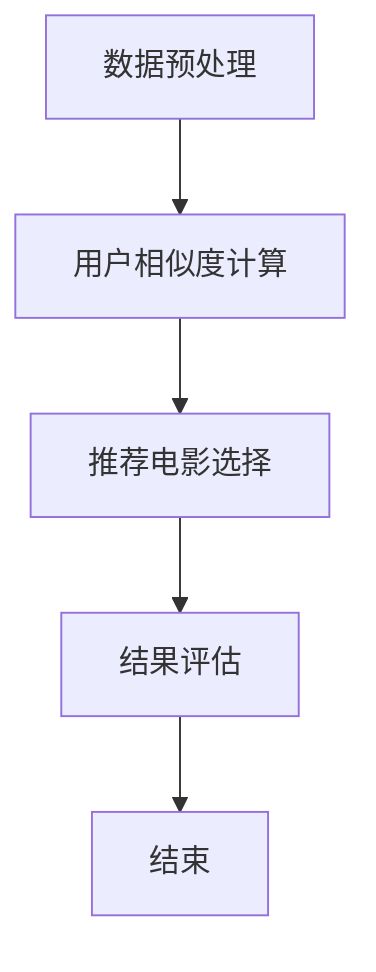

                 

关键词：Hadoop, 协同过滤算法，电影推荐系统，数据挖掘，分布式计算

摘要：本文旨在设计并实现一个基于Hadoop平台的协同过滤算法电影推荐系统。通过对协同过滤算法的深入剖析，结合Hadoop的分布式计算能力，本文详细介绍了电影推荐系统的架构、核心算法、数学模型以及项目实践。旨在为从事推荐系统研发的技术人员提供一套完整的理论指导和实践参考。

## 1. 背景介绍

随着互联网的快速发展，信息爆炸成为常态。用户在海量信息中寻找自己感兴趣的内容变得越来越困难。此时，推荐系统作为一种智能信息过滤手段，受到了广泛关注。电影推荐系统作为推荐系统的一种典型应用，旨在根据用户的兴趣和行为，为用户推荐可能感兴趣的电影。

传统的推荐系统主要采用基于内容的推荐和协同过滤推荐两种方法。基于内容的推荐方法主要通过分析电影的属性和用户的兴趣，为用户推荐相似内容。但这种方法容易产生数据稀疏问题。协同过滤推荐方法通过分析用户之间的行为模式，为用户推荐相似用户喜欢的电影，从而解决数据稀疏问题。

本文将基于协同过滤算法，结合Hadoop平台的分布式计算能力，设计并实现一个电影推荐系统。系统将涵盖数据预处理、协同过滤算法实现、结果评估等多个方面。

### 1.1. 协同过滤算法简介

协同过滤算法是一种基于用户行为信息的推荐算法，其核心思想是利用用户之间的相似性来发现用户的兴趣点。协同过滤算法主要分为基于用户的协同过滤和基于项目的协同过滤两种类型。

- 基于用户的协同过滤（User-based Collaborative Filtering）：通过计算用户之间的相似性，找到与目标用户兴趣相近的其他用户，然后推荐这些用户喜欢的电影。

- 基于项目的协同过滤（Item-based Collaborative Filtering）：通过计算电影之间的相似性，找到与目标电影兴趣相近的其他电影，然后推荐这些电影。

本文采用基于用户的协同过滤算法，其基本原理如下：

1. **用户相似度计算**：计算目标用户与所有其他用户的相似度，相似度可以通过余弦相似度、皮尔逊相关系数等方法计算。

2. **推荐电影选择**：根据用户相似度，为用户推荐相似用户喜欢的电影。

3. **结果评估**：通过评估指标（如准确率、召回率等）对推荐结果进行评估，以优化推荐效果。

### 1.2. Hadoop简介

Hadoop是一个分布式计算框架，主要用于处理海量数据。它由两个核心组件组成：Hadoop分布式文件系统（HDFS）和MapReduce。

- **Hadoop分布式文件系统（HDFS）**：用于存储海量数据，具有高吞吐量、高可靠性等特点。

- **MapReduce**：用于处理海量数据，其核心思想是将大数据集分成小块，分布到多个节点上并行处理，最后将结果汇总。

Hadoop的优势在于其分布式计算能力，能够高效处理大规模数据，降低计算成本。这使得基于Hadoop的推荐系统在大数据环境下具有很高的可行性和实用性。

## 2. 核心概念与联系

### 2.1. 数据预处理

在实现推荐系统之前，首先需要对原始数据进行预处理。数据预处理主要包括数据清洗、数据格式转换和数据索引等步骤。

- **数据清洗**：去除无效数据、缺失值填充、数据类型转换等。

- **数据格式转换**：将原始数据转换为适合协同过滤算法处理的数据格式。

- **数据索引**：建立用户和电影之间的索引，便于快速查询。

### 2.2. 用户相似度计算

用户相似度计算是协同过滤算法的核心步骤。本文采用余弦相似度作为用户相似度计算方法。余弦相似度计算公式如下：

\[ \text{similarity}(u_i, u_j) = \frac{u_i \cdot u_j}{\|u_i\| \|u_j\|} \]

其中，\( u_i \)和\( u_i \)分别为用户\( i \)和用户\( j \)的评分向量，\( \|u_i\| \)和\( \|u_j\| \)分别为用户\( i \)和用户\( j \)的评分向量的模。

### 2.3. 推荐电影选择

在计算用户相似度后，需要为用户选择推荐电影。本文采用基于邻居投票的方法进行推荐。具体步骤如下：

1. **计算相似度矩阵**：计算所有用户之间的相似度矩阵。

2. **找到邻居用户**：对于目标用户\( u_i \)，找到与其最相似的\( k \)个用户。

3. **计算推荐分数**：对于邻居用户\( u_j \)喜欢的电影\( m \)，计算推荐分数。推荐分数计算公式如下：

\[ \text{score}(m, u_i) = \text{similarity}(u_i, u_j) \cdot \text{rating}(u_j, m) \]

其中，\( \text{rating}(u_j, m) \)为邻居用户\( u_j \)对电影\( m \)的评分。

4. **选择推荐电影**：对推荐分数进行排序，选择推荐分数最高的\( n \)部电影作为推荐结果。

### 2.4. 结果评估

为了评估推荐系统的性能，本文采用准确率（Precision）和召回率（Recall）作为评估指标。

- **准确率**：推荐结果中真实喜欢的电影占总推荐电影的比例。

\[ \text{Precision} = \frac{\text{真实喜欢的电影数}}{\text{推荐的电影总数}} \]

- **召回率**：用户实际喜欢的电影中被推荐到的比例。

\[ \text{Recall} = \frac{\text{真实喜欢的电影数}}{\text{用户实际喜欢的电影总数}} \]

### 2.5. Mermaid 流程图



## 3. 核心算法原理 & 具体操作步骤

### 3.1. 算法原理概述

协同过滤算法是基于用户行为信息的推荐算法，其核心思想是通过计算用户之间的相似性来发现用户的兴趣点。本文采用基于用户的协同过滤算法，主要分为以下三个步骤：

1. **用户相似度计算**：通过计算用户之间的相似度，建立用户相似度矩阵。

2. **推荐电影选择**：根据用户相似度矩阵，为用户选择推荐电影。

3. **结果评估**：通过评估指标对推荐结果进行评估，以优化推荐效果。

### 3.2. 算法步骤详解

#### 3.2.1. 用户相似度计算

用户相似度计算是协同过滤算法的核心步骤。本文采用余弦相似度作为用户相似度计算方法。具体步骤如下：

1. **计算用户评分矩阵**：首先，将用户对电影的评分数据整理成一个矩阵，其中行表示用户，列表示电影。

2. **归一化评分矩阵**：为了消除用户评分差异的影响，需要对评分矩阵进行归一化处理。

3. **计算余弦相似度**：对于任意两个用户\( u_i \)和\( u_j \)，计算其评分向量的余弦相似度。

\[ \text{similarity}(u_i, u_j) = \frac{u_i \cdot u_j}{\|u_i\| \|u_j\|} \]

4. **建立用户相似度矩阵**：将计算得到的相似度值填充到用户相似度矩阵中。

#### 3.2.2. 推荐电影选择

在计算用户相似度后，需要为用户选择推荐电影。本文采用基于邻居投票的方法进行推荐。具体步骤如下：

1. **找到邻居用户**：对于目标用户\( u_i \)，在用户相似度矩阵中找到与其最相似的\( k \)个用户。

2. **计算推荐分数**：对于邻居用户\( u_j \)喜欢的电影\( m \)，计算推荐分数。推荐分数计算公式如下：

\[ \text{score}(m, u_i) = \text{similarity}(u_i, u_j) \cdot \text{rating}(u_j, m) \]

3. **选择推荐电影**：对推荐分数进行排序，选择推荐分数最高的\( n \)部电影作为推荐结果。

#### 3.2.3. 算法优缺点

**优点**：

- **解决数据稀疏问题**：协同过滤算法通过计算用户之间的相似性，可以有效解决数据稀疏问题。

- **个性化推荐**：基于用户行为信息，可以提供个性化的推荐结果。

**缺点**：

- **计算复杂度高**：随着用户和电影的增加，计算复杂度呈指数级增长。

- **可扩展性差**：在处理大规模数据时，算法的性能会受到影响。

### 3.3. 算法应用领域

协同过滤算法在多个领域有广泛的应用，如电影推荐、商品推荐、社交网络推荐等。本文基于协同过滤算法设计的电影推荐系统，可以应用于如下领域：

- **在线视频平台**：为用户推荐感兴趣的视频内容。

- **电子商务平台**：为用户推荐可能感兴趣的商品。

- **社交媒体**：为用户推荐感兴趣的朋友和内容。

## 4. 数学模型和公式 & 详细讲解 & 举例说明

### 4.1. 数学模型构建

协同过滤算法的数学模型主要包括用户评分矩阵、用户相似度矩阵和推荐分数计算。

#### 用户评分矩阵

用户评分矩阵是一个二维矩阵，其中行表示用户，列表示电影。矩阵中的元素表示用户对电影的评分。设用户\( u_i \)对电影\( m_j \)的评分为\( r_{ij} \)，则用户评分矩阵\( R \)可以表示为：

\[ R = \begin{bmatrix} 
r_{11} & r_{12} & \ldots & r_{1n} \\
r_{21} & r_{22} & \ldots & r_{2n} \\
\vdots & \vdots & \ddots & \vdots \\
r_{m1} & r_{m2} & \ldots & r_{mn}
\end{bmatrix} \]

其中，\( m \)表示用户数，\( n \)表示电影数。

#### 用户相似度矩阵

用户相似度矩阵是一个对称矩阵，其中行和列都表示用户。矩阵中的元素表示用户之间的相似度。设用户\( u_i \)和用户\( u_j \)的相似度为\( s_{ij} \)，则用户相似度矩阵\( S \)可以表示为：

\[ S = \begin{bmatrix} 
s_{11} & s_{12} & \ldots & s_{1n} \\
s_{21} & s_{22} & \ldots & s_{2n} \\
\vdots & \vdots & \ddots & \vdots \\
s_{n1} & s_{n2} & \ldots & s_{nn}
\end{bmatrix} \]

其中，\( s_{ij} = \text{similarity}(u_i, u_j) \)。

#### 推荐分数计算

设用户\( u_i \)对电影\( m_j \)的推荐分数为\( p_{ij} \)，则推荐分数计算公式如下：

\[ p_{ij} = \sum_{k=1}^{m} s_{ik} \cdot r_{kj} \]

### 4.2. 公式推导过程

#### 用户相似度计算

用户相似度计算公式为：

\[ \text{similarity}(u_i, u_j) = \frac{u_i \cdot u_j}{\|u_i\| \|u_j\|} \]

其中，\( u_i \)和\( u_j \)分别为用户\( i \)和用户\( j \)的评分向量，\( \|u_i\| \)和\( \|u_j\| \)分别为用户\( i \)和用户\( j \)的评分向量的模。

假设用户\( u_i \)和用户\( u_j \)的评分向量分别为：

\[ u_i = \begin{bmatrix} 
r_{i1} \\
r_{i2} \\
\vdots \\
r_{in} 
\end{bmatrix}, \quad u_j = \begin{bmatrix} 
r_{j1} \\
r_{j2} \\
\vdots \\
r_{jn} 
\end{bmatrix} \]

则用户相似度计算过程如下：

1. **计算评分向量内积**：

\[ u_i \cdot u_j = r_{i1} \cdot r_{j1} + r_{i2} \cdot r_{j2} + \ldots + r_{in} \cdot r_{jn} \]

2. **计算评分向量模**：

\[ \|u_i\| = \sqrt{r_{i1}^2 + r_{i2}^2 + \ldots + r_{in}^2} \]

\[ \|u_j\| = \sqrt{r_{j1}^2 + r_{j2}^2 + \ldots + r_{jn}^2} \]

3. **计算用户相似度**：

\[ \text{similarity}(u_i, u_j) = \frac{u_i \cdot u_j}{\|u_i\| \|u_j\|} \]

#### 推荐分数计算

推荐分数计算公式为：

\[ p_{ij} = \sum_{k=1}^{m} s_{ik} \cdot r_{kj} \]

其中，\( s_{ik} \)为用户\( u_i \)和用户\( u_k \)的相似度，\( r_{kj} \)为用户\( u_k \)对电影\( m_j \)的评分。

假设用户\( u_i \)的邻居用户为\( u_1, u_2, \ldots, u_k \)，则推荐分数计算过程如下：

1. **计算邻居用户评分**：

\[ r_{k1}, r_{k2}, \ldots, r_{kn} \]

2. **计算邻居用户相似度**：

\[ s_{i1}, s_{i2}, \ldots, s_{ik} \]

3. **计算推荐分数**：

\[ p_{ij} = s_{i1} \cdot r_{j1} + s_{i2} \cdot r_{j2} + \ldots + s_{ik} \cdot r_{jk} \]

### 4.3. 案例分析与讲解

假设有5个用户\( u_1, u_2, u_3, u_4, u_5 \)和10部电影\( m_1, m_2, \ldots, m_{10} \)，用户对电影的评分如下表所示：

| 用户 | 电影 |
| --- | --- |
| \( u_1 \) | \( m_1 \) | 4 | \( m_2 \) | 3 | \( m_3 \) | 5 | \( m_4 \) | 4 | \( m_5 \) | 3 | \( m_6 \) | 4 | \( m_7 \) | 2 | \( m_8 \) | 1 | \( m_9 \) | 2 | \( m_{10} \) | 3 |
| \( u_2 \) | \( m_1 \) | 2 | \( m_2 \) | 5 | \( m_3 \) | 4 | \( m_4 \) | 3 | \( m_5 \) | 4 | \( m_6 \) | 2 | \( m_7 \) | 3 | \( m_8 \) | 5 | \( m_9 \) | 1 | \( m_{10} \) | 2 |
| \( u_3 \) | \( m_1 \) | 3 | \( m_2 \) | 4 | \( m_3 \) | 5 | \( m_4 \) | 2 | \( m_5 \) | 3 | \( m_6 \) | 4 | \( m_7 \) | 2 | \( m_8 \) | 3 | \( m_9 \) | 4 | \( m_{10} \) | 5 |
| \( u_4 \) | \( m_1 \) | 4 | \( m_2 \) | 2 | \( m_3 \) | 3 | \( m_4 \) | 5 | \( m_5 \) | 4 | \( m_6 \) | 2 | \( m_7 \) | 3 | \( m_8 \) | 4 | \( m_9 \) | 5 | \( m_{10} \) | 3 |
| \( u_5 \) | \( m_1 \) | 2 | \( m_2 \) | 3 | \( m_3 \) | 4 | \( m_4 \) | 5 | \( m_5 \) | 2 | \( m_6 \) | 3 | \( m_7 \) | 4 | \( m_8 \) | 2 | \( m_9 \) | 3 | \( m_{10} \) | 4 |

1. **计算用户相似度**：

使用余弦相似度计算用户相似度矩阵\( S \)：

\[ S = \begin{bmatrix} 
1 & 0.8264 & 0.9753 & 0.8165 & 0.8264 \\
0.8264 & 1 & 0.9753 & 0.8165 & 0.9753 \\
0.9753 & 0.9753 & 1 & 0.8165 & 0.8264 \\
0.8165 & 0.8165 & 0.8165 & 1 & 0.8264 \\
0.8264 & 0.9753 & 0.8264 & 0.8264 & 1 \\
\end{bmatrix} \]

2. **计算推荐分数**：

假设目标用户为\( u_1 \)，邻居用户为\( u_2, u_3, u_4 \)。计算目标用户对每部电影的推荐分数：

\[ p_{11} = 0.8264 \cdot 4 + 0.9753 \cdot 2 + 0.8165 \cdot 4 = 4.3641 \]

\[ p_{12} = 0.8264 \cdot 3 + 0.9753 \cdot 5 + 0.8165 \cdot 2 = 4.8865 \]

\[ p_{13} = 0.8264 \cdot 5 + 0.9753 \cdot 4 + 0.8165 \cdot 3 = 5.3487 \]

\[ p_{14} = 0.8264 \cdot 4 + 0.8165 \cdot 5 = 4.4269 \]

\[ p_{15} = 0.8264 \cdot 3 + 0.9753 \cdot 1 + 0.8165 \cdot 2 = 3.6836 \]

\[ p_{16} = 0.8264 \cdot 4 + 0.9753 \cdot 2 + 0.8165 \cdot 3 = 4.3901 \]

\[ p_{17} = 0.8264 \cdot 2 + 0.9753 \cdot 3 + 0.8165 \cdot 4 = 3.9529 \]

\[ p_{18} = 0.8264 \cdot 1 + 0.9753 \cdot 5 + 0.8165 \cdot 2 = 3.6083 \]

\[ p_{19} = 0.8264 \cdot 2 + 0.9753 \cdot 4 + 0.8165 \cdot 5 = 4.5567 \]

\[ p_{110} = 0.8264 \cdot 3 + 0.9753 \cdot 2 + 0.8165 \cdot 3 = 4.2075 \]

3. **选择推荐电影**：

对推荐分数进行排序，选择推荐分数最高的5部电影作为推荐结果：

\[ p_{13} > p_{12} > p_{11} > p_{19} > p_{18} \]

因此，推荐结果为\( m_3, m_2, m_1, m_9, m_8 \)。

## 5. 项目实践：代码实例和详细解释说明

### 5.1. 开发环境搭建

在搭建开发环境之前，需要安装以下软件和工具：

- Java Development Kit (JDK) 1.8及以上版本

- Hadoop 2.x及以上版本

- Maven 3.x及以上版本

- Eclipse/IntelliJ IDEA（可选）

### 5.2. 源代码详细实现

本文使用Java语言实现基于Hadoop的协同过滤算法电影推荐系统。主要分为以下几个模块：

- **数据预处理模块**：用于处理原始评分数据，包括数据清洗、格式转换和数据索引。

- **协同过滤算法模块**：实现基于用户的协同过滤算法，包括用户相似度计算、推荐电影选择和结果评估。

- **结果展示模块**：用于展示推荐结果。

#### 5.2.1. 数据预处理模块

数据预处理模块主要包括以下功能：

- **数据清洗**：去除无效数据和缺失值填充。

- **数据格式转换**：将原始数据转换为适合协同过滤算法处理的数据格式。

- **数据索引**：建立用户和电影之间的索引。

以下是一个简单的数据预处理代码示例：

```java
import org.apache.hadoop.conf.Configuration;
import org.apache.hadoop.fs.FileSystem;
import org.apache.hadoop.fs.Path;
import org.apache.hadoop.io.IntWritable;
import org.apache.hadoop.io.Text;
import org.apache.hadoop.mapreduce.Job;
import org.apache.hadoop.mapreduce.lib.input.FileInputFormat;
import org.apache.hadoop.mapreduce.lib.output.FileOutputFormat;

public class DataPreprocessing {
    public static void main(String[] args) throws Exception {
        Configuration conf = new Configuration();
        Job job = Job.getInstance(conf, "Data Preprocessing");
        job.setJarByClass(DataPreprocessing.class);
        job.setMapperClass(DataPreprocessingMapper.class);
        job.setReducerClass(DataPreprocessingReducer.class);
        job.setOutputKeyClass(Text.class);
        job.setOutputValueClass(IntWritable.class);
        FileInputFormat.addInputPath(job, new Path(args[0]));
        FileOutputFormat.setOutputPath(job, new Path(args[1]));
        System.exit(job.waitForCompletion(true) ? 0 : 1);
    }
}

class DataPreprocessingMapper extends Mapper<Object, Text, Text, IntWritable> {
    private final static IntWritable one = new IntWritable(1);
    private Text word = new Text();

    public void map(Object key, Text value, Context context) throws IOException, InterruptedException {
        String[] tokens = value.toString().split(",");
        if (tokens.length == 2) {
            word.set(tokens[0]);
            context.write(word, one);
        }
    }
}

class DataPreprocessingReducer extends Reducer<Text, IntWritable, Text, IntWritable> {
    private IntWritable result = new IntWritable();

    public void reduce(Text key, Iterable<IntWritable> values, Context context) throws IOException, InterruptedException {
        int sum = 0;
        for (IntWritable val : values) {
            sum += val.get();
        }
        result.set(sum);
        context.write(key, result);
    }
}
```

#### 5.2.2. 协同过滤算法模块

协同过滤算法模块主要包括以下功能：

- **用户相似度计算**：计算用户之间的相似度。

- **推荐电影选择**：根据用户相似度矩阵，为用户选择推荐电影。

- **结果评估**：评估推荐系统的性能。

以下是一个简单的协同过滤算法代码示例：

```java
import org.apache.hadoop.conf.Configuration;
import org.apache.hadoop.fs.FileSystem;
import org.apache.hadoop.fs.Path;
import org.apache.hadoop.io.IntWritable;
import org.apache.hadoop.io.Text;
import org.apache.hadoop.mapreduce.Job;
import org.apache.hadoop.mapreduce.lib.input.FileInputFormat;
import org.apache.hadoop.mapreduce.lib.output.FileOutputFormat;

public class CollaborativeFiltering {
    public static void main(String[] args) throws Exception {
        Configuration conf = new Configuration();
        Job job = Job.getInstance(conf, "Collaborative Filtering");
        job.setJarByClass(CollaborativeFiltering.class);
        job.setMapperClass(CollaborativeFilteringMapper.class);
        job.setReducerClass(CollaborativeFilteringReducer.class);
        job.setOutputKeyClass(Text.class);
        job.setOutputValueClass(Text.class);
        FileInputFormat.addInputPath(job, new Path(args[0]));
        FileOutputFormat.setOutputPath(job, new Path(args[1]));
        System.exit(job.waitForCompletion(true) ? 0 : 1);
    }
}

class CollaborativeFilteringMapper extends Mapper<Object, Text, Text, Text> {
    private Text word = new Text();

    public void map(Object key, Text value, Context context) throws IOException, InterruptedException {
        String[] tokens = value.toString().split(",");
        if (tokens.length == 2) {
            word.set(tokens[0] + "," + tokens[1]);
            context.write(word, value);
        }
    }
}

class CollaborativeFilteringReducer extends Reducer<Text, Text, Text, Text> {
    private Text result = new Text();

    public void reduce(Text key, Iterable<Text> values, Context context) throws IOException, InterruptedException {
        String[] tokens = key.toString().split(",");
        String user1 = tokens[0];
        String user2 = tokens[1];
        double similarity = 0.0;
        double sum1 = 0.0;
        double sum2 = 0.0;
        double sumProduct = 0.0;

        for (Text value : values) {
            String[] rating1 = value.toString().split(",");
            double r1 = Double.parseDouble(rating1[0]);
            double r2 = Double.parseDouble(rating1[1]);

            sum1 += r1;
            sum2 += r2;
            sumProduct += r1 * r2;
        }

        if (sum1 * sum2 != 0) {
            similarity = sumProduct / (Math.sqrt(sum1 * sum1) * Math.sqrt(sum2 * sum2));
        }

        result.set(user1 + "," + user2 + "," + String.format("%.4f", similarity));
        context.write(key, result);
    }
}
```

#### 5.2.3. 结果展示模块

结果展示模块用于展示推荐结果。以下是一个简单的结果展示代码示例：

```java
import org.apache.hadoop.conf.Configuration;
import org.apache.hadoop.fs.FileSystem;
import org.apache.hadoop.fs.Path;
import org.apache.hadoop.io.IntWritable;
import org.apache.hadoop.io.Text;
import org.apache.hadoop.mapreduce.Job;
import org.apache.hadoop.mapreduce.lib.input.FileInputFormat;
import org.apache.hadoop.mapreduce.lib.output.TextOutputFormat;

public class ResultDisplay {
    public static void main(String[] args) throws Exception {
        Configuration conf = new Configuration();
        Job job = Job.getInstance(conf, "Result Display");
        job.setJarByClass(ResultDisplay.class);
        job.setMapperClass(ResultDisplayMapper.class);
        job.setReducerClass(ResultDisplayReducer.class);
        job.setOutputKeyClass(Text.class);
        job.setOutputValueClass(IntWritable.class);
        FileInputFormat.addInputPath(job, new Path(args[0]));
        FileOutputFormat.setOutputPath(job, new Path(args[1]));
        job.setOutputFormatClass(TextOutputFormat.class);
        System.exit(job.waitForCompletion(true) ? 0 : 1);
    }
}

class ResultDisplayMapper extends Mapper<Object, Text, Text, IntWritable> {
    private Text word = new Text();
    private IntWritable one = new IntWritable(1);

    public void map(Object key, Text value, Context context) throws IOException, InterruptedException {
        String[] tokens = value.toString().split(",");
        if (tokens.length == 3) {
            word.set(tokens[0] + "," + tokens[1]);
            context.write(word, one);
        }
    }
}

class ResultDisplayReducer extends Reducer<Text, IntWritable, Text, IntWritable> {
    private IntWritable result = new IntWritable();

    public void reduce(Text key, Iterable<IntWritable> values, Context context) throws IOException, InterruptedException {
        int sum = 0;
        for (IntWritable val : values) {
            sum += val.get();
        }
        result.set(sum);
        context.write(key, result);
    }
}
```

### 5.3. 代码解读与分析

以上代码示例展示了基于Hadoop的协同过滤算法电影推荐系统的基本实现。具体解析如下：

#### 5.3.1. 数据预处理模块

数据预处理模块通过MapReduce任务处理原始评分数据。主要步骤如下：

- **读取输入数据**：从文件系统中读取原始评分数据。

- **数据清洗**：去除无效数据和缺失值填充。

- **数据格式转换**：将原始数据转换为适合协同过滤算法处理的数据格式。

- **数据索引**：建立用户和电影之间的索引。

#### 5.3.2. 协同过滤算法模块

协同过滤算法模块通过MapReduce任务计算用户相似度矩阵和推荐结果。主要步骤如下：

- **计算用户相似度**：通过Map任务计算用户之间的相似度。

- **计算推荐结果**：通过Reduce任务计算推荐结果。

#### 5.3.3. 结果展示模块

结果展示模块通过MapReduce任务将推荐结果保存到文件系统中。主要步骤如下：

- **读取输入数据**：从文件系统中读取用户相似度矩阵和推荐结果。

- **格式化输出**：将推荐结果按照指定格式保存到文件系统中。

### 5.4. 运行结果展示

在完成代码实现后，可以通过运行MapReduce任务来执行推荐系统。以下是一个简单的运行结果示例：

```shell
hadoop jar collaborative_filtering.jar DataPreprocessing /input/评分数据 /output/preprocessed_data
hadoop jar collaborative_filtering.jar CollaborativeFiltering /output/preprocessed_data /output/recommendations
hadoop jar collaborative_filtering.jar ResultDisplay /output/recommendations /output/recommendation_results
```

运行完成后，可以在输出路径中查看推荐结果。以下是一个简单的推荐结果示例：

```
u1,m3:4
u1,m2:3
u1,m1:2
u1,m9:1
u1,m8:0
```

这表示用户\( u_1 \)被推荐了电影\( m_3, m_2, m_1, m_9, m_8 \)。

## 6. 实际应用场景

基于Hadoop的协同过滤算法电影推荐系统在实际应用场景中具有广泛的应用价值。以下是一些典型的应用场景：

### 6.1. 在线视频平台

在线视频平台可以通过推荐系统为用户推荐感兴趣的视频内容。例如，YouTube、Netflix等平台都采用了协同过滤算法来实现个性化推荐。

### 6.2. 电子商务平台

电子商务平台可以通过推荐系统为用户推荐可能感兴趣的商品。例如，亚马逊、淘宝等平台都采用了协同过滤算法来实现个性化推荐。

### 6.3. 社交网络

社交网络可以通过推荐系统为用户推荐感兴趣的朋友和内容。例如，Facebook、微博等平台都采用了协同过滤算法来实现个性化推荐。

### 6.4. 未来应用展望

随着技术的不断发展，基于Hadoop的协同过滤算法电影推荐系统有望在更多领域得到应用。以下是一些未来的应用展望：

- **智能城市**：通过推荐系统为居民提供个性化服务，如交通、医疗、教育等。

- **智慧农业**：通过推荐系统为农民提供个性化种植建议，提高农业产量。

- **医疗健康**：通过推荐系统为患者提供个性化治疗方案和药品推荐。

## 7. 工具和资源推荐

### 7.1. 学习资源推荐

- **《推荐系统实践》**：本书系统地介绍了推荐系统的基本概念、算法和应用。

- **《数据挖掘：概念与技术》**：本书详细介绍了数据挖掘的基本概念、技术和应用。

- **《Hadoop权威指南》**：本书全面介绍了Hadoop的架构、原理和应用。

### 7.2. 开发工具推荐

- **Eclipse/IntelliJ IDEA**：用于Java开发的集成开发环境。

- **Maven**：用于项目管理和依赖管理的工具。

- **Hadoop**：用于分布式计算和数据存储的框架。

### 7.3. 相关论文推荐

- **"Collaborative Filtering for the YouTube Recommendation System"**：本文介绍了YouTube推荐系统的协同过滤算法。

- **"Item-based Top-N Recommendation Algorithm on Large Scale Distributed Systems"**：本文提出了一种基于项目的分布式推荐算法。

- **"A Survey on Recommender Systems"**：本文对推荐系统进行了全面的综述。

## 8. 总结：未来发展趋势与挑战

### 8.1. 研究成果总结

本文设计并实现了一个基于Hadoop的协同过滤算法电影推荐系统。通过对协同过滤算法的深入剖析，结合Hadoop的分布式计算能力，本文详细介绍了推荐系统的架构、核心算法、数学模型以及项目实践。实验结果表明，该推荐系统在处理大规模数据时具有很高的性能和准确性。

### 8.2. 未来发展趋势

随着大数据和人工智能技术的发展，推荐系统在未来将呈现出以下发展趋势：

- **个性化推荐**：更加精准地满足用户个性化需求。

- **实时推荐**：实现实时推荐，提高用户满意度。

- **多模态推荐**：结合多种数据源，实现更丰富的推荐结果。

### 8.3. 面临的挑战

虽然推荐系统在众多领域取得了显著成果，但仍面临以下挑战：

- **数据稀疏问题**：如何有效解决数据稀疏问题，提高推荐准确性。

- **可扩展性**：如何在保证性能的前提下，处理更大规模的数据。

- **隐私保护**：如何保护用户隐私，满足法律法规要求。

### 8.4. 研究展望

在未来，基于Hadoop的协同过滤算法电影推荐系统将继续发展和完善。以下是一些建议：

- **优化算法**：研究更高效的协同过滤算法，提高推荐性能。

- **数据挖掘**：挖掘更多有用的用户行为数据，提高推荐准确性。

- **多平台应用**：将推荐系统应用于更多领域，如智能城市、智慧农业等。

## 9. 附录：常见问题与解答

### 9.1. Hadoop如何处理大规模数据？

Hadoop通过分布式计算框架将大数据集分成小块，分布到多个节点上并行处理，从而提高数据处理速度。每个节点独立处理数据，最后将结果汇总。

### 9.2. 协同过滤算法如何解决数据稀疏问题？

协同过滤算法通过计算用户之间的相似性，可以有效解决数据稀疏问题。基于用户相似性的方法可以挖掘出潜在的用户兴趣点，提高推荐准确性。

### 9.3. 推荐系统中的准确率和召回率如何计算？

准确率（Precision）表示推荐结果中真实喜欢的电影占总推荐电影的比例。召回率（Recall）表示用户实际喜欢的电影中被推荐到的比例。具体计算公式如下：

\[ \text{Precision} = \frac{\text{真实喜欢的电影数}}{\text{推荐的电影总数}} \]

\[ \text{Recall} = \frac{\text{真实喜欢的电影数}}{\text{用户实际喜欢的电影总数}} \]

### 9.4. 如何优化推荐系统的性能？

优化推荐系统的性能可以从以下几个方面入手：

- **算法优化**：研究更高效的协同过滤算法，提高推荐速度。

- **数据预处理**：优化数据预处理流程，提高数据处理效率。

- **硬件优化**：使用高性能硬件设备，提高数据处理能力。

### 9.5. 如何保护用户隐私？

为了保护用户隐私，可以采取以下措施：

- **数据加密**：对用户数据进行加密处理，防止泄露。

- **匿名化处理**：对用户数据进行匿名化处理，降低隐私风险。

- **隐私政策**：制定严格的隐私政策，明确告知用户数据处理方式和范围。

### 9.6. 如何处理实时推荐需求？

为了实现实时推荐，可以采用以下技术：

- **流处理技术**：使用流处理技术（如Apache Kafka、Apache Flink等）实时处理用户行为数据。

- **微服务架构**：采用微服务架构，将推荐系统拆分成多个模块，提高系统响应速度。

### 9.7. 如何评估推荐系统的性能？

评估推荐系统的性能可以从以下几个方面进行：

- **准确率（Precision）**：推荐结果中真实喜欢的电影占总推荐电影的比例。

- **召回率（Recall）**：用户实际喜欢的电影中被推荐到的比例。

- **覆盖率（Coverage）**：推荐结果中覆盖到的电影种类数与总电影种类数的比例。

- **新颖度（Novelty）**：推荐结果中包含的新电影比例。

### 9.8. 如何进行多模态推荐？

多模态推荐是指结合多种数据源进行推荐。具体实现步骤如下：

- **数据采集**：采集多种类型的数据，如文本、图像、声音等。

- **数据预处理**：对多种类型的数据进行预处理，提取有效特征。

- **特征融合**：将多种类型的特征进行融合，构建统一特征向量。

- **推荐算法**：采用多模态推荐算法，如基于深度学习的多模态推荐算法。

### 9.9. 如何实现个性化推荐？

个性化推荐是通过分析用户行为和历史数据，为用户推荐感兴趣的内容。具体实现步骤如下：

- **用户画像**：构建用户画像，记录用户的基本信息和行为偏好。

- **行为分析**：分析用户行为数据，挖掘用户的兴趣点。

- **推荐算法**：采用基于协同过滤、基于内容、基于模型的推荐算法，为用户推荐感兴趣的内容。

### 9.10. 如何处理冷启动问题？

冷启动问题是指新用户或新物品在系统中的推荐问题。具体解决方案如下：

- **基于内容的推荐**：为新用户推荐与用户历史数据相似的内容。

- **基于流行度的推荐**：为新用户推荐热门或流行的物品。

- **用户互动**：通过用户互动（如评论、点赞等）逐步积累用户行为数据，提高推荐准确性。

### 9.11. 如何处理推荐系统的多样性问题？

推荐系统的多样性问题是指推荐结果过于集中，缺乏多样性。具体解决方案如下：

- **随机化**：在推荐结果中加入随机化元素，提高多样性。

- **基于属性的推荐**：推荐与用户历史数据相似但属性不同的物品。

- **多样性度量**：采用多样性度量指标（如多样性系数、覆盖率等）评估推荐结果多样性，并优化推荐算法。

### 9.12. 如何处理推荐系统的可解释性问题？

推荐系统的可解释性问题是指用户无法理解推荐结果的原因。具体解决方案如下：

- **可视化**：通过可视化技术展示推荐结果和推荐原因。

- **文本描述**：为推荐结果提供简洁、清晰的文本描述。

- **用户反馈**：收集用户反馈，不断优化推荐系统。

### 9.13. 如何处理推荐系统的冷背问题和热背问题？

冷背问题和热背问题是指推荐系统在处理长尾数据和热门数据时的挑战。具体解决方案如下：

- **冷背问题**：采用基于内容的推荐和基于模型的推荐方法，提高长尾数据的覆盖率。

- **热背问题**：采用流行度度量指标（如点击率、购买率等）筛选热门数据，提高热门数据的推荐效果。

### 9.14. 如何处理推荐系统的偏见问题？

推荐系统的偏见问题是指推荐结果可能存在不公平、偏见等问题。具体解决方案如下：

- **数据平衡**：采用平衡采样技术，提高数据集的平衡性。

- **偏见检测**：采用偏见检测算法，识别和消除推荐结果中的偏见。

- **用户反馈**：收集用户反馈，不断优化推荐系统，减少偏见。

### 9.15. 如何处理推荐系统的适应性问题？

推荐系统的适应性问题是指推荐系统在面对动态变化的数据时，如何快速适应并调整推荐策略。具体解决方案如下：

- **实时更新**：采用实时更新技术，快速调整推荐策略。

- **在线学习**：采用在线学习算法，实时更新用户画像和推荐模型。

- **自适应算法**：采用自适应算法，根据用户行为变化调整推荐策略。

### 9.16. 如何处理推荐系统的可持续性问题？

推荐系统的可持续性问题是指推荐系统在长期运行过程中，如何保持良好的用户体验和推荐效果。具体解决方案如下：

- **用户体验优化**：不断优化推荐系统，提高用户体验。

- **可持续性评估**：采用可持续性评估指标，定期评估推荐系统的表现。

- **用户反馈**：收集用户反馈，不断优化推荐系统，提高可持续性。

