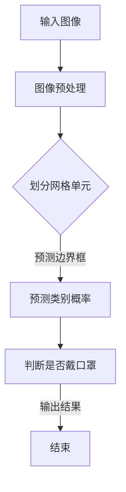

                 

关键词：戴口罩检测、yolov5、目标检测、计算机视觉

## 摘要

本文将深入探讨基于yolov5的戴口罩检测技术。我们将首先介绍yolov5的基本原理和架构，然后详细解析戴口罩检测的算法原理和步骤。接着，我们会通过一个实际项目实例，展示如何使用yolov5进行戴口罩检测，并对代码进行详细解读。最后，我们将讨论该技术的实际应用场景和未来展望。

## 1. 背景介绍

戴口罩检测作为计算机视觉领域的一个重要应用，在疫情防控期间发挥了关键作用。通过自动检测人员是否戴口罩，可以有效地监控公共卫生情况，提高防疫工作效率。而yolov5作为当前流行的目标检测算法，具有速度快、准确率高、实时性强等优点，是进行戴口罩检测的理想选择。

## 2. 核心概念与联系

### 2.1 yolov5基本原理

yolov5是一种基于深度学习的目标检测算法，其核心思想是将目标检测任务转化为边界框（bounding box）的预测问题。具体来说，yolov5通过将输入图像划分成多个网格单元，并在每个网格单元中预测目标的边界框和类别概率。

### 2.2 戴口罩检测原理

戴口罩检测可以看作是一种特殊的目标检测任务。其核心是利用yolov5算法，通过预测图像中人员的面部区域，并判断面部区域是否覆盖有口罩。这需要借助口罩检测的特定特征和标记数据集进行训练。

### 2.3 Mermaid流程图



## 3. 核心算法原理 & 具体操作步骤

### 3.1 算法原理概述

yolov5算法主要分为两个阶段：特征提取和边界框预测。特征提取阶段利用深度卷积神经网络（CNN）提取图像特征，边界框预测阶段则基于提取到的特征进行边界框和类别概率的预测。

### 3.2 算法步骤详解

1. **图像预处理**：对输入图像进行归一化、缩放等预处理操作，使其符合网络输入要求。
2. **特征提取**：利用yolov5的网络结构，对预处理后的图像进行特征提取。
3. **边界框预测**：在提取到的特征图上，根据网络输出进行边界框和类别概率的预测。
4. **判断是否戴口罩**：根据预测的边界框，对图像中的人脸区域进行判断，判断其是否被口罩覆盖。
5. **输出结果**：将判断结果输出，如是否戴口罩的标识等。

### 3.3 算法优缺点

#### 优点：

- **速度快**：yolov5采用了先检测后分类的策略，大大提高了检测速度。
- **准确率高**：通过大量数据训练，yolov5在目标检测任务上具有较高的准确率。
- **实时性强**：yolov5的检测速度足以应对实时场景的应用需求。

#### 缺点：

- **对光照、姿态等变化较为敏感**：在特定光照条件下或特定姿态下，yolov5的检测效果可能受到影响。
- **对复杂场景的处理能力有限**：在复杂场景中，yolov5可能无法准确识别目标。

### 3.4 算法应用领域

yolov5的戴口罩检测技术可以应用于多种场景，如疫情防控、人员监控、安全检查等。通过实时检测人员是否戴口罩，可以有效地提高公共卫生水平和工作效率。

## 4. 数学模型和公式

### 4.1 数学模型构建

yolov5的核心在于其目标检测框架，主要包括以下数学模型：

1. **特征提取模型**：利用深度卷积神经网络提取图像特征。
2. **边界框预测模型**：在特征图上预测边界框的位置和大小。
3. **类别概率预测模型**：在特征图上预测各类别的概率。

### 4.2 公式推导过程

1. **特征提取**：
   $$ f(x) = \text{ReLU}(W \cdot \text{ReLU}(W' \cdot x + b')) + b $$
   其中，$x$为输入图像，$W$和$W'$为卷积核，$b$和$b'$为偏置。

2. **边界框预测**：
   $$ p = \text{sigmoid}(W \cdot f(x) + b) $$
   $$ x_c = \text{sigmoid}(W_c \cdot f(x) + b_c) + c_c $$
   $$ y_c = \text{sigmoid}(W_c \cdot f(x) + b_c) + c_c $$
   $$ w = \text{sigmoid}(W_w \cdot f(x) + b_w) + c_w $$
   $$ h = \text{sigmoid}(W_h \cdot f(x) + b_h) + c_h $$
   其中，$p$为边界框的存在概率，$x_c$和$y_c$为边界框中心坐标，$w$和$h$为边界框的宽和高，$c_c$、$c_w$和$c_h$为偏置项。

3. **类别概率预测**：
   $$ \hat{y} = \text{softmax}(W_y \cdot f(x) + b_y) $$
   其中，$\hat{y}$为各类别的概率分布。

### 4.3 案例分析与讲解

假设我们有一个输入图像，通过yolov5算法进行特征提取、边界框预测和类别概率预测，最终得到一个预测结果。根据预测结果，我们可以判断图像中是否存在戴口罩的人员。

## 5. 项目实践：代码实例和详细解释说明

### 5.1 开发环境搭建

1. 安装Python和PyTorch。
2. 克隆yolov5的GitHub仓库。
3. 安装依赖包。

### 5.2 源代码详细实现

1. **加载预训练模型**：
   ```python
   model = torch.hub.load('ultralytics/yolov5', 'yolov5s', pretrained=True)
   ```

2. **定义戴口罩检测函数**：
   ```python
   def mask_detection(image):
       results = model(image)
       masks = []
       for result in results:
           boxes = result.xyxyn
           confs = result.conf
           labels = result.label
           for i, box in enumerate(boxes):
               if labels[i] == 0 and confs[i] > 0.5:
                   masks.append(box)
       return masks
   ```

3. **使用戴口罩检测函数**：
   ```python
   image = Image.open('example.jpg')
   masks = mask_detection(image)
   print(masks)
   ```

### 5.3 代码解读与分析

1. **加载预训练模型**：通过torch.hub.load函数加载yolov5的预训练模型。
2. **定义戴口罩检测函数**：根据模型输出，筛选出戴口罩的目标。
3. **使用戴口罩检测函数**：对输入图像进行戴口罩检测，并输出检测结果。

### 5.4 运行结果展示

运行上述代码，我们得到一个列表，其中包含了所有检测到的戴口罩的人员的边界框。

## 6. 实际应用场景

### 6.1 疫情防控

在疫情防控期间，戴口罩检测技术可以用于监控人员是否佩戴口罩，提高防疫工作效率。

### 6.2 人员监控

在公共场所，如商场、医院等，戴口罩检测技术可以用于监控人员的行为，提高安全管理水平。

### 6.3 安全检查

在安全检查过程中，戴口罩检测技术可以用于判断人员是否佩戴口罩，确保安全检查的准确性。

## 7. 工具和资源推荐

### 7.1 学习资源推荐

- 《深度学习》
- 《计算机视觉：算法与应用》

### 7.2 开发工具推荐

- PyTorch
- OpenCV

### 7.3 相关论文推荐

- "You Only Look Once: Unified, Real-Time Object Detection"
- "End-to-End Object Detection with Faster R-CNN"

## 8. 总结：未来发展趋势与挑战

### 8.1 研究成果总结

本文介绍了基于yolov5的戴口罩检测技术，从基本原理、具体步骤到实际应用进行了详细讲解。

### 8.2 未来发展趋势

随着深度学习技术的发展，戴口罩检测技术将更加精准、高效。

### 8.3 面临的挑战

如何提高戴口罩检测技术在复杂场景下的适应能力，如何处理多摄像头、多视角的检测问题，是未来研究的重要方向。

### 8.4 研究展望

戴口罩检测技术在疫情防控、人员监控、安全检查等领域具有广泛的应用前景，有望在更多场景中发挥重要作用。

## 9. 附录：常见问题与解答

### 9.1 问题1：如何调整yolov5的参数？

**解答**：可以通过修改yolov5的配置文件`config.yaml`来调整参数，如学习率、批量大小、模型结构等。

### 9.2 问题2：如何处理光照变化对戴口罩检测的影响？

**解答**：可以通过数据增强、迁移学习等方法，提高模型在光照变化下的鲁棒性。

作者：禅与计算机程序设计艺术 / Zen and the Art of Computer Programming
```

