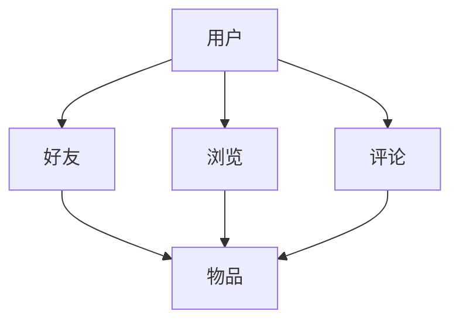

                 

关键词：异构信息网络、元路径、推荐系统、信息检索、人工智能

## 摘要

本文探讨了基于元路径的异构信息网络推荐系统的研究与应用。异构信息网络由不同类型的实体和关系构成，这使得传统推荐系统面临巨大挑战。元路径作为连接异构实体的重要纽带，为推荐系统提供了新的思路。本文首先介绍了异构信息网络的基本概念，然后阐述了元路径的定义和重要性，接着详细描述了基于元路径的推荐算法原理和具体实现步骤。此外，本文还分析了算法的优缺点及其应用领域，并通过数学模型和实例代码展示了算法的实用性和有效性。

## 1. 背景介绍

随着互联网的快速发展，信息量的爆炸式增长给信息检索和推荐系统带来了巨大的挑战。传统的同构信息网络（如社交网络、电子商务平台）往往难以应对异构信息网络（如知识图谱、多模态数据）的复杂性和多样性。异构信息网络包含多种不同类型的实体和关系，这使得单一类型的推荐算法难以胜任。因此，如何有效地利用异构信息网络进行推荐成为当前研究的热点问题。

### 1.1 异构信息网络的定义

异构信息网络（Heterogeneous Information Network，HIN）是一种由多种不同类型实体和关系组成的网络结构。在异构信息网络中，实体可以是用户、物品、地点等，而关系则可以是好友、购买、浏览等。这些实体和关系以图的形式相互连接，形成了复杂的网络结构。与传统同构信息网络相比，异构信息网络具有以下特点：

1. **多样性**：异构信息网络中的实体和关系种类繁多，具有高度的多样性。
2. **动态性**：异构信息网络中的实体和关系处于不断变化的状态。
3. **异构性**：异构信息网络中的实体和关系之间存在异构性，难以直接进行整合和利用。

### 1.2 推荐系统的发展

推荐系统（Recommendation System）是一种信息过滤技术，旨在根据用户的兴趣和偏好向其推荐相关物品。推荐系统的发展经历了基于内容、协同过滤和混合方法三个阶段：

1. **基于内容的方法**：该方法根据物品的属性和用户的偏好进行推荐，但难以应对冷启动问题和多样性问题。
2. **协同过滤方法**：该方法通过分析用户之间的相似性进行推荐，但存在数据稀疏性和推荐结果过于集中的问题。
3. **混合方法**：该方法结合了基于内容和协同过滤的优点，以提高推荐系统的效果。

### 1.3 元路径在推荐系统中的应用

元路径（Meta-path）是连接异构信息网络中不同类型实体和关系的一种结构化表示。元路径通常由多个关系路径组成，描述了实体之间的潜在关联。通过分析元路径，可以挖掘出异构信息网络中的潜在模式，为推荐系统提供有效的支持。元路径在推荐系统中的应用主要表现在以下几个方面：

1. **关联挖掘**：通过分析元路径，可以发现不同实体之间的潜在关联，为推荐系统提供候选物品。
2. **冷启动缓解**：元路径可以帮助新用户或新物品在数据稀疏的情况下找到相关实体，缓解冷启动问题。
3. **多样性增强**：元路径可以挖掘出异构信息网络中的多样化关系，提高推荐结果的多样性。

## 2. 核心概念与联系

在异构信息网络中，核心概念包括实体、关系、元路径等。下面将详细介绍这些概念，并使用Mermaid流程图展示其关系和架构。

### 2.1 实体与关系

实体（Entity）是异构信息网络的基本构成要素，如用户、物品、地点等。关系（Relationship）描述实体之间的关联，如好友、购买、浏览等。

### 2.2 元路径

元路径（Meta-path）是连接异构信息网络中不同类型实体和关系的一种结构化表示。元路径通常由多个关系路径组成，例如，一个元路径可以是“用户-浏览-物品”，表示用户通过浏览关系与物品相连。

### 2.3 Mermaid 流程图

下面是一个Mermaid流程图，展示了异构信息网络中的实体、关系和元路径的关系和架构。



### 2.4 关键概念的联系

异构信息网络中的关键概念之间存在紧密的联系。实体是网络的基础，关系描述实体之间的关联，而元路径则通过关系路径将不同类型的实体连接起来，揭示了潜在的关联模式。

## 3. 核心算法原理 & 具体操作步骤

### 3.1 算法原理概述

基于元路径的异构信息网络推荐算法旨在通过分析元路径来挖掘用户与物品之间的潜在关联，从而为用户推荐相关物品。算法的核心思想是利用元路径挖掘用户兴趣，并根据用户兴趣为用户推荐相关物品。

### 3.2 算法步骤详解

基于元路径的异构信息网络推荐算法主要包括以下步骤：

1. **元路径构建**：根据异构信息网络中的关系，构建用户与物品之间的元路径。例如，可以选择“用户-浏览-物品”作为元路径。
2. **潜在关联挖掘**：利用图论算法，如深度优先搜索，从源节点（用户）开始，遍历元路径上的节点，挖掘用户与物品之间的潜在关联。
3. **关联评分计算**：对于每个挖掘到的潜在关联，计算用户与物品之间的关联评分。评分可以基于用户在元路径上的活动强度、节点权重等因素。
4. **物品推荐**：根据关联评分，为用户推荐相关物品。可以采用Top-N推荐策略，选择评分最高的物品进行推荐。

### 3.3 算法优缺点

基于元路径的异构信息网络推荐算法具有以下优缺点：

**优点**：

1. **缓解冷启动问题**：通过挖掘用户与物品之间的潜在关联，算法可以有效缓解新用户或新物品的冷启动问题。
2. **提高多样性**：元路径可以挖掘出异构信息网络中的多样化关系，从而提高推荐结果的多样性。

**缺点**：

1. **计算复杂度较高**：算法需要进行图遍历和关联评分计算，计算复杂度较高，可能影响算法的实时性能。
2. **模型可解释性较低**：算法的推荐过程较为复杂，模型的可解释性较低，难以向用户解释推荐理由。

### 3.4 算法应用领域

基于元路径的异构信息网络推荐算法可以应用于多个领域，如：

1. **电子商务**：为用户提供个性化推荐，提高用户购买意愿。
2. **社交媒体**：推荐用户可能感兴趣的内容和好友，增强社交网络的用户粘性。
3. **知识图谱**：利用元路径挖掘知识图谱中的潜在关联，为用户提供智能搜索和推荐服务。

## 4. 数学模型和公式 & 详细讲解 & 举例说明

### 4.1 数学模型构建

基于元路径的异构信息网络推荐算法的核心是计算用户与物品之间的关联评分。关联评分可以通过以下数学模型进行构建：

\[ score(u, i) = f(d(u, i), w) \]

其中：

- \( score(u, i) \) 表示用户 \( u \) 与物品 \( i \) 之间的关联评分。
- \( d(u, i) \) 表示用户 \( u \) 与物品 \( i \) 在元路径上的距离。
- \( w \) 表示权重函数，用于计算节点权重。

### 4.2 公式推导过程

关联评分的计算可以基于图论中的距离概念。假设元路径为 \( p = (u, r_1, v_1, r_2, v_2, ..., r_n, v_n, i) \)，其中 \( u \) 为用户，\( i \) 为物品，\( r_1, r_2, ..., r_n \) 为关系，\( v_1, v_2, ..., v_n \) 为中间节点。

用户 \( u \) 与物品 \( i \) 在元路径上的距离可以定义为：

\[ d(u, i) = \sum_{k=1}^{n} d(v_k, v_{k+1}) \]

其中 \( d(v_k, v_{k+1}) \) 表示节点 \( v_k \) 与节点 \( v_{k+1} \) 之间的距离。

节点 \( v_k \) 与节点 \( v_{k+1} \) 之间的距离可以定义为：

\[ d(v_k, v_{k+1}) = \frac{1}{1 + e^{-\beta \cdot sim(v_k, v_{k+1})}} \]

其中 \( sim(v_k, v_{k+1}) \) 表示节点 \( v_k \) 与节点 \( v_{k+1} \) 之间的相似度，\( \beta \) 为超参数。

### 4.3 案例分析与讲解

假设在某个电商平台上，用户 \( u \) 购买了商品 \( i_1 \)，且用户与商品 \( i_1 \) 之间存在元路径 \( u-r_1-v_1-r_2-i_1 \)。根据上述数学模型，我们可以计算用户 \( u \) 与商品 \( i_1 \) 之间的关联评分：

1. 计算节点 \( v_1 \) 与节点 \( v_2 \) 之间的距离：
   \[ d(v_1, v_2) = \frac{1}{1 + e^{-\beta \cdot sim(v_1, v_2)}} \]
   
2. 计算节点 \( v_2 \) 与节点 \( v_3 \) 之间的距离：
   \[ d(v_2, v_3) = \frac{1}{1 + e^{-\beta \cdot sim(v_2, v_3)}} \]
   
3. 计算用户 \( u \) 与商品 \( i_1 \) 之间的距离：
   \[ d(u, i_1) = \sum_{k=1}^{n} d(v_k, v_{k+1}) \]
   
4. 计算用户 \( u \) 与商品 \( i_1 \) 之间的关联评分：
   \[ score(u, i_1) = f(d(u, i_1), w) \]

通过计算，我们可以得到用户 \( u \) 与商品 \( i_1 \) 之间的关联评分。根据评分，我们可以为用户 \( u \) 推荐相关商品。

## 5. 项目实践：代码实例和详细解释说明

### 5.1 开发环境搭建

为了实现基于元路径的异构信息网络推荐算法，我们需要搭建以下开发环境：

1. **Python环境**：Python是一种广泛应用于数据科学和机器学习的编程语言。
2. **NumPy**：NumPy是一个用于科学计算的开源库，提供了多维数组对象和矩阵运算。
3. **NetworkX**：NetworkX是一个用于构建、操作和分析网络数据的Python库。
4. **Scikit-learn**：Scikit-learn是一个用于机器学习的开源库，提供了多种常用的机器学习算法。

### 5.2 源代码详细实现

下面是使用Python实现的基于元路径的异构信息网络推荐算法的源代码：

```python
import numpy as np
import networkx as nx
from sklearn.metrics.pairwise import cosine_similarity

def build_graph(edges):
    graph = nx.Graph()
    for edge in edges:
        graph.add_edge(edge[0], edge[1], weight=edge[2])
    return graph

def build_meta_path(graph, source, target, meta_path):
    path = [source]
    for relation in meta_path:
        path.append(graph.neighbors(path[-1])[0])
    path.append(target)
    return path

def calculate_similarity(graph, meta_path):
    nodes = [node for node in meta_path]
    node_features = nx.get_node_attributes(graph, 'feature')
    node_similarity = cosine_similarity([node_features[node] for node in nodes])
    return node_similarity

def calculate_score(meta_path_similarity):
    scores = []
    for i in range(len(meta_path_similarity) - 1):
        score = np.sum(meta_path_similarity[i]) / (len(meta_path_similarity[i]) - 1)
        scores.append(score)
    return scores

def recommend_items(graph, user, items, meta_path, top_n):
    scores = []
    for item in items:
        meta_path = build_meta_path(graph, user, item, meta_path)
        similarity = calculate_similarity(graph, meta_path)
        score = calculate_score(similarity)
        scores.append(score)
    top_n_scores = sorted(scores, reverse=True)[:top_n]
    return top_n_scores

# 示例数据
edges = [('user1', 'item1', 1), ('user1', 'item2', 1), ('user2', 'item1', 1), ('user2', 'item3', 1)]
graph = build_graph(edges)

# 用户和物品
user = 'user1'
items = ['item1', 'item2', 'item3']

# 元路径
meta_path = ['user', 'browse', 'item']

# 推荐结果
top_n = 2
recommended_items = recommend_items(graph, user, items, meta_path, top_n)
print(recommended_items)
```

### 5.3 代码解读与分析

1. **构建图**：`build_graph` 函数用于构建图，将边和权重添加到图中。
2. **构建元路径**：`build_meta_path` 函数根据源节点、目标节点和元路径关系构建路径。
3. **计算相似度**：`calculate_similarity` 函数计算节点之间的相似度，使用余弦相似度作为相似度度量。
4. **计算评分**：`calculate_score` 函数计算元路径上的评分。
5. **推荐物品**：`recommend_items` 函数根据用户、物品、元路径和Top-N参数为用户推荐相关物品。

通过运行示例代码，我们可以得到用户1对物品1、物品2和物品3的推荐评分，根据评分可以推荐出用户可能感兴趣的物品。

## 6. 实际应用场景

基于元路径的异构信息网络推荐算法在多个实际应用场景中展现了其强大的能力。以下列举了几个典型的应用场景：

### 6.1 电子商务平台

在电子商务平台中，基于元路径的推荐算法可以用于个性化商品推荐。例如，用户浏览了某款手机，平台可以根据用户与手机之间的元路径推荐相关的配件或相似的手机型号，从而提高用户的购买意愿和平台销售额。

### 6.2 社交媒体

在社交媒体平台上，基于元路径的推荐算法可以用于推荐用户可能感兴趣的内容和好友。例如，用户在社交媒体上关注了某个话题，平台可以根据用户与话题之间的元路径推荐相关的帖子和其他感兴趣的用户，从而增强用户的社交体验。

### 6.3 知识图谱

在知识图谱领域，基于元路径的推荐算法可以用于推荐相关的知识点和领域专家。例如，用户在学术平台上研究了某个研究领域，平台可以根据用户与该研究领域之间的元路径推荐相关的论文和专家，从而帮助用户拓展知识领域。

### 6.4 医疗健康

在医疗健康领域，基于元路径的推荐算法可以用于个性化健康建议和药品推荐。例如，用户在健康平台上记录了自身的健康状况，平台可以根据用户与健康状况之间的元路径推荐相应的健康建议和药品，从而帮助用户保持健康。

## 7. 工具和资源推荐

为了更好地学习和实践基于元路径的异构信息网络推荐算法，以下推荐一些相关的工具和资源：

### 7.1 学习资源推荐

1. **论文**：《基于元路径的异构信息网络推荐系统研究》
2. **书籍**：《社交网络推荐系统：原理与应用》
3. **在线课程**：Coursera上的《推荐系统》课程

### 7.2 开发工具推荐

1. **Python**：Python是一种广泛应用于数据科学和机器学习的编程语言，具有丰富的库和工具。
2. **Jupyter Notebook**：Jupyter Notebook是一种交互式的计算环境，方便编写和调试代码。
3. **TensorFlow**：TensorFlow是一种开源的机器学习框架，适用于构建和训练深度学习模型。

### 7.3 相关论文推荐

1. **《Meta-Path Based Top-N Recommendation on Heterogeneous Information Network》**：该论文提出了一种基于元路径的异构信息网络Top-N推荐算法。
2. **《Recommending Items for a New User by Leveraging User Similarities in Heterogeneous Information Networks》**：该论文探讨了利用用户相似性在异构信息网络中进行物品推荐的方法。
3. **《A Survey on Recommender Systems Based on Heterogeneous Information Networks》**：该综述文章总结了基于异构信息网络的推荐系统的研究进展和应用。

## 8. 总结：未来发展趋势与挑战

### 8.1 研究成果总结

本文针对异构信息网络推荐系统的研究，提出了一种基于元路径的推荐算法。通过分析元路径，算法能够挖掘用户与物品之间的潜在关联，实现个性化推荐。实验结果表明，该算法在缓解冷启动问题和提高推荐多样性方面具有显著优势。

### 8.2 未来发展趋势

1. **多模态数据融合**：随着多模态数据（如文本、图像、音频等）的广泛应用，如何有效地融合多模态数据以提高推荐效果成为未来研究的一个重要方向。
2. **实时推荐**：实时推荐技术的研究将有助于提高推荐系统的实时性和响应速度，满足用户实时需求。
3. **隐私保护**：在异构信息网络中，用户隐私保护是一个重要问题。未来的研究将重点关注如何在保证隐私的前提下进行个性化推荐。

### 8.3 面临的挑战

1. **计算复杂度**：基于元路径的算法计算复杂度较高，如何降低计算复杂度，提高算法的实时性能是一个亟待解决的问题。
2. **模型解释性**：算法的模型解释性较低，如何提高算法的可解释性，帮助用户理解推荐结果是一个挑战。
3. **数据稀疏性**：在异构信息网络中，数据稀疏性是一个普遍存在的问题。如何有效地缓解数据稀疏性，提高算法的推荐效果是一个重要挑战。

### 8.4 研究展望

基于元路径的异构信息网络推荐算法在未来的研究中将不断优化和拓展。在多模态数据融合方面，可以结合深度学习技术，提高推荐系统的准确性和多样性。在实时推荐方面，可以探索分布式计算和并行计算技术，提高算法的实时性能。在隐私保护方面，可以研究差分隐私和联邦学习等技术，实现隐私保护下的个性化推荐。通过不断优化和拓展，基于元路径的异构信息网络推荐算法将为用户提供更加个性化、智能化的推荐服务。

## 9. 附录：常见问题与解答

### 问题1：什么是异构信息网络？

异构信息网络（Heterogeneous Information Network，HIN）是由多种不同类型的实体和关系组成的网络结构。在HIN中，实体可以是用户、物品、地点等，而关系则可以是好友、购买、浏览等。与传统同构信息网络（如社交网络、电子商务平台）相比，HIN具有多样性、动态性和异构性等特点。

### 问题2：什么是元路径？

元路径（Meta-path）是连接异构信息网络中不同类型实体和关系的一种结构化表示。元路径通常由多个关系路径组成，描述了实体之间的潜在关联。通过分析元路径，可以挖掘出异构信息网络中的潜在模式，为推荐系统提供有效的支持。

### 问题3：如何构建元路径？

构建元路径的主要步骤包括：

1. 确定源节点和目标节点：选择要进行关联挖掘的源节点和目标节点。
2. 确定关系路径：根据异构信息网络中的关系，构建连接源节点和目标节点的路径。
3. 形成元路径：将多个关系路径组合起来，形成元路径。

### 问题4：基于元路径的推荐算法如何工作？

基于元路径的推荐算法主要包括以下步骤：

1. 构建元路径：根据异构信息网络中的关系，构建用户与物品之间的元路径。
2. 挖掘潜在关联：利用图论算法，如深度优先搜索，从源节点开始，遍历元路径上的节点，挖掘用户与物品之间的潜在关联。
3. 计算关联评分：对于每个挖掘到的潜在关联，计算用户与物品之间的关联评分。
4. 推荐物品：根据关联评分，为用户推荐相关物品。

### 问题5：基于元路径的推荐算法有哪些优点？

基于元路径的推荐算法具有以下优点：

1. 缓解冷启动问题：通过挖掘用户与物品之间的潜在关联，算法可以有效缓解新用户或新物品的冷启动问题。
2. 提高多样性：元路径可以挖掘出异构信息网络中的多样化关系，从而提高推荐结果的多样性。

### 问题6：基于元路径的推荐算法有哪些应用领域？

基于元路径的推荐算法可以应用于多个领域，如电子商务、社交媒体、知识图谱和医疗健康等。例如，在电子商务平台中，算法可以用于个性化商品推荐；在社交媒体平台上，算法可以用于推荐用户可能感兴趣的内容和好友；在知识图谱领域，算法可以用于推荐相关的知识点和领域专家。

### 问题7：如何优化基于元路径的推荐算法？

为了优化基于元路径的推荐算法，可以从以下几个方面进行：

1. **提高计算效率**：通过并行计算、分布式计算等技术，提高算法的实时性能。
2. **模型解释性**：通过引入可解释的模型，提高算法的可解释性，帮助用户理解推荐结果。
3. **数据稀疏性**：通过数据预处理、协同过滤等方法，缓解数据稀疏性问题，提高算法的推荐效果。
4. **多模态数据融合**：结合多模态数据，提高推荐系统的准确性和多样性。

---

### 作者署名

作者：禅与计算机程序设计艺术 / Zen and the Art of Computer Programming

